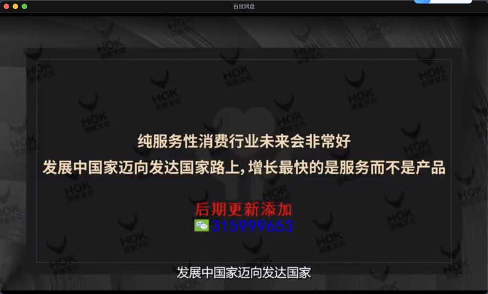

#  低成本创业

## 如何评估项目

`净利率= 净利润 / 收入` 
`毛利率 = (收入-成本) / 收入`

8个维度评估一个项目 
1.细分赛道评估 
2.单店投资金额 
3.回本的周期和盈利性分析 
4.门店的选址和人员配置 
5.产品的价格和结构  
6.店铺运营 
7.消费人群 
8.开店风险 

## 案例

### 鸡蛋灌饼

::: tip 细分赛道评估
适配城市广，一二三四线。品类好处是，没有周期性，春夏秋冬通杀，可以横跨早午晚餐，产品家喻户晓，用户不需要教育，开店就有生意。经营时间是早上6点到晚上10点，经营时间长，可平摊更多流量费用。
:::

::: tip 单店投资金额
门店面积10平米，投资成本低，5万元左右，月租金在一二线，差不多3到5千一个月。首批进货5000块钱，鸡蛋，面皮，蔬菜，蔬菜不能囤货。
:::

::: tip 回本的周期和盈利性分析
回本周期短，2-4个月，日营业额在一二三线城市，平均来说2000元左右，三线可能低一点，1500元左右，一线可能干到3000元。 
餐饮行业从完税的角度，把营业税，五险一金，所得税，都交齐了之后，按照最严格的证劵公司的我们上市的准则来说。把税扣掉之后，所有餐饮里面，大概的净利率。正餐净利率差不多10个点，快餐净利率达到6%，7%左右，火锅因为客单价偏高一些，它们的净利率差不多10%到15%之间，小吃净利率可达到15%，高的话20%都有。
:::

::: tip 门店的选址和人员配置
选址在大学城旁边，或大学城里面，交通的便纽，商业街，商业中心等,社区不是主战场,因为客单价不高，配送费也很高，所以不适合外带，所以它对线下人流的依赖性非常高。 
在选址上，跟一些快餐稍微有些不一样，主要是在人口增长比较快的一些区域，商业发展比较快的地方，因为那里打工人多，白领多。学会抱大腿，蹭流量，开在品牌便利店旁边，例如全家，罗森等。选择十字路口，三岔路口等交通便利位置。 
:::

::: tip 产品的价格和结构
客单价10元到13元左右。一般的鸡蛋灌饼，sku数量顶多10个，10个是个上限。
:::

::: tip 店铺运营
装修的时候，在门头上空出一些空间来，来把名字做大，吸引用户眼球，因为它的品类太简单了，就几个单品，所以一定要突出来。 
:::

::: tip 消费人群
白领上班一族，还有学生
:::

::: tip 开店风险
食品安全问题，鸡蛋别过期，肉别过期 
供货渠道要稳定 
不同地区口味不同，需要跟当地饮食习惯相结合，开发新口味
:::

### 肉饼

::: tip 小吃品类的优势
1.高频全时段，横跨早中晚餐 
2.容易出品牌，店铺密度决定了品牌影响力 
3.小吃的购买场景跟消费心理相对轻松，容易获得大多数认可 
4.小吃业态容易外带，可以打破空间限制 
5.供应链稳定，前端容易标准化 
6.口味重，容易上瘾
:::

::: tip 细分赛道评估
一二三四五六线城市都可以，但五六线客单价会低一些。营业时间早上7点到晚上10点。介于小吃跟快餐之间，偏快餐一点点。
:::

::: tip 单店投资金额
一家店20平米，单店投资成本8-10万。装修费，单平米500-800元。门店租金，只要是小吃类，月租金基本2000到5000不等。储备资金基本等于你的房租乘以3加上员工工资乘以3，就固定成本费用留出来三个月。
:::

::: tip 回本的周期和盈利性分析
单店平均日营业额5000元，好的话上万，回本周期半年。
:::

::: tip 门店的选址和人员配置
一个店的人员配置为2-4个人，选址选在商业街上（人流量比较大），学校的附近，还有办公楼，还有一些美食一条街，因为有早餐，基本很少开在商场里。
:::

::: tip 产品的价格和结构
人均价格6元，建议10-15个sku。门槛是，除了肉新鲜之外，馅里拌的一些调味料，一些中草药。
:::

::: tip 店铺运营
广告宣传基本三到五千元，打点广告，弄点海报，抖音上投点流，弄点达人
:::

::: tip 消费人群
学生，来往路人，上班族
:::

::: tip 开店风险
门店选址很重要，大多依赖于线下的自然流量 
口味要适宜大江南北 
:::

### 2平米的manner咖啡馆

::: tip 咖啡业态

主战场是现磨咖啡和即饮咖啡，尤其是现磨咖啡，过去几年增长非常快。中国的咖啡馆数量加起来将近十二万家，未来至少有10倍的增长空间，增长空间里，三线城市排第一，新一线排第二，一线第三，二线第四，因为二线的租金还偏高一点。
:::

::: tip 细分赛道评估
舶来品，非本土，咖啡馆赛道过去5年里，获得资本投资的前三项之一，一二三四线城市增速排名前三的一个品类
:::

::: tip 单店投资金额
manner有几种店铺，小店10平米，主力店型30到40平米，咖啡加烘焙的80平米，咖啡加烘焙加餐的（中午加一些白领的简餐）差不多150平米 
40平米的主力店，投资金额15万，装修费2万块钱，设备费4.5万，首批进货原料费3.5万，广告宣传8000，门店租金5000块钱，人员工资4000到5000
:::

::: tip 回本的周期和盈利性分析
一天单数可以干到350-450单，6个月回本。6-12个月肯定回本的这种生意就属于低成本创业，而且风险不大，且投资回报率周转很好。
:::

::: tip 门店的选址和人员配置
人员配置为两人，主张在三，四线城市开店，避开了主流竞争，选址在商业区，CBD，人流聚集的地方，社区也会开一些，但主流是前面说的三种店型。
:::

::: tip 产品的价格和结构
15-20元一杯，sku数量15个，有趣的现象是一杯咖啡，牛奶的成本还高过了咖啡豆的成本
:::

::: tip 店铺运营
:::

::: tip 消费人群
咖啡的刚需用户，年轻白领
:::

::: tip 开店风险
一二线竞争比较激烈
:::

### 炸串

`产品上的优势和创新差异化，是炸串竞争业态里的核心竞争力`

::: tip 细分赛道评估
千亿市场，过去两三年增长比较快，2020年全国的炸串企业注册量，达到了7000+。 
产品没有地域性，全国人民都能吃 
重口味，符合年轻女性喜好 
以蛋白类为主，性价比较高 
:::

::: tip 单店投资金额
20平米，投资金额10万元
:::

::: tip 回本的周期和盈利性分析
回本周期6-10个月。日营业额，低的话2000，3000，高的话可以干到5000，6000。20%净利润。
:::

::: tip 门店的选址和人员配置
开店位置以社区，街边为主，注意一定要是年轻人喜欢去的地方。人员最多两人。
:::

::: tip 产品的价格和结构
客单价平均来说，三四五线城市基本是13，15块钱。产品数量总体来说，控制在20个以内，稍微多点就30个以内，因为你是20平米。
:::

::: tip 店铺运营
在线上要做一些传播，宣传 
在同城里做外卖也是可以的，但外卖的订单金额可能要高一点，比如30块钱起送，因为15块钱送的话，利润就低了，因为平台要扣一部分钱。 
因为消费人群是Z时代人群，他们喜欢尝鲜猎奇，就意味着我们要不断创新，所以每个月要上新品，至少应该上五分之一的新品
:::

::: tip 消费人群
Z时代人群（Z时代人群的消费特点是1.以悦己为核心，重口味挺好，2.以尝鲜猎奇为主，需要品牌保持上新速度，3.做饭的意愿不高，偏好小吃，快餐）
:::

::: tip 开店风险
竞争相对激烈
:::

### 卤味

`很多创业者犯的经常犯的错误是找到了非常好的地址，房租非常高，营业额上不去，房租占营收的大头`

::: tip 热卤的优点
1.四季都可以卖，不存在很强的周期性。 
2.顺应年轻人的健康需求，现卤现捞，0添加。 
:::

::: tip 细分赛道评估
两到三千亿的市场规模。 
进入门槛不高，所以可能竞争对手比较多，厨艺上，工艺的标准化较低。 
卤制品行业还有一些特点，它的产业涉及的层次比较多，链条长，沟通频繁，所以数字化运营能力需要提高。
:::

::: tip 单店投资金额
面积20-25平米，投资额是10万-13万。装修费每平米600，800不等，最多2万元搞定。首期进货费，原料费差不多4万元左右。开业费（海报，宣传，做些广告，投些流量曝光）控制到几千元。门店租金4000元每月。人员工资在三四五线城市，一个月3000元左右。水电杂费1000到1500。
:::

::: tip 回本的周期和盈利性分析
5-8个月回本，毛利率集中在60%，70%不等，其实只要过了60%的话，生意做起来还是不错的
:::

::: tip 门店的选址和人员配置
大店4个人，小店2个人。对于三四五线，对线上能力不强的创业者，门店选址必须具备强大的人流量。 
哪里有人流呢？商业街，两个社区的交界处，结合点，也有非常不错的人流。商场在第一阶段不建议。农贸市集也是巨大的人流。
:::

::: tip 产品的价格和结构
客单价13-15，口味香辣为主，sku数量10-15个
:::

::: tip 店铺运营
营业时间为上午10点到晚上10点
:::

::: tip 消费人群
喜欢吃零食的年轻人，城市的家庭人员（把热卤当做餐），主要以年轻人为主，年轻人里女性偏多
:::

::: tip 开店风险
1.食品安全问题，小厨房需要保持足够干净 
2.店铺拓展时容易失控，中央厨房配送不到位 
:::

### 水果捞

`上游供应稳定的情况下，随着行业的渗透率越来越高，价格会越来越低`

::: tip 水果捞满足了几种需求
1.懒人经济 
2.消费升级的新需求"混搭"水果 
:::

::: tip 水果捞的难度在于
1.线上获客能力（水果捞这个品类，每家店里面的收入，大头不是来自于线下的人流，大头更多来自于线上的订单，原因是这个品类还是相对新一点，而且面对的人群偏女性，喜欢健康饮食的人群为主） 
2.消费诉求非刚需，群体较为小众
:::

::: tip 细分赛道评估
水果行业很大，水果捞是水果行业的升级版，行业规模过千亿，因为水果就过千亿，它的升级版肯定是过千亿 
水果捞市场很大，但渗透率并不高 
主战场还是一二三线为主 
行业集中度低，没有强势品牌，仍处于少年期
:::

::: tip 单店投资金额
单店面积20平米左右，单店投资成本基本在10万元左右。装修费2万元，设备费2万元左右。因为在一二三线城市，租金高些8000元，因为房租高，员工3人，就要求单店的每日产出金额要高
:::

::: tip 回本的周期和盈利性分析
4-8个月回本，毛利率50%-55%
:::

::: tip 门店的选址和人员配置
选址选在商业中心，CBD，学校，在一些商圈，比如电影院，购物中心也可以开。 
人员为3个人，因为需要制作，需要削水果，需要一两个制作人员
:::

::: tip 产品的价格和结构
客单价20-25元不等，注意客单价在25元，基本就很难在五六线城市开了。 
sku数量为30个左右 
产品结构，水果捞占60%—70%，还有30%就还是一些水果盘
:::

::: tip 店铺运营
:::

::: tip 消费人群
年轻人为主，女性为主
:::

::: tip 开店风险
存货损耗，需要控制水果的购入量 
竞争品牌化，需要提高品牌意识，打造品牌系统
:::

### 豆腐花

`想要创新一些品类，建议大家翻一翻饮食文化的历史书`

::: tip 豆腐花爆火的原因？
1.豆制品在中国有非常悠久的饮食文化根源 
2.豆腐花兼具了健康跟好吃
:::

::: tip 细分赛道评估
没有周期性，春夏秋冬都可以吃 
不需要教育 
年轻人喜欢 
健康 
:::

::: tip 单店投资金额
单店投资额十万以内，设备费两三万块钱，房租三四千块钱一个月，基本也是在三四五线为主。装修一两万块钱搞定。
:::

::: tip 回本的周期和盈利性分析
6-8个月回本，一天至少要300单，毛利率70%以上
:::

::: tip 门店的选址和人员配置
人员配置为4个人。选址还是要偏向于年轻人汇聚的地方多一些，还有大的社区的聚集地。商场，商业街也可以开，因为它的主流人群还是25岁左右的年轻人为主
:::

::: tip 产品的价格和结构
客单价6-10块钱,这个客单价基本是三四五线为主了。sku数量30个左右，50个是底线。
:::

::: tip 店铺运营
:::

::: tip 消费人群
20到35岁左右这个范围。25，28，23，5岁的年龄差，这个人群实际上是偏主类的，这些人群喜欢健康的东西，时尚的东西。中年人不是核心人群。
:::

::: tip 开店风险
食品安全--靠设备解决 
口味才是决胜的关键---每个月/每个季度要上新 
:::

### 包子铺

`最好的生意是市场规模大，但没有龙头` 
`最好的服务是没有服务` 
`定价太低，容易导致加盟商不挣钱`

::: tip 细分赛道评估
偏小快餐 
规模：市场规模将近千亿 
特点：没有周期性，春夏秋冬都可以吃 
时间段：没有太多的时间段，可能早餐占比稍微高一点，一般早餐占每天的收入比是30%-40%。 
区域特征：相对有些明显，因为口味有些不一样 
:::

::: tip 单店投资金额
单店面积20-30平米，投资金额15万左右。装修费用两三万，设备费用2-4万之间。员工费用1万2到1万5之间。
:::

::: tip 回本的周期和盈利性分析
6-10个月回本，每日营业额6000元，店铺算中上等。
:::

::: tip 门店的选址和人员配置
人员配置4个人，因为需要人现场的包。选址主要是在上班的路上，公交站，地铁站，岔路口，还有社区住宅和菜市场。
:::

::: tip 产品的价格和结构
包子的价格2块到4块不等。sku数量20个。
:::

::: tip 店铺运营
营业时间，早上6点到晚上10点
:::

::: tip 消费人群
白领为主，年轻人为主
:::

::: tip 开店风险
:::

### 阿贵锅贴

`好的生意正向现金流很好，不用银行贷款和负债` 
`早餐店建议增加午餐业务，增加边际利润` 

::: tip 餐饮店如何选择主打品类？
占你收入最高的是哪个，就主打哪个品类
:::

::: tip 早餐增长不错的原因
1.主打早餐的垂直类店数量不多 
2.品牌化率很低 
:::

::: tip 早餐店的特性
早餐的收入占大头，以线下自然人流为主 
可以慢慢工厂化，建议"现包现蒸"，口味更佳 
运营操作上标准化，不需要专业厨师 
:::

::: tip 细分赛道评估
锅贴的母品类，母赛道是早餐。整个中国餐饮市场，早餐有将近2万亿的市场规模，且它的复合增长率将近了8%的增速。 
没有季节性，全年无淡季 
严格来说还是有些地域化，主要经营区域还是长江以南为主 
:::

::: tip 单店投资金额
以早餐为主，40平米左右，投资金额约15万，设备费5万-8万元之间，租金5000-7000不等。
:::

::: tip 回本的周期和盈利性分析
回报周期6个月到1年不等，单数一天200-300单，如果能做到500单，日销售额5000元，算是比较不错的，3000元的日销售额，在二线城市稍微紧了一些，四五线还好。
:::

::: tip 门店的选址和人员配置
人员配置为4个人。选址还是选在人流量偏大的地方，比如交通路口，地铁站，公交站门口，大的小区的结合部。
:::

::: tip 产品的价格和结构
6块钱10个，6毛钱一个。客单价10元以内。sku数量控制在20个以内。毛利率60%-70%之间。
:::

::: tip 店铺运营
:::

::: tip 消费人群
涵盖了，老人，中年，青年，上班族
:::

::: tip 开店风险
食品安全 
制作的标准化上，一定要简单，快速，缩短等待时间 
选品上可能出错，选的品类太少了或过于多了 
:::

### 轻食

`轻食受众小但粘性高，创业重品牌，靠线上获客` 
`创业者本身要对“轻生活方式”极度认可` 
`高客单价可以抵消波段性和周期性` 
`挣钱的核心：竞争不要太激烈，复购要高` 

::: tip 轻食的三大特点
1.口味轻 
2.制作过程轻 
3.年轻人为主 
:::

::: tip 挑战
周期性---秋冬销量下滑 
波段性---以午餐晚餐为主 
:::

::: tip 细分赛道评估
品类属于发展初期阶段 
业态还没有深入到四五六线 
口味很轻，少油，少盐，糖也很低 
赛道超过千亿市场，每年增速也超过了10% 
它的品牌算是生活方式品牌 
生活方式品牌在价位上，一般都会比平价要高一些 
主要还是一二线城市里面的中高端人群高频次的东西 
:::

::: tip 单店投资金额
投入金额10万元，店铺面积20到30平米，房租4000元到7000元不等，装修费2-3万元
:::

::: tip 回本的周期和盈利性分析
:::

::: tip 门店的选址和人员配置
人员配置为2个人。围绕城市中各个区的CBD，高等商圈，商场，开店。
:::

::: tip 产品的价格和结构
客单价在25-30。
:::

::: tip 店铺运营
:::

::: tip 消费人群
年轻人，女性偏多，男女比例三七开
:::

::: tip 开店风险
店铺选址 
囤货---别把货买多了 
开业时机---别在冬天开业
:::

### 麻辣烫

`做麻辣烫，前期尽量还是以直营或联营为主`

::: tip 中国麻辣烫消费者年龄分布
30-39岁的群体占了37.5% 
20-29岁的群体占了28.8% 
集中人群是30+岁，注重健康，不再执着于油炸与卤味 
:::

::: tip 快餐餐饮特征
面积较大，40-100平米 
操作难度比较大，需要有人来煮，来切，来蒸
:::

::: tip 全球餐饮存在的共性
小吃餐饮化 
主食拆分，可以做一些大的餐饮连锁品牌 
各种食材放在一起乱炖
:::

::: tip 细分赛道评估
市场规模过千亿 
属于快餐 
:::

::: tip 单店投资金额
投资金额10万到15万不等，面积40到80平米不等。
:::

::: tip 回本的周期和盈利性分析
日营业额至少3000元，能做到5000元就非常不错了，因为我们在三四五线城市。 
毛利率60%-70%之间 
回报周期6个月到1年不等 
:::

::: tip 门店的选址和人员配置
人员配置3+1。
:::

::: tip 产品的价格和结构
一二线的客单价为25-40。三四五六线客单价为15-20。
:::

::: tip 店铺运营
营业时间总体打的还是，午餐，晚餐跟宵夜 
:::

::: tip 消费人群
年轻女性为主
:::

::: tip 开店风险
优缺点并存---麻辣烫有着低门槛，易复制的优点，对于创业者来说是一大优势，但同时也成了行业的一个缺点，产品同质化严重 
食材风险---食材的新鲜程度，决定顾客对这家麻辣烫店的印象和口碑，还有食材储备问题 
经营风险---在正式营业之前，前期市场调查，后期的设备，装修等都要准备，还要对当地的消费习惯，价格有一定的了解
:::

### 牛肉汤粉

`大部分的底层规则，都是把一个好的产品或者小项目，最后放大` 

`饮食文化的核心是有没有文化，有文化好处就是不用教育了` 

`当一个行业渗透率较高时，需要开始进行功能性细分`

::: tip 细分赛道评估
米粉在中国已经有超过2000年的文化历史。 
在中国据统计有40%以上的居民把米粉作为早餐 
赛道很好但需要细分 
:::

::: tip 单店投资金额
店铺面积60平米。投资金额15万元。租金在三四五线城市的话是2000-4000元。
:::

::: tip 回本的周期和盈利性分析
6-12个月回本。一天卖200-300份。
:::

::: tip 门店的选址和人员配置
人员配置为2个人。选址在人流量比较大的社区，商业街，城乡结合部，大学。sku数量10个以内。
:::

::: tip 产品的价格和结构
一二线城市的客单价为25到40元。三四五线的客单价上限为20到25元，一般情况下是13到15元。
:::

::: tip 店铺运营
营业时间早10到晚10
:::

::: tip 消费人群
年轻女性偏多一点
:::

::: tip 开店风险
食品安全 
集中采购 
:::

### 椰子冻

`创业的成功一定踩到了某些红利`

::: tip 餐饮赛道的红利
1.品类红利---赛道够新，没什么人做 
2.人群红利---东西是卖给谁很重要，中国目前消费行业最值钱的人群是年轻女孩 
3.流量红利---要懂得流量的运营和流量的玩法
::: 

::: tip 细分赛道评估
椰子冻本质是甜品，据调查吃甜品的00后人数100%，90%的人把甜品作为生活中的一部分。 
主打一二线，然后三四线，往五六线走早了一点 
:::

::: tip 单店投资金额
单店面积30-40平米。投资金额15万。人员工资1万元，首次采购5万元。
:::

::: tip 回本的周期和盈利性分析
:::

::: tip 门店的选址和人员配置
人员配置为2个人 
选址在地铁口附近，一流商圈（在一流商圈里面的二三流位置），高铁站，社区，CDB办公楼，大学城 
:::

::: tip 产品的价格和结构
一二线客单价30-35元。三四线客单价15元。 
产品结构上，就几大系列，椰子冻，椰子冰，椰子水，椰子汁 
:::

::: tip 店铺运营
线上要做本地化传播，要做宣传，做明细，做一些IP
:::

::: tip 消费人群
90后，00后的年轻人为主
:::

::: tip 开店风险
:::

### 烤榴莲

::: tip 细分赛道评估
高速发展期 
主打一二三线城市，四五六线稍早了一些。
:::

::: tip 单店投资金额
店铺面积3到5平米。投资金额2万元。
:::

::: tip 回本的周期和盈利性分析
一个月回本。
:::

::: tip 门店的选址和人员配置
人员配置1个人，最多2个人。 
选址在夜市，社区，店中店。开店位置需要一定的稳定的人流量 
:::

::: tip 产品的价格和结构
客单价15到20元。sku数量10个以内。
:::

::: tip 店铺运营
:::

::: tip 消费人群
25-35岁女性为主
:::

::: tip 开店风险
囤货风险 
口味上 
流动摊位证
:::

### 螺蛳粉

`创业者不能上来就创新，应该在学习的基础上加上微创新`

::: tip 强势品牌
群众认知度高 
街头覆盖率高 
连锁化
:::

::: tip 细分赛道评估
行业规模大，增速快，但市场潜力还没被释放 
2020年整个螺蛳粉行业的销售额大约150亿，但螺蛳粉行业的线下销售只有43%，说明线下有巨大空间 
:::

::: tip 单店投资金额
单店面积60平米，单店投资金额15万 
:::

::: tip 回本的周期和盈利性分析
6到12个月回本。
:::

::: tip 门店的选址和人员配置
人员配置2个人。选址方面，少开在商务地点，尽量开在夜市里面，美食街，小区和商场也ok，总体来说还是开在人流量相对比较大的一些地方。不要开在那些通风条件特别不好的一些位置。
:::

::: tip 产品的价格和结构
sku数量15个以内。客单价20到25元。在二线的省会城市，日营业额到3000就合格了，5000到6000算是不错。
:::

::: tip 店铺运营
营业时间早十到晚十
:::

::: tip 消费人群
年轻喜欢重口味的人群为主
:::

::: tip 开店风险
:::

### 小酒馆 

`永远不要低估那些小档口，小地摊，它们往往是我们生活的最根源的东西` 
`伟大都是来自于平凡，就是在不起眼的地方最有生命力，反而企业最后变得很大` 
`为了保证翻台率，可以采取套餐化模式` 

::: tip 细分赛道评估
小酒馆市场规模过千亿 
增速很快 
:::

::: tip 单店投资金额
单店面积80平米。投资金额20万。首批进货2到3万，装修费5到7万元。设备费4到5万元。
:::

::: tip 回本的周期和盈利性分析
6到12个月回本
:::

::: tip 门店的选址和人员配置
人员配置为2+1，或者3+1。 
选址在小酒馆集中点，酒吧一条街，居民集中地段，旅游宾馆附近，高档住宅小区，外事机构集中地段。 
:::

::: tip 产品的价格和结构
客单价70-80元。小酒馆套餐化之后，基本就6-7个套餐。
:::

::: tip 店铺运营
营业时间是中午到凌晨2点
:::

::: tip 消费人群
男女比例六四开，女生55到60，男生40到45。刚刚步入职业生涯时间不长的人。
:::

::: tip 开店风险
翻台率
:::

### 宠物店

`宠物行业在中国还属于相对比较早期的行业，所以要耐住性子慢慢养店` 
`宠物店创业，选址是重中之重` 
`零售的本质是具备流动性，周转快的特点。存货积压是大忌`

::: tip 细分赛道评估
中国宠物行业发展空间广阔，养宠渗透率预计未来将持续提升，2022年中国宠物经济产业规模将达4963亿 
宠物数量持续上升，在中国城镇家庭中，宠物猫的数量是5806万只，犬的数量是5429万只。
:::

::: tip 单店投资金额
单店面积60平米，投资金额15万到20万。
:::

::: tip 回本的周期和盈利性分析
平均营业额一天5000。6个月到18个月回本。
:::

::: tip 门店的选址和人员配置
人员配置2个人。 
 
门店选址 
1.社区店：主要`辐射周围社区1公里内`的客户 
2.商场店：适合`大型，连锁`的宠物店 
3.社区型商场店：靠近商场，周围可以辐射到一定范围的居民区，性价比很高。（创业者首选）
:::

::: tip 产品的价格和结构
宠物产品类的毛利50%-60% 
宠物服务类的毛利不一定有产品高，但它有边际利润
:::

::: tip 店铺运营
:::

::: tip 消费人群
单身人群，中高收入人群，企业管理者，平均来说这部分人群月收入1.5万左右
:::

::: tip 开店风险
选址很重要 
对宠物市场一定要有比较深的了解 
客户粘性的维护（服务类需要一些相对受过训练的人） 
:::

### 小型儿童书店

::: tip 细分赛道评估

:::

::: tip 单店投资金额
单店投资金额15到20万，面积60平米。
:::

::: tip 回本的周期和盈利性分析
日营业额3000元。回本周期半年到一年。
:::

::: tip 门店的选址和人员配置
人员配置为2人
:::

::: tip 产品的价格和结构
1.卖书 
2.借书（引流产品） 
3.读书会或沙龙活动（盈利性产品）
:::

::: tip 店铺运营
营业时间，周一到周五的晚上为主，周末为主，还有寒暑假的高峰期 
门店选址是儿童图书店最难的，需要区域的人流量足够大 

:::

::: tip 消费人群
女性占60% 
拥有较高文化水平的80，90后成为我国生育人群的主力，对儿童早期教育愈发重视，极大地促进了适龄目标读者的增加
:::

::: tip 开店风险
:::

### 洗鞋

::: tip 细分赛道评估
行业规模至少500亿，市场大，品牌集中度低，中度频次且刚需
:::

::: tip 单店投资金额
收鞋店10-15平米左右。标准店40平米左右。单店投资金额10万。
:::

::: tip 回本的周期和盈利性分析
8个月回本
:::

::: tip 门店的选址和人员配置
人员配置为2人 
不要开在有障碍物的地方，因为店比较小，会导致顾客看不到你 

:::

::: tip 产品的价格和结构
单个洗鞋费用15-30元，毛利率能到70%-80%
:::

::: tip 店铺运营
:::

::: tip 消费人群
90后，00后
:::

::: tip 开店风险

:::

### 家政服务

`纯粹的互联网流量思维，并不适用于对"人"依赖性强大的业务`

::: tip 细分赛道评估
市场规模几千亿，没有强势品牌 
一二三线目前需求量最大 
可以加盟具备家政服务人员培训这种能力的品牌
:::

::: tip 单店投资金额
店铺面积40平米，投资金额10万元，主要费用是获客营销的费用
:::

::: tip 回本的周期和盈利性分析
日营业额三四千元，净利率20%到30%
:::

::: tip 门店的选址和人员配置
人员配置2个人 
小区的楼下，或者商业中心的楼下
:::

::: tip 产品的价格和结构
小时工，大城市100块钱1小时，小城市50块钱1小时 
育儿嫂，月嫂，在北京5000到2万不等 
保姆在一线城市，四五千到七八千 
家政公司一般提成20%
:::

::: tip 店铺运营
对人的标准化难度相对高一些 
:::

::: tip 消费人群
男性比女性稍微偏多一点 
双职工家庭
:::

::: tip 开店风险
需要培训 
续费率（阿姨跳单）
:::

### 手机配件店

::: tip 细分赛道评估
中国的手机配件市场的销售额过千亿
:::

::: tip 单店投资金额
单店面积10平米，投资金额10万
:::

::: tip 回本的周期和盈利性分析
日营业额2000到3000元，净利润10%-20% 
6-8个月回本 
:::

::: tip 门店的选址和人员配置
人员配置1个人 
选址在居民区，商场，大学周边，数码广场（客流量很大，环境很成熟，当地有非常高的知名度，不用储备太多配件，可以到就近去拿，减少备货压力，缺点是这种广场一个城市很少，开不了几家店） 
 

:::

::: tip 产品的价格和结构
手机贴膜，20-50块钱贴一个 
手机壳，充电宝，充电线，个性化手机壳定制，手机护理，手机维修
:::

::: tip 店铺运营

:::

::: tip 消费人群
:::

::: tip 开店风险
存货损耗（一次性进货不要太多） 
利润率（房租高也有些风险，进货渠道最好是一手货源）
:::

### 商超里的小型儿童乐园

`创业能否成功，企业家的能力并不能起绝对因素，但是势能可以`

::: tip 细分赛道评估
:::

::: tip 单店投资金额
单店面积40平米，最多80平米，最小20平米。标准店铺，60平米，投资金额10-15万。 
:::
 
::: tip 回本的周期和盈利性分析
日营业额2000元，净利率30%。 
6到10个月回本 
:::

::: tip 门店的选址和人员配置
人员配置为0人 
选址方面，一线城市不是很多，因为租金很贵，主打二三四线城市，尤其是三线城市
:::

::: tip 产品的价格和结构
娃娃机，梯子，电竞的车
:::

::: tip 店铺运营
:::

::: tip 消费人群
2到10岁的亲子消费
:::

::: tip 开店风险
选址风险，选址一定要选人流量比较大的，建议背靠几个社区（中高端社区），有商场人流，社区商场店，且一定要调查一下那个区域的父母的消费能力 
:::

### 花店

`围绕生活价值主张，延展产品品类，专为一群人的生活方式服务` 

`消费习惯一旦形成，就很难改变`

::: tip 细分赛道评估
在一二线城市，准一线，频次是中频，市场规模2000亿
:::

::: tip 单店投资金额
单店面积30平米，单店投资金额15万
:::

::: tip 回本的周期和盈利性分析
日流水最低3000到4000，最高7000到8000，三个人的话，必须得过5000
:::

::: tip 门店的选址和人员配置
人员配置为2+1 
选址一般在繁华的商业街，或者人流大的地区，还有中高端社区和医院旁边
:::

::: tip 产品的价格和结构
鲜花加服务 (花艺)加礼品(香薰) 
客单价是几十元到三四百元之间
:::

::: tip 店铺运营
中高端花店，装修一定要花大钱，精神消费，买的就是一种感觉，一种气氛 
在二线，三线城市里开花店，不要做异地配送，就做同城 
订单方面，线上为主，线下为辅，因为目前买花的主流人群是网民 

:::

::: tip 消费人群
:::

::: tip 开店风险
鲜花的保养 
花艺设计（让店铺的服务的溢价增高，而不是只卖原材料）
:::

### 水母

::: tip 细分赛道评估

:::

::: tip 单店投资金额
店铺面积10平米，单店投资金额10万元
:::

::: tip 回本的周期和盈利性分析
日营业额3000到5000元，净利率至少20%
:::

::: tip 门店的选址和人员配置
人员配置为1到2人
:::
 
::: tip 产品的价格和结构
客单价高的话1500元一只，便宜的15块钱一只，购买总体价格150-200元 
:::

::: tip 店铺运营

:::

::: tip 消费人群
父母帮小孩买，他们一般买的是低价水母 
潮流时尚女孩，KOL，单身宅男宅女们，他们一般买的都是过了两三百的水母
:::

::: tip 开店风险
水母有毒，不是特别容易活 
拿货渠道稀缺 
:::

