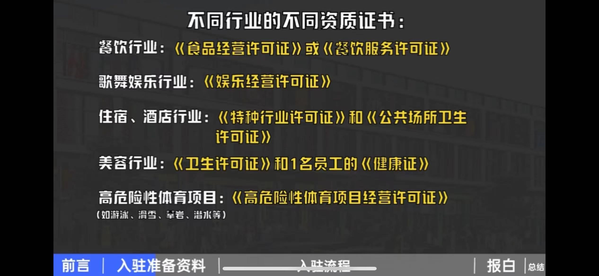

# 本地生活运营师

## 如何帮商家入驻抖音

 

:::details 第一类商家的入驻流程
1.准备资料： 
①抖音账号，建议绑定的是法人或店长的号码 
②银行卡，以企业法人的身份开通的 
③营业执照照片，经营类目要确认 
④行业资质证件，不同行业不一样 

⑤法人的身份证正反面照片 
⑥门头照片，包括门店招牌字和门面 
⑦手机号码，法人实名认证的 
⑧高德地图门店位置 
⑨商标注册证照片，多门店认领时需要 
2.进入抖音来客APP，点击入驻抖音门店 
3.入驻抖音来客后，绑定抖音号，获得蓝V标志，内容营销，团购推广等权益 
:::

## 商家账号装修

### 账号主页装修

:::details 昵称
昵称要与账号主体相关
:::

:::details 头像
最好不要用人物头像，可使用店铺相关的图片做头像 
比如店铺logo，门头照片，食物照片，内部环境照片
:::

:::details 背景图
使用店铺相关的图片做背景图 
比如店铺logo，门头照片，食物照片，内部环境照片，团队成员照片 
图片大小不要大于5兆，否则官方会把图片进行压缩 
可直接加入点击关注类的引导语
:::

:::details 简介
最多4行，超过会折叠，需突出店铺的价值和差异点
:::

### 门店主页装修

:::tip
在抖音来客的门店管理以及门店装修中去完成
:::

### 商家页面装修

:::tip
进入抖音来客，在首页找到抖音号装修，进入装修页
:::

## 收款账户

::: tip
对公账户的开卡账户必须是所认领的门店 
个人账户的银行卡必须是用营业执照上的法人身份证开的银行卡
:::

## 团购设置的基本思路

`团购套餐 = 商家有钱赚 + 顾客觉得性价比高`

:::tip 团购数量
团购数量越精简越好，一般情况2-5个 
如果开直播，团购数量4个及以上
:::

### 主打利润款

## 抖音外卖

抖音外卖分两种，一种是抖音直营外卖，一种是饿了么小程序外卖。
抖音直营外卖只能购买商家设置好的团购套餐，暂时不支持自选点餐。
饿了么小程序外卖会自动跳转到饿了么小程序，可以自行选择，跟平常点外卖一样。
抖音直营外卖最多支持7天内的预点餐，可以先囤后送。
饿了么小程序支持2天内的预点餐，也没有先囤后送的功能。
抖音没有自己的配送平台，它和达达，顺丰，闪送合作，商家也可以选择自配送

平台抽佣，抖音大约是商品交易额的百分之2.5，而如果是饿了么小程序外卖，不仅需要给抖音平台抽佣2.5%，还要给饿了么抽佣，并且饿了么的抽佣占比更大，大概在百分之22，不同细分行业，这个数字可能会上下浮动

## 抖音外卖开通流程

抖音外卖开通的前提是，商家已经成功入驻了抖音来客。

在抖音来客app首页找到`团购配送`的开通入口，进入后勾选同意协议，就可以一键开通配送服务。

接着选择配送方案，共有三种方案，前两种都是平台配送方案，区别是在于品类，一类是餐饮类，一类是面包烘焙类，最后一种是商家自配送，需要商家自己联系骑手，建议商家选择平台配送。接下来点击立即签约，就完成签约了。

完成协议签署之后，来客首页就会新增和配送相关的功能入口。比如`配送订单`，`配送设置`。进入到配送订单可以看到3个任务分别是`设置配送信息`，`创建配送商品`，`开启接单状态`。

## 抖音外卖组品

外卖团购和到店团购，外卖团购只是多了一个配送的服务，在组品方面二者差别不大。

外卖团购的设置，建议不少于3个，一般甜品菜饮类>=8个，效果会比较好。其他品类，在5个左右，效果会比较好。

也可以将到店团购作为外卖的组品。有三种方式，第一种是直接复制，这种比较适合堂食限制不大，且利润较高的品类。低价引流品不适合直接复制做外卖，因为用户一次只能下单一个团购。第二种是微调菜品，对于要附送锅具烤盘的品类，可以通过微调菜品来控制成本。第三种是适当加价，如果菜品本来就不多或者替换选择较少的话，也可以选择适当加价。

还可以基于用餐场景组品，比如居家聚餐，外出聚餐，工作餐

## 抖音外卖商品信息怎么设置

### 外卖团购的标题

外卖团购的标题可以采用信息叠加法，把外卖套餐的关键信息列出来，排列组合就可以组成标题。

`标题公式：【外卖】+几人餐+品类+亮点+场景`

### 外卖团购的图片

外卖团购的图片有4种选择，一是全套菜品图，放在一张图片上展示，直观一，一看就明白。二是放招牌菜品图，选择套餐内的招牌菜品，制作成精美的图片，比较抓人眼球。三是店铺logo图，直接给店铺打广告。四是文字说明图，容易引起用户的注意。无论是选择哪种图片，都要清晰，美观，有冲击力。图片比例要选择4:3的比例，其他比例会被系统裁切或者拉伸变形。

## 抖音外卖种草视频应该怎么做

种草视频由以下3个部分组成
制造噱头（比如1毛钱能吃到什么）
产品介绍（套餐多少钱，有哪些菜，量怎么样，销量如何，吃起来怎么样）
引导购买（门店多）

### 外卖种草视频应该怎么做策划

短视频是由文案，画面，以及背景音乐，三部分组成

#### 文案

##### 文案开头
外卖种草视频的开头很重要，他决定了是否能够吸引人不划走

| 开头类型  |
| ----  |
| 低价吸引 |
| 场景带入 |
| 测评种草（又分真测评和假挑战） |
| 蹭热度 |

##### 文案中间

中间部分是外卖种草视频的重要内容，主要是对产品进行介绍，这部分文字多，所占用的时间长，文案应该尽量有画面感

`中间部分=价格怎样+有哪些菜+味道如何+有无福利`

##### 文案结尾

总结推荐，引导用户下单

