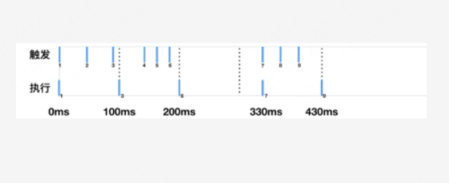

[toc]


# 手写代码

## 实现一个依赖注入函数

```js
function Dependence (dependence) {
    this.dependence = dependence
}

Dependence.prototype.inject = function (fn) {
    let string = fn.toString()
    let deps = string.substring(string.indexOf('(')+1, string.indexOf(')')).split(',')
    deps = deps.map(dep => {
        return this.dependence[dep.trim()]
    })

    return function () {
        return fn.apply(this, deps)
    } 
}


var dependences = {
    dep1: function () {
        return 'This is dep1'
    },
    dep2: function () {
        return 'This is dep2'
    },
    dep3: function () {
        return 'This is dep3'
    },
    dep4: function () {
        return 'This is dep4'
    }
}

var dependence = new Dependence(dependences)

var myFunc = dependence.inject(function (dep3, dep1, dep2) {
     return [ dep1(), dep2(), dep3()].join('->')
})     

console.log(myFunc()) // This is dep1 -> This is dep2 -> This is dep3

```


## 用`reduce`实现数组`flat`方法


```js
const flat = ( data, layer = 1 ) => {
    layer = layer < 1 ? 1 : layer
    const result = data.reduce( ( previousValue, currentValue ) => {
        if ( currentValue instanceof Array && layer > 1 ) {
            currentValue = flat( currentValue, layer - 1 )
        }
        return previousValue.concat( currentValue )
    }, [] )
    return result
}


console.log( flat( [ 1, 2, [ 3, 4, [ 5, 6, [ 7 ] ] ] ], Infinity ) )
console.log( flat( [ 1, 2, [ 3, 4, [ 5, 6, [ 7 ] ] ] ], 1 ) )
console.log( flat( [ 1, 2, [ 3, 4, [ 5, 6, [ 7 ] ] ] ], 2 ) )
```


## 实现Array.prototype.reduce

```js
Array.prototype.customReduce = function (fn ,initialValue) {
    const array = this
    let prevValue = initialValue !== undefined ? initialValue : array[0]
    for (let i = initialValue !== undefined ? 0 : 1 ; i < array.length; i++ ) {
        prevValue = fn(prevValue, array[i], i, array)
    }
    return prevValue
}
```

## 使用Proxy实现数组负索引

```js
const arr = [ 1, 2, 3 ]
const proxy = new Proxy(arr, {
    get (target, key, receive) {
        if (key < 0) {
            key = target.length + Number(key)
        }
        return Reflect.get(target, key)
    }
})
```

## 列表转为树

```js
let tree = [
    { id: 0, name: "中国" },
    { id: 1, pid: 0, name: "广东省" },
    { id: 2, pid: 1, name: "深圳市" },
    { id: 3, pid: 1, name: "广州市" },
    { id: 4, pid: 0, name: "陕西省" },
]


const fn = (tree) => {
    const map = {}
    let result = []
    tree.forEach(ele => {
        map[ele.id] = ele
    })
    tree.forEach(item => {
        const parent = map[item.pid]
        if (parent) {
            ( parent.children || (parent.children = []) ).push(item) 
        }else {
            result.push(item)
        }
    })

    return result[0]
}

/*
{
    id: 0,
    name: '中国',
    children: [
        {
            id: 1,
            pid: 0,
            name: '广东省',
            children: [
                {
                    id: 2,
                    pid: 1,
                    name: "深圳市"
                },
                {
                    id: 3,
                    pid: 1,
                    name: "广州市"
                }
            ]
        },
        {
            id: 4,
            pid: 0,
            name: "陕西省"
        }
    ]
}
*/
console.log(fn(tree))
```


## new
```js
function new ( fn, ...args ) {
    const obj = Object.create( fn.prototype )
    const result = fn.apply( obj, args )
    if ( result && ( typeof result === 'object' || typeof result === 'function' ) ) {
        return result
    }
    return obj
}
```


## 防抖
```js
function debounce ( fn, delay ) {
    let timer = null
    return function () {
        const context = this
        const args = arguments;
        if ( timer ) { clearTimeout(timer) }
        timer = setTimeout( () => {
            fn.apply( context, args )
        }, delay)    
    }           
}
```


## 节流
```js
function throttle ( fn, delay ) {
    let flag = true;
    return function () {
        if ( !flag ) return
        let context = this
        let args = arguments
        flag = false
        setTimeout( () => {
            fn.apply( context, args )
            flag = true
        }, delay )
    }
}
```

## 深拷贝
```js
function deepClone ( data ) {
    if ( typeof data === 'object' ) {
        const result = Array.isArray( data ) ? [] : {};   
        for ( let key in data ) {
            if (typeof data[key] === 'object' ) {
                result[key] = deepClone( data[key] )
            } else {
                result[key] = data[key]
            }
        }
        return result
    } else {
        return data
    }
}
```


##  call
```js
Function.prototype._call = function ( that ) {
    that.fn = this        
    const args = [ ...arguments ].slice( 1 )
    const result = that.fn( ...args )
    delete that.fn
    return result
}
```


##  apply
```js
Function.prototype._apply = function ( that ) {
    that.fn = this        
    const args = arguments[1]
    const result = args ? that.fn( args ) : that.fn()
    delete that.fn
    return result
}
```


## bind
```js
Function.prototype._bind = function ( obj ) {
    if (typeof this !== 'function') throw new Error('not a function')
    const context = obj ?? window
    const that = this
    const args = [ ...arguments ].slice( 1 )
    const Temp =  function () {};
    const result = function () {
        return that.apply(this instanceof result ? this : context, [...args, ...arguments])
    }
    Temp.prototype = this.prototype
    result.prototype = new Temp()
    return result
}
```


## instanceof
```js
function _instanceof (left, right) {
    let prototype = right.prototype;
    let proto = left.__proto__;
    while ( true ) {
        if ( proto === null ) return false;
        if ( proto === prototype ) return true;
        proto = proto.__proto__;
    }
}
```


## 手写MVVM


```js
class Observer {

    constructor (data) {

        this.$data = data
        this._proxyData()

    }            

    _proxyData () {
        
        const keys = Object.keys(this.$data)
        for (let key of keys) {
            Object.defineProperty(this, key, {
                get () {
                    return this.$data[key]
                },
                set (val) {
                    this.$data[key] = val
                }
            })
        }

    }

    observe ( key, handlers ) {

        const value = this.$data[key]
    
        Object.defineProperty(this.$data, key, {
            get () {
                handlers.get(value)
                return value
            },
            set (val) {
                if (val === value) return
                handlers.set(val, value)
                this.$data[key] = val
            }
        })
    }

}

const data =  {
    key: 1,
    value: 'value'
}

const Vue = new Observer( data )
console.log( Vue.key )  // 1


Vue.observe('key', {
    get (val) {
        console.log('get')
    }        
})

console.log(Vue.$data.key )
```


## 获取随机数，要求是长度一致的字符串格式

```js
var random = Math.random()
random = random + '0000000000'
random = random.slice(0,10)
console.log(random)
```


## 编写一个通用的事件监听函数

```js
function bindEvent (elem, type, selector, fn){
    if (fn == null ) {
        fn = selector
        selector = null
    }
    elem.addEventListener(type, function(e) {
        var target
        if (selector) {
            target = e.target;
            if (target.matches(selector)) {
                fn.call(target, e)
            }
        } else {
            fn(e)
        }
    })
}
```

## 用ES5实现私有变量

```js
function Person(name){
    var _name = name;
    this.getName = function () {
        return _name
    }
}

var p = new Person('Ming');

console.log(p._name);    // undefined
console.log(p.getName());// Ming
```


## 使用面向对象方式维护一个列表，每个列表有一个删除按钮，点击删除按钮移除当前行

```html
<script>
window.addEventListener('DOMContentLoaded',function(){
    new List('.list');
})
class List{
    constructor(sel){
			this.el=Array.from(document.querySelectorAll(sel));
			let self=this;
			this.el.forEach(item=>{
				item.addEventListener('click',function(e){
					if(e.target.className.indexOf('del')>-1){
						self.removeItem.call(self,e.target)
					}
				},false)
			})
    }
		
    removeItem(target){
        let self = this
        let findParent = function(node) {
            let parent = node.parentNode;
            let root = self.el.find(item => {
                return item == parent
            })
            if(root){
                root.removeChild(node);
            }else{
    	       findParent(parent)
            }
    	}
        findParent(target)
    }
}
</script>
<body>
	<ul class="list">
		<li><span class="del">1</span></li>
		<li><span class="del">2</span></li>
		<li><span class="del">3</span></li>
		<li><span class="del">4</span></li>
		<li><span class="del">5</span></li>
		<li><span class="del">6</span></li>
		<li><span class="del">7</span></li>
		<li><span class="del">8</span></li>
	</ul>
</body>
```


## 发红包


```js
const fn = (remainSize, remainMoney) => {

    const result = []
    let min = 0.01
    let max, money
    while (remainSize > 1) {
        max = remainMoney / remainSize * 2    
        money = Math.random() * max
        money = money < 0.01 ? 0.01 : money.toFixed(2)
        result.push( Number( money ) )
        remainSize--
        remainMoney -= money
    }
    result.push( Number( remainMoney.toFixed(2) ) )

    return result

}

console.log(fn(10, 100))
console.log(fn(10, 64))
console.log(fn(4, 60))
```


## 用promise实现一个请求超时功能

```js
function promiseWithTimeout (url, delay) {
    return new Promise((resolve, reject) => {
        setTimeout(function () {
            reject('time is out')
        }, delay)
        fetch( url ).then( data => resolve(data) )
    })
}
```

## 手写函数

输入`[ [ 'a', 'b' ], [ 'c', 'd' ],[ 1, 2 ],[ 'd' ] ]`<br/>
输出`[ 'ac1d', 'ac2d', 'ad1d', 'ad2d', 'bc1d', 'bc2d', 'bd1d', 'bd2d' ]`

```js
const fn = ( list ) => {
    const result = []

    const dfs = (result, temp, index, list) => {
        if (temp.length === list.length) {
            result.push( temp.join('') )
            return
        }
        for ( let i = 0; i < list[index].length; i++ ) {
            temp.push(list[index][i])
            dfs(result, temp, index + 1, list)
            temp.pop()
        }
    }

    dfs(result, [], 0, list)
    
    return result
} 

console.log( fn( [ [ 'a', 'b' ], [ 'c', 'd' ],[ 1, 2 ],[ 'd' ] ] ) )
```

## 请实现flatten函数,值为null或者undefined丢弃

```js
var input = {
    a: 1,
    b: [ 1, 2, { c: true }, [ 3 ] ],
    d: { e: 2, f: 3 },
    g: null,
    f: undefined
}
const flatten = (data) => {

    const result = {}

    const handleObject = (val, key) => {
        if (val instanceof Array) {
            for (let i = 0; i < val.length; i++) {
                if (typeof val[i] === 'object') {
                    handleObject(val[i], `${key}[${i}]` )
                } else {
                    result[`${key}[${i}]`] = val[i]
                }
            }        
        } else {
            for (let k in val) {
                result[`${key}.${k}`] = val[k]
            }
        }
    }
    for (let [key, val] of Object.entries(data)) {
        if (typeof val === 'undefined') {
            continue
        } else if (typeof val === null) {
            continue
        }else if (typeof val === 'object') {
            handleObject(val, key)
        } else {
            result[key] = val
        } 
    }

    
    return result
}

var output = flatten(input);
console.log(output)
// output如下
{
    "a": 1,
    "b[0]": 1,
    "b[1]": 2,
    "b[2].c": true,
    "b[3][0]": 3,
    "d.e": 2,
    "d.f": 3,
}
```

## 请写一个countOfLetters函数

```js
const countOfLetters =  (str) => {

    let nReg = /[1-9]/
    let wordReg = /[A-Z]/
    const stack = [{}]

    const merge = (obj1, obj2) => {
        for (let key in obj1) {
            if (obj2[key]) {
                obj2[key] = obj2[key] + obj1[key]
            } else {
                obj2[key] = obj1[key]
            }    
        }
        return obj2
    }

    for ( let i = 0; i < str.length; i++ ) {
        const ch = str[i]
        if (wordReg.test( ch )) {
            const last = stack[ stack.length - 1 ]
            let count = 1
            if ( nReg.test( str[i+1] ) ) {
                count = Number(str[++i])
            }
            if ( last[ ch ] ) {
                last[ch] = last[ch] + count 
            } else {
                last[ch] = count 
            }
                
        }
        if ( ch === '(') {
            stack.push({})
        }
        if ( ch === ')') {
            if ( nReg.test( str[i+1] ) && ++i ) {
                const last = stack[ stack.length - 1 ]
                for (let key in last) {
                    last[key] = str[i] * last[key]
                }
                stack.push(merge(stack.pop(), stack.pop()))
            }
        }
    }
    return stack.pop()
}


console.log( countOfLetters('A2B3A') ) // { A: 3, B: 3 }
console.log( countOfLetters('A2B3') ) // { A: 2, B: 3 }
console.log( countOfLetters('A2B3A4') ) // { A: 6, B: 3 }
console.log( countOfLetters('A(A3B)2') ) // { A: 7, B: 2 }
console.log( countOfLetters('C4(A(A3B)2)2') ) // { A: 14, B: 4, C: 4 }
```


## 数字金额千分位转换

```js
const fn = ( num ) => {
    let newStr = ''
    num = num + ''
    let end = num.length - 1
    let count = 1 
    if ( num.indexOf('.') !== -1 ) { 
        end =  num.indexOf('.') - 1
        newStr = num.substring( end + 1 )
    }
    for ( let i = end; i >= 0; i-- ) {
        if ( count % 3 === 0 && count !== 1 && i !== 0 ) {
            newStr = ',' + num[i] + newStr
        } else {
            newStr = num[i] + newStr    
        }
        count++
    }
    return newStr 
}
console.log(fn(14290023.23)) // 14,290,023.23
console.log(fn(290023.23)) // 290,023.23
console.log(fn(1290023.23)) // 1,290,023.23
console.log(fn(1290023.235)) // 1,290,023.235
console.log(fn(129023)) // 129,023
```


## 实现节流函数,要求初次执行的时候立刻执行



```js
function throttle ( fn ) {
    let beforeTime = 0
    let timer = null
    return function (arg) {
        let currentTime = new Date().getTime()
        let count = currentTime - beforeTime
        if (count > 100) {
            fn(arg)
            beforeTime = new Date().getTime()    
        } else {
            timer && clearTimeout(timer)
            timer = setTimeout(()=> {
                fn(arg)
                beforeTime = new Date().getTime()    
            }, 100 - count )
        }
    }
}

const fn = throttle( (arg) => { console.log(arg) } )
setTimeout(() => {
    fn(0)
}, 0 )
setTimeout(() => {
    fn(50)
}, 50)
setTimeout(() => {
    fn(80)
}, 80)
setTimeout(() => {
    fn(140)
}, 140)
setTimeout(() => {
    fn(160)
}, 160)
setTimeout(() => {
    fn(180)
}, 180)
setTimeout(() => {
    fn(330)
}, 330)
setTimeout(() => {
    fn(370)
}, 370)
setTimeout(() => {
    fn(400)
}, 400)
// 0 80 180 330 400执行了
```


## 实现函数f，要求调用深度不限

```js
const f = (n) => {
    let count = n
    const add = (num) => {
        count += num
        add.val = count
        return add
    }
    add(0)
    return add
}

// f(1).val === 1
// f(1)(2).val === 3
// f(1)(2)(3).val === 6
// f(10)(100)(1000)(10000).val === 11110
```


## 有[1,2,3,4,5,6,7,8,9,10]的数组，要求实现一个函数

:::tip
要求<br/>
数字1在1秒后输出<br/>
数字2在数字1输出后的2秒后输出<br/>
数字3在数字2输出后的3秒后输出<br/>
以此类推,要求至少用两种方式实现
:::

```js
var arr = [ 1, 2, 3, 4, 5, 6, 7, 8, 9, 10 ]

const fn = (arr) => {

    const e = arr.shift() 
    setTimeout( () => {
        console.log( e )
        if ( !arr.length ) return
        fn(arr)
    }, e * 1000 )

}
fn(arr)                
```

```js
var arr = [ 1, 2, 3, 4, 5, 6, 7, 8, 9, 10 ]

const fn = async (arr) => {

    const f = (val, time) => {
        return new Promise((resolve)=>{
            setTimeout(() => {
                console.log(val)
                resolve()
            }, time)

        })
    }

    for (let val of arr) {
        await f( val, val * 1000 )
    }

}
fn(arr)                
```


## 实现一个对树型结构进行过滤的函数,要求不允许对原有的tree做任何修改


```js
var tree = [
    {
        name: 'A'
    },
    {
        name: 'B', 
        children: [
            {
                name: 'A'
            },
            {
                name: 'AA', 
                children: []
            }
        ]
    },
    {
        name: 'C'
    }
]
const fn = (str) => {
    const f = (tree) => {
        let result = []
        for (let val of tree) {
            if (val.name === str) {
                result.push(val)
            } else if (val.children && val.children.length) {
                let children = f(val.children)
                if (!children.length) continue
                result.push({
                    name: val.name,
                    children
                })
            }
        }
        return result
    }
    
    return f(tree)
}

fn('A') 
/*
[
    {
        name: 'A'
    },
    {
        name: 'B', 
        children: [
            { name: 'A' }
        ]
    }
]
*/

fn('AA')
/*
[
    {
        name: 'B', 
        children: [
            {
                name: 'AA', 
                children: []
            }
        ]
    }
]
*/

fn('B')
/*
[
    {
        name: 'B', 
        children: [
            {
                name: 'A'
            },
            {
                name: 'AA', 
                children: []
            }
        ]
    }
]
*/
```

## 实现一个二进制加法

```js
var addBinary = function(a, b) {
    var temp
    const result = []
    let isFlag = false
    if (a.length < b.length) {
        temp = a
        a = b
        b = temp
    }
    while (a.length) {
        let c1 = a.charAt(a.length - 1)
        let c2 = b.length ? b.charAt(b.length - 1) : '0'
        a = a.substring(0, a.length - 1)
        b = b.substring(0, b.length - 1)
        if (c1 === '1' && c2 === '1') {
            if (isFlag) {
                result.unshift('1')
                isFlag = false
            } else{
                result.unshift('0')
            }
            isFlag = true
        } else if ( c1 === '0' && c2 === '0')  {
            if (isFlag) {
                result.unshift('1')
                isFlag = false
            } else {
                result.unshift('0')
            }
        } else {
            if (isFlag) {
                result.unshift('0')
            } else {
                result.unshift('1')
            }
        }
    }
    if (isFlag) {
        result.unshift('1')
    }
    return result.join('')
};

addBinary('1010', '111') // '10001'
```


## 实现一个函数，要求将其中出现的重复字符串，依次添加上数字序号

```js
const fn = (arr) => {
    const keys = {}
            
    arr.forEach(ele=>{
        if (keys[ele]) {
            keys[ele].total++  
        } else {
            keys[ele] = {
                total: 1,
                index: 1
            }
        }
    })
    arr = arr.map(ele=>{
        if (keys[ele].total === 1) {
            return ele
        } else {
            return ele + keys[ele].index++
        }
    })

    return arr
}

console.log(fn(['ab', 'c', 'ab', 'd', 'c'])) // ['ab1', 'c1', 'ab2', 'd', 'c2']
```

## 实现一个对象被for of遍历

```js
const obj = {
    a: 1,
    b: 2
}

obj[Symbol.iterator] = function () {
    
    let keys = Object.keys(this)
    let nextIndex = 0 
    
    return {
        next: function () {
            return nextIndex < keys.length ? { 
                value: obj[ keys[ nextIndex++ ] ], 
                done: false 
            } : { value: undefined, done: true} 
        }
    }

}

for (let val of obj) {
    console.log(val)
}
```

## 实现一个函数，判断一个对象是否循环引用


```js
var obj = {
    a: {
        b: {}
    }
}
obj.a.b = obj

var cicrleObj = {
    a: {
        b: {}
    }
}
cicrleObj.a.b = cicrleObj.a

var arr = [ 1, 2 ]
arr.push(arr)


const fn = (data, parent) => {
    
    let flag = false
    let parentArray = parent || [data]
    for (let key in data) {
        if (typeof data[key] === 'object') {
            parentArray.forEach(ele =>{
                if (ele === data[key]) {
                    flag = true
                }
            })   
            if (!flag) { flag = fn(data[key], [...parentArray, data[key]]) }
            
        }           
    }
    return flag

}

console.log(fn(obj)) // true
console.log(fn(cicrleObj)) // true
console.log(fn(arr)) // true
```


## 实现一个Scheduler


```js
class Node {

    constructor(val, next) {
        this.val = val
        this.next = next || null
        this.call = false
        this.result = null
    }

}
class Scheduler{

    constructor (maxCount) {
        this.first = null
        this.maxCount = maxCount
        this.nextNode = null
        this.index = 0
    }


    add (fn) {
        if (this.first) {
            let nextNode = this.first
            while (nextNode.next) {
                nextNode = nextNode.next
            }
            nextNode.next = new Node(fn)
        } else {
            this.first = new Node(fn)
        }
    }

    start () {
        for (let i = 0; i < this.maxCount; i++) {
            this.request()
        }
    }


    request () {
        if (this.index >= this.maxCount) return
        this.index++
        let node = this.first
        while (node && node.call) {
            node = node.next
        }
        if (node) {
            node.call = true
            node.val().then((res) => {
                node.result = res
                this.index--
                this.request()
            })
        }
    }

}

const scheduler = new Scheduler(2)
const timeout = (time) => {
    return new Promise((resolve)=>{
        setTimeout(resolve, time)
    })
}
function addTask(time, order) {
    scheduler.add(() =>
        timeout(time).then(() => {
            console.log(order);
            return order
        })
    );
}
addTask(1000, 1);
addTask(500, 2);
addTask(300, 3);
addTask(400, 4);
scheduler.start() // 2 3 1 4
```


## 事件循环

浏览器的事件循环，有宏任务和微任务,其中每轮事件循环只执行一个宏任务，执行完这一轮的宏任务之后，会处理掉这一轮的所有微任务，所以说，每轮微任务是在每轮宏任务执行完之后执行的


```js
// 结果是1,2,3,4,5,6
console.log('1')

setTimeout(() => {
    console.log('6')
},0)

new Promise((resolve,reject) => {
    console.log('2')
    resolve()
}).then(()=>{
    console.log('4')
}).then(()=>{
    console.log('5')
})
console.log('3')
```

```js
// 结果是1,2,3,4,5,6,7,8,9,10
console.log('1')

setTimeout(() => {
    console.log('6')
    new Promise((resolve, reject)=>{
        resolve()
        console.log('7')
    }).then(()=>{
        console.log('9')
    }).then(()=>{
        console.log('10')
    })
    console.log('8')
},0)

new Promise((resolve,reject) => {
    console.log('2')
    resolve()
}).then(()=>{
    console.log('4')
}).then(()=>{
    console.log('5')
})
console.log('3')
```

```js
// 结果是1,2,3,4,5,6,7,8,9,10,11
console.log('1')

setTimeout(() => {
    console.log('6')
    Promise.resolve().then(()=>{
        console.log('8')
        setTimeout(()=>{
            console.log('11')
        }, 0)
        console.log('9')
    })
    console.log('7')
},0)

Promise.resolve().then(()=>{
    console.log('3')
    setTimeout(()=>{
        console.log('10')
    }, 0)
})
Promise.resolve().then(()=>{
    console.log('4')
})
console.log('2')
Promise.resolve().then(()=>{
    console.log('5')
})
```

```js
// 结果是1,2,3,4,5,6,7,8,9,10,11,12,13,14
console.log('1')

const async1 = async () => {
    console.log('2')
    await async2()     // await语句右侧的是同步的，await语句下面的是微任务
    console.log('6')
}

const async2 = async () => {
    console.log('3')
}

setTimeout(() => {
    console.log('9')
    Promise.resolve().then(()=>{
        console.log('11')
        setTimeout(()=>{
            console.log('14')
        }, 0)
        console.log('12')
    })
    console.log('10')
},0)

Promise.resolve().then(()=>{
    console.log('5')
    setTimeout(()=>{
        console.log('13')
    }, 0)
})

async1()

Promise.resolve().then(()=>{
    console.log('7')
})
console.log('4')
Promise.resolve().then(()=>{
    console.log('8')
})
```


## 请说出以下输出内容


```js
inner = 'window'    // inner将成为window的属性

function say () {
    console.log(inner)
    console.log(this.inner)
}


var obj = (function () {
    var inner = '1-1'
    return {
        inner: '1-2',
        say: function () {
            console.log(inner)
            console.log(this.inner)
        }
    }
})()

say()  // window window
obj.say()   // 1-1 1-2
obj.say = say 
obj.say() // window 1-2
```


```js
var a = 99
var obj = {
  a: 1024,
  say: () => console.log(this.a)
}

obj.say()  // 99

obj.say.apply({a: 8989}) // 99
```

```js
function Pet(name) {
  this.name = name
  this.getName = () => { console.log(this.name) }
}

const cat = new Pet('cat')
cat.getName() // cat

const { getName } = cat
getName() // cat

```

```js
function Foo(){
    getName = function(){
        console.log(1)
    }
    return this
}
Foo.getName = function(){
    console.log(2)
}
Foo.prototype.getName = function(){
    console.log(3)
}
var getName = function(){
    console.log(4)
}
function getName (){
    console.log(5)
}

Foo.getName() // 2
getName() // 4
Foo().getName() // 1
getName() // 1
new Foo.getName() // 2
new Foo().getName() // 3
// .的运算符优先级比new的运算符优先级要高，new带参数列表运算符优先级比new的无参数列表运算符优先级要高
new new Foo().getName()  // 3
```

```js
function Foo () { 
    this.getName = function(){console.log('1')}; 
    return this;
}
Foo.getName = function() { console.log('2'); };
Foo.prototype.getName = function(){console.log('3');};
var getName = function(){ console.log('4') };
function getName() { console.log('5'); };

// 打印
Foo.getName(); // 2
getName(); // 4
Foo().getName(); // 1
getName(); // 1
new (Foo.getName)(); // 2
(new Foo()).getName(); // 1
```


```js
var result = []
var a = 3
var total = 0
function foo (a) {
    var i = 0;
    for (; i < 3; i++) {
        result[i] = function () {
            // 执行时i是3，a是1
            total += i * a
            console.log(total)
        }
    }
}
foo(1) 
result[0]()  // 3
result[1]()  // 6
result[2]()  // 9
```


## 类型转换考察

```js
console.log(10 + false + undefined + [] + 'Tencent' + null + true + {})
// 'NaNTencentnulltrue[object Object]'
```


## 原型链考察

```js
function Person(name) {
    this.name = name
}

let p = new Person('Tom')

console.log(p.__proto__) //Person.prototype
console.log(Person.prototype) // {constructor: Person}
console.log(Person.prototype.__proto__) // Person.prototype.__proto__ === Object.prototype
console.log(Person.__proto__) // Person.__proto === Function.prototype
console.log(Function.prototype) // Function.prototype === Object.__proto__
console.log(Function.__proto__.prototype) // undefined
console.log(Function.__proto__) // Function.__proto__ === Function.prototype
console.log(Object.__proto__) // Object.__proto__ === Function.prototype
console.log(Object.prototype) // {constructor: Object}
console.log(Object.prototype.__proto__) // Object.prototype.__proto__ === null
```

```js
// 说出差异
function Child () {}
function Parent () {}

Child.prototype.__proto__ = Parent.prototype
Child.prototype = new Parent()

// 原型链不同
/*
Child.prototype.__proto__ = Parent.prototype
Child{
    __proto__: { // Child.prototype
        __proto__: { // Parent.prototype
            __proto__: { // Object.prototype
                __proto__: null
            }
        }
    }
}

Child.prototype = new Parent()
Child{
    __proto__: { // Parent instance
        __proto__: { // Parent prototype
            __proto__: { // Object.prototype 
                __proto__: null
            }
        }
    }
}
*/
```


```js
// 说出差异
const Parent = function() {}
const Child = function() {}

Child.prototype = Parent.prototype

/*
Child{
    __proto__: { // Parent prototype
        __proto__: { // Object prototype
            __proto__: null
        }    
    }
}
*/

Child.prototype = new Parent()

/*
Child{
    __proto__: { // Parent Instance
        __proto__: { // Parent prototype
            __proto__: { // Object.prototype
                __proto__: null
            }
        }
    }
}
*/

Child.prototype = Object.create(Parent.prototype)

/*
Child{
    __proto__: { // Object.create()创建出来的对象
        __proto__: { // Parent prototype
            __proto__: { // Object prototype
                __proto__: null
            }
        }
    }
}
*/
```


```js
function Parent() {
    this.name = 'parent'
}
function Child() {}


var child = new Child()

Child.prototype = new Parent()

console.log(child.name) // undefined 因为它的实例声明在Child.prototype之前

var parent = new Parent()

console.log(parent.name) // parent
```


