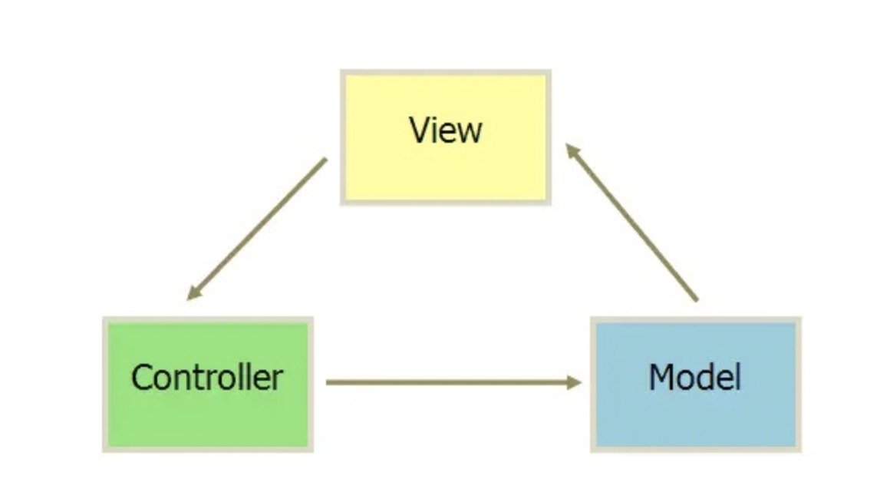
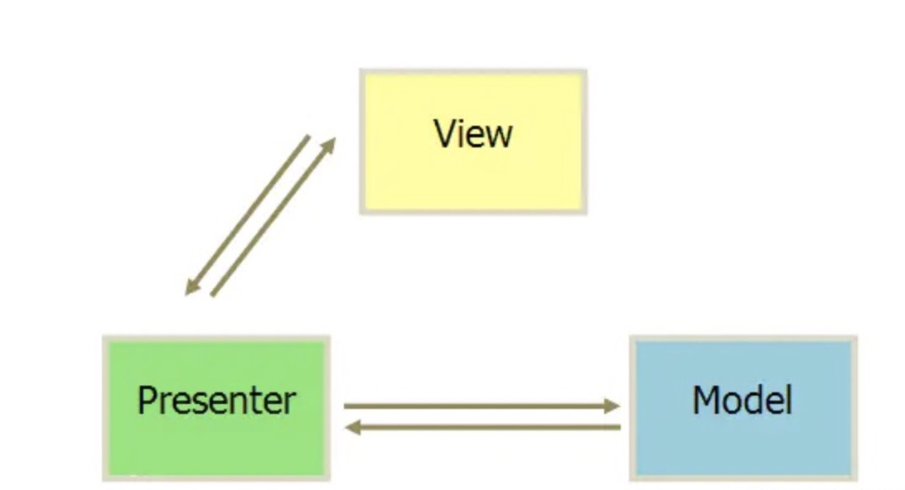
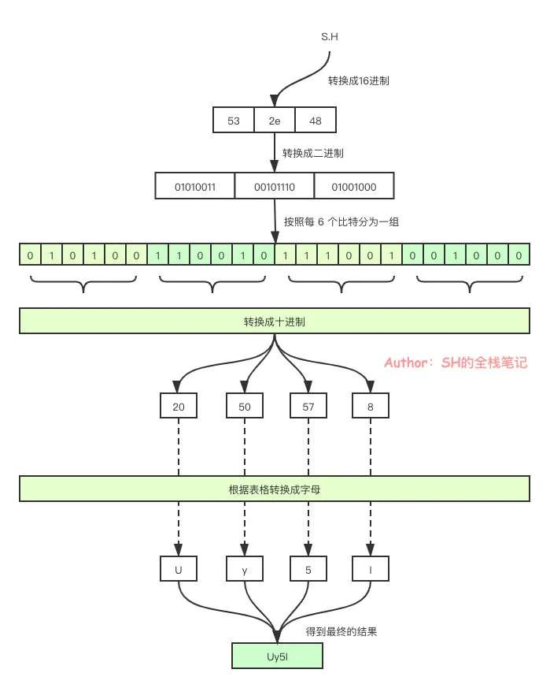
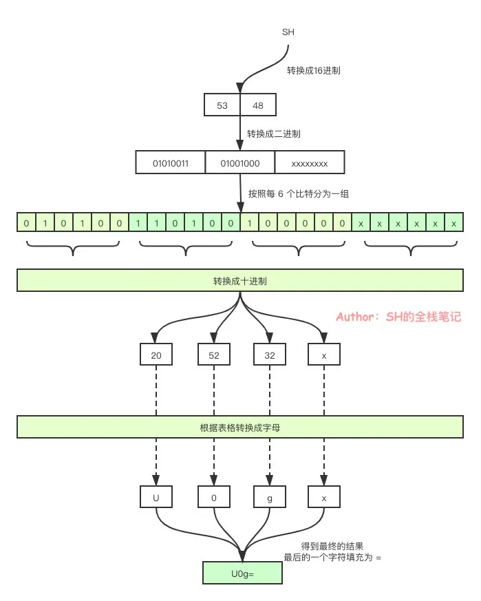
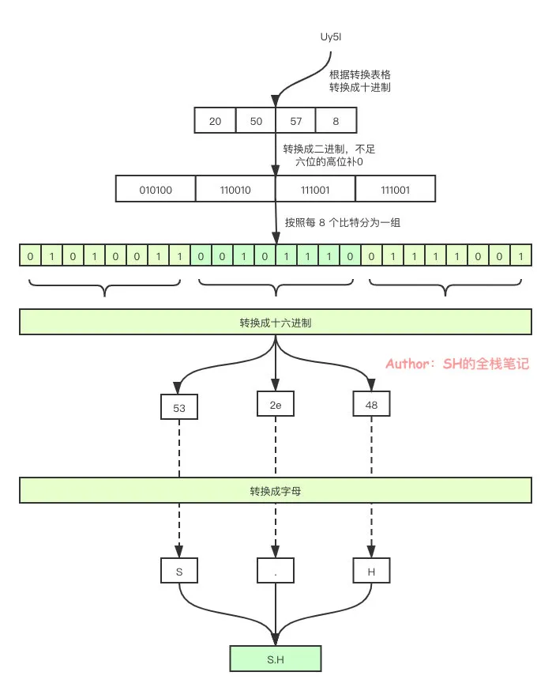

[toc]

# JAVASCRIPT


## 说一下对变量提升的理解

```js
// 变量声明,函数声明（注意和函数表达式的区别）
// 执行上下文
console.log(a)  //undefined
var a = 100;


fn( 'zh' )  
function fn ( name ) {
    age = 20
    console.log(name, age)  //'zh' 20
    var age
}
```


## 如何理解作用域

作用域有两种工作模型，词法作用域和动态作用域，JS中的作用域属于词法作用域，即作用域是由代码写在哪里决定的<br/>
自由变量（当前作用域没有定义的变量，即自由变量）<br/>
作用域链即自由变量的查找<br/>
有块级作用域,函数作用域和全局作用域

## JS数据类型

| 数据类型 |
|  ----  |
| `Boolean` |
| `Null` |
| `Undefined`  |
| `Number` |
| `String` |
| `Symbol` |
| `Object` |


## JS中使用`typeof`能得到的类型

| 类型 |
| ---- |
| `undefined` |
| `string`  |
|  `number` |
| `boolean` |
| `object` |
| `function` |
| `symbol` |

## JS显式类型转换和隐式类型转换

| 显式类型转换 | 隐式类型转换 | 
| --- |      ----- |
| `Number()` |    四则运算`+-*/`   |
| `String()` |   `if`判断语句 |
| `Boolean()` |  `console.log()` |

::: tip
使用`+,-`号的时候，如果前面没有数据，后面跟着字符串，那么会转为数字类型，转不出来就是`NAN`
:::


## JS按存储方式区分变量类型

```js
// 值类型
var a = 10;
var b = a;
a = 11;
console.log(b)  // 10
```

```js
// 引用类型
var obj1 = { x: 100 }
var obj2 = obj1
obj1.x = 200
console.log(obj2.x)   // 200
```


## 何时使用`===`和`==`,`===`和`Object.is`的不同之处

```js
obj.a == null
// 相当于
obj.a === null || obj.a === undefined
```

`==`只会对比两个值是否相等<br/>
`===`会对比值和引用是否都相等<br/>
`Object.is`和`===`的不同之处只有两个,一是`+0`不等于`-0`，二是`NaN`等于自身

```js
console.log(+0 === -0)    // true
console.log(NaN === NaN)  // false

Object.is(+0, -0)   // false
Object.is(NaN, NaN) // true
```

```js
// Object.is的原理
Object.defineProperty( Object, 'is', {
    value: function (x, y) {
        if ( x === y ) {
            // 针对+0不等于-0的情况
            return x !== 0 || 1 / x === 1 / y
        }
        // 针对NaN的情况
        return x !== x && y !== y
    },
    configurable: true,
    enumerable: false,
    writable: true
})
```

## 创建对象的几种方法

```js
// 第一种
var obj = {name:'zh'}
var obj = new Object({name:'zh'})

// 第二种
var M = function () { this.name = 'zh' }
var m = new M()

// 第三种
// obj的原型对象是P
var P = {name: 'zh'}
var obj = Object.create(P)

```


## 如何准确判断一个变量是数组类型

```js
const arr = [1,2,3]
console.log(arr instanceof Array) // true
```


## `instanceof`的原理

判断实例对象的`__proto__`属性和构造函数的`prototype`属性是不是同一个引用


## 描述`new`一个对象的过程

创建一个新对象<br/>
将构造函数的作用域赋值给新对象，因此`this`指向这个新对象<br/>
执行构造函数中的代码，即对`this`赋值<br/>
返回新对象


```js
function Person (name, age, job) {
    this.name = name
    this.age = age
    this.job = job
    this.sayName = function(){
	   console.log(this.name)
	 }
}
var person1 = new Person('Nicholas', 29, 'Software Engineer')
var person2 = new Person('Greg', 27, 'Doctor')

person1.constructor = Person  //true
person2.constructor = Person  //true
```


## 说明`this`几种不同的使用场景

作为构造函数执行<br/>
作为对象属性执行<br/>
作为普通函数执行<br/>
`call,apply,bind`


`this`对象是在运行时基于函数的执行环境绑定的<br/>
在全局函数中,`this`等于`window`<br/>
而当函数被作为某个对象的方法调用时,`this`等于那个对象<br/>
不过匿名函数的执行环境具有全局性,因此其`this`对象通常指向`window`


## `this`要在执行时才能确认,定义时无法确认

```js
var a = {
    name: 'A',
    fn: function () {
        console.log(this.name)
    }
}

a.fn()  // this === a
a.fn.call({name:'B'})  // this === {name:'B'}
var fn1 = a.fn
fn1()  // this === window
```


## 箭头函数的`this`问题

箭头函数没有自己的`this`对象，内部的`this`就是定义时上层作用域中的`this`。也就是说，箭头函数内部的`this`指向是固定的，相比之下，普通函数的`this`指向是可变的<br/>
由于箭头函数没有自己的`this`，所以也就不能用`call()`,`apply()`,`bind()`这些方法去改变`this`的指向<br/>

```js
var A = 2;

const B = {
  f1: function() {
    return this.A
  },
  f2: () => {
    return this.A
  },
  A: 10
}

console.log(B.f1(), B.f2()); // 10 2
const f1 = B.f1, f2 = B.f2;
console.log(f1(), f2()); // 2 2
```

```js
class A {
    method1 () { 
        console.log(this) 
    }
    method2 = () => { console.log(this) }
}

const a = new A();
a.method1();  // a
a.method2();  // a
a.method1.bind({name:'test'})(); // {name:'test'}
a.method2.bind({name:'test'})();  // a
a.method1.bind({name:'test'}).call(window) // {name:'test'}
a.method2.bind({name:'test'}).call(window) // a
```


## JS中的内置函数

| 内置函数 |
| ----- |
| `Object`    |
| `Array` |
| `Boolean` |
| `Number` |
| `String`  |
| `Function` |
| `Date` |
| `RegExp` |
| `Error` |


## 定义函数的两种方式

```js
// 函数声明
function functionName (arg1, arg2) {}

// 函数表达式
var functionName = function (arg1, arg2) {}
```
::: tip
在匿名函数中定义的任何变量，都会在执行结束时被销毁
:::

## 什么是函数柯里化

柯里化，就是把一个多参数的函数，转化为单参数函数

`f(x, y, z) -> f(x)(y)(z)`

```js
const squares = function (x, y) {
  return x * x + y * y;
};
// 柯里化版本
const currySquares = function (x) {
  return function (y) {
    return x * x + y * y;
  };
};
```

## 什么是函数组合

函数组合就是将两个或多个函数组合起来生成一个新的函数,每个函数的结果作为下一个函数的参数传递，而最后一个函数的结果是整个函数的结果

```js
const compose = (f, g) => (x) => f(g(x))
const f = (x) => x * x
const g = (x) => x + 2
const composefg = compose(f, g)
composefg(1)
```


## 有一个函数执行对象查找时,永远不会去查找原型,这个函数是?

`hasOwnProperty()`

## 实际开发中闭包的应用

闭包实际应用中主要用于封装变量，收敛权限<br/>
函数作为返回值<br/>
函数作为参数传递


## 闭包是指有权访问另一个函数作用域中的变量的函数

```js
function createComparisonFunction(propertyName){
	return function (obj1,obj2) {
		var valueOne = obj1[propertyName]
		var valueTwo = obj2[propertyName]
		if (valueOne < valueTwo) {
			return -1
		} else if(valueOne > valueTwo){
			return 1
		} else {
			return 0
		}
	}
}

var obj1 = {age: 20}
var obj2 = {age: 30}
console.log(createComparisonFunction('age')(obj1,obj2))
```

```js
// 闭包只能取得包含函数中任何变量的最后一个值
function createFunctions () {
	var result = new Array();
	for (var i = 0; i < 10; i++ ) {
		result[i] = function () {
			return i;
		}
	}
	return result;
}
console.log(createFunctions()[0]())  // 10
console.log(createFunctions()[1]())  // 10
console.log(createFunctions()[9]())  // 10
```


## DOM事件的级别

| 级别 | 示例 |
|  ---- | ----  |
| DOM0   | element.onclick = function(){} |
| DOM2 | element.addEventListener('click', function(){}, false) |
| DOM3 | element.addEventListener('keyup', function(){}, false) |

## DOM事件流

第一阶段是捕获阶段<br/>
第二阶段是目标阶段<br/>
第三阶段是冒泡阶段


## 描述DOM事件捕获的具体流程

`window`到`document`到`html`标签到`body`标签，然后一级一级往下传，最后到目标元素


## `DOM`节点的`attribute`和`property`有何区别
`property`只是一个`js`对象的属性的修改<br/>
`attribute`是对`html`标签属性的修改


## 前后端如何通信

| 方式  |  是否同源 |
| ---- | ---- |
| `Ajax` | 同源 |
| `WebSocket` | 不限制同源 |
| `CORS` | 支持同源或者不同源 |


## 什么是同源策略及限制

同源策略要求同域名,同端口,同协议

| 限制 |
| ---- |
|  `Cookie,LocalStorage,IndexDB`无法获取  |
| `DOM`无法获得 |
| `AJAX`请求不能发送 |


## 跨域通信的几种方式

|  方式 | 描述 |
| ---- | ---- |
| `JSONP`  | 通过`script`标签发送请求,服务端返回一个函数,定义一个全局的函数名称，然后运行函数得到数据 |
| `Hash` | |
| `postMessage` | |
| `WebSocket` | |
| `CORS` | |


可以跨域的三个标签`<script>,,<link>`

## CORS和普通的AJAX请求有哪些不同


`CORS`和`Ajax`在发送请求时没有任何区别，都是`HTTP`请求。<br/>
浏览器发现`Ajax`跨域时，会自动在`HTTP`请求头`Header`中添加几个关键词,转为`CORS`<br/>


## 什么是简单请求，什么是非简单请求


简单请求不会触发`CORS`预检请求<br/>
非简单请求要求必须首先使用`OPTIONS`方法发起一个预检请求


| 简单请求(必须满足下述所有条件) |
| ----- |
| `GET`，`HEAD`，`POST`方法之一 |
| 只能设置下面这些字段<br/>`Accept`<br/>`Accept-Language`<br/>`Content-Language`<br/>`Content-Type`<br/>`Range`|
| `Content-Type`的值为下面三个之一<br/>`text/plain`<br/>`multipart/form-data`<br/>`application/x-www-form-urlencoded`|
| 请求中没有使用`ReadableStream`对象|
| 如果请求是使用`XMLHttpRequest`对象发出的，在返回的`XMLHttpRequest.upload`对象属性上没有注册任何事件监听器|


## 直接使用表单提交请求，会有跨域问题吗

不会

## 同步和异步的区别是什么？分别举一个同步和异步的例子

同步会阻塞代码执行而异步不会<br/>
`alert`是同步<br/>
`setTimeout`是异步


## 前端使用异步的场景有哪些

定时任务: `setTimeout,setInterval`<br/>
网络请求: `ajax`请求，动态``加载<br/>
事件绑定


## 前端错误

| 分类 |
| --- |
| 及时运行错误(代码错误) |
| 资源加载错误 |

| 及时运行错误的捕获方式 |
| ----------- |
|  `try-catch` |
| `window.onerror` |

| 资源加载错误的捕获方式 |
| --------- |
| `img.onerror` |
| `Error`事件捕获|
| `performance.getEntries()` |


| 上报错误 |
| ----- |
| 采用`Ajax`通信的方式上报 |
| 采用`Image`对象上报 |


```js
//  Error事件捕获
window.addEventListener('error',function(e){},true)
```


## 跨域的JS运行错误可以捕获嘛？错误提示是什么？应该怎么处理？

只能拿到`script error`，拿不到行号和列号

处理分两步<br/>
在`script`标签增加`crossorigin`属性<br/>
设置资源响应头`Access-Control-Allow-Origin: *`


## 安全性

| XSS跨站请求攻击(跨域脚本攻击) | XSS预防|
| ----------------------- | ------------ |
| 在输入内容时，可以输入脚本(`<script>`),脚本中有攻击代码，获取基本信息，发送到自己的服务器上 |  替换关键字，例如替换`<`为`&lt;` `>`为`&gt;` |


| `CSRF`跨站请求伪造预防 |
| ------- |
| `Token`验证 |
| `Referer`验证(`Referer`指的是页面来源,比如判断是不是站点下的页面) |
| 隐藏令牌 |

:::tip
`CSRF`攻击原理<br/>
一个用户是网站A的注册用户，它通过用户名密码登陆了网站A,如果登陆成功，网站A下发一个`cookie`,这时用户又访问了一个网站B，这个网站B的页面上有一个引诱点击，点击之后是会请求网站A的一个接口,cookie是在每次请求时都携带的,网站A拿到cookie进行了身份验证，验证成功后就执行了网站A的这个接口<br/>
有两个重点，一是用户一定在网站A登录过,二是网站A中某一个接口存在这种漏洞
:::


## JS是怎样管理内存的？

变量创建时自动分配内存，不使用时自动释放内存，这个过程叫做`垃圾回收`<br/>
变量通常可以分为两类，一类是`局部变量`，一类是`全局变量`

`局部变量`在函数执行完，没有闭包引用，就会被标记回收<br/>
`全局变量`直至浏览器卸载页面时释放

垃圾回收实现机制共有两种，一种是`引用计数`，一种是`标记清除`

`引用计数`是当创建变量之后，去看下有哪些对它进行了引用，当`引用计数`归0之后就可以对它进行相关的回收了。不过`引用计数`无法解决循环引用的问题。


`标记清除`是两个过程，一个是`标记`的过程，一个是`清除`的过程。

标记的过程会从一个根节点去进行扫描，通过一个遍历去看一下所有的节点是不是都可以被访问的到，如果某些节点不能被访问到了，就会把他们标记出来。清除的过程就是把标记出来的节点给回收掉。

```js
const object = { a: new Array(1000), b: new Array(2000) }
setInterval( () => console.log( object.a ), 1000 )
```

:::tip
可以看到上面的b元素始终没有被访问到，它所创建的这个数组实际上是可以被回收掉的，但是object始终可以访问到b元素，所以b元素所创建的数组就不能被标记清除掉
:::


## 如何避免内存泄漏？

::: tip
避免意外的全局变量产生
:::

```js
function accidentalGlobal () {
    leak1 = 'leak1';
    this.leak2 = 'leak2';
}
accidentalGlobal();

// accidentalGlobal函数执行完就生成了两个全局变量
window.leak1;
window.leak2;
```

::: tip
避免反复运行引发大量闭包
:::

```js
var store;

function outer () {
    var largeData = new Array(10000000);
    var prevStore = store;
    
    function inner () {
        if (prevStore) return largeData;
    }
    return function (){};
}

setInterval(function(){
    store = outer();
}, 10);
```

::: tip
避免脱离的DOM元素
:::

```js
function createElement () {
    const div = document.createElement('div');
    div.id = 'detached';
    return div;
}

const detachedDiv = createElement();
document.body.appendChild(detachedDiv);

function deleteElement () {
    document.body.removeChild(document.getElementById('detached'));
}
deleteElement();
```


```js
var elements = {
  image: document.getElementById('image')
};
function doStuff() {
  elements.image.src = 'http://example.com/image_name.png';
}
function removeImage() {
  document.body.removeChild(document.getElementById('image'));
  // 这个时候我们对于image仍然有一个引用,Image元素仍然无法被内存回收
}
```


## 请描述一下`Cookie`，`sessionStorage`，`localStorage`的区别


| `Cookie`用于存储的缺点 |
| ------------ |
| 存储量太小，只有4kb |
| 所有`HTTP`请求都带着,会影响获取资源的效率 |
| API简单，需要封装才能用 |

| `sessionStorage，localStorage` |
| ----------- |
| `H5`中专门为存储而设计的 |
| 最大容量5M |
| API简单易用 |


## window.onload和DOMContentLoaded的区别

|window.onload |DOMContentLoaded|
| ----- | --- |
|  页面的全部资源加载完才会执行，包括图片，视频等 |  `DOM`渲染完即可执行，此时图片，视频还可能没有加载完 |


## 如何理解JSON

`JSON`只不过是一个`JS对象`而已,不过它也是一种数据格式

```js
// 把对象变成字符串
JSON.stringify({a:10,b:20}) 

// 把字符串变成对象
JSON.parse('{"a":10,"b":20}')
```

## `mouseover,mouseout`事件与`mouseenter,mouseleave`事件的区别

`mouseover,mouseout`鼠标经过自身时触发事件。经过其子元素时也触发事件<br/>
`mouseenter,mouseleave`鼠标经过自身时触发事件。经过其子元素时不触发事件


## 如何检测浏览器的类型

```js
console.log(navigator.userAgent)
```


## web服务器工作的过程


```
    st=>start: 接收客户端连接
    op1=>operation: 接收请求报文
    op2=>operation: 处理请求
    op3=>operation: 访问Web资源
    op4=>operation: 构造应答
    op5=>operation: 发送应答
    
    st->op1->op2->op3->op4->op5
```


| 请求报文 |
| ---- |
| 请求方法 请求地址 HTTP版本 |
| 请求头|
| 请求内容 |


| 应答报文 |
| ----- |
| HTTP版本 状态码 状态解释 |
| 应答头 |
| 应答内容 |


## SESSION


| 优势 |  
| ----- |
| 相比`JWT`最大的优势就在于可以主动清除`SESSION`（因为`SESSION`是保存在服务端的） |
|`SESSION`保存在服务器端，相对较为安全 |
| 结合`Cookie`使用，较为灵活，兼容性较好 |

|  劣势 | 
| ----- |
| `Cookie+SESSION`在跨域场景表现并不好 |
| 如果是分布式部署，需要做多机共享`SESSION`机制 |
| 基于`Cookie`的机制很容易被`CSRF` |
| 查询`SESSION`信息可能会有数据库查询操作 | 


## JWT


`JWT`(JSON WEB TOKEN)是一个开放标准<br/>
`JWT`定义了一种紧凑且独立的方式，可以将各方之间的信息作为`JSON`对象进行安全传输<br/>
`JWT`信息可以验证和信任，因为是经过数字签名的


::: details JWT的构成
头部（Header）<br/>
`Header`本质是个`JSON`,这个`JSON`有两个字段<br/>
第一个是`typ`，代表令牌的类型，这里固定为`JWT`<br/>
第二个是`alg`,代表的是使用的哪种`hash`算法，比如`RSA`
```js
// Header编码前后
{"alg": "HS256", "typ": "JWT"}
'eyjhbGciOiAiSFMyNTYiLCAidHlwIjogIkpXVCJ9'
```
有效载荷(Payload)<br/>
存储需要传递的信息，比如用户ID，用户名等<br/>
还包含元数据，如过期时间，发布人等<br/>
与`Header`不同，`Payload`可以加密<br/>
签名(Signature)<br/>
对`Header`和`Payload`部分进行签名<br/>
保证`Token`在传输的过程中没有被篡改或者损坏
:::


## `JWT`与`SESSION`

::: tip
可拓展性<br/>
拓展程序有水平拓展，有垂直拓展<br/>
水平拓展就是加服务器<br/>
垂直拓展就是增强你服务器的硬件性能，比如说磁盘，内存，`CPU`等<br/>
`SESSION`都是存在服务器中的，在水平拓展的方案中，你就必须要专门创建一个独立的中心式的`SESSION`存储系统才行，否则是没有办法共享的，所以在这种情况下，`JWT`是要比`SESSION`好的
:::


::: tip
RESTFUL API<br/>
`SESSION`是有状态的所以不能用做`RESTFUL API`
:::

::: tip
性能<br/>
在客户端向服务端发送请求的时候，可能会有大量的用户信息在`JWT`中，那么每个`HTTP`请求都会产生大量的开销，如果用`SESSION`的话，只要少量的开销就可以了，因为`SESSION`非常的小<br/>

但是`SESSION`也有缺点，因为对于`SESSION`来说，每一个请求都需要在服务器上查找一下`SESSION`，因为它拿到的是`SESSION ID`嘛，并没有完整的信息，你要用`SESSION ID`来查完整的信息，这也是需要消耗性能的，`JWT`它的数据都在`JWT`的字符串里，所以说不需要进行数据库查询
:::

::: tip
时效性<br/>
`JWT`要比`SESSION`时效性差一点，因为`JWT`只有等到过期时间才可以销毁，`SESSION`可以在服务端手动的去销毁
:::

## 聊一下MVC,MVP和MVVM


`MVC`分别是`Model`,`View`,`Controller`<br/>
使用`MVC`的目的就是将`M`和`V`的代码分离<br/>


`MVP`是从经典的模式`MVC`演变而来<br/>
在`MVP`中`View`并不直接使用`Model`，它们之间的通信是通过`Presenter`(`MVC`中的`Controller`)来进行的<br/>
在`MVC`中`View`会直接从`Model`中读取数据而不是通过`Controller`



`MVVM`是在`MVC`和`MVP`的基础上延伸而来的<br/>
`MVVM`分别是`View`,`ViewModel`,`Model`<br/>
`MVC`中`Controller`演变成`MVVM`中的`ViewModel`<br/>
`ViewModel`和`View`还有`Model`都是双向的一个过程<br/>
`Model`可以理解为服务器上的某一块业务逻辑的操作<br/>
`ViewModel`就是我们的`Vue`框架,它是`View`和`Model`之间的一个核心枢纽<br/>
`View`就是我们的页面<br/>


## 双向绑定的原理是?


`data`到`view`是正向，通过`Object.defineProperty`实现<br/>
`view`到`data`是反向，通过`input`事件实现


## 观察者模式和发布订阅模式的区别


观察者模式里只有两个角色,观察者和被观察者,并且两者是松耦合的关系<br/>
发布订阅模式里不仅仅只有发布者和订阅者还有一个中间人,所以发布者和订阅者完全不存在耦合


## 静态页面缓存有哪些方式

`Service Worker`<br/>
`HTTP缓存`<br/>
`H5的manifest`

## requestAnimationFrame属于宏任务还是微任务

是宏任务，但是和那些平行级别的宏任务相比，它的执行顺序是不确定的


```js
setTimeout(() => {
    console.log(1)
})
requestAnimationFrame(() => {
    console.log(2)
})
setTimeout(() => {
    console.log(4)
})
Promise.resolve(3).then(res => {
    console.log(res)
})

// 打印顺序有时是3->2->1->4,有时是3->1->4->2
```

## 如何clone一个函数

使用`bind`方法


## es next了解过嘛，通过什么途径


`ESNext`是一个动态名称，指的是撰写本文时的下一个版本。`ESNext`中的特性更准确地称为提案，因为根据定义，规范尚未最终确定<br/>
可通过`https://tc39.es/ecma262/`进行查看学习


## GET可以上传文件吗

可以转为`base64`，然后上传


## 如果在进入页面的时候需要一次渲染10万条数据，有什么首屏优化的方案？


使用`requestAnimationFrame`和`DocumentFragment`,做时间分片渲染数据<br/>
使用虚拟列表技术，只展示可视区域中的内容，当页面滚动时，动态替换可视区域中的数据

## 前端监控怎么实现

数据采集（目的就是记录用户在使用产品过程中的真实操作,主要记录异常数据和行为数据）<br/>
搭建API<br/>
对接数据库<br/>
对数据进行统计，分析<br/>
可视化展示<br/>
API对接报警通知服务（如钉钉）

## 异步代码错误该如何进行捕获


`try{}catch(){}`只能捕获同步代码错误

```js
const fn = () => {
    throw "error"
}

const fn1 = () => {
    setTimeout(()=>{
        throw "error"
    }, 1000)
}

try{
    fn()
}catch(e){
    console.log(e) // error
}

try{
    fn1()
}catch(e){
    console.log(e) // 未执行
}
// Uncaught error
```

`Promise.try`即可以捕获同步错误，又可以捕获异步错误


```js
const fn = () => {
    throw 'error'
}

const fn1 = () => {
    return new Promise((resolve, reject) => {
        setTimeout(() => {
            reject("error");
        }, 3000);
    });
}

Promise.try = function (callback) {
    return new Promise((resolve, reject)=> {
        return Promise.resolve(callback()).then(resolve, reject)
    })
}

Promise.try(fn).catch(err=>{
    console.log(err)
})
Promise.try(fn1).catch(err=>{
    console.log(err)
})
```

`unhandledrejection`可以捕获`Promise`未捕获的错误

```js
window.addEventListener("unhandledrejection", event => {
    console.log(event.reason)
});

new Promise((resolve,reject)=>{
    reject('error')
})
```


## Vue的价值

不需要知道修改哪块的`DOM`<br/>
不需要对数据每一次的修改都去操作DOM<br/>
不需要去写修改DOM的逻辑<br/>


## base64原理

:::tip
编码原理<br/>
将输入流中的字节按每3个分为一组,一组就有24个字节，然后每次取6个比特,如果不足6个比特，会进行末尾补0,使它达到6个,这样一组里又分为4组，每组6个字节，如果分组不满4的，直接以`=`号填充
:::






:::tip
解码原理<br/>
每次处理4个字符,转成二进制，不足六位的高位补0,再将其分成每8个比特一组
:::




