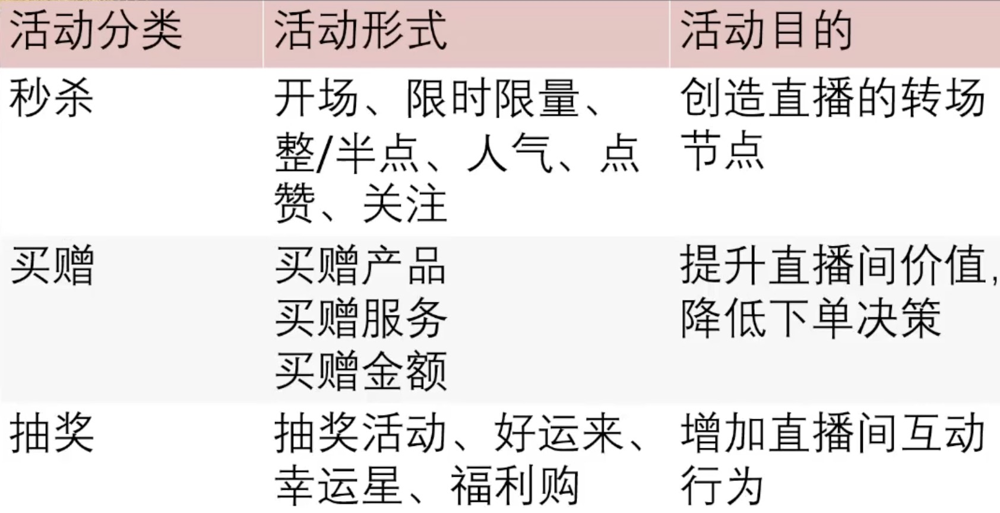
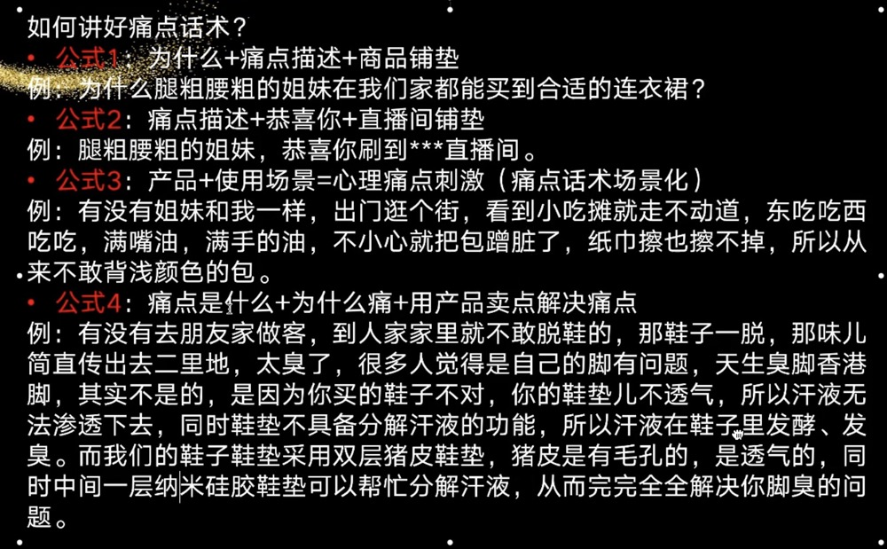
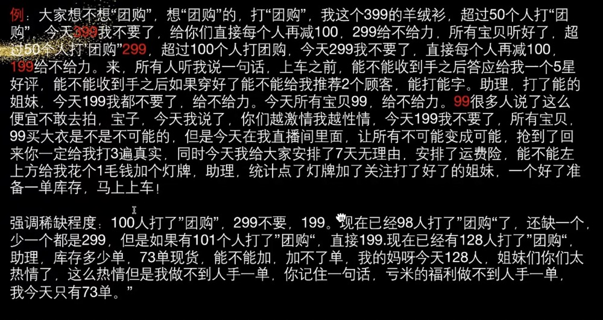
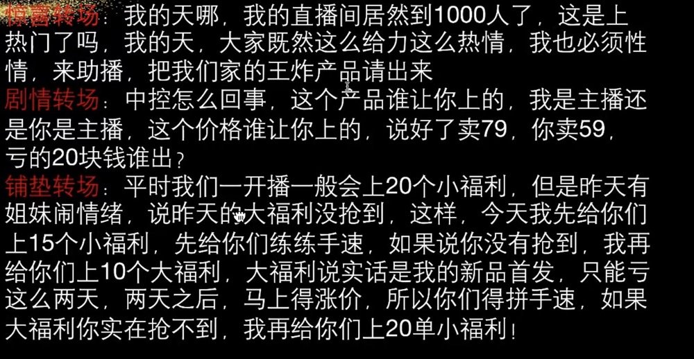

# 直播

## 话术

`话术流程框架：拉新（活动，痛点，互动）-> 讲款（卖点，场景，信任，互动） -> 保障（信任）-> 开款（转场，活动，开款，指导，留存） -> 促单（促单，互动，信任） -> 转场`

`主播不是销售员，是美好生活的规划师，我们在规划用户的生活，规划的是用户拥有这件商品之后的生活，卖的是生活场景`

| 话术种类 |  描述 |
|  ---- |  ---- |
| 活动话术 | 活动话术能创造更好的销售氛围，提高直播间的转化率 |
| 痛点话术 | |
| 卖点话术 | |
| 场景话术 | |
| 信任话术 | |
| 开款话术 | |
| 促单话术 | |
| 转场话术| |
| 互动话术| |
| 指导话术 | |
| 留存话术| |
| 配合话术| |

::: tip 活动话术
一.活动话术最主要的是活动主题 
以店铺为主题 - 店铺周年庆，销量，涨粉 
以人为主题 - 生日，结婚，获奖，带货榜 
以账号为主题 - 账号一周年 
以节庆为主 - 616，818，双11 
 
 
二.如何设计好活动话术？ 
1.先讲活动主题，再讲活动形式 
2.低价产品突出价格优势，价格就是活动的核心 
3.高价产品突出价值优势，价值不到，价格不报 
 
 

三.活动形式 

:::

::: tip 痛点话术

:::

::: tip 卖点话术
卖点就是痛点的反面，是痛点的解决方案。挑重点的3个卖点讲就可以，讲太多反而没有重点了 
卖点的6大分类：品牌价值，材质选取，制作工艺，功能功效，设计理念，同行对比
:::

::: tip 场景话术
场景就是产品的使用场景，在什么样的情况下使用 
场景话术四元素：时间，地点，人物，事件 
:::

::: tip 信任话术
信任话术包含3个层面 
服务：运费险，7天无理由 
佐证：100个网红在卖，10万单销量，小红书上卖的很火 
反思：讲理由，编故事，为什么卖的这么便宜，为什么搞活动，为什么要亏本 
:::

::: tip 开款话术
开款的前提条件是，有需求，有保障，有活动 
 
如何提升下单率？ 
被催着开款，突然开款，倒计时开款，讲条件开款 
 
示例 

:::

::: tip 促单话术
促单话术的核心是解决掉客户的顾虑，为什么要拍，为什么今天拍，为什么此时此刻拍（限时限量限价），为什么跟我拍
:::

::: tip 转场话术
转场的目的是，转商品和直播间的节奏和形式 
转不过去的原因：产品不顺应人群，铺垫不到位，产品介绍不到位 
转场方式：惊喜转场，铺垫转场，剧情转场 

::: 

::: tip 互动话术
在合适的契机要互动，先给予，再索取
:::

## 单品日不落

::: tip 思路
开播前发段子，3-5天内发30个段子，每天6个或者10个  
新号开播前1天，做账号包装加热度，10条段子，每条100元，1000预算，投24小时的点赞评论，只投基础定向（性别年龄） 
老号开播前1天，做账号包装加热度，10条段子，100元投5条，200预算，投24小时的点赞评论，只投基础定向（性别年龄）  
开播第一天，需要去筛选视频，投1000块钱，建10条计划，一个计划里把之前的10条段子都加进去，哪条能花钱，哪条就是好视频。预算中，投商品购买。达人相似占40%，就是400块钱，自定义占40%，系统通投占20%  
开播第二天，做成交模型，将筛选出的视频，集中投放，预算2000元，只投筛选出的这一条视频就可以。预算中，投商品购买。60%自定义，30%系统通投，10%达人相似。  
开播第三天，需要提高ROI和千次成交金额，同时降低出价，完成人群精准度。预算2000元，预算中，投商品购买和ROI。另外系统通投和自定义这两个比例是多少，需要自己测，哪个好，主投哪个。
:::

## 如何突破流量池

`新号前十场直播，播到4个小时以上的，流量池给的比较好，标签打的也快`

::: tip
在直播的过程中，在快手小店电脑端，打开数据大屏，在每个数据下方都会有一行红字，显示超过同行，同等级多少，超过75%以上是优秀，但是超过同行，百分之七八十，不足以突破流量层级，至少达到超过同行同等级90%以上，才有机会突破流量层级，即便超过同行同等级90%以上，也不是立刻能破流量层级的，首先需要维稳，至少7天以上，或者最好每天销售额能做递增，注意不能做递减 
 
做大场，可以更快的突破流量层级，做一波大的投流，拉一下直播时长，销售额做到平常的5倍到10倍，会发现在大场过后，流量层级是破了的 
 
破流量层级最快的方式就是做憋单，突破流量层级的关键，除了出单外，是做浅层数据，突破在线阈值。比如直播中，发现直接间人数46个人，你要知道下一个流量层级的节点是50，你需要冲节点，拿能憋起来流量的产品也叫福利品，去拉数据，憋互动，憋停留时长。
:::

