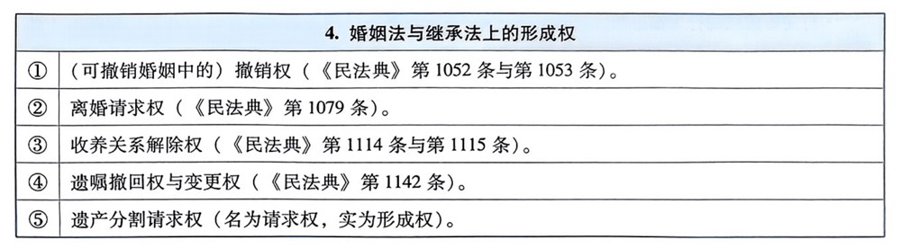

# 民法

::: tip 
民法就是调整作为平等主体的自然人，法人，非法人组织之间的人身关系和财产关系的一个部门法
:::

## 民法总则

### 民事法律关系

#### 民法规范

::: tip
一个完整的民法规范，包括`构成要件`和`法律效果`两个部分。 
一个完整的民法规范，它所规定的`构成要件`不是单一的。 
民法规范主要是由民法的`法条`所规定的。 
民法规范通过`涵摄`这种方式得以适用。 
:::

| 涵摄的逻辑结构|
| ---- |
| 大前提`T->R`（具备要件T时，即适用法律效果R） |
| 小前提`S=T`（特定的案件事实S该当于要件T）| 
| 结论`S->R`（特定的案件事实S，发生法律效果R）|

| 涵摄过程更为具体的描述 |
| ---- |
| 由于民法规范的要件（T），通常系由多数的要件特征（M）组成，因此，特定的案件事实，必须该当于所有的要件特征（要件事实），始能发生该民法规范所规定的法律效果（R）。这样，涵摄过程的演绎推理三段论便表现为如下结构|
| 大前提`T=M1+M2+M3->R`|
| 小前提`S=M1+M2+M3`|
| 结论`S->R`|

#### 民法的法源
::: tip 民法的法源
所谓“民法的法源”，指民法规范存在的形式（渊源），包括直接法源（又称规范法源）和间接法源（又称社会学法源）。 
直接法源，指对法官具有法律上的拘束力，法院裁判应当予以援引的民法渊源； 
间接法源，指虽能对民事裁判产生一定的影响，但对法官无法律上的拘束力，法院裁判时无须援引的民法渊源（包括学界通说、判例等） 
:::

<table>
    <tr>
      <th>民法的直接法源</th>
    </tr>
    <tr>
      <td>《民法典》第10条规定：“处理民事纠纷，应当依照法律；法律没有规定的，可以适用习惯，但是不得违背公序良俗。”据此，民法的直接渊源包括两类：制定法和习惯法</td>
    </tr>
    <tr>
      <td>制定法。应作广义理解，制定法包括：法律、立法解释、司法解释、行政法规、地方法规、自治条例及单行条例</td>
    </tr>
    <tr>
      <td>习惯法。结合学理并根据《民法典总则编若干问题的解释》第2条的规定，作为民法直接渊源
的习惯法，须符合三个条件 
 
1.制定法无规定（具有补充性） 
2.系在一定地域、行业范围内长期为一般人从事民事活动时普遍遵守的民间习俗、惯常做法等（换言之，经法律共同体成员长期惯行之事实，对其已形成法律效力的确信） 
3.不得违背社会主义核心价值观，不得违背公序良俗 
</td>
    </tr>
</table>

#### 填补合同漏洞的习惯

如果合同对于合同双方当事人的有些合同权利，合同义务应当约定而没有约定或者约定不明确，这个合同就存在合同漏洞。需要依照合同漏洞填补的规则填补该合同漏洞。

::: tip 填补合同漏洞的规则分三步
第一步，适用民法典五百一十条，首先由合同的双方当事人协商确定，不能协商确定的，按照交易习惯或者参照合同的其他条款对合同进行体系解释，如果依照第一步的合同漏洞填补的规则填补了合同漏洞，合同漏洞填补的作业就结束了。这也又规定了民法上的另外一个类型的习惯。 
 
第二步，如果依照第一步不能填补合同漏洞，适用第二步，如果属于有名合同按照法律关于该类合同的规定，如果是无名合同，类推适用，类推适用法律关于最相类似合同的规定。 
 
第三步，如果依照第二步还不能补充确定，那适用最后一步的合同漏洞填补的规则，就是民法典五百一十一条或者五百一十二条等。 
:::

<table>
  <tr>
    <th colspan="2">习惯法与填补合同漏洞的习惯之间的区别</th>
  </tr>
  <tr>
    <td>习惯法</td>
    <td>填补合同漏洞的习惯</td>
  </tr>
  <tr>
    <td>具有补充性，仅在制定法无规定时，才能得以适用</td>
    <td>若作为第二步、第三步合同漏洞填补规则的法律规定属于任意性规范，优先适用习惯</td>
  </tr>
  <tr>
    <td>须形成具有法的效力的确信</td>
    <td>无须形成具有法的效力的确信</td>
  </tr>
  <tr>
    <td>当事人可以提供证据证明；必要时，法院可以主动依职权查明</td>
    <td>由主张的当事人承担证明责任</td>
  </tr>
</table>

#### 民事法律事实

::: tip 民事法律事实
民事法律事实指依照民法规范，完全符合民法规范的事实构成要件，能够引起民事法律关系发生、变更、消灭的（一个或数个）客观情况
:::

::: tip 下列事实不属于民事法律事实
<table>
    <tr>
        <th colspan="2">好意施惠关系</th>
    </tr>
    <tr>
        <td>概念</td>
        <td>好意施惠关系，又称情谊关系，指仅处于纯粹的社交领域，不能在当事人之间产生合同关系的约定或承诺</td>
    </tr>
    <tr>
        <td>范围</td>
        <td>下列“无偿”约定或者承诺为好意施惠关系：①搭乘便车；②乘客叫醒另一乘客到站下车；③顺路代为投递信件、代为购买零食；④约定请人吃饭，相约参加宴会、舞会、旅游、看电影等；⑤为人指路；⑥为倒车的人打手势。</td>
    </tr>
    <tr>
        <td>法律效果</td>
        <td>好意施惠关系的法律效果：①不成立合同关系（承诺人爽约的，不产生违约责任或者缔约过失责任）。②不排除侵权之债的成立（好意施惠关系中，另有符合构成要件的侵权行为发生时，仍可成立侵权之债）</td>
    </tr>
</table>
 
<table>
    <tr>
        <th>法外空间</th>
    </tr>
    <tr>
        <td>日出、日落、刮风、下雨等自然现象（假设未构成不可抗力）；散步、读报、起床、睡觉、做梦等不具有法律意义的行为均不能引起民事法律关系变动，不属于法律事实</td>
    </tr>
    <tr>
        <td>引发宗教关系、同乡关系、师生关系、同学关系、同事关系、恋爱关系、友谊关系的客观情况，亦不属于法律事实
</td>
    </tr>
</table>
原则上，爱情不属于民事法律事实，不能引起民事法律关系的变动。但是，若夫妻之间不再有一点爱情了（感情确已破裂），此时“缺乏爱情”的客观情况就具有法律意义，属于民事法律事实，其法律效果是：双方均享有离婚请求权。
 
<table>
    <tr>
      <th>婚约与彩礼</th>
    </tr>
    <tr>
        <td>婚约。在中国大陆，婚约（订婚）不属于民事法律事实，当事人不因订婚成立身份合同。</td>
    </tr>
    <tr>
        <td>彩礼。“支付彩礼”属于民事法律事实，属于对附法定解除条件之赠与合同的履行。（a）原则上已经支付的彩礼，不得请求返还。（b）例外情形下，已经支付的彩礼可以依法请求返还
</td>
    </tr>
</table>
:::

#### 彩礼

彩礼是对于特殊赠与合同的履行，它是以结婚为目的，依据习俗，无偿向对方支付的一笔财产。 
彩礼纠纷规定借鉴了动态系统理论 

::: tip 下列情形给付的财物，不属于彩礼
一方在节日、生日等有特殊纪念意义时点给付的价值不大的礼物、礼金 
一方为表达或者增进感情的日常消费性支出 
其他价值不大的财物 
:::

<table>
    <tr>
        <th colspan="2">彩礼返还规则</th>
    </tr>
    <tr>
        <td rowspan="2">①</td>
        <td>《民法典婚姻家庭编解释（一）》第5条第1款规定：“当事人请求返还按照习俗给付的彩礼的如果查明属于以下情形，人民法院应当予以支持：（一）双方未办理结婚登记手续；（二）双方办理结婚登记手续但确未共同生活；（三）婚前给付并导致给付人生活困难。”</td>
    </tr>
    <tr>
        <td>《民法典婚姻家庭编解释（一）》第5条第2款规定：“适用前款第二项、第三项的规定，应当以双方离婚为条件。”</td>
    </tr>
    <tr>
        <td>②</td>
        <td>《彩礼纠纷规定》第6条规定：“双方未办理结婚登记但已共同生活，一方请求返还按照习俗给付的彩礼的，人民法院应当根据彩礼实际使用及嫁妆情况，综合考虑共同生活及孕育情况、双方过错等事实，结合当地习俗，确定是否返还以及返还的具体比例。”</td>
    </tr>
    <tr>
        <td rowspan="2">③</td>
        <td>《彩礼纠纷规定》第5条第1款规定：“双方已办理结婚登记且共同生活，离婚时一方请求返还按照习俗给付的彩礼的，人民法院一般不予支持。但是，如果共同生活时间较短且彩礼数额过高的，人民法院可以根据彩礼实际使用及嫁妆情况，综合考虑彩礼数额、共同生活及孕育情况、双方过错等事实，结合当地习俗，确定是否返还以及返还的具体比例。”</td>
    </tr>
    <tr>
        <td>《彩礼纠纷规定》第5条第2款规定：“人民法院认定彩礼数额是否过高，应当综合考虑彩礼给付方所在地居民人均可支配收人、给付方家庭经济情况以及当地习俗等因素。”</td>
    </tr>
    <tr>
        <td rowspan="2">④</td>
        <td>《彩礼纠纷规定》第2条规定：“禁止借婚姻索取财物。一方以彩礼为名借婚姻索取财物，另一方要求返还的，人民法院应予支持</td>
    </tr>
    <tr>
        <td>按照习俗支付彩礼，属于《彩礼纠纷规定》第2条规定的情形的，支付彩礼的赠与合同，往往属于因遭受胁迫订立的赠与合同，或者往往因违背善良风俗无效。支付彩礼的一方诉请撤销赠与合同或者诉请确认赠与合同无效的，已经支付的彩礼应当返还，并且不以离婚为条件。</td>
    </tr>
</table>

#### 民事法律关系的类型

::: tip 人身法律关系
在权利人和权利人以外的不特定人之间形成的以人格利益，身份利益为客体的法律关系
:::

::: tip 财产法律关系
以财产利益为客体的法律关系
:::

民事法律关系依照他所具有的效力范围分为绝对民事法律关系和相对民事法律关系，以绝对权为内容的民事法律关系那就是绝对法律关系，它的效力具有绝对性，具有对世性，绝对民事法律关系对权利人以外的一切人都具有效力。以相对权为内容的民事法律关系他就叫相对法律关系，相对权它又叫对人权，它的效力具有相对性，它只对特定的义务人具有效力，因此相对法律关系它只在特定的双方当事人之间产生效力，对这个双方当事人以外的第三人不产生法律效力，当然有例外，法律例外的，规定相对法律关系具有对抗第三人效力的时候，属于例外。

#### 民事法律关系的要素

::: tip
标的（客体）≠标的物 
凡民事法律关系必有客体，但不一定有标的物 
给付=特定的行为。所有债权法律关系的客体均为给付。给付，指义务人有目的增加对方财产的行为 
:::

#### 民事权利

民事权利和民事义务构成民事法律关系内容的核心，原则上权利和义务是对应关系，当然有时候也不对应，有的义务他就没有对应的权利。 
 
民事权利依照作用分为支配权，请求权，抗辩权和形成权。依照效力的范围分为绝对权与相对权。依照权利的客体分为人格权，身份权，财产权 
 

##### 支配权

##### 请求权

凡有请求权必有基础权利

::: tip 请求权的四个类型

 

:::

<table>
    <tr>
        <th colspan="4">请求权的概念、范围与特征</th>
    </tr>
    <tr>
        <td>概念</td>
        <td colspan="3">请求权，指特定人请求特定人为特定行为（作为或者不作为）的权利。</td>
    </tr>
    <tr>
        <td>范围</td>
        <td colspan="3">包括：支配权请求权、占有保护请求权、债权请求权、继承权回复请求权四大类。</td>
    </tr>
    <tr>
        <td rowspan="12">特征</td>
        <td>主体</td>
        <td colspan="2">权利主体特定、义务主体特定。所以，原则上请求权具有相对性，仅能针对特定的义务人行使。合同的相对性为其典型。</td>
    </tr>
    <tr>
        <td rowspan="7">内容</td>
        <td>①</td>
        <td>请求性。权利的作用表现为对特定人行为（作为或不作为）的请求，而非对特定利益的直接支配</td>
    </tr>
    <tr>
        <td>②</td>
        <td>非排他性。同一标的物上可成立两项以上“相同内容”的请求权。</td>
    </tr>
    <tr>
        <td rowspan="2">③</td>
        <td>平等性。同一标的物上成立的两项以上相同内容的请求权，彼此平等，任何一项请求权不享有对其他请求权的优先效力。</td>
    </tr>
    <tr>
        <td>（债权的平等性有两个重要例外：《买卖合同解释》第6条和第7条规定的普通动产多重买卖与特殊动产多重买卖；《城镇房屋租赁合同解释》第5条规定的一房数租)。</td>
    </tr>
    <tr>
        <td>④</td>
        <td>合作性（权利实现的间接性）。仅凭请求权人的意志不足以实现权利，请求后，尚需义务人的相应行为相配合，请求权才能实现。</td>
    </tr>
    <tr>
        <td>⑤</td>
        <td>非公示性。原则上，请求权的变动无须公示。</td>
    </tr>
    <tr>
        <td> ⑥</td>
        <td>请求权皆基于一定的基础权利而产生。例如，债权请求权基于债权产生，物权请求权基于物权产生，人格权请求权基于人格权产生。</td>
    </tr>
    <tr>
        <td>客体</td>
        <td colspan="2">请求权的客体为义务人的特定行为（作为或不作为）。所有的请求权都是行为请求权。</td>
    </tr>
    <tr>
        <td rowspan="3">时间</td>
        <td>①</td>
        <td>支配权请求权不适用诉讼时效（有一个例外：根据《民法典》第196条的规定，基于未登记的动产物权所生的返还原物请求权适用诉讼时效）；支配权请求权也不适用除斥期间</td>
    </tr>
    <tr>
        <td>②</td>
        <td>占有返还请求权适用1年的除斥期间（《民法典》第462条）。</td>
    </tr>
    <tr>
        <td>③</td>
        <td>原则上，债权请求权均适用诉讼时效期间[但有若干例外。如《民法典》第196条、《诉讼时效规定》第1条和《公司法解释（三)》第19条的规定］。</td>
    </tr>
</table>

::: tip 名词解释
损害---财产利益的积极减少或消极减少 
侵害---支配权人排他支配的领域被不法介入 
:::

##### 抗辩权

抗辩权指的是权利人有权主张依照法律的规定可以暂时或永久的阻碍请求权的行使 

 

 

##### 形成权

#### 债权平等性的两个重要例外

##### 动产多重买卖中的买受人对出卖人的“实际履行请求权”

<table>
    <tr>
        <th colspan="3">2.普通动产多重买卖（《买卖合同解释》第6条）</th>
    </tr>
    <tr>
        <td>例子</td>
        <td colspan="2">甲有一个爱马仕（Hermes）的包包。3月1日，甲将该包包出卖给乙，但未交付。4月1日，甲又将该包包出卖给丙，也未交付。5月1日，甲又将该包包出卖给丁，同样没有交付。8月1日，因甲不履行到期债务，乙、丙、丁都起诉甲，请求甲实际履行，以使自己取得该包包的所有权。法院将这三个诉讼合并审理。</td>
    </tr>
    <tr>
        <td>概念</td>
        <td colspan="2">①普通动产指机动车、船舶和航空器之外的其他动产。②多重买卖须具备三个要素：（a）同一个出卖人（甲）；（b）就同一动产（包包）与两个以上的买受人（乙、丙、丁）分别订立买卖合同；（c）每一个买卖合同均属有权处分。</td>
    </tr>
    <tr>
        <td rowspan="4">规则</td>
        <td colspan="2">乙、丙、丁请求甲“实际履行的请求权”不平等，存在受保护的顺位。按照下列三个顺序依序确定乙、丙、丁“实际履行请求权”受保护的顺位：</td>
    </tr>
    <tr>
        <td>①</td>
        <td>第一顺序（“交付”优先）。假设甲已于7月1日将该包包“交付”给丙，应确认丙已于7月1日取得所有权，仅丙对甲享有实际履行请求权（如请求甲交付原产地证明）。乙、丁对甲不享有实际履行请求权，只能对甲主张其他救济方式（如解除合同、请求损害赔偿)。</td>
    </tr>
    <tr>
        <td>②</td>
        <td>第二顺序（“先付款”优先）。假设直到8月1日，甲尚未向任何人交付该包包。乙未支付价款，丙于6月1日向甲支付全部价款18万元，丁已于7月1日向甲支付全部价款19万元。因丙属于“先支付价款”的买受人，仅丙对甲享有实际履行请求权（如请求甲交付）。乙、丁对甲不享有实际履行请求权，只能对甲主张其他救济方式（如解除合同、请求损害赔偿)。</td>
    </tr>
    <tr>
        <td>③</td>
        <td>第三顺序（“先成立”优先）。假设直到8月1日，甲尚未向任何人交付，也没有人向甲支付价款。因乙属于买卖合同“成立在先”的买受人，仅乙对甲享有实际履行请求权（如请求甲交付）。丙、丁对甲不享有实际履行请求权，只能对甲主张其他救济方式（如解除合同、请求损害赔偿）。</td>
    </tr>
</table>

##### 一房数租时的承租人对出租人的“实际履行请求权”

#### 禁止权利滥用规则

所有的民事权利依照民法典第一百三十二条的规定，都禁止滥用。权利人行使民事权利的行为，如果被认定为滥用民事权利，将产生不利的法律后果。第一，不产生行使民事权利固有的效果。第二，符合侵权的构成要件，因此给他人造成损失的滥用民事权利的人还要因此承担侵权损害赔偿责任。有的时候滥用民事权利会导致失权的结果。

#### 《民法典·总则编》的任务与内容

《民法典·总则编》是最具一般性的民法规范之集合。既然民法的内容就是民事法律关系，《民法典》的任务就是，采用提取公因式的方法，对民事法律关系中具有共性的事项（共通适用的部分）进行抽取，作概括抽象的规定。主要目的有二：①节约立法成本。《民法典》关于法律关系共通的规定具有普遍适用性，无须在分则中重复规定。②增强民法的形式理性与逻辑性，有利于形成体系，提高民法制度的能见度。所以，民法总则就是九个字：民事法律关系的要素。

<table>
    <tr>
        <th>《民法典·总则编》的主要内容</th>
    </tr>
    <tr>
        <td>民事主体（即民事权利的享有者和民事义务的承担者）。包括：①自然人（民事权利能力、宣告死亡、监护）；②法人（民事权利能力、法人的成立与终止）；③非法人组织。</td>
    </tr>
    <tr>
        <td>民事权利的内容。包括：①民事权利的类型；②民事权利的权能；③民事权利的客体；④违反义务的民事责任。</td>
    </tr>
    <tr>
        <td>法律事实（引起民事权利的变动的客观情况）。包括：①民事法律行为（包括行为能力制度）；②代理；③时间对权利的限制（诉讼时效与除斥期间）。</td>
    </tr>
</table>

