# 民法总则编-民事法律行为

## 意思表示理论

::: tip
民法以意思自治为理念。所谓意思自治，指民事主体得依其意志自主形成私法上的权利义务关系。 
 
法律行为是实现意思自治的工具。所谓法律行为，指以意思表示为要素，依意思表示而发生一定私法效果的行为。 
 
所谓意思表示，指将企图发生一定私法上效果的内心意思，表示于外部的行为。意思表示是法律行为的要素，无意思表示，则无法律行为。 
:::

### 意思表示的要素

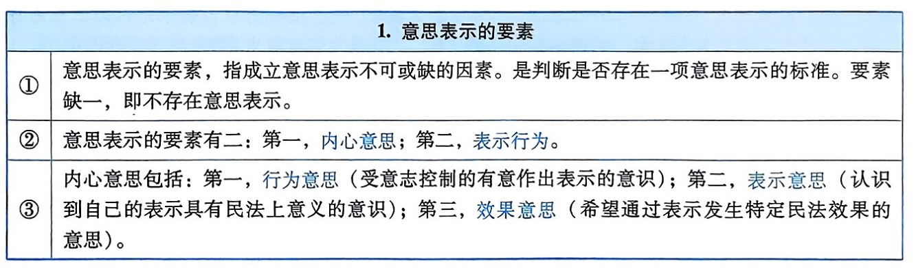

::: tip 
行为意思---要有所表达，有所举动，实施身体上的静或者动的时候，一定要受意志控制 
表示意思---有所表达，有所举动的时候，在主观上意识到自己的表达，自己的举动具有民法上的意义，将产生民法上的效果 
效果意思---有所表达，有所举动的时候，一定要包含希望发生民法效果的最低限度的民事权利，民事义务的内容
:::

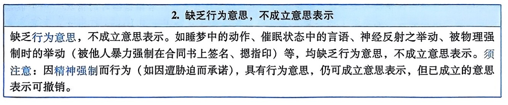

::: tip
上图为不受意志控制的表达，举动
:::

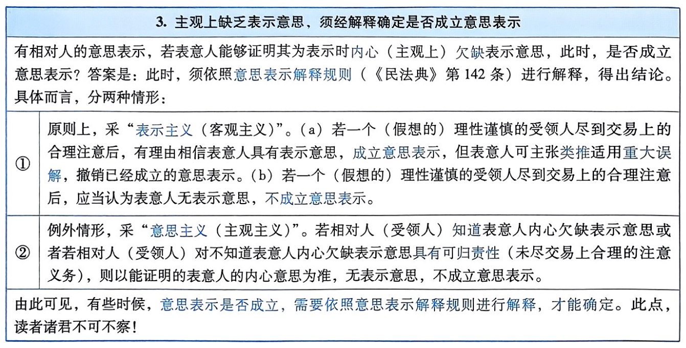

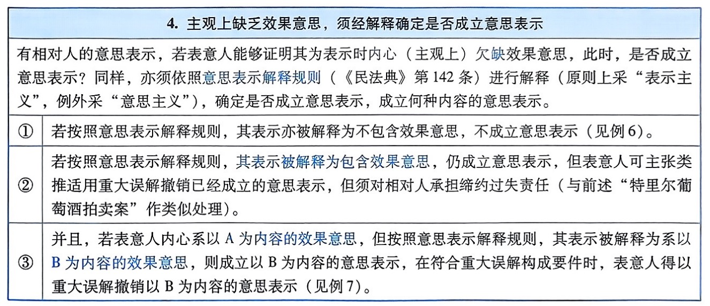

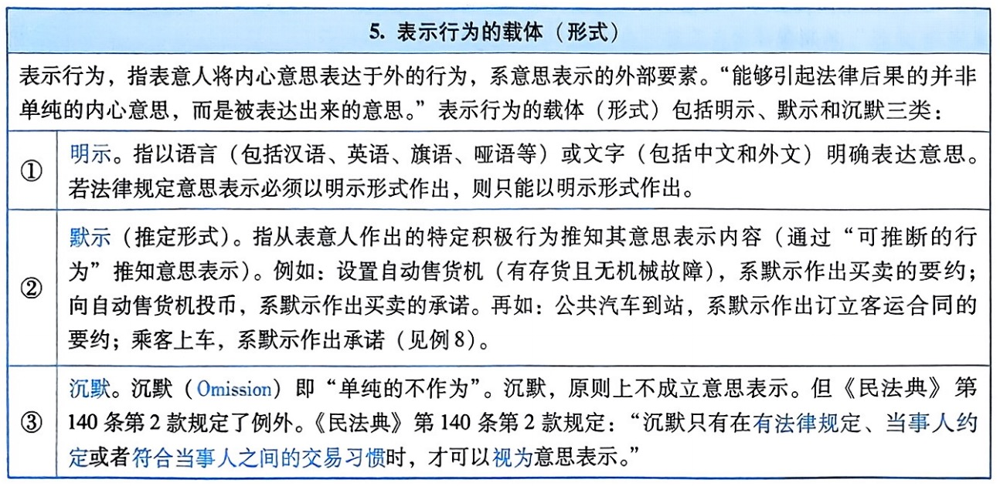

<table>
    <tr>
        <th>单纯沉默视为意思表示的几个民法规定</th>
    </tr>
    <tr>
        <td>根据《民法典》第145条的规定，限制民事行为能力人依法不能独立订立的合同效力待定。相对人可以催告法定代理人自收到通知之日起三十日内予以追认。法定代理人未作表示的，视为拒绝追认。</td>
    </tr>
    <tr>
        <td>根据《民法典》第171条的规定，因狭义无权代理订立的合同效力待定。相对人可以催告被代理人自收到通知之日起三十日内予以追认。被代理人未作表示的，视为拒绝追认。</td>
    </tr>
    <tr>
        <td>《民法典》第638条第1款规定：“试用买卖的买受人在试用期内可以购买标的物，也可以拒绝购买。试用期限届满，买受人对是否购买标的物未作表示的，视为购买。“</td>
    </tr>
    <tr>
        <td>《民法典》第718条规定：“出租人知道或者应当知道承租人转租，但是在六个月内未提出异议的，视为出租人同意转租。”</td>
    </tr>
    <tr>
        <td>《民法典》第1124条第1款规定：“继承开始后，继承人放弃继承的，应当在遗产处理前，以书面形式作出放弃继承的表示；没有表示的，视为接受继承。”</td>
    </tr>
    <tr>
        <td>《民法典》第1124条第2款规定：“受遗赠人应当在知道受遗赠后六十日内，作出接受或者放弃受遗赠的表示；到期没有表示的，视为放弃受遗赠。</td>
    </tr>
</table>

### 意思表示的类型

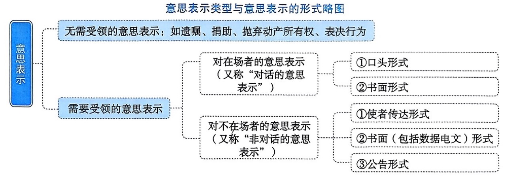

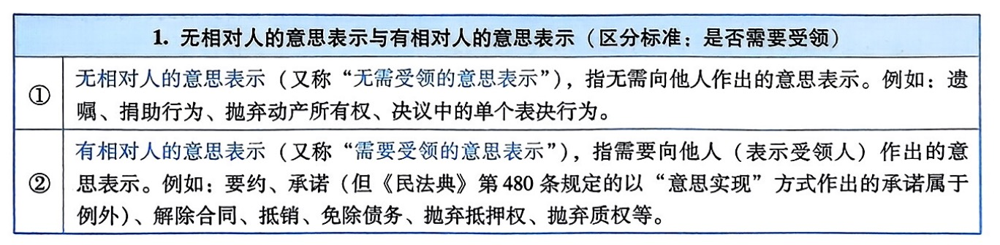

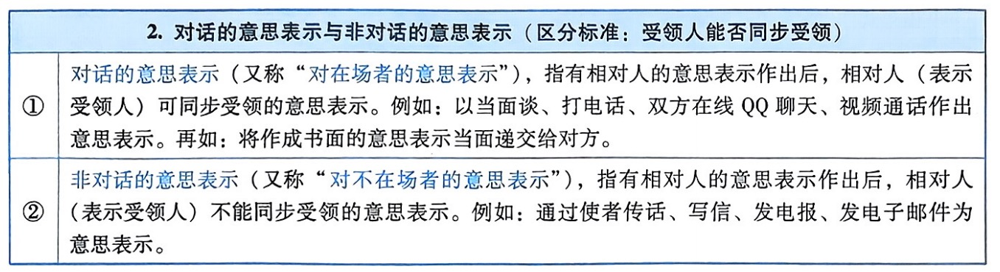

### 意思表示的生效规则

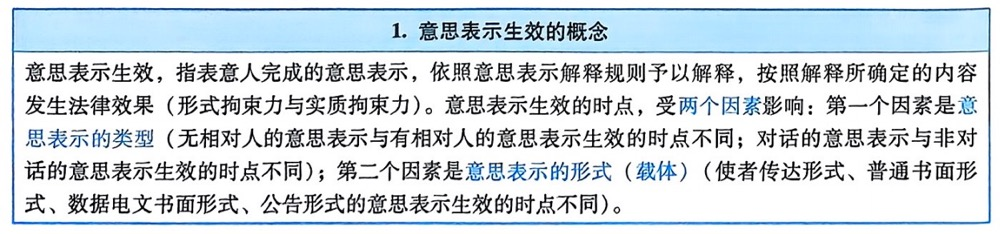

<table>
    <tr>
        <th colspan="2">2、无相对人的意思表示生效的时点</th>
    </tr>
    <tr>
        <td>法条</td>
        <td>《民法典》第138条规定：“无相对人的意思表示，表示完成时生效。法律另有规定的，依照其规定。”</td>
    </tr>
    <tr>
        <td rowspan="2">规范内容</td>
        <td>原则：无相对人的意思表示（如设立捐助法人的捐助行为、抛弃动产所有权），表示完成时（即“作成”时）生效。所谓“作成”，指表意人以可辨认的方式将其意思最终表达规范出来。换言之，将内在意思外在定形化。</td>
    </tr>
    <tr>
        <td>例外：法律另有规定的，依照其规定。如遗瞩为死因行为，遗瞩于按法定方式作成（不需要作出）时成立，但遗瞩须于遗人死亡时才生效。</td>
    </tr>
</table>

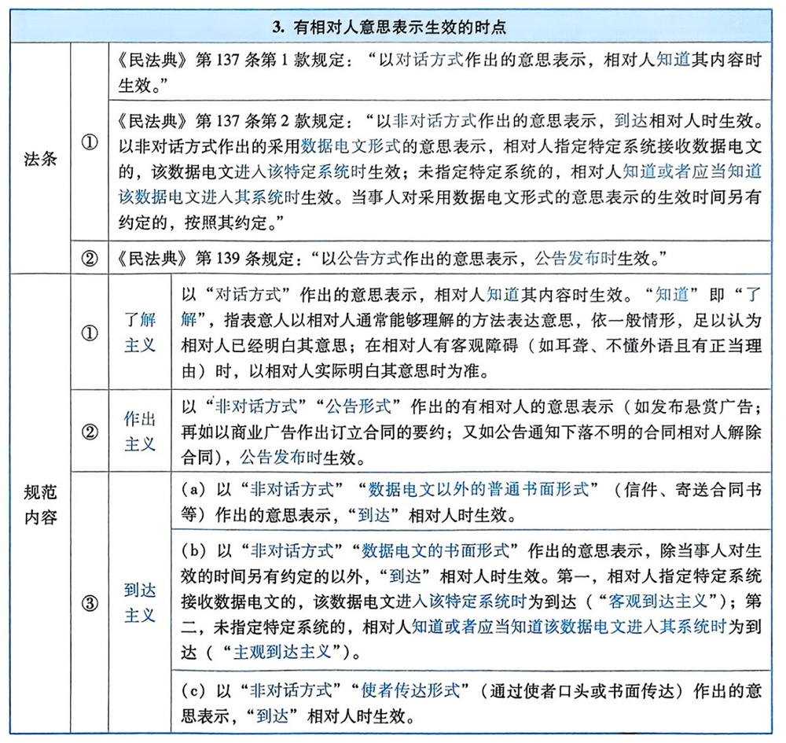

<table>
    <tr>
        <th>特别提示（一）：通过使者传达的有相对人意思表示的到达</th>
    </tr>
    <tr>
        <td>通过使者传达的有相对人的意思表示，系以非对话方式作出的有相对人的意思表示，自“到达”相对人（受领人）时生效。到达的标准因使者系“表示使者”和“受领使者”而有不同。</td>
    </tr>
    <tr>
        <td>若使者属于“表示使者”，须表示使者将意思表示“实际传达”给相对人（受领人）之时，方属到达，意思表示生效。</td>
    </tr>
    <tr>
        <td>若使者属于“受领使者”，对受领使者为意思表示后，依照交易观念，“能够期待受领使者能够将意思表示传达”给相对人（受领人）之时，即属到达，意思表示生效。</td>
    </tr>
</table>

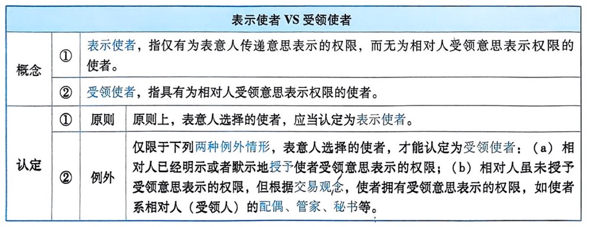

<table>
    <tr>
        <th>特别提示（二）：有相对人意思表示的“作出”</th>
    </tr>
    <tr>
        <td>有相对人的意思表示，常历经作成、作出、到达、了解四个阶段。意思表示于哪个阶段生效，取决于意思表示的类型和意思表示的形式，已如前述。而有相对人意思表示的作出，意义重大。所谓“作出”，又称“发出”，指表意人使意思表示向受领人方向运动，并且能够预期在正常情况下意思表示将到达受领人的行为。有相对人意思表示的“作出”，具有以下法律上的意义：</td>
    </tr>
    <tr>
        <td>
            未经作出，有相对人的意思表示不能生效。有相对人的意思表示，未经作出，即使意思表示已经（因某种原因）到达相对人，或者相对人已经（因某种原因）了解意思表示的内容，有相对人的意思表示仍不能生效（见例15与例16）。
         </td>
    </tr>
    <tr>
        <td>
            表意人有无权利能力和相应的行为能力，均依意思表示作出之时的状况为断。因此，根据通说，意思表示作出后，表意人死亡、丧失行为能力或者行为能力受限制的，意思表示的生效不因此受影响（见例17）。
        </td>
    </tr>
    <tr>
        <td>意思表示是否存在重大误解、显失公平、受欺诈、受胁迫等瑕疵，均依意思表示作出之时的状况为断。</td>
    </tr>
</table>

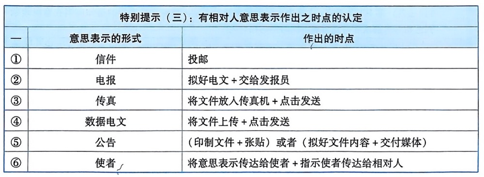

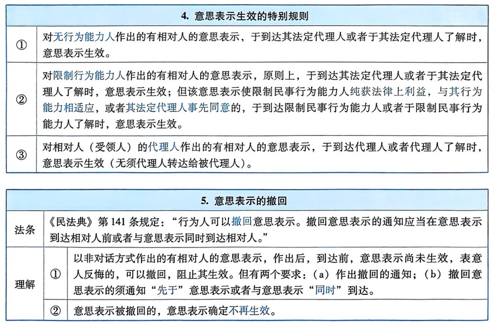

### 意思表示的解释规则

