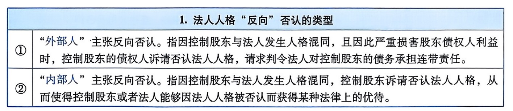

# 民法总则编-法人

::: tip
上述的法人的概念与特征，主要指的是他与法人人格否认制度相关的一个重要的特征 
 
 
例： 
甲、乙、丙各出资100万元设立A公司，A公司在经营中对B公司负担300万元债务。 
 
①甲、乙、丙对A公司的出资归A公司所有，不再归甲、乙、丙所有（甲、乙、丙仅因此享有相应的股权）；A公司取得的财产归A公司所有，而非甲、乙、丙所有。此乃“财产独立”。 
 
②甲、乙、丙虽为A公司的成员，但甲、乙、丙与A公司系民法上各自独立的人，A公司具有独立的法人意志；甲、乙、丙中的一人或数人退出、死亡，不影响A公司民法上人格的存在。此乃“人格独立”。 
 
③A公司对B公司的300万元债务，由A公司以所有的财产承担无限责任；甲、乙、丙对这300万元债务不承担责任；若甲、乙、丙出资有瑕疵（或出资后抽逃出资），根据《公司法解释（三）》第13条第2款与第14条第2款的规定，甲、乙、丙对这300万元债务在瑕疵出资（或抽逃出资）本息范围内承担补充责任（但在本质上仍系对A公司履行出资义务）。此乃“责任独立”。
:::

## 法人人格否认

### 法人人格否认的类型

#### 法人人格纵向否认

<table>
    <tr>
        <th>2.法人人格“纵向”否认时的诉讼架构</th>
    </tr>
    <tr>
        <td>债权人对债务人公司享有的债权已经由生效裁判确认，其另行提起公司人格否认诉讼，请求股东对公司债务承担连带责任的，列股东为被告，公司为第三人（《九民纪要》第13条）。</td>
    </tr>
    <tr>
        <td>债权人对债务人公司享有的债权提起诉讼的同时，一并提起公司人格否认诉讼，请求股东对公司债务承担连带责任的，列公司和股东为共同被告（《九民纪要》第13条）。</td>
    </tr>
    <tr>
        <td>债权人对债务人公司享有的债权尚未经生效裁判确认，直接提起公司人格否认诉讼，请求公司股东对公司债务承担连带责任的，人民法院应当向债权人释明，告知其追加公司为共同被告。债权人拒绝追加的，人民法院应当裁定驳回起诉（《九民纪要》第13条）。</td>
    </tr>
</table>

#### 法人人格横向否认

#### 法人人格反向否认

## 法定代表人、其他成员实施行为所生法律效果“归属于”法人承受的“归属规范”

::: tip
法人是民法上实实在在的法律人格，当然它是一个组织体。法人虽然享有民事权利，民事行为能力，但法人作为一个组织，它自己事实上不能实施任何行为，法人的一切行为都只能由法人机关或者法人的工作人员来代行，因此，法律就一定要规定法人机关或法人的工作人员实施的哪些行为产生的民法上的效果应当归属于法人来承受。
:::

### 法定代表人实施的法律行为

::: tip
法定代表人属于法人机关的一种，虽然法人还有其他机关，比如股东会，董事会，但他们作为权利机关和执行机关，他们往往只对内形成法人意志，不对外代表法人实施行为。
:::

<table>
    <tr>
        <th colspan="3">1.法定代表人实施的法律行为</th>
    </tr>
    <tr>
        <td rowspan="2">法条</td>
        <td colspan="2">《民法典》第61条第1款规定：“依照法律或者法人章程的规定，代表法人从事民事活动的负责人，为法人的法定代表人。”</td>
    </tr>
    <tr>
        <td colspan="3">《民法典》第61条第2款规定：“法定代表人以法人名义从事的民事活动，其法律后果由法人承受。”</td>
    </tr>
    <tr>
        <td rowspan="3">理解</td>
        <td rowspan="2">①</td>
        <td>规范内容：因有权代表行为（法定代表人、在代表权限内、以法人名义）所实施的民事法律行为，归属于法人承受。</td>
    </tr>
    <tr>
        <td>规范理由：代表理论（机关理论）。法定代表人执行职务时，无独立人格，法定代表人的人格被吸收，法定代表人的行为就是法人的行为。</td>
    </tr>
    <tr>
        <td>②</td>
        <td>《民法典》第61条第1款、第2款主要适用于“法律行为”，但根据法条文义，亦可适用于准法律行为、合法的事实行为（如收款、交货）等。</td>
    </tr>
</table>

::: tip
法定代表人的工商变更登记，不是发生法定代表人变更效果的生效要件，而只是对抗善意相对人的对抗要件。
:::

<table>
    <tr>
        <th colspan="4">3.法定代表人越权代表所订立合同归属于法人承受的规则</th>
    </tr>
    <tr>
        <td rowspan="5">法条</td>
        <td>①</td>
        <td colspan="2">《民法典》第504条规定：“法人的法定代表人或者非法人组织的负责人超越权限订立的合同，除相对人知道或者应当知道其超越权限外，该代表行为有效，订立的合同对法人或者非法人组织发生效力。”</td>
    </tr>
    <tr>
        <td>②</td>
        <td colspan="3">《民法典》第61条第3款规定：“法人章程或者法人权力机构对法定代表人代表权的限制，不得对抗善意相对人。”</td>
    </tr>
    <tr>
        <td rowspan="3">③</td>
        <td colspan="2">《民法典合同编通则解释》第20条第1款规定：“法律、行政法规为限制法人的法定代表人或者非法人组织的负责人的代表权，规定合同所涉事项应当由法人、非法人组织的权力机构或者决策机构决议，或者应当由法人、非法人组织的执行机构决定，法定代表人、负责人未取得授权而以法人、非法人组织的名义订立合同，未尽到合理审查义务的相对人主张该合同对法人、非法人组织发生效力并由其承担违约责任的，人民法院不予支持，但是法人、非法人组织有过错的，可以参照民法典第一百五十七条的规定判决其承担相应的赔偿责任。相对人已尽到合理审查义务，构成表见代表的，人民法院应当依据民法典第五百零四条的规定处理。”</td>
    </tr>
    <tr>
        <td colspan="2">《民法典合同编通则解释》第20条第2款规定：“合同所涉事项未超越法律、行政法规规定的法定代表人或者负责人的代表权限，但是超越法人、非法人组织的章程或者权力机构等对代表权的限制，相对人主张该合同对法人、非法人组织发生效力并由其承担违约责任的，人民法院依法予以支持。但是，法人、非法人组织举证证明相对人知道或者应当知道该限制的除外。”</td>
    </tr>
    <tr>
        <td colspan="2">《民法典合同编通则解释》第20条第3款规定：“法人、非法人组织承担民事责任后，向有过错的法定代表人、负责人追偿因越权代表行为造成的损失的，人民法院依法予以支持。法律、司法解释对法定代表人、负责人的民事责任另有规定的，依照其规定。”</td>
    </tr>
    <tr>
        <td>例子</td>
        <td colspan="3">甲公司的法定代表人为张某。张某代表甲公司与乙公司订立《合同A》。订立《合同A》时，张某超越了法律对其代表权限的“法定限制”或者超越了甲公司章程（或者权力机关决议）对其代表权限的“意定限制”。</td>
    </tr>
    <tr>
        <td rowspan="6">规范内容</td>
        <td rowspan="3">①</td>
        <td colspan="2">法定代表人超越代表权限以法人（或非法人组织）的名义与相对人订立的合同：</td>
    </tr>
    <tr>
        <td>(a)</td>
        <td>若相对人订立合同时为“善意”（不知道也不应当知道超越代表权限的事实），善意相对人有权主张，成立表见代表，无须法人（或非法人组织）追认，该合同直接归属于法人（或非法人组织）承受（“对法人或者非法人组织发生效力”）。单位因此遭受的损失有权依照《民法典》第62条的规定向法定代表人追偿。</td>
    </tr>
    <tr>
        <td>(b)</td>
        <td>若相对人订立合同时为“恶意”（知道或者应当知道超越代表权限的事实），该合同效力待定，未经法人（或非法人组织）追认，该合同不能归属于法人（或非法人组织）承受。须注意：法人（或非法人组织）虽不承担合同责任，但应当对恶意相对人承担缔约过失责任。当然，恶意的相对人也有过错，属于混合过错，可以减轻法人（或非法人组织）缔约过失责任。单位因此遭受的损失有权依照《民法典》第62条的规定向法定代表人追偿。</td>
    </tr>
    <tr>
        <td rowspan="3">②</td>
        <td colspan="2">相对人“善意”的证明责任分配规则</td>
    </tr>
    <tr>
        <td>(a)</td>
        <td>若法定代表人超越“对其代表权限的意定限制”（如《民法典》第61条第3款规定的法人章程或者权力机构所作限制），在证明责任的分配上，“推定”相对人为善意。</td>
    </tr>
    <tr>
        <td>(b)</td>
        <td>若法定代表人超越“对其代表权限的法定限制”（如《公司法》第15条的规定），在证明责任的分配上，由相对人对其善意承担证明责任，证明标准为“举证证明订立合同时尽到了合理的审查义务仍不知越权代表的事实”。</td>
    </tr>
</table>

### 法定代表人实施的侵权行为

### 法定代表人以外的其他工作人员实施的法律行为

### 法定代表人以外其他工作人员实施的侵权行为

### “人章关系异常”情形下所订立合同的归属

<table>
    <tr>
        <th colspan="2">1．“真人假章”合同的归属</th>
    </tr>
    <tr>
        <td>法条</td>
        <td>《民法典合同编通则解释》第22条第1款规定：“法定代表人、负责人或者工作人员以法人、非法人组织的名义订立合同且未超越权限，法人、非法人组织仅以合同加盖的印章不是备案印章或者系伪造的印章为由主张该合同对其不发生效力的，人民法院不予支持。</td>
    </tr>
    <tr>
        <td>理解</td>
        <td>拥有代表权的法定代表人或者拥有代理权的其他工作人员，在代表权限（代理权限）范围内，与相对人订立合同时，加盖了法人（或非法人组织）的公章（合同专用章），即表明其系“以法人（或非法人组织）的名义”订立合同，该合同直接归属于法人（或非法人组织）承受；即使其加盖的印章系伪造的印章或者与备案的印章不一致，在法律效果上，该合同仍直接归属于法人（或非法人组织）承受。</td>
    </tr>
</table>

## 公司对外担保（《公司法》第15条，《民法典担保制度解释》第7条至第12条）

