# 民法总则编-自然人

## 自然人的民事权利能力

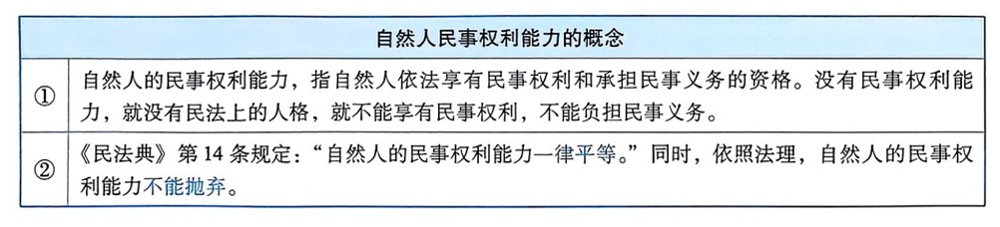

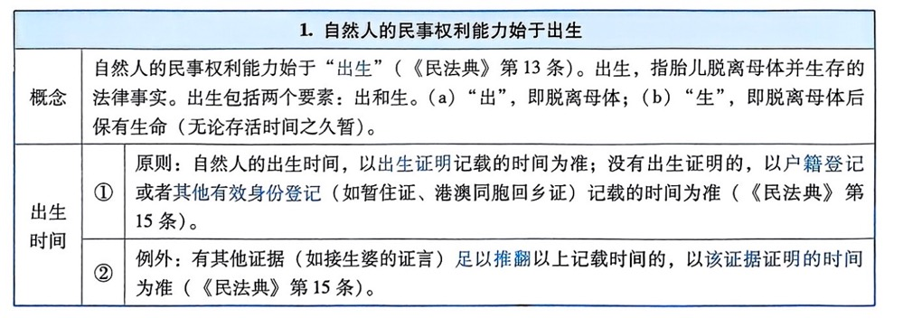

<table>
    <tr>
        <th colspan="3">胎儿的民事权利能力</th>
    </tr>
    <tr>
        <td>法条依据</td>
        <td colspan="2">《民法典》第16条规定：“涉及遗产继承、接受赠与等胎儿利益保护的，胎儿视为具有民事权利能力。但是，胎儿娩出时为死体的，其民事权利能力自始不存在。”</td>
    </tr>
    <tr>
        <td rowspan="4">规范内容</td>
        <td>①</td>
        <td>胎儿自受胎之时享有民事权利能力（对胎儿利益采“总括保护主义”），但附“法定解除条件”。（a）若胎儿“活着出生”，所附条件确定不成就，胎儿确定自受胎之时享有民事权利能力；（b）若胎儿“娩出时为死体”，所附条件成就，胎儿溯及自受胎之时自始不享有民事权利能力。</td>
    </tr>
    <tr>
        <td>②</td>
        <td>胎儿的民事权利能力是“单向度”的。仅限于“为保护胎儿利益”而“享有民事权利”（健康权、身体权、姓名权、继承权、受赠与的合同债权、侵权损害赔偿请求权等）的资格；而“不包括负担义务”的资格。</td>
    </tr>
    <tr>
        <td>③</td>
        <td>出生前，尚在母腹中的胎儿即可以自己的名义行使所享有的权利，由其父母作为法定代理人代为行使（《民法典总则编若干问题的解释》第4条）。行使权利并实际取得利益后，娩出时为死体的，由其父母承担返还不当得利的责任。</td>
    </tr>
    <tr>
        <td>④</td>
        <td>胎儿作为继承人受领遗产、接受赠与，均由其监护人（父母）代理或代为。因胎儿尚未出生，如继承或者接受赠与的财产须办理登记，只能以其监护人为权利人完成登记，并附注实际权利人为胎儿。</td>
    </tr>
</table>

<table>
    <tr>
        <th colspan="2">特别提示：胎儿的民事权利能力与遗产的处理规则</th>
    </tr>
    <tr>
        <td rowspan="2">法条</td>
        <td>《民法典继承编解释（一）》第31条第1款规定：“应当为胎儿保留的遗产份额没有保留的，应从继承人所继承的遗产中扣回。”</td>
    </tr>
    <tr>
        <td>《民法典继承编解释（一）》第31条第2款规定：“为胎儿保留的遗产份额，如胎儿出生后死亡的，由其继承人继承；如胎儿娩出时是死体的，由被继承人的继承人继承。</td>
    </tr>
    <tr>
        <td>理解</td>
        <td>举例说明：甲死亡时，甲的妻子身怀六甲，胎儿为乙。①甲死亡时，乙享有继承权，地位相对于甲的第一顺序法定继承人。②若为乙保留了应继份，但乙出生后死亡，为乙保留的应继份由乙的继承人继承。③若为乙保留了应继份，但乙娩出时是死体，为乙保留的应继份由甲的继承人继承。④若未为乙保留应继份，甲的其他继承人继承了甲的全部遗产，乙活着出生的，应当从甲的其他继承人处按比例扣回乙的应继份。</td>
    </tr>
</table>

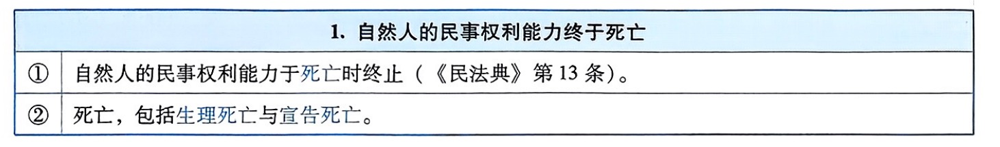

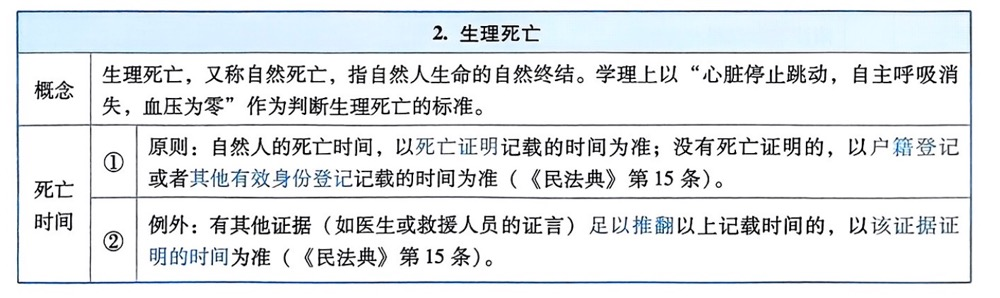

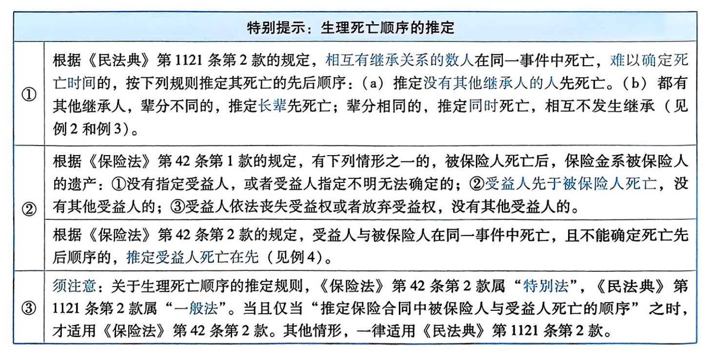

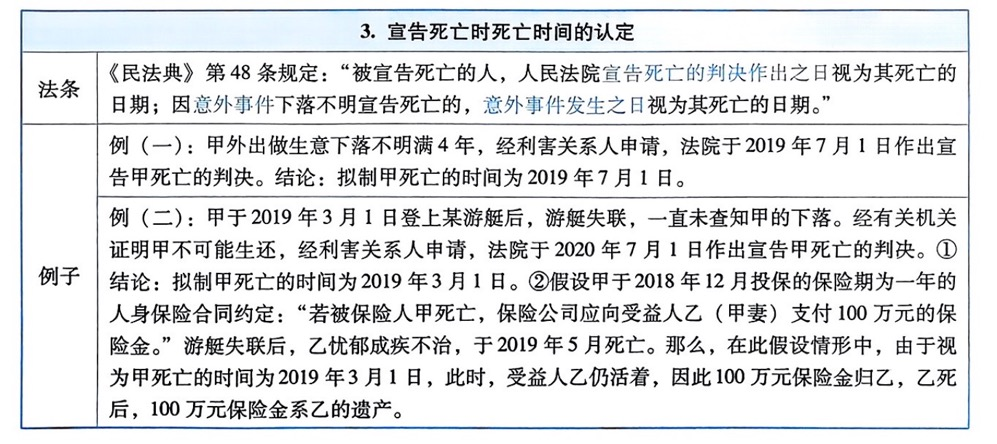

## 自然人的民事行为能力 

自然人的民事行为能力，指自然人能够独立实施一个有效法律行为的资格。 

根据自然人的年龄、智力和精神健康状况，《民法典》将自然人的民事行为能力分为完全民事行为能力、限制民事行为能力和无民事行为能力三种。

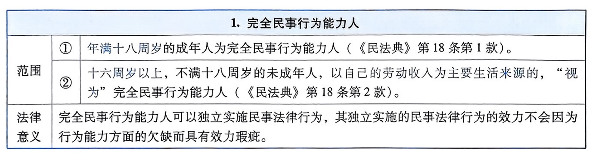

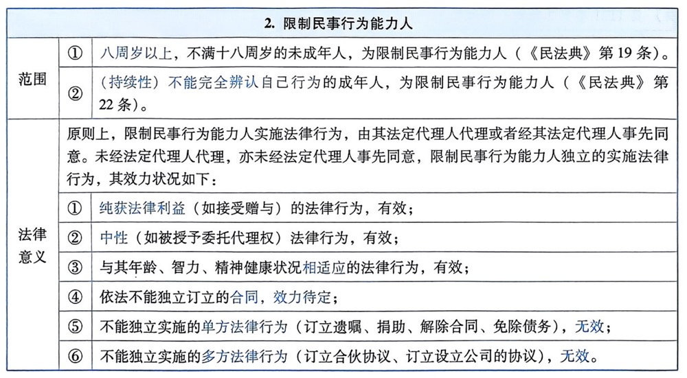

::: tip 名词解释
纯获法律利益---这个法律行为生效，它不会使限制民事行为能力人负担民事义务，承担民事责任。 
 
中性法律行为---这个法律行为如果生效，它既不会使限制民事行为能力人享有权利，但它也不会使限制民事行为能力人负担义务，承担责任。 
 
代理权---是一种地位和资格，不是一种真正的权利，代理权就是让代理人独立实施法律行为创设的民事权利，民事义务归属于被代理人承受的地位和资格，它本质上不是一个民法上的权利。
:::

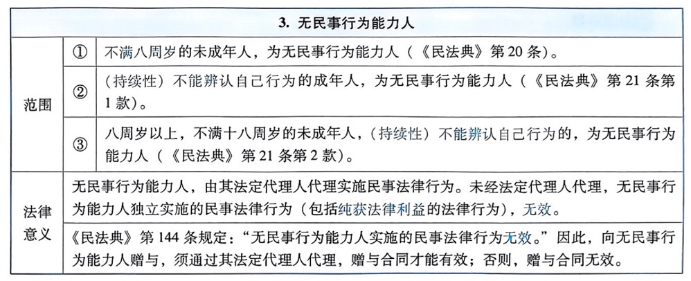

<table>
    <tr>
        <th colspan="2">成年人醉酒与民事行为能力、合同效力</th>
    </tr>
    <tr>
        <td colspan="2">成年人因醉酒，处于持续性不能完全辨认或者不能辨认自已行为的状态（如程度严重的病理性醉酒），醉酒者因此成为限制民事行为能力人或者无民事行为能力人。</td>
    </tr>
    <tr>
        <td colspan="2">成年人虽醉酒，但并未因此处于持续性不能完全辨认或者不能辩认自己行为的状态，仅属于一时性不能完全辨认或者不能辨认自己行为的状态（如生理性醉酒），醉酒者仍属完全民事行为能力人，醉酒者于此种醉酒状态下实施的法律行为，根据通说，其效力状况如下：</td>
    </tr>
    <tr>
        <td>原则</td>
        <td>法律行为有效。</td>
    </tr>
    <tr>
        <td rowspan="2">例外</td>
        <td>例外（一）：若因一时性醉酒，醉酒者暂时失去意识或者暂时精神错乱，则法律行为无效。在比较法上，《德国民法典》第105条第2款规定：“在丧失知觉或者暂时的精神错乱的状态下做出的意思表示亦无效。</td>
    </tr>
    <tr>
        <td>例外（二）：一时性醉酒者虽未因此暂时失去意识或者暂时精神错乱，但是，若其实施的法律行为符合重大误解或者显失公平的构成要件，醉酒者有权撤销。</td>
    </tr>
</table>

## 监护

监护，指监护人对被监护人（未成年人和需要保护的成年人）的人身、财产和其他合法权益依法实行监督和保护的制度。承担监护义务的人为监护人，受监护人监督和保护的人为被监护人。 
 
监护权的性质。监护人享有的所谓“监护权”，实为一种“资格”，既包含监护的义务，也包含监护的权限（为被监护人利益可相对自由行动的一种空间）。 

::: tip 
监护人处分被监护人的财产受到严格限制，只有在专为被监护人利益的范围内，监护人才有权处分被监护人的财产。
:::

<table>
    <tr>
        <th colspan="2">监护人的职责（《民法典》第34条与第35条）</th>
    </tr>
    <tr>
        <td rowspan="2">①</td>
        <td>监护人应当按照最有利于被监护人的原则履行监护职责，保护被监护人的人身权利、财产权利以及其他合法权益；除为维护被监护人利益外，不得处分被监护人的财产。</td>
    </tr>
    <tr>
        <td>监护人“非为”维护被监护人的利益处分被监护人的财产的：（a）若以被监护人的名义，属于“无权代理”；（b）若以监护人自已的名义，属于“无权处分”。须注意：下述“特别提示”提及的《民法典婚姻家庭编解释（二)》第15条。</td>
    </tr>
    <tr>
        <td>②</td>
        <td>担任被监护人的法定代理人（《民法典》第23条），代理被监护人实施民事法律行为，代理被监护人进行诉讼。</td>
    </tr>
    <tr>
        <td>③</td>
        <td>对被监护人的侵权行为，（在被监护人无财产或财产不足以承担责任时）承担无过错的替代责任（《民法典》第1188条）。</td>
    </tr>
    <tr>
        <td rowspan="2">④</td>
        <td>未成年人的监护人履行监护职责，在作出与被监护人利益有关的决定时，应当根据被监护人的年龄和智力状况，尊重被监护人的真实意愿（《民法典》第35条第2款）。</td>
    </tr>
    <tr>
        <td>成年人的监护人履行监护职责，应当最大程度地尊重被监护人的真实意愿，保障并协助被监护人实施与其智力、精神健康状况相适应的民事法律行为；对被监护人有能力独立处理的事务，监护人不得干涉（《民法典》第35条第3款）。</td>
    </tr>
    <tr>
        <td>⑤</td>
        <td>监护人不履行监护职责或者侵害被监护人合法权益的，应当承担法律责任。</td>
    </tr>
</table>

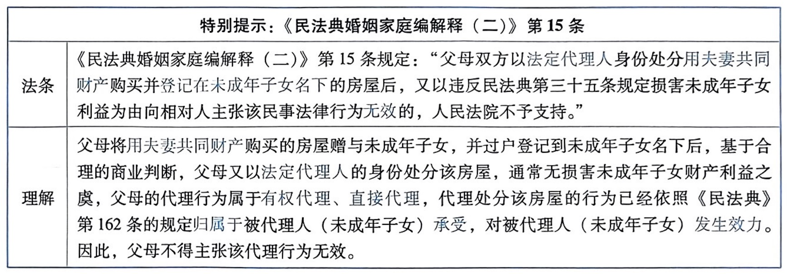

### 监护类型

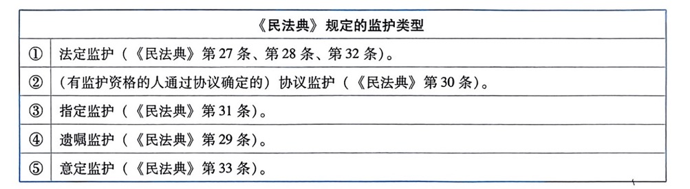

::: tip
法定监护---就是依照法律的规定，自动的由顺序在前有监护能力的人担任被监护人的监护人，只有当没有前一顺序的有监护能力的人或者前一顺序的人没有监护能力，才自动的由下一顺序有监护能力的人担任法定监护人。 
 
协议监护---指的是对担任监护发生争议以后，民法典第27条第二款规定的未成年人的第二第三第四顺位有监护资格的人，他们可以订立一个协议，确定到底是由第二第三第四顺位的人担任监护人还是共同担任监护人。如果被监护人是一个成年人，就是由民法典第二十八条规定的有监护资格的第一第二第三第四顺位的人，实施一个多方法律行为，订立一个协议，确定监护人。它的特点是，协议确定的监护人可以突破法定顺序的限制，完全可以协议法定顺序在后的人担任监护人，也可以确定由不同顺序的人共同担任监护人。 
 
指定监护---当有监护资格的人争当监护人或者推诿都提出不愿意担任监护人的时候，那么可以请求法定的机关在民法典第二十七条第二款以及民法典第二十八条第一款规定的有监护资格的人当中指定一个人或数个人担任监护人。 
 
遗嘱监护---父母在担任子女的监护人期间，父母有权利以订立遗嘱的方式指定父母一方或者双方死亡后子女的监护人。 
 
意定监护---又叫成年协议监护，完全民事行为能力人和心仪的自然人单位订立书面协议，约定将来自己变为无限制民事行为能力人以后，由书面协议约定的人担任意定监护人。
:::

<table>
    <tr>
        <th colspan="2">1．未成年人的法定监护人（《民法典》第27条与第32条）</th>
    </tr>
    <tr>
        <td colspan="2">未成年人，按照下列法定的五个顺序，确定其监护人。具体而言：自动地由顺序在前且有监护能力的人担任监护人；没有前一顺序的人或者前一顺序的人均没有监护能力的，自动地由后一顺序且有监护能力的人担任监护人。监护人可以为一人，亦可为数人。</td>
    </tr>
    <tr>
        <td rowspan="3">①</td>
        <td>第一顺序：父母（包括婚生父母、非婚生父母、养父母、形成抚养关系的继父母）。</td>
    </tr>
    <tr>
        <td>须注意：父母不仅系第一顺序监护人，还是“当然”监护人，因此，父母有监护能力时，不能启动协议监护或者指定监护，将父母以外的人确定为监护人；但是，未成年人的父母可以与其他具有监护资格的人订立协议约定在未成年人的父母丧失监护能力时由该具有监护资格的人担任监护人（《民法典总则编若干问题的解释》第8条第1款）。</td>
    </tr>
    <tr>
        <td>还须注意：未成年人的父母离婚，不影响法定监护关系，离婚后的父母仍为未成年子女的当然监护人，仅抚养义务的轻重不同。</td>
    </tr>
    <tr>
        <td>②</td>
        <td>第二顺序：祖父母、外祖父母。</td>
    </tr>
    <tr>
        <td>③</td>
        <td>第三顺序：兄、姐。</td>
    </tr>
    <tr>
        <td>④</td>
        <td>第四顺序：经未成年人住所地的居民委员会、村民委员会或者民政部门同意的，其他愿意担任监护人的个人或者有关组织。</td>
    </tr>
    <tr>
        <td>⑤</td>
        <td>第五顺序：监护人由民政部门担任，也可以由具备条件的被监护人住所地的居民委员会、村民委员会担任（《民法典》第32条）。</td>
    </tr>
</table>

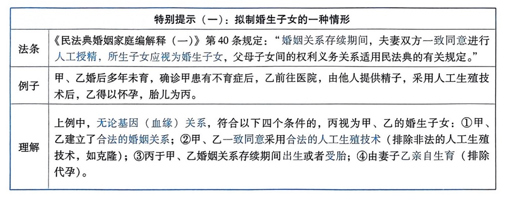

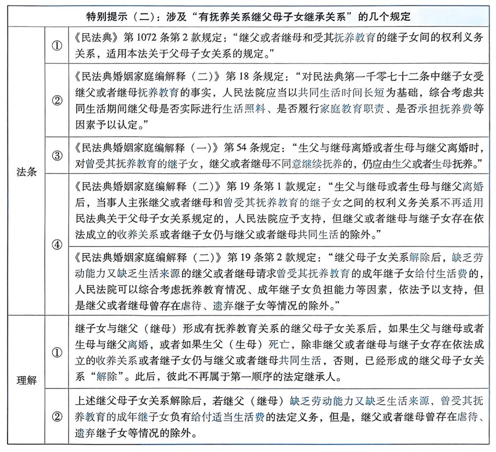

注意：上图的《民法典婚姻家庭编解释（二）》第19条第1款修改了《民法典婚姻家庭编解释（一)》第54条。以后我们只依照《民法典婚姻家庭编解释（二）》第19条第1款的规定来把握。

<table>
    <tr>
        <th colspan="2">2.无、限制民事行为能力的成年人的法定监护人（《民法典》第28条与第32条）</th>
    </tr>
    <tr>
       <td colspan="2">无、限制民事行为能力的成年人，按照下列法定的五个顺序，确定其监护人。监护人可以为一人，亦可为数人。</td> 
    </tr>
    <tr>
        <td rowspan="2">①</td>
        <td>第一顺序：配偶。</td>
    </tr>
    <tr>
        <td>须注意：配偶虽系第一顺序监护人，但并非当然监护人，因此，即使配偶拥有监护能力，亦可启动协议监护或者指定监护，将配偶以外的人确定为监护人。</td>
    </tr>
    <tr>
        <td>②</td>
        <td>第二顺序：父母、子女。</td>
    </tr>
    <tr>
        <td>③</td>
        <td>第三顺序：其他近亲属。</td>
    </tr>
    <tr>
        <td>④</td>
        <td>第四顺序：经被监护人住所地的居民委员会、村民委员会或者民政部门同意的，其他愿意担任监护人的个人或者有关组织。</td>
    </tr>
    <tr>
        <td>⑤</td>
        <td>第五顺序：监护人由民政部门担任，也可以由具备条件的被监护人住所地的居民委员会、村民委员会担任（《民法典》第32条）。</td>
    </tr>
</table>

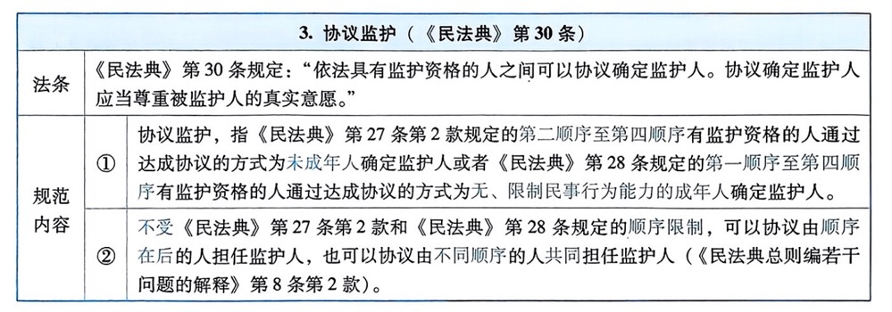

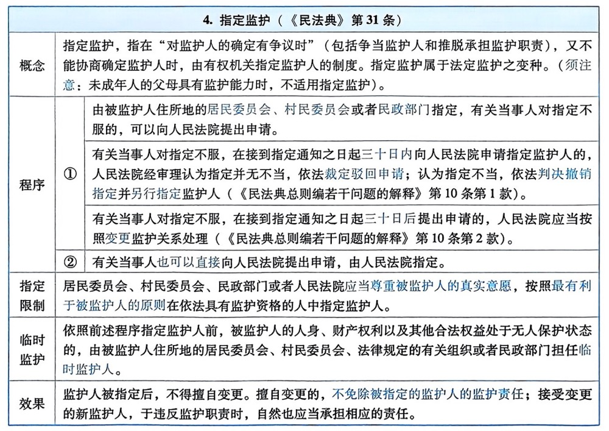

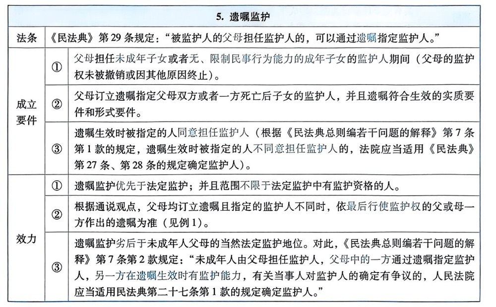

<table>
    <tr>
        <th colspan="3">6.意定监护（成年协议监护）</th>
    </tr>
    <tr>
        <td>法条</td>
        <td colspan="2">《民法典》第33条规定：“具有完全民事行为能力的成年人，可以与其近亲属、其他愿意担任监护人的个人或者组织事先协商，以书面形式确定自己的监护人，在自己丧失或者部分丧失民事行为能力时，由该监护人履行监护职责。”</td>
    </tr>
    <tr>
        <td rowspan="4">理解</td>
        <td>①</td>
        <td>《民法典》规定的意定监护，打破了监护法上被监护人不得为自已指定监护人的陈规。</td>
    </tr>
    <tr>
        <td>②</td>
        <td>意定监护，既可以约定为有偿，亦可约定为无偿。</td>
    </tr>
    <tr>
        <td>③</td>
        <td>具有完全民事行为能力的成年人，若担心将来（因年老、疾病等原因导致意志力、判断力和体力下降）不能自我保护，可通过书面协议的方式，为自已设定监护人。这也是
《民法典》面临老龄化社会现实之举措。</td>
    </tr>
    <tr>
        <td>④</td>
        <td>在效力上，意定监护优先于法定监护，意定监护也优先于遗嘱监护。</td>
    </tr>
</table>

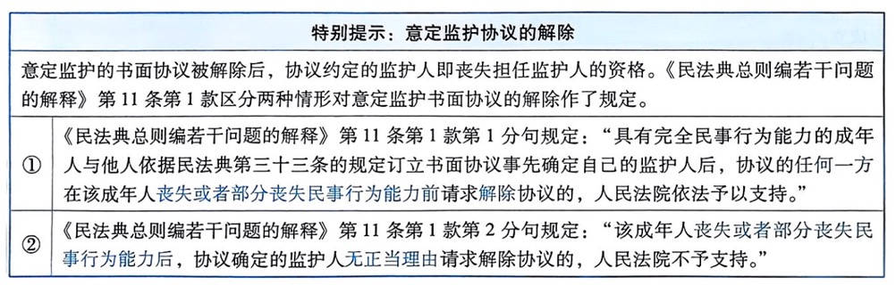

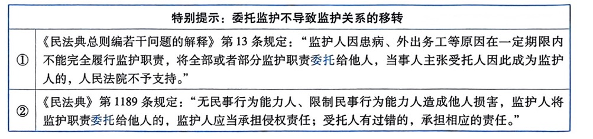

### 监护资格的撤销与监护关系的终止

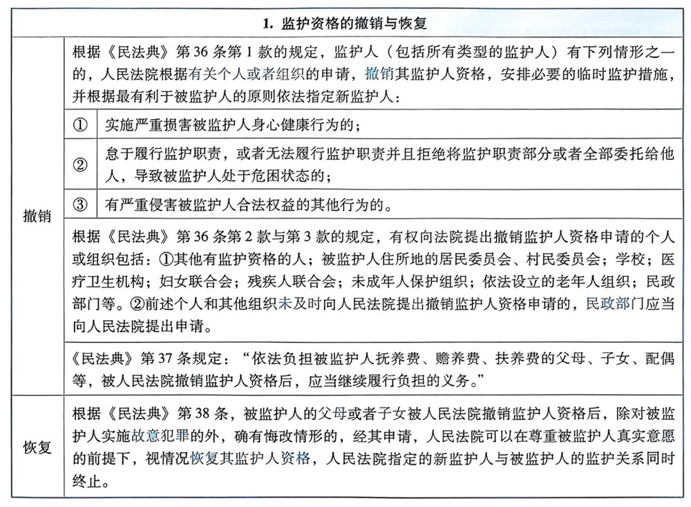

<table>
    <tr>
        <th>
            2.监护关系终止
        </th>
    </tr>
    <tr>
        <td>
            《民法典》第39条第1款规定，有下列情形之一的，监护关系终止：（a）被监护人取得或者恢复完全民事行为能力；（b）监护人丧失监护能力；（c）被监护人或者监护人死亡；（d）人民法院认定监护关系终止的其他情形。
        </td>
    </tr>
    <tr>
        <td>
            《民法典》第39条第2款规定，监护关系终止后，被监护人仍然需要监护的，应当依法另行确定监护人。
        </td>
    </tr>
</table>

## 宣告失踪与宣告死亡

### 宣告失踪

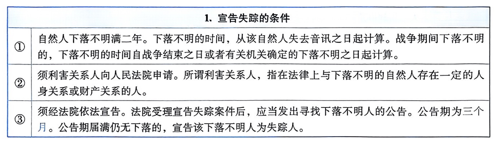

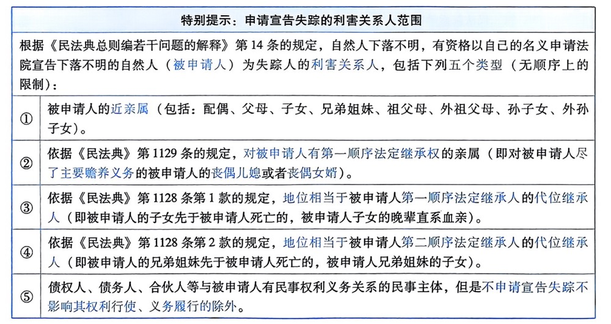

<table>
    <tr>
        <th colspan="3">2.宣告失踪的法律效果（《民法典》第42条至第44条）</th>
    </tr>
    <tr>
        <td rowspan="3">①</td>
        <td colspan="2">“为失踪人设立财产代管人”。财产代管人的设立和财产代管人的职责包含下述两个方面的内容。</td>
    </tr>
    <tr>
        <td>(a)</td>
        <td>失踪人的财产由其配偶、成年子女、父母或者其他愿意担任财产代管人的人代管。代管有争议，没有前述的人，或者前述的人无代管能力的，由人民法院指定的人代管</td>
    </tr>
    <tr>
        <td>(b)</td>
        <td>财产代管人应当妥善管理失踪人的财产，维护其财产权益。财产代管人因故意或者重大过失造成失踪人财产损失的，应当承担赔偿责任。</td>
    </tr>
    <tr>
        <td rowspan="2">②</td>
        <td colspan="2">被宣告失踪人权利的行使。《民法典总则编若干问题的解释》第15条第1款规定：“失踪人的财产代管人向失踪人的债务人请求偿还债务的，人民法院应当将财产代管人列为原告。”规范理由：代管人基于“诉讼担当”列为原告。</td>
    </tr>
    <tr>
        <td colspan="2">被宣告失踪人义务的履行。《民法典总则编若干问题的解释》第15条第2款规定：“债权人提起诉讼，请求失踪人的财产代管人支付失踪人所欠的债务和其他费用的，人民法院应当将财产代管人列为被告。经审理认为债权人的诉讼请求成立的，人民法院应当判决财产代管人从失踪人的财产中支付失踪人所欠的债务和其他费用。”规范理由：代管人基于“诉讼担当”列为被告。</td>
    </tr>
</table>

::: tip
财产代管人代管毕竟是无偿代管，因此有一个免责事由，财产代管人代管期间造成代管的财产毁损灭失的，只有在代管人对财产的毁损灭失具有故意，或重大过失的时候，财产代管人才承担损害赔偿责任。
:::

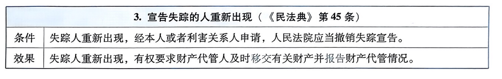

### 宣告死亡

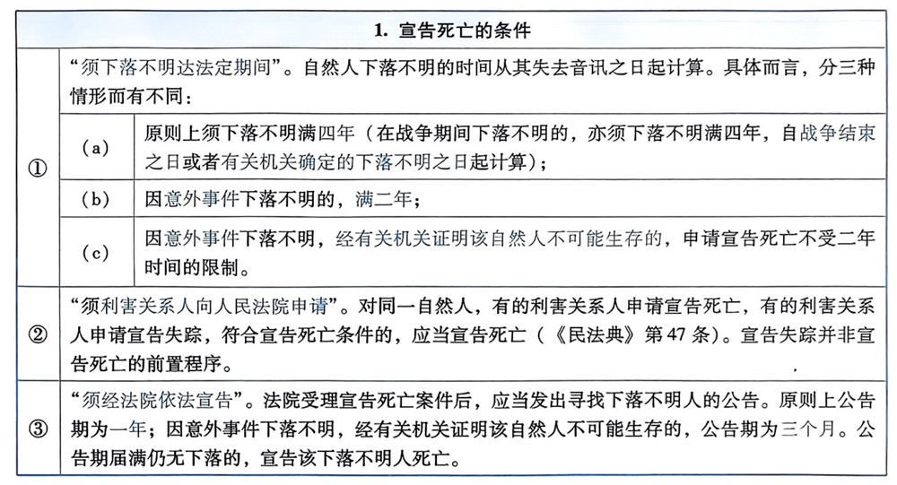

<table>
    <tr>
        <th colspan="2">特别提示（一）：申请宣告死亡的利害关系人范围</th>
    </tr>
    <tr>
        <td colspan="2">根据《民法典总则编若干问题的解释》第16条的规定，自然人下落不明，有资格以自已的名义申请法院宣告下落不明的自然人（被申请人）死亡的利害关系人，包括下列六个类型（无顺序上的限制）：</td>
    </tr>
    <tr>
        <td>①</td>
        <td>被申请人的配偶、父母、子女。</td>
    </tr>
    <tr>
        <td>②</td>
        <td>依据《民法典》第1129条的规定，对被申请人有第一顺序法定继承权的亲属（即对被申请人尽了主要赠养义务的被申请人的丧偶儿媳或者丧偶女婿）。</td>
    </tr>
    <tr>
        <td>③</td>
        <td>被申请人的其他近亲属（包括：兄弟姐妹、祖父母、外祖父母、孙子女、外孙子女），符合下列两种情形之一的：（a）被申请人的配偶、父母、子女均已死亡或者下落不明的；（b）不申请宣告死亡不能保护其相应合法权益的</td>
    </tr>
    <tr>
        <td>④</td>
        <td>依据《民法典》第1128条第1款的规定，地位相当于被申请人第一顺序法定继承人的代位继承人（即被申请人的子女先于被申请人死亡的，被申请人子女的晚辈直系血亲），符合下列两种情形之一的：（a）被申请人的配偶、父母、子女均已死亡或者下落不明；（b）不申请宣告死亡不能保护其相应合法权益。</td>
    </tr>
    <tr>
        <td>⑤</td>
        <td>依据《民法典》第1128条第2款的规定，地位相当于被申请人第二顺序法定继承人的代位继承人（即被申请人的兄弟姐妹先于被申请人死亡的，被申请人兄弟姐妹的子女），符合下列两种情形之一的：（a）被申请人的配偶、父母、子女均已死亡或者下落不明；（b）不申请宣告死亡不能保护其相应合法权益。</td>
    </tr>
    <tr>
        <td>⑥</td>
        <td>不申请宣告死亡不能保护其相应合法权益的被申请人的债权人、债务人、合伙人等民事主体（例如，给下落不明者支付退休金的单位。再如，被保险人被宣告死亡，保险公司须申请法院撤销死亡宣告的判决才不支付保险金，此时保险公司为利害关系人）。</td>
    </tr>
</table>

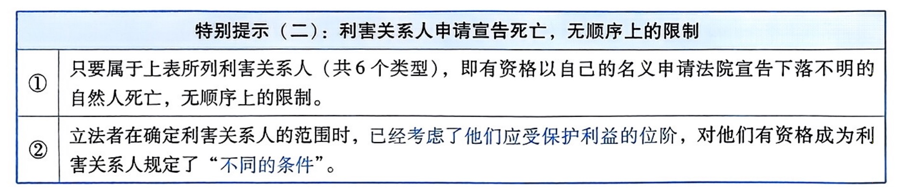

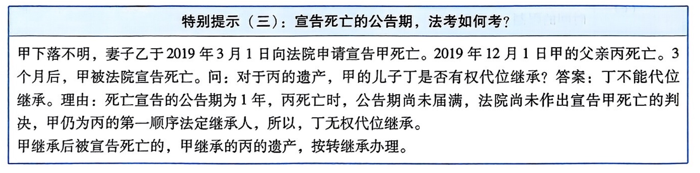

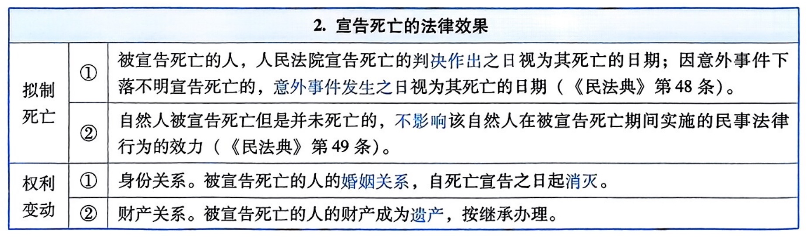

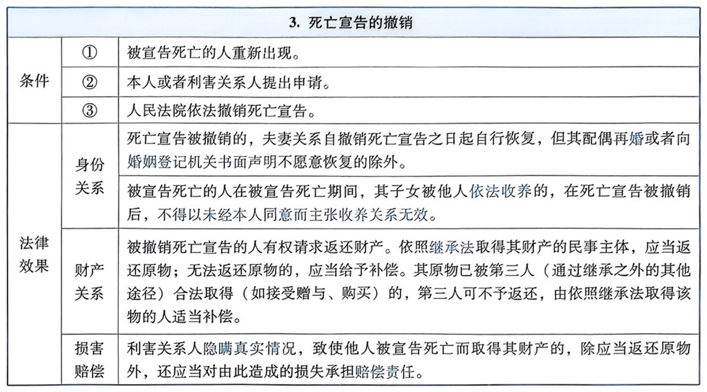

