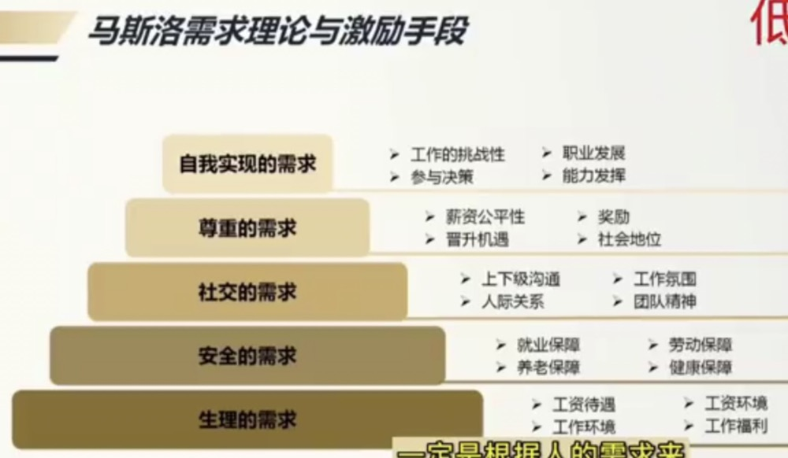
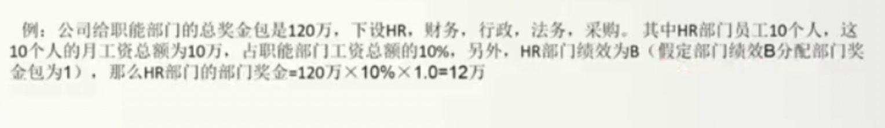
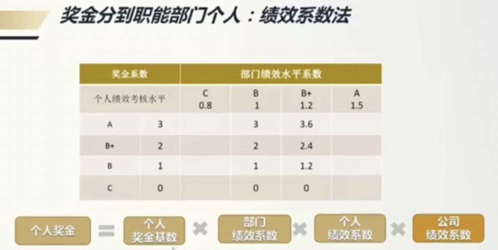
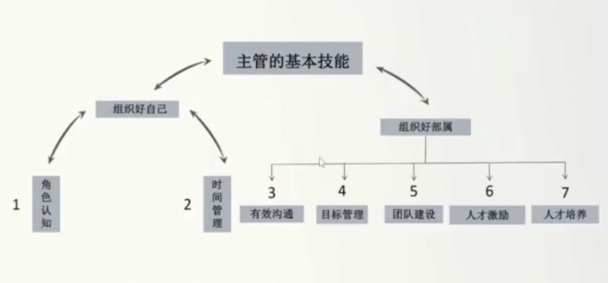

#  管理

## 人才激励

::: tip
`马斯洛需求`如果切的更细一些，生理需求和安全需求统称为物质需求，社交需求和尊重需求统称为精神需求，自我实现需求为发展需求
:::

### 物质激励

::: tip 
公司奖金池->部门奖金包->个人奖金 
团队优先，兼顾个人，大河有水，小河满 
:::

::: tip 薪酬包
收入和利润将决定整个公司的薪酬包，薪酬包是工资加奖金加激励。薪酬包适合企业的发展期，成熟期和衰退期。初创期不适合这种模式，因为你还没有稳定的收入和利润，如果按这个来，员工可能拿不到工资。 
 
薪酬包的几种方式 
`薪酬包 = 销售额 ✖️  分享比例 + 战略粮食包` 
`薪酬包 = 分配前利润额 ✖️ 分享比例 + 战略粮食包` 
`薪酬包 = 销售额 ✖️  分享比例 ✖️  权重 + 分配前利润 ✖️  分享比例 ✖️  权重 + 战略粮食包` 
分享比例要结合同行的一个竞争水平 
 
战略粮食包的存在是，一些部门开始对公司的营收没有帮助但属于公司的战略性投入，如果他们也按薪酬包的方式计算薪水，其他部门高管将不愿意成立新部门，因为会动他们的蛋糕，所以公司会给这样的部门一个独立的薪酬包，这就是战略粮食包 
这种薪酬包的好处是，利用薪酬包，让高管去控制他们自己团队的人效
:::

::: tip 销售总监的奖金
销售总监的薪酬包通常是公司单独把这部分预算拿出来的 
 
`销售总监奖金 = 业绩奖金 + 绩效奖金 + 降本增效奖` 
业绩奖金 = 基线奖金包 ✖️ （1 + 销售额增长率） 
绩效奖金 = 绩效奖金基数 ✖️ 绩效系数（顾客满意度，干部培养，创新） 
降本增效奖 = 降成本费用 ✖️  20% 
 
`基线奖金包`可以是固定数值，也可以是去年拿到的奖金作为今年的基线奖金包，但是特别是传统行业，它有自然增长，意味着这人什么都不做，也有可能拿的会比去年还多或者持平，如果不想给这种躺平的人发放奖金，可以采取`存量打折，增量加速`的方式，也可以采取`存量不打折，增量加速`的方式（采取这种方式是因为，今年要做到去年的业绩非常不容易，想要维持都很难，去年有可能还有一些当地政策的利好，或者某一事件导致他业绩做的比较好，利用这种方式，可以防止他没有冲劲）
:::

::: tip 销售人员奖金
`销售人员奖金 = 收入 ✖️  产品系数k1 ✖️  客户系数k2 ✖️  盈利系数k3 + 绩效奖金` 
 
产品系数。例如基础系数卖水是0.2%，卖饮料是0.5%，卖一瓶饮料相当于卖两瓶半的水，这是防止员工只卖老产品不卖新产品，或者只卖好卖的产品 
 
客户系数。企业要增长的时候，有一个逻辑，就是把新产品卖给老客户，把老产品卖给新客户，例如你卖水，发现餐饮店里对水的需求量是比较小的，一般消费者都是点饮料，如果你能把水卖给餐饮店，基础系数是1.5，其他场景是1，这就是把老产品卖给新客户，从而实现增长 
 
盈利系数。员工经常会要折扣，他们总是会想要争取特批的促销，他明明可以不压的那么低，但他为了销售出去产品，经常把公司底价给客户，明明可以争取也不争取，可以利用这个盈利系数解决这个问题，比如我们设置三种价格，目录价盈利系数为1.2，授权价盈利系数为1.0，特批价盈利系数为0.8 
:::

::: tip 职能部门奖金
薪酬比例法 
`部门奖金包 = 职能大奖金包 ✖️ 工资占比 ✖️ 部门绩效系数` 

 

个人奖金基数可以设一个岗位的基数，只要在这个岗位上，它的平均奖金是多少 
公司绩效系数，如果你公司已经有职能大奖金包，不需要乘公司绩效系数，如果没有，就需要乘，比如公司今年刚好完成业绩是1，如果超额完成是1.2
:::

### 精神激励

`精神激励一定要有仪式感`

::: tip
星光大道，高管晚餐，带薪休假，鼓励，信任，授权 
N个好消息要分开说 
N个坏消息要一起说 
一个大的坏消息和一个小的好消息，要分开说 
一个大的好消息和一个小的坏消息，要一起说 
好消息晚说不如早说，坏消息早说不如晚说 
精神奖品：吃不掉，用不掉，扔不掉，送不掉 
小奖不如不奖，小罚不如不罚 
:::

### 发展激励

::: tip
多讲前景：男怕入错行 
帮助成长：女怕嫁错郎 
适度空间 
:::

## 人才培养

::: tip 人才培养理念
无培养不合格，无替补不晋升 
不依赖"聪明人" 
人才识别三三法则：3个月，1年，3年（3个月当中，我们要识别末30%的人，人招错了，尽快让它们走。1年当中我们要识别出前30%的人，给予更多机会，薪资，奖金，防止他们走掉。3年当中，我们要识别出前30%的人和后30%的人，前30%的人可能会成为公司的栋梁，要培养，晋升，轮岗等，后30%的人会逐步成为老黄牛，老油条，这类人群在团队中会成为毒瘤，要么去改变他，要么请他离开。） 
:::

