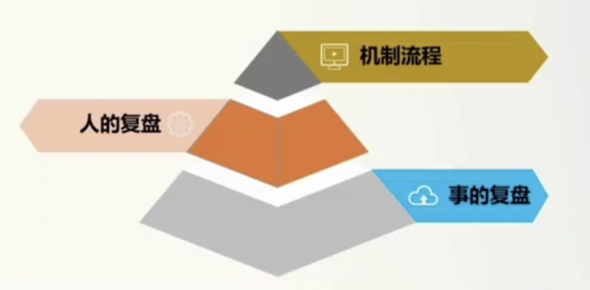

#  管理

`对待下属，像对待客户一样挖他的需求，像对待上司一样尊重他`

::: tip 常见的管理者误区
1.保姆---站在下属的立场包办所有 
一切事揽在身上，事必躬亲 
员工干不好的替他干，员工不会的帮他做 
处处站在下属的立场上思考 
 
2.甩手掌柜---事不关己高高挂起 
经常说“你自己看着办吧” 
不知道工作的进展是如何，进展到什么样子 
 
3.土皇帝---如一方诸侯或小国之君 
太把自己当干部，以自己为中心，喜欢搞“一言堂” 
官僚作风严重，打官腔，不办实事 
做得好，是自己领导有方，做得不好，是下属太无能 
 
4.自然人---把自己当成普通员工 
把干部当干粮 
喜怒哀乐，远近亲疏，一目了然，行为举止过于随意 
经常说“只代表个人意见” 
 
5.传声筒---此类管理者，可有可无 
老板说...... 
员工说...... 
没有自己的理解和建议 
不给建议，不承担 
:::

## 时间管理

::: tip 时间管理五大陷阱和现状
事情太多太杂，一团乱麻 
工作被打断 
拖延症---“反正时间还早” 
事必躬亲 
文件满桌 
:::

::: tip 快速记录法
月计划->周计划->日计划 
注意不可无间隙流水记录 
 
月计划示例 

周计划示例 

日计划示例 

 
月计划有两个计划，一个是业务计划，一个是团队计划。这两个纬度，一个是对事一个是对人。计划当中一定要有目标，目标一定要是可衡量可量化的。分解到周的时候，一定要分解到行为，可跟踪，就是目标量化行动可落地。
:::

## 会议管理

::: tip 高效会议的四步骤
充分的会前准备 
明确的会议目的 
合理的组织形式 
高效的会议跟进 
:::

::: tip 可以不开会的5个如果

:::

## 有效沟通

`初阶管理层（基层管理者）很少空降，越空降越难留下来，需要自己培养` 
`中阶管理层，用好能人复制优秀，激发他们的主观能动性` 

::: tip
沟通的基本问题是`心态` 
沟通的基本原理是`真诚` 
沟通的基本要求是`主动` 
:::

### 有效沟通三个要点

#### 1.艺术的表达

##### (1)语言

::: tip 关注对方需求
①投其所好---一定是站在对方的立场上 
示例： 
对不起只剩一份鱼丸了`->`鱼丸卖的太好了，幸好还有最后一份，你看要不要马上点一份 
`站在对方的立场，客户的需要是点招牌菜` 
 
老板，你可以抽出2小时参加我部门的总结大会吗？`->` 老板，我这个月100万的目标，完成70%了，我的目标是超越目标，这次动员大会如果成功了，我完成目标的信心指数会增加2倍，超过目标的概率也会大大提升，所以我只需要老板给我支持一件事，我这个动员大会缺不了你的支持，如果你能够在大会上跟大家鼓鼓气，我这个大会就成功了80%了 
`站在对方的立场，老板要的是经营成果，要的是给公司赚钱` 
`人与人之间的互动，更多的是价值的交换，要多讲些数据` 
 
②投其所恶 
示例： 
麻烦合上马桶盖`->`听说不盖马桶盖会影响风水 
`担心影响风水，怕失去`
 
请勿触摸展品`->`展品涂有药品，药品有毒请勿触摸 
`担心生命健康` 
 
③给对方选择的自由 
示例： 
下班后出席碰头会`->`下班后出席碰头会，是吃烤肉饭还是猪排饭 
周末去爬山`->`周末咱们爬山还是写作业 
`坏事情没选择不如有选择` 
 
④被认可的欲望 
示例： 
你把窗户擦一下，我忙不过来`->`老公那个地方我这么矮小擦不到，只有你这么高大的男人才能够得着 
这里很危险，拉住我的手`->`妈妈害怕过马路，你能够拉着妈妈的手吗 
 
⑤非你不可 
示例： 
去喝酒吧`->`去喝酒吧，没有你气氛搞不起来啊，所以你必须得来啊 
我不想接手这件事`->`这件事团队只有你能干成，团队所有成员我都分析过，都不会做的很好，但只有你能够让结果呈现完美 
 
⑥团队化 
示例： 
多运动运动吧`->`我想夜跑，但自己一个人跑，有点害怕，你能不能陪我一起跑 
这道题真的很有挑战，来，我们一起发动脑细胞，代表月亮消灭它 
请戴上口罩，不戴不能进小区`->`保安也是你们的邻居，希望咱们社区人人健康，请听听邻居的话 
 
⑦感谢 
`在对方答应之前，先说谢谢` 
 
:::

::: tip 自我情绪ABC

:::

##### (2)肢体

#### 2.同理的聆听

::: tip 换一个倾听方式：回应感受代替提问和建议

 
 

:::

::: tip 说出对方的感受代替否定感受

 
 

:::

`表达同理心的逻辑：把对方的感受说出来，或者我们用一个语气词，用你的表情，用你的肢体语言来告诉他，你能够get到他的那个感受，你的情绪跟他是同频的，就是他很难过，你的表情也是很难过，他很惊讶，你的表情也是很惊讶，他就能够感受到你理解了我`

#### 3.有效的反馈

`正面肯定塑造行为` 

::: tip 正面反馈

 
举例 
1.你的爱人朱逸群为了孩子的学习跟不同的学校老师沟通了几小时，连脸都没顾上洗，该怎么表扬 
 
老朱，孩子的学习问题，你忙前忙后，联系各位老师，很辛苦，我都看在眼里，感动在心里（事实）。通过孩子这事，我能感受到你对家人的关爱（动机和行为）。我发现你平时虽然很少表达对孩子的爱，但是在关键时刻是一个能挺身而出，有责任有担当的人（什么样的人），我没爱错人 
 
2.小沈为公司装修的事，到处找装修公司，托朋友，各种比价，亲自上门考察，为公司省了13万费用，这时该怎么表扬 
 
小沈，你为公司装修的事，到处找装修公司，托朋友，各种比价，还亲自上门考察，为公司省了13万费用（事实）。看的出，你把公司的事情当作自己的事情一样对待（动机）。从这件事，看的出你是一个很有责任，有担当的一个好员工（什么样的人）。我很欣赏
:::

::: tip 负面反馈

 
 

:::

## 目标管理

### 定目标

#### (1)定目标

`老板心中其实是有一个战略目标，但是要把老板的答案放在口袋里面，不要自己说出来。让大家参与，参与的方式的步骤是，第一步，把你自己外面看到的各种现象，数据告诉大家，然后让他们也来做三看（看用户，看同行，看自己）。第二步，让大家去达成一个公司三年的战略方向。第三步，是公司今年的战略方向和具体的战略目标。第四步，每个人去认领自己的目标，哪个指标跟我是相关的，要回去分解的。`

::: tip 绩效目标分解
公司级目标 

 
一级部门目标 

 
子部门目标

个人目标

:::

::: tip SMART原则

 
以下目标符合SMART吗？ 
持续提升服务质量，提高客户满意度---不符合，没有衡量标准 
服务要有创新，不能总是按部就班---不符合，没有衡量标准 
建立合理的管理人员新陈代谢机制，打造出不少于2名公司公认的优秀人才---不符合，什么是公认 
人事系统上线，客户覆盖率100%---符合 
本月完成至少十条新招聘渠道（猎头公司，招聘网站等）的扩展，各渠道每月推送人才线索量不低于100个---符合 
搭建线上培训平台并落地推广，3个月内试点高层覆盖率应不低于90%，全员覆盖率应不低于85%---符合 
 
 
各岗位目标参考 
1.产品经理目标 
探索期产品：标杆用户数，用户停留时长，用户满意度，产品迭代开发进度 
成长期产品：用户转化，收费占比，重点产品故障率，跳出率 
成熟期产品：销售毛利润，增长稳定 
衰退期产品：创新技术和应用，新产品的销售占比，产品的活跃与留存，降低衰退期斜率 
 
2.技术开发目标 
| 目标| 目标定义|
| --- | --- |
| 开发进度达标| 关注开发的过程进展 |
| 上线时间达成 | 上线是通过测试的正式上线 |
| BUG等级及数量| 关注产品开发质量，P0，P1，P2级的BUG|
| 开发成效（实现的需求及价值）| 技术不是自HIGH，是满意客户需求，创造客户价值，经的起市场的校验|
| 使用部门满意度 | |
| 开发知识文档建设| |

 
3.运营岗位目标 
（1）内容运营 
能引流的渠道，我们以官网/产品的PV（访问量）作为考核依据 
不能直接引流的渠道，我们以内容展现（阅读/播放）及粉丝增长作为考核依据 
（2）品牌运营（信息投放组） 
初期，考核：总注册数量，投入的渠道数量，公众号文章数量，新增粉丝数，阅读量 
执行中后期，考核：总注册数量，用户转化成本（简言之，你得带来多少个用户注册，它们的获客成本不能高于阙值） 
（3）品牌运营（企划组） 
每月/季度组织的活动场次，用户拉新数量 

::: tip 员工行为目标
团队协作：相关部门对服务质量，服务态度，服务及时性等的满意度评分 
主动分享：分享次数达到几次，且观看人数不低于几人，评分达到几分以上 
学习交流：完成指定书籍的阅读并有心得总结，且看到应用到工作中的反馈，找几级以上员工学习交流次数达到3次，有总结反馈和工作应用 
:::

#### (2)通目标

::: tip

Why为什么要做---一定要站在对方的角度，不是我告诉他为什么做，是让他自己去发现他为什么要做,他要做多少 
How怎么做---怎么做也不是你告诉他的，也是他自己说的，在这个过程中，也要进行适当的引导 
:::

#### (3)晒目标

晒目标的意义是，上司跟他讲的，他可能会觉得是上司强压给我的，如果同事之间互相晒目标，同事跟他提的，对他来讲，他会更能够接受一点。还有一个是，当每个人都上去晒目标的时候，他就知道他自己定的目标是低了还是高了。

### 追过程

#### 围绕目标开会

围绕目标开会，针对目标去找问题，找原因，找经验。 

#### 走动管理&现场管理

走动管理做的最好的是美国。管理者不会一直呆在办公室，会经常走动，去关注员工的状态。 
现场管理，这个现场是指客户的现场，比如公司是做工程的，那现场就是工地。 
现场管理的好处是，能够走到一线，能够发现客户的需求，和自身的一些问题，还有就是在跨部门合作当中协作力度会增强。 
走动管理和现场管理是及时发现问题。 

#### 根因分析

`成交公式 = 流量 * 转化率 * 客单价 * 复购` 
 
数据一般是滞后的，但数据是很诊断的一个客观的东西。 
 
首先是看是共性问题，还是个性问题，还是某一类问题，从人群上去划分。还有就是从我们的产品上去找原因，从我们的客户群体上去找原因。去看数据，这个数据已经没法像剥洋葱一样在往下剥了，这个时候我们在去想我们没有做什么，或者我们做错了什么行为，才有了这样的结果，这个时候要大胆假设，小心求证。

::: tip 举例
例如拜访量低，假设你带的是10个人，从总体的数据来看，拜访量总体比上个月是下降了30%，整体拜访量低，从人群上分，那到底是低在哪些人身上？还是大家都低？最后发现不是所有人拜访量都低，有些人拜访量是维持的，有些人拜访量有增加，但有几个人拜访量确实是低，是这几个人把整个团队的拜访量给拉低了，这时在看看，这几个人有没有共性，最后发现这几个人有共性，都是老员工。那老员工为什么低？去看看老员工拜访量是低在老客户上面还是新客户上面，发现他们是低在了新客户上面，这也是他们共同的问题。那为什么老员工的新客户拜访量低？根据他们的业绩和他们的过程做对比，发现他们的业绩70%都是老客户的续签业绩，他们在吃老本，有点进入油条了。出现这种问题，除了沟通，最有效的办法是改变机制。当然每一次改革都会流血。是不是需要改革，是需要去看是不是共性问题。
:::

### 拿结果

#### 复盘的流程

复盘不要去复盘结果，是要通过结果看我们可以复制的过程，可以改进的问题点是什么

#### 工具

`好的方法不如好的流程，好的流程不如好的工具。方法流程化，流程工具化`

#### 奖优罚劣

最基本的看人的两个维度，第一个是业绩结果，第二个是价值观，通过这两个维度，可以把员工分为五类。

::: tip
野狗：业绩很好价值观不好 
狗：业绩不好价值观也不好 
小白兔：业绩不好，价值观很好 
明星：业绩很好，价值观也很好 
牛：业绩中等，价值观也中等 
:::

## 团队建设

::: tip 优秀团队的标准

:::

::: tip 建立信任是有效管理的前提
1.你的信任---如何让团队能信任你，同时也建立起你对团队的信任 

自我中心度---就是你的原则。有自己的价值观和自己做事情的底线 
 
2.团队信任---团队与团队成员之间的信任，就是你下面的员工与员工之间的信任 
:::

::: tip 空降主管15字法则
软着落---了解每一个人建立熟悉度的一个过程 
慢渗透---如何去渗透你的自我中心度，自我中心度的渗透就是通过老员工通过意见领袖通过一件一件事情去慢慢渗透的，不是强推的 
定标准---做事情的标准，比如说目标是什么，什么样才是及格，什么样是挑战的，什么样是梦想线，还有一些做人的标准，比如说诚信，团队协作，避免野狗，就是价值观的这一类标准，这一类标准就是通过慢渗透当中逐渐的去定下来的，就是要建公约 
追过程 
拿结果 
:::

## 人才激励

::: tip
`马斯洛需求`如果切的更细一些，生理需求和安全需求统称为物质需求，社交需求和尊重需求统称为精神需求，自我实现需求为发展需求
:::

### 物质激励

::: tip 
公司奖金池->部门奖金包->个人奖金 
团队优先，兼顾个人，大河有水，小河满 
:::

::: tip 薪酬包
收入和利润将决定整个公司的薪酬包，薪酬包是工资加奖金加激励。薪酬包适合企业的发展期，成熟期和衰退期。初创期不适合这种模式，因为你还没有稳定的收入和利润，如果按这个来，员工可能拿不到工资。 
 
薪酬包的几种方式 
`薪酬包 = 销售额 ✖️  分享比例 + 战略粮食包` 
`薪酬包 = 分配前利润额 ✖️ 分享比例 + 战略粮食包` 
`薪酬包 = 销售额 ✖️  分享比例 ✖️  权重 + 分配前利润 ✖️  分享比例 ✖️  权重 + 战略粮食包` 
分享比例要结合同行的一个竞争水平 
 
战略粮食包的存在是，一些部门开始对公司的营收没有帮助但属于公司的战略性投入，如果他们也按薪酬包的方式计算薪水，其他部门高管将不愿意成立新部门，因为会动他们的蛋糕，所以公司会给这样的部门一个独立的薪酬包，这就是战略粮食包 
这种薪酬包的好处是，利用薪酬包，让高管去控制他们自己团队的人效
:::

::: tip 销售总监的奖金
销售总监的薪酬包通常是公司单独把这部分预算拿出来的 
 
`销售总监奖金 = 业绩奖金 + 绩效奖金 + 降本增效奖` 
业绩奖金 = 基线奖金包 ✖️ （1 + 销售额增长率） 
绩效奖金 = 绩效奖金基数 ✖️ 绩效系数（顾客满意度，干部培养，创新） 
降本增效奖 = 降成本费用 ✖️  20% 
 
`基线奖金包`可以是固定数值，也可以是去年拿到的奖金作为今年的基线奖金包，但是特别是传统行业，它有自然增长，意味着这人什么都不做，也有可能拿的会比去年还多或者持平，如果不想给这种躺平的人发放奖金，可以采取`存量打折，增量加速`的方式，也可以采取`存量不打折，增量加速`的方式（采取这种方式是因为，今年要做到去年的业绩非常不容易，想要维持都很难，去年有可能还有一些当地政策的利好，或者某一事件导致他业绩做的比较好，利用这种方式，可以防止他没有冲劲）
:::

::: tip 销售人员奖金
`销售人员奖金 = 收入 ✖️  产品系数k1 ✖️  客户系数k2 ✖️  盈利系数k3 + 绩效奖金` 
 
产品系数。例如基础系数卖水是0.2%，卖饮料是0.5%，卖一瓶饮料相当于卖两瓶半的水，这是防止员工只卖老产品不卖新产品，或者只卖好卖的产品 
 
客户系数。企业要增长的时候，有一个逻辑，就是把新产品卖给老客户，把老产品卖给新客户，例如你卖水，发现餐饮店里对水的需求量是比较小的，一般消费者都是点饮料，如果你能把水卖给餐饮店，基础系数是1.5，其他场景是1，这就是把老产品卖给新客户，从而实现增长 
 
盈利系数。员工经常会要折扣，他们总是会想要争取特批的促销，他明明可以不压的那么低，但他为了销售出去产品，经常把公司底价给客户，明明可以争取也不争取，可以利用这个盈利系数解决这个问题，比如我们设置三种价格，目录价盈利系数为1.2，授权价盈利系数为1.0，特批价盈利系数为0.8 
:::

::: tip 职能部门奖金
薪酬比例法 
`部门奖金包 = 职能大奖金包 ✖️ 工资占比 ✖️ 部门绩效系数` 

 

个人奖金基数可以设一个岗位的基数，只要在这个岗位上，它的平均奖金是多少 
公司绩效系数，如果你公司已经有职能大奖金包，不需要乘公司绩效系数，如果没有，就需要乘，比如公司今年刚好完成业绩是1，如果超额完成是1.2
:::

### 精神激励

`精神激励一定要有仪式感`

::: tip
星光大道，高管晚餐，带薪休假，鼓励，信任，授权 
N个好消息要分开说 
N个坏消息要一起说 
一个大的坏消息和一个小的好消息，要分开说 
一个大的好消息和一个小的坏消息，要一起说 
好消息晚说不如早说，坏消息早说不如晚说 
精神奖品：吃不掉，用不掉，扔不掉，送不掉 
小奖不如不奖，小罚不如不罚 
:::

### 发展激励

::: tip
多讲前景：男怕入错行 
帮助成长：女怕嫁错郎 
适度空间 
:::

## 人才培养

::: tip 人才培养理念
无培养不合格，无替补不晋升 
不依赖"聪明人" 
人才识别三三法则：3个月，1年，3年（3个月当中，我们要识别末30%的人，人招错了，尽快让它们走。1年当中我们要识别出前30%的人，给予更多机会，薪资，奖金，防止他们走掉。3年当中，我们要识别出前30%的人和后30%的人，前30%的人可能会成为公司的栋梁，要培养，晋升，轮岗等，后30%的人会逐步成为老黄牛，老油条，这类人群在团队中会成为毒瘤，要么去改变他，要么请他离开。） 
:::

