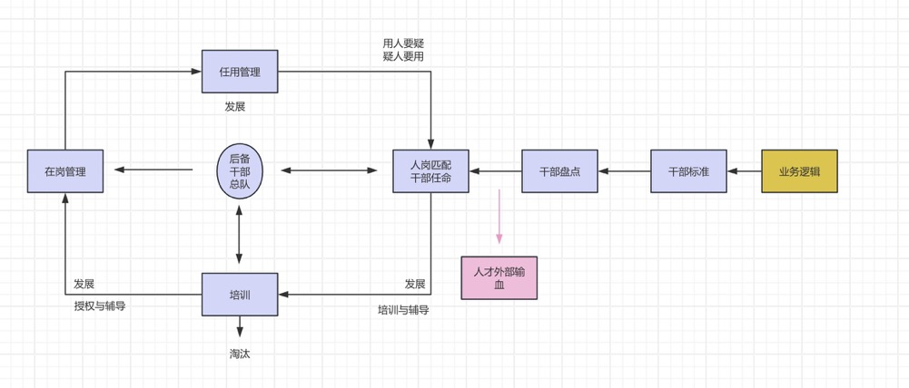
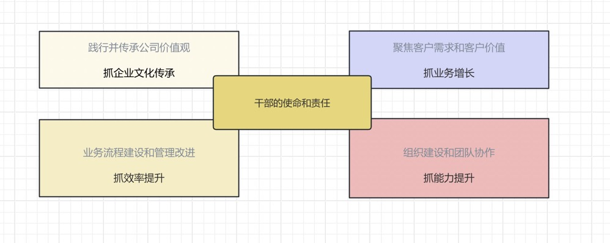
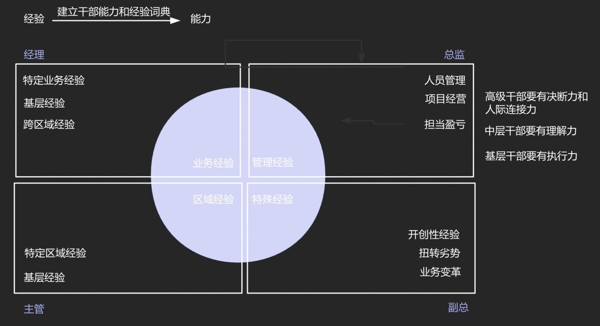

# 批量生产骨干人才

::: tip 干部培养的业务逻辑

 
干部培养背后的逻辑一定是业务，就是我们的业务逻辑是什么，比如说，企业处于初创期，可能没有那么多的管理干部的岗位，更多的是需要大家能够独当一面，是多面手，那这时候谈批量生产干部是没有意义的，因为你培养完以后没有这样的岗位给他，所以跟业务发展的阶段有关系。如果说企业正处于企业发展的第二个阶段，就是快速发展，然后我们的人才梯队又开始有些跟不上了，这时我们要赶快去为我们的业务发展，去培养我们的干部了 

看战略当中，需要什么样的人，是需要开疆拓土的还是需要开哪个市场的，它的类型是什么，这个人的特质是什么，他的能力是什么，他要求的经验是什么，也就是我们说的胜任力模型要建立起来。 

有了胜任力模型，干部标准，我们就要去盘点，要看看企业内部有多少人已经具备了这样的一个标准，马上就可以提拔，有哪些是部分具备，需要在岗培养，或者是轮岗培养的。如果已经可以提拔和可以培养的加在一起，不满足企业对干部的需求，就需要从外部去获取，但是靠外部获取，只是暂时解决了问题，自己要有培养干部的机制和能力，就进入了上图中的内部培养的一个循环 

:::

## 干部培养八部曲

### 明确使命和责任

责任和使命一定要和行为挂起钩来

### 建立干部标准

干部的选拔，按两个标准走，一个是绩效表现，一个是领导潜能，标准一定要公开透明，但是背后最基础的，是价值观

::: tip 胜任力模型展示
特质：诚信正直，抗压性强，勤奋，学习能力强，有担当 
能力：辅导能力，费用规划能力，具备较强的团队管理及人才培养能力 
岗位经验：大区销售，市场经理岗位经验，办事处经理任职时间2年以上 
绩效和行为要求： 
1.最近年度销售达成大区内排名前30%（业绩是参考） 
2.1年内不得有记大过及以上处罚人员（品行） 
3.最近财年半年度，年度考评B+及以上（业务和能力的综合表现） 
:::

::: tip 华为选拔干部的黄金定律
猛将必发于卒伍，宰相必起于州郡 
1.优先从成功团队中选拔干部 
2.优先从影响公司长远发展的关键事件中考察和选拔干部 
3.优先从主攻战场，一线和艰苦地区选拔干部，大仗，恶仗，苦仗出干部 
4.用人所长，不求全责备，优点突出的人，往往缺点也突出，审视其缺点时要看主流 
:::

### 干部任用程序 

大部分公司看人的准确性最多就是百分之五六十，找不同的人一起来看一个人，看的维度不一样，大家综合在一起，相对会比较客观，也就是说，权利可以分散，不要过于集中

::: tip 华为案例
年度干部任用决策和日常任命决策是干部任命的两种形式 
 
干部任用流程，三权分立 
负责日常直接管辖的组织具有`建议权` 
属于矩阵管理的相关管理部门具有`否决权` 
 
人力资源组织发展部`评议权` 
代表日常行政管辖的上级组织具有`审核权` 
 
代表公司全流程运作要求，全局性经营利益和长期发展的组织应具有`否决权`和`弹劾权`
:::

::: tip 阿里案例
阿里是集团，有很多子公司。 
阿里有一个职级，两条发展路线，第一条是专业路线（Professional），第二条是管理路线（Manager），这两条路线都有一个对应的职级的上升通道。 
P8以下的晋升，基本上在你这个事业部里面就可以决定。
:::

###  干部能力发展

### 干部考核  

### 干部激励 

### 干部梯队培养

### 干部监察 
 

