# 民法人格权编-人格权法的一般规则

## 人格权的概念、范围、性质与特征

### 人格权的概念

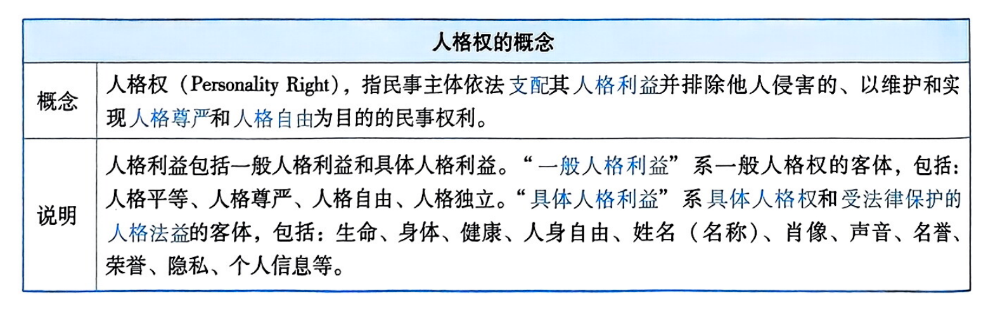

### 人格权的范围

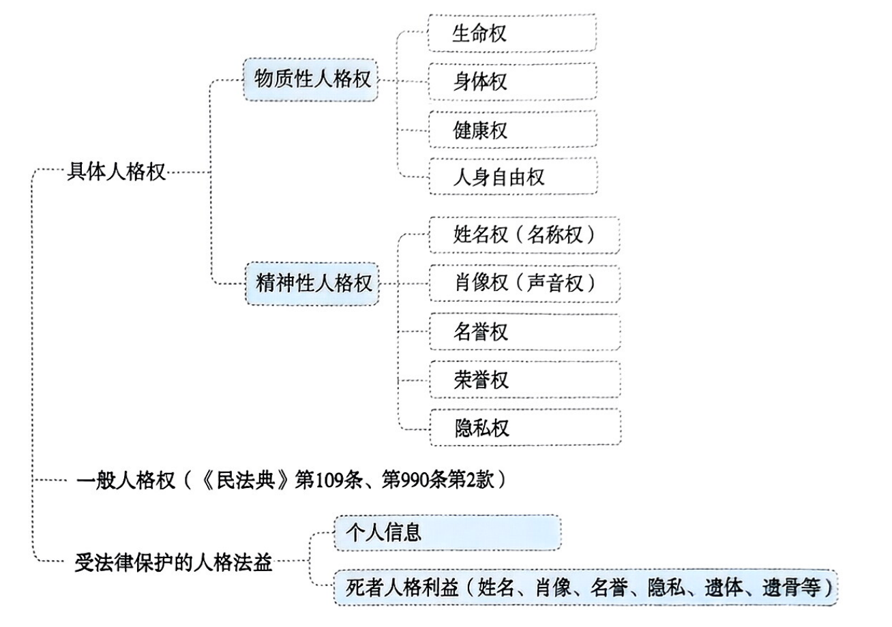

### 人格权的性质与特征

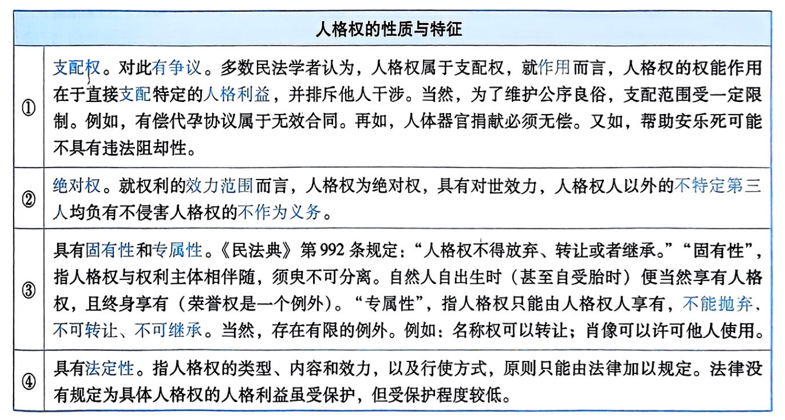

## 一般人格权

<table>
    <tr>
        <th colspan="2">1.相关法条</th>
    </tr>
    <tr>
        <td>①</td>
        <td>《民法典》第109条规定：“自然人的人身自由、人格尊严受法律保护。</td>
    </tr>
    <tr>
        <td>②</td>
        <td>《民法典》第990条第2款规定：“除前款规定的人格权外，自然人享有基于人身自由、人格尊严产生的其他人格权益。</td>
    </tr>
</table>

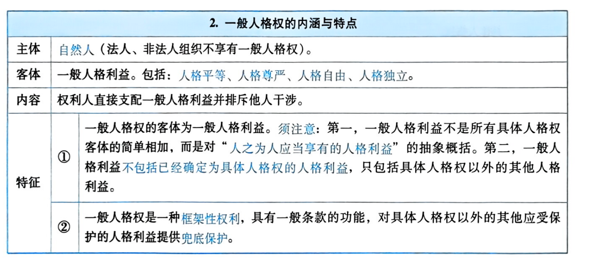

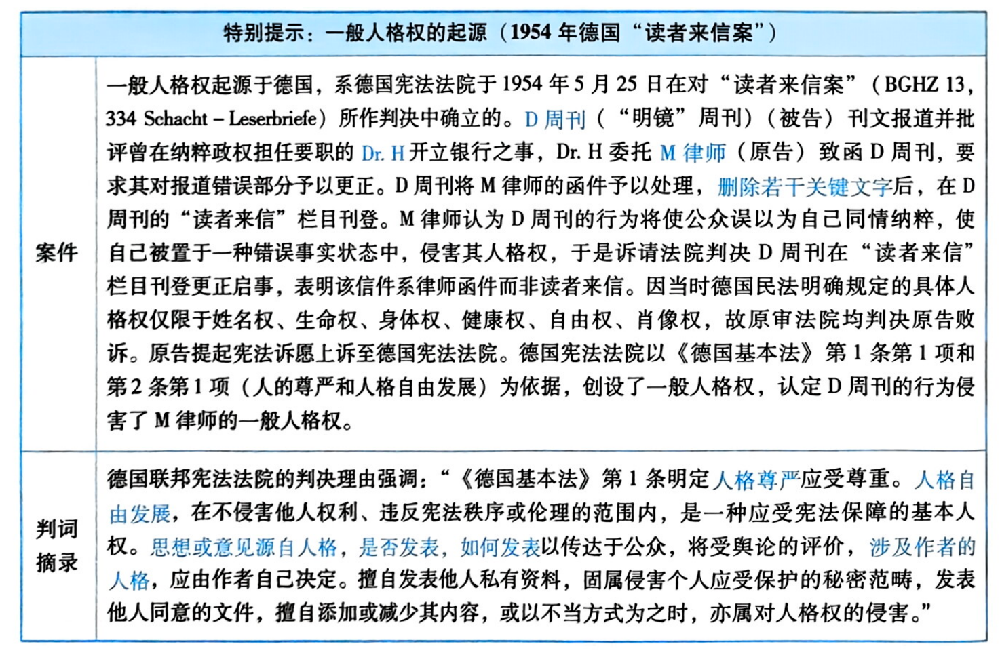

<table>
    <tr>
        <th colspan="2">3.成立侵害一般人格权的构成要件（五个）</th>
    </tr>
    <tr>
        <td>①</td>
        <td>受害人仅限于自然人。</td>
    </tr>
    <tr>
        <td>②</td>
        <td>加害行为不成立对具体人格权的侵害。</td>
    </tr>
    <tr>
        <td>③</td>
        <td>亦无法类推适用或准用关于具体人格权的规范。例如：实施擅自制作、使用、公开他人声音的加害行为，因《民法典》第1023条第2款规定参照适用关于肖像权保护的规定，从而不成立侵害
一般人格权。</td>
    </tr>
    <tr>
        <td>④</td>
        <td>加害行为侵害了一般人格利益。</td>
    </tr>
    <tr>
        <td>⑤</td>
        <td>（原则上要求）加害行为有违公序良俗。</td>
    </tr>
</table>

<table>
    <tr>
        <th colspan="2">4．成立侵害一般人格权的加害行为的主要类型</th>
    </tr>
    <tr>
        <td colspan="2">一般人格权属框架性权利，具有一般条款的功能。是否成立对一般人格权的侵害，须裁判者在个案中通过利益衡量予以具体化。归纳总结已决案例并结合通说观点，成立侵害一般人格权的加害行为包括但不限于下列类型：</td>
    </tr>
    <tr>
        <td>①</td>
        <td>侵害死者的人格利益（《精神损害赔偿解释》1)第3条）。</td>
    </tr>
    <tr>
        <td>②</td>
        <td>因故意或者重大过失侵害自然人具有人身意义的特定物并造成的严重精神损害（《民法典》第1183条第2款，《精神损害赔偿解释》第1条）。</td>
    </tr>
    <tr>
        <td>③</td>
        <td>侵害近亲属对死者的“祭奠利益”。例如：兄弟甲、乙不和。随乙共同生活的母亲丙去世时，乙故意不通知甲，致甲错过祭奠、下葬。再如：甲父去世火化后，乙公墓在受甲委托保管过程中，因过错遗失甲父的骨灰。</td>
    </tr>
    <tr>
        <td>④</td>
        <td>毁损坟墓、墓碑。例如：甲在建房平整土地时，将老屋后乙家的祖坟（没有墓碑、墓冢不明显）铲挖，经提醒、劝阻后仍不停止施工。</td>
    </tr>
    <tr>
        <td>⑤</td>
        <td>侵害“患者决定自由”。例如：甲因虔诚的宗教信仰不接受输血。甲因病在乙医院手术前，反复告知乙医院：“手术过程中，无论出现何种情况，不要为甲输血。”手术中，出于安全考虑，乙医院擅自为甲输血，甲知情后十分痛苦。</td>
    </tr>
    <tr>
        <td>⑥</td>
        <td>侵害他人“精神活动自由”。例如，甲、乙口角后，乘乙手机丢失不能正常联络之际，甲给乙在海口工作生活的父母发短信谎称：“乙遭遇严重车祸正在北京积水潭医院抢救。”乙的父母悲痛万分，急忙赶往北京后才知受骗。</td>
    </tr>
    <tr>
        <td>⑦</td>
        <td>实施未公开的侮辱行为。例如：甲对乙升迁不满，因此做了充分准备，一日下班后，乘办公室只有甲、乙二人之时，甲对乙长时间辱骂（但未动手）。乙经此骂，失去生活的勇气，夜不成寐，精神恍憾。</td>
    </tr>
</table>

## 人格权请求权

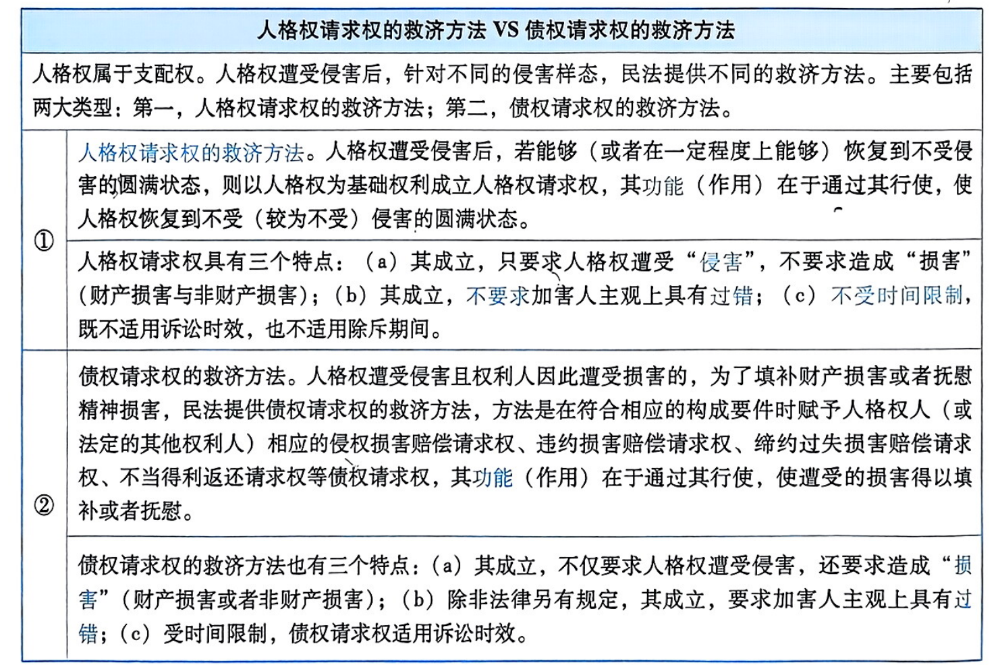
 
 <table>
    <tr>
        <th colspan="3">1.人格权请求权的类型</th>
    </tr>
    <tr>
        <td rowspan="2">法条</td>
        <td colspan="2">《民法典》第196条规定：“下列请求权不适用诉讼时效的规定：（一）请求停止侵害、排除妨碍、消除危险·……（四）依法不适用诉讼时效的其他请求权。”</td>
    </tr>
    <tr>
        <td colspan="2">《民法典》第995条规定：“人格权受到侵害的，受害人有权依照本法和其他法律的规定请求行为人承担民事责任。受害人的停止侵害、排除妨碍、消除危险、消除影响、恢复名誉、赔礼道歉请求权，不适用诉讼时效的规定。</td>
    </tr>
    <tr>
        <td rowspan="5">类型</td>
        <td>①</td>
        <td>停止侵害请求权；</td>
    </tr>
    <tr>
        <td>②</td>
        <td>排除妨害请求权;</td>
    </tr>
    <tr>
        <td>③</td>
        <td>消除危险请求权;</td>
    </tr>
    <tr>
        <td>④</td>
        <td>消除影响、恢复名誉请求权</td>
    </tr>
    <tr>
        <td>⑤</td>
        <td>赔礼道歉请求权</td>
    </tr>
 </table>

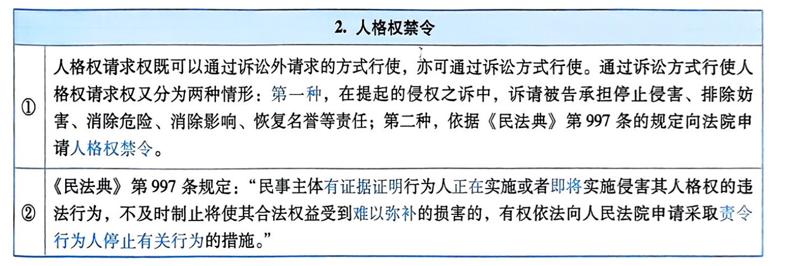

## 精神损害赔偿

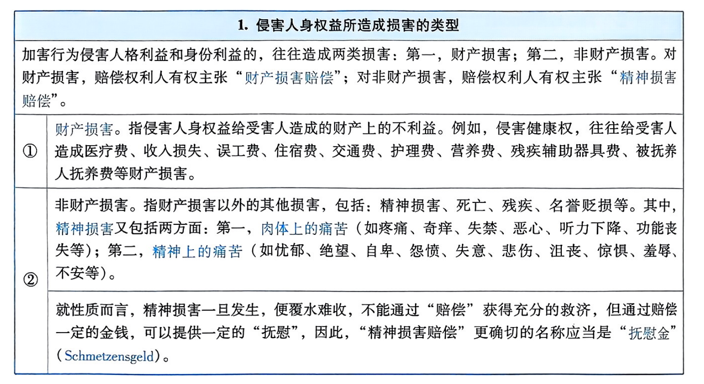

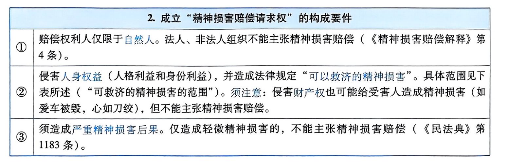

<table>
    <tr>
        <th colspan="2">3.可救济的精神损害的范围</th>
    </tr>
    <tr>
        <td colspan="2">在成立侵害人格利益、身份利益的场合，在何种范围内，赔偿权利人有权主张精神损害赔偿，我国民法采“法定主义为原则、概括主义为补充”的规范模式。因此，下列侵害人格利益、身份利益并造成严重精神损害的情形，赔偿权利人有权主张精神损害赔偿。</td>
    </tr>
    <tr>
        <td>①</td>
        <td>侵害具体人格权。包括：生命权、身体权、健康权、人身自由权、姓名权、肖像权、声音权、名誉权、荣誉权、隐私权（《民法典》第1183条第1款）。</td>
    </tr>
    <tr>
        <td>②</td>
        <td>侵害个人信息（《民法典》第1034条）。</td>
    </tr>
    <tr>
        <td>③</td>
        <td>侵害亲权（身份权的一种）。非法使被监护人脱离监护，导致父母子女关系或者其他近亲属关系受到严重损害的，监护人有权主张精神损害赔偿【《民法典侵权责任编解释（一）》第2条，《精神损害赔偿解释》第2条]。</td>
    </tr>
    <tr>
        <td>④</td>
        <td>侵害近亲属权（身份权的一种）。侵害生命权的场合，不仅侵害了死者的生命权，还同时侵害了死者近亲属的近亲属权（基于身份关系享有的身份权），死者的近亲属有权主张精神损害赔偿。对此，《民法典》第1181条第1款规定被侵权人死亡的，其近亲属有权请求侵权人承担侵权责任。此外，《民法典侵权责任编解释（一)》第3条规定：“非法使被监护人脱离监护，被监护人在脱离监护期间死亡，作为近亲属的监护人既请求赔偿人身损害，又请求赔偿监护关系受侵害产生的损失的，人民法院依法予以支持。”</td>
    </tr>
    <tr>
        <td>⑤</td>
        <td>以特定方式侵害配偶权（身份权的一种）。配偶一方以下列过错加害行为侵害对方的配偶权，对方无过错的，有权主张精神损害赔偿：第一，重婚；第二，与他人同居；第三，实施家庭暴力；第四，虐待、遗弃家庭成员；第五，有其他重大过错（《民法典》第1091条）。</td>
    </tr>
    <tr>
        <td>⑥</td>
        <td>因无效婚姻或可撤销婚姻人格权益或身份权益遭受侵害。对此，《民法典》第1054条第2款规定：“婚姻无效或者被撤销的，无过错方有权请求损害赔偿。”</td>
    </tr>
    <tr>
        <td>⑦</td>
        <td>死者的姓名、肖像、名誉、荣誉、隐私、遗体等受到侵害的，其配偶、子女、父母有权主张精神损害赔偿；死者没有配偶、子女且父母已经死亡的，其他近亲属有权主张精神损害赔偿（《民法典》第994条，《精神损害赔偿解释》第3条）。</td>
    </tr>
    <tr>
        <td>⑧</td>
        <td>侵害英雄烈士的人格利益（包括：姓名、肖像、名誉、荣誉），损害社会公共利益的，死者的近亲属有权主张精神损害赔偿（《民法典》第185条）。</td>
    </tr>
    <tr>
        <td>⑨</td>
        <td>因故意或者重大过失侵害自然人具有人身意义的特定物造成严重精神损害的，被侵权人有权请求精神损害赔偿（《民法典》第1183条第2款）。</td>
    </tr>
    <tr>
        <td>⑩</td>
        <td>侵害一般人格权（《民法典》第990条第2款）。</td>
    </tr>
</table>

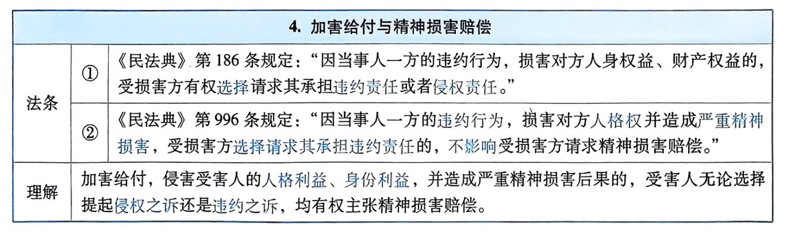

## 死者人格利益的保护

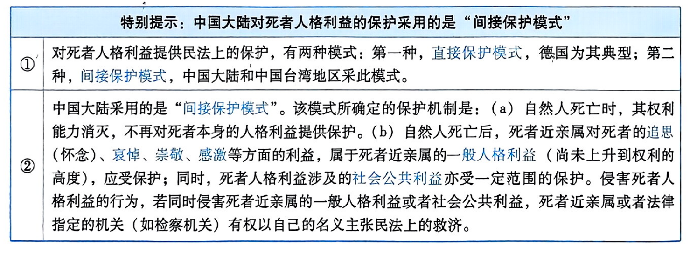

<table>
    <tr>
        <th colspan="2">1.相关法条</th>
    </tr>
    <tr>
        <td>①</td>
        <td>《民法典》第185条规定：“侵害英雄烈士等的姓名、肖像、名誉、荣誉，损害社会公共利益的、应当承担民事责任。”</td>
    </tr>
    <tr>
        <td>②</td>
        <td>《民法典》第994条规定：“死者的姓名、肖像、名誉、荣誉、隐私、遗体等受到侵害的，其配偶、子女、父母有权依法请求行为人承担民事责任；死者没有配偶、子女且父母已经死亡的，其他近亲属有权依法请求行为人承担民事责任。”</td>
    </tr>
    <tr>
        <td>③</td>
        <td>《精神损害赔偿解释》第3条规定：“死者的姓名、肖像、名誉、荣誉、隐私、遗体、遗骨等受到侵害，其近亲属向人民法院提起诉讼请求精神损害赔偿的，人民法院应当依法予以支持。</td>
    </tr>
    <tr>
        <td rowspan="2">④</td>
        <td>《英雄烈士保护法》第25条第1款规定：“对侵害英雄烈士的姓名、肖像、名誉、荣誉的行为，英雄烈士的近亲属可以依法向人民法院提起诉讼。”</td>
    </tr>
    <tr>
        <td>《英雄烈士保护法》第25条第2款规定：“英雄烈士没有近亲属或者近亲属不提起诉讼的，检察机关依法对侵害英雄烈士的姓名、肖像、名誉、荣誉，损害社会公共利益的行为向人民法院提起诉讼。”</td>
    </tr>
</table>

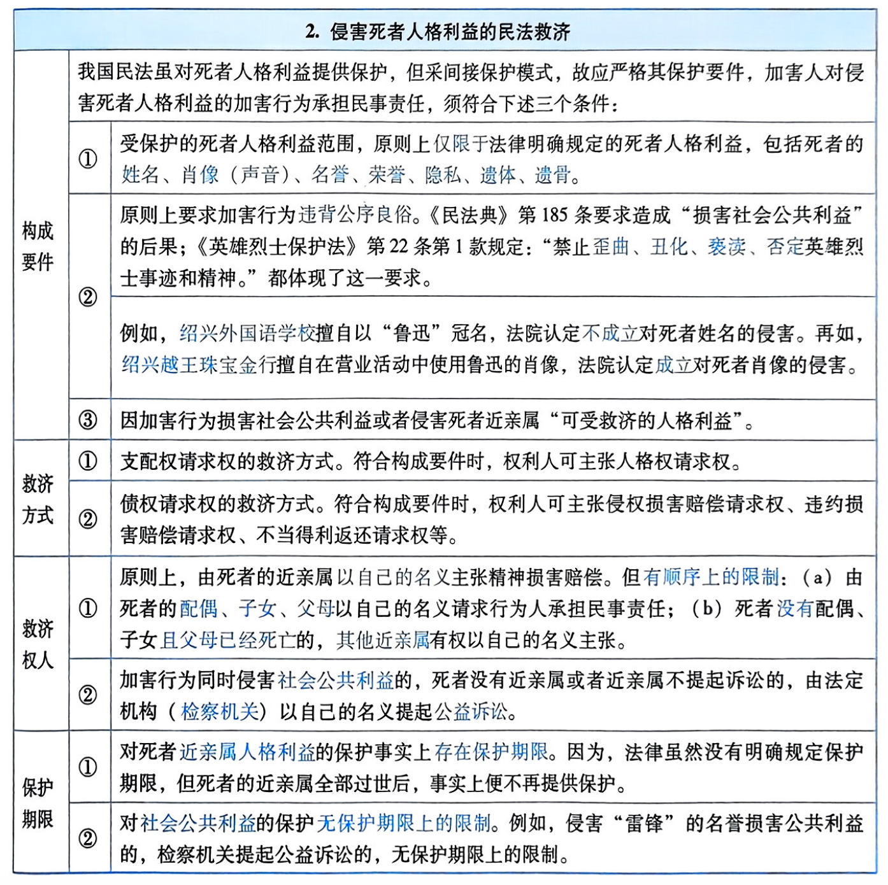

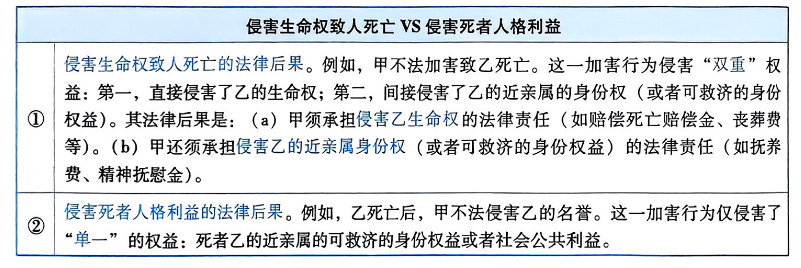

