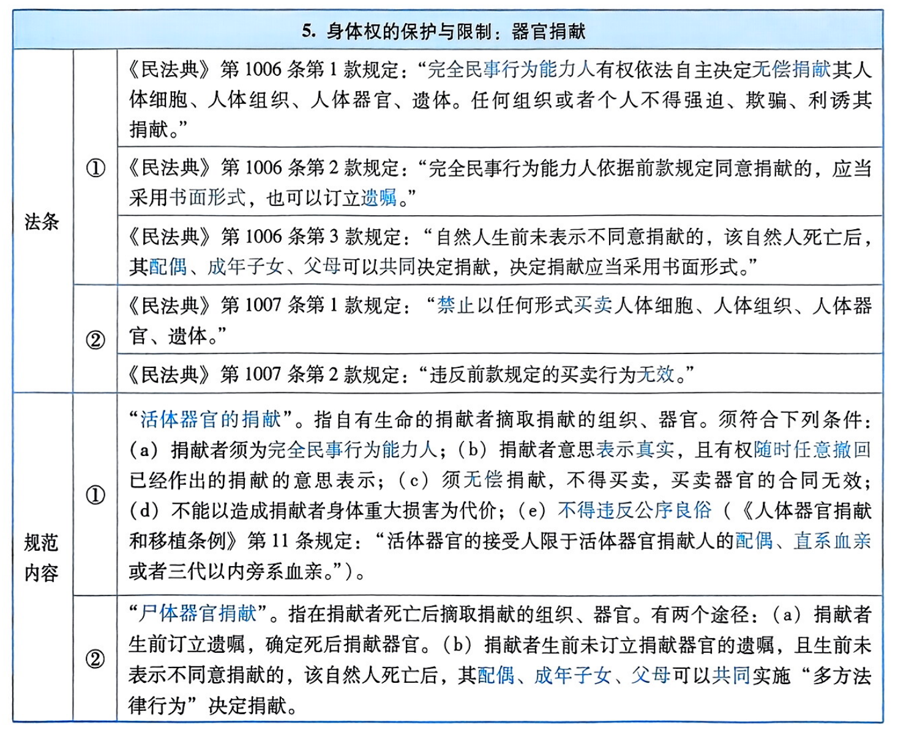

# 民法人格权编-具体人格权

## 生命权

<table>
    <tr>
        <th colspan="3">2．侵害生命权的损害赔偿责任</th>
    </tr>
    <tr>
        <td colspan="3">侵害生命权导致受害人生理死亡的，若死者有近亲属，该加害行为同时侵害双重权利（权益）并造成损害，应分别承担相应的损害赔偿责任：第一，侵害死者生命权的损害赔偿责任；第二，侵害死者近亲属的身份权（身份利益）的损害赔偿责任。具体而言：</td>
    </tr>
    <tr>
        <td>①</td>
        <td colspan="2">侵害死者生命权的损害赔偿责任。赔偿义务人应当赔偿医疗费、丧葬费等合理费用（《民法典》第1181条第2款）。</td>
    </tr>
    <tr>
        <td rowspan="3">②</td>
        <td colspan="2">侵害死者近亲属身份权（身份利益）的损害赔偿责任。赔偿义务人应当向死者的近亲属承担以下损害赔偿责任：</td>
    </tr>
    <tr>
        <td>（a）</td>
        <td>财产损害赔偿。赔偿义务人应当对死者的近亲属赔偿“死亡赔偿金”。死亡赔偿金按照受诉法院所在地上一年度“城镇居民人均可支配收入”标准，按二十年计算。但六十周岁以上的，年龄每增加一岁减少一年；七十五周岁以上的，按五年计算（《人身损害赔偿解释》1)第15条)。</td>
    </tr>
    <tr>
        <td>（b）</td>
        <td>精神损害赔偿。赔偿义务人应当对死者的近亲属赔偿“精神抚慰金”。</td>
    </tr>
</table>

## 人身权

<table>
    <tr>
        <th colspan="2">4. 性骚扰</th>
    </tr>
    <tr>
        <td rowspan="2">法条</td>
        <td>《民法典》第1010条第1款规定：“违背他人意愿，以言语、文字、图像、肢体行为等方式对他人实施性骚扰的，受害人有权依法请求行为人承担民事责任。”</td>
    </tr>
    <tr>
        <td>《民法典》第1010条第2款规定：“机关、企业、学校等单位应当采取合理的预防、受理投诉、调查处置等措施，防止和制止利用职权、从属关系等实施性骚扰。”</td>
    </tr>
    <tr>
        <td>概念</td>
        <td>性骚扰，指以身体动作、语言、文字、图像、视频等，违背他人意愿实施的以性为取向的有辱 概念 他人尊严的性暗示、性挑逗、性暴力等行为。</td>
    </tr>
    <tr>
        <td>特征</td>
        <td>行为成立性骚扰须具有以下特征：①实施与性有关的骚扰；②有明确的指向对象；③违背受害人的意愿；④侵害受害人的人格尊严。</td>
    </tr>
    <tr>
        <td>定性</td>
        <td>须根据各自的构成要件，认定性骚扰侵害的具体人格权。主要有以下几种类型：①侵害身体权。例如，猥亵他人身体。②侵害隐私权。如以文字、图像、视频实施性骚扰，妨害受害人的私生活安宁。③侵害名誉权。例如，当众实施性骚扰。④侵害健康权。例如，实施性骚扰行为导致受害人健康受损。</td>
    </tr>
</table>

## 健康权

## 人身自由权

## 姓名权

<table>
    <tr>
        <th colspan="4">1. 姓名权的客体</th>
    </tr>
    <tr>
        <td rowspan="5">原则</td>
        <td rowspan="5">正式姓名</td>
        <td colspan="2">姓名权的客体是自然人的“正式姓名”（即本名），须符合以下四个条件：</td>
    </tr>
    <tr>
        <td>①</td>
        <td>由姓和名组成。（a）姓（姓氏），用于标表血缘和家族归属；（b）名，用以标表自然人个人（即“区别人已”)。</td>
    </tr>
    <tr>
        <td>②</td>
        <td>属于文字符号和标记，且须使用规范汉字（即简体中文）。</td>
    </tr>
    <tr>
        <td>③</td>
        <td>具有可识别性，即姓名与其标表的自然人建立稳定的对应关系。换言之，相关公众“闻其名，知其人”（当然，本名一般都具备这一特征）。</td>
    </tr>
    <tr>
        <td>④</td>
        <td>须经户口登记机关办理完毕登记（《民法典》第1016条第1款）。</td>
    </tr>
    <tr>
        <td rowspan="4">例外</td>
        <td rowspan="4">其他标志</td>
        <td colspan="2">笔名、艺名、网名、别名（字号、姓名的简称、乳名、绰号、外国人的中文译名）等特定名称符合下列三个条件的，“参照”法律关于姓名权的规定，受同等保护（《民法典》第1017条）：</td>
    </tr>
    <tr>
        <td>①</td>
        <td>具有一定的知名度，为相关公众所知悉。</td>
    </tr>
    <tr>
        <td>②</td>
        <td>已经与该自然人建立了“稳定的对应关系”（不要求达到“唯一的对应关系”的高度）。</td>
    </tr>
    <tr>
        <td>③</td>
        <td>擅自使用该特定名称的行为，足以产生相关公众在“指代同一性上”发生混淆的可能性。</td>
    </tr>
</table>

## 肖像权与声音权
