# 民法侵权责任编-一般规定

## 侵权责任的归责原则概述

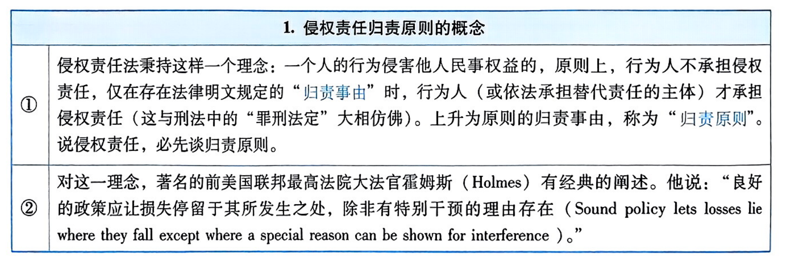

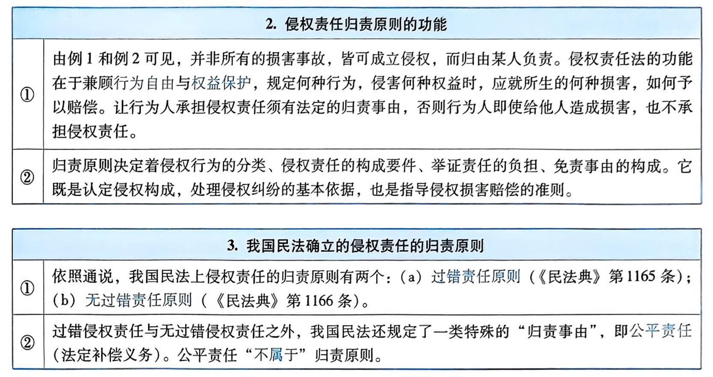

## 过错侵权责任

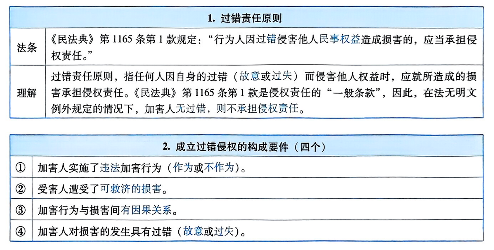

<table>
    <tr>
        <th colspan="2">四要件VS三阶层</th>
    </tr>
    <tr>
        <td colspan="2">关于过错侵权责任成立的构成要件，中国大陆的通说观点采“四要件说”（内容见上表），与此相对照，德国、我国台湾地区在理论与实务上采“三阶层说”，根据“三阶层说”，成立过错侵权责任，须具备以下三个要件：</td>
    </tr>
    <tr>
        <td>①</td>
        <td>事实要件符合性（包括：第一，加害人实施了加害行为；第二，受害人遭受了可救济的损害；第三，二者之间具有因果关系）。</td>
    </tr>
    <tr>
        <td>②</td>
        <td>侵害具有不法性（不法且无违法阻却事由）。</td>
    </tr>
    <tr>
        <td>③</td>
        <td>可归责性（加害人具有责任能力且主观上具有过错，即对损害后果的发生具有故意或者过失）。</td>
    </tr>
</table>

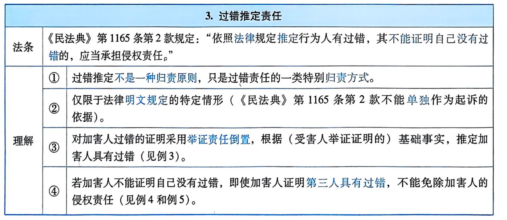

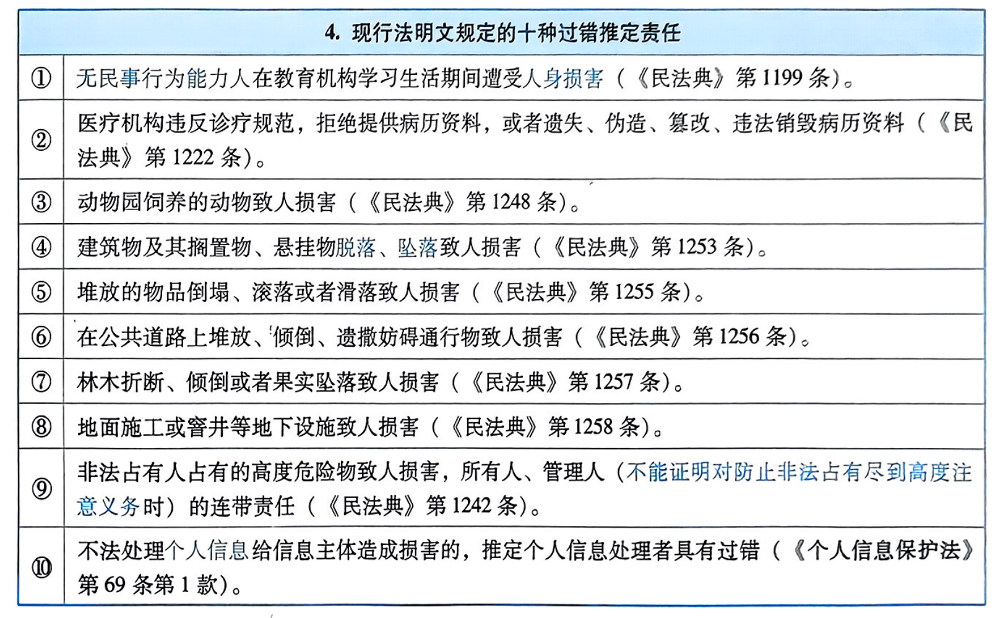

## 无过错侵权责任

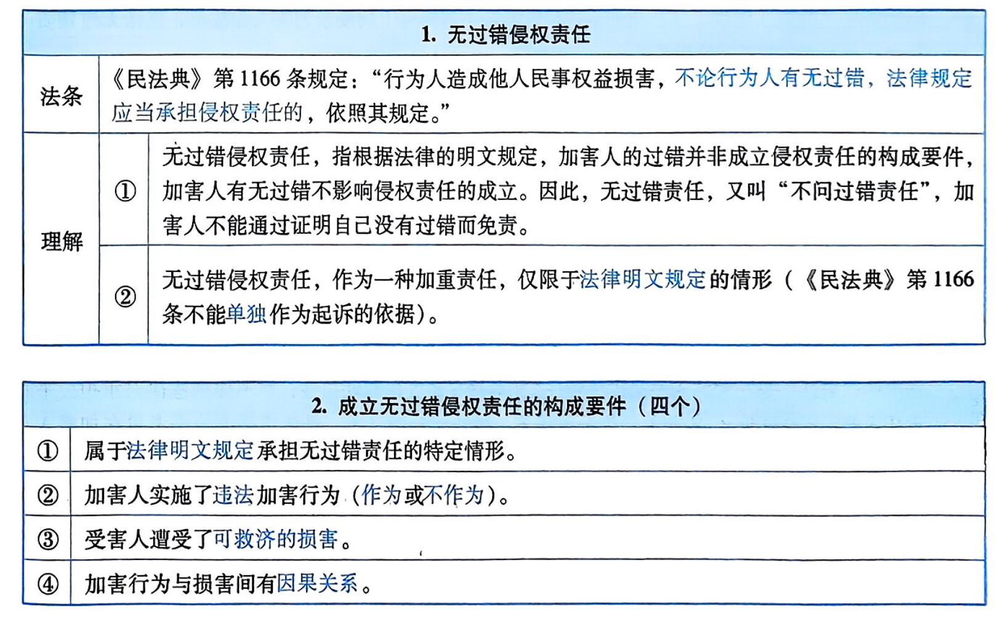

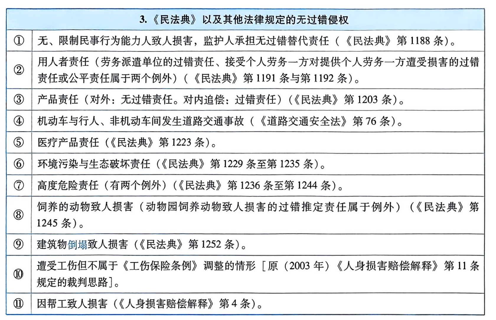

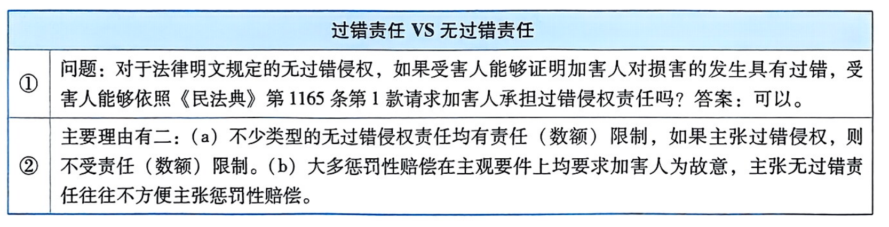

## 公平责任

### 公平责任的概念与特征

<table>
    <tr>
        <th colspan="2">1.公平责任的概念与特征</th>
    </tr>
    <tr>
        <td>①</td>
        <td>公平责任，指对损害的发生，当事人均无过错（不成立过错侵权），又不属于法律明文规定的无过错侵权（亦不成立无过错侵权），若属于法律明文规定的情形，人民法院可以根据具体情况和公平观念，确定由当事人适当分担损害后果的规则。公平责任不是一项独立的归责原则。公平责任中的“责任”是一种特殊的法律“责任”（不具有谴责性与惩罚性；亦不体现法律对承担公平责任者的否定性评价），本质上，公平责任是一种法定补偿义务，是法律基于公平考量在加害人（受益人）与受害人之间强制进行了损失分摊（适当补偿），而非承担侵权损害赔偿责任。</td>
    </tr>
    <tr>
        <td>②</td>
        <td>适用公平责任的目的不在于维护当事人的权利和义务，而在于以其特有的模糊性来消解当事人之间的权利边界，起到劫富济贫、扶危济困，稳定社会的作用。因而，与过错责任原则和无过错责任原则旨在实现矫正正义不同，公平责任原则旨在实现分配正义。</td>
    </tr>
    <tr>
        <td>③</td>
        <td>公平责任只能适用于法律明文规定的特定情形。《民法典》第1186条规定：“受害人和行为人对损害的发生都没有过错的，依照法律的规定由双方分担损失。”“依照法律的规定”表明，公平责任“不再设一般条款”，公平责任仅适用于法律明文规定的特定情形。</td>
    </tr>
</table>

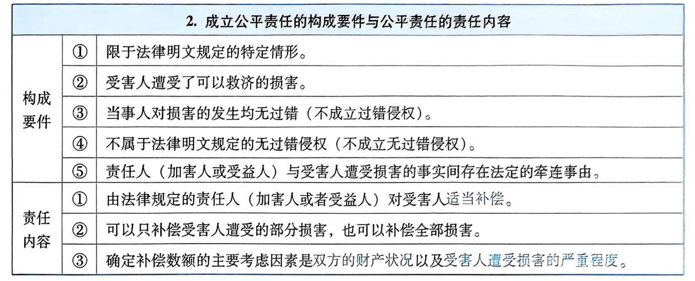

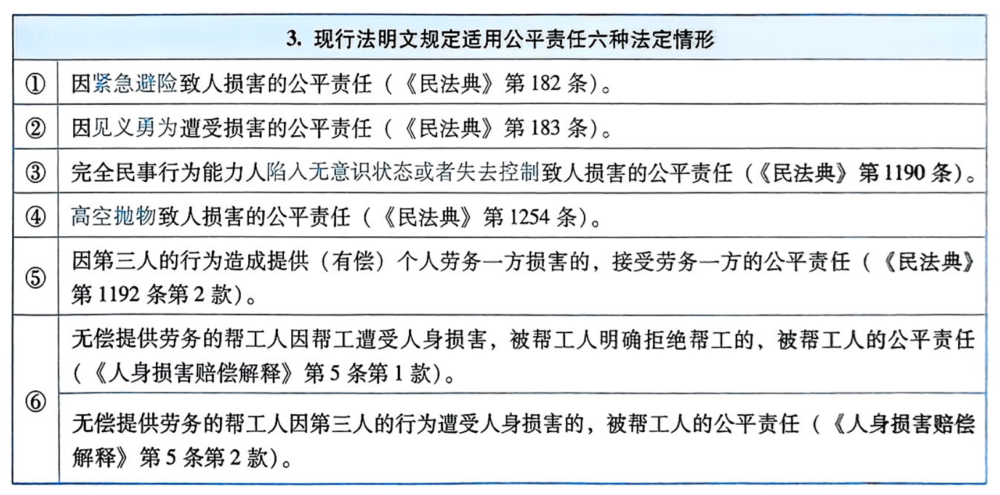

### 因紧急避险致人损害的责任承担及公平责任

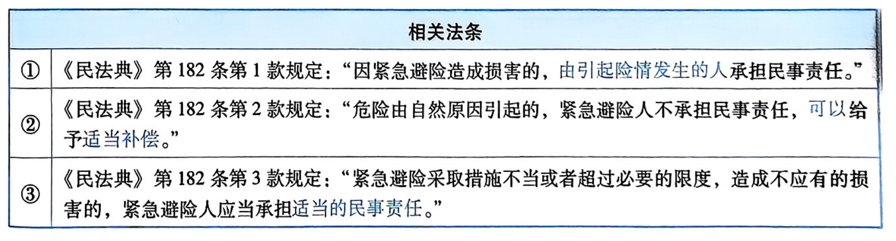

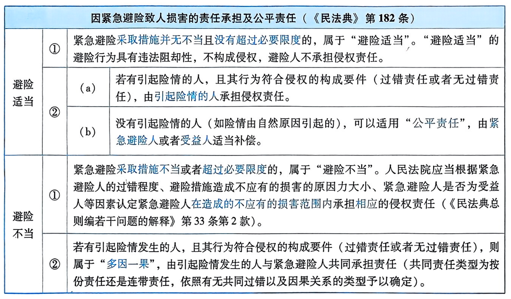

### 因见义勇为遭受损害的责任承担及公平责任

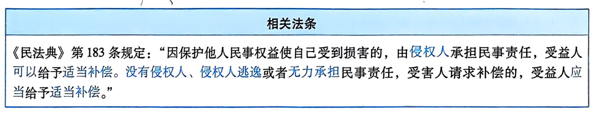

<table>
    <tr>
        <th colspan="2">因见义勇为遭受损害的责任承担及公平责任（《民法典》第183条）</th>
    </tr>
    <tr>
        <td colspan="2">因见义勇为遭受损害的责任承担，具有“顺序性”，首先依照第一顺位的规则承担责任；不能依照第一顺位规则承担责任的，依照第二顺位的规则承担责任。同时须注意：即使见义勇为失败（如未达预期结果），对公平责任的承担不产生影响。</td>
    </tr>
    <tr>
        <td>①</td>
        <td>第一顺位的责任承担规则：（a）由侵权人承担侵权责任（赔偿受害人遭受的全部损害）；（b）与此同时，也“可以”由受益人承担公平责任，对受害人适当补偿。</td>
    </tr>
    <tr>
        <td>②</td>
        <td>第二顺位的责任承担规则：没有侵权人、侵权人逃逸或者无力承担民事责任的，“应当”由受益人承担公平责任，对受害人适当补偿。</td>
    </tr>
</table>

### 完全行为能力人于无意识状态或失去控制状态致人损害的责任承担及公平责任

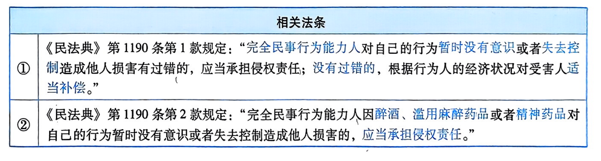

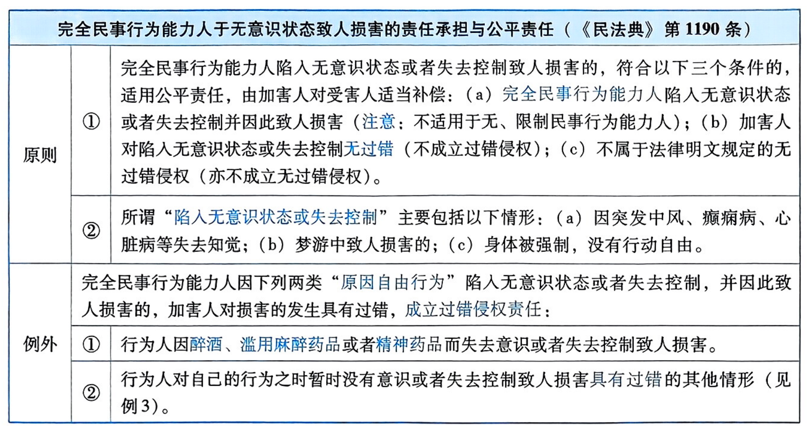

### 高空抛物致人损害的责任承担及公平责任

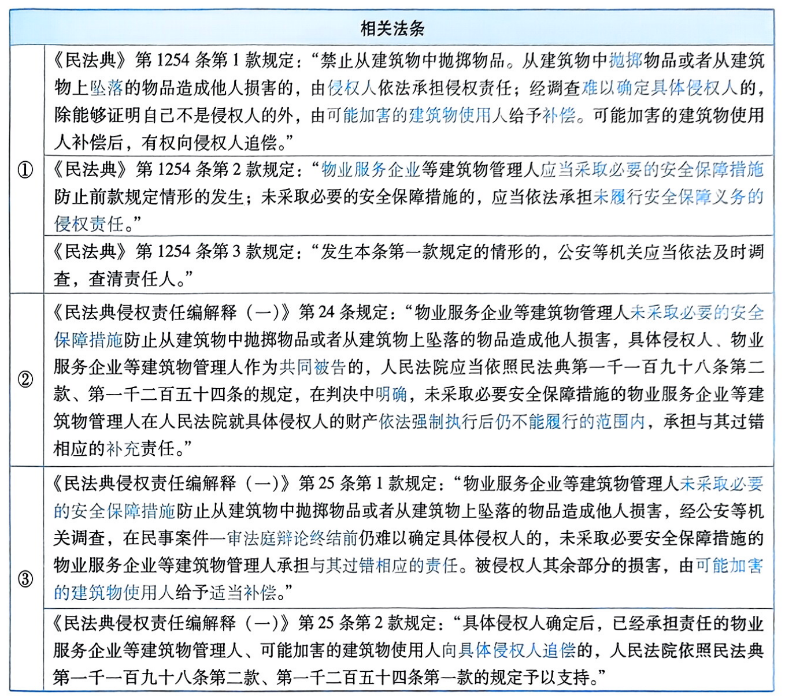

<table>
    <tr>
        <th colspan="3">1.高空抛物致人损害的责任承担（《民法典》第1254条）</th>
    </tr>
    <tr>
        <td colspan="3">建筑物“形成区分所有”或者建筑物不同专有部分“归不同的民事主体占有使用”，自建筑物坠落的物品或者从建筑物抛掷的物品致人损害的，根据“能否确定具体侵权人”（实际加害人），侵权责任的承担规则有所不同。</td>
    </tr>
    <tr>
        <td rowspan="3">能够确定</td>
        <td colspan="2">“能够确定具体侵权人的”，由具体侵权人依法承担相应的侵权责任。具体而言分为两种情形：</td>
    </tr>
    <tr>
        <td>①</td>
        <td>“具体侵权人”就是违反安全保障义务的“物业服务企业等管理人”的，由物业服务企业等管理人依照《民法典》第1198条第1款的规定对全部损害承担过错侵权责任。</td>
    </tr>
    <tr>
        <td>②</td>
        <td>“具体侵权人”是“物业服务企业等管理人”以外的“第三人”的：（α）由“第三人”对全部损害依法承担侵权责任。（b）“物业服务企业等管理人”没有违反安全保障义务的，不承担责任。（c）“物业服务企业等管理人”违反安全保障义务的，依照《民法典》第1198条第2款的规定承担与其过错相应的“补充责任”；“物业服务企业等管理人”承担补充责任后，有权向第三人追偿；具体侵权人和物业服务企业等管理人被列为共同被告的，法院应当在判决中明确，物业服务企业等管理人在人民法院就具体侵权人的财产依法强制执行后仍不能履行的范围内，承担与其过错相应的补充责任。</td>
    </tr>
    <tr>
        <td rowspan="3">难以确定</td>
        <td colspan="2">“难以确定具体侵权人的”，依照下列规则承担侵权责任：</td>
    </tr>
    <tr>
        <td>①</td>
        <td>物业服务企业等管理人没有违反安全保障义务的，不承担责任；由可能加害的建筑物使用人承担公平责任，对受害人适当补偿。具体侵权人确定后，已经承担公平责任的建筑物使用人有权向具体侵权人追偿。</td>
    </tr>
    <tr>
        <td>②</td>
        <td>物业服务企业等管理人违反安全保障义务的，责任承担规则是：（a）物业服务企业等管理人承担与其过错相应的责任（注意：不是补充责任）；（b）被侵权人其余部分的损害，由可能加害的建筑物使用人承担公平责任，给予适当补偿；（c）具体侵权人确定后，已经承担责任的物业服务企业等管理人、可能加害的建筑物使用人有权向具体侵权人追偿。</td>
    </tr>
</table>

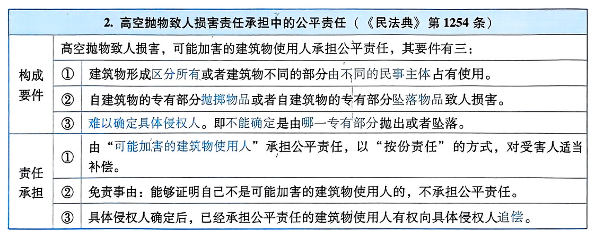

### 因帮工致人损害与遭受人身损害的责任承担与公平责任

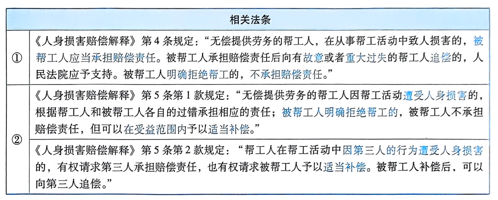

### 提供个人之间的劳务时因第三人的原因遭受损害的责任承担与公平责任

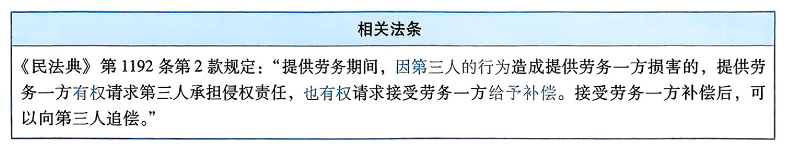

## 侵权责任构成要件的进一步说明与展开

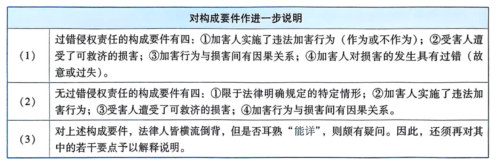

### 违法加害行为

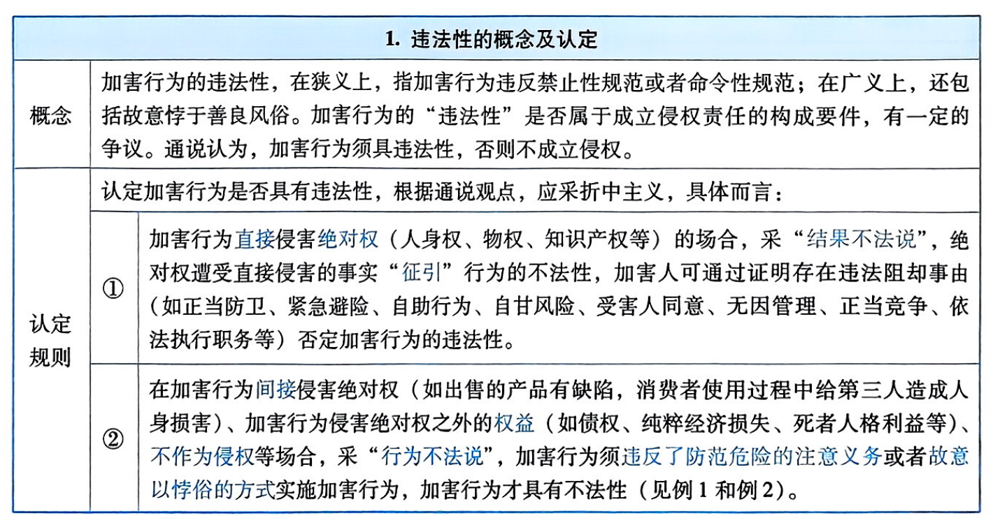

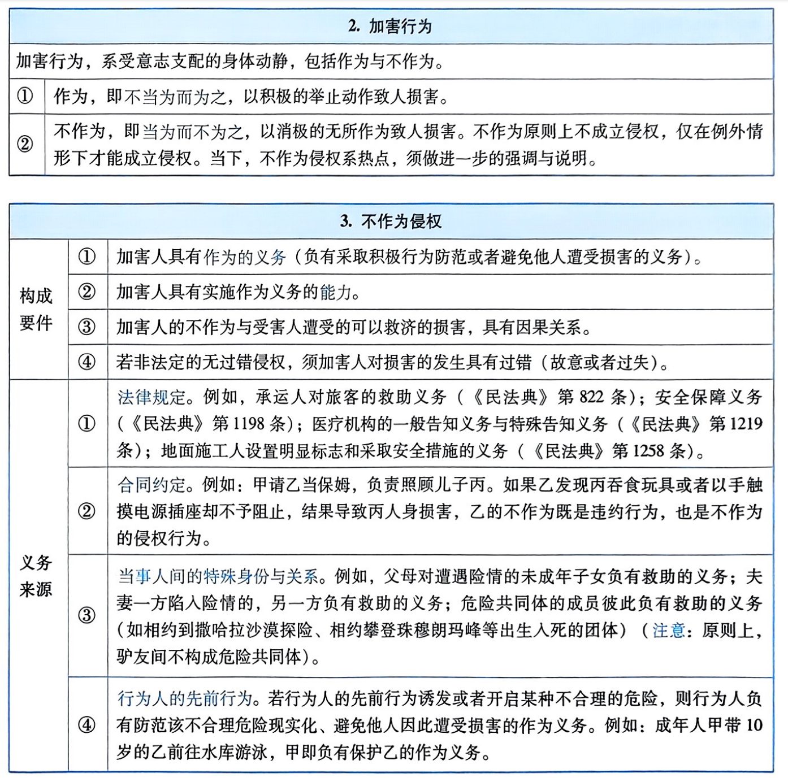

### 损害事实（受害人遭受了可救济的损害）

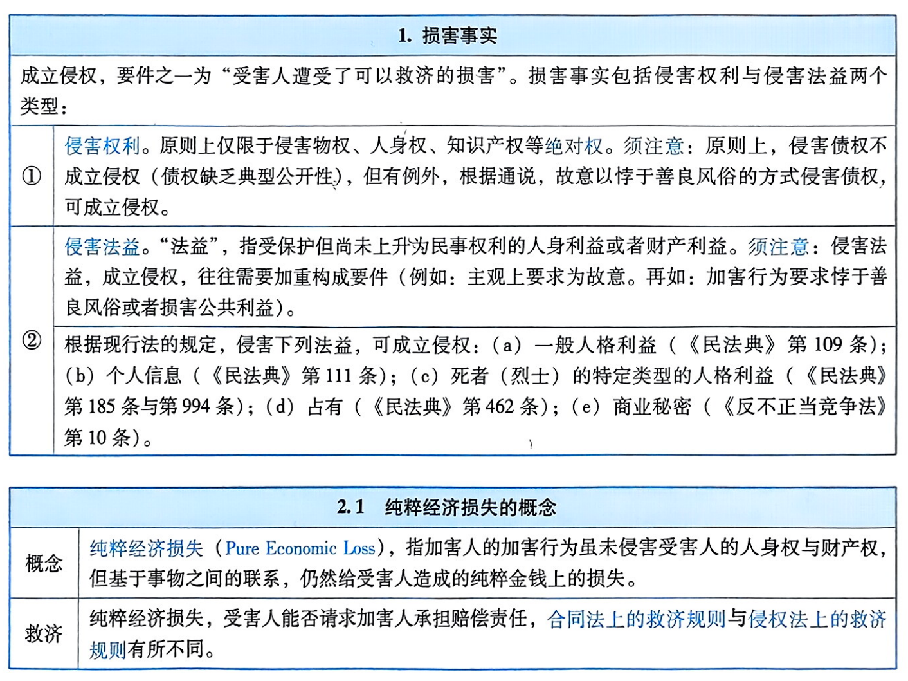

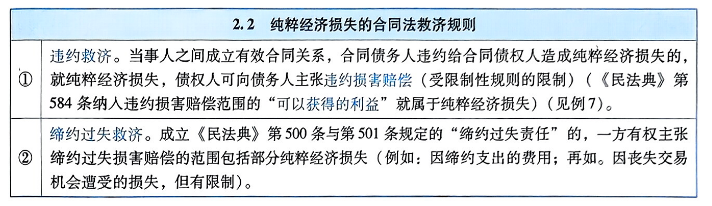

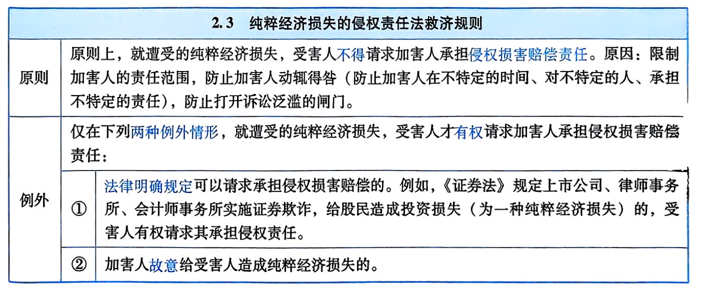

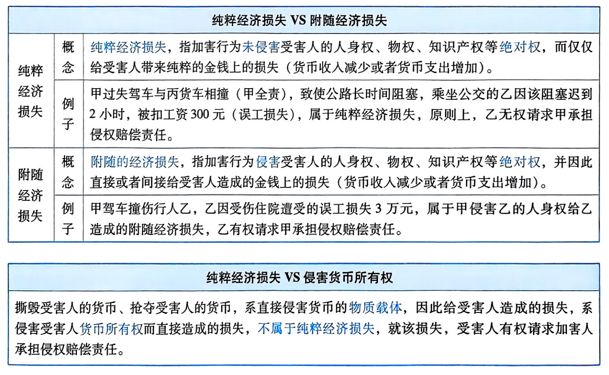

### 因果关系

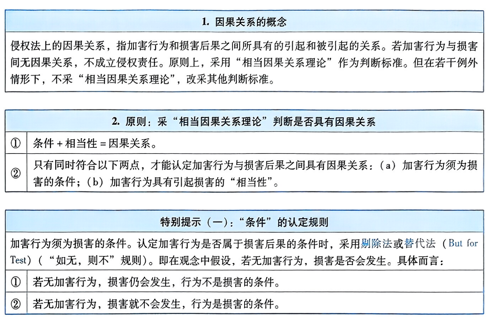

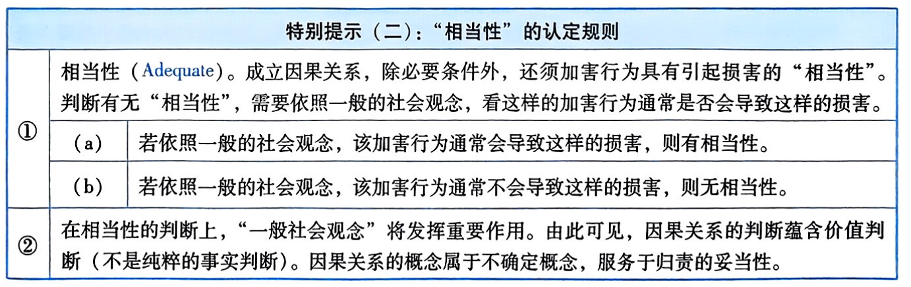

<table>
    <tr>
        <th colspan="2">3.例外：不采相当因果关系理论作为判准的例外情形</th>
    </tr>
    <tr>
        <td>①</td>
        <td>择一的因果关系（《民法典》第1170条）。例如，甲、乙、丙进山打猎，向有动静的灌木丛各开一枪，在灌木丛中采蘑菇的丁头中一弹死亡。事后，难以确定这一颗子弹是谁射出的（同一型号的枪与子弹；同一射击方向与距离）。此例中：①受害人难以证明因果关系成立。②为方便受害人的救济，在责任成立上采因果关系推定，推定甲、乙、丙的射击与丁死亡均有因果关系。（须注意：民法上的这一规则与刑法不同，在刑法上，基于疑罪从无的理念，应当认定甲、乙、丙的射击行为与丁死亡后果间均无因果关系）。</td>
    </tr>
    <tr>
        <td rowspan="2">②</td>
        <td>聚合因果关系（《民法典》第1171条）。例如，甲、乙无意思联络，分别在丙的水杯中投毒10毫克（10毫克毒物单独均足以致丙死亡），丙饮用后死亡。再如，甲、乙无意思联络，分别同时在丙的房屋之东面与西面放火（每把火单独均足以焚毁该房屋），两把火共同将丙的房屋焚毁</td>
    </tr>
    <tr>
        <td>上面的例子中，若采用相当因果关系理论作为判断标准，就会机械地认定甲、乙的行为均非丙遭受损害的必要条件，因果关系不成立，甲、乙均不承担侵权责任，这样的结论显非合理。于此等情形，应改采聚合因果关系说（又称累积因果关系），认定甲、乙的投毒行为均为丙死亡的原因，甲、乙的放火行为均为丙房屋被烧毁的原因。</td>
    </tr>
    <tr>
        <td rowspan="2">③</td>
        <td>共同因果关系（《民法典》第1172条）。例如，甲、乙无意思联络，分别在丙的水杯中投毒5毫克，丙饮用后死亡。经查，甲、乙投人的5毫克毒物单独均不足以致丙死亡。再如，甲、乙二工厂排放废水，个别不足以导致丙养殖的鳞鱼死亡，但共同作用发生鳟鱼死亡的结果。</td>
    </tr>
    <tr>
        <td>上面的例子中，若采用相当因果关系理论作为判断标准，虽可认定甲、乙的行为都是损害发生的必要条件，但无“相当性”，甲、乙的行为与损害均无因果关系，显非合理。于此等情形，应改采共同因果关系说，认定甲、乙的行为系丙遭受损害的共同原因，甲、乙的行为与丙遭受的损害均有因果关系。</td>
    </tr>
    <tr>
        <td rowspan="2">④</td>
        <td>假设因果关系。例（1），甲违章驾车撞死乙。事后医生证明，乙已身患绝症（黑色素瘤），半年内必将死亡。例（2），甲故意焚毁乙的房屋，一周后，强烈地导致乙房屋所在地区的房屋全部倒塌。在例（1）和例（2）中，甲的行为系真正原因；乙身患绝症与强烈地霆系假设原因。根据通说观点，假设原因的存在，不影响真正原因与权益侵害结果之间具有“责任成立的因果关系”。</td>
    </tr>
    <tr>
        <td>假设原因的存在，“是否影响”真正原因与权益侵害结果之间的“责任范围的因果关系”，根据通说观点，应当区分两种情况而有不同的结论：（a）在例（1）中，真正原因（甲的行为）侵害的是乙的人身，给乙的亲属造成的损害主要系“创收财产损失”（属于所失利益），因此，假设原因的存在，“影响”真正原因与权益侵害结果之间的责任范围的因果关系，在确定甲应向乙的亲属支付的死亡赔偿金时，应考虑假设原因，酌情减少。（b）在例（2）中，真正原因（甲的行为）侵害的是乙的房屋，给乙造成的损害主要系“资本财产损失”（属于所受损害），因此，假设原因的存在，一般“不影响”真正原因与权益侵害结果之间的责任范围因果关系，在确定甲应向乙支付的损害赔偿金时，一般不考虑假设原因而予以减少。</td>
    </tr>
    <tr>
        <td rowspan="2">⑤</td>
        <td>受害人特异体质不影响因果关系成立。例如，课间休息时，甲打了乙一耳光。因乙先天性“蛋壳头盖骨”（Eggshell Skull），乙因此死亡。再如，课间休息时，甲在乙的后背猛推一把，因乙患有先天性脾脏畸形，结果导致乙脾脏破裂死亡。还如，甲在和乙吵架时，毫不手软，对乙辱厚骂，堪称“无韵之离骚，骂家之绝唱”，正值壮年的乙因此心脏病发作死亡。</td>
    </tr>
    <tr>
        <td>上面的例子中，若采相当性因果关系，则甲的行为不具有致乙死亡的相当性，显非合理。对此，世界范围内的通说均认为受害人特异体质不影响因果关系成立：（a）甲行为与乙的死亡有因果关系。（b）加害人须接受受害人特异体质之现状（Takethevictimas youfind him）。</td>
    </tr>
</table>

### 主观过错（故意或者过失）

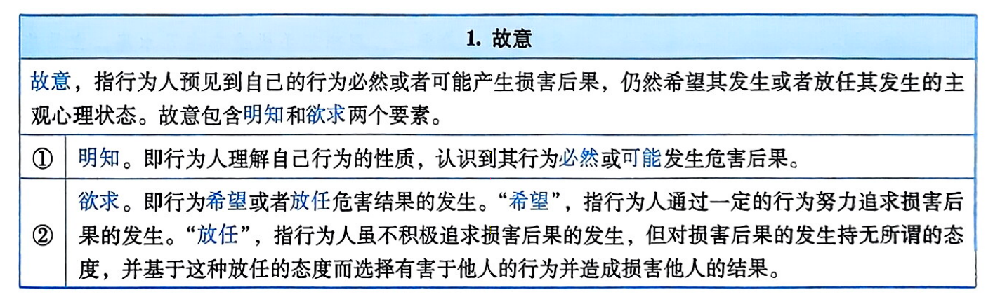

<table>
    <tr>
        <th colspan="3">2. 过失</th>
    </tr>
    <tr>
        <td>概念</td>
        <td colspan="2">过失，指加害人应当预见到其行为可能导致损害的后果，因疏忽大意没有预见，或者虽然已经预见，但轻信可以避免损害的发生，以致造成损害后果的一种主观心理状态。前者称为疏忽大意的过失（疏忽），后者称为过于自信的过失（邂怠）。</td>
    </tr>
    <tr>
        <td rowspan="4">判断</td>
        <td colspan="2">在侵权法中，判断加害人有无过失，采用客观标准，其判断规则是：</td>
    </tr>
    <tr>
        <td>①</td>
        <td>过失判断的操作。（a）若法律明确规定了行为标准，则违反该法定标准致人损害的，加害人具有过失；反之，加害人无过失。（b）不存在法律明确规定的行为标准，以“合理理性谨慎人标准”判断加害人有无过失。</td>
    </tr>
    <tr>
        <td>②</td>
        <td>“合理理性谨慎人标准”的内容。采“实然”与“应然”相比对的方法。将加害人的行为状态（实然）与加害人应当达到的一个理性人的行为标准（应然）进行比对。（a）若实然达到应然标准，无过失；（b）若实然未达到应然标准，有过失。</td>
    </tr>
    <tr>
        <td>③</td>
        <td>“合理理性谨慎人标准”是一种客观化和类型化的标准。即判断行为人的行为是否达到了其所属的职业阶层（如医生、建筑师、律师）或社会活动成员（如汽车驾驶员、盲人）、  或某年龄层（如未成年人）中的一个理性人（A Reasonable Prudent Person）在此情形下应当达到的行为标准。</td>
    </tr>
</table>

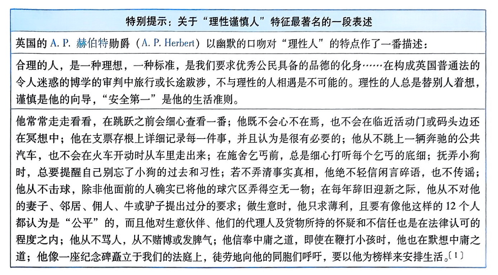

## 侵权责任的免责事由

### 侵权责任的免责事由概述

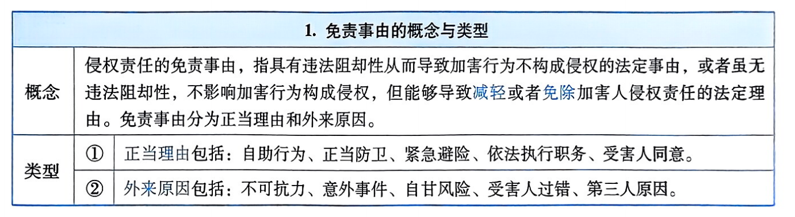

<table>
    <tr>
        <th colspan="2">2.法律明确规定的免责事由与学理上认可的免责事由</th>
    </tr>
    <tr>
        <td>①</td>
        <td>不可抗力（《民法典》第180条）。</td>
    </tr>
    <tr>
        <td>②</td>
        <td>正当防卫（《民法典》第181条）。</td>
    </tr>
    <tr>
        <td>③</td>
        <td>紧急避险（《民法典》第182条）。</td>
    </tr>
    <tr>
        <td>④</td>
        <td>受害人与有过失（《民法典》第1173条）</td>
    </tr>
    <tr>
        <td>⑤</td>
        <td>受害人故意（《民法典》第1174条）。</td>
    </tr>
    <tr>
        <td>⑥</td>
        <td>第三人原因（《民法典》第1175条）。</td>
    </tr>
    <tr>
        <td>⑦</td>
        <td>自甘风险（《民法典》第1176条）。</td>
    </tr>
    <tr>
        <td>⑧</td>
        <td>自助行为（《民法典》第1177条）。</td>
    </tr>
    <tr>
        <td>⑨</td>
        <td>受害人同意（学理认可）</td>
    </tr>
    <tr>
        <td>⑩</td>
        <td>依法执行职务（学理认可）。</td>
    </tr>
    <tr>
        <td>⑪</td>
        <td>意外事件（学理认可）。</td>
    </tr>
</table>

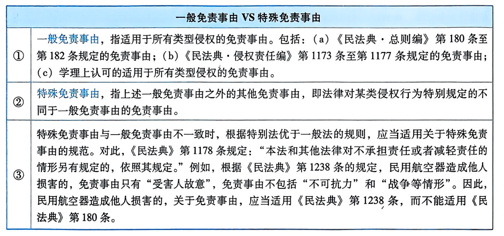

### 受害人过错

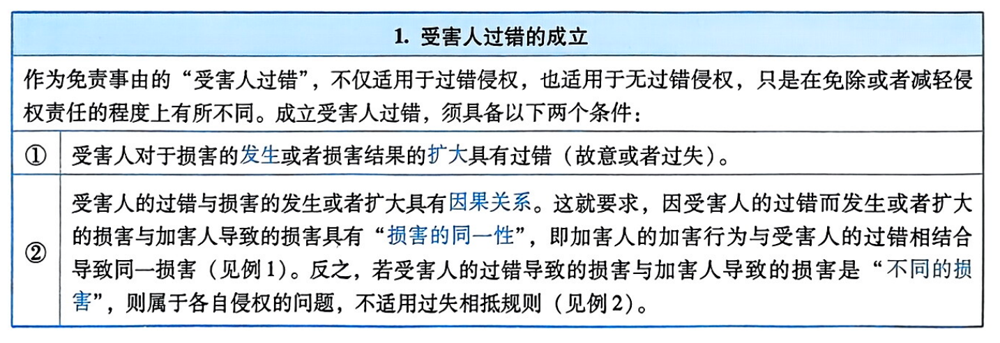

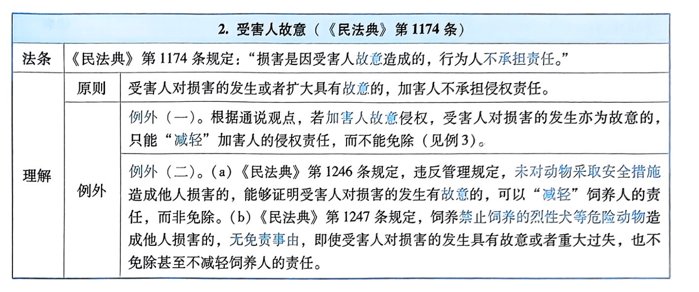

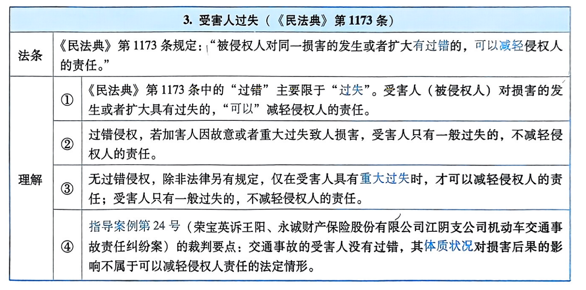

### 意外事件

<table>
    <tr>
        <th colspan="3">意外事件</th>
    </tr>
    <tr>
        <td>概念</td>
        <td colspan="2">意外事件，指非因当事人的故意或过失而偶然发生的事故。例如，某种药物在药典中并未规定需要作过敏试验，医院未作过敏试验，患者接受注射后，由于患者的特异体质发生过敏造成死
亡后果的，应认定为意外事件，不成立医疗技术损害责任。</td>
    </tr>
    <tr>
        <td rowspan="3">要件</td>
        <td>①</td>
        <td>意外事件属于行为人自身以外的原因。</td>
    </tr>
    <tr>
        <td>②</td>
        <td>意外事件指偶然发生的事件，不包括第三人的行为。</td>
    </tr>
    <tr>
        <td>③</td>
        <td>意外事件是不可预见的。行为人已经尽到了他在当时应当和可能尽到的注意义务，仍然不能预见。</td>
    </tr>
    <tr>
        <td>适用范围</td>
        <td colspan="2">因为意外事件造成损害，表明行为人（加害人）没有过错。因此，意外事件作为免责事由，仅适用于过错侵权，不适用于无过错侵权。</td>
    </tr>
</table>

### 受害人同意

<table>
    <tr>
        <th colspan="3">受害人同意</th>
    </tr>
    <tr>
        <td>概念</td>
        <td colspan="2">受害人同意，又称“受害人允诺”，指受害人就他人特定的行为或者他人对自已权益造成的特定损害后果予以同意并表示于外部的意愿。受害人同意得为明示或默示。默示的受害人同意，如举臂让护士抽血，女生让男友拥抱接吻。于加害行为实施前，受害人不得随意撤回已经作出的同意。</td>
    </tr>
    <tr>
        <td rowspan="5">要件</td>
        <td>①</td>
        <td>受害人须有同意能力。例如，无、限制行为能力人无对自已进行手术的同意能力（须经法定代理人代理同意）。再如，未满14周岁的幼女无与他人发生性行为的同意能力。</td>
    </tr>
    <tr>
        <td>②</td>
        <td>受害人同意的内容必须明确而具体，即受害人同意必须针对特定行为或特定损害后果，而不能是概括同意。例如，甲对乙表示：“借给你的那本小说看完后一定焚毁”，该同意有效。再如，甲对乙表示：“我的财产你可以随便毁坏”，该同意无效。</td>
    </tr>
    <tr>
        <td>③</td>
        <td>受害人的同意须真实、自由。受害人因遭受欺诈、胁迫所作的同意，无效。例如，甲因饮用了乙偷偷加人催情药的饮料后同意与乙发生性关系，甲的同意无效。再如，未婚的甲女因遭已婚的乙男欺骗，与乙男同居，甲女的同意无效，因此乙男至少构成对甲女一般人格权的侵害。</td>
    </tr>
    <tr>
        <td>④</td>
        <td>法律规定知情同意制度的，加害人须尽充分的告知、说明义务。例如，《民法典》第1219条规定，医疗机构在给患者进行手术、特殊检查、特殊治疗前，负有特殊告知（说明)义务。</td>
    </tr>
    <tr>
        <td>⑤</td>
        <td>受害人的同意不得违反法律的强制性规范和公序良俗。例如，甲不敢自杀，请乙帮助甲自杀，乙因此协助甲自杀身亡。甲的同意无效，在民法上，乙应对甲生命权遭受的侵害承担侵权责任。再如，受害人同意有时以合同中的“免责条款”形式出现，但法律有所限制。对此，《民法典》第506条规定：“合同中的下列免责条款无效：（一）造成对方人身损害的；（二）因故意或者重大过失造成对方财产损失的。</td>
    </tr>
    <tr>
        <td>效果</td>
        <td colspan="2">受害人同意符合上述条件的，加害人给受害人造成同意范围内的特定损害的，加害人的行为具有违法阻却性，不成立侵权。</td>
    </tr>
</table>

### 自甘风险

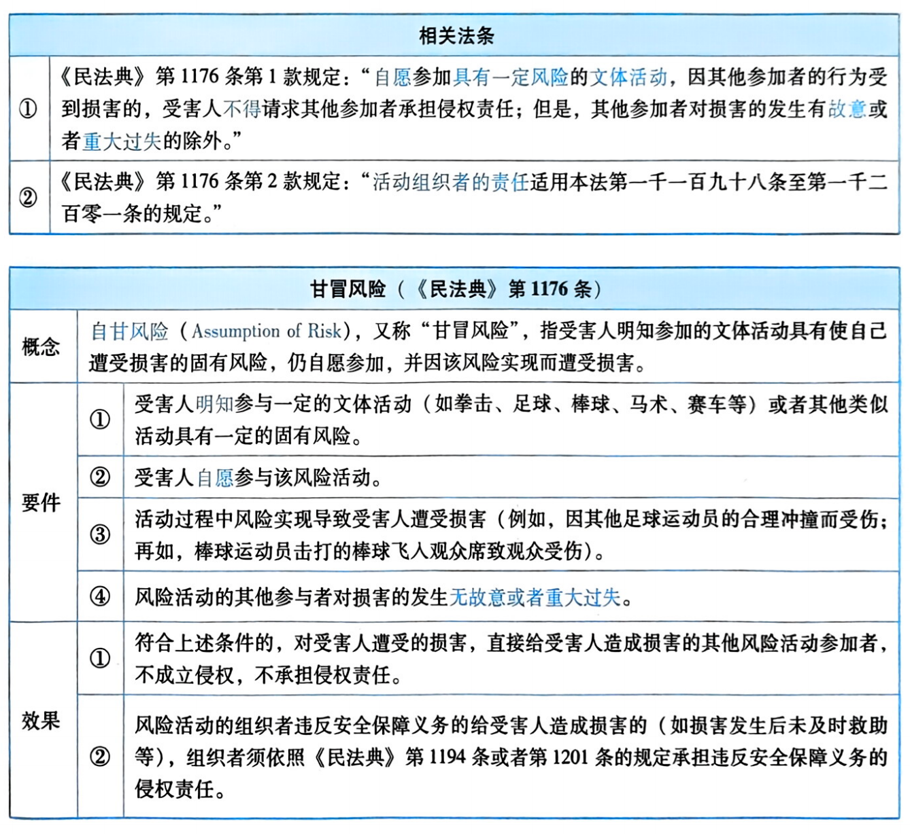

### 自助 

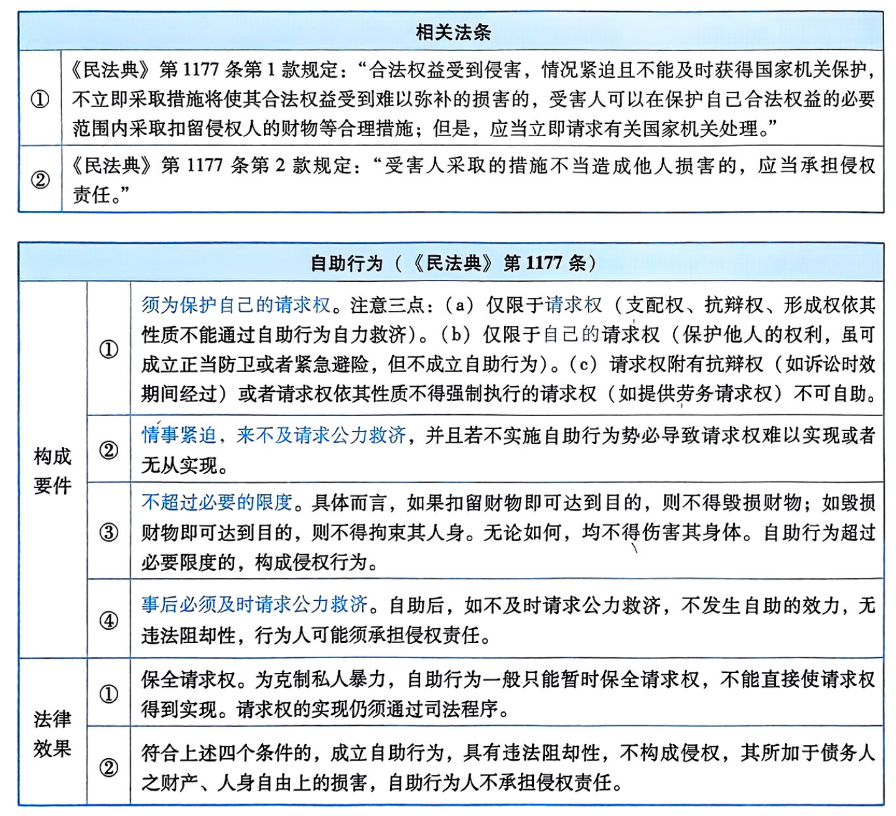

<table>
    <tr>
        <th colspan="3">自助VS留置权</th>
    </tr>
    <tr>
        <td>相同</td>
        <td colspan="2">二者的相同点在于请求权人（债权人）可扣留债务人占有的动产</td>
    </tr>
    <tr>
        <td rowspan="3">不同</td>
        <td>①</td>
        <td>自助，不要求扣留的动产与救济的请求权属于同一法律关系；留置权的成立，要求留置的动产与担保的债权属于同一法律关系（商事留置权除外）。</td>
    </tr>
    <tr>
        <td>②</td>
        <td>自助要求情况紧急；留置权无此要求。</td>
    </tr>
    <tr>
        <td>③</td>
        <td>自助在特殊情况下可毁损债务人占有的动产；留置权无此权能。</td>
    </tr>
</table>

## 共同侵权与分别侵权

### 共同侵权与分别侵权概述

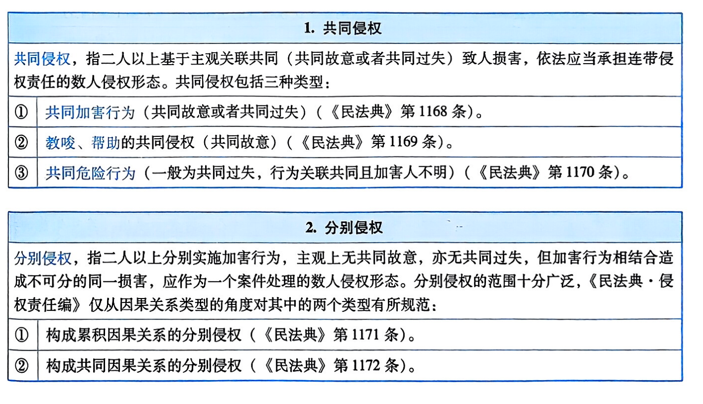

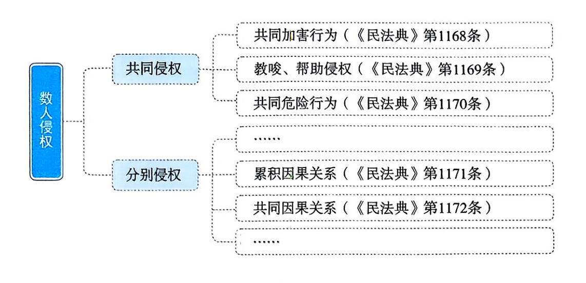

### 共同加害行为（《民法典》第1168条）

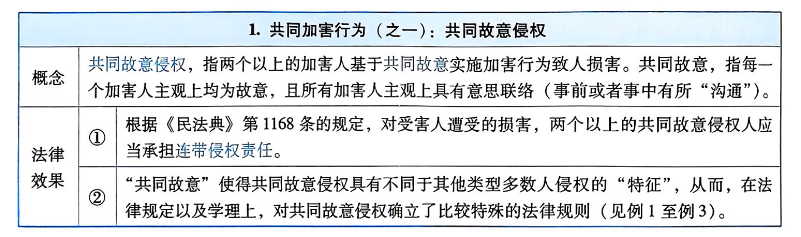

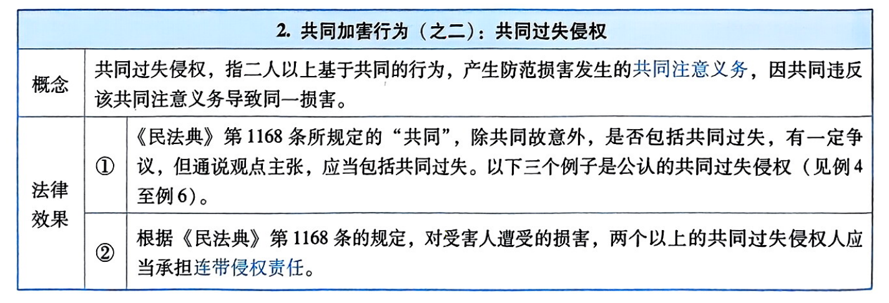

### 教唆、帮助侵权（《民法典》第1169条）

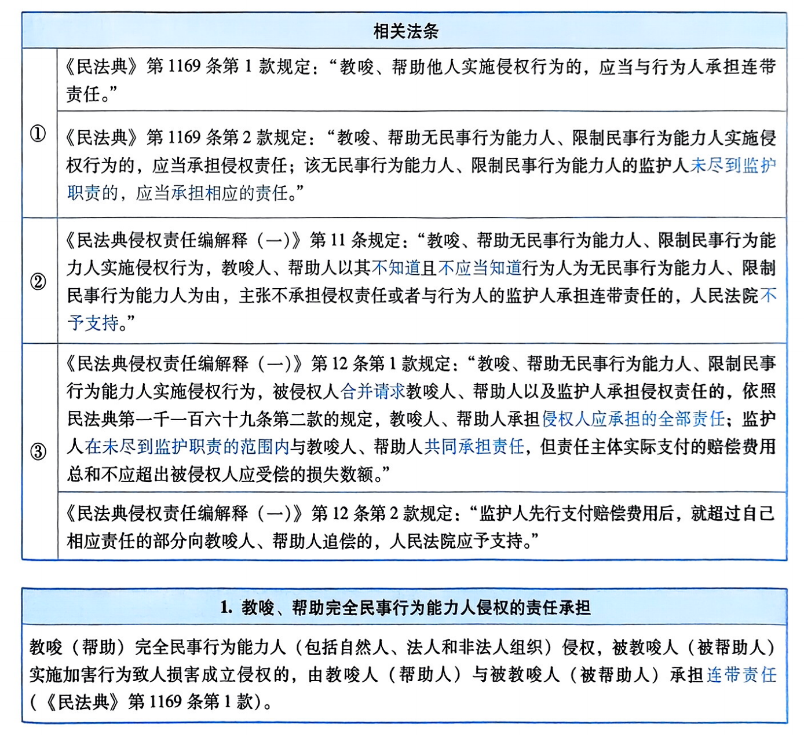

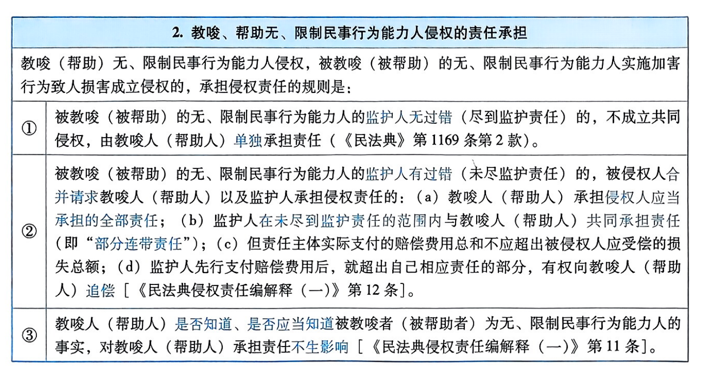

### 共同危险行为（《民法典》第1170条）

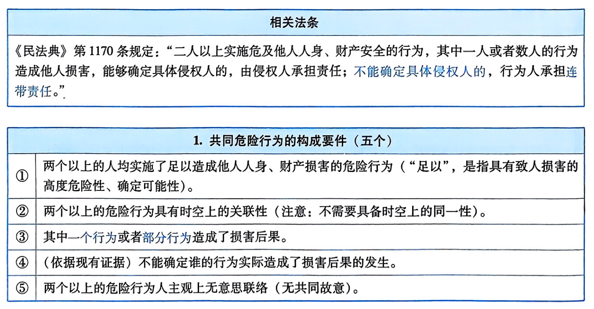

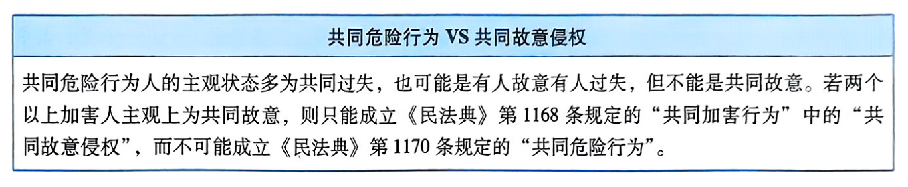

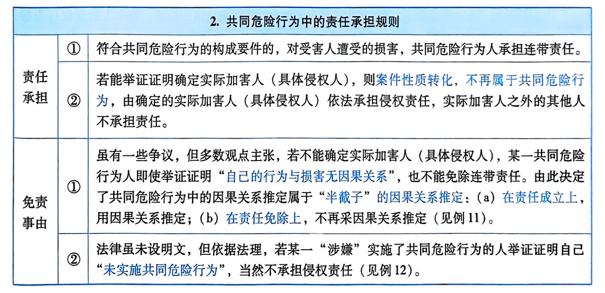

### 分别侵权（之一）：构成累积因果关系的分别侵权（又称“构成叠加因果关系的分别侵权”）（《民法典》第1171条）

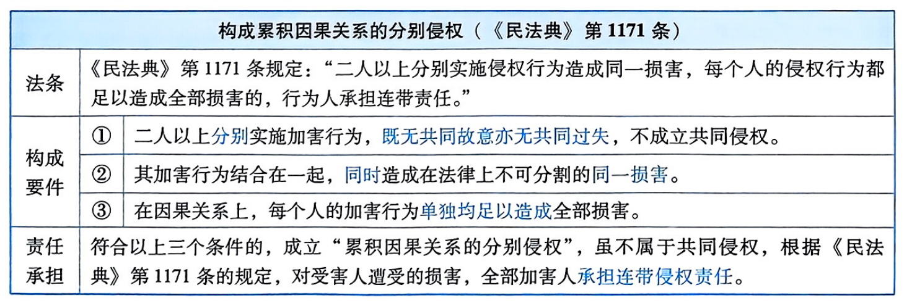

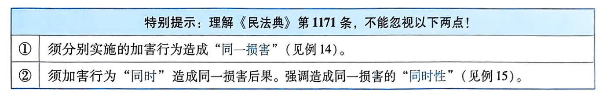

### 分别侵权（之二）：构成共同因果关系的分别侵权（《民法典》第1172条）

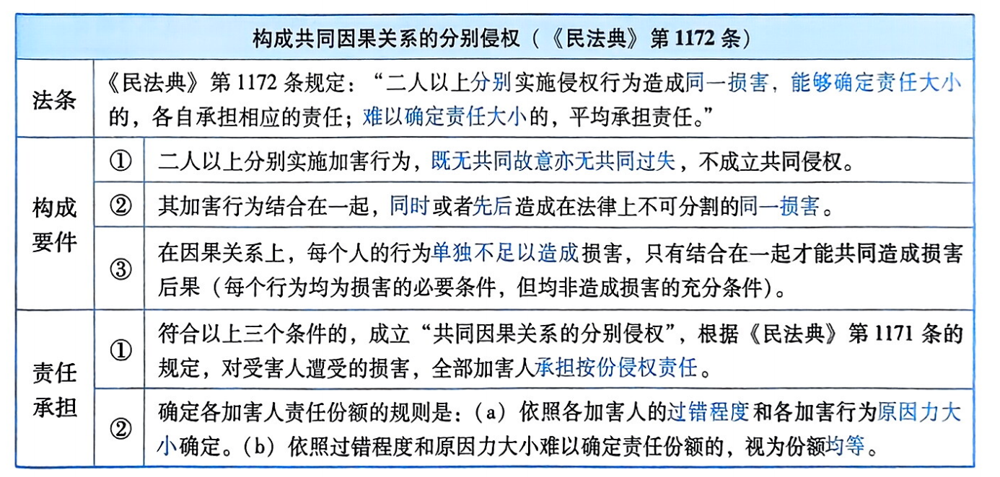

### 分别侵权（之三）：部分累计因果关系的分别侵权（《生态环境侵权解释》第7条）

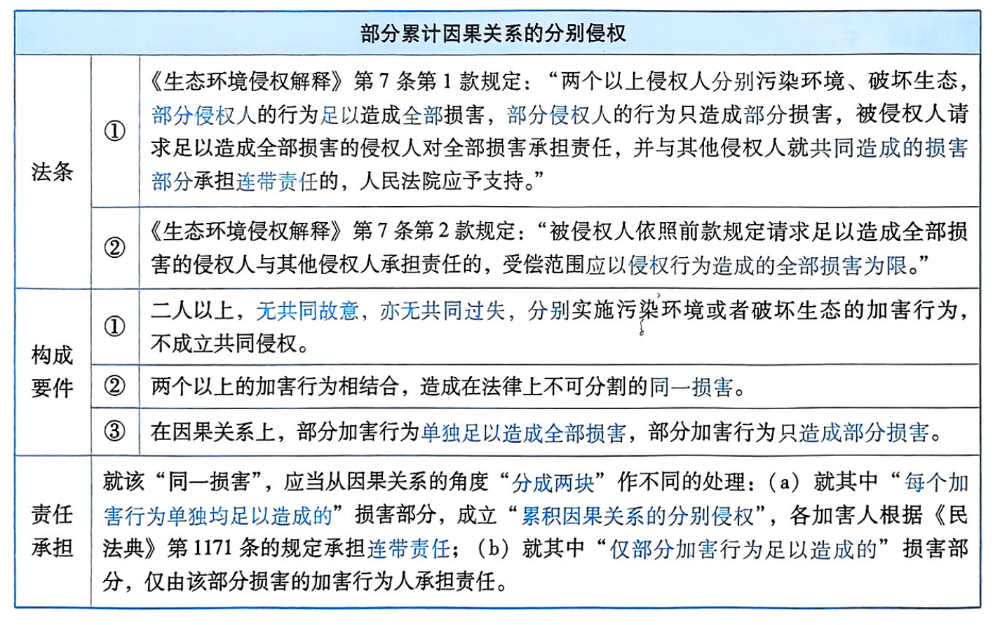

