# 民法侵权责任编-具体侵权行为

## 用人者责任（《民法典》第1191条与第1192条）

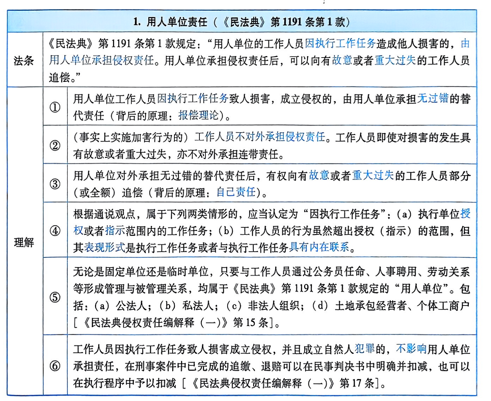

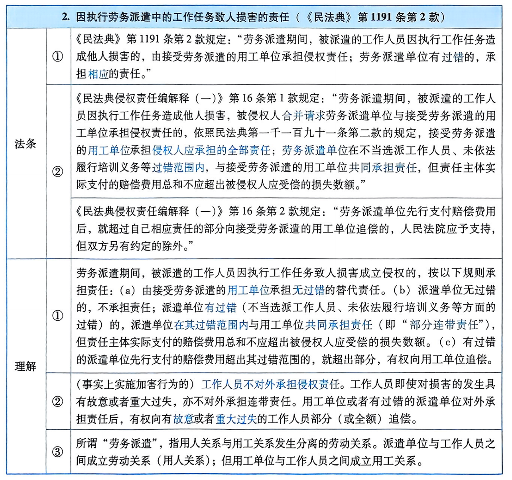

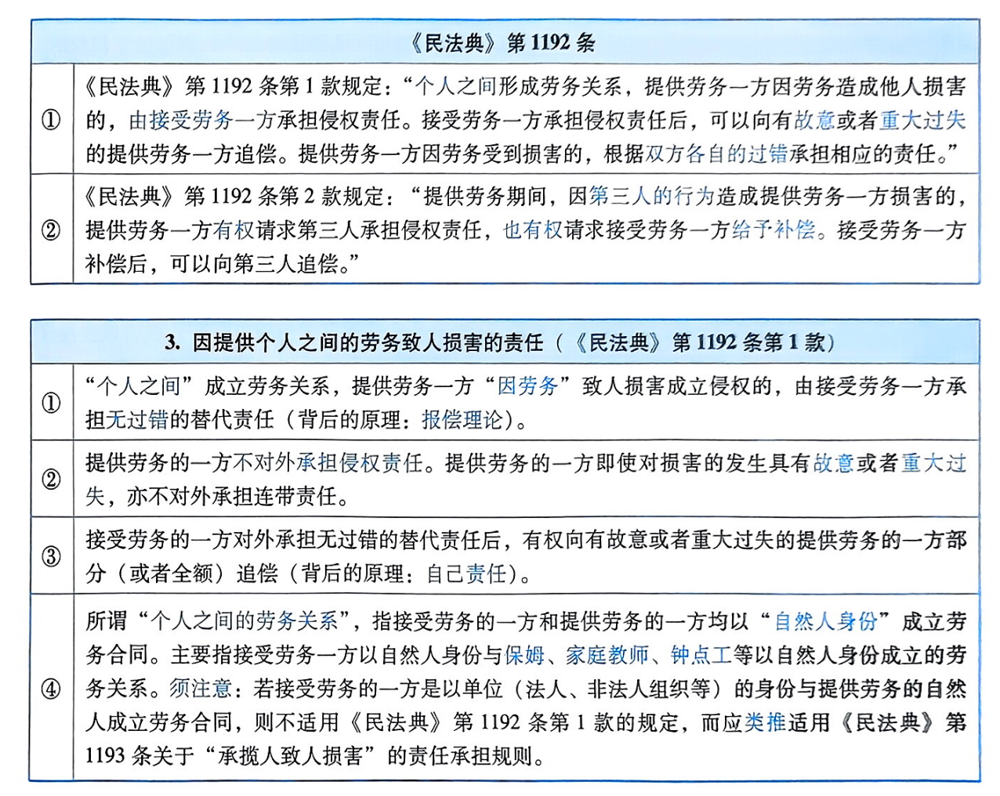

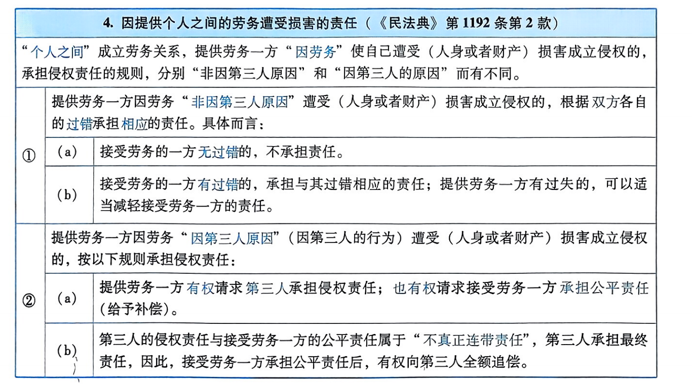

## 承揽人致人损害的责任与承揽人遭受损害的责任

<table>
    <tr>
        <th colspan="3">承揽人致人损害的责任与承揽人遭受损害的责任（《民法典》第1193条）</th>
    </tr>
    <tr>
        <td rowspan="4">法条</td>
        <td>①</td>
        <td>《民法典》第1193条规定：“承揽人在完成工作过程中造成第三人损害或者自已损害的，定作人不承担侵权责任。但是，定作人对定作、指示或者选任有过错的，应当承担相应的责任。”</td>
    </tr>
    <tr>
        <td rowspan="3">②</td>
        <td>《民法典侵权责任编解释（一）》第18条第1款规定：“承揽人在完成工作过程中造成第三人损害的，人民法院依照民法典第一千一百六十五条的规定认定承揽人的民事责任。”（须注意：该款规定有误）</td>
    </tr>
    <tr>
        <td>《民法典侵权责任编解释（一）》第18条第2款规定：“被侵权人合并请求定作人和承揽人承担侵权责任的，依照民法典第一千一百六十五条、第一千一百九十三条的规定，造成损害的承揽人承担侵权人应承担的全部责任；定作人在定作、指示或者选任过错范围内与承揽人共同承担责任，但责任主体实际支付的赔偿费用总和不应超出被侵权人应受偿的损失数额。”</td>
    </tr>
    <tr>
        <td>《民法典侵权责任编解释（一）》第18条第3款规定：“定作人先行支付赔偿费用后，就超过自已相应责任的部分向承揽人追偿的，人民法院应予支持，但双方另有约定的除外。”</td>
    </tr>
    <tr>
        <td rowspan="2">规范内容</td>
        <td>①</td>
        <td>承揽人因承揽“致人”（人身或者财产）损害，成立侵权的：（a）承揽人是否以及如何承担侵权责任，依照法律的规定，既可能是过错责任，也可能是无过错责任【须注意：《民法典侵权责任编解释（一）》第18条第1款的规定有误，因为其规定承揽人只会成立过错责任]。（b）定作人无过错的，定作人不承担责任。（c）定作人（在定作、指示、选任等方面）有过错的，定作人在其过错范围内与承揽人共同承担责任（即“部分连带责任”）；有过错的定作人先行支付的赔偿费用超出其责任范围的，就超出部分，有权向承揽人追偿。</td>
    </tr>
    <tr>
        <td>②</td>
        <td>承揽人因承揽“遭受”（人身或者财产）损害成立侵权的：（a）定作人无过错的，定作人不承担责任；（b）定作人（在定作、指示、选任等方面）有过错的，定作人承担与其过错相应的责任。</td>
    </tr>
    <tr>
        <td>提示</td>
        <td colspan="2">《民法典》第1193条与《民法典侵权责任编解释（一）》第18条的适用范围并不仅仅限于承揽合同，除非法律另有特别规定。《民法典》第1193条与《民法典侵权责任编解释（一）》第18条完全可以类推适用承揽合同之外的其他合同关系。例如，货物承运人、建设工程施工人、受托人、中介人因履行合同义务致人损害成立侵权的，托运人、发包人、委托人是否承担侵权责任，可类推适用《民法典》第1193条与《民法典侵权责任编解释（一）》第18条的规定。</td>
    </tr>
</table>

## 违反安全保障义务的责任（《民法典》第1198条）

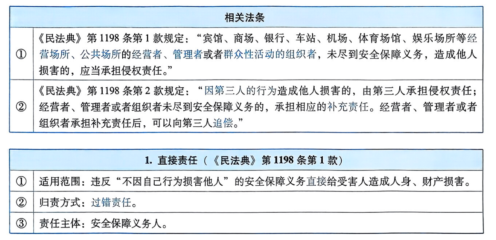

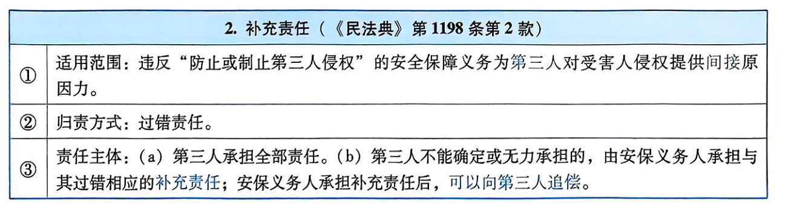

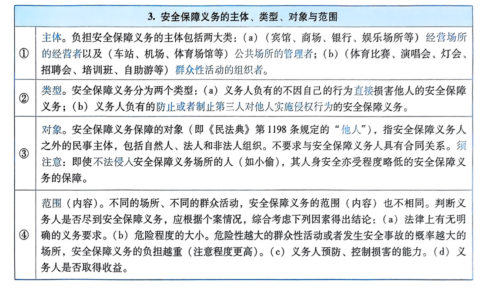

## 无、限制民事行为能力人致人损害的责任与遭受人身损害时的教育机构责任

### 无、限制民事行为能力人致人损害的责任

<table>
    <tr>
        <th colspan="3">1.无、限制民事行为能力人致人损害的责任（《民法典》第1188条）</th>
    </tr>
    <tr>
        <td rowspan="5">法条</td>
        <td rowspan="2">①</td>
        <td>《民法典》第1188条第1款规定：“无民事行为能力人、限制民事行为能力人造成他人损害的，由监护人承担侵权责任。监护人尽到监护职责的，可以减轻其侵权责任。</td>
    </tr>
    <tr>
        <td>《民法典》第1188条第2款规定：“有财产的无民事行为能力人、限制民事行为能力人造成他人损害的，从本人财产中支付赔偿费用；不足部分，由监护人赔偿。</td>
    </tr>
    <tr>
        <td rowspan="3">②</td>
        <td>《民法典侵权责任编解释（一）》第5条第1款规定：“无民事行为能力人、限制民事行为能力人造成他人损害，被侵权人请求监护人承担侵权人应承担的全部责任的，人民法院应予支持，并在判决中明确，赔偿费用可以先从被监护人财产中支付，不足部分由监护人支付。</td>
    </tr>
    <tr>
        <td>《民法典侵权责任编解释（一）》第5条第2款规定：“监护人抗辩主张承担补充责任，或者被侵权人、监护人主张人民法院判令有财产的无民事行为能力人、限制民事行为能力人承担赔偿责任的，人民法院不予支持。”</td>
    </tr>
    <tr>
        <td>《民法典侵权责任编解释（一）》第5条第3款规定：“从被监护人财产中支付赔偿费用的，应当保留被监护人所必需的生活费和完成义务教育所必需的费用。”</td>
    </tr>
    <tr>
        <td rowspan="5">规范内容</td>
        <td colspan="2">无、限制民事行为能力人致人损害，依照法律规定成立侵权的，依照下列规则承担责任：</td>
    </tr>
    <tr>
        <td>①</td>
        <td>由监护人承担无过错的替代责任（“承担侵权人应当承担的全部责任”）；并在判决中明确，赔偿费用可以先从被监护人财产中支付（但应当保留被监护人所必需的生活费和完成义务教育所必需的费用），不足部分由监护人支付（须注意：不能判决由有财产的无、限制民事行为能力人承担侵权损害赔偿责任。有财产的被监护人承担的是“法定补充责任“)。</td>
    </tr>
    <tr>
        <td>②</td>
        <td>未成年子女致人损害成立侵权，父母没有离婚的，被侵权人请求父母共同承担侵权责任的，由父母承担连带责任【《民法典侵权责任编解释（一）》第7条]。</td>
    </tr>
    <tr>
        <td>③</td>
        <td>夫妻离婚后，未成年子女致人损害成立侵权的，被侵权人请求离异夫妻共同承担侵权责任的，由离异后的夫妻承担连带责任。离异夫妻之间的责任份额，可以由双方协议确定；协议不成的，可以根据双方履行监护职责的约定和实际履行情况等确定【《民法典侵权责任编解释（一）》第8条]。</td>
    </tr>
    <tr>
        <td>④</td>
        <td>被侵权人请求监护人承担侵权责任，或者合并请求监护人和（有过错的）受托履行监护职责的人承担侵权责任的，属于“固有的必要共同诉讼”，人民法院应当将无民事行为能力人、限制民事行为能力人列为共同被告【《民法典侵权责任编解释（一）》第4条]。</td>
    </tr>
</table>

<table>
    <tr>
        <th colspan="3">特别提示（一）：未成年人致人损害成立侵权时的继父（继母）的责任</th>
    </tr>
    <tr>
        <td rowspan="2">法条</td>
        <td>①</td>
        <td>《民法典侵权责任编解释（一）》第9条规定：“未成年子女造成他人损害的，依照民法典第一千零七十二条第二款的规定，未与该子女形成扰养教育关系的继父或者继母不承担监护人的侵权责任，由该子女的生父母依照本解释第八条的规定承担侵权责任。”</td>
    </tr>
    <tr>
        <td>②</td>
        <td>《民法典婚姻家庭编解释（二）》第19条第1款规定：“生父与继母或者生母与继父离婚后，当事人主张继父或者继母和曾受其抚养教育的继子女之间的权利义务关系不再适用民法典关于父母子女关系规定的，人民法院应予支持，但继父或者继母与继子女存在依 法成立的收养关系或者继子女仍与继父或者继母共同生活的除外。</td>
    </tr>
    <tr>
        <td rowspan="2">理解</td>
        <td>①</td>
        <td>生父与继母或者生母与继父结婚后，未成年子女致人损害成立侵权的：（a）未与该子女形成抚养教育关系的继父（继母）不承担侵权责任；（b）与该子女形成抚养教育关系的继父（继母）承担无过错的替代责任（当然，亲生父母亦共同承担连带责任）。</td>
    </tr>
    <tr>
        <td>②</td>
        <td>形成有抚养教育关系的继父母子女关系后，生父与继母或者生母与继父离婚的，除非继父（继母）收养该继子女或者继子女仍与继父（继母）共同生活，已经形成的有抚养关系的继父母子女关系解除，此后，该未成年子女致人损害成立侵权的，继父（继母）不承担侵权责任。</td>
    </tr>
</table>

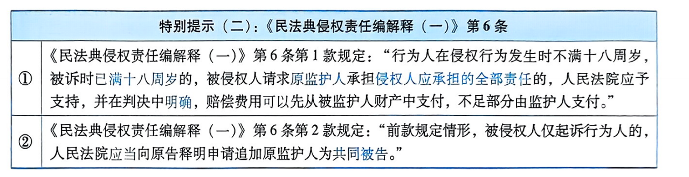

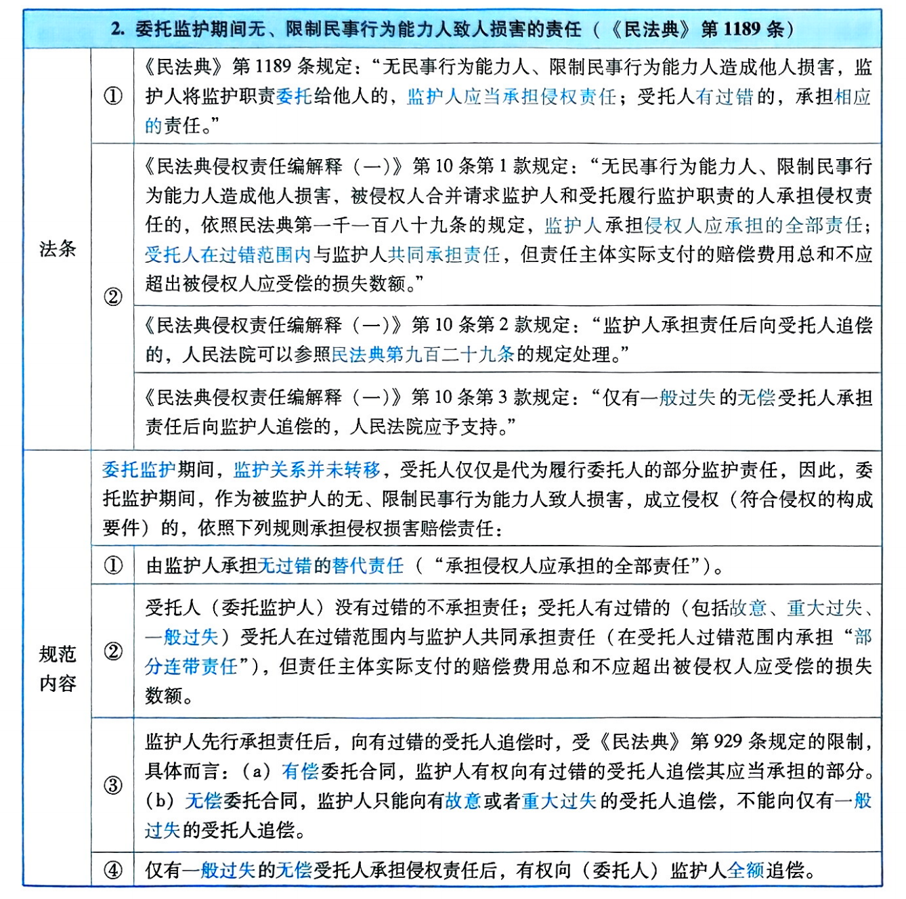

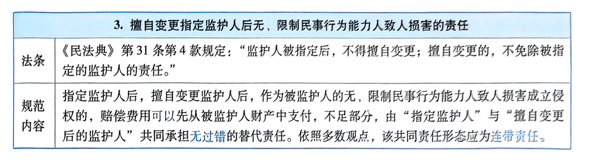

### 无、限制民事行为能力人在教育机构期间遭受人身损害的责任

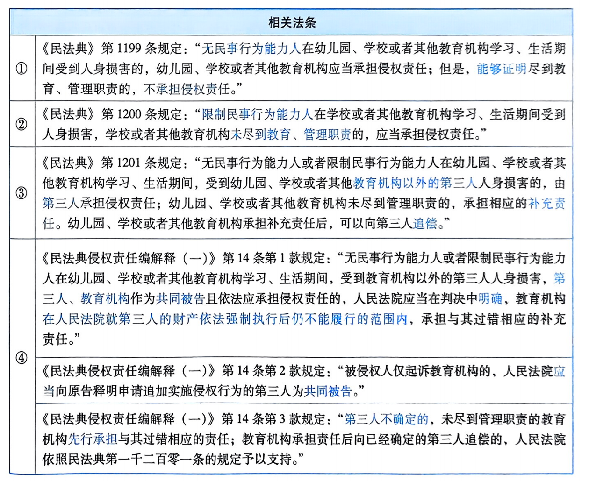

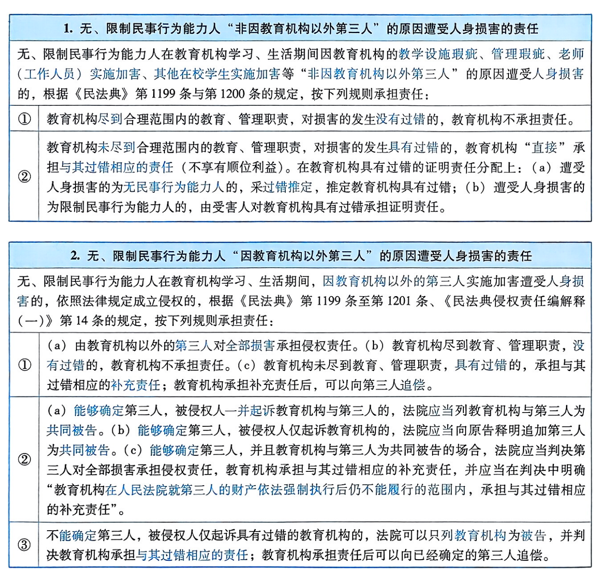

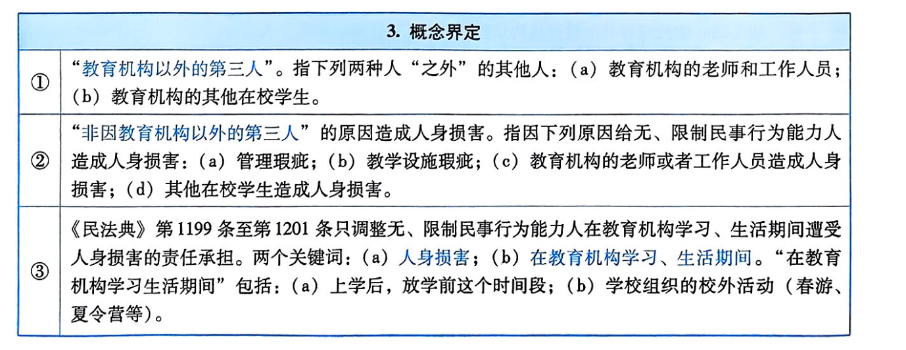

## 产品责任

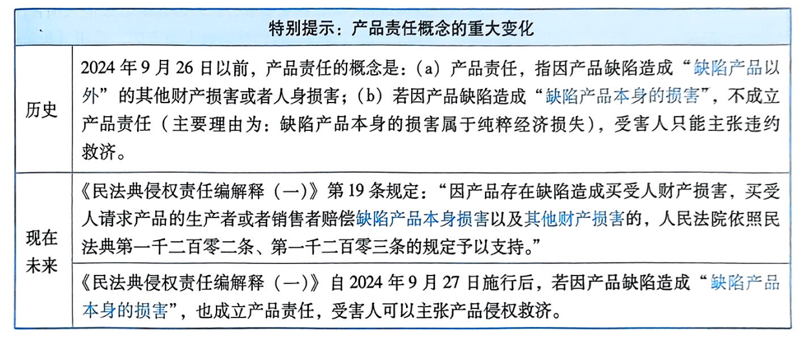

<table>
    <tr>
        <th colspan="2">1.产品责任概念的要点</th>
    </tr>
    <tr>
        <td colspan="2">产品责任（产品侵权），指因产品缺陷造成他人人身损害、缺陷产品本身的损害、缺陷产品本身以外的其他财产损害，产品的生产者与销售者应当承担的侵权责任。把握产品责任的概念，应注意以下要点：</td>
    </tr>
    <tr>
        <td rowspan="4">缺陷</td>
        <td>须因产品“缺陷”造成他人损害。所谓“缺陷”，指产品具有危及他人人身、财产安全的不合理危险；产品有保障人体健康和人身、财产安全的国家标准、行业标准的，是指不符合该标准。</td>
    </tr>
    <tr>
        <td>“缺陷”的认定。（a）所谓“不合理的危险”，指不符合人们合理期待的安全。第一，如果按照产品说明使用产品而遭受损害，产品具有不合理的危险；第二，若生产者、销售者已经预见到使用者可能以不合理的方式使用产品，但未对因此产生的危险加以警示，产品也具有不合理的危险。（b）产品虽符合保障人身、财产安全的国家标准、行业标准，但存在不合理危险的，应认定产品具有缺陷；产品不符合保障人身、财产安全国家标准、行业标准，一律认定为产品具有缺陷。</td>
    </tr>
    <tr>
        <td>“缺陷”≠“瑕疵”。“瑕疵”，指不符合约定性，包括物的瑕疵和权利瑕疵。产品仅有“瑕疵”而无“缺陷”，只能主张违约责任。产品既有“瑕疵”又有“缺陷”，并因“缺陷”造成他人损害的，成立加害给付，受害人可择一主张侵权或违约（见例2）。</td>
    </tr>
    <tr>
        <td>产品缺陷包括三类：（a）设计缺陷；（b）制造缺陷；（c）指示或警示缺陷。</td>
    </tr>
    <tr>
        <td rowspan="4">产品</td>
        <td>“产品”，是指经过加工、制作用于销售的产品（《产品质量法》第2条第2款）。对“产品”的这一立法上的定义，字面含义过窄，应当予以扩张解释，作如下理解。</td>
    </tr>
    <tr>
        <td>第一，仅限于“动产”。（a）动产虽因添附成为不动产的重要成分，若因其缺陷致他人损害，仍成立产品责任；（b）“建设工程”不属于产品（建设工程因缺陷致人损害的，适用《民法典》第1252条第1款）；但建设工程使用的建筑材料、建筑购配件和设备属于产品。（c）“信息产品”（书籍、地图、软件、数据），具有不合理危险的（如医学教科书对用药量书写错误，医生因此对患者实施了错误的治疗；再如化学教科书将两种元素的比例标错，学生照此做实验时发生爆炸），原则上，不成立产品责任（以免过度妨害信息自由与言论自由）。</td>
    </tr>
    <tr>
        <td>第二，须为经过“加工、制作”的动产。所谓“加工、制作”，指改变原有物理状态、化学性质的活动。因此，直接来自自然，性质如何完全取决于自然，未经加工、制作的动产，不属于产品。如钓的活鱼、挖的鲜野菜、采摘的鲜蘑菇等。</td>
    </tr>
    <tr>
        <td>第三，须为用于“投人流通”的动产。（a）用于出售、赠与、免费试用、试用买卖均用于“投人流通”。（b）不用于“投人流通”的动产，不属于产品（见例3）。（c）“废品”，如报废汽车、废旧家电，已经退出流通，不再属于产品。</td>
    </tr>
</table>

<table>
    <tr>
        <th colspan="2">2.产品责任的一般规则（《民法典》第1202条至1204条）</th>
    </tr>
    <tr>
        <td>①</td>
        <td>责任主体：生产者与销售者承担无过错责任、不真正连带责任。（a）生产者不仅指最终产品的生产者，还包括有缺陷的原材料、零部件的生产者；产品的进口商视为产品的生产者；生产者不仅包括实际的生产者，还包括表见生产者（准生产者）。所谓“表见生产者”，指在他人生产的产品上标注自已的名称、商标的人。（b）销售者指以销售产品为经营活动的人（偶尔出售二手产品的人，不属于销售者）。销售者包括整个销售链条上的批发商与零售商。</td>
    </tr>
    <tr>
        <td>②</td>
        <td>归责方式：（a）对外：生产者与销售者均承担无过错资任；（b）对内追偿：销售者系过错责任；销售者无过错的，生产者承担全部最终责任（销售者承担责任后有权向生产者全额追偿）；销售者有过错的，销售者承担全部最终责任（生产者承担责任后有权向销售者全额追偿）（《民法典》第1203条）。</td>
    </tr>
    <tr>
        <td>③</td>
        <td>对缺陷的产生具有过错的仓储者、运输者、设计者等第三人不对外承担责任（不能列为被告，充其量列为无独三）。生产者、销售者对外承担产品责任后，有权向有过错的第三人部分（或全额）追偿（《民法典》第1204条）。因为有过错的仓储者、运输者不属于承担产品责任的适格主体。</td>
    </tr>
</table>

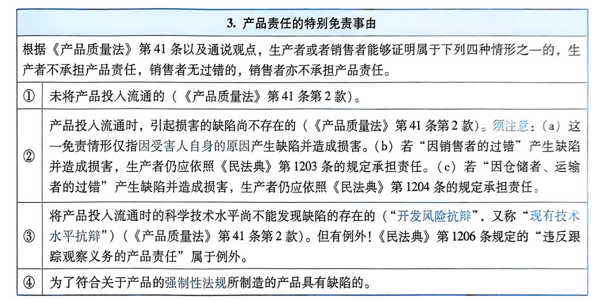

<table>
    <tr>
        <th colspan="4">4.违反跟踪观察义务的产品责任（《民法典》第1206条）</th>
    </tr>
    <tr>
        <td rowspan="2">法条</td>
        <td>①</td>
        <td colspan="2">《民法典》第1206条第1款规定：“产品投人流通后发现存在缺陷的，生产者、销售者应当及时采取停止销售、警示、召回等补救措施；未及时采取补救措施或者补效措施不力造成损害扩大的，对扩大的损害也应当承担侵权责任。”</td>
    </tr>
    <tr>
        <td>②</td>
        <td colspan="2">《民法典》第1206条第2款规定：“依据前款规定采取召回措施的，生产者、销售者应当负担被侵权人因此支出的必要费用。”</td>
    </tr>
    <tr>
        <td>例子</td>
        <td colspan="3">甲公司生产A型笔记本电脑，于2022年4月1日投人流通。乙公司销售A型笔记本电脑。2024年4月1日，经鉴定确认，A型电脑存在偶尔丢失数据的缺陷，并且，自2022年4月1日至2024年4月1日期间，因此给数百名用户共造成损失6亿元。</td>
    </tr>
    <tr>
        <td rowspan="4">规范内容</td>
        <td>①</td>
        <td colspan="2">产品投入流通后发现存在缺陷（设计缺陷、制造缺陷、警示缺陷）的，生产者、销售者应当履行“跟踪观察义务”，即及时采取停止销售、警示、召回、跟踪监视等补救措施。须注意：若不履行跟踪观察义务或者履行不适当，则产品具有“跟踪观察缺陷”（前三种缺陷之外的另一种缺陷）。</td>
    </tr>
    <tr>
        <td rowspan="3">②</td>
        <td colspan="2">产品投入流通后发现存在的缺陷，包括两种情形：第一，依照投人流通时的科学技术水平就能认定为缺陷而由于过错没有发现的情形（简称“情形一”）；第二，依照投人流通时的科学技术水平不能认为是缺陷现在构成缺陷的情形（简称“情形二”）。不同情形，生产者、销售者应当承担责任的范围不同，具体而言（结合上面的“例子”叙述)：</td>
    </tr>
    <tr>
        <td>(a)</td>
        <td>对因“情形一”所述缺陷自2022年4月1日至2024年4月1日期间所造成的损害，无论生产者、销售者是否履行跟踪观察义务，生产者、销售者均应依照《民法典》第1203条的规定承担侵权责任。对因“情形一”所述缺陷自2024年4月2日以后造成的损害，分两种情况而不同：第一种情况，若履行了合理的跟踪观察义务（产品即不存在“跟踪观察缺陷”），因不合理使用该产品造成的损害（即“扩大的损害”），生产者、销售者不承担责任。第二种情况，若未履行合理的跟踪观察义务（产品即存在“跟踪观察缺陷”），因使用该产品造成的损害（即“扩大的损害”），生产者、销售者应当承担责任（不真正连带责任）。</td>
    </tr>
    <tr>
        <td>(b)</td>
        <td>对因“情形二”所述缺陷自2022年4月1日至2024年4月1日期间所造成的损害，无论生产者、销售者是否履行跟踪观察义务，生产者、销售者均不承担责任（依照《产品质量法》第41条第2款的规定免责）。对因“情形二”所述缺陷自2024年4月2日以后造成的损害，分两种情况而不同：第一种情况若履行了合理的跟踪观察义务（产品即不存在“跟踪观察缺陷”），因不合理，使用该产品造成的损害（即“扩大的损害”），生产者、销售者不承担责任。第二种情况，若未履行合理的跟踪观察义务（产品即存在“跟踪观察缺陷”），因使用该产品造成的损害（即“扩大的损害”），生产者、销售者应当承担责任（不真正连带责任）。</td>
    </tr>
</table>

<table>
    <tr>
        <th colspan="3">5.就产品责任承担惩罚性赔偿责任的条件（《民法典》第1207条）</th>
    </tr>
    <tr>
        <td>法条</td>
        <td colspan="2">《民法典》第1207条规定：“明知产品存在缺陷仍然生产、销售，或者没有依据前条规定采取有效补救措施，造成他人死亡或者健康严重损害的，被侵权人有权请求相应的惩罚性赔偿。”</td>
    </tr>
    <tr>
        <td rowspan="3">规范内容</td>
        <td colspan="2">符合以下两个条件的，受害人（赔偿权利人）除有权请求生产者、销售者承担补偿性赔偿责任，填补遭受的全部实际损害外，还有权另外主张惩罚性损害赔偿。惩罚性赔偿的标准按以下规则确定：（a）符合法律规定的特别情形的，依照法律的特别规定（如《消费者权益保护法》第55条，《食品安全法》第148条）；（b）不符合法律特别规定的情形的，由裁判者自由裁量确定数额。</td>
    </tr>
    <tr>
        <td>①</td>
        <td>生产者、销售者明知缺陷存在，仍然生产、销售或者生产者、销售者未履行跟踪观察义务并及时采取合理的补救措施致使损失扩大的</td>
    </tr>
    <tr>
        <td>②</td>
        <td>造成受害人死亡或者健康权严重损害的后果。</td>
    </tr>
</table>

## 机动车交通事故责任

### 一般规定

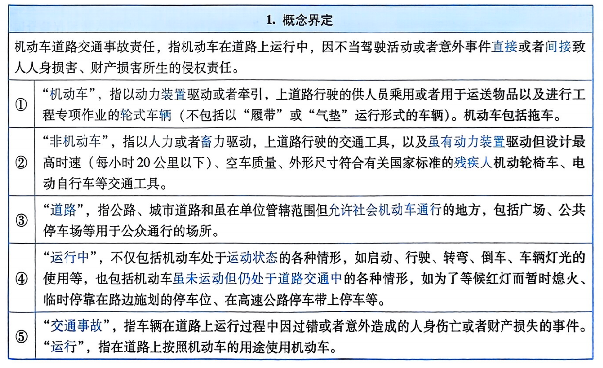

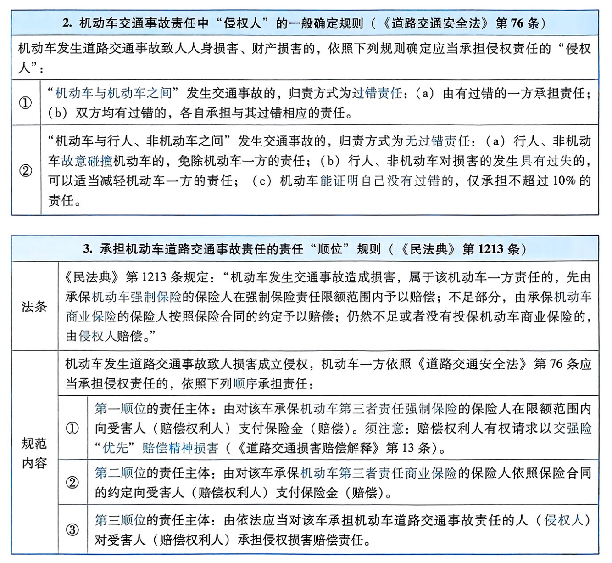

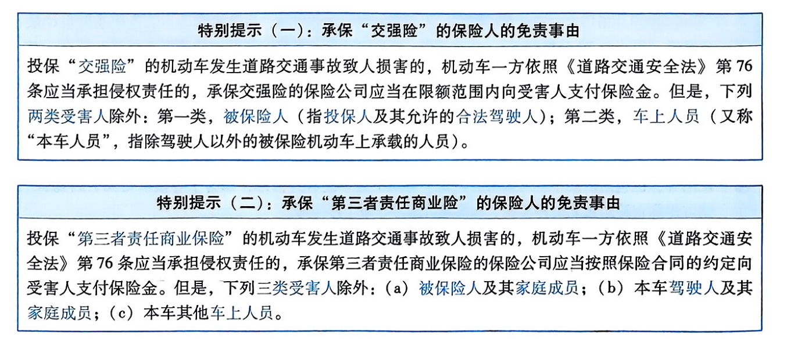

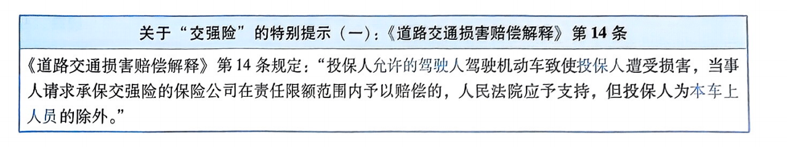

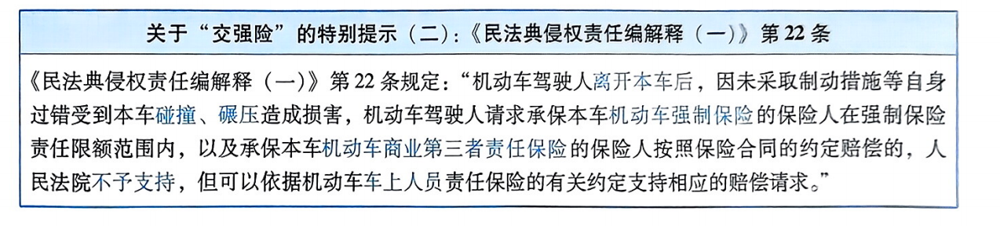

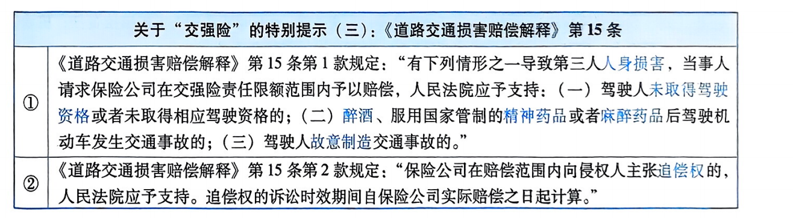

<table>
    <tr>
        <th colspan="2">关于“交强险”的特别提示（四）：《民法典侵权责任编解释（一）》第21条</th>
    </tr>
    <tr>
        <td>①</td>
        <td>《民法典侵权责任编解释（一）》第21条第1款规定：“未依法投保强制保险的机动车发生交通事故造成损害，投保义务人和交通事故责任人不是同一人，被侵权人合并请求投保义务人和交通事故责任人承担侵权责任的，交通事故责任人承担侵权人应承担的全部责任；投保义务人在机动车强制保险责任限额范围内与交通事故责任人共同承担责任，但责任主体实际支付的赔偿费用总和不应超出被侵权人应受偿的损失数额。”</td>
    </tr>
    <tr>
        <td>②</td>
        <td>《民法典侵权责任编解释（一）》第21条第2款规定：“投保义务人先行支付赔偿费用后，就超出机动车强制保险责任限额范围部分向交通事故责任人追偿的，人民法院应予支持。”</td>
    </tr>
</table>

### 租赁、借用机动车期间的机动车道路交通事故责任

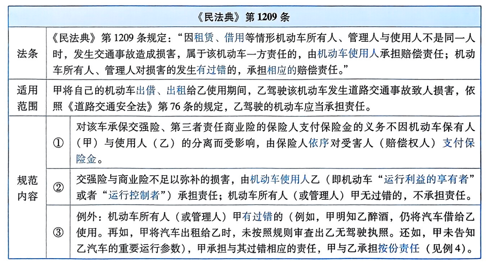

### 机动车转让过程中占有使用人与所有人、登记名义人分离情形下的机动车道路交通事故责任

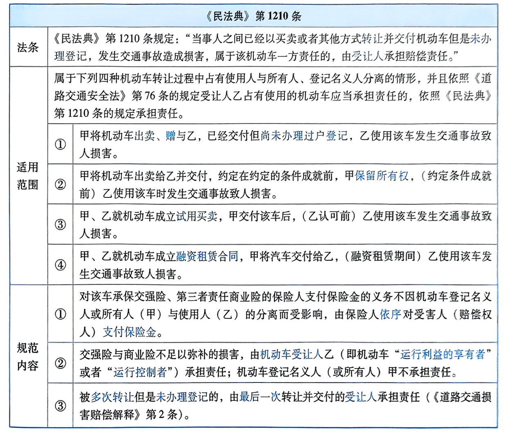

### 挂靠机动车辆发生道路交通事故的责任

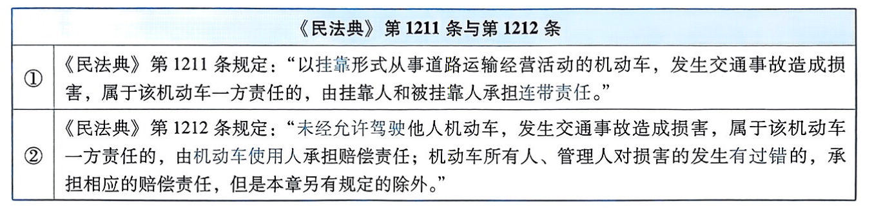

### 转让的报废、拼装机动车发生道路交通事故的责任

<table>
    <tr>
        <th colspan="3">《民法典》第1214条</th>
    </tr>
    <tr>
        <td>法条</td>
        <td colspan="2">《民法典》第1214条规定：“以买卖或者其他方式转让拼装或者已经达到报废标准的机动车，发生交通事故造成损害的，由转让人和受让人承担连带责任。</td>
    </tr>
    <tr>
        <td rowspan="3">适用范围</td>
        <td>①</td>
        <td>甲将拼装（报废）机动车转让给乙，乙使用该拼装（报废）机动车时发生道路交通事故致人损害。</td>
    </tr>
    <tr>
        <td>②</td>
        <td>“报废机动车”，指达到国家报废标准，或者虽未达到国家报废标准，但发动机或者底盘严重损坏，经检验不符合国家机动车运行安全技术条件或者国家机动车污染物排放标准的机动车。
</td>
    </tr>
    <tr>
        <td>③</td>
        <td>“拼装机动车”，指没有制造资质的人制造的机动车以及使用报废汽车发动机、方向机、变速器、前后桥、车架（统称“五大总成”）以及其他零配件组装的机动车。</td>
    </tr>
    <tr>
        <td rowspan="5">规范内容</td>
        <td>①</td>
        <td>拼装（报废）机动车法律禁止上路运行，因此，无论交通事故发生在机动车与机动车之间，还是机动车与行人（非机动车）之间，根据《道路交通安全法》第76条的规定，乙驾驶的该车均应承担责任。</td>
    </tr>
    <tr>
        <td>②</td>
        <td>这样的车辆不能投保，即使投保也是以欺诈手段取得的（保险人可撤销保险合同拒付保险金），故不存在向受害人（赔偿权利人）支付保险金的保险人。</td>
    </tr>
    <tr>
        <td>③</td>
        <td>由转让人（甲）与受让人（乙）承担连带责任。</td>
    </tr>
    <tr>
        <td>④</td>
        <td>拼装（报废）机动车被多次转让的，由所有的转让人与受让人承担连带责任（《道路交通损害赔偿解释》第4条）。</td>
    </tr>
    <tr>
        <td>⑤</td>
        <td>转让人、受让人不知道且不应当知道转让的系报废机动车辆、拼装机动车辆的，对责任的承担不产生影响［《民法典侵权责任编解释（一)》第20条]。</td>
    </tr>
</table>

### 被盗抢机动车发生道路交通事故的责任

<table>
    <tr>
        <th colspan="3">《民法典》第1215</th>
    </tr>
    <tr>
        <td rowspan="2">法条</td>
        <td>①</td>
        <td>《民法典》第1215条第1款规定：“盗窃、抢劫或者抢夺的机动车发生交通事故造成损害的，由盗窃人、抢劫人或者抢夺人承担赔偿责任。盗窃人、抢劫人或者抢夺人与机动车使用人不是同一人，发生交通事故造成损害，属于该机动车一方责任的，由盗窃人、抢劫人或者抢夺人与机动车使用人承担连带责任。”</td>
    </tr>
    <tr>
        <td>②</td>
        <td>《民法典》第1215条第2款规定：“保险人在机动车强制保险责任限额范围内垫付抢救费用的，有权向交通事故责任人追偿。</td>
    </tr>
    <tr>
        <td>适用范围</td>
        <td colspan="2">甲的机动车被乙盗窃、抢劫或者抢夺后，乙使用该车或者乙将该车出租、出借给丙使用期间，发生道路交通事故，依照《道路交通安全法》第76条的规定，该车应承担责任。</td>
    </tr>
    <tr>
        <td rowspan="3">规范内容</td>
        <td>①</td>
        <td>对该车承保交强险的保险人有权拒绝支付保险金（机动车被盗抢是保险人的法定免责事由）。</td>
    </tr>
    <tr>
        <td>②</td>
        <td>若受害人欠缺抢救费用，受害人有权请求承保交强险的保险公司在限额范围内垫付抢救费用；保险公司垫付后有权向侵权人追偿。</td>
    </tr>
    <tr>
        <td>③</td>
        <td>机动车的所有人（或管理人）甲不承担侵权责任；若系在盗窃人、抢劫人或者抢夺人乙使用该车期间发生道路交通事故致人损害，由乙承担责任；若系在盗窃人、抢劫人或者抢夺人乙出租、出借给丙使用期间发生道路交通事故致人损害，由乙和丙承担连带责任。</td>
    </tr>
</table>

### 好意同乘机动车交通事故责任 

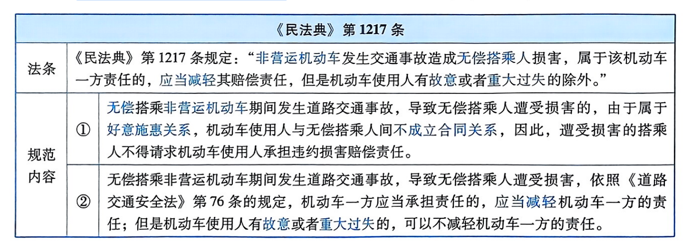

### 《道路交通损害赔偿解释》第3条、第5条与第6条

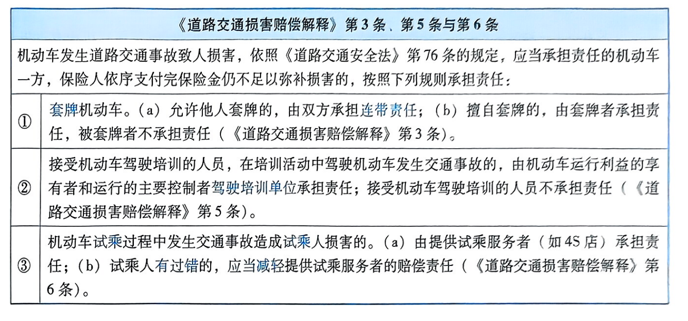

## 医疗损害责任

