# 民法婚姻编-夫妻财产关系

## 夫妻财产制

### 法定财产制与约定财产制

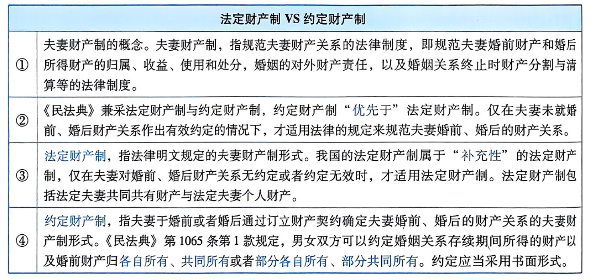

### 夫妻财产契约的有效要件与效力

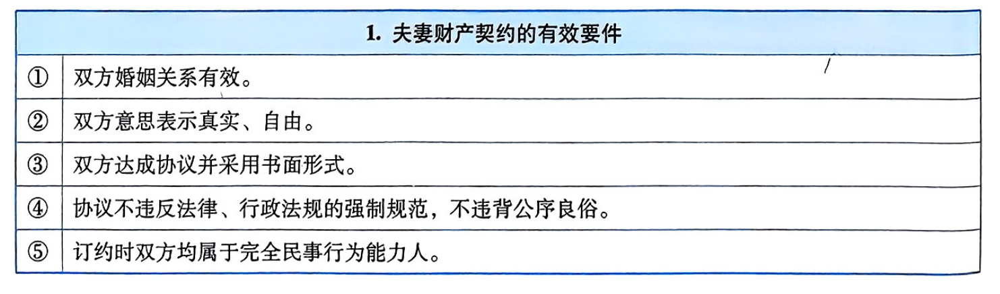

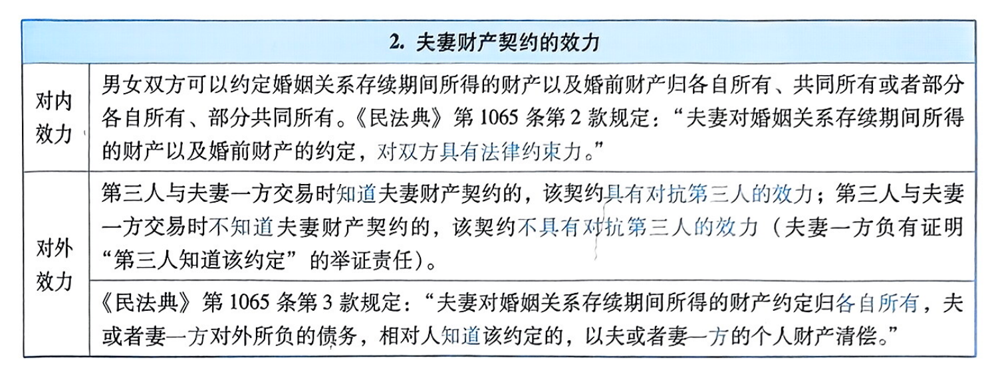

### 《民法典婚姻家庭编解释（二）》第5条

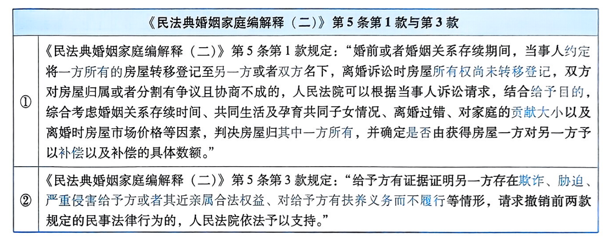

::: tip
我们一般的完整的民法规范，是构成要件和法律效果，但《民法典婚姻家庭编解释（二）》第5条的立法，采用的是动态系统论，它是权衡因素和法律效果 

权衡因素是有位阶的 
（1）共同生活时间 
（2）孕育 
（3）对离婚的过错在谁 
（4）房屋的市场价格，在夫妻财产中是否特别重要，以及双方对家庭的财产贡献 
:::

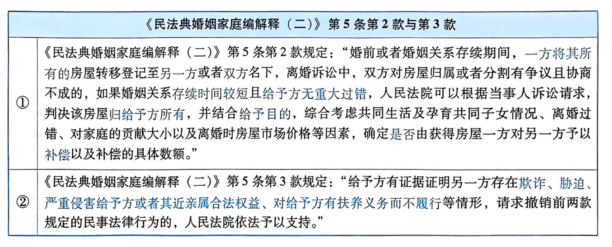

::: tip
法律行为有两类基础，客观基础和主观基础
:::

## 法定夫妻共同共有财产

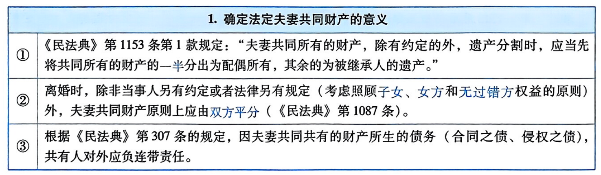

<table>
    <tr>
        <th colspan="2">2.法定夫妻共同共有财产的范围</th>
    </tr>
    <tr>
        <td colspan="2">除非当事人另有约定，在婚姻关系存续期间，夫妻一方取得或者双方共同取得的下列财产属于夫妻共同共有的财产：</td>
    </tr>
    <tr>
        <td>①</td>
        <td>工资、奖金、劳务报酬（《民法典》第1062条）。</td>
    </tr>
    <tr>
        <td>②</td>
        <td>生产、经营、投资的收益（《民法典》第1062条）。</td>
    </tr>
    <tr>
        <td>③</td>
        <td>实际取得或者应当取得的“住房补贴”、“住房公积金”、“基本养老金”和“破产安置补偿费”  【《民法典婚姻家庭编解释（一)》第25条】。</td>
    </tr>
    <tr>
        <td>④</td>
        <td>夫妻一方个人财产在婚姻关系存续期间产生的除孳息和自然增值以外的其他收益 【《民法典婚姻家庭编解释（一）》第26条】。</td>
    </tr>
    <tr>
        <td>⑤</td>
        <td>实际取得或者已经明确可以取得的“知识产权的财产性收益” 【《民法典》第1062条，《民法典婚姻家庭编解释（一）》第24条】。</td>
    </tr>
    <tr>
        <td>⑥</td>
        <td>继承或者受赠的财产 （但是，遗嘱或者赠与合同中确定只归一方的财产，为该夫或妻一方的个人财产） 【《民法典》第1062条与第1063条】。</td>
    </tr>
    <tr>
        <td>⑦</td>
        <td>由一方婚前承租、婚后用共同财产购买，登记在一方名下的房屋 【《民法典婚姻家庭编解释（一)》第27条】。</td>
    </tr>
    <tr>
        <td>⑧</td>
        <td>军人的复员费、自主择业费等一次性费用，以夫妻婚姻关系存续年限乘以年平均值，所得数额为夫妻共同财产 【平均值的求算方法见《民法典婚姻家庭编解释（一）》第71条】</td>
    </tr>
    <tr>
        <td>⑨</td>
        <td>一方婚前签订不动产买卖合同，以个人财产支付首付款并在银行贷款，婚后用夫妻共同财产还贷，不动产登记于首付款支付方名下的，除离婚时双方另有约定，原则上可以认定该不动产归登记一方，尚未归还的贷款为不动产登记一方的个人债务。但是，双方婚后共同还贷支付的款项及其相对应财产增值部分，应认定为夫妻共同财产 【《民法典婚姻家庭编解释（一）》第78条】。</td>
    </tr>
</table>

::: tip
《民法典婚姻家庭编解释（一）》第26条，将夫妻一方个人财产在婚姻关系存续期间产生的收益分为三个类型 
（a）孳息（分为天然孳息和法定孳息） 
（b）自然增值 
（c）其他收益（主要是投资收益） 
:::

## 法定夫妻个人财产

<table>
    <tr>
        <th colspan="2">1.法定夫妻个人财产的范围</th>
    </tr>
    <tr>
        <td>①</td>
        <td>一方的婚前财产（《民法典》第1063条）。</td>
    </tr>
    <tr>
        <td>②</td>
        <td>一方因遭受人身损害所获得的赔偿或者补偿（《民法典》第1063条）。</td>
    </tr>
    <tr>
        <td>③</td>
        <td>遗嘱或者赠与合同中确定只归一方所有的财产（《民法典》第1063条）。</td>
    </tr>
    <tr>
        <td>④</td>
        <td>一方专用的生活用品（《民法典》第1063条）。</td>
    </tr>
    <tr>
        <td>⑤</td>
        <td>当事人结婚前，父母为双方购置房屋出资的，除父母明确表示赠与双方的以外，该出资应当认定为对自已子女个人的赠与，为该子女个人所有 【《民法典婚姻家庭编解释（一）》第29条第1款】。</td>
    </tr>
    <tr>
        <td>⑥</td>
        <td>婚姻关系存续期间，夫妻购置房屋由一方父母全额出资，如果赠与合同明确约定只赠与自己子女一方的，按照约定处理；没有约定或者约定不明确的，离婚分割夫妻共同财产时，人民法院可以判决该房屋归出资人子女一方所有，并综合考虑共同生活及孕育共同子女情况、离婚过错、对家庭的贡献大小以及离婚时房屋市场价格等因素，确定是否由获得房屋一方对另一方予以补偿以及补偿的具体数额 【《民法典婚姻家庭编解释（二）》第8条第1款】。</td>
    </tr>
    <tr>
        <td>⑦</td>
        <td>婚姻关系存续期间，夫妻购置房屋由一方父母部分出资或者双方父母出资，如果赠与合同明确约定相应出资只赠与自己子女一方的，按照约定处理；没有约定或者约定不明确的，离婚分割夫妻共同财产时，人民法院可以根据当事人诉讼请求，以出资来源及比例为基础，综合考虑共同生活及孕育共同子女情况、离婚过错、对家庭的贡献大小以及离婚时房屋市场价格等因素，判决房屋归其中一方所有，并由获得房屋一方对另一方予以合理补偿。 【《民法典婚姻家庭编解释（二)》第8条第2款】。 须注意；《民法典婚姻家庭编解释（一）》第29条第2款已经被《民法典婚姻家庭编解释（二)》第8条第2款实质性修改。</td>
    </tr>
    <tr>
        <td>⑧</td>
        <td>军人的伤亡保险金、伤残补助金、医药生活补助费属于军人的个人财产 【《民法典婚姻家庭编解释（一）》第30条】。</td>
    </tr>
    <tr>
        <td>⑨</td>
        <td>军人的复员费、自主择业费等一次性费用扣除夫妻共同财产的部分属于复转军人的个人财产 【《民法典婚姻家庭编解释（一）》第71条】。</td>
    </tr>
    <tr>
        <td>⑩</td>
        <td>一方婚前签订不动产买卖合同，以个人财产支付首付款并在银行贷款，婚后用夫妻共同财产还贷，不动产登记于首付款支付方名下的，除离婚时双方另有约定，原则上可以认定该不动产归登记一方，尚未归还的贷款为不动产登记一方的个人债务 【《民法典婚姻家庭编解释（一）》第78条】。</td>
    </tr>
</table>

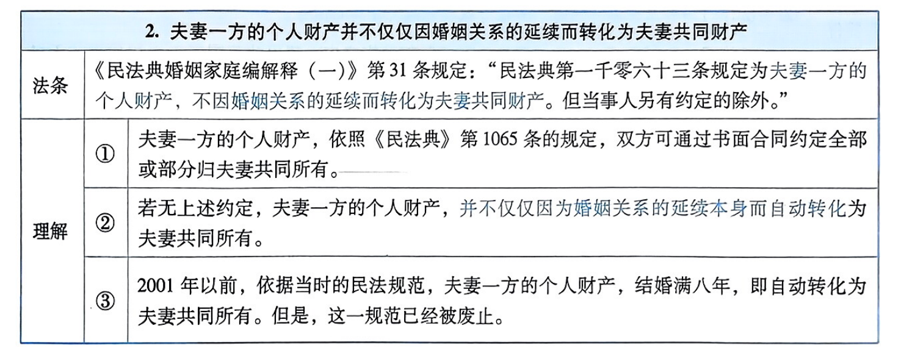

## 家事代理权

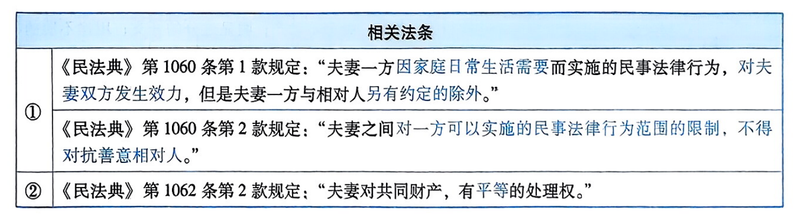

<table>
    <tr>
        <th colspan="3">1.家事代理权的概念与特征</th>
    </tr>
    <tr>
        <td>概念</td>
        <td colspan="2">家事代理权，指因家庭日常生活需要，夫妻一方独立实施的法律行为，基于有效的婚姻关系所生的法定代理权，直接归属于夫妻双方共同承受的代理制度。</td>
    </tr>
    <tr>
        <td rowspan="2">特征</td>
        <td>①</td>
        <td>在性质上，家事代理权属于“法定代理权”；并且夫妻双方平等享有家事代理权。</td>
    </tr>
    <tr>
        <td>②</td>
        <td>夫妻一方实施家事代理行为时，“无须以被代理人的名义”。可以“以自已的名义”，亦可“以夫妻共同的名义”，还可“以家庭的名义”</td>
    </tr>
    <tr>
        <td rowspan="3">要件</td>
        <td>①</td>
        <td>婚姻关系有效。</td>
    </tr>
    <tr>
        <td>②</td>
        <td>法律行为涉及夫妻共同财产的处分或者创设夫妻共同债务。</td>
    </tr>
    <tr>
        <td>③</td>
        <td>该法律行为限于“因家庭日常生活需要”的范围之内；超出此范围属于无权代理或无权处分。</td>
    </tr>
    <tr>
        <td>效果</td>
        <td colspan="2">享有家事代理权的夫妻一方独立实施的法律行为，属于有权代理、直接代理，该法律行为直接归属夫妻共同承受（对夫妻双方发生效力）。</td>
    </tr>
</table>

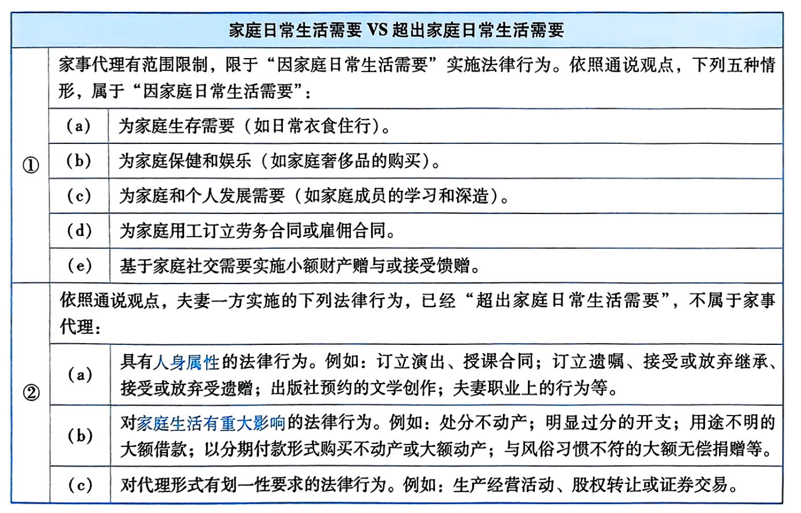

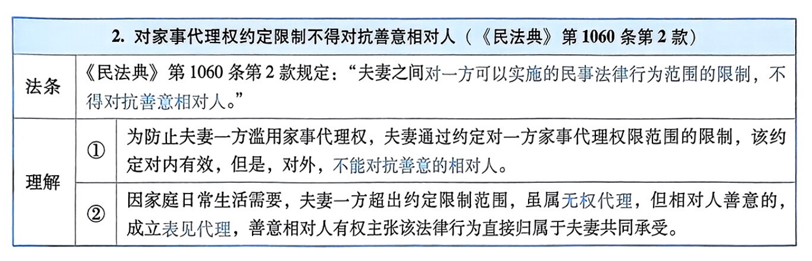

## 离婚时夫妻共同财产的分割规则

### 诉讼离婚时夫妻共同财产的分割规则

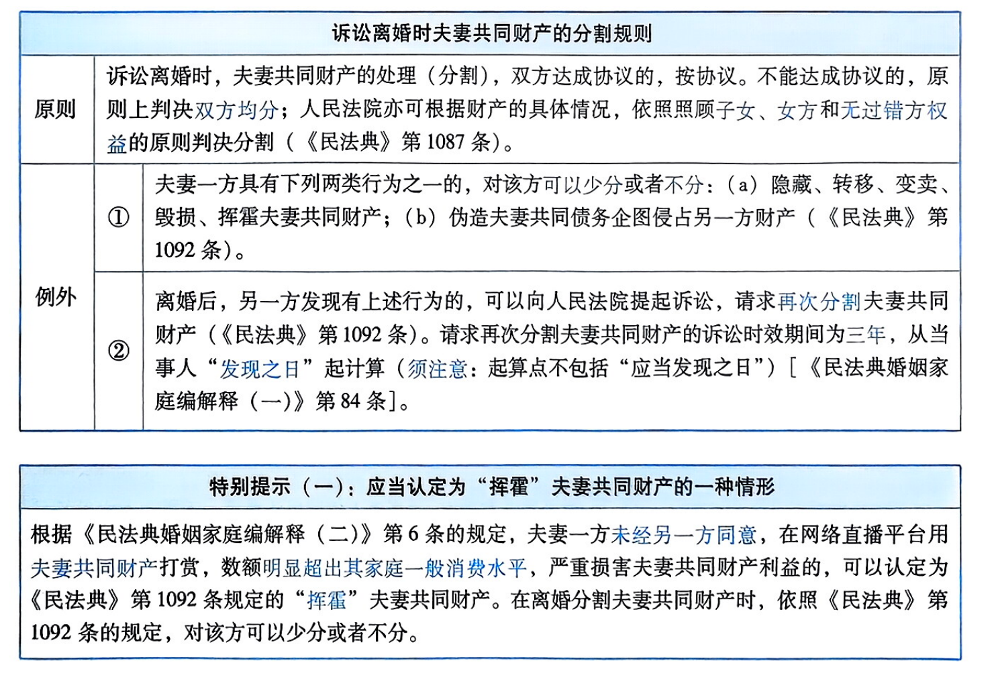

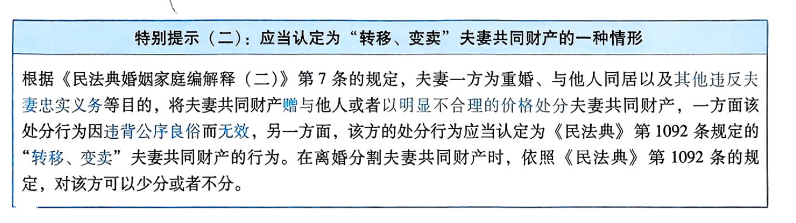

### 离婚后请求“重新”分割夫妻共同财产的两个规则

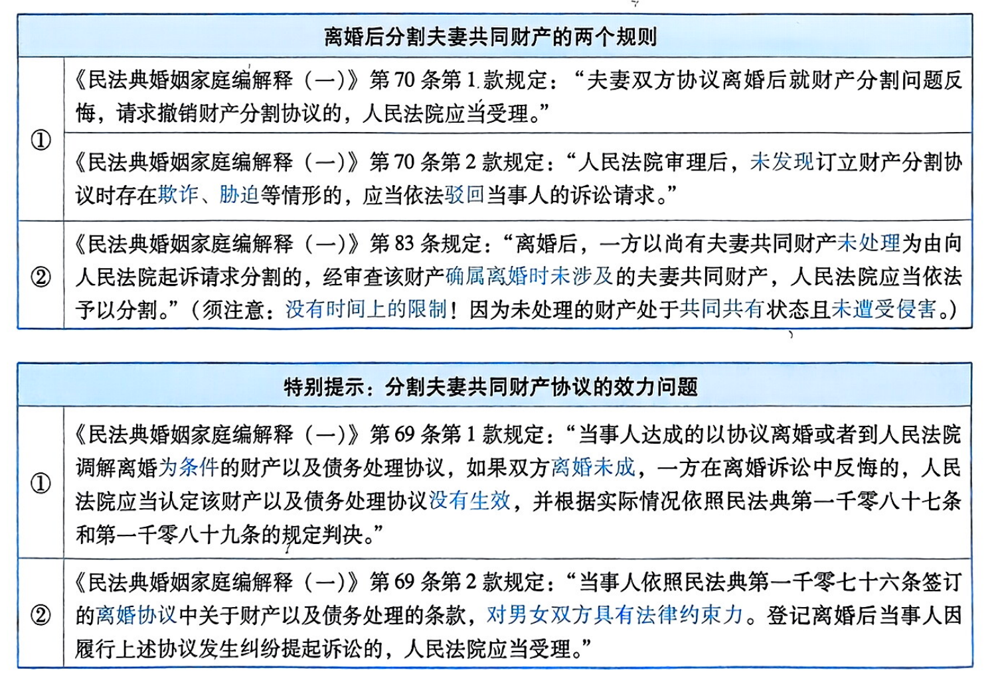

## 不离婚但一方有权请求分割夫妻共同财产的情形

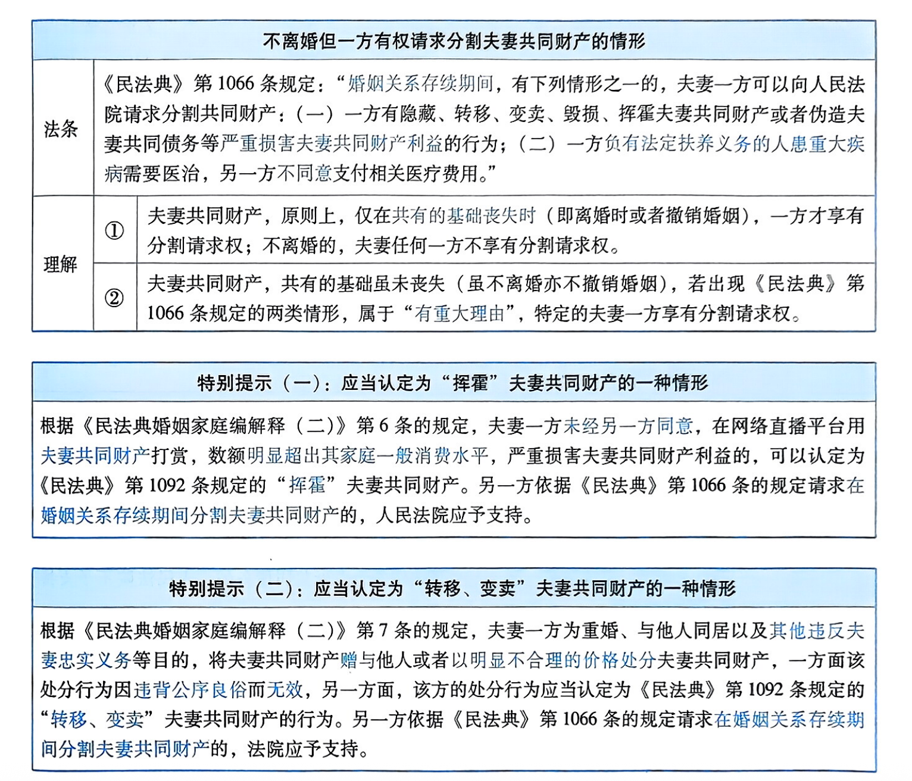

## 夫妻共同债务与夫妻个人债务

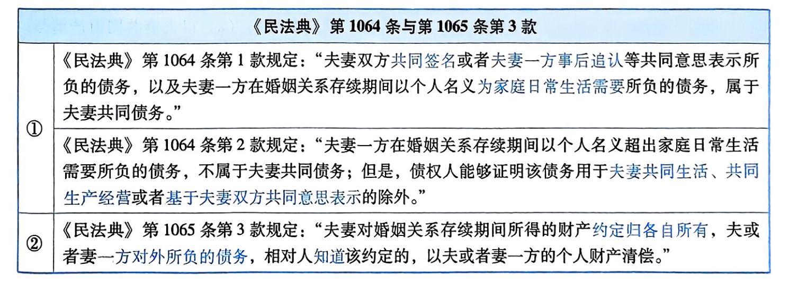

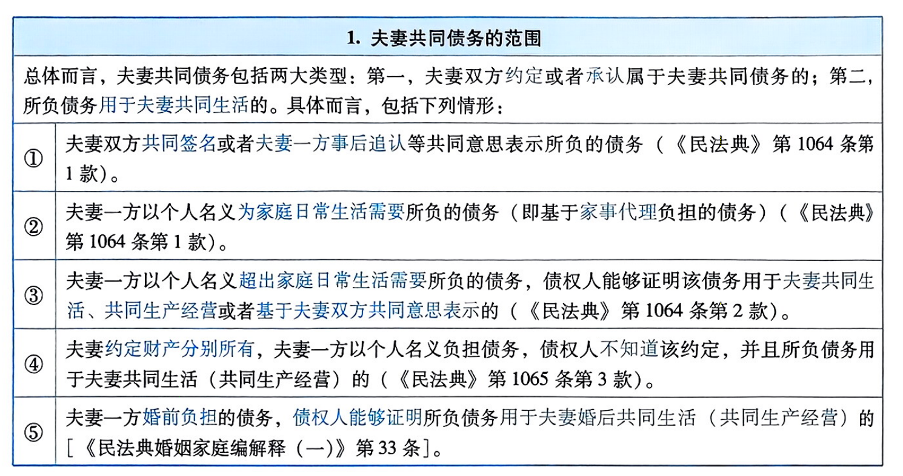

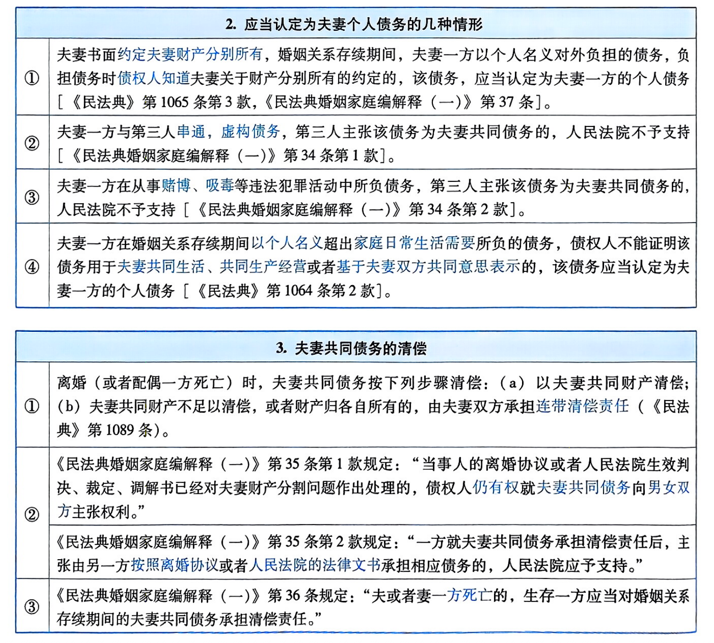

