# 民法婚姻编-结婚与离婚

## 成立“有效婚姻关系”的条件

### 有效婚姻成立的条件

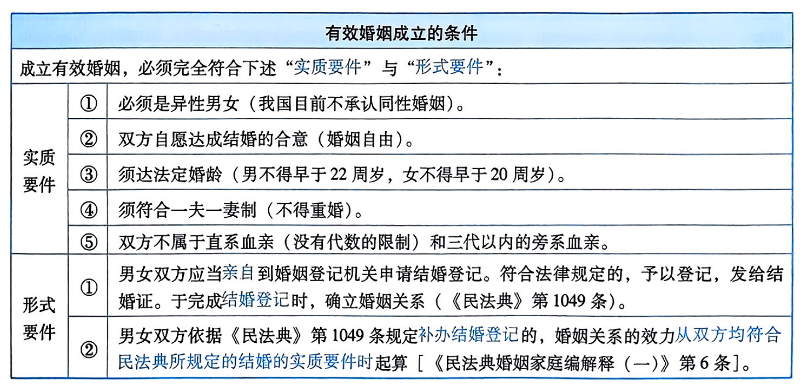

### 事实婚姻与同居关系

<table>
    <tr>
        <th colspan="2">1.事实婚姻【《民法典婚姻家庭编解释（一）》第7条】</th>
    </tr>
    <tr>
        <td colspan="2">“事实婚姻”具有与“登记婚姻”同等的效力。符合下列四个条件的，可认定为事实婚姻：</td>
    </tr>
    <tr>
        <td>①</td>
        <td>以夫妻名义共同生活，具有互为配偶的目的性和共同生活的公开性。</td>
    </tr>
    <tr>
        <td>②</td>
        <td>符合结婚的实质要件。</td>
    </tr>
    <tr>
        <td>③</td>
        <td>未办理结婚登记（欠缺结婚的形式要件）。</td>
    </tr>
    <tr>
        <td>④</td>
        <td>以夫妻名义共同生活的事实发生在1994年2月1日之前（1994年2月1日为《婚姻登记管理条例》颁布实施之日）。</td>
    </tr>
</table>

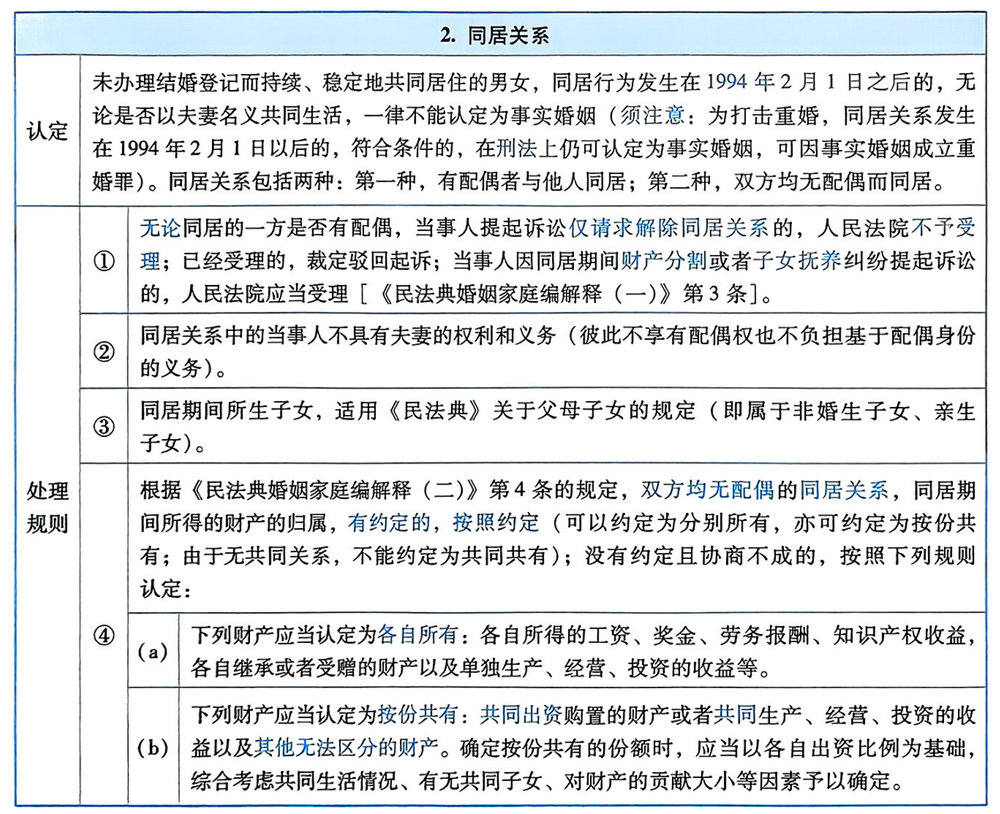

## 无效婚姻（《民法典》第1051条）

<table>
    <tr>
        <th colspan="3">1.婚姻无效的事由（《民法典》第1051条）</th>
    </tr>
    <tr>
        <td rowspan="4">无效事由</td>
        <td colspan="2">根据《民法典》第1051条的规定，已经办理结婚登记的男女，属于以下三种情形之一的，婚姻无效：</td>
    </tr>
    <tr>
        <td>①</td>
        <td>重婚</td>
    </tr>
    <tr>
        <td>②</td>
        <td>有禁止结婚的亲属关系（直系血亲或者三代以内的旁系血亲）。</td>
    </tr>
    <tr>
        <td>③</td>
        <td>未到法定婚龄（男早于22周岁，女早于20周岁）。</td>
    </tr>
    <tr>
        <td rowspan="3">说明</td>
        <td>①</td>
        <td>《民法典》第1051条关于无效婚姻无效事由的规定属“封闭式规定”“穷尽式列举”。该条规定以外的情形，均不属于无效婚姻。</td>
    </tr>
    <tr>
        <td>②</td>
        <td>当事人以《民法典》1051条规定的三种无效婚姻以外的情形请求确认婚姻无效的，人民法院应当判决驳回当事人的诉讼请求【《民法典婚姻家庭编解释（一）》第17条第1款】。</td>
    </tr>
    <tr>
        <td>③</td>
        <td>当事人以结婚登记程序存在瑕疵为由提起民事诉讼，主张撤销结婚登记的，告知其可以依法申请行政复议或者提起行政诉讼【《民法典婚姻家庭编解释（一）》第17条第2款】。</td>
    </tr>
</table>

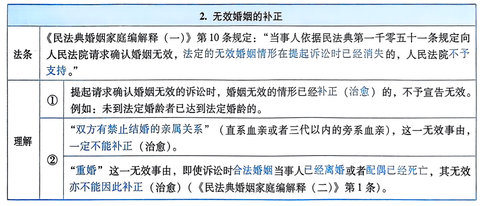

<table>
    <tr>
        <th colspan="3">3.无效婚姻的宣告</th>
    </tr>
    <tr>
        <td>适格原告</td>
        <td colspan="2">须经原告请求确认。适格原告包括：（a）婚姻当事人；（b）利害关系人。“利害关系人”包括：第一，重婚的，为当事人的近亲属及基层组织；第二，未达法定婚龄的，为未到法定婚龄者的近亲属；第三，有禁止结婚的近亲属关系的，为当事人的近亲属【《民法典婚姻家庭编解释（一）》第9条】。</td>
    </tr>
    <tr>
        <td>宣告机关</td>
        <td colspan="2">只能向人民法院请求确认婚姻无效（不得向婚姻登记机关请求确认婚姻无效）。</td>
    </tr>
    <tr>
        <td>时间</td>
        <td colspan="2">《民法典婚姻家庭编解释（一）》第14条规定：“夫妻一方或者双方死亡后，生存一方或者利害关系人依据民法典第一千零五十一条的规定请求确认婚姻无效的，人民法院应当受理。”须注意：无期限上的限制！</td>
    </tr>
    <tr>
        <td rowspan="7">审理规则</td>
        <td rowspan="3">①</td>
        <td>《民法典婚姻家庭编解释（一）》第11条第1款规定：“人民法院受理请求确认婚姻无效案件后，原告申请撤诉的，不予准许。”（理由：涉及公共利益）</td>
    </tr>
    <tr>
        <td>《民法典婚姻家庭编解释（一）》第11条第2款规定：“对婚姻效力的审理不适用调解，应当依法作出判决。”须注意：两审终审；对一审判决不服的，可以上诉。</td>
    </tr>
    <tr>
        <td>《民法典婚姻家庭编解释（一）》第11条第3款规定：“涉及财产分割和子女抚养的，可以调解。调解达成协议的，另行制作调解书；未达成调解协议的，应当一并作出判决。”</td>
    </tr>
    <tr>
        <td>②</td>
        <td>《民法典婚姻家庭编解释（一）》第12条规定：“人民法院受理离婚案件后，经审理确属无效婚姻的，应当将婚姻无效的情形告知当事人，并依法作出确认婚姻无效的判决。”</td>
    </tr>
    <tr>
        <td>③</td>
        <td>《民法典婚姻家庭编解释（一）》第13条规定：“人民法院就同一婚姻关系分别受理了离婚和请求确认婚姻无效案件的，对于离婚案件的审理，应当待请求确认婚姻无效案件作出判决后进行。”</td>
    </tr>
    <tr>
        <td rowspan="2">④</td>
        <td>《民法典婚姻家庭编解释（一）》第15条第1款规定：“利害关系人依据民法典第一千零五十一条的规定，请求人民法院确认婚姻无效的，利害关系人为原告，婚姻关系当事人双方为被告。”</td>
    </tr>
    <tr>
        <td>《民法典婚姻家庭编解释（一）》第15条第2款规定：“夫妻一方死亡的，生存一方为被告。”</td>
    </tr>
</table>

<table>
    <tr>
        <th colspan="2">4.婚姻被宣告无效的法律效果（《民法典》第1054条）</th>
    </tr>
    <tr>
        <td>①</td>
        <td>婚姻自始没有法律约束力（即“自始无效”）。该“自始无效”，是指无效婚姻在依法被确认无效时，才确定该婚姻自始不受法律保护【《民法典婚姻家庭编解释（一）》第20条］。换言之，虽属无效婚姻，若未经法院依法确认婚姻无效，不得径行认定婚姻自始无效。须注意：婚姻无效，并非“当然无效”，而是“宣告无效”。</td>
    </tr>
    <tr>
        <td>②</td>
        <td>当事人不具有夫妻的权利和义务（《民法典》第1054条第1款）。</td>
    </tr>
    <tr>
        <td>③</td>
        <td>当事人所生的子女，适用《民法典》关于父母子女的规定（即属于非婚生子女、亲生子女）（《民法典》第1054条第1款）。</td>
    </tr>
    <tr>
        <td>④</td>
        <td>当事人同居期间所得的财产，除有证据证明为当事人一方所有的以外，按共同共有处理【《民法典婚姻家庭编解释（一）》第22条]。</td>
    </tr>
    <tr>
        <td>⑤</td>
        <td>婚姻被宣告无效的，无过错方有权请求损害赔偿（《民法典》第1054条第2款）。有权主张的损害赔偿范围包括精神损害赔偿与财产损害赔偿。</td>
    </tr>
</table>

## 可撤销婚姻（《民法典》第1052条与第1053条）

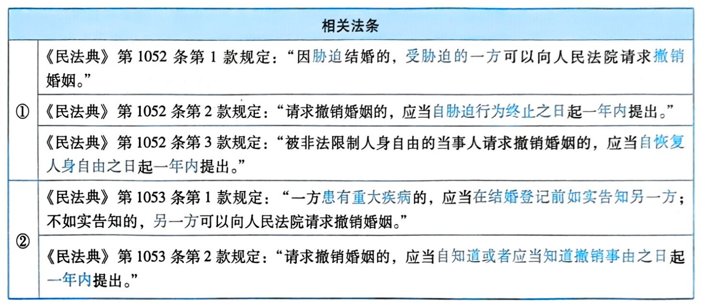

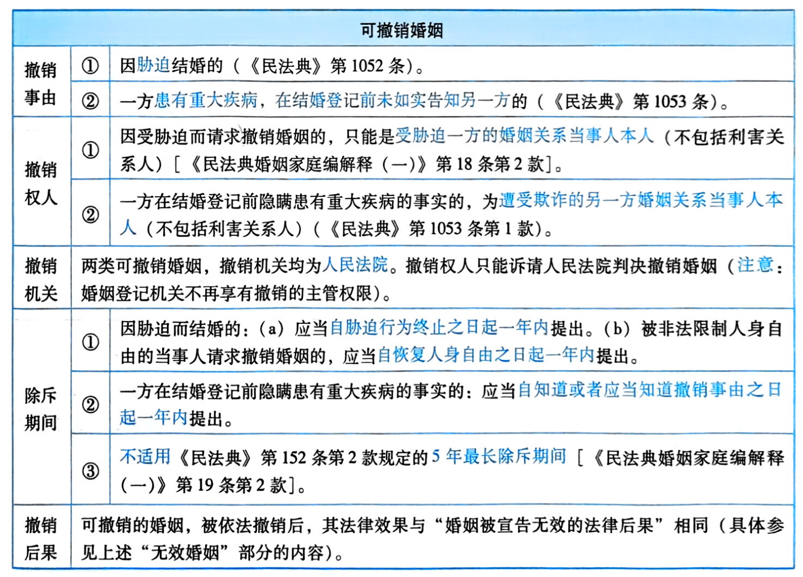

## 离婚

### 协议离婚

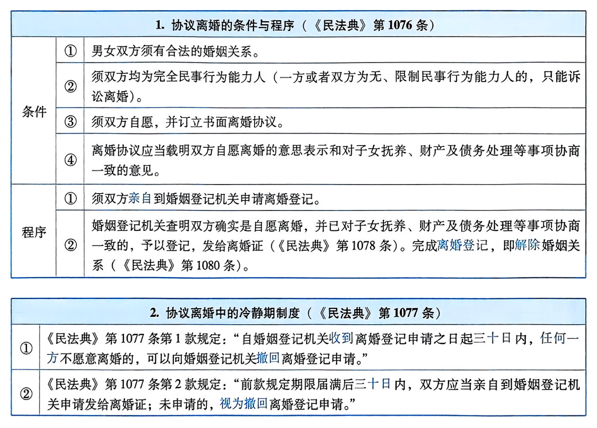

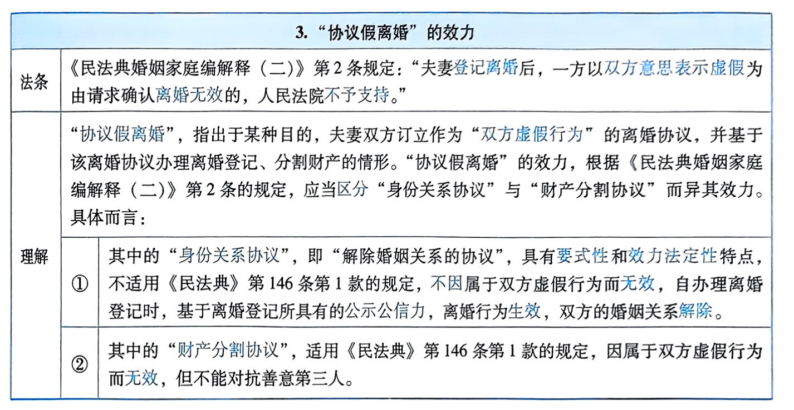

### 诉讼离婚（《民法典》第1079条至第1082条）

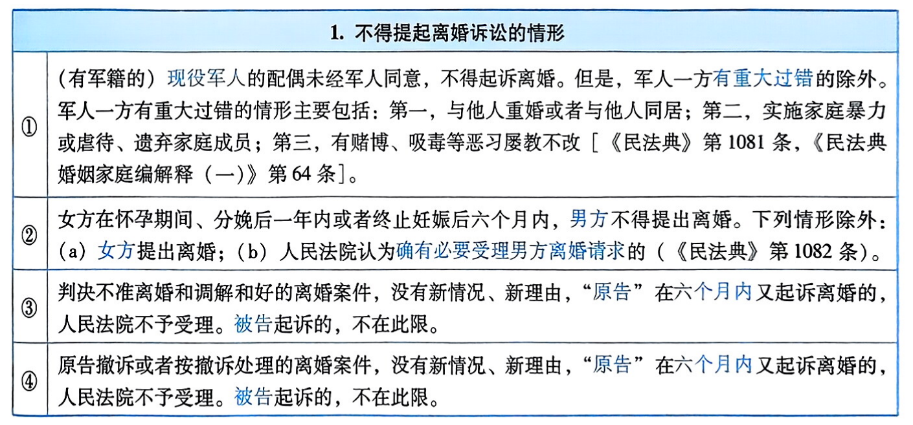

<table>
    <tr>
        <th colspan="3">2.判决离婚的法定条件（《民法典》第1079条）</th>
    </tr>
    <tr>
        <td>①</td>
        <td colspan="2">须经调解（调解为法定前置程序）。《民法典》第1079条第2款规定，人民法院审理离婚案件，应当进行调解。</td>
    </tr>
    <tr>
        <td>②</td>
        <td colspan="2">以“感情确已破裂”作为判决离婚的法定条件。《民法典》第1079条第2款规定，如果感情确已破裂，调解无效的，应当准予离婚。离婚判决书生效或者离婚调解书生效时，即解除婚姻关系《民法典》第1080条）。</td>
    </tr>
    <tr>
        <td rowspan="6">③</td>
        <td colspan="2">《民法典》第1079条第3款规定，有下列情形之一，调解无效的，应当准予离婚：</td>
    </tr>
    <tr>
        <td>（a）</td>
        <td>重婚或者与他人同居；</td>
    </tr>
    <tr>
        <td>（b）</td>
        <td>实施家庭暴力或者虐待、遗弃家庭成员；</td>
    </tr>
    <tr>
        <td>（c）</td>
        <td>有赌博、吸毒等恶习屡教不改；</td>
    </tr>
    <tr>
        <td>（d）</td>
        <td>因感情不和分居满2年；</td>
    </tr>
    <tr>
        <td>（e）</td>
        <td>其他导致夫妻感情破裂的情形。</td>
    </tr>
    <tr>
        <td>④</td>
        <td colspan="2">《民法典》第1079条第4款规定：“一方被宣告失踪，另一方提起离婚诉讼的，应当准予离婚。”</td>
    </tr>
    <tr>
        <td>⑤</td>
        <td colspan="2">《民法典》第1079条第5款规定：“经人民法院判决不准离婚后，双方又分居满一年，一方再次提起离婚诉讼的，应当准予离婚。”</td>
    </tr>
</table>

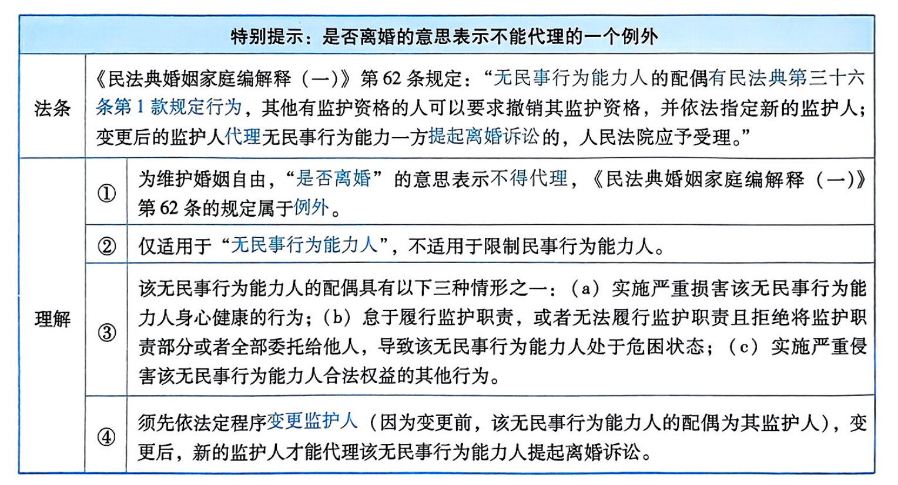

<table>
    <tr>
        <th colspan="2">3.离婚后未成年子女的抚养</th>
    </tr>
    <tr>
        <td rowspan="3">①</td>
        <td>《民法典》第1084条第1款规定：“父母与子女间的关系，不因父母离婚而消除。离婚后，子女无论由父或者母直接抚养，仍是父母双方的子女。”</td>
    </tr>
    <tr>
        <td>《民法典》第1084条第2款规定：“离婚后，父母对于子女仍有抚养、教育、保护的权利和义务。”</td>
    </tr>
    <tr>
        <td>《民法典》第1084条第3款规定：“离婚后，不满两周岁的子女，以由母亲直接抚养为原则。已满两周岁的子女，父母双方对抚养问题协议不成的，由人民法院根据双方的具体情况，按照最有利于未成年子女的原则判决。子女已满八周岁的，应当尊重其真实意愿。”</td>
    </tr>
    <tr>
        <td>②</td>
        <td>《民法典婚姻家庭编解释（一）》第44条规定：“离婚案件涉及未成年子女抚养的，对不满两周岁的子女，按照民法典第一千零八十四条第三款规定的原则处理。母亲有下列情形之一，父亲请求直接抚养的，人民法院应予支持：（一）患有久治不愈的传染性疾病或者其他严重疾病，子女不宜与其共同生活；（二）有抚养条件不尽抚养义务，而父亲要求子女随其生活；（三）因其他原因，子女确不宜随母亲生活。”</td>
    </tr>
    <tr>
        <td>③</td>
        <td>《民法典婚姻家庭编解释（一）》第45条规定：“父母双方协议不满两周岁的子女由父亲直接抚养，并对子女健康成长无不利影响的，人民法院应予支持。”</td>
    </tr>
    <tr>
        <td>④</td>
        <td>《民法典婚姻家庭编解释（一）》第48条规定：“在有利于保护子女利益的前提下，父母双方协议轮流直接抚养子女的，人民法院应予支持。”</td>
    </tr>
    <tr>
        <td>⑤</td>
        <td>《民法典婚姻家庭编解释（二）》第14条规定：“离婚诉讼中，父母均要求直接抚养已满两周岁的未成年子女，一方有下列情形之一的，人民法院应当按照最有利于未成年子女的原则，优先考虑由另一方直接抚养：（一）实施家庭暴力或者虐待、遗弃家庭成员；（二）有赌博、吸毒等恶习；（三）重婚、与他人同居或者其他严重违反夫妻忠实义务情形；（四）抢夺、藏匿未成年子女且另一方不存在本条第一项或者第二项等严重侵害未成年子女合法权益情形；（五）其他不利于未成年子女身心健康的情形。”</td>
    </tr>
</table>

### 离婚协议约定将部分或者全部夫妻共同财产给予子女时的若干规则【《民法典婚姻家庭编解释（二）》第20条】

<table>
    <tr>
        <th colspan="3">离婚协议约定将部分或者全部夫妻共同财产给予子女时的若干规则</th>
    </tr>
    <tr>
        <td rowspan="4">法条</td>
        <td>①</td>
        <td>《民法典婚姻家庭编解释（二）》第20条第1款规定：“离婚协议约定将部分或者全部夫妻共同财产给予子女，离婚后，一方在财产权利转移之前请求撤销该约定的，人民法院不予支持，但另一方同意的除外。”</td>
    </tr>
    <tr>
        <td>②</td>
        <td>《民法典婚姻家庭编解释（二)》第20条第2款规定：“一方不履行前款离婚协议约定的义务，另一方请求其承担继续履行或者因无法履行而赔偿损失等民事责任的，人民法院依法予以支持。”</td>
    </tr>
    <tr>
        <td>③</td>
        <td>《民法典婚姻家庭编解释（二）》第20条第3款规定：“双方在离婚协议中明确约定子女可以就本条第一款中的相关财产直接主张权利，一方不履行离婚协议约定的义务，子女请求参照适用民法典第五百二十二条第二款规定，由该方承担继续履行或者因无法履行而赔偿损失等民事责任的，人民法院依法予以支持。”</td>
    </tr>
    <tr>
        <td>④</td>
        <td>《民法典婚姻家庭编解释（二）》第20条第4款规定：“离婚协议约定将部分或者全部夫妻共同财产给予子女，离婚后，一方有证据证明签订离婚协议时存在欺诈、胁迫等情形，请求撤销该约定的，人民法院依法予以支持；当事人同时请求分割该部分夫妻共同财产的，人民法院依照民法典第一千零八十七条规定处理。”</td>
    </tr>
    <tr>
        <td rowspan="4">理解</td>
        <td>①</td>
        <td>无论“登记离婚协议”，还是“诉讼离婚协议”，均具有整体性，其标的具有不可分性，在离婚协议中双方将共同财产给予未成年子女的约定与解除婚姻关系、子女抚养、共同财产分割、共同债务清偿、离婚损害赔偿等内容构成了一个有机整体，离婚协议中财产给予子女的约定不具有无偿性，不属于无偿赠与合同。因此：（a）夫妻任何一方均不享有《民法典》第658条规定的赠与人任意撤销权。（b）双方一致同意撤销约定给予子女的财产的，属于“协商变更”离婚协议财产给予条款。</td>
    </tr>
    <tr>
        <td>②</td>
        <td>约定将部分或者全部夫妻共同财产给予子女的离婚协议成立生效后，一方不履行离婚协议约定的义务的，另一方有权请求其承担继续履行或者因无法履行而赔偿损失等民事责任。</td>
    </tr>
    <tr>
        <td>③</td>
        <td>约定将部分或者全部夫妻共同财产给予子女的离婚协议成立生效，并且双方在离婚协议中明确约定子女可以就约定给予子女的财产直接主张权利的，则该离婚协议财产给予条款属于《民法典》第522条规定的“纯正的利益第三人合同”，子女享有履行请求权，一方不履行离婚协议约定的义务时，子女有权请求其实际履行或者承担因无法履行而赔偿损失的责任。</td>
    </tr>
    <tr>
        <td>④</td>
        <td>离婚后，一方有证据证明离婚协议财产给予条款存在欺诈、胁迫等情形，可撤销将夫妻共同财产给予子女的约定部分；撤销后，约定给予子女的财产作为夫妻共同财产按照《民法典》第1087条的规定予以分割。</td>
    </tr>
</table>

### 离婚后父母给付抚养费义务的履行与变更【《民法典》第1085条；《民法典婚姻家庭编解释（二）》第16条与第17条】

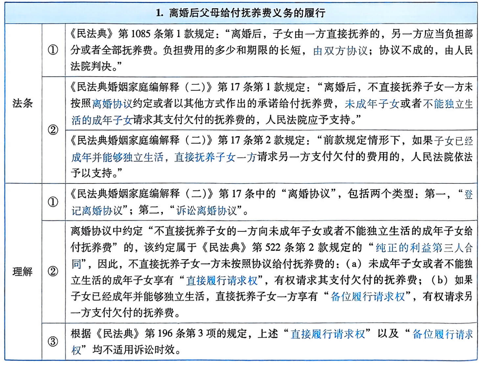

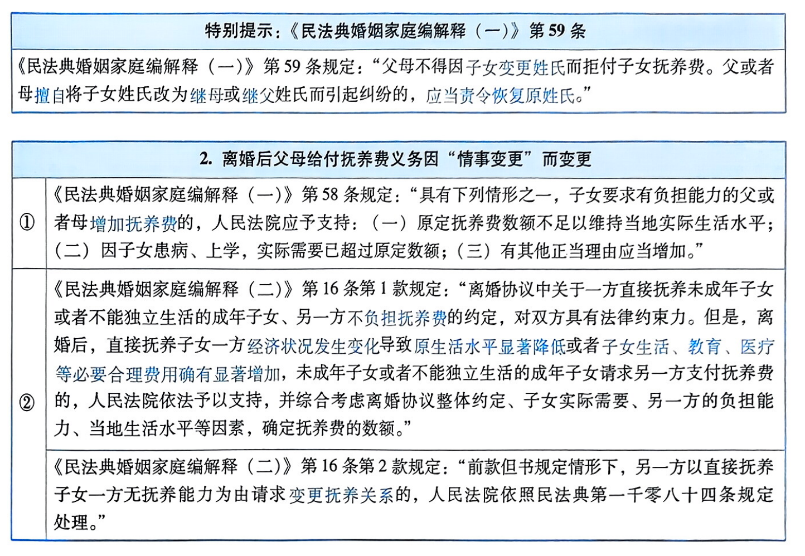

### 离婚后不直接抚养子女的父亲或者父母的探望权【《民法典》第1086条；《民法典婚姻家庭编解释（一）》第65条至第68条】

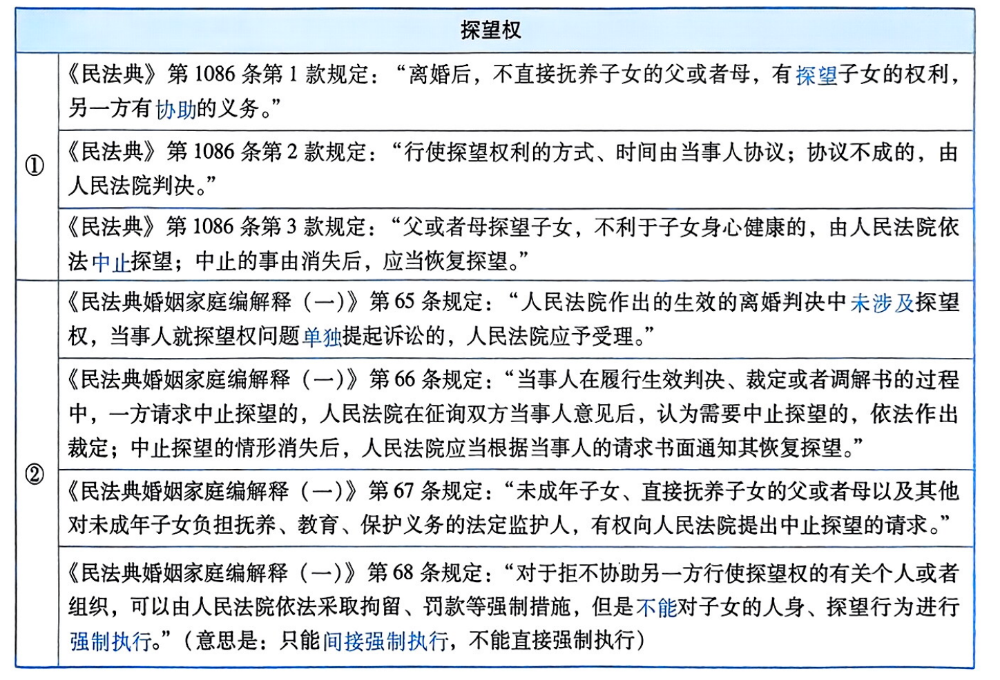

### 婚姻关系存续期间以及离婚后抢夺、藏匿未成年子女的救济【《民法典婚姻家庭编解释（二）》第12条与第13条】

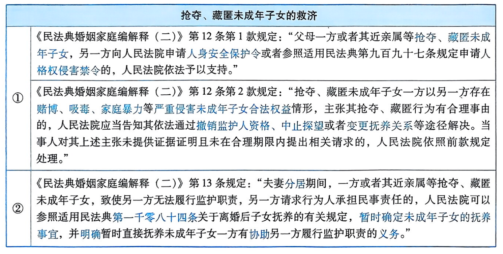

## 离婚损害赔偿请求权（《民法典》第1091条）

<table>
    <tr>
        <th colspan="3">1.享有离婚损害赔偿请求权的条件</th>
    </tr>
    <tr>
        <td>①</td>
        <td colspan="2">须以离婚（协议离婚或者诉讼离婚）为前提。（a）法院判决不准离婚的案件，一方提出损害赔偿请求的，不予支持。（b）婚姻关系存续期间，当事人不起诉离婚，单独依据《民法典》第1091条提起损害赔偿请求的，不予受理【《民法典婚姻家庭编解释（一）》第87条第2款与第3款]。</td>
    </tr>
    <tr>
        <td rowspan="6">②</td>
        <td colspan="2">限于法定情形。《民法典》第1091条规定，有下列五种情形之一，导致离婚的，无过错方有权主张离婚损害赔偿请求权：</td>
    </tr>
    <tr>
        <td>（a）</td>
        <td>重婚</td>
    </tr>
    <tr>
        <td>（b）</td>
        <td>与他人同居</td>
    </tr>
    <tr>
        <td>（c）</td>
        <td>实施家庭暴力；</td>
    </tr>
    <tr>
        <td>（d）</td>
        <td>虐待、遗弃家庭成员；</td>
    </tr>
    <tr>
        <td>（e）</td>
        <td>有其他重大过错。</td>
    </tr>
</table>

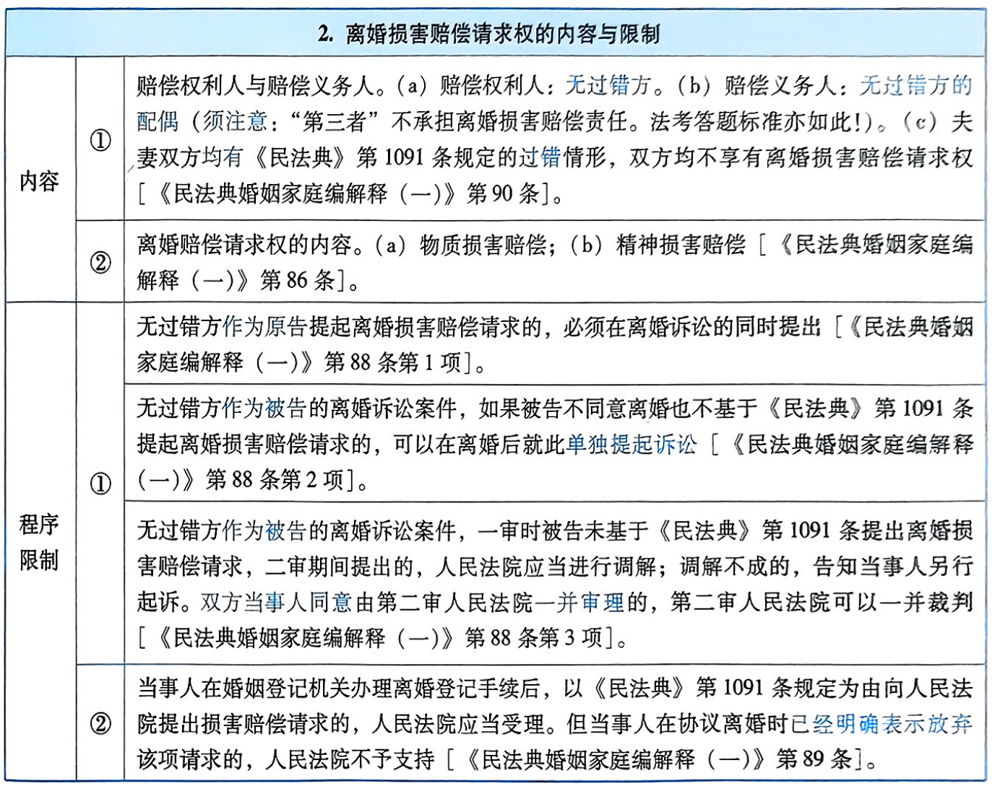

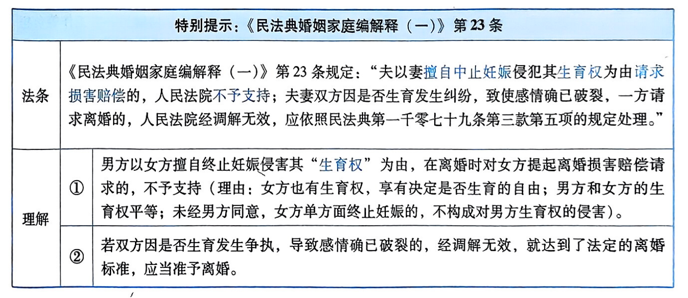

## 离婚时一方的扶助义务（又称“离婚时一方的经济帮助义务”）（《民法典》第1090条）

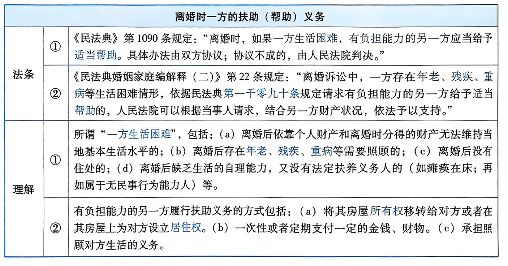

## 离婚时一方的法定补偿义务（《民法典》第1088条）

<table>
    <tr>
        <th colspan="3">离婚时一方的法定补偿义务</th>
    </tr>
    <tr>
        <td rowspan="2">法条</td>
        <td>①</td>
        <td>《民法典》第1088条规定：“夫妻一方因抚育子女、照料老年人、协助另一方工作等负担较多义务的，离婚时有权向另一方请求补偿，另一方应当给予补偿。具体办法由双方协议；协议不成的，由人民法院判决。”</td>
    </tr>
    <tr>
        <td>②</td>
        <td>《民法典婚姻家庭编解释（二)》第21条规定：“离婚诉讼中，夫妻一方有证据证明在婚姻关系存续期间因抚育子女、照料老年人、协助另一方工作等负担较多义务，依据民法典第一千零八十八条规定请求另一方给予补偿的，人民法院可以综合考虑负担相应义务投人的时间、精力和对双方的影响以及给付方负担能力、当地居民人均可支配收人等因素，确定补偿数额。”</td>
    </tr>
    <tr>
        <td rowspan="3">理解</td>
        <td>①</td>
        <td>在依照《民法典》第1087条的规定分割夫妻共同财产的基础上，《民法典》第1088条规定的“离婚时一方的法定补偿义务”，是一个“独立”的请求权。</td>
    </tr>
    <tr>
        <td>②</td>
        <td>离婚时，一方对对方享有法定补偿请求权须符合两个条件：（a）以离婚（协议离婚或者诉讼离婚）为前提；（b）请求权人因抚育子女、照料老年人、协助另一方工作等负担较多义务。</td>
    </tr>
    <tr>
        <td>③</td>
        <td>关于“离婚时一方的法定补偿义务”，原《婚姻法》第40条将其适用范围限定于“夫妻约定财产分别所有制的情形”，但是，《民法典》第1088条扩大了其适用范围，不限于夫妻约定财产分别所有制的情形，也适用于夫妻法定财产制的情形。</td>
    </tr>
</table>

