# 民法继承编

## 继承开始的时间

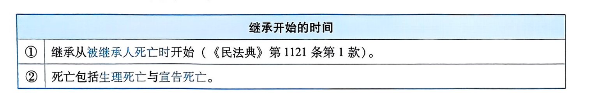

## 遗产的范围

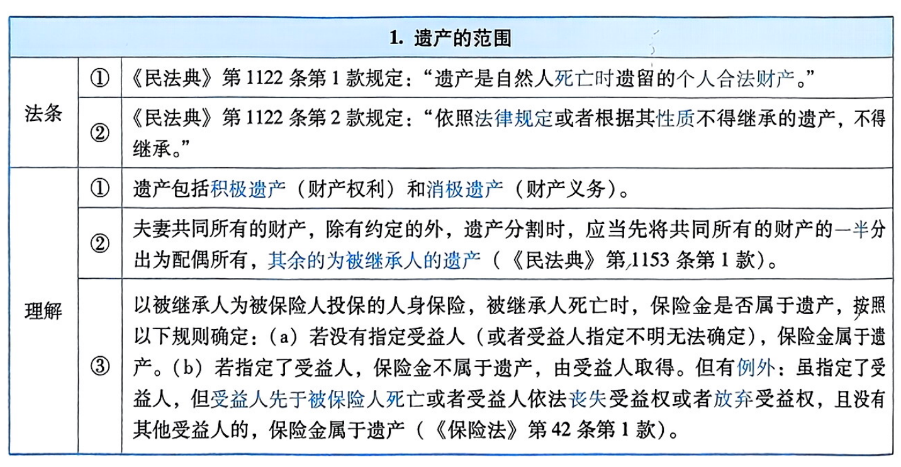

<table>
    <tr>
        <th colspan="2">2．下列权利（义务），不属于遗产</th>
    </tr>
    <tr>
        <td>①</td>
        <td>被继承人享有的人格权、身份权（有例外：著作权中的发表权可以继承）。</td>
    </tr>
    <tr>
        <td>②</td>
        <td>被继承人死亡后，其亲属应得的死亡赔偿金、抚恤金。</td>
    </tr>
    <tr>
        <td>③</td>
        <td>“承包收益”可以作为遗产，但是，被继承人享有的土地承包经营权不属于遗产 
        原因有二： 第一，承包以“农户”为承包人； 第二，以集体土地所有权为基础的土地承包经营权具有“成员权”的性质。 但有两个例外： （a）对林地的土地承包经营权，可以作为遗产继承 （《农村土地承包法》第32条第2款） （b）通过招标、拍卖、公开协商等方式取得的对“四荒地”的土地经营权，可以作为遗产继承 （《农村土地承包法》第54条）。</td>
    </tr>
    <tr>
        <td>④</td>
        <td>被继承人享有的国有、集体自然资源用益物权。</td>
    </tr>
    <tr>
        <td>⑤</td>
        <td>被继承人享有的自留地、自留山、宅基地使用权。</td>
    </tr>
</table>

::: tip
能够取得土地承包经营权，有身份上的限制，仅限于户口在发包的集体经济组织的农民 
承包人他是以户为单位作为承包人承包的，这一户当中的某一个人死亡，那么这一户享有的土地承包经营权，显然不是死者的遗产,如果这一户的所有的人都死亡的，发包给这一户的农用地，应当收回集体经济组织，用于调整其他缺地的农户
:::

::: tip
宅基地使用权,不能作为遗产继承，上面的房屋可以作为遗产来继承，根据地随房走，房屋占用范围内的宅基地使用权，当然也有继承，通过继承房屋的所有权而一并取得
:::

## 继承权的取得与丧失

### 继承权的取得

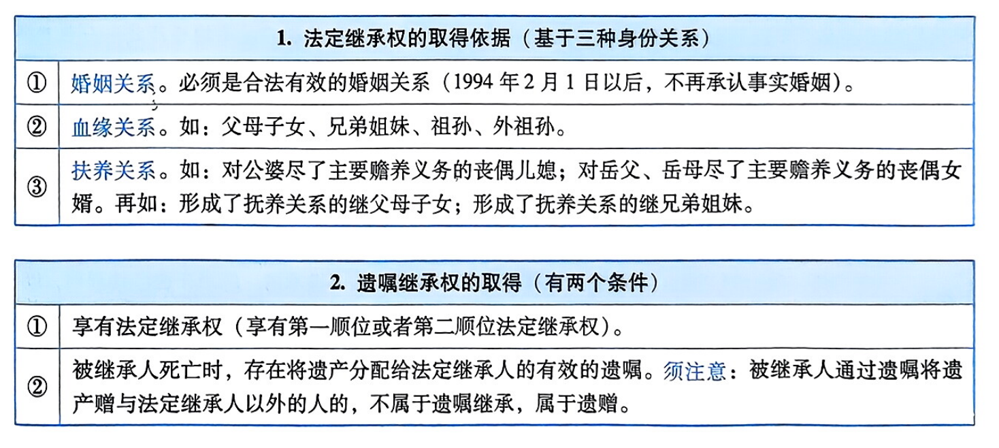

### 继承权（受遗赠权）的丧失

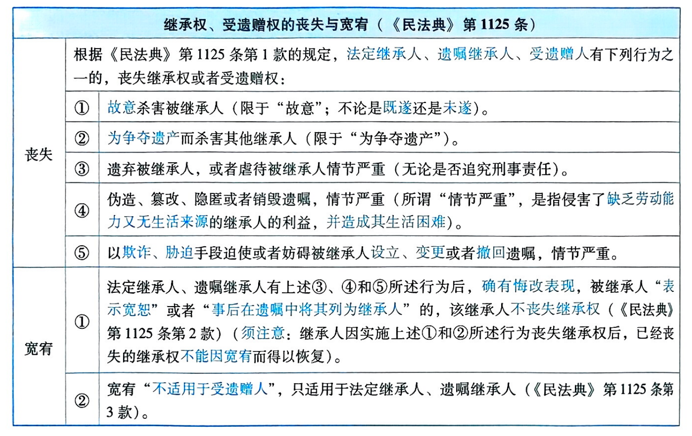

##  继承权、受遗赠权的放弃

<table>
    <tr>
        <th colspan="3">1.继承权的放弃（《民法典》第1124条第1款）</th>        
    </tr>
    <tr>
        <td>法条</td>        
        <td colspan="2">《民法典》第1124条第1款规定：“继承开始后，继承人放弃继承的，应当在遗产处理前，以书面形式作出放弃继承的表示；没有表示的，视为接受继承。</td>        
    </tr>
    <tr>
        <td>时间</td>
        <td colspan="2">继承人放弃继承权的意思表示，应当在继承开始后，遗产分割前作出 【《民法典》第1124条第1款，《民法典继承编解释（一）》第35条】。</td>
    </tr>
    <tr>
        <td rowspan="3">方式</td>
        <td>①</td>
        <td>原则上，应以书面形式向遗产管理人或者其他继承人表示 【《民法典继承编解释（一）》第33条】。</td>
    </tr>
    <tr>
        <td>②</td>
        <td>在诉讼中，继承人向人民法院以口头方式表示放弃继承的，要制作笔录，由放弃继承的人签名 【《民法典继承编解释（一）》第34条】。</td>
    </tr>
    <tr>
        <td>③</td>
        <td>继承开始后，遗产处理前，继承人没有表示的（“单纯沉默”），视为接受继承 （《民法典》第1124条第1款）。 换言之，继承人不能以“单纯沉默”的方式放弃继承权。</td>
    </tr>
    <tr>
        <td>限制</td>
        <td colspan="20">继承人因放弃继承权，致其不能履行法定义务的，放弃继承权的行为无效 【《民法典继承编解释（一）》第32条】。 须注意：下面“特别提示”所述的《民法典婚姻家庭编解释（二)》第11条的规定。</td>
    </tr>
    <tr>
        <td>效力</td>
        <td colspan="20">《民法典继承编解释（一）》第37条规定：“放弃继承的效力，追溯到继承开始的时间。” 据此，放弃继承权具有溯及力，溯及到继承开始时（被继承人死亡时），继承人自始不享有继承权。</td>
    </tr>
    <tr>
        <td rowspan="2">撤回</td>
        <td>①</td>
        <td>遗产处理前或者在诉讼进行中，继承人对放弃继承反悔的，由人民法院根据其提出的具体理由，决定是否承认 【《民法典继承编解释（一）》第36条第1分句】。</td>
    </tr>
    <tr>
        <td>②</td>
        <td>遗产处理后，继承人对放弃继承反悔的，不予承认 【《民法典继承编解释（一）》第36条第2分句】。</td>
    </tr>
</table>

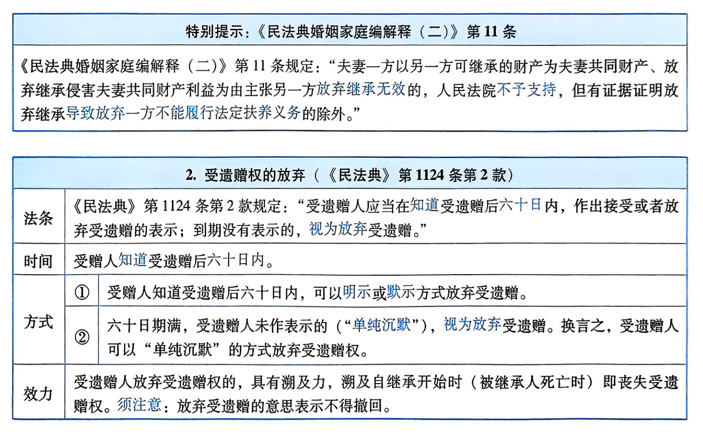

## 继承方式与被继承人生前所负债务的承担

### 继承方式（遗产分割顺序）

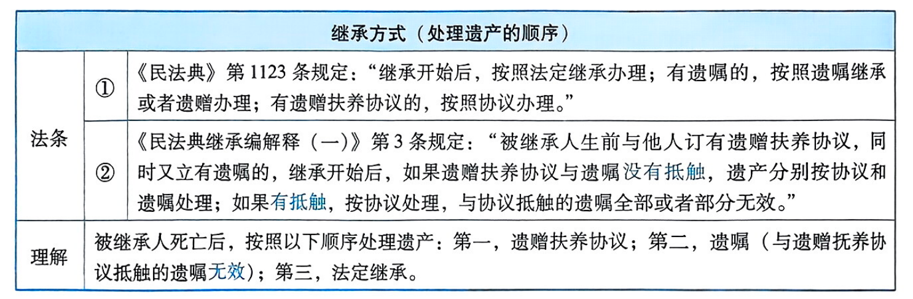

### 应按法定继承处理的五种情形

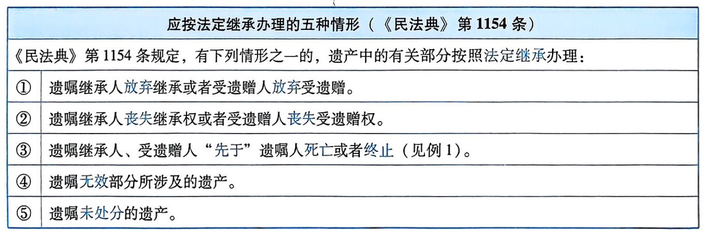

::: tip
第三条的真意是，代位继承仅适用于法定继承，遗嘱继承不适用代位继承。
:::

### “概括继承”规则与“限定继承”规则

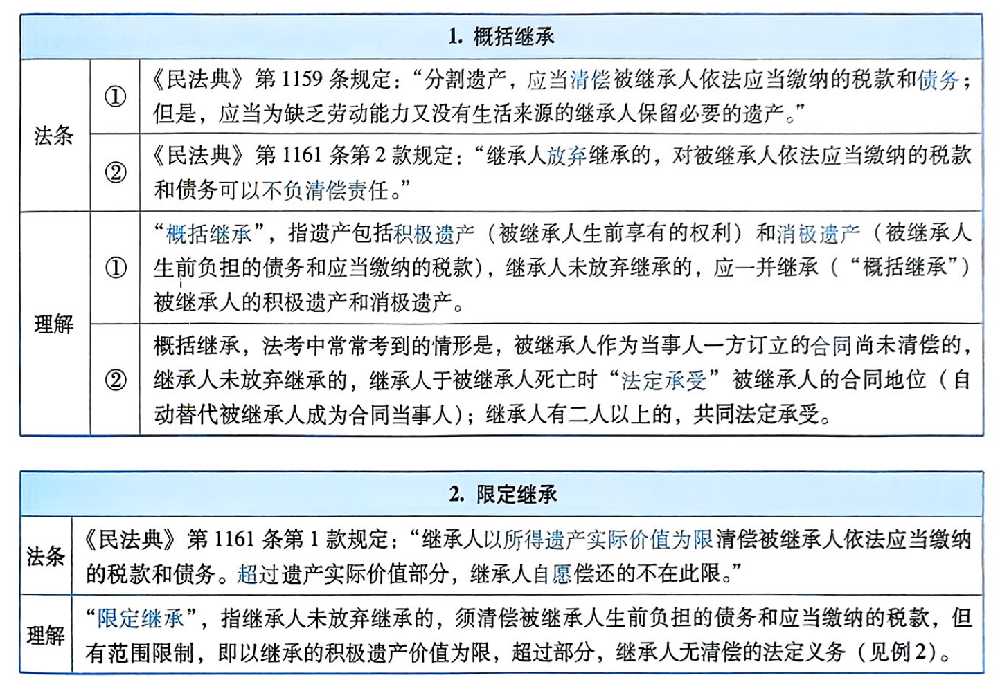

### 分割遗产时被继承人生前所负债务的清偿规则

<table>
    <tr>
        <th colspan="3">分割遗产时被继承人生前所负债务的清偿规则</th>
    </tr>
    <tr>
        <td rowspan="3">法条</td>
        <td>①</td>
        <td>《民法典》第1159条规定：“分割遗产，应当清偿被继承人依法应当缴纳的税款和债务；但是，应当为缺乏劳动能力又没有生活来源的继承人保留必要的遗产。”</td>
    </tr>
    <tr>
        <td>②</td>
        <td>《民法典》第1162条规定：“执行遗赠不得妨碍清偿遗赠人依法应当缴纳的税款和债务。”</td>
    </tr>
    <tr>
        <td>③</td>
        <td>《民法典》第1163条规定：“既有法定继承又有遗嘱继承、遗赠的，由法定继承人清偿被继承人依法应当缴纳的税款和债务；超过法定继承遗产实际价值部分，由遗嘱继承人和受遗赠人按比例以所得遗产清偿。</td>
    </tr>
    <tr>
        <td rowspan="3">理解</td>
        <td>①</td>
        <td>“特留份优先”，在为缺乏劳动能力又没有生活来源的法定继承人保留特留份之后，剩余的财产，才用于清偿被继承人生前负担的债务。</td>
    </tr>
    <tr>
        <td>②</td>
        <td>“第一顺位清偿义务人”。既有法定继承又有遗嘱继承、遗赠的，由法定继承人清偿。 （a）对外，法定继承人以继承的遗产数额为限（受“限定继承”保护）承担连带责任（连带责任的理由：全部法定继承人属于“债务人共同体”，对遗产成立“共同共有”) （b）对内，法定继承人以继承的遗产数额比例分摊。</td>
    </tr>
    <tr>
        <td>③</td>
        <td>“第二顺位清偿义务人”。超过法定继承遗产实际价值的部分，由遗瞩继承人和受遗赠人按比例以所得遗产清偿（即承担“按份清偿责任”）。</td>
    </tr>
</table>

## 遗赠扶养协议

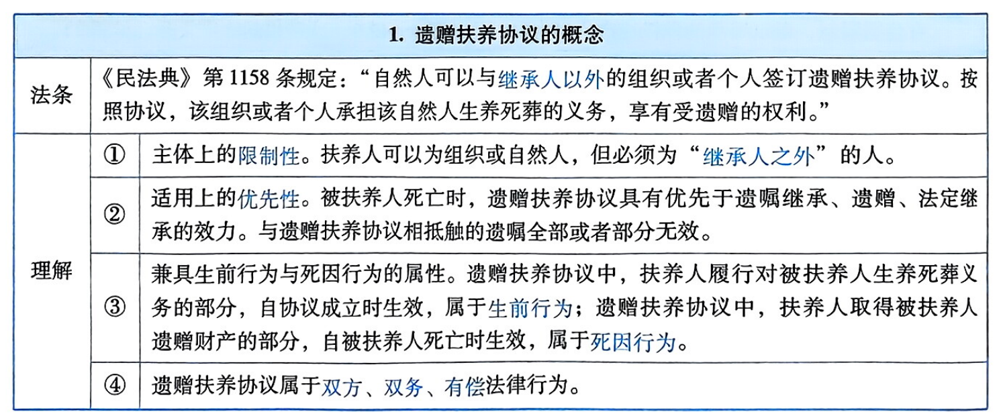

::: tip
扶养人不能是被扶养人的法定继承人
:::

<table>
    <tr>
        <th colspan="3">2.遗赠扶养协议的效力</th>
    </tr>
    <tr>
        <td rowspan="2">权利义务</td>
        <td>①</td>
        <td>扶养人负有对被扶养人生前扶养、死后丧葬的义务。</td>
    </tr>
    <tr>
        <td>②</td>
        <td>扶养人享有于被扶养人死亡时按照协议取得遗赠财产的权利。</td>
    </tr>
    <tr>
        <td rowspan="2">违约救济</td>
        <td>①</td>
        <td>继承人以外的组织或者个人与自然人签订遗赠扶养协议后，无正当理由不履行，导致协议解除的，不能享有受遗赠的权利，其支付的供养费用一般不予补偿 【《民法典继承编解释（一）》第40条第1分句】。</td>
    </tr>
    <tr>
        <td>②</td>
        <td>遗赠人无正当理由不履行，导致协议解除的，则应当偿还继承人以外的组织或者个人已支付的供养费用 【《民法典继承编解释（一）》第40条第2分句】。</td>
    </tr>
</table>

## 遗嘱继承

### 遗嘱的形式

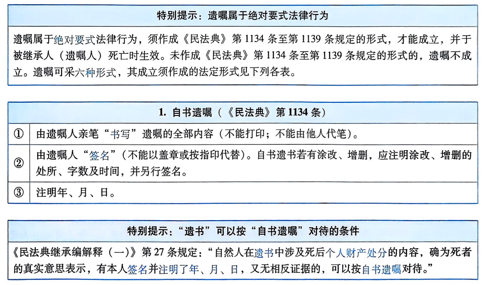

<table>
    <tr>
        <th colspan="2">2.代书遗嘱（《民法典》第1135条）</th>
    </tr>
    <tr>
        <td>①</td>
        <td>有两个以上无利害关系的见证人在场见证。</td>
    </tr>
    <tr>
        <td>②</td>
        <td>由遗嘱人口述遗瞩内容，由一名见证人代书记录。</td>
    </tr>
    <tr>
        <td>③</td>
        <td>经向遗嘱人宣读、讲解，遗嘱人确认无误后，由遗嘱人签名（遗嘱人不能签名的，可以按指印代替）并注明年、月、日；由代书人、见证人签名并注明年、月、日。</td>
    </tr>
</table>

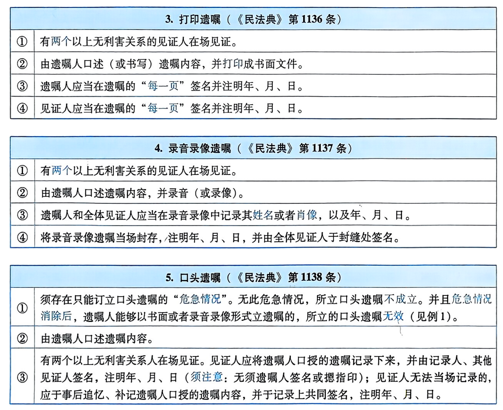

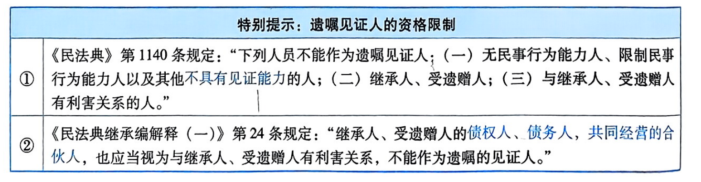

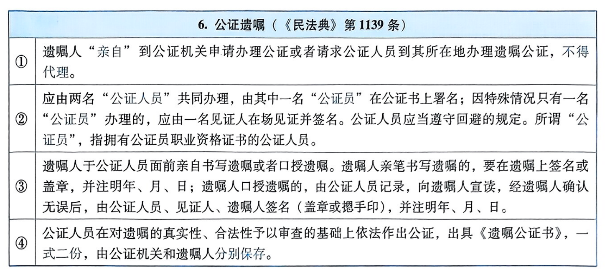

### 遗嘱的生效

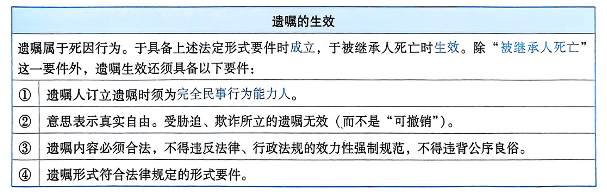

### 遗嘱无效的事由

<table>
    <tr>
        <th colspan="2">遗嘱无效的事由（《民法典》第1143条）</th>
    </tr>
    <tr>
        <td colspan="2">被继承人死亡时，已经成立的遗瞩具有以下情形之一的，遗嘱全部或者部分无效，无效遗瞩处分的遗产部分按法定继承办理（无效遗嘱处分他人财产的除外）：</td>
    </tr>
    <tr>
        <td>①</td>
        <td>遗嘱人“订立遗嘱时”为无、限制民事行为能力人的，所立的遗嘱无效 【《民法典》第1143条第1款，《民法典继承编解释（一）》第28条】。</td>
    </tr>
    <tr>
        <td>②</td>
        <td>因遭受欺诈、胁迫所订立的遗嘱无效（《民法典》第1143条第2款）。</td>
    </tr>
    <tr>
        <td>③</td>
        <td>“遗嘱生效”时，若遗嘱剥夺了缺乏劳动能力又没有生活来源的继承人的“特留份”，遗嘱的该部分内容无效，即遗嘱“部分无效” 【《民法典》第1141条，《民法典继承编解释（一）》第25条】。</td>
    </tr>
    <tr>
        <td>④</td>
        <td>伪造的遗嘱无效（《民法典》第1143条第3款）。</td>
    </tr>
    <tr>
        <td>⑤</td>
        <td>遗嘱被篡改的，篡改的内容无效（《民法典》第1143条第4款）。 须注意：遗嘱被篡改的，是“篡改的内容”无效，但是，“被篡改的内容”若能够被证明，仍属有效。</td>
    </tr>
    <tr>
        <td>⑥</td>
        <td>遗嘱处分了国家、集体或他人所有的财产的，遗嘱的该部分内容无效，即遗嘱“部分无效” 【《民法典继承编解释（一）》第26条】。</td>
    </tr>
</table>

### 遗嘱的撤回与变更

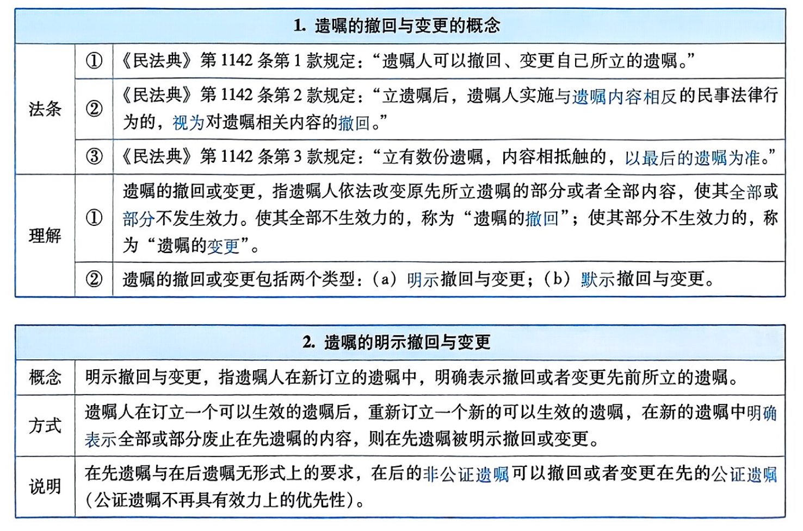

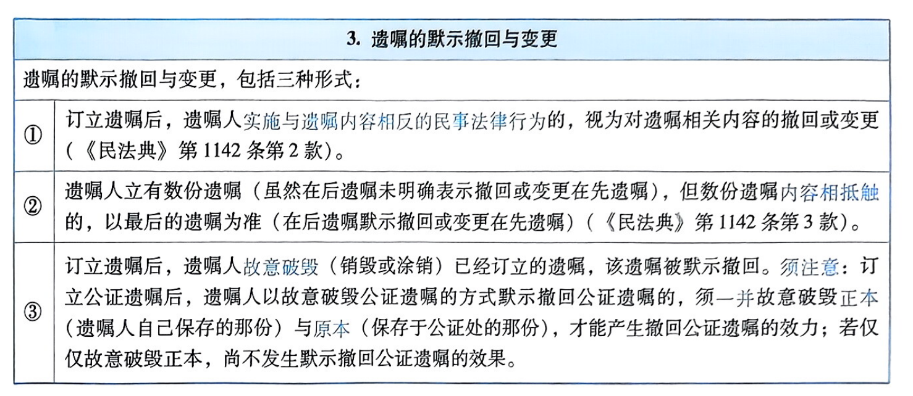

## 法定继承

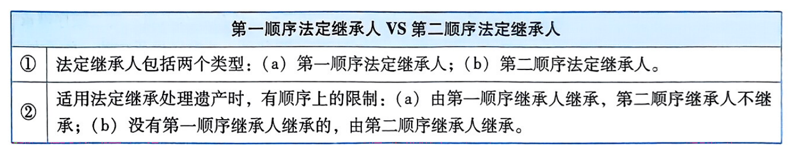

### 第一顺序法定继承人的范围

<table>
    <tr>
        <th colspan="2">第一顺序法定继承人的范围</th>
    </tr>
    <tr>
        <td colspan="2">被继承人死亡时，下列六类人（包括胎儿），属于（或者“相当于”）第一顺序的法定继承人：</td>
    </tr>
    <tr>
        <td>①</td>
        <td>配偶。合法婚姻关系中的配偶双方互为第一顺序法定继承人 （同居关系、婚姻被宣告无效或婚姻被撤销的双方当事人彼此不享有继承权）。</td>
    </tr>
    <tr>
        <td rowspan="2">②</td>
        <td>父母。父母包括： （a）生父母（婚生父母与非婚生父母）； （b）养父母； （c）有扶养关系的继父母。</td>
    </tr>
    <tr>
        <td>须注意： （a）继父母继承了继子女遗产的，不影响其继承生子女的遗产 【《民法典继承编解释（一）》第11条第2款】。 （b）生父母对被他人依法收养的亲生子女不享有继承权。</td>
    </tr>
    <tr>
        <td rowspan="2">③</td>
        <td>子女。子女包括： （a）婚生子女； （b）非婚生子女； （c）养子女； （d）有扶养关系的继子女。</td>
    </tr>
    <tr>
        <td>须注意： （a）继子女继承了继父母遗产的，不影响其继承生父母的遗产 【《民法典继承编解释（一）》第11条第1款】。 （b）养子女对生父母不享有继承权。</td>
    </tr>
    <tr>
        <td>④</td>
        <td>丧偶儿媳对公婆，丧偶女婿对岳父母，尽了主要赡养义务的，无论其是否再婚，作为第一顺序继承人（《民法典》第1129条）。</td>
    </tr>
    <tr>
        <td>⑤</td>
        <td>胎儿。遗产分割时，应当保留胎儿的继承份额。胎儿娩出时是死体的，保留的份额按照法定继承办理（《民法典》第1155条）。</td>
    </tr>
    <tr>
        <td>⑥</td>
        <td>作为代位继承人的被继承人的子女的直系晚辈血亲（《民法典》第1128条第1款）。 此种情形下，代位继承人的地位相当于第一顺序法定继承人。</td>
    </tr>
</table>

### 第二顺序法定继承人的范围

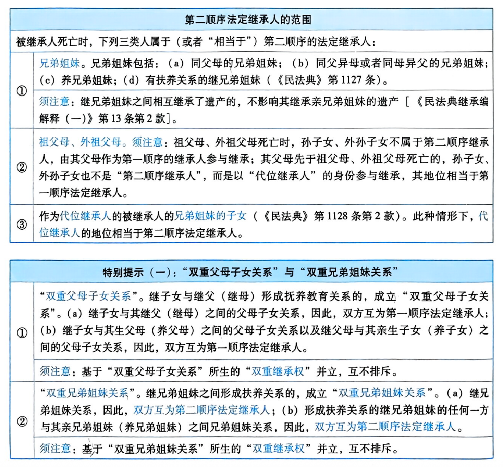

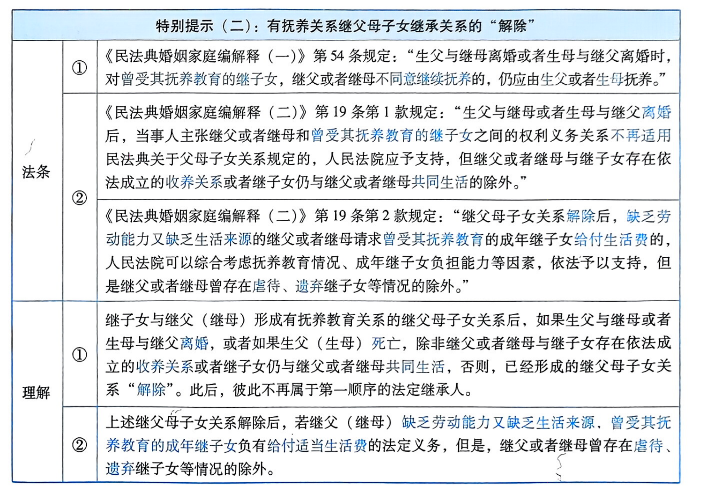

### 同一顺序法定继承人继承遗产的份额

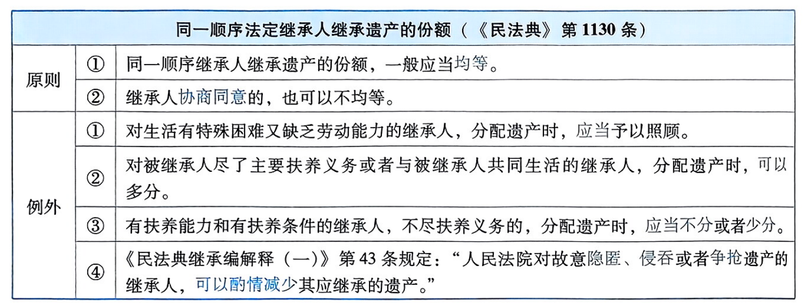

## 代位继承

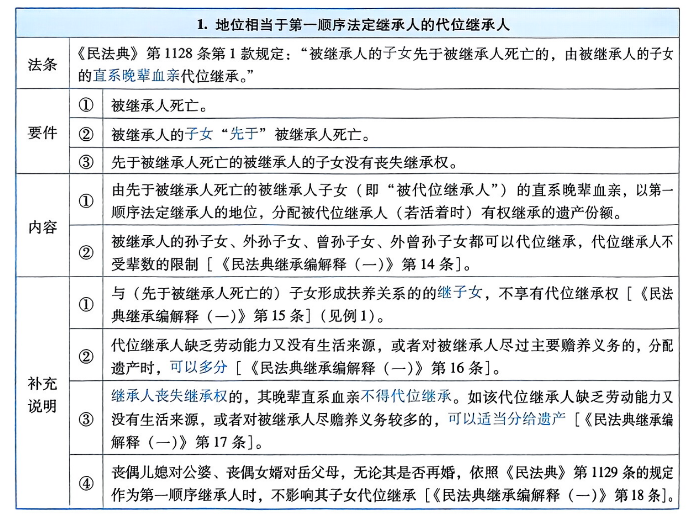

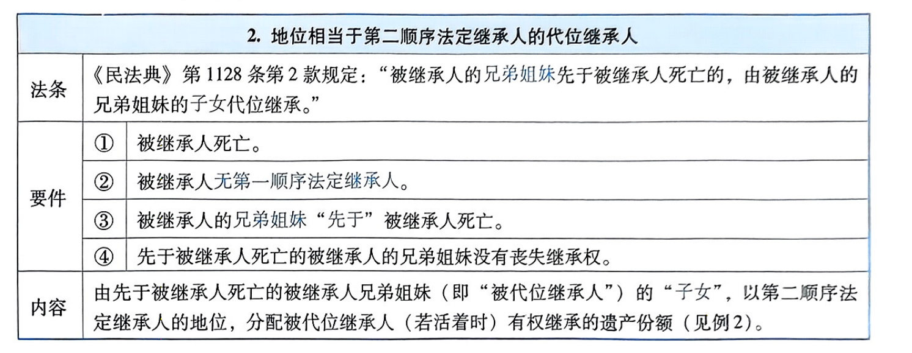

## 转继承

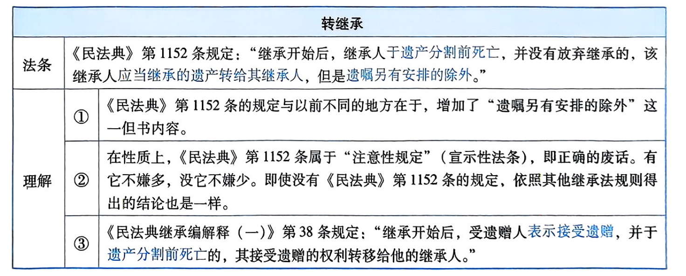

## 继承人以外的人酌情分得遗产权

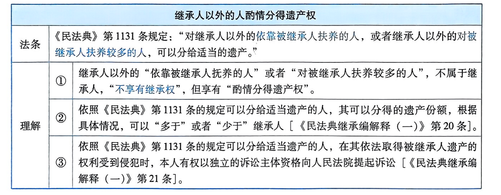

## 遗产管理人

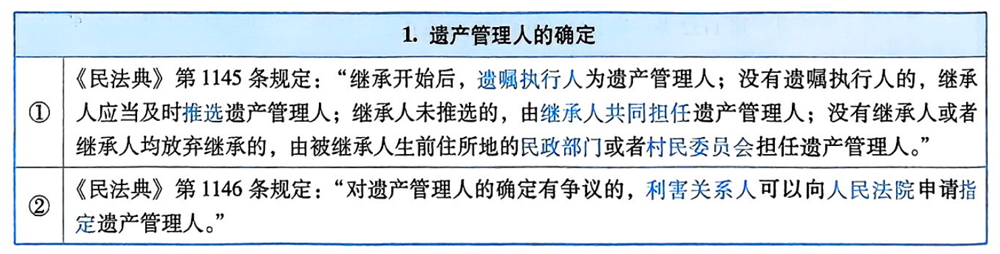

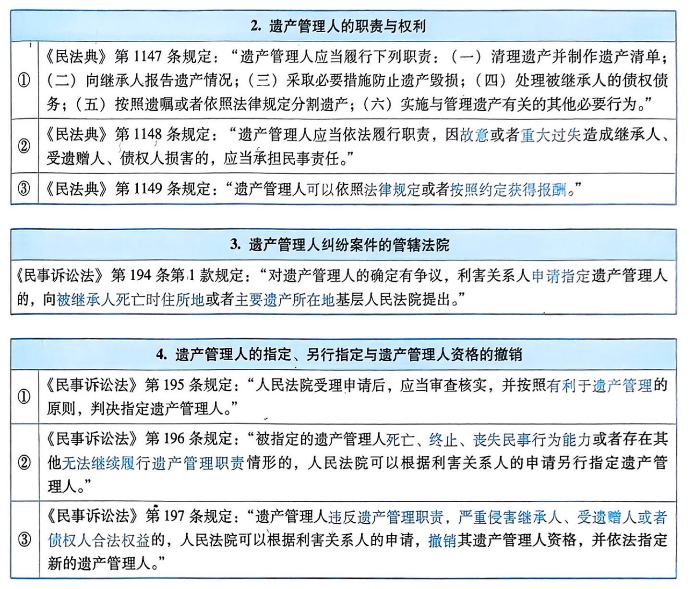

