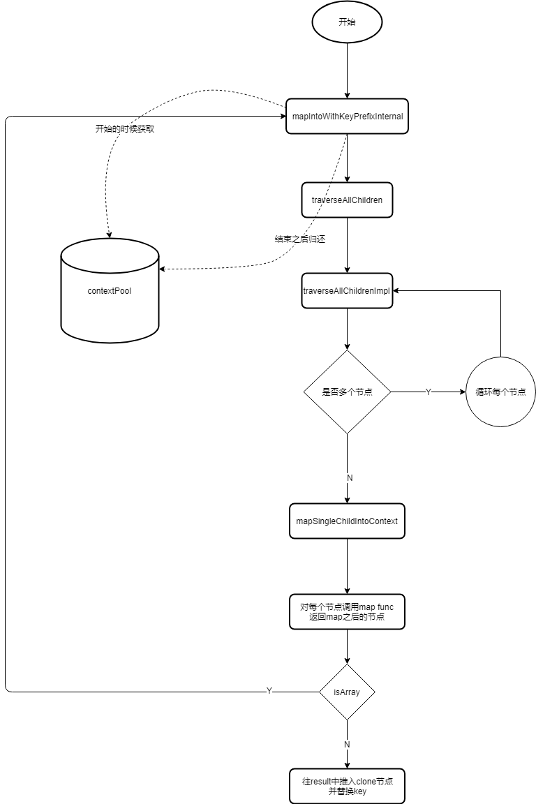
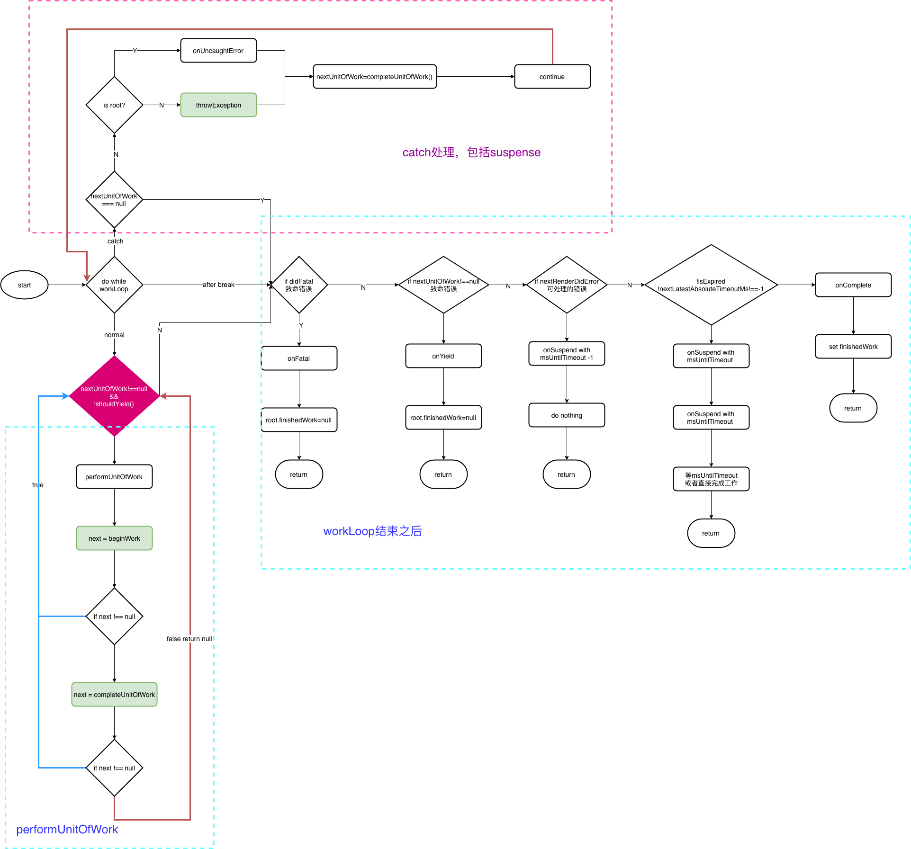

[toc]

# React源码

> [参考文献](https://react.jokcy.me/)

## JSX到JAVASCRIPT的转换

### 分析

```jsx
// jsx语法
<div id="div" key="key">text</div>
    
// 转换为javascript
React.createElement("div",{id: "div",key:"key"},"test")
```
   
```jsx 
// jsx语法
function Comp(){
    return <a>测试</a>
}
<Comp id="div" key="key">
    <span>1</span>
    <span>2</span>
</Comp>
    
// 转换为javascript
React.createElement(Comp,
    {id:"div",key:"key"},
    React.createElement("span",null,"1"),
    React.createElement("span",null,"2")
)
```

::: tip
React.createElement()

第一个参数是元素的标签（如果第一个元素是组件，首字母必须大写，会将组件做为变量传入，标签则是字符串）<br/>
第二个参数是在`react`中称为`prop`的所有键值对<br/>
第三个参数是会将第三个参数后(含第三个)的所有参数拿出来变为一个数组，作为这个节点的一个`children`来处理
:::

### 源码摘要
```js
export function createElement(type, config, children) {
  let propName;

  // Reserved names are extracted
  const props = {};

  let key = null;
  let ref = null;
  let self = null;
  let source = null;

  if (config != null) {
    if (hasValidRef(config)) {
      ref = config.ref;
    }
    if (hasValidKey(config)) {
      key = '' + config.key;
    }

    self = config.__self === undefined ? null : config.__self;
    source = config.__source === undefined ? null : config.__source;
    // Remaining properties are added to a new props object
    for (propName in config) {
      if (
        hasOwnProperty.call(config, propName) &&
        !RESERVED_PROPS.hasOwnProperty(propName)
      ) {
        props[propName] = config[propName];
      }
    }
  }

  // Children can be more than one argument, and those are transferred onto
  // the newly allocated props object.
  const childrenLength = arguments.length - 2;
  if (childrenLength === 1) {
    props.children = children;
  } else if (childrenLength > 1) {
    const childArray = Array(childrenLength);
    for (let i = 0; i < childrenLength; i++) {
      childArray[i] = arguments[i + 2];
    }
    props.children = childArray;
  }

  // Resolve default props
  if (type && type.defaultProps) {
    const defaultProps = type.defaultProps;
    for (propName in defaultProps) {
      if (props[propName] === undefined) {
        props[propName] = defaultProps[propName];
      }
    }
  }

  return ReactElement(
    type,
    key,
    ref,
    self,
    source,
    ReactCurrentOwner.current,
    props,
  );
}
```

```js
const ReactElement = function(type, key, ref, self, source, owner, props) {
  const element = {
    // This tag allows us to uniquely identify this as a React Element
    $$typeof: REACT_ELEMENT_TYPE,

    // Built-in properties that belong on the element
    type: type,
    key: key,
    ref: ref,
    props: props,

    // Record the component responsible for creating this element.
    _owner: owner,
  };
  return element;
};
```

::: tip
可以看到，createElement最终返回的是一个名为element的对象，值得一提的是此对象中有一个名为\$\$typeof的属性，它是用来标识我们的element是什么类型的，我们在写jsx的时候，所有的节点都是通过createElement创建的，那么它的\$\$typeof，都是REACT_ELEMENT_TYPE
:::


## React中的Component

### 分析

::: tip
React中有两个基类，一个是Component，一个是PureComponent，PureComponent本质上继承Component，唯一的区别是提供给我们简便的shouldComponentUpdate的实现，保证了我们的组件在props没有任何变化的情况下，能够减少不必要的更新
:::

### 源码摘要

```js
const emptyObject = {};

function Component(props, context, updater) {
  this.props = props;
  this.context = context;
  // If a component has string refs, we will assign a different object later.
  this.refs = emptyObject;
  // We initialize the default updater but the real one gets injected by the
  // renderer.
  this.updater = updater || ReactNoopUpdateQueue;
}

Component.prototype.isReactComponent = {};

Component.prototype.setState = function(partialState, callback) {
  invariant(
    typeof partialState === 'object' ||
      typeof partialState === 'function' ||
      partialState == null,
    'setState(...): takes an object of state variables to update or a ' +
      'function which returns an object of state variables.',
  );
  this.updater.enqueueSetState(this, partialState, callback, 'setState');
};

Component.prototype.forceUpdate = function(callback) {
  this.updater.enqueueForceUpdate(this, callback, 'forceUpdate');
};
```

```js
function PureComponent(props, context, updater) {
  this.props = props;
  this.context = context;
  // If a component has string refs, we will assign a different object later.
  this.refs = emptyObject;
  this.updater = updater || ReactNoopUpdateQueue;
}

function ComponentDummy() {}
ComponentDummy.prototype = Component.prototype;

const pureComponentPrototype = (PureComponent.prototype = new ComponentDummy());
pureComponentPrototype.constructor = PureComponent;
// Avoid an extra prototype jump for these methods.
Object.assign(pureComponentPrototype, Component.prototype);
pureComponentPrototype.isPureReactComponent = true;
```

::: tip
可以看到在原型上增加了`isPureReactComponent`属性，通过这个属性，来标识继承自这个类的组件，它是一个PureComponent，然后在后续更新过程中，ReactDom会主动的去判断是不是一个PureComponent,然后根据props是否更新，来判断这个组件是否需要更新
:::


## React中的Ref

### React中三种使用ref的方式

#### string ref

```js
// 声明
<p ref="stringRef"></p>
    
// 使用
this.refs.stringRef
```

::: tip
在想要获取的那个节点的props上面，使用ref属性传入一个字符串，react在完成这个节点的渲染之后，会在`this.refs`这个对象上面，挂载这个string对应的key，这个key指向的是这个节点的实例对象
:::


#### function

```js
// 声明
<p ref={ ele => (this.methodRef = ele)}></p>
    
// 使用
this.methodRef
```


::: tip
ref传入的是一个方法，这个方法会接收一个参数，这个参数就是这个节点对应的实例
:::


#### createRef

```js
// 声明
export default class RefDemo extends React.Component {
    constructor () {
        super()
        this.objRef = React.createRef()
        // {current: null}
    }
    
    render () {
        return {
            <p ref={this.objRef}></p>
        }
    }
}
    
// 使用
this.objRef.current
```


::: tip
react提供给我们的api，首先调用api创建对象，对象为`{current: null}`，把这个对象传给某一个节点，然后在组件渲染完成之后，会把节点对应的实例挂载到这个对象的current属性上面
:::
 

#### 源码摘要

```js
export function createRef(): RefObject {
  const refObject = {
    current: null,
  };
  return refObject;
}
```

::: tip
可以看到，createRef的源码非常简单，返回了一个`{current: null}`
:::


```js
function reconcileSingleElement(
    returnFiber: Fiber,
    currentFirstChild: Fiber | null,
    element: ReactElement,
    expirationTime: ExpirationTime,
  ): Fiber {
    ...省略
    while (child !== null) {
      // TODO: If key === null and child.key === null, then this only applies to
      // the first item in the list.
      if (child.key === key) {
        if (
          child.tag === Fragment
            ? element.type === REACT_FRAGMENT_TYPE
            : child.elementType === element.type
        ) {
          deleteRemainingChildren(returnFiber, child.sibling);
          const existing = useFiber(
            child,
            element.type === REACT_FRAGMENT_TYPE
              ? element.props.children
              : element.props,
            expirationTime,
          );
          existing.ref = coerceRef(returnFiber, child, element);
          existing.return = returnFiber;
          return existing;
        } else {
        }
      } else {
      }
      child = child.sibling;
    }
    ...省略  
}
```

::: tip
创建Fiber的时候处理ref
:::


```js
function coerceRef(
    returnFiber: Fiber,
    current: Fiber | null,
    element: ReactElement,
  ) {
    let mixedRef = element.ref;
    if (
      mixedRef !== null &&
      typeof mixedRef !== 'function' &&
      typeof mixedRef !== 'object'
    ) {
      // element._owner是classComponent对应的Fiber对象
      if (element._owner) {
        const owner: ?Fiber = (element._owner: any);
        let inst;
        if (owner) {
          const ownerFiber = ((owner: any): Fiber);
          invariant(
            ownerFiber.tag === ClassComponent,
            'Function components cannot have refs.',
          );
          inst = ownerFiber.stateNode;
        }
        invariant(
          inst,
          'Missing owner for string ref %s. This error is likely caused by a ' +
            'bug in React. Please file an issue.',
          mixedRef,
        );
        const stringRef = '' + mixedRef;
        // Check if previous string ref matches new string ref
        if (
          current !== null &&
          current.ref !== null &&
          typeof current.ref === 'function' &&
          current.ref._stringRef === stringRef
        ) {
          return current.ref;
        }
        // 这个value就是后期我们的dom节点或者是class instance，它被挂载的时候会调用下面这个ref方法，传入它自己的那个实例，也就是我们给一个dom节点设置了ref之后，在后期commitRoot的过程当中，我们这个节点最终被挂载在dom上面了，这个时候我们会把这个dom节点去调用ref这个方法作为参数传入进来
        const ref = function(value) {
          let refs = inst.refs;
          if (refs === emptyRefsObject) {
            // This is a lazy pooled frozen object, so we need to initialize.
            refs = inst.refs = {};
          }
          if (value === null) {
            delete refs[stringRef];
          } else {
            refs[stringRef] = value;
          }
        };
        ref._stringRef = stringRef;
        return ref;
      } else {
        invariant(
          typeof mixedRef === 'string',
          'Expected ref to be a function, a string, an object returned by React.createRef(), or null.',
        );
        invariant(
          element._owner,
          'Element ref was specified as a string (%s) but no owner was set. This could happen for one of' +
            ' the following reasons:\n' +
            '1. You may be adding a ref to a function component\n' +
            "2. You may be adding a ref to a component that was not created inside a component's render method\n" +
            '3. You have multiple copies of React loaded\n' +
            'See https://fb.me/react-refs-must-have-owner for more information.',
          mixedRef,
        );
      }
    }
    return mixedRef;
}
```


```js
function commitAllHostEffects() {
  while (nextEffect !== null) {

    recordEffect();

    const effectTag = nextEffect.effectTag;

    if (effectTag & ContentReset) {
      commitResetTextContent(nextEffect);
    }

    if (effectTag & Ref) {
      const current = nextEffect.alternate;
      if (current !== null) {
        commitDetachRef(current);
      }
    }
    ...省略
  }
}
```

::: tip
commit开始先detach
:::

```js
function commitDetachRef(current: Fiber) {
  const currentRef = current.ref;
  if (currentRef !== null) {
    if (typeof currentRef === 'function') {
      currentRef(null);
    } else {
      currentRef.current = null;
    }
  }
}
```

```js
function commitAllLifeCycles(
    finishedRoot: FiberRoot,
    committedExpirationTime: ExpirationTime,
  ) {
    
    while (nextEffect !== null) {
      const effectTag = nextEffect.effectTag;
  
      if (effectTag & (Update | Callback)) {
        recordEffect();
        const current = nextEffect.alternate;
        commitLifeCycles(
          finishedRoot,
          current,
          nextEffect,
          committedExpirationTime,
        );
      }
  
      if (effectTag & Ref) {
        recordEffect();
        commitAttachRef(nextEffect);
      }
  
      const next = nextEffect.nextEffect;
      // Ensure that we clean these up so that we don't accidentally keep them.
      // I'm not actually sure this matters because we can't reset firstEffect
      // and lastEffect since they're on every node, not just the effectful
      // ones. So we have to clean everything as we reuse nodes anyway.
      nextEffect.nextEffect = null;
      // Ensure that we reset the effectTag here so that we can rely on effect
      // tags to reason about the current life-cycle.
      nextEffect = next;
    }
}
```

```js
function commitAttachRef(finishedWork: Fiber) {
    const ref = finishedWork.ref;
    if (ref !== null) {
      const instance = finishedWork.stateNode;
      let instanceToUse;
      switch (finishedWork.tag) {
        case HostComponent:
          instanceToUse = getPublicInstance(instance);
          break;
        default:
          instanceToUse = instance;
      }
      if (typeof ref === 'function') {
        ref(instanceToUse);
      } else {
        ref.current = instanceToUse;
      }
    }
}
```


## React中的forwardRef

### forwardRef用途

::: tip
在React中如果定义的是一个`function Component`,这个组件是没有实例的，因为它是一个`PureComponent`<br/>
在设想，如果我们引入了redux，connect方法返回的是一个被包装过的组件，我们想拿到未被包装过的组件实例该如何做
:::

### forwardRef使用

```js
export default class Comp extends React.Component{
    
    constructor () {
        super()
        this.ref = React.createRef()
    }
    
    render () {
        return <TargetComponent ref={this.ref} />
    }
    
}
    
// 使用forwardRef的情况
const TargetComponent = React.forwardRef( (props,ref) => ( <input type="text" ref={ref} /> ) )
    
// 不使用forwardRef的情况
const TargetComponent =  (props) => ( <input type="text" ref={ref} /> ) 
```

::: tip
上面的例子中，可以清晰的看到，不使用forwardRef的情况下，我们无法拿到ref，因为ref不属于props里面，我们也没有任何办法拿到，因为从上层组件传递过来的只有props，有了forwardRef后，我们的`function Component`可以增加第二个参数，也就是ref这个参数
:::


### 源码摘要

```js
export default function forwardRef<Props, ElementType: React$ElementType>(
  render: (props: Props, ref: React$Ref<ElementType>) => React$Node,
) {
  return {
    $$typeof: REACT_FORWARD_REF_TYPE,
    render,
  };
}
```

::: tip
可以看到，forwardRef函数返回的是一个对象，其中render是我们传递进来的`function Component`，创建的元素或组件的$$typeof还是REACT_ELEMENT_TYPE，而创建的元素或组件的type为返回的对象
::: 


## React中的Context

### React中Context两种实现方式

#### childContextType

::: tip
会影响整个子树<br/>
嵌套的context提供者需要进行合并<br/>
对性能影响较大
::: 

##### 代码示例

```js
class Parent extends React.Component{
    
    state = {
        childContent: '123'
    }
    
    getChildContext () {
        return {value: this.state.childContext}
    }
    
}
    
Parent.childContextTypes = {
    value: PropTypes.string
}
    
    
class Child extends React.Component {
    render () {
        return (
            <p>{this.context.value}</p>
        )
    }
}
    
Child.contextTypes = {
    value: PropTypes.string
}
```

::: tip
上面的例子中，展示了childContextType的使用，需要注意的就是PropTypes的声明，子组件中，需要用到几个，就要声明几个
:::


##### 源码摘要

###### 设置context

```js
function beginWork(
  current: Fiber | null,
  workInProgress: Fiber,
  renderExpirationTime: ExpirationTime,
): Fiber | null {
  const updateExpirationTime = workInProgress.expirationTime;

  if (current !== null) {
    const oldProps = current.memoizedProps;
    const newProps = workInProgress.pendingProps;
    if (
      oldProps === newProps &&
      !hasLegacyContextChanged() &&
      (updateExpirationTime === NoWork ||
        updateExpirationTime > renderExpirationTime)
    ) {
      // This fiber does not have any pending work. Bailout without entering
      // the begin phase. There's still some bookkeeping we that needs to be done
      // in this optimized path, mostly pushing stuff onto the stack.
      switch (workInProgress.tag) {
        ...省略
        case ClassComponent: {
          const Component = workInProgress.type;
          if (isLegacyContextProvider(Component)) {
            pushLegacyContextProvider(workInProgress);
          }
          break;
        }
        ...省略
      }
      return bailoutOnAlreadyFinishedWork(
        current,
        workInProgress,
        renderExpirationTime,
      );
    }
  }

  // Before entering the begin phase, clear the expiration time.
  workInProgress.expirationTime = NoWork;

  switch (workInProgress.tag) {
    ...省略
    case ClassComponent: {
      const Component = workInProgress.type;
      const unresolvedProps = workInProgress.pendingProps;
      const resolvedProps =
        workInProgress.elementType === Component
          ? unresolvedProps
          : resolveDefaultProps(Component, unresolvedProps);
      return updateClassComponent(
        current,
        workInProgress,
        Component,
        resolvedProps,
        renderExpirationTime,
      );
    }
    ...省略
  }
}
```
::: tip
上面有个hasLegacyContextChanged方法，可以看到它直接影响了更新的所有组件它是否可以调用bailoutOnAlreadyFinishedWork来直接跳过这个组件的更新，所以这就是为什么说，老的context对性能的影响比较大
:::


```js
// A cursor to a boolean indicating whether the context has changed.
let didPerformWorkStackCursor: StackCursor<boolean> = createCursor(false);

let previousContext: Object = emptyContextObject;

let contextStackCursor: StackCursor<Object> = createCursor(emptyContextObject);

export const emptyContextObject = {};

function hasContextChanged(): boolean {
  return didPerformWorkStackCursor.current;
}

function isContextProvider(type: Function): boolean {
  const childContextTypes = type.childContextTypes;
  return childContextTypes !== null && childContextTypes !== undefined;
}

function pushContextProvider(workInProgress: Fiber): boolean {
  const instance = workInProgress.stateNode;
  // We push the context as early as possible to ensure stack integrity.
  // If the instance does not exist yet, we will push null at first,
  // and replace it on the stack later when invalidating the context.
  const memoizedMergedChildContext =
    (instance && instance.__reactInternalMemoizedMergedChildContext) ||
    emptyContextObject;

  // Remember the parent context so we can merge with it later.
  // Inherit the parent's did-perform-work value to avoid inadvertently blocking updates.
  previousContext = contextStackCursor.current;
  push(contextStackCursor, memoizedMergedChildContext, workInProgress);
  push(
    didPerformWorkStackCursor,
    didPerformWorkStackCursor.current,
    workInProgress,
  );

  return true;
}
```
::: tip
这是可以跳出当前组件的更新的一个情况
::: 


```js
function updateClassComponent(
  current: Fiber | null,
  workInProgress: Fiber,
  Component: any,
  nextProps,
  renderExpirationTime: ExpirationTime,
) {
  // Push context providers early to prevent context stack mismatches.
  // During mounting we don't know the child context yet as the instance doesn't exist.
  // We will invalidate the child context in finishClassComponent() right after rendering.
  let hasContext;
  if (isLegacyContextProvider(Component)) {
    hasContext = true;
    pushLegacyContextProvider(workInProgress);
  } else {
    hasContext = false;
  }
  ...省略
  return finishClassComponent(
    current,
    workInProgress,
    Component,
    shouldUpdate,
    hasContext,
    renderExpirationTime,
  );
}

function finishClassComponent(
  current: Fiber | null,
  workInProgress: Fiber,
  Component: any,
  shouldUpdate: boolean,
  hasContext: boolean,
  renderExpirationTime: ExpirationTime,
) {
    ...省略
    if (!shouldUpdate && !didCaptureError) {
        // Context providers should defer to sCU for rendering
        if (hasContext) {
          invalidateContextProvider(workInProgress, Component, false);
        }
        
        return bailoutOnAlreadyFinishedWork(
          current,
          workInProgress,
          renderExpirationTime,
        );
    }
    ...省略
    
    if (hasContext) {
        invalidateContextProvider(workInProgress, Component, true);
    }
    
    return workInProgress.child;
}
```

```js
// didChange表示我们这个context对象是否有变化
function invalidateContextProvider(
  workInProgress: Fiber,
  type: any,
  didChange: boolean,
): void {
  const instance = workInProgress.stateNode;
  invariant(
    instance,
    'Expected to have an instance by this point. ' +
      'This error is likely caused by a bug in React. Please file an issue.',
  );

  if (didChange) {
    // Merge parent and own context.
    // Skip this if we're not updating due to sCU.
    // This avoids unnecessarily recomputing memoized values.
    const mergedContext = processChildContext(
      workInProgress,
      type,
      previousContext,
    );
    instance.__reactInternalMemoizedMergedChildContext = mergedContext;

    // Replace the old (or empty) context with the new one.
    // It is important to unwind the context in the reverse order.
    pop(didPerformWorkStackCursor, workInProgress);
    pop(contextStackCursor, workInProgress);
    // Now push the new context and mark that it has changed.
    push(contextStackCursor, mergedContext, workInProgress);
    push(didPerformWorkStackCursor, didChange, workInProgress);
  } else {
    pop(didPerformWorkStackCursor, workInProgress);
    push(didPerformWorkStackCursor, didChange, workInProgress);
  }
}
```

```js
function processChildContext(
  fiber: Fiber,
  type: any,
  parentContext: Object,
): Object {
  const instance = fiber.stateNode;
  const childContextTypes = type.childContextTypes;

  // TODO (bvaughn) Replace this behavior with an invariant() in the future.
  // It has only been added in Fiber to match the (unintentional) behavior in Stack.
  if (typeof instance.getChildContext !== 'function') {
    return parentContext;
  }

  let childContext;
  startPhaseTimer(fiber, 'getChildContext');
  childContext = instance.getChildContext();
  stopPhaseTimer();
  for (let contextKey in childContext) {
    invariant(
      contextKey in childContextTypes,
      '%s.getChildContext(): key "%s" is not defined in childContextTypes.',
      getComponentName(type) || 'Unknown',
      contextKey,
    );
  }

  return {...parentContext, ...childContext};
}
```

###### 获取context

```js
function updateClassInstance(
  current: Fiber,
  workInProgress: Fiber,
  ctor: any,
  newProps: any,
  renderExpirationTime: ExpirationTime,
): boolean {
    const instance = workInProgress.stateNode;

    const oldProps = workInProgress.memoizedProps;
    instance.props = oldProps;
    
    const oldContext = instance.context;
    const contextType = ctor.contextType;
    let nextContext;
    if (typeof contextType === 'object' && contextType !== null) {
        nextContext = readContext(contextType);
    } else {
        const nextUnmaskedContext = getUnmaskedContext(workInProgress, ctor, true);
        nextContext = getMaskedContext(workInProgress, nextUnmaskedContext);
    }
    
    ...省略
}
```

```js
function getUnmaskedContext(
  workInProgress: Fiber,
  Component: Function,
  didPushOwnContextIfProvider: boolean,
): Object {
  if (didPushOwnContextIfProvider && isContextProvider(Component)) {
    // If the fiber is a context provider itself, when we read its context
    // we may have already pushed its own child context on the stack. A context
    // provider should not "see" its own child context. Therefore we read the
    // previous (parent) context instead for a context provider.
    return previousContext;
  }
  return contextStackCursor.current;
}
```

```js
function getMaskedContext(
  workInProgress: Fiber,
  unmaskedContext: Object,
): Object {
  const type = workInProgress.type;
  const contextTypes = type.contextTypes;
  if (!contextTypes) {
    return emptyContextObject;
  }

  // Avoid recreating masked context unless unmasked context has changed.
  // Failing to do this will result in unnecessary calls to componentWillReceiveProps.
  // This may trigger infinite loops if componentWillReceiveProps calls setState.
  const instance = workInProgress.stateNode;
  if (
    instance &&
    instance.__reactInternalMemoizedUnmaskedChildContext === unmaskedContext
  ) {
    return instance.__reactInternalMemoizedMaskedChildContext;
  }

  const context = {};
  for (let key in contextTypes) {
    context[key] = unmaskedContext[key];
  }

  // Cache unmasked context so we can avoid recreating masked context unless necessary.
  // Context is created before the class component is instantiated so check for instance.
  if (instance) {
    cacheContext(workInProgress, unmaskedContext, context);
  }

  return context;
}
```


###### popContext

```js
function completeWork(
  current: Fiber | null,
  workInProgress: Fiber,
  renderExpirationTime: ExpirationTime,
): Fiber | null {
  const newProps = workInProgress.pendingProps;

  switch (workInProgress.tag) {
    ...省略
    case ClassComponent: {
      const Component = workInProgress.type;
      if (isLegacyContextProvider(Component)) {
        popLegacyContext(workInProgress);
      }
      break;
    }
    ...省略
  }
  ...省略
}
```

```js
function popContext(fiber: Fiber): void {
  pop(didPerformWorkStackCursor, fiber);
  pop(contextStackCursor, fiber);
}
```


#### createContext

::: tip
组件化的使用方式<br/>
context的提供方和订阅方都是独立的<br/>
没有什么附带的性能影响
:::

##### 代码示例

```js
const { Provider, Consumer } = React.createContext('default')
    
class Parent extends React.Component{
    
    state = {
        newContext: '456'
    }
    
    render () {
    
        return (
            <Provider value={this.state.newContext} />
        )
    }
    
}
    
function Child () {
    return <Consumer>{value => <p>{value}</p>}</Consumer>
}
```

::: tip
使用了`createContext`后，子组件只需要在想要用到`context`的地方，通过`Consumer`把想要渲染的渲染出来,所以它们是一一对应的关系
:::


##### 源码摘要

```js
export function createContext<T>(
  defaultValue: T,
  calculateChangedBits: ?(a: T, b: T) => number,
): ReactContext<T> {
  if (calculateChangedBits === undefined) {
    calculateChangedBits = null;
  } 

  const context: ReactContext<T> = {
    $$typeof: REACT_CONTEXT_TYPE,
    _calculateChangedBits: calculateChangedBits,
    // As a workaround to support multiple concurrent renderers, we categorize
    // some renderers as primary and others as secondary. We only expect
    // there to be two concurrent renderers at most: React Native (primary) and
    // Fabric (secondary); React DOM (primary) and React ART (secondary).
    // Secondary renderers store their context values on separate fields.
    _currentValue: defaultValue,
    _currentValue2: defaultValue,
    // Used to track how many concurrent renderers this context currently
    // supports within in a single renderer. Such as parallel server rendering.
    _threadCount: 0,
    // These are circular
    Provider: (null: any),
    Consumer: (null: any),
  };

  context.Provider = {
    $$typeof: REACT_PROVIDER_TYPE,
    _context: context,
  };

  let hasWarnedAboutUsingNestedContextConsumers = false;
  let hasWarnedAboutUsingConsumerProvider = false;

  
  context.Consumer = context;

  return context;
}
```

::: tip
接收两个参数，第一个是`defaultValue`,第二个是一个方法，用来计算新老context的变化，然后声明了一个context对象。其中`_currentValue`是用来记录`Provider`上面提供的value有变化的情况下，它就会更新到这个属性上
:::


```js
function updateContextProvider(
  current: Fiber | null,
  workInProgress: Fiber,
  renderExpirationTime: ExpirationTime,
) {
  const providerType: ReactProviderType<any> = workInProgress.type;
  const context: ReactContext<any> = providerType._context;

  const newProps = workInProgress.pendingProps;
  const oldProps = workInProgress.memoizedProps;

  const newValue = newProps.value;


  pushProvider(workInProgress, newValue);

  if (oldProps !== null) {
    const oldValue = oldProps.value;
    const changedBits = calculateChangedBits(context, newValue, oldValue);
    if (changedBits === 0) {
      // No change. Bailout early if children are the same.
      if (
        oldProps.children === newProps.children &&
        !hasLegacyContextChanged()
      ) {
        return bailoutOnAlreadyFinishedWork(
          current,
          workInProgress,
          renderExpirationTime,
        );
      }
    } else {
      // The context value changed. Search for matching consumers and schedule
      // them to update.
      propagateContextChange(
        workInProgress,
        context,
        changedBits,
        renderExpirationTime,
      );
    }
  }

  const newChildren = newProps.children;
  reconcileChildren(current, workInProgress, newChildren, renderExpirationTime);
  return workInProgress.child;
}
```

```js
export const isPrimaryRenderer = true;

export function pushProvider<T>(providerFiber: Fiber, nextValue: T): void {
  const context: ReactContext<T> = providerFiber.type._context;

  if (isPrimaryRenderer) {
    // 这个valueCursor，它记录的是，我们当前这个树下面，一共经历了几个Provider它对应的值
    push(valueCursor, context._currentValue, providerFiber);

    context._currentValue = nextValue;
  } else {
    push(valueCursor, context._currentValue2, providerFiber);

    context._currentValue2 = nextValue;
  }
}
```

```js
export function calculateChangedBits<T>(
  context: ReactContext<T>,
  newValue: T,
  oldValue: T,
) {
  // Use Object.is to compare the new context value to the old value. Inlined
  // Object.is polyfill.
  // https://developer.mozilla.org/en-US/docs/Web/JavaScript/Reference/Global_Objects/Object/is
  // -0 === +0不正确，以及NaN应该等于NaN
  if (
    (oldValue === newValue &&
      (oldValue !== 0 || 1 / oldValue === 1 / (newValue: any))) ||
    (oldValue !== oldValue && newValue !== newValue) // eslint-disable-line no-self-compare
  ) {
    // No change
    return 0;
  } else {
    const changedBits =
      typeof context._calculateChangedBits === 'function'
        ? context._calculateChangedBits(oldValue, newValue)
        : MAX_SIGNED_31_BIT_INT;

    return changedBits | 0;
  }
}
```

```js
export function propagateContextChange(
  workInProgress: Fiber,
  context: ReactContext<mixed>,
  changedBits: number,
  renderExpirationTime: ExpirationTime,
): void {
  let fiber = workInProgress.child;
  if (fiber !== null) {
    // Set the return pointer of the child to the work-in-progress fiber.
    fiber.return = workInProgress;
  }
  while (fiber !== null) {
    let nextFiber;

    // Visit this fiber.
    let dependency = fiber.firstContextDependency;
    if (dependency !== null) {
      do {
        // Check if the context matches.
        // changedBits是所有都是1的一个32位数，所以只要我们这个observedBits不是0，那么它们&的结果就不是0
        // dependency.context === context说明的意思是我们这个遍历过程中的那个组件，是依赖于这个当前的context的
        if (
          dependency.context === context &&
          (dependency.observedBits & changedBits) !== 0
        ) {
          // Match! Schedule an update on this fiber.

          if (fiber.tag === ClassComponent) {
            // Schedule a force update on the work-in-progress.
            const update = createUpdate(renderExpirationTime);
            update.tag = ForceUpdate;
            // TODO: Because we don't have a work-in-progress, this will add the
            // update to the current fiber, too, which means it will persist even if
            // this render is thrown away. Since it's a race condition, not sure it's
            // worth fixing.
            enqueueUpdate(fiber, update);
          }

          if (
            fiber.expirationTime === NoWork ||
            fiber.expirationTime > renderExpirationTime
          ) {
            fiber.expirationTime = renderExpirationTime;
          }
          let alternate = fiber.alternate;
          if (
            alternate !== null &&
            (alternate.expirationTime === NoWork ||
              alternate.expirationTime > renderExpirationTime)
          ) {
            alternate.expirationTime = renderExpirationTime;
          }
          // Update the child expiration time of all the ancestors, including
          // the alternates.
          let node = fiber.return;
          while (node !== null) {
            alternate = node.alternate;
            if (
              node.childExpirationTime === NoWork ||
              node.childExpirationTime > renderExpirationTime
            ) {
              node.childExpirationTime = renderExpirationTime;
              if (
                alternate !== null &&
                (alternate.childExpirationTime === NoWork ||
                  alternate.childExpirationTime > renderExpirationTime)
              ) {
                alternate.childExpirationTime = renderExpirationTime;
              }
            } else if (
              alternate !== null &&
              (alternate.childExpirationTime === NoWork ||
                alternate.childExpirationTime > renderExpirationTime)
            ) {
              alternate.childExpirationTime = renderExpirationTime;
            } else {
              // Neither alternate was updated, which means the rest of the
              // ancestor path already has sufficient priority.
              break;
            }
            node = node.return;
          }
        }
        nextFiber = fiber.child;
        dependency = dependency.next;
      } while (dependency !== null);
    } else if (fiber.tag === ContextProvider) {
      // Don't scan deeper if this is a matching provider
      nextFiber = fiber.type === workInProgress.type ? null : fiber.child;
    } else {
      // Traverse down.
      nextFiber = fiber.child;
    }

    if (nextFiber !== null) {
      // Set the return pointer of the child to the work-in-progress fiber.
      nextFiber.return = fiber;
    } else {
      // No child. Traverse to next sibling.
      nextFiber = fiber;
      while (nextFiber !== null) {
        if (nextFiber === workInProgress) {
          // We're back to the root of this subtree. Exit.
          nextFiber = null;
          break;
        }
        let sibling = nextFiber.sibling;
        if (sibling !== null) {
          // Set the return pointer of the sibling to the work-in-progress fiber.
          sibling.return = nextFiber.return;
          nextFiber = sibling;
          break;
        }
        // No more siblings. Traverse up.
        nextFiber = nextFiber.return;
      }
    }
    fiber = nextFiber;
  }
}
```

```js
function updateContextConsumer(
  current: Fiber | null,
  workInProgress: Fiber,
  renderExpirationTime: ExpirationTime,
) {
  let context: ReactContext<any> = workInProgress.type;
  // The logic below for Context differs depending on PROD or DEV mode. In
  // DEV mode, we create a separate object for Context.Consumer that acts
  // like a proxy to Context. This proxy object adds unnecessary code in PROD
  // so we use the old behaviour (Context.Consumer references Context) to
  // reduce size and overhead. The separate object references context via
  // a property called "_context", which also gives us the ability to check
  // in DEV mode if this property exists or not and warn if it does not.
  
  const newProps = workInProgress.pendingProps;
  const render = newProps.children;


  prepareToReadContext(workInProgress, renderExpirationTime);
  const newValue = readContext(context, newProps.unstable_observedBits);
  let newChildren;
  if (__DEV__) {
  } else {
    newChildren = render(newValue);
  }

  // React DevTools reads this flag.
  workInProgress.effectTag |= PerformedWork;
  reconcileChildren(current, workInProgress, newChildren, renderExpirationTime);
  return workInProgress.child;
}
```

```js
export function prepareToReadContext(
  workInProgress: Fiber,
  renderExpirationTime: ExpirationTime,
): void {
  currentlyRenderingFiber = workInProgress;
  lastContextDependency = null;
  lastContextWithAllBitsObserved = null;

  // Reset the work-in-progress list
  workInProgress.firstContextDependency = null;
}
```

```js
export function readContext<T>(
  context: ReactContext<T>,
  observedBits: void | number | boolean,
): T {
  if (lastContextWithAllBitsObserved === context) {
    // Nothing to do. We already observe everything in this context.
  } else if (observedBits === false || observedBits === 0) {
    // Do not observe any updates.
  } else {
    let resolvedObservedBits; // Avoid deopting on observable arguments or heterogeneous types.
    if (
      typeof observedBits !== 'number' ||
      observedBits === MAX_SIGNED_31_BIT_INT
    ) {
      // Observe all updates.
      lastContextWithAllBitsObserved = ((context: any): ReactContext<mixed>);
      resolvedObservedBits = MAX_SIGNED_31_BIT_INT;
    } else {
      resolvedObservedBits = observedBits;
    }

    let contextItem = {
      context: ((context: any): ReactContext<mixed>),
      observedBits: resolvedObservedBits,
      next: null,
    };

    if (lastContextDependency === null) {
      invariant(
        currentlyRenderingFiber !== null,
        'Context can only be read while React is ' +
          'rendering, e.g. inside the render method or getDerivedStateFromProps.',
      );
      // This is the first dependency in the list
      currentlyRenderingFiber.firstContextDependency = lastContextDependency = contextItem;
    } else {
      // Append a new context item.
      lastContextDependency = lastContextDependency.next = contextItem;
    }
  }
  return isPrimaryRenderer ? context._currentValue : context._currentValue2;
}
```


## React中的stack
 
::: tip
更新节点时相关信息入栈<br/>
完成节点时相关信息出栈<br/>
用不同的`cursor`记录不同的信息
::: 

### 源码摘要

```js
const valueStack: Array<any> = [];
let index = -1;

function createCursor<T>(defaultValue: T): StackCursor<T> {
  return {
    current: defaultValue,
  };
}

function push<T>(cursor: StackCursor<T>, value: T, fiber: Fiber): void {
  index++;

  valueStack[index] = cursor.current;

  cursor.current = value;
}

function pop<T>(cursor: StackCursor<T>, fiber: Fiber): void {
  if (index < 0) {
    return;
  }

  cursor.current = valueStack[index];

  valueStack[index] = null;

  index--;
}
```
 


## React中的ConcurrentMode

### ConcurrentMode的目标

::: tip
让react的整体渲染过程能够进行一个优先级的排比，并且让整体的一个渲染过程是可以中断的，它就可以进行一个任务的调度，提高cpu性能
:::

### ConcurrentMode示例

```js
import {ConcurrentMode} from 'react'
import { flushSync} from 'react-dom'
    
class Parent extends React.Component{
    
    state = {
        async: true,
        num: 1,
        length: 1000
    }
    
    componentDidMount () {
        this.interval = setInterval(()=>{
            this.updateNum()
        },200)
    }
    
    componentWillUnmount () {
        if (this.interval) {
            clearInterval(this.interval)
        }
    }
    
    updateNum () {
        const newNum = this.state === 3 ? 0 : this.state.num + 1
        if (this.state.async) {
            this.setState({
                num: newNum
            })
        } else {
            flushSync(() => {
                this.setState({
                    num: newNum
                })
            })
        }
    }
    
    render () {
    
        const children = []
        const {length, num, async} = this.state
        for (let i = 0;i<length;i++) {
            children.push(
                <div className="item" key={i}>
                    {num}
                </div>
            )
        }
        
        return (
            <div className="main">
                <input
                    type="text"
                    value={length}
                    onChange={e => {
                        flushSync( () => this.setState( {length: parseInt(e.target.value)} ) )
                    }}
                />
                async: {' '}
                <input
                    type="checkbox"
                    checked={async}
                    onChange={ () => flushSync( () => this.setState({async: !async})  ) }
                />
                <div className="wrapper">{children}</div>
            </div>
        )
        
    }
    
}
    
    
export default () => {
    <ConcurrentMode>
        <Parent />
    </ConcurrentMode>
}
```

::: tip
flushSync会强制我们在执行某一个更新操作的时候，使用优先级最高的方式，去进行一个更新，用这个是因为ConcurrentMode有一个特性，在一个子元素中渲染了ConcurrentMode，它下面所有的节点产生的更新，它就是一个低优先级的更新
:::


###  源码摘要

```js
import {
  REACT_CONCURRENT_MODE_TYPE,
  REACT_FRAGMENT_TYPE,
  REACT_PROFILER_TYPE,
  REACT_STRICT_MODE_TYPE,
  REACT_SUSPENSE_TYPE,
} from 'shared/ReactSymbols';

if (enableStableConcurrentModeAPIs) {
  React.ConcurrentMode = REACT_CONCURRENT_MODE_TYPE;
  React.Profiler = REACT_PROFILER_TYPE;
  React.unstable_ConcurrentMode = undefined;
  React.unstable_Profiler = undefined;
}

// shared/ReactSymbols.js

export const REACT_CONCURRENT_MODE_TYPE = hasSymbol
  ? Symbol.for('react.concurrent_mode')
  : 0xeacf;
```
::: tip
可以看出这个组件就是一个`Symbol`
:::

## React中的Suspense和lazy

### Suspense和lazy示例

```js
import {Suspense} from 'react'

let data = ''
let promise = ''
    
function requestData () {
    if (data) return data
    if (promise) throw promise
    promise = new Promise(resolve => {
        setTimeout(() => {
            data = 'Data resolved'
            resolve()
        }, 2000)
    })
    throw promise
}
    
function SuspenseComp () {
    const data = requestData()
    return <p>{data}</p>
}
    
export default () => {
    <Suspense fallback="loading data">
        <SuspenseComp />
    </Suspense>
}
```

::: tip
第一次渲染时，没有`data`和`promise`，所以`throw promise`报错了，这时我们显示的是`Suspense`组件的`fallback`，过两秒后resolve了，显示出了data
:::

::: tip
我们在一个`Suspense`组件下面渲染了一个或者多个异步的组件，有任何一个`throw`了一个`promise`后，在这个`promise``resolve`之前，都会显示这个`fallback`
:::

```js
import {Suspense, lazy} from 'react'
const LazyComp = lazy(() => import('./lazy.js'))
// lazy.js
export default () => <p>Lazy Comp</p>

export default () => {
    <Suspense fallback="loading data">
        <LazyComp/>
    </Suspense>
}
```

### Suspense和lazy源码摘要

```js
// suspense源码
export const REACT_SUSPENSE_TYPE = hasSymbol
  ? Symbol.for('react.suspense')
  : 0xead1;
```

::: tip
可以看出这个组件就是一个`Symbol`
:::

```js
// lazy源码
export function lazy<T, R>(ctor: () => Thenable<T, R>): LazyComponent<T> {
  let lazyType = {
    $$typeof: REACT_LAZY_TYPE,
    _ctor: ctor,
    // React uses these fields to store the result.
    _status: -1,
    _result: null,
  };

  return lazyType;
}
```

::: tip
它接收一个方法，并且此方法返回一个Thenable(promise这样的对象，具有.then这样的方法)<br/>
其中返回的_status属性，用来记录当前的Thenable对象，处于的状态的<br/>
其中返回的_result属性,用来记录Thenable对象resolve之后，返回的属性<br/>
在lazy里面，最终result出来的组件，会把它放到_result上面，后续我们渲染lazy组件，直接拿_result里面的组件去渲染就可以了，不用在执行promise了
:::

## React中的Hooks

### Hooks的意义

::: tip
Hooks给`function component`提供了`class component`所具有的能力，在以前`function component`是没有this对象和生命周期方法的，没有`this`对象，就不能有`this.state`
:::

### Hooks示例

```js
import {useState, useEffect} from 'react'
    
export default () => {
    const [name, setName] = useState('jokcy')
    
    useEffect(()=>{
        console.log('component update')
        
        return () => {
            console.log('unbind')
        }
    },[])
    
    return (
        <div>
            <p>{name}</p>
            <input
                type="text"
                value={name}
                onChange={e => setName(e.target.value)}
            />
        </div>
    )
}
```

::: tip
上面例子中，利用Hooks给我们的组件存储了state,还模拟了生命周期方法<br/>
上面数组的结构中，第一项是state对应的变量，第二项是我们去改变state的一个方法
::: 

### Hooks源码摘要

```js
export function useState<S>(initialState: (() => S) | S) {
  const dispatcher = resolveDispatcher();
  return dispatcher.useState(initialState);
}

function resolveDispatcher() {
  const dispatcher = ReactCurrentDispatcher.current;
  invariant(
    dispatcher !== null,
    'Hooks can only be called inside the body of a function component. ' +
      '(https://fb.me/react-invalid-hook-call)',
  );
  return dispatcher;
}

const ReactCurrentDispatcher = {
  /**
   * @internal
   * @type {ReactComponent}
   */
  current: (null: null | Dispatcher)
}
```

::: tip
Hooks最终调用的都是dispatcher上面的方法
:::

## React中的Children

### 示例

```js
function ChildrenDemo (props) {
    
    console.log(props.children)
    console.log(React.Children.map(props.children,c => [c, [c, c, [c]]]))
    return props.children
}
    
export default () => {
    <ChildrenDemo>
        <span>1</span>
        <span>2</span>
    </ChildrenDemo>
}
```

::: tip
可以看出，不管里面传了多少层嵌套的数组，最终都会展开成一维数组
:::

### 自实现的多维数组转为一维数组

```js
let newArr = []

var arr = [1, 2, 3, [4, 5, [6, 7], [8, 9]]]

function custFlatArr(arr) {
    arr.forEach(item => {
        if (item instanceof Array) {
            custFlatArr(item)
        } else {
            newArr.push(item)
        }
    })
    return newArr
}

// [1, 2, 3, 4, 5, 6, 7, 8, 9]
console.log(custFlatArr(arr))
```

### ES6中将嵌套的数组"拉平"的相关方法

[请参考-数组实例的 flat()，flatMap()](http://es6.ruanyifeng.com/#docs/array)

### 源码流程图



::: tip
上图展示了React.children.map方法的流程，首先调用我们的map方法，会调用mapIntoWithKeyPrefixInternal方法（这时，它会到一个contextPool的地方去获取一个context，到执行完mapIntoWithKeyPrefixInternal方法后，它会把这个context在返回到这个contextPool里面），然后会调用traverseAllChildren，traverseAllChildrenImpl方法，traverseAllChildrenImpl方法会判断是否多个节点，如果是多个节点会循环每个节点，对每个节点在调用traverseAllChildrenImpl方法，如果不是多个节点，会调用mapSingleChildIntoContext方法，在这个方法里面会调用map的第二个参数，然后会判断是否是数组，如果是数组，又会调用mapIntoWithKeyPrefixInternal方法，如果不是，往result中推入clone节点
:::

### 源码摘要

```js
// 全局变量
const POOL_SIZE = 10;
const traverseContextPool = [];
```
```js
function mapChildren(children, func, context) {
  if (children == null) {
    return children;
  }
  const result = [];
  mapIntoWithKeyPrefixInternal(children, result, null, func, context);
  return result;
}
```

```js
function mapIntoWithKeyPrefixInternal(children, array, prefix, func, context) {

  // 处理key开始
  let escapedPrefix = '';
  if (prefix != null) {
    escapedPrefix = escapeUserProvidedKey(prefix) + '/';
  }
  // 处理key结束
  
  const traverseContext = getPooledTraverseContext(
    array,
    escapedPrefix,
    func,
    context,
  );
  
  
  traverseAllChildren(children, mapSingleChildIntoContext, traverseContext);
  releaseTraverseContext(traverseContext);
}
```

```js
function getPooledTraverseContext(
  mapResult,
  keyPrefix,
  mapFunction,
  mapContext,
) {
  if (traverseContextPool.length) {
    const traverseContext = traverseContextPool.pop();
    traverseContext.result = mapResult;
    traverseContext.keyPrefix = keyPrefix;
    traverseContext.func = mapFunction;
    traverseContext.context = mapContext;
    traverseContext.count = 0;
    return traverseContext;
  } else {
    return {
      result: mapResult,
      keyPrefix: keyPrefix,
      func: mapFunction,
      context: mapContext,
      count: 0,
    };
  }
}

function releaseTraverseContext(traverseContext) {
  traverseContext.result = null;
  traverseContext.keyPrefix = null;
  traverseContext.func = null;
  traverseContext.context = null;
  traverseContext.count = 0;
  if (traverseContextPool.length < POOL_SIZE) {
    traverseContextPool.push(traverseContext);
  }
}
```


```js
function traverseAllChildren(children, callback, traverseContext) {
  if (children == null) {
    return 0;
  }

  return traverseAllChildrenImpl(children, '', callback, traverseContext);
}
```
```js
function traverseAllChildrenImpl(
  children,
  nameSoFar,
  callback,
  traverseContext,
) {
  const type = typeof children;

  if (type === 'undefined' || type === 'boolean') {
    // All of the above are perceived as null.
    children = null;
  }

  let invokeCallback = false;

  if (children === null) {
    invokeCallback = true;
  } else {
    switch (type) {
      case 'string':
      case 'number':
        invokeCallback = true;
        break;
      case 'object':
        switch (children.$$typeof) {
          case REACT_ELEMENT_TYPE:
          case REACT_PORTAL_TYPE:
            invokeCallback = true;
        }
    }
  }

  if (invokeCallback) {
    callback(
      traverseContext,
      children,
      // If it's the only child, treat the name as if it was wrapped in an array
      // so that it's consistent if the number of children grows.
      nameSoFar === '' ? SEPARATOR + getComponentKey(children, 0) : nameSoFar,
    );
    return 1;
  }

  let child;
  let nextName;
  let subtreeCount = 0; // Count of children found in the current subtree.
  const nextNamePrefix =
    nameSoFar === '' ? SEPARATOR : nameSoFar + SUBSEPARATOR;

  if (Array.isArray(children)) {
    for (let i = 0; i < children.length; i++) {
      child = children[i];
      nextName = nextNamePrefix + getComponentKey(child, i);
      subtreeCount += traverseAllChildrenImpl(
        child,
        nextName,
        callback,
        traverseContext,
      );
    }
  } else {
    const iteratorFn = getIteratorFn(children);
    if (typeof iteratorFn === 'function') {

      const iterator = iteratorFn.call(children);
      let step;
      let ii = 0;
      while (!(step = iterator.next()).done) {
        child = step.value;
        nextName = nextNamePrefix + getComponentKey(child, ii++);
        subtreeCount += traverseAllChildrenImpl(
          child,
          nextName,
          callback,
          traverseContext,
        );
      }
    } else if (type === 'object') {
      let addendum = '';
      const childrenString = '' + children;
      invariant(
        false,
        'Objects are not valid as a React child (found: %s).%s',
        childrenString === '[object Object]'
          ? 'object with keys {' + Object.keys(children).join(', ') + '}'
          : childrenString,
        addendum,
      );
    }
  }

  return subtreeCount;
}
```

```js
function mapSingleChildIntoContext(bookKeeping, child, childKey) {
  const {result, keyPrefix, func, context} = bookKeeping;

  let mappedChild = func.call(context, child, bookKeeping.count++);
  if (Array.isArray(mappedChild)) {
    mapIntoWithKeyPrefixInternal(mappedChild, result, childKey, c => c);
  } else if (mappedChild != null) {
    if (isValidElement(mappedChild)) {
      mappedChild = cloneAndReplaceKey(
        mappedChild,
        // Keep both the (mapped) and old keys if they differ, just as
        // traverseAllChildren used to do for objects as children
        keyPrefix +
          (mappedChild.key && (!child || child.key !== mappedChild.key)
            ? escapeUserProvidedKey(mappedChild.key) + '/'
            : '') +
          childKey,
      );
    }
    result.push(mappedChild);
  }
}
```
```js
export function cloneAndReplaceKey(oldElement, newKey) {
  const newElement = ReactElement(
    oldElement.type,
    newKey,
    oldElement.ref,
    oldElement._self,
    oldElement._source,
    oldElement._owner,
    oldElement.props,
  );

  return newElement;
}
```

## React中的更新

|  三种创建更新的方式 |
| ------ |
| ReactDom.render \|\| hydrate |
|  setState |
| forceUpdate |


### ReactDom.render || hydrate

#### ReactDom.render

##### 源码摘要

```js
const ReactDOM: Object = {
    render(
        element: React$Element<any>,
        container: DOMContainer,
        callback: ?Function,
      ) {
        invariant(
          isValidContainer(container),
          'Target container is not a DOM element.',
        );
        
        return legacyRenderSubtreeIntoContainer(
          null,
          element,
          container,
          false,
          callback,
        );
      },
}
```
::: tip
可以看到，接收三个参数，第一个参数是传入的React Element，第二个参数是挂载到哪个Dom节点上面，第三个参数是渲染结束之后，会调用callback，此函数返回的是调用legacyRenderSubtreeIntoContainer方法的结果
:::

```js
function legacyRenderSubtreeIntoContainer(
  parentComponent: ?React$Component<any, any>,
  children: ReactNodeList,
  container: DOMContainer,
  forceHydrate: boolean,
  callback: ?Function,
) {

  // TODO: Without `any` type, Flow says "Property cannot be accessed on any
  // member of intersection type." Whyyyyyy.
  let root: Root = (container._reactRootContainer: any);
  if (!root) {
    // Initial mount
    root = container._reactRootContainer = legacyCreateRootFromDOMContainer(
      container,
      forceHydrate,
    );
    if (typeof callback === 'function') {
      const originalCallback = callback;
      callback = function() {
        const instance = getPublicRootInstance(root._internalRoot);
        originalCallback.call(instance);
      };
    }
    // Initial mount should not be batched.
    DOMRenderer.unbatchedUpdates(() => {
      if (parentComponent != null) {
        root.legacy_renderSubtreeIntoContainer(
          parentComponent,
          children,
          callback,
        );
      } else {
        root.render(children, callback);
      }
    });
  } else {
    if (typeof callback === 'function') {
      const originalCallback = callback;
      callback = function() {
        const instance = getPublicRootInstance(root._internalRoot);
        originalCallback.call(instance);
      };
    }
    // Update
    if (parentComponent != null) {
      root.legacy_renderSubtreeIntoContainer(
        parentComponent,
        children,
        callback,
      );
    } else {
      root.render(children, callback);
    }
  }
  return getPublicRootInstance(root._internalRoot);
}
```
::: tip  
此函数开始，声明个Root，第一次渲染，传入的Dom节点不会有_reactRootContainer属性，所以给这个Dom节点的_reactRootContainer属性赋值legacyCreateRootFromDOMContainer函数的返回结果
:::
 
::: tip  
unbatchedUpdates方法是批量更新的操作
:::  

```js
function legacyCreateRootFromDOMContainer(
  container: DOMContainer,
  forceHydrate: boolean,
): Root {
  const shouldHydrate =
    forceHydrate || shouldHydrateDueToLegacyHeuristic(container);
  // First clear any existing content.
  if (!shouldHydrate) {
    let warned = false;
    let rootSibling;
    while ((rootSibling = container.lastChild)) {
      container.removeChild(rootSibling);
    }
  }
  // Legacy roots are not async by default.
  const isConcurrent = false;
  return new ReactRoot(container, isConcurrent, shouldHydrate);
}
```

::: tip  
对于render方法来说，它的forceHydrate是false,会调用shouldHydrateDueToLegacyHeuristic方法，如果shouldHydrate为false，会把传入进来的DOM节点的所有子节点都删掉，随后返回一个new ReactRoot
:::


```js
const ROOT_ATTRIBUTE_NAME = 'data-reactroot';
const ELEMENT_NODE = 1;

function shouldHydrateDueToLegacyHeuristic(container) {
  const rootElement = getReactRootElementInContainer(container);
  return !!(
    rootElement &&
    rootElement.nodeType === ELEMENT_NODE &&
    rootElement.hasAttribute(ROOT_ATTRIBUTE_NAME)
  );
}
```

::: tip  
它会调用getReactRootElementInContainer方法,ROOT_ATTRIBUTE_NAME用来标识，目前应用是有服务端渲染的
:::

```js
const DOCUMENT_NODE = 9;
function getReactRootElementInContainer(container: any) {
  if (!container) {
    return null;
  }

  if (container.nodeType === DOCUMENT_NODE) {
    return container.documentElement;
  } else {
    return container.firstChild;
  }
}
```

::: tip  
判断传入的DOM有没有子节点
:::

```js
function ReactRoot(
  container: DOMContainer,
  isConcurrent: boolean,
  hydrate: boolean,
) {
  const root = DOMRenderer.createContainer(container, isConcurrent, hydrate);
  this._internalRoot = root;
}

let DOMRenderer = {
    createContainer: function (containerInfo: Container,isConcurrent: boolean,hydrate: boolean): OpaqueRoot {
         return createFiberRoot(containerInfo, isConcurrent, hydrate);
    }
}

```

::: tip  
创建了一个FiberRoot
:::

```js
ReactRoot.prototype.render = function(
  children: ReactNodeList,
  callback: ?() => mixed,
): Work {
  const root = this._internalRoot;
  const work = new ReactWork();
  callback = callback === undefined ? null : callback;
  
  if (callback !== null) {
    work.then(callback);
  }
  DOMRenderer.updateContainer(children, root, null, work._onCommit);
  return work;
};
```

::: tip  
此函数主要调用了updateContainer方法
:::


```js
function updateContainer(
  element: ReactNodeList,
  container: OpaqueRoot,
  parentComponent: ?React$Component<any, any>,
  callback: ?Function,
): ExpirationTime {
  const current = container.current;
  const currentTime = requestCurrentTime();
  const expirationTime = computeExpirationForFiber(currentTime, current);
  return updateContainerAtExpirationTime(
    element,
    container,
    parentComponent,
    expirationTime,
    callback,
  );
}
```

::: tip  
其中会计算expirationTime，它是能让我们使用优先级任务更新的一个非常重要的点，并且调用了updateContainerAtExpirationTime
:::

```js
function updateContainerAtExpirationTime(
  element: ReactNodeList,
  container: OpaqueRoot,
  parentComponent: ?React$Component<any, any>,
  expirationTime: ExpirationTime,
  callback: ?Function,
) {
  // TODO: If this is a nested container, this won't be the root.
  const current = container.current;

  const context = getContextForSubtree(parentComponent);
  if (container.context === null) {
    container.context = context;
  } else {
    container.pendingContext = context;
  }

  return scheduleRootUpdate(current, element, expirationTime, callback);
}
```
 
::: tip  
此方法获取了一个context，可暂时忽略
:::

```js
function scheduleRootUpdate(
  current: Fiber,
  element: ReactNodeList,
  expirationTime: ExpirationTime,
  callback: ?Function,
) {

  const update = createUpdate(expirationTime);
  // Caution: React DevTools currently depends on this property
  // being called "element".
  update.payload = {element};

  callback = callback === undefined ? null : callback;
  if (callback !== null) {
    warningWithoutStack(
      typeof callback === 'function',
      'render(...): Expected the last optional `callback` argument to be a ' +
        'function. Instead received: %s.',
      callback,
    );
    update.callback = callback;
  }

  
  enqueueUpdate(current, update);
  scheduleWork(current, expirationTime);

  return expirationTime;
}
```
 
::: tip  
它创建了一个update，update是用来标记react应用当中，应用需要更新的地点的，也是非常重要的一块内容<br/>
然后调用了enqueueUpdate方法，是把update加入到我们的Fiber对象上面对应的update queue里面，因为update是可以在一次更新当中某个节点上面有多个更新<br/>
最后调用了scheduleWork方法，它意味着开始进行任务调度，它告诉react，我们有更新产生了，然后我们要进行一个更新了
:::

#### FiberRoot

::: tip
整个应用的起点<br/>
包含应用挂载的目标节点<br/>
记录整个应用更新过程的各种信息
:::

##### 源码摘要

```js
function createFiberRoot(
  containerInfo: any,
  isConcurrent: boolean,
  hydrate: boolean,
): FiberRoot {
  // Cyclic construction. This cheats the type system right now because
  // stateNode is any.
  const uninitializedFiber = createHostRootFiber(isConcurrent);

  let root;
  if (enableSchedulerTracing) {
    root = ({
      current: uninitializedFiber,
      containerInfo: containerInfo,
      pendingChildren: null,

      earliestPendingTime: NoWork,
      latestPendingTime: NoWork,
      earliestSuspendedTime: NoWork,
      latestSuspendedTime: NoWork,
      latestPingedTime: NoWork,

      pingCache: null,

      didError: false,

      pendingCommitExpirationTime: NoWork,
      finishedWork: null,
      timeoutHandle: noTimeout,
      context: null,
      pendingContext: null,
      hydrate,
      nextExpirationTimeToWorkOn: NoWork,
      expirationTime: NoWork,
      firstBatch: null,
      nextScheduledRoot: null,

      interactionThreadID: unstable_getThreadID(),
      memoizedInteractions: new Set(),
      pendingInteractionMap: new Map(),
    }: FiberRoot);
  } else {
    root = ({
      // 当前应用对应的Fiber对象，是Root Fiber
      current: uninitializedFiber,
      // containerInfo 是通过ReactDOM.render()传进来的第二个参数，就是我们的DOM节点
      containerInfo: containerInfo,
      // pendingChildren 只有在持久更新中会用到，也就是不支持增量更新的平台，react-dom不会用到
      pendingChildren: null,

      pingCache: null,

      earliestPendingTime: NoWork,
      latestPendingTime: NoWork,
      earliestSuspendedTime: NoWork,
      latestSuspendedTime: NoWork,
      latestPingedTime: NoWork,
      
      // didError 标记整个应用在渲染过程中，是否有出现错误
      didError: false,

      pendingCommitExpirationTime: NoWork,
      
      // finishedWork是用来记录在一次更新渲染过程当中，完成了的那个更新任务
      finishedWork: null,
      timeoutHandle: noTimeout,
      // context是顶层context对象，只有主动调用renderSubtreeIntoContainer时才会有用
      context: null,
      pendingContext: null,
      // 用来确定第一次渲染的时候是否需要融合
      hydrate,
      // 用来标记我们这一次更新渲染的时候，我们要执行的是哪个优先级的任务
      nextExpirationTimeToWorkOn: NoWork,
      expirationTime: NoWork,
      firstBatch: null,
      
      // nextScheduledRoot是单向链表的一个属性
      nextScheduledRoot: null,
    }: BaseFiberRootProperties);
  }

  uninitializedFiber.stateNode = root;

  // The reason for the way the Flow types are structured in this file,
  // Is to avoid needing :any casts everywhere interaction tracing fields are used.
  // Unfortunately that requires an :any cast for non-interaction tracing capable builds.
  // $FlowFixMe Remove this :any cast and replace it with something better.
  return ((root: any): FiberRoot);
}
```


#### Fiber

##### 源码摘要

```js
export const HostRoot = 3; 
export const NoContext = 0b000;
export function createHostRootFiber(isConcurrent: boolean): Fiber {
  let mode = isConcurrent ? ConcurrentMode | StrictMode : NoContext;

  if (enableProfilerTimer && isDevToolsPresent) {
    // Always collect profile timings when DevTools are present.
    // This enables DevTools to start capturing timing at any point–
    // Without some nodes in the tree having empty base times.
    mode |= ProfileMode;
  }

  return createFiber(HostRoot, null, null, mode);
}

const createFiber = function(
  tag: WorkTag,
  pendingProps: mixed,
  key: null | string,
  mode: TypeOfMode,
): Fiber {
  // $FlowFixMe: the shapes are exact here but Flow doesn't like constructors
  return new FiberNode(tag, pendingProps, key, mode);
};
```

```js
function FiberNode(
  tag: WorkTag,
  pendingProps: mixed,
  key: null | string,
  mode: TypeOfMode,
) {
  // Instance
  
  // tag 是标记不同的组件类型
  this.tag = tag;
  // key 是ReactElement里面的key
  this.key = key;
  // elementType 是ReactElement.type
  this.elementType = null;
  // type 是记录异步组件resolved之后返回的内容，一般是function或者class
  this.type = null;
  // 对应节点的一个实际的实例
  this.stateNode = null;

  // Fiber
  this.return = null;
  this.child = null;
  this.sibling = null;
  this.index = 0;

  // 传进来的ref属性
  this.ref = null;
  
  // 新的变动带来的新的props
  this.pendingProps = pendingProps;
  // 上一次渲染完成之后的props
  this.memoizedProps = null;
  this.updateQueue = null;
  // 上一次渲染的时候的state
  this.memoizedState = null;
  this.firstContextDependency = null;

  this.mode = mode;

  // Effects
  this.effectTag = NoEffect;
  this.nextEffect = null;

  this.firstEffect = null;
  this.lastEffect = null;
  
  // 节点产生更新任务的过期时间
  this.expirationTime = NoWork;
  // 子节点产生更新任务的过期时间
  this.childExpirationTime = NoWork;
  
  // 我们称它为current和workInProgress的对应关系
  this.alternate = null;

  if (enableProfilerTimer) {
    this.actualDuration = 0;
    this.actualStartTime = -1;
    this.selfBaseDuration = 0;
    this.treeBaseDuration = 0;
  }

}
```

::: tip
每一个ReactElement对应一个Fiber对象，记录节点的各种状态，串联整个应用形成树结构
sibling,return,child,三个属性能够帮助我们把整个应用的所有节点进行一一串联
::: 

|  字段 | 意义 |
| ---- | ---- |
| sibling | 指向兄弟节点，兄弟节点的return指向同一个父节点 |
| child |  指向自己的第一个子节点 |
| return | 指向它在Fiber节点树中的parent，用来在处理完这个节点之后向上返回 |


#### Update

##### 源码摘要

```js
function createUpdate(expirationTime: ExpirationTime): Update<*> {
  return {
    // 对应这一次创建的更新的过期时间
    expirationTime: expirationTime,
    
    // 指定更新类型
    // const UpdateState = 0;  更新state
    // const ReplaceState = 1; 替代state
    // const ForceUpdate = 2;  强制更新
    // const CaptureUpdate = 3; 在渲染过程中出现错误被捕获了，会生成一个update
    tag: UpdateState,
    // 对应实际执行的操作的内容
    payload: null,
    callback: null,
    // 指向下一个Update
    next: null,
    // 指向下一个`side effect`
    nextEffect: null
  };
}
```
::: tip
用于记录组件状态的改变<br/>
存放于UpdateQueue中<br/>
多个Update可以同时存在
::: 

#### UpdateQueue

##### 源码摘要


```js
export function createUpdateQueue<State>(baseState: State): UpdateQueue<State> {
  const queue: UpdateQueue<State> = {
    // 每次应用渲染完之后的state
    baseState,
    // 对列中的第一个Update
    firstUpdate: null,
    // 队列中的最后一个Update
    lastUpdate: null,
    // 第一个有错误被捕获的情况下的Update
    firstCapturedUpdate: null,
    // 最后一个有错误被捕获的情况下的Update
    lastCapturedUpdate: null,
    firstEffect: null,
    lastEffect: null,
    firstCapturedEffect: null,
    lastCapturedEffect: null,
  };
  return queue;
}
```
::: tip
UpdateQueue是一个单向链表
::: 

#### expirationTime

##### Sync模式

::: tip
优先级最高的，更新创建完成之后，立马更新
:::

##### 异步模式

::: tip
会进行一个调度，会有一系列复杂的操作在里面，可能会被中断，所以会有一个计算出来的过期时间
:::

##### 指定context

##### 源码摘要


```js
export const NoWork = 0;
export const Never = 1073741823;

let currentSchedulerTime: ExpirationTime = currentRendererTime;
let nextFlushedExpirationTime: ExpirationTime = NoWork

let isRendering: boolean = false;
function requestCurrentTime() {

  if (isRendering) {
        return currentSchedulerTime;
  }
  // Check if there's pending work.
  findHighestPriorityRoot();
  if (
    nextFlushedExpirationTime === NoWork ||
    nextFlushedExpirationTime === Never
  ) {
    
    recomputeCurrentRendererTime();
    currentSchedulerTime = currentRendererTime;
    return currentSchedulerTime;
  }
  
  return currentSchedulerTime;
}
```
::: tip
可先忽略findHighestPriorityRoot方法<br/>
这里的now方法我们先暂时认为是Date.now()<br/>
然后调用了recomputeCurrentRendererTime方法，并得到了currentRendererTime<br/>
将currentRendererTime赋值给了currentSchedulerTime并返回，实际上返回的是一个常量
:::


```js
let originalStartTimeMs: number = now();
let currentRendererTime: ExpirationTime = msToExpirationTime(originalStartTimeMs)

function recomputeCurrentRendererTime() {
  const currentTimeMs = now() - originalStartTimeMs;
  currentRendererTime = msToExpirationTime(currentTimeMs);
}
```

::: tip
currentTimeMs是"目前的时间"减去"js加载完的时间",得到的是一个常量<br/>
然后调用msToExpirationTime方法，得到currentRendererTime，其中currentRendererTime是全局变量，msToExpirationTime函数的返回值给全局变量currentRendererTime赋值，currentRendererTime得到的也是常量
:::


```js
const MAX_SIGNED_31_BIT_INT = 1073741823
const MAGIC_NUMBER_OFFSET = 2;
const UNIT_SIZE = 10;
export function msToExpirationTime(ms: number): ExpirationTime {
  return ((ms / UNIT_SIZE) | 0) + MAGIC_NUMBER_OFFSET;
}
```

```js
const NoWork = 0;
const ConcurrentMode = 0b001;
let expirationContext: ExpirationTime = NoWork;
let isBatchingInteractiveUpdates: boolean = false;

function computeExpirationForFiber(currentTime: ExpirationTime, fiber: Fiber) {
  let expirationTime;
  if (expirationContext !== NoWork) {
    // An explicit expiration context was set;
    expirationTime = expirationContext;
  } else if (isWorking) {
    if (isCommitting) {
      // Updates that occur during the commit phase should have sync priority
      // by default.
      expirationTime = Sync;
    } else {
      // Updates during the render phase should expire at the same time as
      // the work that is being rendered.
      expirationTime = nextRenderExpirationTime;
    }
  } else {
    // No explicit expiration context was set, and we're not currently
    // performing work. Calculate a new expiration time.
    if (fiber.mode & ConcurrentMode) {
      if (isBatchingInteractiveUpdates) {
        // This is an interactive update
        expirationTime = computeInteractiveExpiration(currentTime);
      } else {
        // This is an async update
        expirationTime = computeAsyncExpiration(currentTime);
      }
      // If we're in the middle of rendering a tree, do not update at the same
      // expiration time that is already rendering.
      if (nextRoot !== null && expirationTime === nextRenderExpirationTime) {
        expirationTime += 1;
      }
    } else {
      // This is a sync update
      expirationTime = Sync;
    }
  }
  if (isBatchingInteractiveUpdates) {
    // This is an interactive update. Keep track of the lowest pending
    // interactive expiration time. This allows us to synchronously flush
    // all interactive updates when needed.
    if (expirationTime > lowestPriorityPendingInteractiveExpirationTime) {
      lowestPriorityPendingInteractiveExpirationTime = expirationTime;
    }
  }
  return expirationTime;
}
```


##### 两个计算expirationTime的方法

```js
export const HIGH_PRIORITY_EXPIRATION = __DEV__ ? 500 : 150;
export const HIGH_PRIORITY_BATCH_SIZE = 100;
export function computeInteractiveExpiration(currentTime: ExpirationTime) {
  return computeExpirationBucket(
    currentTime,
    HIGH_PRIORITY_EXPIRATION,
    HIGH_PRIORITY_BATCH_SIZE,
  );
}

export const LOW_PRIORITY_EXPIRATION = 5000;
export const LOW_PRIORITY_BATCH_SIZE = 250;
export function computeAsyncExpiration(
  currentTime: ExpirationTime,
): ExpirationTime {
  return computeExpirationBucket(
    currentTime,
    LOW_PRIORITY_EXPIRATION,
    LOW_PRIORITY_BATCH_SIZE,
  );
}
```

```js
const MAGIC_NUMBER_OFFSET = 2;
const UNIT_SIZE = 10;

function computeExpirationBucket(
  currentTime,
  expirationInMs,
  bucketSizeMs,
): ExpirationTime {
  return (
    MAGIC_NUMBER_OFFSET +
    ceiling(
      currentTime - MAGIC_NUMBER_OFFSET + expirationInMs / UNIT_SIZE,
      bucketSizeMs / UNIT_SIZE,
    )
  );
}

function ceiling(num: number, precision: number): number {
  return (((num / precision) | 0) + 1) * precision;
}
```


### setState和forceUpdate

::: tip
给节点的Fiber创建更新<br/>
更新的类型不同
::: 

#### 源码摘要

```js
const classComponentUpdater = {
  isMounted,
  enqueueSetState(inst, payload, callback) {
    const fiber = ReactInstanceMap.get(inst);
    const currentTime = requestCurrentTime();
    const expirationTime = computeExpirationForFiber(currentTime, fiber);

    const update = createUpdate(expirationTime);
    update.payload = payload;
    if (callback !== undefined && callback !== null) {
      if (__DEV__) {
        warnOnInvalidCallback(callback, 'setState');
      }
      update.callback = callback;
    }

    enqueueUpdate(fiber, update);
    scheduleWork(fiber, expirationTime);
  },
  enqueueReplaceState(inst, payload, callback) {
    const fiber = ReactInstanceMap.get(inst);
    const currentTime = requestCurrentTime();
    const expirationTime = computeExpirationForFiber(currentTime, fiber);

    const update = createUpdate(expirationTime);
    update.tag = ReplaceState;
    update.payload = payload;

    if (callback !== undefined && callback !== null) {
      if (__DEV__) {
        warnOnInvalidCallback(callback, 'replaceState');
      }
      update.callback = callback;
    }

    enqueueUpdate(fiber, update);
    scheduleWork(fiber, expirationTime);
  },
  enqueueForceUpdate(inst, callback) {
    const fiber = ReactInstanceMap.get(inst);
    const currentTime = requestCurrentTime();
    const expirationTime = computeExpirationForFiber(currentTime, fiber);

    const update = createUpdate(expirationTime);
    update.tag = ForceUpdate;

    if (callback !== undefined && callback !== null) {
      if (__DEV__) {
        warnOnInvalidCallback(callback, 'forceUpdate');
      }
      update.callback = callback;
    }

    enqueueUpdate(fiber, update);
    scheduleWork(fiber, expirationTime);
  },
};
```

::: tip
这个对象是在我们的`class component`里面，初始化的时候，会拿到的`Updater`对象
::: 

## React中的Scheduler

### Scheduler的整体流程图


::: tip
开始有三种情况ReactDOM.render,setState,forceUpdate，它们会产生一个update<br/>

然后进入scheduleWork进行调度<br/>
 
调度的第一步操作是addRootToScheduler，我们可以预想，在一个React应用中，它不止有一个root节点，addRootToScheduler的作用是维护同一时间可能会有多个root有更新存在<br/>
 
随后进入到requestWork方法，它判断我们的expirationTime是否是Sync，如果是Sync的模式，代表我们这个更新要立马进行执行，要立马更新到最终的DOM TREE上面，所以我们要调用performSyncWork，如果不是Sync模式的，说明它的优先级不是特别高，我们会调用scheduleCallbackWithExpirationTime方法，进入一个调度的流程，因为它可以不立即更新（它的期望是在expirationTime结束之前，能够被更新完成，就可以了）<br/>

进入调度流程后，首先会执行scheduleDeferredCallback，然后会有一个callbackList，因为我们可能多次调用scheduleDeferredCallback这个方法，去把callback设置进去<br/>
 
虽然我们想要使用requestIdleCallback这个API，但由于它兼容性不好，React自己模拟了这个API<br/>
 
我们调用了requestIdleCallback之后，说明浏览器有空了，我们可以去执行React的更新了，因为React的任务，它是有expirationTime的，所以它这里要判断下，我的任务有没有超时，如果已经超时了，我们要把在callbackList队列里面，所有已经超时的任务，都先执行掉，然后执行到第一个非超时的任务之后，如果还有时间，可以继续执行，如果没有时间了，我们要把主动权交还给浏览器<br/>
 
最终要执行这个任务，调用的是performAsyncWork这个方法，这个方法是调用scheduleCallbackWithExpirationTime方法时，设置到React的Scheduler里面的一个回调函数。在调用performAsyncWork方法时，Scheduler会传给performAsyncWork这个方法一个deadline对象，因为进入到performAsyncWork这个方法时，就进入到React的一个更新流程，React的更新流程，会遍历整个树，会遍历每个树的每个单元，然后对它进行一个更新的操作，每个单元更新完了之后，通过这个deadline对象，判断是否还有javascript运行的一个时间片，因为React的Scheduler给每次调用performAsyncWork的任务一个时间限制，默认情况下是22毫秒，在这个时间片内，可以去执行操作<br/>
 
调用performSyncWork执行perforWork方法时，没有deadline对象，调用performAsyncWork执行perforWork方法时，有deadline对象<br/>
 
根据是否有deadline对象，我们会进入一个循环，这个循环就是我们要遍历整棵树，每一个Fiber节点进行更新的操作<br/>
 
如果符合异步循环条件，进入performWorkOnRoot，找到一个最高优先级的节点之后，对这个节点进行一个更新。对于有deadline的情况，会重新请求一个时间，去判断deadline是否已经过期，如果已经过期了，又会去调用scheduleCallbackWithExpirationTime<br/>
 
调用performWorkOnRoot之后，在renderRoot里面还会有一个循环，去判断deadline<br/>
::: 


### scheduleWork


::: tip
找到更新对应的FiberRoot节点<br/>
如果符合条件重置stack<br/>
如果符合条件就请求工作调度
:::

#### 源码摘要

```js
// isWorking代表着我们正在进行渲染
let isWorking: boolean = false;
let nextRenderExpirationTime: ExpirationTime = NoWork;
//  用来记录的，没有什么特别的用处
let interruptedBy: Fiber | null = null;
let isCommitting: boolean = false;
// nextRoot代表着上一次筛选的过程当中筛选出来的就要进行更新的那个root
let nextRoot: FiberRoot | null = null;
const NESTED_UPDATE_LIMIT = 50;
let nestedUpdateCount = 0;

function scheduleWork(fiber: Fiber, expirationTime: ExpirationTime) {
  // 找到了FiberRoot
  const root = scheduleWorkToRoot(fiber, expirationTime);
  if (root === null) {
    return;
  }
  // 没有任务在进行&&之前有个异步的任务正在做着，做了一半&&新任务的expirationTime高于目前正在做的任务
  // 其实就是新的高优先级的任务打断了老的低优先级的任务
  if (
    !isWorking &&
    nextRenderExpirationTime !== NoWork &&
    expirationTime < nextRenderExpirationTime
  ) {
    // This is an interruption. (Used for performance tracking.)
    interruptedBy = fiber;
    resetStack();
  }
  markPendingPriorityLevel(root, expirationTime);
  // 没有任务在进行 || 正在提交 || nextRoot !== root
  if (
    // If we're in the render phase, we don't need to schedule this root
    // for an update, because we'll do it before we exit...
    !isWorking ||
    isCommitting ||
    // ...unless this is a different root than the one we're rendering.
    nextRoot !== root
  ) {
    // 重新读取了一个expirationTime，不使用传进来的expirationTime是因为调用了markPendingPriorityLevel方法后，它的root.expirationTime是不一定会跟我们当前传入的expirationTime是一样的
    const rootExpirationTime = root.expirationTime;
    requestWork(root, rootExpirationTime);
  }
  // 用来防止我们的组件更新流程当中，循环更新的情况
  // 例如在componentDidMount里面在去修改了state
  if (nestedUpdateCount > NESTED_UPDATE_LIMIT) {
    // Reset this back to zero so subsequent updates don't throw.
    nestedUpdateCount = 0;
    invariant(
      false,
      'Maximum update depth exceeded. This can happen when a ' +
        'component repeatedly calls setState inside ' +
        'componentWillUpdate or componentDidUpdate. React limits ' +
        'the number of nested updates to prevent infinite loops.',
    );
  }
}
```
::: tip
markPendingPriorityLevel方法暂时忽略
:::

```js
export const NoWork = 0;
function scheduleWorkToRoot(fiber: Fiber, expirationTime): FiberRoot | null {
  recordScheduleUpdate();

  // Update the source fiber's expiration time
  if (
    fiber.expirationTime === NoWork ||
    fiber.expirationTime > expirationTime
  ) {
    fiber.expirationTime = expirationTime;
  }
  let alternate = fiber.alternate;
  if (
    alternate !== null &&
    (alternate.expirationTime === NoWork ||
      alternate.expirationTime > expirationTime)
  ) {
    alternate.expirationTime = expirationTime;
  }
  // Walk the parent path to the root and update the child expiration time.
  // fiber.return是它的父级，只有RootFiber的return等于null
  let node = fiber.return;
  let root = null;
  if (node === null && fiber.tag === HostRoot) {
    // 这是传入进来的就是RootFiber的情况
    root = fiber.stateNode;
  } else {
    while (node !== null) {
      alternate = node.alternate;
      if (
        node.childExpirationTime === NoWork ||
        node.childExpirationTime > expirationTime
      ) {
        node.childExpirationTime = expirationTime;
        if (
          alternate !== null &&
          (alternate.childExpirationTime === NoWork ||
            alternate.childExpirationTime > expirationTime)
        ) {
          alternate.childExpirationTime = expirationTime;
        }
      } else if (
        alternate !== null &&
        (alternate.childExpirationTime === NoWork ||
          alternate.childExpirationTime > expirationTime)
      ) {
        alternate.childExpirationTime = expirationTime;
      }
      if (node.return === null && node.tag === HostRoot) {
        root = node.stateNode;
        break;
      }
      node = node.return;
    }
  }

  if (root === null) {
    if (__DEV__ && fiber.tag === ClassComponent) {
      warnAboutUpdateOnUnmounted(fiber);
    }
    return null;
  }
  // 暂时忽略此if语句中的内容
  if (enableSchedulerTracing) {
    const interactions = __interactionsRef.current;
    if (interactions.size > 0) {
      const pendingInteractionMap = root.pendingInteractionMap;
      const pendingInteractions = pendingInteractionMap.get(expirationTime);
      if (pendingInteractions != null) {
        interactions.forEach(interaction => {
          if (!pendingInteractions.has(interaction)) {
            // Update the pending async work count for previously unscheduled interaction.
            interaction.__count++;
          }

          pendingInteractions.add(interaction);
        });
      } else {
        pendingInteractionMap.set(expirationTime, new Set(interactions));

        // Update the pending async work count for the current interactions.
        interactions.forEach(interaction => {
          interaction.__count++;
        });
      }

      const subscriber = __subscriberRef.current;
      if (subscriber !== null) {
        const threadID = computeThreadID(
          expirationTime,
          root.interactionThreadID,
        );
        subscriber.onWorkScheduled(interactions, threadID);
      }
    }
  }

  return root;
}
```
::: tip
此函数的目的是根据我传入进来的Fiber节点，它要去向上寻找，找到对应的rootFiber对象，在找的过程中，进行一系列的操作<br/>
此函数首先调用了recordScheduleUpdate方法，这个方法用来记录更新流程当中的时间的，可暂时忽略
::: 


```js
// nextUnitOfWork用来记录我们遍历整棵子树的时候，执行到了哪个节点的更新，就是下一个即将要更新的节点

let nextUnitOfWork: Fiber | null = null;
function resetStack() {
  // 代表着之前正在更新的是一个异步任务，并且它执行到一半，由于时间片不够，它把执行权交还给了浏览器
  if (nextUnitOfWork !== null) {
    let interruptedWork = nextUnitOfWork.return;
    // 向上去找所有被打断的任务
    while (interruptedWork !== null) {
      // unwindInterruptedWork是把状态退回到没有更新过的状态，然后在去执行优先级更高的任务
      unwindInterruptedWork(interruptedWork);
      interruptedWork = interruptedWork.return;
    }
  }

  nextRoot = null;
  nextRenderExpirationTime = NoWork;
  nextLatestAbsoluteTimeoutMs = -1;
  nextRenderDidError = false;
  nextUnitOfWork = null;
}
```

### requestWork

::: tip
加入到root调度队列<br/>
判断是否批量更新<br/>
根据expirationTime判断调度类型
:::

#### 源码摘要

```js
let isBatchingUpdates: boolean = false;
let isUnbatchingUpdates: boolean = false;

function requestWork(root: FiberRoot, expirationTime: ExpirationTime) {
  addRootToSchedule(root, expirationTime);
  
  // 说明React的调度已经在做了
  if (isRendering) {
    return;
  }

  // isBatchingUpdates和isUnbatchingUpdates两个全局变量是批处理相关的知识
  if (isBatchingUpdates) {
    if (isUnbatchingUpdates) {
      nextFlushedRoot = root;
      nextFlushedExpirationTime = Sync;
      performWorkOnRoot(root, Sync, false);
    }
    return;
  }
  
  // 判断是否等于Sync调用不同的方法
  if (expirationTime === Sync) {
    performSyncWork();
  } else {
    scheduleCallbackWithExpirationTime(root, expirationTime);
  }
}
```

```js
// lastScheduledRoot是一个全局变量，它和firstScheduledRoot是一个单向链表的结构，用来存储React应用当中的所有Root，它的一个调度的关系

let firstScheduledRoot: FiberRoot | null = null;
let lastScheduledRoot: FiberRoot | null = null;

function addRootToSchedule(root: FiberRoot, expirationTime: ExpirationTime) {
  
  // root之前没有进入过调度
  if (root.nextScheduledRoot === null) {
    root.expirationTime = expirationTime;
    // 根据lastScheduledRoot判断现在是否有root进行调度
    if (lastScheduledRoot === null) {
      // 没有root进行调度
      firstScheduledRoot = lastScheduledRoot = root;
      root.nextScheduledRoot = root;
    } else {
      // 有root进行调度
      lastScheduledRoot.nextScheduledRoot = root;
      lastScheduledRoot = root;
      lastScheduledRoot.nextScheduledRoot = firstScheduledRoot;
    }
  } else {
    
    const remainingExpirationTime = root.expirationTime;
    if (
      remainingExpirationTime === NoWork ||
      expirationTime < remainingExpirationTime
    ) {
      // Update the priority.
      root.expirationTime = expirationTime;
    }
  }
}
```
::: tip
主要是操控了firstScheduledRoot和lastScheduledRoot形成一个单向链表的数据结构
::: 


### batchedUpdates

#### 代码示例

```js
import {unstable_batchedUpdates as batchedUpdates} from 'react-dom'
    
export default class BatchedDemo extends React.Component{
    
    state = {
        number: 0
    }
    
    handleClick = () => {
        
        // 这样使用，会使应用的整体性能下降
        setTimeout(()=>{
            // 下面console输出1,2,3
            this.countNumber()
        },0)
        
        // 主动batchedUpdates
        setTimeout(()=>{
            // 下面console输出0,0,0
            batchedUpdates(()=>this.countNumber())
        },0)
        
        // 下面console输出0,0,0
        // this.countNumber()
    }
    
    countNumber () {
        const num = this.state.number
        this.setState({
            number: num+1
        })
        
        console.log(this.state.number)
        this.setState({
            number: num+2
        })
        
        console.log(this.state.number)
        this.setState({
            number: num+3
        })
        
        console.log(this.state.number)
    }
    
    
    render () {
    
        return (
            <button
                onClick={this.handleClick}
            >
                Num: {this.state.number}
            </button>
        )
    }
}
```

::: tip
上面例子中的handleClick是React里面的事件体系产生的一个回调，React事件体系会主动去调用batchedUpdates这种上下文情况，来帮助我们去设置这种上下文，所以在React里面，大部分的事件调用的回调，它都是会帮助我们去做批量更新的
:::

#### 源码摘要

```js
function batchedUpdates<A, R>(fn: (a: A) => R, a: A): R {
  const previousIsBatchingUpdates = isBatchingUpdates;
  isBatchingUpdates = true;
  try {
    return fn(a);
  } finally {
    isBatchingUpdates = previousIsBatchingUpdates;
    if (!isBatchingUpdates && !isRendering) {
      performSyncWork();
    }
  }
}
```

::: tip
setState本身的方法调用，是同步的，但是调用了setState并不标志着React的state立马就更新了，更新是要根据我们当前的执行环境的上下文来判断的，如果处于批量更新的情况下，那么state不是当前立马更新的，而不处于批量更新的情况下，那么就有可能是立马更新的
::: 

### React Scheduler(异步调度)

::: tip
维护时间片<br/>
模拟requestIdleCallback<br/>
调度列表和超时判断
:::

::: tip
时间片的概念<br/>
我们要给用户一个很流畅的感觉的时候，我们至少一秒内要渲染30帧以上<br/>
这个帧数实际上是一秒中，页面重新渲染，刷新多少次<br/>
它的要求还需要是平均的每33毫秒要刷新一帧
:::


#### 源码摘要

```js
// callbackExpirationTime代表我上一次去调用了React Scheduler,然后去申请了一个callback，这个callback的expirationTime
let callbackExpirationTime: ExpirationTime = NoWork;

let originalStartTimeMs: number = now();

let callbackID: *;

function scheduleCallbackWithExpirationTime(
  root: FiberRoot,
  expirationTime: ExpirationTime,
) {
  // 代表之前有一个callback已经在执行了
  if (callbackExpirationTime !== NoWork) {
    // 当前的expirationTime比之前的expirationTime优先级要低
    if (expirationTime > callbackExpirationTime) {
      return;
    } else {
      if (callbackID !== null) {
        // 把之前的callback取消掉
        cancelDeferredCallback(callbackID);
      }
    }
  } else {
    startRequestCallbackTimer();
  }

  callbackExpirationTime = expirationTime;
  const currentMs = now() - originalStartTimeMs;
  const expirationTimeMs = expirationTimeToMs(expirationTime);
  const timeout = expirationTimeMs - currentMs;
  callbackID = scheduleDeferredCallback(performAsyncWork, {timeout});
}
```

::: tip
startRequestCallbackTimer方法可暂时忽略
:::

```js
// 涉及会修改currentEventStartTime的方法，在我们React DOM的平台上不会用到，或者是当前版本不会用到
var currentEventStartTime = -1;
var NormalPriority = 3;
var currentPriorityLevel = NormalPriority;
var maxSigned31BitInt = 1073741823;
var IMMEDIATE_PRIORITY_TIMEOUT = -1;
var USER_BLOCKING_PRIORITY = 250;
var NORMAL_PRIORITY_TIMEOUT = 5000;
var LOW_PRIORITY_TIMEOUT = 10000;
var IDLE_PRIORITY = maxSigned31BitInt;
var firstCallbackNode = null;

// firstCallbackNode是在React Scheduler里面维护的一个单向链表的头部
var firstCallbackNode = null;
function unstable_scheduleCallback(callback, deprecated_options) {
  var startTime =
    currentEventStartTime !== -1 ? currentEventStartTime : getCurrentTime();

  var expirationTime;
  if (
    typeof deprecated_options === 'object' &&
    deprecated_options !== null &&
    typeof deprecated_options.timeout === 'number'
  ) {
    // FIXME: Remove this branch once we lift expiration times out of React.
    expirationTime = startTime + deprecated_options.timeout;
  } else {
    // 暂用不到
    switch (currentPriorityLevel) {
      case ImmediatePriority:
        expirationTime = startTime + IMMEDIATE_PRIORITY_TIMEOUT;
        break;
      case UserBlockingPriority:
        expirationTime = startTime + USER_BLOCKING_PRIORITY;
        break;
      case IdlePriority:
        expirationTime = startTime + IDLE_PRIORITY;
        break;
      case NormalPriority:
      default:
        expirationTime = startTime + NORMAL_PRIORITY_TIMEOUT;
    }
  }

  var newNode = {
    callback,
    priorityLevel: currentPriorityLevel,
    expirationTime,
    next: null,
    previous: null,
  };

  // Insert the new callback into the list, ordered first by expiration, then
  // by insertion. So the new callback is inserted any other callback with
  // equal expiration.
  // 代表传进来的callback是第一个
  if (firstCallbackNode === null) {
    // This is the first callback in the list.
    firstCallbackNode = newNode.next = newNode.previous = newNode;
    ensureHostCallbackIsScheduled();
  } else {
    // 如果有一个或多个callback在链表里面了
    var next = null;
    var node = firstCallbackNode;
    do {
      // 判断链表里的node的expirationTime是否大于当前这个callback的expirationTime
      if (node.expirationTime > expirationTime) {
        // The new callback expires before this one.
        next = node;
        break;
      }
      node = node.next;
    } while (node !== firstCallbackNode);

    if (next === null) {
      // No callback with a later expiration was found, which means the new
      // callback has the latest expiration in the list.
      // 链表中没有任何一个callback的expirationTime是大于当前的callback的expirationTime
      // 插在callback list的最后一个
      next = firstCallbackNode;
    } else if (next === firstCallbackNode) {
      // The new callback has the earliest expiration in the entire list.
       // 当前的callback插在单向链表的最前面
      firstCallbackNode = newNode;
      ensureHostCallbackIsScheduled();
    }

    var previous = next.previous;
    previous.next = next.previous = newNode;
    newNode.next = next;
    newNode.previous = previous;
  }

  return newNode;
}

// 对于DOM平台,我们得到的是localDate.now()
var getCurrentTime;
if (hasNativePerformanceNow) {
  var Performance = performance;
  getCurrentTime = function() {
    return Performance.now();
  };
} else {
  getCurrentTime = function() {
    return localDate.now();
  };
}
```

```js
var isExecutingCallback = false;
var firstCallbackNode = null;
var isHostCallbackScheduled = false;

function ensureHostCallbackIsScheduled() {

  //isExecutingCallback代表是否已经调用callback
  if (isExecutingCallback) {
    return;
  }
  var expirationTime = firstCallbackNode.expirationTime;
  if (!isHostCallbackScheduled) {
    isHostCallbackScheduled = true;
  } else {
    cancelHostCallback();
  }
  requestHostCallback(flushWork, expirationTime);
}
```

```js
var requestHostCallback;
var scheduledHostCallback = null;
var timeoutTime = -1;
var isFlushingHostCallback = false;
var isAnimationFrameScheduled = false;

requestHostCallback = function(callback, absoluteTimeout) {
    scheduledHostCallback = callback;
    timeoutTime = absoluteTimeout;
    if (isFlushingHostCallback || absoluteTimeout < 0) {
      // 如果是这两种情况，已最快的速度进入到方法的调用
      window.postMessage(messageKey, '*');
    } else if (!isAnimationFrameScheduled) {
      // isAnimationFrameScheduled这个变量如果还没有被设为true,说明它还没有进入一个调度循环的过程
      isAnimationFrameScheduled = true;
      requestAnimationFrameWithTimeout(animationTick);
    }
}
```

```js
var ANIMATION_FRAME_TIMEOUT = 100;
var rAFID;
var rAFTimeoutID;

var requestAnimationFrameWithTimeout = function(callback) {
  rAFID = localRequestAnimationFrame(function(timestamp) {
    localClearTimeout(rAFTimeoutID);
    callback(timestamp);
  });
  rAFTimeoutID = localSetTimeout(function() {
    localCancelAnimationFrame(rAFID);
    callback(getCurrentTime());
  }, ANIMATION_FRAME_TIMEOUT);
};
```
::: tip
rAFTimeoutID是我们设置的一个timeout，如果我们的localRequestAnimationFrame一直没有调用，超过了一定的时间,它就取消这个localRequestAnimationFrame，并且直接调用
::: 

```js
var frameDeadline = 0;
var activeFrameTime = 33;
var previousFrameTime = 33;
var isMessageEventScheduled = false

var animationTick = function(rafTime) {
    if (scheduledHostCallback !== null) {
      // 立马请求下一帧
      requestAnimationFrameWithTimeout(animationTick);
    } else {
      // 没有方法要被调度
      isAnimationFrameScheduled = false;
      return;
    }

    // 计算这个方法到下一帧，可以执行的时间是多少
    var nextFrameTime = rafTime - frameDeadline + activeFrameTime;
    // 如果连续两次帧时间的调用都计算出来，发现小于33毫秒，那么就把帧时间变小
    if (
      nextFrameTime < activeFrameTime &&
      previousFrameTime < activeFrameTime
    ) {
      if (nextFrameTime < 8) {
        nextFrameTime = 8;
      }
      activeFrameTime =
        nextFrameTime < previousFrameTime ? previousFrameTime : nextFrameTime;
    } else {
      previousFrameTime = nextFrameTime;
    }
    frameDeadline = rafTime + activeFrameTime;
    if (!isMessageEventScheduled) {
      isMessageEventScheduled = true;
      window.postMessage(messageKey, '*');
    }
};
```

::: tip
通过requestAnimationFrame调用完callback之后，立马会进入到浏览器的动画更新的一个设定，通过`window.postMessage`给任务队列里插了一个任务，在浏览器执行完之后，就调用这个任务队列，从而模拟requestIdleCallback
:::

```js
var isMessageEventScheduled = false;
var scheduledHostCallback = null;
var timeoutTime = -1;
var isAnimationFrameScheduled = false;
var isFlushingHostCallback = false;

window.addEventListener('message', idleTick, false);
var idleTick = function(event) {
    if (event.source !== window || event.data !== messageKey) {
      return;
    }

    isMessageEventScheduled = false;

    var prevScheduledCallback = scheduledHostCallback;
    var prevTimeoutTime = timeoutTime;
    scheduledHostCallback = null;
    timeoutTime = -1;

    var currentTime = getCurrentTime();

    var didTimeout = false;
    // 说明浏览器更新它的动画或者用户反馈，它花了超过33毫秒，就相当于把一帧给用完了，对于React来说已经没有时间在去执行它的更新了
    if (frameDeadline - currentTime <= 0) {
      // There's no time left in this idle period. Check if the callback has
      // a timeout and whether it's been exceeded.
      // 说明任务已经过期，就要强制它进行输出了
      if (prevTimeoutTime !== -1 && prevTimeoutTime <= currentTime) {
        // Exceeded the timeout. Invoke the callback even though there's no
        // time left.
        didTimeout = true;
      } else {
        // No timeout.
        if (!isAnimationFrameScheduled) {
          // Schedule another animation callback so we retry later.
          isAnimationFrameScheduled = true;
          requestAnimationFrameWithTimeout(animationTick);
        }
        // Exit without invoking the callback.
        scheduledHostCallback = prevScheduledCallback;
        timeoutTime = prevTimeoutTime;
        return;
      }
    }
    // 正在调用这个callback
    if (prevScheduledCallback !== null) {
      isFlushingHostCallback = true;
      try {
        prevScheduledCallback(didTimeout);
      } finally {
        isFlushingHostCallback = false;
      }
    }
};
```

```js
var isExecutingCallback = false;
var isSchedulerPaused = false;
var currentDidTimeout = false;

var deadlineObject = {
  timeRemaining,
  didTimeout: false,
};

function flushWork(didTimeout) {
  isExecutingCallback = true;
  deadlineObject.didTimeout = didTimeout;
  try {
    // 任务已经过期了
    if (didTimeout) {
      // Flush all the expired callbacks without yielding.
      while (firstCallbackNode !== null) {
        // Read the current time. Flush all the callbacks that expire at or
        // earlier than that time. Then read the current time again and repeat.
        // This optimizes for as few performance.now calls as possible.
        var currentTime = getCurrentTime();
        if (firstCallbackNode.expirationTime <= currentTime) {
          // 这个do while的意思是，执行callback node的链表，直到第一个不过期的任务为止
          do {
            // 真正调用callback的那个方法
            flushFirstCallback();
          } while (
            firstCallbackNode !== null &&
            firstCallbackNode.expirationTime <= currentTime
          );
          continue;
        }
        break;
      }
    } else {
      // Keep flushing callbacks until we run out of time in the frame.
      if (firstCallbackNode !== null) {
        // 这个循环的条件是firstCallbackNode不是null && 帧时间是有空的情况下
        do {
          flushFirstCallback();
        } while (
          firstCallbackNode !== null &&
          getFrameDeadline() - getCurrentTime() > 0
        );
      }
    }
  } finally {
    isExecutingCallback = false;
    if (firstCallbackNode !== null) {
      // There's still work remaining. Request another callback.
      ensureHostCallbackIsScheduled();
    } else {
      isHostCallbackScheduled = false;
    }
    // Before exiting, flush all the immediate work that was scheduled.
    flushImmediateWork();
  }
}
```

::: tip
此函数是执行callback的流程
:::


```js
var firstCallbackNode = null;

function flushFirstCallback() {
  var flushedNode = firstCallbackNode;

  var next = firstCallbackNode.next;
  if (firstCallbackNode === next) {
     // 说明链表里只有一个节点
    firstCallbackNode = null;
    next = null;
  } else {
    var lastCallbackNode = firstCallbackNode.previous;
    firstCallbackNode = lastCallbackNode.next = next;
    next.previous = lastCallbackNode;
  }

  flushedNode.next = flushedNode.previous = null;

  var callback = flushedNode.callback;
  var expirationTime = flushedNode.expirationTime;
  var priorityLevel = flushedNode.priorityLevel;
  var previousPriorityLevel = currentPriorityLevel;
  var previousExpirationTime = currentExpirationTime;
  currentPriorityLevel = priorityLevel;
  currentExpirationTime = expirationTime;
  var continuationCallback;
  try {
    continuationCallback = callback(deadlineObject);
  } finally {
    currentPriorityLevel = previousPriorityLevel;
    currentExpirationTime = previousExpirationTime;
  }

  // 暂用不到
  if (typeof continuationCallback === 'function') {
    var continuationNode: CallbackNode = {
      callback: continuationCallback,
      priorityLevel,
      expirationTime,
      next: null,
      previous: null,
    };

    
    if (firstCallbackNode === null) {
      firstCallbackNode = continuationNode.next = continuationNode.previous = continuationNode;
    } else {
      var nextAfterContinuation = null;
      var node = firstCallbackNode;
      do {
        if (node.expirationTime >= expirationTime) {
          nextAfterContinuation = node;
          break;
        }
        node = node.next;
      } while (node !== firstCallbackNode);

      if (nextAfterContinuation === null) {
        nextAfterContinuation = firstCallbackNode;
      } else if (nextAfterContinuation === firstCallbackNode) {
        firstCallbackNode = continuationNode;
        ensureHostCallbackIsScheduled();
      }

      var previous = nextAfterContinuation.previous;
      previous.next = nextAfterContinuation.previous = continuationNode;
      continuationNode.next = nextAfterContinuation;
      continuationNode.previous = previous;
    }
  }
}
```

### performWork

::: tip
是否有deadline的区分<br/>
循环渲染Root的条件<br/>
超过时间片的处理
::: 

#### 源码摘要

```js
function performSyncWork() {
  performWork(Sync, null);
}
```

```js
function performAsyncWork(dl) {
  if (dl.didTimeout) {
    // The callback timed out. That means at least one update has expired.
    // Iterate through the root schedule. If they contain expired work, set
    // the next render expiration time to the current time. This has the effect
    // of flushing all expired work in a single batch, instead of flushing each
    // level one at a time.
    if (firstScheduledRoot !== null) {
      recomputeCurrentRendererTime();
      let root: FiberRoot = firstScheduledRoot;
      do {
        didExpireAtExpirationTime(root, currentRendererTime);
        // The root schedule is circular, so this is never null.
        root = (root.nextScheduledRoot: any);
      } while (root !== firstScheduledRoot);
    }
  }
  performWork(NoWork, dl);
}


function didExpireAtExpirationTime(
  root: FiberRoot,
  currentTime: ExpirationTime,
): void {
  const expirationTime = root.expirationTime;
  // 说明任务已经过期了
  if (expirationTime !== NoWork && currentTime >= expirationTime) {
    // The root has expired. Flush all work up to the current time.
    root.nextExpirationTimeToWorkOn = currentTime;
  }
}
```
::: tip
recomputeCurrentRendererTime方法暂时忽略
::: 

```js
let deadlineDidExpire: boolean = false;

function performWork(minExpirationTime: ExpirationTime, dl: Deadline | null) {
  deadline = dl;

  // Keep working on roots until there's no more work, or until we reach
  // the deadline.
  findHighestPriorityRoot();

  if (deadline !== null) {
    recomputeCurrentRendererTime();
    currentSchedulerTime = currentRendererTime;

    if (enableUserTimingAPI) {
      const didExpire = nextFlushedExpirationTime < currentRendererTime;
      const timeout = expirationTimeToMs(nextFlushedExpirationTime);
      stopRequestCallbackTimer(didExpire, timeout);
    }
    
    // !deadlineDidExpire意思是时间片还有剩余的时间
    // currentRendererTime >= nextFlushedExpirationTime 意思是这个任务已经过期了，我们要强制输出它了  
    while (
      nextFlushedRoot !== null &&
      nextFlushedExpirationTime !== NoWork &&
      (minExpirationTime === NoWork ||
        minExpirationTime >= nextFlushedExpirationTime) &&
      (!deadlineDidExpire || currentRendererTime >= nextFlushedExpirationTime)
    ) {
      performWorkOnRoot(
        nextFlushedRoot,
        nextFlushedExpirationTime,
        currentRendererTime >= nextFlushedExpirationTime,
      );
      findHighestPriorityRoot();
      recomputeCurrentRendererTime();
      currentSchedulerTime = currentRendererTime;
    }
  } else {
    // Sync任务
    // 如果nextFlushedRoot===null并且nextFlushedExpirationTime===NoWork代表目前没有任何任务要进行
    while (
      nextFlushedRoot !== null &&
      nextFlushedExpirationTime !== NoWork &&
      (minExpirationTime === NoWork ||
        minExpirationTime >= nextFlushedExpirationTime)
    ) {
      performWorkOnRoot(nextFlushedRoot, nextFlushedExpirationTime, true);
      findHighestPriorityRoot();
    }
  }

  // We're done flushing work. Either we ran out of time in this callback,
  // or there's no more work left with sufficient priority.

  // If we're inside a callback, set this to false since we just completed it.
  if (deadline !== null) {
    callbackExpirationTime = NoWork;
    callbackID = null;
  }
  // If there's work left over, schedule a new callback.
  if (nextFlushedExpirationTime !== NoWork) {
    scheduleCallbackWithExpirationTime(
      ((nextFlushedRoot: any): FiberRoot),
      nextFlushedExpirationTime,
    );
  }

  // Clean-up.
  deadline = null;
  deadlineDidExpire = false;

  finishRendering();
}
```

::: tip
enableUserTimingAPI可暂时忽略
:::

```js
let lastScheduledRoot: FiberRoot | null = null;
let nextFlushedRoot: FiberRoot | null = null;
let nextFlushedExpirationTime: ExpirationTime = NoWork;

function findHighestPriorityRoot() {
  let highestPriorityWork = NoWork;
  let highestPriorityRoot = null;
  
  // 如果lastScheduledRoot===null,说明已经没有任何节点要进行更新了
  if (lastScheduledRoot !== null) {
    // 有节点需要更新
    let previousScheduledRoot = lastScheduledRoot;
    let root = firstScheduledRoot;
    while (root !== null) {
      const remainingExpirationTime = root.expirationTime;
      if (remainingExpirationTime === NoWork) {
        // 代表这个节点是没有任何更新的
        invariant(
          previousScheduledRoot !== null && lastScheduledRoot !== null,
          'Should have a previous and last root. This error is likely ' +
            'caused by a bug in React. Please file an issue.',
        );
        if (root === root.nextScheduledRoot) {
          // 整个应用只有一个root节点正在进入调度，而且这个节点已经没有任务了
          root.nextScheduledRoot = null;
          firstScheduledRoot = lastScheduledRoot = null;
          break;
        } else if (root === firstScheduledRoot) {
          // This is the first root in the list.
          const next = root.nextScheduledRoot;
          firstScheduledRoot = next;
          lastScheduledRoot.nextScheduledRoot = next;
          root.nextScheduledRoot = null;
        } else if (root === lastScheduledRoot) {
          // This is the last root in the list.
          lastScheduledRoot = previousScheduledRoot;
          lastScheduledRoot.nextScheduledRoot = firstScheduledRoot;
          root.nextScheduledRoot = null;
          break;
        } else {
          previousScheduledRoot.nextScheduledRoot = root.nextScheduledRoot;
          root.nextScheduledRoot = null;
        }
        root = previousScheduledRoot.nextScheduledRoot;
      } else {
        // root节点上面有任务
        if (
          highestPriorityWork === NoWork ||
          remainingExpirationTime < highestPriorityWork
        ) {
          // Update the priority, if it's higher
          highestPriorityWork = remainingExpirationTime;
          highestPriorityRoot = root;
        }
        if (root === lastScheduledRoot) {
          break;
        }
        if (highestPriorityWork === Sync) {
          // Sync is highest priority by definition so
          // we can stop searching.
          break;
        }
        previousScheduledRoot = root;
        root = root.nextScheduledRoot;
      }
    }
  }

  nextFlushedRoot = highestPriorityRoot;
  nextFlushedExpirationTime = highestPriorityWork;
}
```
::: tip
此方法找更新优先级最高的任务所在的root节点和它的expirationTime
:::

```js
function performWorkOnRoot(
  root: FiberRoot,
  expirationTime: ExpirationTime,
  isExpired: boolean,
) {
  invariant(
    !isRendering,
    'performWorkOnRoot was called recursively. This error is likely caused ' +
      'by a bug in React. Please file an issue.',
  );

  isRendering = true;

  // Check if this is async work or sync/expired work.
  if (deadline === null || isExpired) {
    // Flush work without yielding.
    // TODO: Non-yieldy work does not necessarily imply expired work. A renderer
    // may want to perform some work without yielding, but also without
    // requiring the root to complete (by triggering placeholders).

    let finishedWork = root.finishedWork;
    if (finishedWork !== null) {
      // This root is already complete. We can commit it.
      completeRoot(root, finishedWork, expirationTime);
    } else {
      root.finishedWork = null;
      // If this root previously suspended, clear its existing timeout, since
      // we're about to try rendering again.
      const timeoutHandle = root.timeoutHandle;
      if (timeoutHandle !== noTimeout) {
        root.timeoutHandle = noTimeout;
        // $FlowFixMe Complains noTimeout is not a TimeoutID, despite the check above
        cancelTimeout(timeoutHandle);
      }
      // 任务是否可以中断
      const isYieldy = false;
      renderRoot(root, isYieldy, isExpired);
      finishedWork = root.finishedWork;
      if (finishedWork !== null) {
        // We've completed the root. Commit it.
        completeRoot(root, finishedWork, expirationTime);
      }
    }
  } else {
    // Flush async work.
    let finishedWork = root.finishedWork;
    if (finishedWork !== null) {
      // This root is already complete. We can commit it.
      completeRoot(root, finishedWork, expirationTime);
    } else {
      root.finishedWork = null;
      // If this root previously suspended, clear its existing timeout, since
      // we're about to try rendering again.
      const timeoutHandle = root.timeoutHandle;
      if (timeoutHandle !== noTimeout) {
        root.timeoutHandle = noTimeout;
        // $FlowFixMe Complains noTimeout is not a TimeoutID, despite the check above
        cancelTimeout(timeoutHandle);
      }
      const isYieldy = true;
      renderRoot(root, isYieldy, isExpired);
      finishedWork = root.finishedWork;
      if (finishedWork !== null) {
        // We've completed the root. Check the deadline one more time
        // before committing.
        if (!shouldYield()) {
          // Still time left. Commit the root.
          completeRoot(root, finishedWork, expirationTime);
        } else {
          // There's no time left. Mark this root as complete. We'll come
          // back and commit it later.
          root.finishedWork = finishedWork;
        }
      }
    }
  }

  isRendering = false;
}
```


## renderRoot

::: tip
调用workLoop进行循环单元更新<br/>
捕获错误并进行处理<br/>
走完流程之后进行善后
::: 

### renderRoot流程图




#### 源码摘要


```js
let nextUnitOfWork: Fiber | null = null;
let nextRenderExpirationTime: ExpirationTime = NoWork;

function renderRoot(
  root: FiberRoot,
  isYieldy: boolean,
  isExpired: boolean,
): void {
  invariant(
    !isWorking,
    'renderRoot was called recursively. This error is likely caused ' +
      'by a bug in React. Please file an issue.',
  );
  isWorking = true;
  ReactCurrentOwner.currentDispatcher = Dispatcher;

  const expirationTime = root.nextExpirationTimeToWorkOn;

  // Check if we're starting from a fresh stack, or if we're resuming from
  // previously yielded work.
  // 可能是之前的异步任务被一个新进来的高优先级的任务给打断了
  if (
    expirationTime !== nextRenderExpirationTime ||
    root !== nextRoot ||
    nextUnitOfWork === null
  ) {
    // Reset the stack and start working from the root.
    resetStack();
    nextRoot = root;
    nextRenderExpirationTime = expirationTime;
    // createWorkInProgress方法就是把我们当前的树拷贝了一份
    nextUnitOfWork = createWorkInProgress(
      nextRoot.current,
      null,
      nextRenderExpirationTime,
    );
    root.pendingCommitExpirationTime = NoWork;

    if (enableSchedulerTracing) {
      // Determine which interactions this batch of work currently includes,
      // So that we can accurately attribute time spent working on it,
      // And so that cascading work triggered during the render phase will be associated with it.
      const interactions: Set<Interaction> = new Set();
      root.pendingInteractionMap.forEach(
        (scheduledInteractions, scheduledExpirationTime) => {
          if (scheduledExpirationTime <= expirationTime) {
            scheduledInteractions.forEach(interaction =>
              interactions.add(interaction),
            );
          }
        },
      );

      // Store the current set of interactions on the FiberRoot for a few reasons:
      // We can re-use it in hot functions like renderRoot() without having to recalculate it.
      // We will also use it in commitWork() to pass to any Profiler onRender() hooks.
      // This also provides DevTools with a way to access it when the onCommitRoot() hook is called.
      root.memoizedInteractions = interactions;

      if (interactions.size > 0) {
        const subscriber = __subscriberRef.current;
        if (subscriber !== null) {
          const threadID = computeThreadID(
            expirationTime,
            root.interactionThreadID,
          );
          try {
            subscriber.onWorkStarted(interactions, threadID);
          } catch (error) {
            // Work thrown by an interaction tracing subscriber should be rethrown,
            // But only once it's safe (to avoid leaveing the scheduler in an invalid state).
            // Store the error for now and we'll re-throw in finishRendering().
            if (!hasUnhandledError) {
              hasUnhandledError = true;
              unhandledError = error;
            }
          }
        }
      }
    }
  }

  let prevInteractions: Set<Interaction> = (null: any);
  if (enableSchedulerTracing) {
    // We're about to start new traced work.
    // Restore pending interactions so cascading work triggered during the render phase will be accounted for.
    prevInteractions = __interactionsRef.current;
    __interactionsRef.current = root.memoizedInteractions;
  }

  let didFatal = false;

  startWorkLoopTimer(nextUnitOfWork);

  do {
    try {
      workLoop(isYieldy);
    } catch (thrownValue) {
      if (nextUnitOfWork === null) {
        // This is a fatal error.
        didFatal = true;
        onUncaughtError(thrownValue);
      } else {
        if (__DEV__) {
          // Reset global debug state
          // We assume this is defined in DEV
          (resetCurrentlyProcessingQueue: any)();
        }

        const failedUnitOfWork: Fiber = nextUnitOfWork;
        if (__DEV__ && replayFailedUnitOfWorkWithInvokeGuardedCallback) {
          replayUnitOfWork(failedUnitOfWork, thrownValue, isYieldy);
        }

        // TODO: we already know this isn't true in some cases.
        // At least this shows a nicer error message until we figure out the cause.
        // https://github.com/facebook/react/issues/12449#issuecomment-386727431
        invariant(
          nextUnitOfWork !== null,
          'Failed to replay rendering after an error. This ' +
            'is likely caused by a bug in React. Please file an issue ' +
            'with a reproducing case to help us find it.',
        );

        const sourceFiber: Fiber = nextUnitOfWork;
        let returnFiber = sourceFiber.return;
        if (returnFiber === null) {
          // This is the root. The root could capture its own errors. However,
          // we don't know if it errors before or after we pushed the host
          // context. This information is needed to avoid a stack mismatch.
          // Because we're not sure, treat this as a fatal error. We could track
          // which phase it fails in, but doesn't seem worth it. At least
          // for now.
          didFatal = true;
          onUncaughtError(thrownValue);
        } else {
          throwException(
            root,
            returnFiber,
            sourceFiber,
            thrownValue,
            nextRenderExpirationTime,
          );
          nextUnitOfWork = completeUnitOfWork(sourceFiber);
          continue;
        }
      }
    }
    break;
  } while (true);

  if (enableSchedulerTracing) {
    // Traced work is done for now; restore the previous interactions.
    __interactionsRef.current = prevInteractions;
  }

  // We're done performing work. Time to clean up.
  isWorking = false;
  ReactCurrentOwner.currentDispatcher = null;
  resetContextDependences();

  // Yield back to main thread.
  // 有致命错误了
  if (didFatal) {
    const didCompleteRoot = false;
    stopWorkLoopTimer(interruptedBy, didCompleteRoot);
    interruptedBy = null;
    // There was a fatal error.
    if (__DEV__) {
      resetStackAfterFatalErrorInDev();
    }
    // `nextRoot` points to the in-progress root. A non-null value indicates
    // that we're in the middle of an async render. Set it to null to indicate
    // there's no more work to be done in the current batch.
    nextRoot = null;
    onFatal(root);
    return;
  }
  // 有React没有意识到的错误
  if (nextUnitOfWork !== null) {
    // There's still remaining async work in this tree, but we ran out of time
    // in the current frame. Yield back to the renderer. Unless we're
    // interrupted by a higher priority update, we'll continue later from where
    // we left off.
    const didCompleteRoot = false;
    stopWorkLoopTimer(interruptedBy, didCompleteRoot);
    interruptedBy = null;
    onYield(root);
    return;
  }

  // We completed the whole tree.
  const didCompleteRoot = true;
  stopWorkLoopTimer(interruptedBy, didCompleteRoot);
  const rootWorkInProgress = root.current.alternate;
  invariant(
    rootWorkInProgress !== null,
    'Finished root should have a work-in-progress. This error is likely ' +
      'caused by a bug in React. Please file an issue.',
  );

  // `nextRoot` points to the in-progress root. A non-null value indicates
  // that we're in the middle of an async render. Set it to null to indicate
  // there's no more work to be done in the current batch.
  nextRoot = null;
  interruptedBy = null;

  
  if (nextRenderDidError) {
    // There was an error
    // Suspend中的一种方式，把提交放到低优先级的任务上
    // 如果它有一个低优先级的任务还没有被更新，我们不commit这次更新，因为我们没有commit这个更新，而且我们在current上面，它的updateQueue是没有被删除的，也就是说这些update它依然存在，我们在下次低优先级的任务去执行更新的时候，它依然会执行那些update，这个时候它就有可能修复我们在这次渲染当中的问题
    if (hasLowerPriorityWork(root, expirationTime)) {
      // There's lower priority work. If so, it may have the effect of fixing
      // the exception that was just thrown. Exit without committing. This is
      // similar to a suspend, but without a timeout because we're not waiting
      // for a promise to resolve. React will restart at the lower
      // priority level.
      markSuspendedPriorityLevel(root, expirationTime);
      const suspendedExpirationTime = expirationTime;
      const rootExpirationTime = root.expirationTime;
      onSuspend(
        root,
        rootWorkInProgress,
        suspendedExpirationTime,
        rootExpirationTime,
        -1, // Indicates no timeout
      );
      return;
    } else if (
      // There's no lower priority work, but we're rendering asynchronously.
      // Synchronsouly attempt to render the same level one more time. This is
      // similar to a suspend, but without a timeout because we're not waiting
      // for a promise to resolve.
      !root.didError &&
      !isExpired
    ) {
      // Suspend中的一种方式，直接发起一个新的同步更新
      root.didError = true;
      const suspendedExpirationTime = (root.nextExpirationTimeToWorkOn = expirationTime);
      const rootExpirationTime = (root.expirationTime = Sync);
      onSuspend(
        root,
        rootWorkInProgress,
        suspendedExpirationTime,
        rootExpirationTime,
        -1, // Indicates no timeout
      );
      return;
    }
  }

  if (!isExpired && nextLatestAbsoluteTimeoutMs !== -1) {
     // Suspend中的一种方式，设置timeout然后提交
    // The tree was suspended.
    const suspendedExpirationTime = expirationTime;
    markSuspendedPriorityLevel(root, suspendedExpirationTime);

    // Find the earliest uncommitted expiration time in the tree, including
    // work that is suspended. The timeout threshold cannot be longer than
    // the overall expiration.
    const earliestExpirationTime = findEarliestOutstandingPriorityLevel(
      root,
      expirationTime,
    );
    const earliestExpirationTimeMs = expirationTimeToMs(earliestExpirationTime);
    if (earliestExpirationTimeMs < nextLatestAbsoluteTimeoutMs) {
      nextLatestAbsoluteTimeoutMs = earliestExpirationTimeMs;
    }

    // Subtract the current time from the absolute timeout to get the number
    // of milliseconds until the timeout. In other words, convert an absolute
    // timestamp to a relative time. This is the value that is passed
    // to `setTimeout`.
    const currentTimeMs = expirationTimeToMs(requestCurrentTime());
    let msUntilTimeout = nextLatestAbsoluteTimeoutMs - currentTimeMs;
    msUntilTimeout = msUntilTimeout < 0 ? 0 : msUntilTimeout;

    // TODO: Account for the Just Noticeable Difference

    const rootExpirationTime = root.expirationTime;
    onSuspend(
      root,
      rootWorkInProgress,
      suspendedExpirationTime,
      rootExpirationTime,
      msUntilTimeout,
    );
    return;
  }

  // Ready to commit.
  onComplete(root, rootWorkInProgress, expirationTime);
}
```

::: tip
首先会有一个while循环，这个while循环就是调用workLoop，workLoop就是对每棵树，每个节点进行一个遍历，并且拿出来单独进行更新。在workLoop的过程当中，nextUnitOfWork是每个节点在遍历的过程当中，他自己更新完之后它会返回它的第一个child，就是nextUnitOfWork。
::: 

```js
function workLoop(isYieldy) {
  // 是否可以被中断
  if (!isYieldy) {
    // Flush work without yielding
    while (nextUnitOfWork !== null) {
      nextUnitOfWork = performUnitOfWork(nextUnitOfWork);
    }
  } else {
    // Flush asynchronous work until the deadline runs out of time.
    while (nextUnitOfWork !== null && !shouldYield()) {
      nextUnitOfWork = performUnitOfWork(nextUnitOfWork);
    }
  }
}
```

```js
function performUnitOfWork(workInProgress: Fiber): Fiber | null {
  // The current, flushed, state of this fiber is the alternate.
  // Ideally nothing should rely on this, but relying on it here
  // means that we don't need an additional field on the work in
  // progress.
  const current = workInProgress.alternate;

  // See if beginning this work spawns more work.
  startWorkTimer(workInProgress);

  let next;
  if (enableProfilerTimer) {
    if (workInProgress.mode & ProfileMode) {
      startProfilerTimer(workInProgress);
    }

    next = beginWork(current, workInProgress, nextRenderExpirationTime);
    workInProgress.memoizedProps = workInProgress.pendingProps;

    if (workInProgress.mode & ProfileMode) {
      // Record the render duration assuming we didn't bailout (or error).
      stopProfilerTimerIfRunningAndRecordDelta(workInProgress, true);
    }
  } else {
    next = beginWork(current, workInProgress, nextRenderExpirationTime);
    workInProgress.memoizedProps = workInProgress.pendingProps;
  }

  // 说明这个节点它已经更新到一棵子树的最下面一个叶子节点了，那么这棵子树就可以结束了
  if (next === null) {
    // If this doesn't spawn new work, complete the current work.
    next = completeUnitOfWork(workInProgress);
  }

  ReactCurrentOwner.current = null;

  return next;
}
```

### renderRoot中对于错误的处理

::: tip
给报错节点增加`Incomplete`副作用<br/>
给父链上具有`error boundary`的节点增加副作用<br/>
创建错误相关的更新
::: 

```js
function renderRoot () {
    do {
        try {
          workLoop(isYieldy);
        } catch (thrownValue) {
          if (nextUnitOfWork === null) {
            // This is a fatal error.
            didFatal = true;
            // 无法处理的错误被抛出了
            onUncaughtError(thrownValue);
          } else {
            const failedUnitOfWork: Fiber = nextUnitOfWork;
        
            // TODO: we already know this isn't true in some cases.
            // At least this shows a nicer error message until we figure out the cause.
            // https://github.com/facebook/react/issues/12449#issuecomment-386727431
            invariant(
              nextUnitOfWork !== null,
              'Failed to replay rendering after an error. This ' +
                'is likely caused by a bug in React. Please file an issue ' +
                'with a reproducing case to help us find it.',
            );
        
            const sourceFiber: Fiber = nextUnitOfWork;
            let returnFiber = sourceFiber.return;
            if (returnFiber === null) {
              // 说明这个错误是出现在我们在更新rootFiber的一个过程当中
              // This is the root. The root could capture its own errors. However,
              // we don't know if it errors before or after we pushed the host
              // context. This information is needed to avoid a stack mismatch.
              // Because we're not sure, treat this as a fatal error. We could track
              // which phase it fails in, but doesn't seem worth it. At least
              // for now.
              didFatal = true;
              onUncaughtError(thrownValue);
            } else {
              throwException(
                root,
                returnFiber,
                sourceFiber,
                thrownValue,
                nextRenderExpirationTime,
              );
              nextUnitOfWork = completeUnitOfWork(sourceFiber);
              continue;
            }
          }
        }
        break;
    } while (true);
}
```

```js
function onUncaughtError(error: mixed) {
  invariant(
    nextFlushedRoot !== null,
    'Should be working on a root. This error is likely caused by a bug in ' +
      'React. Please file an issue.',
  );
  // Unschedule this root so we don't work on it again until there's
  // another update.
  nextFlushedRoot.expirationTime = NoWork;
  if (!hasUnhandledError) {
    hasUnhandledError = true;
    unhandledError = error;
  }
}
```

```js
function throwException(
  root: FiberRoot,
  returnFiber: Fiber,
  sourceFiber: Fiber,
  value: mixed,
  renderExpirationTime: ExpirationTime,
) {
  // The source fiber did not complete.
  sourceFiber.effectTag |= Incomplete;
  // Its effect list is no longer valid.
  sourceFiber.firstEffect = sourceFiber.lastEffect = null;

  if (
    value !== null &&
    typeof value === 'object' &&
    typeof value.then === 'function'
  ) {
     // 跟Suspense相关，暂时忽略
  }

  // We didn't find a boundary that could handle this type of exception. Start
  // over and traverse parent path again, this time treating the exception
  // as an error.
  renderDidError();
  value = createCapturedValue(value, sourceFiber);
  let workInProgress = returnFiber;
  do {
    switch (workInProgress.tag) {
      case HostRoot: {
        const errorInfo = value;
        workInProgress.effectTag |= ShouldCapture;
        workInProgress.expirationTime = renderExpirationTime;
        const update = createRootErrorUpdate(
          workInProgress,
          errorInfo,
          renderExpirationTime,
        );
        enqueueCapturedUpdate(workInProgress, update);
        return;
      }
      case ClassComponent:
        // Capture and retry
        const errorInfo = value;
        const ctor = workInProgress.type;
        const instance = workInProgress.stateNode;
        if (
          (workInProgress.effectTag & DidCapture) === NoEffect &&
          (typeof ctor.getDerivedStateFromError === 'function' ||
            (instance !== null &&
              typeof instance.componentDidCatch === 'function' &&
              !isAlreadyFailedLegacyErrorBoundary(instance)))
        ) {
          workInProgress.effectTag |= ShouldCapture;
          workInProgress.expirationTime = renderExpirationTime;
          // Schedule the error boundary to re-render using updated state
          const update = createClassErrorUpdate(
            workInProgress,
            errorInfo,
            renderExpirationTime,
          );
          enqueueCapturedUpdate(workInProgress, update);
          return;
        }
        break;
      default:
        break;
    }
    workInProgress = workInProgress.return;
  } while (workInProgress !== null);
}
```
::: tip
这个方法就是往上去找第一个可以处理错误的`classComponent`来进行一个错误的`update`的创建并且让它入栈，如果都没有它会到HostRoot上进行错误处理
:::

```js
function renderDidError() {
  nextRenderDidError = true;
}
```

```js
export function createCapturedValue<T>(
  value: T,
  source: Fiber,
): CapturedValue<T> {
  // If the value is an error, call this function immediately after it is thrown
  // so the stack is accurate.
  return {
    value,
    source,
    stack: getStackByFiberInDevAndProd(source),
  };
}
```

```js
export function getStackByFiberInDevAndProd(workInProgress: Fiber): string {
  let info = '';
  let node = workInProgress;
  do {
    info += describeFiber(node);
    node = node.return;
  } while (node);
  return info;
}
```

```js
function createRootErrorUpdate(
  fiber: Fiber,
  errorInfo: CapturedValue<mixed>,
  expirationTime: ExpirationTime,
): Update<mixed> {
  const update = createUpdate(expirationTime);
  // Unmount the root by rendering null.
  update.tag = CaptureUpdate;
  // Caution: React DevTools currently depends on this property
  // being called "element".
  update.payload = {element: null};
  const error = errorInfo.value;
  update.callback = () => {
    onUncaughtError(error);
    logError(fiber, errorInfo);
  };
  return update;
}
```

### React中各类组件的Update

#### beginWork

::: tip
判断组件更新是否可以优化<br/>
根据节点类型分发处理<br/>
根据expirationTime等信息判断是否可以跳过
:::

##### 源码摘要

```js
function beginWork(
  current: Fiber | null,
  workInProgress: Fiber,
  renderExpirationTime: ExpirationTime,
): Fiber | null {
  const updateExpirationTime = workInProgress.expirationTime;

  // 是第一次渲染
  if (current !== null) {
    const oldProps = current.memoizedProps;
    const newProps = workInProgress.pendingProps;
    // 如果你先后两次的props是一样的，并且（你当前这个节点没有更新或者你有更新但是你的优先级不高）
    if (
      oldProps === newProps &&
      !hasLegacyContextChanged() &&
      (updateExpirationTime === NoWork ||
        updateExpirationTime > renderExpirationTime)
    ) {
      // This fiber does not have any pending work. Bailout without entering
      // the begin phase. There's still some bookkeeping we that needs to be done
      // in this optimized path, mostly pushing stuff onto the stack.
      switch (workInProgress.tag) {
        case HostRoot:
          pushHostRootContext(workInProgress);
          resetHydrationState();
          break;
        case HostComponent:
          pushHostContext(workInProgress);
          break;
        case ClassComponent: {
          const Component = workInProgress.type;
          if (isLegacyContextProvider(Component)) {
            pushLegacyContextProvider(workInProgress);
          }
          break;
        }
        case HostPortal:
          pushHostContainer(
            workInProgress,
            workInProgress.stateNode.containerInfo,
          );
          break;
        case ContextProvider: {
          const newValue = workInProgress.memoizedProps.value;
          pushProvider(workInProgress, newValue);
          break;
        }
        case Profiler:
          if (enableProfilerTimer) {
            workInProgress.effectTag |= Update;
          }
          break;
        case SuspenseComponent: {
          const state: SuspenseState | null = workInProgress.memoizedState;
          const didTimeout = state !== null && state.didTimeout;
          if (didTimeout) {
            // If this boundary is currently timed out, we need to decide
            // whether to retry the primary children, or to skip over it and
            // go straight to the fallback. Check the priority of the primary
            // child fragment.
            const primaryChildFragment: Fiber = (workInProgress.child: any);
            const primaryChildExpirationTime =
              primaryChildFragment.childExpirationTime;
            if (
              primaryChildExpirationTime !== NoWork &&
              primaryChildExpirationTime <= renderExpirationTime
            ) {
              // The primary children have pending work. Use the normal path
              // to attempt to render the primary children again.
              return updateSuspenseComponent(
                current,
                workInProgress,
                renderExpirationTime,
              );
            } else {
              // The primary children do not have pending work with sufficient
              // priority. Bailout.
              const child = bailoutOnAlreadyFinishedWork(
                current,
                workInProgress,
                renderExpirationTime,
              );
              if (child !== null) {
                // The fallback children have pending work. Skip over the
                // primary children and work on the fallback.
                return child.sibling;
              } else {
                return null;
              }
            }
          }
          break;
        }
      }
      return bailoutOnAlreadyFinishedWork(
        current,
        workInProgress,
        renderExpirationTime,
      );
    }
  }

  // Before entering the begin phase, clear the expiration time.
  workInProgress.expirationTime = NoWork;

  switch (workInProgress.tag) {
    case IndeterminateComponent: {
      const elementType = workInProgress.elementType;
      return mountIndeterminateComponent(
        current,
        workInProgress,
        elementType,
        renderExpirationTime,
      );
    }
    case LazyComponent: {
      const elementType = workInProgress.elementType;
      return mountLazyComponent(
        current,
        workInProgress,
        elementType,
        updateExpirationTime,
        renderExpirationTime,
      );
    }
    case FunctionComponent: {
      const Component = workInProgress.type;
      const unresolvedProps = workInProgress.pendingProps;
      const resolvedProps =
        workInProgress.elementType === Component
          ? unresolvedProps
          : resolveDefaultProps(Component, unresolvedProps);
      return updateFunctionComponent(
        current,
        workInProgress,
        Component,
        resolvedProps,
        renderExpirationTime,
      );
    }
    case ClassComponent: {
      const Component = workInProgress.type;
      const unresolvedProps = workInProgress.pendingProps;
      const resolvedProps =
        workInProgress.elementType === Component
          ? unresolvedProps
          : resolveDefaultProps(Component, unresolvedProps);
      return updateClassComponent(
        current,
        workInProgress,
        Component,
        resolvedProps,
        renderExpirationTime,
      );
    }
    case HostRoot:
      return updateHostRoot(current, workInProgress, renderExpirationTime);
    case HostComponent:
      return updateHostComponent(current, workInProgress, renderExpirationTime);
    case HostText:
      return updateHostText(current, workInProgress);
    case SuspenseComponent:
      return updateSuspenseComponent(
        current,
        workInProgress,
        renderExpirationTime,
      );
    case HostPortal:
      return updatePortalComponent(
        current,
        workInProgress,
        renderExpirationTime,
      );
    case ForwardRef: {
      const type = workInProgress.type;
      const unresolvedProps = workInProgress.pendingProps;
      const resolvedProps =
        workInProgress.elementType === type
          ? unresolvedProps
          : resolveDefaultProps(type, unresolvedProps);
      return updateForwardRef(
        current,
        workInProgress,
        type,
        resolvedProps,
        renderExpirationTime,
      );
    }
    case Fragment:
      return updateFragment(current, workInProgress, renderExpirationTime);
    case Mode:
      return updateMode(current, workInProgress, renderExpirationTime);
    case Profiler:
      return updateProfiler(current, workInProgress, renderExpirationTime);
    case ContextProvider:
      return updateContextProvider(
        current,
        workInProgress,
        renderExpirationTime,
      );
    case ContextConsumer:
      return updateContextConsumer(
        current,
        workInProgress,
        renderExpirationTime,
      );
    case MemoComponent: {
      const type = workInProgress.type;
      const unresolvedProps = workInProgress.pendingProps;
      const resolvedProps = resolveDefaultProps(type.type, unresolvedProps);
      return updateMemoComponent(
        current,
        workInProgress,
        type,
        resolvedProps,
        updateExpirationTime,
        renderExpirationTime,
      );
    }
    case SimpleMemoComponent: {
      return updateSimpleMemoComponent(
        current,
        workInProgress,
        workInProgress.type,
        workInProgress.pendingProps,
        updateExpirationTime,
        renderExpirationTime,
      );
    }
    case IncompleteClassComponent: {
      const Component = workInProgress.type;
      const unresolvedProps = workInProgress.pendingProps;
      const resolvedProps =
        workInProgress.elementType === Component
          ? unresolvedProps
          : resolveDefaultProps(Component, unresolvedProps);
      return mountIncompleteClassComponent(
        current,
        workInProgress,
        Component,
        resolvedProps,
        renderExpirationTime,
      );
    }
    default:
      invariant(
        false,
        'Unknown unit of work tag. This error is likely caused by a bug in ' +
          'React. Please file an issue.',
      );
  }
}
```

::: tip
hasLegacyContextChanged方法暂时忽略
::: 


```js
function bailoutOnAlreadyFinishedWork(
  current: Fiber | null,
  workInProgress: Fiber,
  renderExpirationTime: ExpirationTime,
): Fiber | null {
  cancelWorkTimer(workInProgress);
  
  // 暂时忽略
  if (current !== null) {
    // Reuse previous context list
    workInProgress.firstContextDependency = current.firstContextDependency;
  }
  
  // 暂时忽略
  if (enableProfilerTimer) {
    // Don't update "base" render times for bailouts.
    stopProfilerTimerIfRunning(workInProgress);
  }

  // Check if the children have any pending work.
  const childExpirationTime = workInProgress.childExpirationTime;
  // 代表我的子素上面也没有一个更新是要在这一次渲染里面去完成的
  if (
    childExpirationTime === NoWork ||
    childExpirationTime > renderExpirationTime
  ) {
    // The children don't have any work either. We can skip them.
    // TODO: Once we add back resuming, we should check if the children are
    // a work-in-progress set. If so, we need to transfer their effects.
    return null;
  } else {
    // This fiber doesn't have work, but its subtree does. Clone the child
    // fibers and continue.
    cloneChildFibers(current, workInProgress);
    return workInProgress.child;
  }
}
``` 


::: tip
bailoutOnAlreadyFinishedWork这个方法会帮助我们跳过这个节点以及它的所有子节点的一个更新
::: 


#### Function Component的更新

##### 源码摘要

```js
function beginWork(
    current: Fiber | null,
    workInProgress: Fiber,
    renderExpirationTime: ExpirationTime,
): Fiber | null {
    case FunctionComponent: {
      const Component = workInProgress.type;
      const unresolvedProps = workInProgress.pendingProps;
      const resolvedProps =
        workInProgress.elementType === Component
          ? unresolvedProps
          : resolveDefaultProps(Component, unresolvedProps);
      return updateFunctionComponent(
        current,
        workInProgress,
        Component,
        resolvedProps,
        renderExpirationTime,
      );
    }
}
```

```js
function updateFunctionComponent(
  current,
  workInProgress,
  Component,
  nextProps: any,
  renderExpirationTime,
) {
  const unmaskedContext = getUnmaskedContext(workInProgress, Component, true);
  const context = getMaskedContext(workInProgress, unmaskedContext);

  let nextChildren;
  prepareToReadContext(workInProgress, renderExpirationTime);
  if (__DEV__) {
    ReactCurrentOwner.current = workInProgress;
    ReactCurrentFiber.setCurrentPhase('render');
    nextChildren = Component(nextProps, context);
    ReactCurrentFiber.setCurrentPhase(null);
  } else {
    // Component就是我们组件的方法
    nextChildren = Component(nextProps, context);
  }

  // React DevTools reads this flag.
  workInProgress.effectTag |= PerformedWork;
  reconcileChildren(
    current,
    workInProgress,
    nextChildren,
    renderExpirationTime,
  );
  return workInProgress.child;
}
```

::: tip
首先获取了两个context，暂时忽略
:::

#### reconcileChildren

::: tip
根据props.children生成Fiber子树<br/>
判断Fiber对象是否可以复用<br/>
列表根据key优化
::: 

##### 源码摘要

```js
function reconcileChildren(
  current: Fiber | null,
  workInProgress: Fiber,
  nextChildren: any,
  renderExpirationTime: ExpirationTime,
) {
  // 第一次渲染
  if (current === null) {
    // If this is a fresh new component that hasn't been rendered yet, we
    // won't update its child set by applying minimal side-effects. Instead,
    // we will add them all to the child before it gets rendered. That means
    // we can optimize this reconciliation pass by not tracking side-effects.
    workInProgress.child = mountChildFibers(
      workInProgress,
      null,
      nextChildren,
      renderExpirationTime,
    );
  } else {
    // If the current child is the same as the work in progress, it means that
    // we haven't yet started any work on these children. Therefore, we use
    // the clone algorithm to create a copy of all the current children.

    // If we had any progressed work already, that is invalid at this point so
    // let's throw it out.
    workInProgress.child = reconcileChildFibers(
      workInProgress,
      current.child,
      nextChildren,
      renderExpirationTime,
    );
  }
}
```

```js
export const reconcileChildFibers = ChildReconciler(true);
export const mountChildFibers = ChildReconciler(false);
```

```js
function ChildReconciler(shouldTrackSideEffects) {
  
  function placeSingleChild(newFiber: Fiber): Fiber {
    // This is simpler for the single child case. We only need to do a
    // placement for inserting new children.
    if (shouldTrackSideEffects && newFiber.alternate === null) {
        newFiber.effectTag = Placement;
    }
    return newFiber;
  }
  
  function deleteChild(returnFiber: Fiber, childToDelete: Fiber): void {
    if (!shouldTrackSideEffects) {
      // Noop.
      return;
    }
    // Deletions are added in reversed order so we add it to the front.
    // At this point, the return fiber's effect list is empty except for
    // deletions, so we can just append the deletion to the list. The remaining
    // effects aren't added until the complete phase. Once we implement
    // resuming, this may not be true.
    const last = returnFiber.lastEffect;
    if (last !== null) {
      last.nextEffect = childToDelete;
      returnFiber.lastEffect = childToDelete;
    } else {
      returnFiber.firstEffect = returnFiber.lastEffect = childToDelete;
    }
    childToDelete.nextEffect = null;
    childToDelete.effectTag = Deletion;
  }

  function deleteRemainingChildren(
    returnFiber: Fiber,
    currentFirstChild: Fiber | null,
  ): null {
    if (!shouldTrackSideEffects) {
      // Noop.
      return null;
    }

    // TODO: For the shouldClone case, this could be micro-optimized a bit by
    // assuming that after the first child we've already added everything.
    let childToDelete = currentFirstChild;
    while (childToDelete !== null) {
      deleteChild(returnFiber, childToDelete);
      childToDelete = childToDelete.sibling;
    }
    return null;
  }


  function useFiber(
    fiber: Fiber,
    pendingProps: mixed,
    expirationTime: ExpirationTime,
  ): Fiber {
    // We currently set sibling to null and index to 0 here because it is easy
    // to forget to do before returning it. E.g. for the single child case.
    const clone = createWorkInProgress(fiber, pendingProps, expirationTime);
    clone.index = 0;
    clone.sibling = null;
    return clone;
  }


  function reconcileSingleTextNode(
    returnFiber: Fiber,
    currentFirstChild: Fiber | null,
    textContent: string,
    expirationTime: ExpirationTime,
  ): Fiber {
    // There's no need to check for keys on text nodes since we don't have a
    // way to define them.
    // 如果第一个节点是文本节点就复用
    if (currentFirstChild !== null && currentFirstChild.tag === HostText) {
      // We already have an existing node so let's just update it and delete
      // the rest.
      deleteRemainingChildren(returnFiber, currentFirstChild.sibling);
      const existing = useFiber(currentFirstChild, textContent, expirationTime);
      existing.return = returnFiber;
      return existing;
    }
    // The existing first child is not a text node so we need to create one
    // and delete the existing ones.
    deleteRemainingChildren(returnFiber, currentFirstChild);
    const created = createFiberFromText(
      textContent,
      returnFiber.mode,
      expirationTime,
    );
    created.return = returnFiber;
    return created;
  }

  function reconcileSingleElement(
    returnFiber: Fiber,
    currentFirstChild: Fiber | null,
    element: ReactElement,
    expirationTime: ExpirationTime,
  ): Fiber {
    const key = element.key;
    let child = currentFirstChild;
    // 此while循环的作用是，从当前已有的所有子节点当中，找到一个可以复用新的子节点的那个Fiber对象，复用它，并把剩下的兄弟节点删掉
    while (child !== null) {
      // TODO: If key === null and child.key === null, then this only applies to
      // the first item in the list.
      // 如果相同，是要复用节点的
      if (child.key === key) {
        // 如果老的节点的tag是Fragment，判断一下新的节点的tag是不是也是Fragment
        if (
          child.tag === Fragment
            ? element.type === REACT_FRAGMENT_TYPE
            : child.elementType === element.type
        ) {
          // 因为我们这一次渲染的时候，只有一个节点，如果老的节点有兄弟节点，说明新的节点没有兄弟节点，所以删掉兄弟节点
          deleteRemainingChildren(returnFiber, child.sibling);
          const existing = useFiber(
            child,
            element.type === REACT_FRAGMENT_TYPE
              ? element.props.children
              : element.props,
            expirationTime,
          );
          existing.ref = coerceRef(returnFiber, child, element);
          existing.return = returnFiber;
        
          return existing;
        } else {
          deleteRemainingChildren(returnFiber, child);
          break;
        }
      } else {
        deleteChild(returnFiber, child);
      }
      child = child.sibling;
    }

    if (element.type === REACT_FRAGMENT_TYPE) {
      const created = createFiberFromFragment(
        element.props.children,
        returnFiber.mode,
        expirationTime,
        element.key,
      );
      created.return = returnFiber;
      return created;
    } else {
      const created = createFiberFromElement(
        element,
        returnFiber.mode,
        expirationTime,
      );
      created.ref = coerceRef(returnFiber, currentFirstChild, element);
      created.return = returnFiber;
      return created;
    }
  }


  // This API will tag the children with the side-effect of the reconciliation
  // itself. They will be added to the side-effect list as we pass through the
  // children and the parent.
  function reconcileChildFibers(
    returnFiber: Fiber,
    currentFirstChild: Fiber | null,
    newChild: any,
    expirationTime: ExpirationTime,
  ): Fiber | null {
    // This function is not recursive.
    // If the top level item is an array, we treat it as a set of children,
    // not as a fragment. Nested arrays on the other hand will be treated as
    // fragment nodes. Recursion happens at the normal flow.

    // Handle top level unkeyed fragments as if they were arrays.
    // This leads to an ambiguity between <>{[...]}</> and <>...</>.
    // We treat the ambiguous cases above the same.
    
    
    const isUnkeyedTopLevelFragment =
      typeof newChild === 'object' &&
      newChild !== null &&
      newChild.type === REACT_FRAGMENT_TYPE &&
      newChild.key === null;
    // 如果isUnkeyedTopLevelFragment是true，说明它是一个fragment（<></>)
    if (isUnkeyedTopLevelFragment) {
      newChild = newChild.props.children;
    }

    // Handle object types
    const isObject = typeof newChild === 'object' && newChild !== null;

    if (isObject) {
      switch (newChild.$$typeof) {
        case REACT_ELEMENT_TYPE:
          return placeSingleChild(
            reconcileSingleElement(
              returnFiber,
              currentFirstChild,
              newChild,
              expirationTime,
            ),
          );
        case REACT_PORTAL_TYPE:
          return placeSingleChild(
            reconcileSinglePortal(
              returnFiber,
              currentFirstChild,
              newChild,
              expirationTime,
            ),
          );
      }
    }

    if (typeof newChild === 'string' || typeof newChild === 'number') {
      return placeSingleChild(
        reconcileSingleTextNode(
          returnFiber,
          currentFirstChild,
          '' + newChild,
          expirationTime,
        ),
      );
    }

    if (isArray(newChild)) {
      return reconcileChildrenArray(
        returnFiber,
        currentFirstChild,
        newChild,
        expirationTime,
      );
    }

    if (getIteratorFn(newChild)) {
      return reconcileChildrenIterator(
        returnFiber,
        currentFirstChild,
        newChild,
        expirationTime,
      );
    }
    
    // 说明这个节点不是有效的React元素
    if (isObject) {
      throwOnInvalidObjectType(returnFiber, newChild);
    }

    // Function Component没有任何的返回
    if (typeof newChild === 'undefined' && !isUnkeyedTopLevelFragment) {
      // If the new child is undefined, and the return fiber is a composite
      // component, throw an error. If Fiber return types are disabled,
      // we already threw above.
      switch (returnFiber.tag) {
        case ClassComponent: {
          if (__DEV__) {
            const instance = returnFiber.stateNode;
            if (instance.render._isMockFunction) {
              // We allow auto-mocks to proceed as if they're returning null.
              break;
            }
          }
        }
        // Intentionally fall through to the next case, which handles both
        // functions and classes
        // eslint-disable-next-lined no-fallthrough
        case FunctionComponent: {
          const Component = returnFiber.type;
          invariant(
            false,
            '%s(...): Nothing was returned from render. This usually means a ' +
              'return statement is missing. Or, to render nothing, ' +
              'return null.',
            Component.displayName || Component.name || 'Component',
          );
        }
      }
    }

    // Remaining cases are all treated as empty.
    
    // newChild是null，把现有的所有children都给删掉
    return deleteRemainingChildren(returnFiber, currentFirstChild);
  }

  return reconcileChildFibers;
}
```

::: tip
此函数最终返回了reconcileChildFibers
::: 


#### reconcileChildrenArray

::: tip
key的作用<br/>
对比数组children是否可复用<br/>
generator和Array的区别
:::

##### 源码摘要

```js
function reconcileChildrenArray(
    returnFiber: Fiber,
    currentFirstChild: Fiber | null,
    newChildren: Array<*>,
    expirationTime: ExpirationTime,
  ): Fiber | null {
    // This algorithm can't optimize by searching from boths ends since we
    // don't have backpointers on fibers. I'm trying to see how far we can get
    // with that model. If it ends up not being worth the tradeoffs, we can
    // add it later.

    // Even with a two ended optimization, we'd want to optimize for the case
    // where there are few changes and brute force the comparison instead of
    // going for the Map. It'd like to explore hitting that path first in
    // forward-only mode and only go for the Map once we notice that we need
    // lots of look ahead. This doesn't handle reversal as well as two ended
    // search but that's unusual. Besides, for the two ended optimization to
    // work on Iterables, we'd need to copy the whole set.

    // In this first iteration, we'll just live with hitting the bad case
    // (adding everything to a Map) in for every insert/move.

    // If you change this code, also update reconcileChildrenIterator() which
    // uses the same algorithm.


    let resultingFirstChild: Fiber | null = null;
    let previousNewFiber: Fiber | null = null;

    let oldFiber = currentFirstChild;
    let lastPlacedIndex = 0;
    let newIdx = 0;
    let nextOldFiber = null;
    // 这个for循环的意义是，以相同的顺序去分别遍历的新老的children它们对应的节点，判断他们的key是否相同，如果不相同就会跳出循环，到这个节点为止，newIdx就等于前面有多少个节点相同的情况下的index，而对应的oldFiber，就对应到那个不同的节点为止的Fiber
    for (; oldFiber !== null && newIdx < newChildren.length; newIdx++) {
      // 在react渲染的过程当中，它会在每个Fiber节点上面，去设置一个index属性，以表明这个节点在所有children里面的位置
      if (oldFiber.index > newIdx) {
        nextOldFiber = oldFiber;
        oldFiber = null;
      } else {
        nextOldFiber = oldFiber.sibling;
      }
      const newFiber = updateSlot(
        returnFiber,
        oldFiber,
        newChildren[newIdx],
        expirationTime,
      );
      // newFiber===null代表节点不能复用
      if (newFiber === null) {
        // TODO: This breaks on empty slots like null children. That's
        // unfortunate because it triggers the slow path all the time. We need
        // a better way to communicate whether this was a miss or null,
        // boolean, undefined, etc.
        if (oldFiber === null) {
          oldFiber = nextOldFiber;
        }
        break;
      }
      if (shouldTrackSideEffects) {
        // newFiber.alternate不存在，说明它并没有去复用oldFiber来产生一个节点，而是直接return了一个新的Fiber
        if (oldFiber && newFiber.alternate === null) {
          // We matched the slot, but we didn't reuse the existing fiber, so we
          // need to delete the existing child.
          deleteChild(returnFiber, oldFiber);
        }
      }
      // placeChild方法就是说，我要把一个节点放置到DOM上面，我要判断这个节点是否需要去被放置
      lastPlacedIndex = placeChild(newFiber, lastPlacedIndex, newIdx);
      if (previousNewFiber === null) {
        // TODO: Move out of the loop. This only happens for the first run.
        resultingFirstChild = newFiber;
      } else {
        // TODO: Defer siblings if we're not at the right index for this slot.
        // I.e. if we had null values before, then we want to defer this
        // for each null value. However, we also don't want to call updateSlot
        // with the previous one.
        previousNewFiber.sibling = newFiber;
      }
      previousNewFiber = newFiber;
      oldFiber = nextOldFiber;
    }

    if (newIdx === newChildren.length) {
      // We've reached the end of the new children. We can delete the rest.
      deleteRemainingChildren(returnFiber, oldFiber);
      return resultingFirstChild;
    }

    if (oldFiber === null) {
      // If we don't have any more existing children we can choose a fast path
      // since the rest will all be insertions.
      // 老的节点已经复用完了，新的节点还剩下一部分没有创建
      for (; newIdx < newChildren.length; newIdx++) {
        const newFiber = createChild(
          returnFiber,
          newChildren[newIdx],
          expirationTime,
        );
        if (!newFiber) {
          continue;
        }
        lastPlacedIndex = placeChild(newFiber, lastPlacedIndex, newIdx);
        if (previousNewFiber === null) {
          // TODO: Move out of the loop. This only happens for the first run.
          resultingFirstChild = newFiber;
        } else {
          previousNewFiber.sibling = newFiber;
        }
        previousNewFiber = newFiber;
      }
      return resultingFirstChild;
    }

    // Add all children to a key map for quick lookups.
    const existingChildren = mapRemainingChildren(returnFiber, oldFiber);

    // Keep scanning and use the map to restore deleted items as moves.
    for (; newIdx < newChildren.length; newIdx++) {
      const newFiber = updateFromMap(
        existingChildren,
        returnFiber,
        newIdx,
        newChildren[newIdx],
        expirationTime,
      );
      if (newFiber) {
        if (shouldTrackSideEffects) {
          // 说明已经被复用了
          if (newFiber.alternate !== null) {
            // The new fiber is a work in progress, but if there exists a
            // current, that means that we reused the fiber. We need to delete
            // it from the child list so that we don't add it to the deletion
            // list.
            existingChildren.delete(
              newFiber.key === null ? newIdx : newFiber.key,
            );
          }
        }
        lastPlacedIndex = placeChild(newFiber, lastPlacedIndex, newIdx);
        if (previousNewFiber === null) {
          resultingFirstChild = newFiber;
        } else {
          previousNewFiber.sibling = newFiber;
        }
        previousNewFiber = newFiber;
      }
    }

    if (shouldTrackSideEffects) {
      // Any existing children that weren't consumed above were deleted. We need
      // to add them to the deletion list.
      existingChildren.forEach(child => deleteChild(returnFiber, child));
    }

    return resultingFirstChild;
  }
```

```js
function updateSlot(
    returnFiber: Fiber,
    oldFiber: Fiber | null,
    newChild: any,
    expirationTime: ExpirationTime,
  ): Fiber | null {
    // Update the fiber if the keys match, otherwise return null.

    const key = oldFiber !== null ? oldFiber.key : null;

    if (typeof newChild === 'string' || typeof newChild === 'number') {
      // Text nodes don't have keys. If the previous node is implicitly keyed
      // we can continue to replace it without aborting even if it is not a text
      // node.
      if (key !== null) {
        return null;
      }
      return updateTextNode(
        returnFiber,
        oldFiber,
        '' + newChild,
        expirationTime,
      );
    }

    if (typeof newChild === 'object' && newChild !== null) {
      switch (newChild.$$typeof) {
        case REACT_ELEMENT_TYPE: {
          if (newChild.key === key) {
            if (newChild.type === REACT_FRAGMENT_TYPE) {
              return updateFragment(
                returnFiber,
                oldFiber,
                newChild.props.children,
                expirationTime,
                key,
              );
            }
            return updateElement(
              returnFiber,
              oldFiber,
              newChild,
              expirationTime,
            );
          } else {
            return null;
          }
        }
        case REACT_PORTAL_TYPE: {
          if (newChild.key === key) {
            return updatePortal(
              returnFiber,
              oldFiber,
              newChild,
              expirationTime,
            );
          } else {
            return null;
          }
        }
      }

      if (isArray(newChild) || getIteratorFn(newChild)) {
        if (key !== null) {
          return null;
        }

        return updateFragment(
          returnFiber,
          oldFiber,
          newChild,
          expirationTime,
          null,
        );
      }

      throwOnInvalidObjectType(returnFiber, newChild);
    }

    return null;
  }
```

::: tip
对比了新老的key是否相同，然后来查看它是否可以复用老的Fiber节点
::: 

```js
function updateTextNode(
    returnFiber: Fiber,
    current: Fiber | null,
    textContent: string,
    expirationTime: ExpirationTime,
  ) {
    if (current === null || current.tag !== HostText) {
      // Insert
      const created = createFiberFromText(
        textContent,
        returnFiber.mode,
        expirationTime,
      );
      created.return = returnFiber;
      return created;
    } else {
      // Update
      const existing = useFiber(current, textContent, expirationTime);
      existing.return = returnFiber;
      return existing;
    }
}
```

```js
function placeChild(
    newFiber: Fiber,
    lastPlacedIndex: number,
    newIndex: number,
  ): number {
    newFiber.index = newIndex;
    if (!shouldTrackSideEffects) {
      // Noop.
      return lastPlacedIndex;
    }
    const current = newFiber.alternate;
    // current===null说明这个节点是没有被渲染过的
    if (current !== null) {
      const oldIndex = current.index;
      if (oldIndex < lastPlacedIndex) {
        // This is a move.
        // Placement意思是这个节点要重新把它挂载到DOM上面
        newFiber.effectTag = Placement;
        return lastPlacedIndex;
      } else {
        // This item can stay in place.
        return oldIndex;
      }
    } else {
      // This is an insertion.
      newFiber.effectTag = Placement;
      return lastPlacedIndex;
    }
}
```

```js
function mapRemainingChildren(
    returnFiber: Fiber,
    currentFirstChild: Fiber,
  ): Map<string | number, Fiber> {
    // Add the remaining children to a temporary map so that we can find them by
    // keys quickly. Implicit (null) keys get added to this set with their index
    // instead.
    const existingChildren: Map<string | number, Fiber> = new Map();

    let existingChild = currentFirstChild;
    while (existingChild !== null) {
      if (existingChild.key !== null) {
        existingChildren.set(existingChild.key, existingChild);
      } else {
        existingChildren.set(existingChild.index, existingChild);
      }
      existingChild = existingChild.sibling;
    }
    return existingChildren;
}
```

```js
function updateFromMap(
    existingChildren: Map<string | number, Fiber>,
    returnFiber: Fiber,
    newIdx: number,
    newChild: any,
    expirationTime: ExpirationTime,
  ): Fiber | null {
    if (typeof newChild === 'string' || typeof newChild === 'number') {
      // Text nodes don't have keys, so we neither have to check the old nor
      // new node for the key. If both are text nodes, they match.
      const matchedFiber = existingChildren.get(newIdx) || null;
      return updateTextNode(
        returnFiber,
        matchedFiber,
        '' + newChild,
        expirationTime,
      );
    }

    if (typeof newChild === 'object' && newChild !== null) {
      switch (newChild.$$typeof) {
        case REACT_ELEMENT_TYPE: {
          const matchedFiber =
            existingChildren.get(
              newChild.key === null ? newIdx : newChild.key,
            ) || null;
          if (newChild.type === REACT_FRAGMENT_TYPE) {
            return updateFragment(
              returnFiber,
              matchedFiber,
              newChild.props.children,
              expirationTime,
              newChild.key,
            );
          }
          return updateElement(
            returnFiber,
            matchedFiber,
            newChild,
            expirationTime,
          );
        }
        case REACT_PORTAL_TYPE: {
          const matchedFiber =
            existingChildren.get(
              newChild.key === null ? newIdx : newChild.key,
            ) || null;
          return updatePortal(
            returnFiber,
            matchedFiber,
            newChild,
            expirationTime,
          );
        }
      }

      if (isArray(newChild) || getIteratorFn(newChild)) {
        const matchedFiber = existingChildren.get(newIdx) || null;
        return updateFragment(
          returnFiber,
          matchedFiber,
          newChild,
          expirationTime,
          null,
        );
      }

      throwOnInvalidObjectType(returnFiber, newChild);
    }


    return null;
}
```

#### ClassComponent的更新

##### 源码摘要

```js
function updateClassComponent(
  current: Fiber | null,
  workInProgress: Fiber,
  Component: any,
  nextProps,
  renderExpirationTime: ExpirationTime,
) {
  // Push context providers early to prevent context stack mismatches.
  // During mounting we don't know the child context yet as the instance doesn't exist.
  // We will invalidate the child context in finishClassComponent() right after rendering.
  // 跟Context相关，暂时忽略
  let hasContext;
  if (isLegacyContextProvider(Component)) {
    hasContext = true;
    pushLegacyContextProvider(workInProgress);
  } else {
    hasContext = false;
  }
  prepareToReadContext(workInProgress, renderExpirationTime);

  const instance = workInProgress.stateNode;
  let shouldUpdate;
  // 第一次渲染
  if (instance === null) {
    // 代表我们至少已经经历过一次渲染了
    if (current !== null) {
      // An class component without an instance only mounts if it suspended
      // inside a non- concurrent tree, in an inconsistent state. We want to
      // tree it like a new mount, even though an empty version of it already
      // committed. Disconnect the alternate pointers.
      current.alternate = null;
      workInProgress.alternate = null;
      // Since this is conceptually a new fiber, schedule a Placement effect
      workInProgress.effectTag |= Placement;
    }
    // In the initial pass we might need to construct the instance.
    constructClassInstance(
      workInProgress,
      Component,
      nextProps,
      renderExpirationTime,
    );
    mountClassInstance(
      workInProgress,
      Component,
      nextProps,
      renderExpirationTime,
    );
    shouldUpdate = true;
  } else if (current === null) {
    // 之前被中断（执行classComponent的render方法的时候报错了，但是instance已经创建了）
    // In a resume, we'll already have an instance we can reuse.
    shouldUpdate = resumeMountClassInstance(
      workInProgress,
      Component,
      nextProps,
      renderExpirationTime,
    );
  } else {
    shouldUpdate = updateClassInstance(
      current,
      workInProgress,
      Component,
      nextProps,
      renderExpirationTime,
    );
  }
  return finishClassComponent(
    current,
    workInProgress,
    Component,
    shouldUpdate,
    hasContext,
    renderExpirationTime,
  );
}
```

```js
function constructClassInstance(
  workInProgress: Fiber,
  ctor: any,
  props: any,
  renderExpirationTime: ExpirationTime,
): any {
  let isLegacyContextConsumer = false;
  let unmaskedContext = emptyContextObject;
  let context = null;
  const contextType = ctor.contextType;
  if (typeof contextType === 'object' && contextType !== null) {
    context = readContext((contextType: any));
  } else {
    unmaskedContext = getUnmaskedContext(workInProgress, ctor, true);
    const contextTypes = ctor.contextTypes;
    isLegacyContextConsumer =
      contextTypes !== null && contextTypes !== undefined;
    context = isLegacyContextConsumer
      ? getMaskedContext(workInProgress, unmaskedContext)
      : emptyContextObject;
  }


  const instance = new ctor(props, context);
  const state = (workInProgress.memoizedState =
    instance.state !== null && instance.state !== undefined
      ? instance.state
      : null);
  adoptClassInstance(workInProgress, instance);


  // Cache unmasked context so we can avoid recreating masked context unless necessary.
  // ReactFiberContext usually updates this cache but can't for newly-created instances.
  if (isLegacyContextConsumer) {
    cacheContext(workInProgress, unmaskedContext, context);
  }

  return instance;
}
```

::: tip
创建instance
::: 

```js
function adoptClassInstance(workInProgress: Fiber, instance: any): void {
  instance.updater = classComponentUpdater;
  workInProgress.stateNode = instance;
  // The instance needs access to the fiber so that it can schedule updates
  ReactInstanceMap.set(instance, workInProgress);
}
```

```js
// ReactInstanceMap
export function remove(key) {
  key._reactInternalFiber = undefined;
}

export function get(key) {
  return key._reactInternalFiber;
}

export function has(key) {
  return key._reactInternalFiber !== undefined;
}

export function set(key, value) {
  key._reactInternalFiber = value;
}
```

```js
function mountClassInstance(
  workInProgress: Fiber,
  ctor: any,
  newProps: any,
  renderExpirationTime: ExpirationTime,
): void {

  const instance = workInProgress.stateNode;
  instance.props = newProps;
  instance.state = workInProgress.memoizedState;
  instance.refs = emptyRefsObject;

  // 跟Context相关
  const contextType = ctor.contextType;
  if (typeof contextType === 'object' && contextType !== null) {
    instance.context = readContext(contextType);
  } else {
    const unmaskedContext = getUnmaskedContext(workInProgress, ctor, true);
    instance.context = getMaskedContext(workInProgress, unmaskedContext);
  }


  let updateQueue = workInProgress.updateQueue;
  if (updateQueue !== null) {
    // 计算出了新的state
    processUpdateQueue(
      workInProgress,
      updateQueue,
      newProps,
      instance,
      renderExpirationTime,
    );
    instance.state = workInProgress.memoizedState;
  }

  const getDerivedStateFromProps = ctor.getDerivedStateFromProps;
  if (typeof getDerivedStateFromProps === 'function') {
    applyDerivedStateFromProps(
      workInProgress,
      ctor,
      getDerivedStateFromProps,
      newProps,
    );
    instance.state = workInProgress.memoizedState;
  }

  // In order to support react-lifecycles-compat polyfilled components,
  // Unsafe lifecycles should not be invoked for components using the new APIs.
  // 判断是否有componentWillMount的生命周期方法
  if (
    typeof ctor.getDerivedStateFromProps !== 'function' &&
    typeof instance.getSnapshotBeforeUpdate !== 'function' &&
    (typeof instance.UNSAFE_componentWillMount === 'function' ||
      typeof instance.componentWillMount === 'function')
  ) {
    callComponentWillMount(workInProgress, instance);
    // If we had additional state updates during this life-cycle, let's
    // process them now.
    updateQueue = workInProgress.updateQueue;
    if (updateQueue !== null) {
      processUpdateQueue(
        workInProgress,
        updateQueue,
        newProps,
        instance,
        renderExpirationTime,
      );
      instance.state = workInProgress.memoizedState;
    }
  }

  if (typeof instance.componentDidMount === 'function') {
    workInProgress.effectTag |= Update;
  }
}
```

```js
export function processUpdateQueue<State>(
  workInProgress: Fiber,
  queue: UpdateQueue<State>,
  props: any,
  instance: any,
  renderExpirationTime: ExpirationTime,
): void {
  hasForceUpdate = false;

  queue = ensureWorkInProgressQueueIsAClone(workInProgress, queue);


  // These values may change as we process the queue.
  // 我们每一次执行完processUpdateQueue之后，算出来的一个新的state都会被赋值到这个queue.baseState上
  let newBaseState = queue.baseState;
  let newFirstUpdate = null;
  let newExpirationTime = NoWork;

  // Iterate through the list of updates to compute the result.
  let update = queue.firstUpdate;
  let resultState = newBaseState;
  while (update !== null) {
    const updateExpirationTime = update.expirationTime;
    // 不需要执行update
    if (updateExpirationTime > renderExpirationTime) {
      // This update does not have sufficient priority. Skip it.
      if (newFirstUpdate === null) {
        // This is the first skipped update. It will be the first update in
        // the new list.
        // 剩下来的，没有被执行的update也是新的updateQueue链表里的第一个节点
        newFirstUpdate = update;
        // Since this is the first update that was skipped, the current result
        // is the new base state.
        newBaseState = resultState;
      }
      // Since this update will remain in the list, update the remaining
      // expiration time.
      if (
        newExpirationTime === NoWork ||
        newExpirationTime > updateExpirationTime
      ) {
        newExpirationTime = updateExpirationTime;
      }
    } else {
      // This update does have sufficient priority. Process it and compute
      // a new result.
      resultState = getStateFromUpdate(
        workInProgress,
        queue,
        update,
        resultState,
        props,
        instance,
      );
      const callback = update.callback;
      if (callback !== null) {
        workInProgress.effectTag |= Callback;
        // Set this to null, in case it was mutated during an aborted render.
        update.nextEffect = null;
        if (queue.lastEffect === null) {
          queue.firstEffect = queue.lastEffect = update;
        } else {
          queue.lastEffect.nextEffect = update;
          queue.lastEffect = update;
        }
      }
    }
    // Continue to the next update.
    update = update.next;
  }

  // Separately, iterate though the list of captured updates.
  let newFirstCapturedUpdate = null;
  update = queue.firstCapturedUpdate;
  while (update !== null) {
    const updateExpirationTime = update.expirationTime;
    if (updateExpirationTime > renderExpirationTime) {
      // This update does not have sufficient priority. Skip it.
      if (newFirstCapturedUpdate === null) {
        // This is the first skipped captured update. It will be the first
        // update in the new list.
        newFirstCapturedUpdate = update;
        // If this is the first update that was skipped, the current result is
        // the new base state.
        if (newFirstUpdate === null) {
          newBaseState = resultState;
        }
      }
      // Since this update will remain in the list, update the remaining
      // expiration time.
      if (
        newExpirationTime === NoWork ||
        newExpirationTime > updateExpirationTime
      ) {
        newExpirationTime = updateExpirationTime;
      }
    } else {
      // This update does have sufficient priority. Process it and compute
      // a new result.
      resultState = getStateFromUpdate(
        workInProgress,
        queue,
        update,
        resultState,
        props,
        instance,
      );
      const callback = update.callback;
      if (callback !== null) {
        workInProgress.effectTag |= Callback;
        // Set this to null, in case it was mutated during an aborted render.
        update.nextEffect = null;
        if (queue.lastCapturedEffect === null) {
          queue.firstCapturedEffect = queue.lastCapturedEffect = update;
        } else {
          queue.lastCapturedEffect.nextEffect = update;
          queue.lastCapturedEffect = update;
        }
      }
    }
    update = update.next;
  }

  if (newFirstUpdate === null) {
    queue.lastUpdate = null;
  }
  if (newFirstCapturedUpdate === null) {
    queue.lastCapturedUpdate = null;
  } else {
    workInProgress.effectTag |= Callback;
  }
  if (newFirstUpdate === null && newFirstCapturedUpdate === null) {
    // We processed every update, without skipping. That means the new base
    // state is the same as the result state.
    newBaseState = resultState;
  }

  queue.baseState = newBaseState;
  queue.firstUpdate = newFirstUpdate;
  queue.firstCapturedUpdate = newFirstCapturedUpdate;

  // Set the remaining expiration time to be whatever is remaining in the queue.
  // This should be fine because the only two other things that contribute to
  // expiration time are props and context. We're already in the middle of the
  // begin phase by the time we start processing the queue, so we've already
  // dealt with the props. Context in components that specify
  // shouldComponentUpdate is tricky; but we'll have to account for
  // that regardless.
  workInProgress.expirationTime = newExpirationTime;
  workInProgress.memoizedState = resultState;

}
```

```js
function ensureWorkInProgressQueueIsAClone<State>(
  workInProgress: Fiber,
  queue: UpdateQueue<State>,
): UpdateQueue<State> {
  const current = workInProgress.alternate;
  if (current !== null) {
    // If the work-in-progress queue is equal to the current queue,
    // we need to clone it first.
    if (queue === current.updateQueue) {
      queue = workInProgress.updateQueue = cloneUpdateQueue(queue);
    }
  }
  return queue;
}
```

```js
function getStateFromUpdate<State>(
  workInProgress: Fiber,
  queue: UpdateQueue<State>,
  update: Update<State>,
  prevState: State,
  nextProps: any,
  instance: any,
): any {
  switch (update.tag) {
    case ReplaceState: {
      const payload = update.payload;
      if (typeof payload === 'function') {
        // Updater function
        return payload.call(instance, prevState, nextProps);
      }
      // State object
      return payload;
    }
    case CaptureUpdate: {
      workInProgress.effectTag =
        (workInProgress.effectTag & ~ShouldCapture) | DidCapture;
    }
    // Intentional fallthrough
    case UpdateState: {
      const payload = update.payload;
      let partialState;
      if (typeof payload === 'function') {
        // Updater function
        partialState = payload.call(instance, prevState, nextProps);
      } else {
        // Partial state object
        partialState = payload;
      }
      if (partialState === null || partialState === undefined) {
        // Null and undefined are treated as no-ops.
        return prevState;
      }
      // Merge the partial state and the previous state.
      return Object.assign({}, prevState, partialState);
    }
    case ForceUpdate: {
      hasForceUpdate = true;
      return prevState;
    }
  }
  return prevState;
}
```

::: tip
通过update计算出一个新的state的过程
::: 

```js
function resumeMountClassInstance(
  workInProgress: Fiber,
  ctor: any,
  newProps: any,
  renderExpirationTime: ExpirationTime,
): boolean {
  const instance = workInProgress.stateNode;

  const oldProps = workInProgress.memoizedProps;
  instance.props = oldProps;

  const oldContext = instance.context;
  const contextType = ctor.contextType;
  let nextContext;
  if (typeof contextType === 'object' && contextType !== null) {
    nextContext = readContext(contextType);
  } else {
    const nextLegacyUnmaskedContext = getUnmaskedContext(
      workInProgress,
      ctor,
      true,
    );
    nextContext = getMaskedContext(workInProgress, nextLegacyUnmaskedContext);
  }

  const getDerivedStateFromProps = ctor.getDerivedStateFromProps;
  const hasNewLifecycles =
    typeof getDerivedStateFromProps === 'function' ||
    typeof instance.getSnapshotBeforeUpdate === 'function';

  // Note: During these life-cycles, instance.props/instance.state are what
  // ever the previously attempted to render - not the "current". However,
  // during componentDidUpdate we pass the "current" props.

  // In order to support react-lifecycles-compat polyfilled components,
  // Unsafe lifecycles should not be invoked for components using the new APIs.
  if (
    !hasNewLifecycles &&
    (typeof instance.UNSAFE_componentWillReceiveProps === 'function' ||
      typeof instance.componentWillReceiveProps === 'function')
  ) {
    if (oldProps !== newProps || oldContext !== nextContext) {
      callComponentWillReceiveProps(
        workInProgress,
        instance,
        newProps,
        nextContext,
      );
    }
  }

  resetHasForceUpdateBeforeProcessing();

  const oldState = workInProgress.memoizedState;
  let newState = (instance.state = oldState);
  let updateQueue = workInProgress.updateQueue;
  if (updateQueue !== null) {
    processUpdateQueue(
      workInProgress,
      updateQueue,
      newProps,
      instance,
      renderExpirationTime,
    );
    newState = workInProgress.memoizedState;
  }
  if (
    oldProps === newProps &&
    oldState === newState &&
    !hasContextChanged() &&
    !checkHasForceUpdateAfterProcessing()
  ) {
    // If an update was already in progress, we should schedule an Update
    // effect even though we're bailing out, so that cWU/cDU are called.
    if (typeof instance.componentDidMount === 'function') {
      workInProgress.effectTag |= Update;
    }
    return false;
  }

  if (typeof getDerivedStateFromProps === 'function') {
    applyDerivedStateFromProps(
      workInProgress,
      ctor,
      getDerivedStateFromProps,
      newProps,
    );
    newState = workInProgress.memoizedState;
  }

  const shouldUpdate =
    checkHasForceUpdateAfterProcessing() ||
    checkShouldComponentUpdate(
      workInProgress,
      ctor,
      oldProps,
      newProps,
      oldState,
      newState,
      nextContext,
    );

  if (shouldUpdate) {
    // In order to support react-lifecycles-compat polyfilled components,
    // Unsafe lifecycles should not be invoked for components using the new APIs.
    if (
      !hasNewLifecycles &&
      (typeof instance.UNSAFE_componentWillMount === 'function' ||
        typeof instance.componentWillMount === 'function')
    ) {
      startPhaseTimer(workInProgress, 'componentWillMount');
      if (typeof instance.componentWillMount === 'function') {
        instance.componentWillMount();
      }
      if (typeof instance.UNSAFE_componentWillMount === 'function') {
        instance.UNSAFE_componentWillMount();
      }
      stopPhaseTimer();
    }
    if (typeof instance.componentDidMount === 'function') {
      workInProgress.effectTag |= Update;
    }
  } else {
    // If an update was already in progress, we should schedule an Update
    // effect even though we're bailing out, so that cWU/cDU are called.
    if (typeof instance.componentDidMount === 'function') {
      workInProgress.effectTag |= Update;
    }

    // If shouldComponentUpdate returned false, we should still update the
    // memoized state to indicate that this work can be reused.
    workInProgress.memoizedProps = newProps;
    workInProgress.memoizedState = newState;
  }

  // Update the existing instance's state, props, and context pointers even
  // if shouldComponentUpdate returns false.
  instance.props = newProps;
  instance.state = newState;
  instance.context = nextContext;

  return shouldUpdate;
}
```

```js
export function resetHasForceUpdateBeforeProcessing() {
  hasForceUpdate = false;
}

export function checkHasForceUpdateAfterProcessing(): boolean {
  return hasForceUpdate;
}
```

```js
function checkShouldComponentUpdate(
  workInProgress,
  ctor,
  oldProps,
  newProps,
  oldState,
  newState,
  nextContext,
) {
  const instance = workInProgress.stateNode;
  if (typeof instance.shouldComponentUpdate === 'function') {
    startPhaseTimer(workInProgress, 'shouldComponentUpdate');
    const shouldUpdate = instance.shouldComponentUpdate(
      newProps,
      newState,
      nextContext,
    );
    stopPhaseTimer();

    return shouldUpdate;
  }

  if (ctor.prototype && ctor.prototype.isPureReactComponent) {
    return (
      !shallowEqual(oldProps, newProps) || !shallowEqual(oldState, newState)
    );
  }

  return true;
}
```

##### finishClassComponent

###### 源码摘要

```js
function finishClassComponent(
  current: Fiber | null,
  workInProgress: Fiber,
  Component: any,
  shouldUpdate: boolean,
  hasContext: boolean,
  renderExpirationTime: ExpirationTime,
) {
  // Refs should update even if shouldComponentUpdate returns false
  markRef(current, workInProgress);

  const didCaptureError = (workInProgress.effectTag & DidCapture) !== NoEffect;

  // 不需要更新也没有错误捕获
  if (!shouldUpdate && !didCaptureError) {
    // Context providers should defer to sCU for rendering
    if (hasContext) {
      invalidateContextProvider(workInProgress, Component, false);
    }

    return bailoutOnAlreadyFinishedWork(
      current,
      workInProgress,
      renderExpirationTime,
    );
  }

  const instance = workInProgress.stateNode;

  // Rerender
  ReactCurrentOwner.current = workInProgress;
  let nextChildren;
  if (
    didCaptureError &&
    typeof Component.getDerivedStateFromError !== 'function'
  ) {
    // If we captured an error, but getDerivedStateFrom catch is not defined,
    // unmount all the children. componentDidCatch will schedule an update to
    // re-render a fallback. This is temporary until we migrate everyone to
    // the new API.
    // TODO: Warn in a future release.
    nextChildren = null;

    if (enableProfilerTimer) {
      stopProfilerTimerIfRunning(workInProgress);
    }
  } else {
    if (__DEV__) {
    } else {
      nextChildren = instance.render();
    }
  }

  // React DevTools reads this flag.
  workInProgress.effectTag |= PerformedWork;
  // 不是第一次渲染，并且捕获到了错误
  if (current !== null && didCaptureError) {
    // If we're recovering from an error, reconcile without reusing any of
    // the existing children. Conceptually, the normal children and the children
    // that are shown on error are two different sets, so we shouldn't reuse
    // normal children even if their identities match.
    forceUnmountCurrentAndReconcile(
      current,
      workInProgress,
      nextChildren,
      renderExpirationTime,
    );
  } else {
    reconcileChildren(
      current,
      workInProgress,
      nextChildren,
      renderExpirationTime,
    );
  }

  // Memoize state using the values we just used to render.
  // TODO: Restructure so we never read values from the instance.
  workInProgress.memoizedState = instance.state;

  // The context might have changed so we need to recalculate it.
  if (hasContext) {
    invalidateContextProvider(workInProgress, Component, true);
  }

  return workInProgress.child;
}
```

```js
function forceUnmountCurrentAndReconcile(
  current: Fiber,
  workInProgress: Fiber,
  nextChildren: any,
  renderExpirationTime: ExpirationTime,
) {
  // This function is fork of reconcileChildren. It's used in cases where we
  // want to reconcile without matching against the existing set. This has the
  // effect of all current children being unmounted; even if the type and key
  // are the same, the old child is unmounted and a new child is created.
  //
  // To do this, we're going to go through the reconcile algorithm twice. In
  // the first pass, we schedule a deletion for all the current children by
  // passing null.
  workInProgress.child = reconcileChildFibers(
    workInProgress,
    current.child,
    null,
    renderExpirationTime,
  );
  // In the second pass, we mount the new children. The trick here is that we
  // pass null in place of where we usually pass the current child set. This has
  // the effect of remounting all children regardless of whether their their
  // identity matches.
  workInProgress.child = reconcileChildFibers(
    workInProgress,
    null,
    nextChildren,
    renderExpirationTime,
  );
}
```

::: tip
强制重新计算新的child 
::: 


#### IndeterminateComponent的更新

::: tip
对于任何一个我们写的`functional component`,它一开始就是一个`IndeterminateComponent`<br/>

只有在第一次渲染的时候，才会有`IndeterminateComponent`的情况
:::

##### 代码示例

```js
import React from 'react'

export default function TestIndeterminateComponent() {
  return {
    componentDidMount() {
      console.log('invoker')
    },
    render() {
      return <span>aaa</span>
    }
  }
}
```

##### 源码摘要

```js
function mountIndeterminateComponent(
  _current,
  workInProgress,
  Component,
  renderExpirationTime,
) {
  if (_current !== null) {
    // An indeterminate component only mounts if it suspended inside a non-
    // concurrent tree, in an inconsistent state. We want to tree it like
    // a new mount, even though an empty version of it already committed.
    // Disconnect the alternate pointers.
    _current.alternate = null;
    workInProgress.alternate = null;
    // Since this is conceptually a new fiber, schedule a Placement effect
    workInProgress.effectTag |= Placement;
  }

  const props = workInProgress.pendingProps;
  const unmaskedContext = getUnmaskedContext(workInProgress, Component, false);
  const context = getMaskedContext(workInProgress, unmaskedContext);

  prepareToReadContext(workInProgress, renderExpirationTime);

  let value;

  if (__DEV__) {
  } else {
    value = Component(props, context);
  }
  // React DevTools reads this flag.
  workInProgress.effectTag |= PerformedWork;

  if (
    typeof value === 'object' &&
    value !== null &&
    typeof value.render === 'function' &&
    value.$$typeof === undefined
  ) {
    // Proceed under the assumption that this is a class instance
    workInProgress.tag = ClassComponent;

    // Push context providers early to prevent context stack mismatches.
    // During mounting we don't know the child context yet as the instance doesn't exist.
    // We will invalidate the child context in finishClassComponent() right after rendering.
    let hasContext = false;
    if (isLegacyContextProvider(Component)) {
      hasContext = true;
      pushLegacyContextProvider(workInProgress);
    } else {
      hasContext = false;
    }

    workInProgress.memoizedState =
      value.state !== null && value.state !== undefined ? value.state : null;

    const getDerivedStateFromProps = Component.getDerivedStateFromProps;
    if (typeof getDerivedStateFromProps === 'function') {
      applyDerivedStateFromProps(
        workInProgress,
        Component,
        getDerivedStateFromProps,
        props,
      );
    }

    adoptClassInstance(workInProgress, value);
    mountClassInstance(workInProgress, Component, props, renderExpirationTime);
    return finishClassComponent(
      null,
      workInProgress,
      Component,
      true,
      hasContext,
      renderExpirationTime,
    );
  } else {
    // Proceed under the assumption that this is a function component
    workInProgress.tag = FunctionComponent;
    
    reconcileChildren(null, workInProgress, value, renderExpirationTime);
    return workInProgress.child;
  }
}
```

#### HostRoot的更新

::: tip
在一个React应用当中，它只会有一个`HostRoot`，它对应的`Fiber`对象是我们的`RootFiber`对象
:::

##### 源码摘要

```js
function updateHostRoot(current, workInProgress, renderExpirationTime) {
  pushHostRootContext(workInProgress);
  const updateQueue = workInProgress.updateQueue;
  invariant(
    updateQueue !== null,
    'If the root does not have an updateQueue, we should have already ' +
      'bailed out. This error is likely caused by a bug in React. Please ' +
      'file an issue.',
  );
  const nextProps = workInProgress.pendingProps;
  const prevState = workInProgress.memoizedState;
  // 对于HostRoot来说，它一开始是没有state的，它经过processUpdateQueue处理过之后，会拿到一个有element属性的对象做为它的state
  const prevChildren = prevState !== null ? prevState.element : null;
  processUpdateQueue(
    workInProgress,
    updateQueue,
    nextProps,
    null,
    renderExpirationTime,
  );
  const nextState = workInProgress.memoizedState;
  // Caution: React DevTools currently depends on this property
  // being called "element".
  const nextChildren = nextState.element;
  if (nextChildren === prevChildren) {
    // If the state is the same as before, that's a bailout because we had
    // no work that expires at this time.
    resetHydrationState();
    return bailoutOnAlreadyFinishedWork(
      current,
      workInProgress,
      renderExpirationTime,
    );
  }
  const root: FiberRoot = workInProgress.stateNode;
  if (
    (current === null || current.child === null) &&
    root.hydrate &&
    enterHydrationState(workInProgress)
  ) {
    // If we don't have any current children this might be the first pass.
    // We always try to hydrate. If this isn't a hydration pass there won't
    // be any children to hydrate which is effectively the same thing as
    // not hydrating.

    // This is a bit of a hack. We track the host root as a placement to
    // know that we're currently in a mounting state. That way isMounted
    // works as expected. We must reset this before committing.
    // TODO: Delete this when we delete isMounted and findDOMNode.
    workInProgress.effectTag |= Placement;

    // Ensure that children mount into this root without tracking
    // side-effects. This ensures that we don't store Placement effects on
    // nodes that will be hydrated.
    workInProgress.child = mountChildFibers(
      workInProgress,
      null,
      nextChildren,
      renderExpirationTime,
    );
  } else {
    // Otherwise reset hydration state in case we aborted and resumed another
    // root.
    reconcileChildren(
      current,
      workInProgress,
      nextChildren,
      renderExpirationTime,
    );
    resetHydrationState();
  }
  return workInProgress.child;
}
```

#### HostComponent的更新


::: tip
DOM原生的节点（例如div，p标签这种）
:::

##### 源码摘要

```js
function updateHostComponent(current, workInProgress, renderExpirationTime) {
  pushHostContext(workInProgress);

  if (current === null) {
    tryToClaimNextHydratableInstance(workInProgress);
  }

  const type = workInProgress.type;
  const nextProps = workInProgress.pendingProps;
  const prevProps = current !== null ? current.memoizedProps : null;

  let nextChildren = nextProps.children;
  
  const isDirectTextChild = shouldSetTextContent(type, nextProps);

  if (isDirectTextChild) {
    // We special case a direct text child of a host node. This is a common
    // case. We won't handle it as a reified child. We will instead handle
    // this in the host environment that also have access to this prop. That
    // avoids allocating another HostText fiber and traversing it.
    nextChildren = null;
  } else if (prevProps !== null && shouldSetTextContent(type, prevProps)) {
    // If we're switching from a direct text child to a normal child, or to
    // empty, we need to schedule the text content to be reset.
    workInProgress.effectTag |= ContentReset;
  }

  markRef(current, workInProgress);

  // Check the host config to see if the children are offscreen/hidden.
  if (
    renderExpirationTime !== Never &&
    workInProgress.mode & ConcurrentMode &&
    shouldDeprioritizeSubtree(type, nextProps)
  ) {
    // Schedule this fiber to re-render at offscreen priority. Then bailout.
    workInProgress.expirationTime = Never;
    return null;
  }

  reconcileChildren(
    current,
    workInProgress,
    nextChildren,
    renderExpirationTime,
  );
  return workInProgress.child;
}
```

```js
export function shouldSetTextContent(type: string, props: Props): boolean {
  return (
    type === 'textarea' ||
    type === 'option' ||
    type === 'noscript' ||
    typeof props.children === 'string' ||
    typeof props.children === 'number' ||
    (typeof props.dangerouslySetInnerHTML === 'object' &&
      props.dangerouslySetInnerHTML !== null &&
      props.dangerouslySetInnerHTML.__html != null)
  );
}
```

::: tip
用来判断这个节点它的children是否是纯的字符串
::: 

```js
export function shouldDeprioritizeSubtree(type: string, props: Props): boolean {
  return !!props.hidden;
}
```


#### HostText的更新


::: tip
单纯的文本节点
:::

##### 源码摘要

```js
function updateHostText(current, workInProgress) {
  if (current === null) {
    tryToClaimNextHydratableInstance(workInProgress);
  }
  // Nothing to do here. This is terminal. We'll do the completion step
  // immediately after.
  return null;
}
```

#### Portal的更新

##### 源码摘要

```js
function createPortal(
  children: ReactNodeList,
  container: DOMContainer,
  key: ?string = null,
) {
  invariant(
    isValidContainer(container),
    'Target container is not a DOM element.',
  );
  // TODO: pass ReactDOM portal implementation as third argument
  return ReactPortal.createPortal(children, container, null, key);
}
```

```js
export function createPortal(
  children: ReactNodeList,
  containerInfo: any,
  // TODO: figure out the API for cross-renderer implementation.
  implementation: any,
  key: ?string = null,
): ReactPortal {
  return {
    // This tag allow us to uniquely identify this as a React Portal
    $$typeof: REACT_PORTAL_TYPE,
    key: key == null ? null : '' + key,
    children,
    containerInfo,
    implementation,
  };
}
```

```js
function ChildReconciler(shouldTrackSideEffects) {
    function reconcileSinglePortal(
        returnFiber: Fiber,
        currentFirstChild: Fiber | null,
        portal: ReactPortal,
        expirationTime: ExpirationTime,
      ): Fiber {
        const key = portal.key;
        let child = currentFirstChild;
        while (child !== null) {
          // TODO: If key === null and child.key === null, then this only applies to
          // the first item in the list.
          if (child.key === key) {
            if (
              child.tag === HostPortal &&
              child.stateNode.containerInfo === portal.containerInfo &&
              child.stateNode.implementation === portal.implementation
            ) {
              deleteRemainingChildren(returnFiber, child.sibling);
              const existing = useFiber(
                child,
                portal.children || [],
                expirationTime,
              );
              existing.return = returnFiber;
              return existing;
            } else {
              deleteRemainingChildren(returnFiber, child);
              break;
            }
          } else {
            deleteChild(returnFiber, child);
          }
          child = child.sibling;
        }
    
        const created = createFiberFromPortal(
          portal,
          returnFiber.mode,
          expirationTime,
        );
        created.return = returnFiber;
        return created;
    }
    
    function reconcileChildFibers(
        returnFiber: Fiber,
        currentFirstChild: Fiber | null,
        newChild: any,
        expirationTime: ExpirationTime,
    ): Fiber | null {}
        
    return reconcileChildFibers;
}

```

```js
function updatePortalComponent(
  current: Fiber | null,
  workInProgress: Fiber,
  renderExpirationTime: ExpirationTime,
) {
  pushHostContainer(workInProgress, workInProgress.stateNode.containerInfo);
  const nextChildren = workInProgress.pendingProps;
  if (current === null) {
    // Portals are special because we don't append the children during mount
    // but at commit. Therefore we need to track insertions which the normal
    // flow doesn't do during mount. This doesn't happen at the root because
    // the root always starts with a "current" with a null child.
    // TODO: Consider unifying this with how the root works.
    workInProgress.child = reconcileChildFibers(
      workInProgress,
      null,
      nextChildren,
      renderExpirationTime,
    );
  } else {
    reconcileChildren(
      current,
      workInProgress,
      nextChildren,
      renderExpirationTime,
    );
  }
  return workInProgress.child;
}
```

#### ForwardRef的更新

##### 源码摘要

```js
function updateForwardRef(
  current: Fiber | null,
  workInProgress: Fiber,
  type: any,
  nextProps: any,
  renderExpirationTime: ExpirationTime,
) {
  const render = type.render;
  const ref = workInProgress.ref;
  if (hasLegacyContextChanged()) {
    // Normally we can bail out on props equality but if context has changed
    // we don't do the bailout and we have to reuse existing props instead.
  } else if (workInProgress.memoizedProps === nextProps) {
    const currentRef = current !== null ? current.ref : null;
    if (ref === currentRef) {
      return bailoutOnAlreadyFinishedWork(
        current,
        workInProgress,
        renderExpirationTime,
      );
    }
  }

  let nextChildren;
  if (__DEV__) {
    ReactCurrentOwner.current = workInProgress;
    ReactCurrentFiber.setCurrentPhase('render');
    nextChildren = render(nextProps, ref);
    ReactCurrentFiber.setCurrentPhase(null);
  } else {
    nextChildren = render(nextProps, ref);
  }

  reconcileChildren(
    current,
    workInProgress,
    nextChildren,
    renderExpirationTime,
  );
  return workInProgress.child;
}
```

#### Mode组件的更新 
 
::: tip
Mode组件都是React提供给我们的原生组件（ConCurrentmode, StrictMode）
:::


##### 源码摘要

```js
function updateMode(
  current: Fiber | null,
  workInProgress: Fiber,
  renderExpirationTime: ExpirationTime,
) {
  const nextChildren = workInProgress.pendingProps.children;
  reconcileChildren(
    current,
    workInProgress,
    nextChildren,
    renderExpirationTime,
  );
  return workInProgress.child;
}
```

#### Memo组件的更新

##### 源码摘要

```js
export default function memo<Props>(
  type: React$ElementType,
  compare?: (oldProps: Props, newProps: Props) => boolean,
) {
  if (__DEV__) {
    if (!isValidElementType(type)) {
      warningWithoutStack(
        false,
        'memo: The first argument must be a component. Instead ' +
          'received: %s',
        type === null ? 'null' : typeof type,
      );
    }
  }
  return {
    $$typeof: REACT_MEMO_TYPE,
    type,
    compare: compare === undefined ? null : compare,
  };
}
```

```js
function updateMemoComponent(
  current: Fiber | null,
  workInProgress: Fiber,
  Component: any,
  nextProps: any,
  updateExpirationTime,
  renderExpirationTime: ExpirationTime,
): null | Fiber {
  // 第一次渲染
  if (current === null) {
    let type = Component.type;
    if (isSimpleFunctionComponent(type) && Component.compare === null) {
      // If this is a plain function component without default props,
      // and with only the default shallow comparison, we upgrade it
      // to a SimpleMemoComponent to allow fast path updates.
      workInProgress.tag = SimpleMemoComponent;
      workInProgress.type = type;
      return updateSimpleMemoComponent(
        current,
        workInProgress,
        type,
        nextProps,
        updateExpirationTime,
        renderExpirationTime,
      );
    }
    let child = createFiberFromTypeAndProps(
      Component.type,
      null,
      nextProps,
      null,
      workInProgress.mode,
      renderExpirationTime,
    );
    child.ref = workInProgress.ref;
    child.return = workInProgress;
    workInProgress.child = child;
    return child;
  }
  let currentChild = ((current.child: any): Fiber); // This is always exactly one child
  if (
    updateExpirationTime === NoWork ||
    updateExpirationTime > renderExpirationTime
  ) {
    // This will be the props with resolved defaultProps,
    // unlike current.memoizedProps which will be the unresolved ones.
    const prevProps = currentChild.memoizedProps;
    // Default to shallow comparison
    let compare = Component.compare;
    compare = compare !== null ? compare : shallowEqual;
    if (compare(prevProps, nextProps) && current.ref === workInProgress.ref) {
      return bailoutOnAlreadyFinishedWork(
        current,
        workInProgress,
        renderExpirationTime,
      );
    }
  }
  let newChild = createWorkInProgress(
    currentChild,
    nextProps,
    renderExpirationTime,
  );
  newChild.ref = workInProgress.ref;
  newChild.return = workInProgress;
  workInProgress.child = newChild;
  return newChild;
}
```

```js
export function isSimpleFunctionComponent(type: any) {
  return (
    typeof type === 'function' &&
    !shouldConstruct(type) &&
    type.defaultProps === undefined
  );
}
```

```js
function updateSimpleMemoComponent(
  current: Fiber | null,
  workInProgress: Fiber,
  Component: any,
  nextProps: any,
  updateExpirationTime,
  renderExpirationTime: ExpirationTime,
): null | Fiber {
  if (
    current !== null &&
    (updateExpirationTime === NoWork ||
      updateExpirationTime > renderExpirationTime)
  ) {
    const prevProps = current.memoizedProps;
    if (
      shallowEqual(prevProps, nextProps) &&
      current.ref === workInProgress.ref
    ) {
      return bailoutOnAlreadyFinishedWork(
        current,
        workInProgress,
        renderExpirationTime,
      );
    }
  }
  return updateFunctionComponent(
    current,
    workInProgress,
    Component,
    nextProps,
    renderExpirationTime,
  );
}
```

### completeUnitOfWork


::: tip
根据是否中断调用不同的处理方法<br/>
判断是否有兄弟节点来执行不同的操作<br/>
完成节点之后赋值effect链
::: 

```js
function completeUnitOfWork(workInProgress: Fiber): Fiber | null {
  // Attempt to complete the current unit of work, then move to the
  // next sibling. If there are no more siblings, return to the
  // parent fiber.
  while (true) {
    // The current, flushed, state of this fiber is the alternate.
    // Ideally nothing should rely on this, but relying on it here
    // means that we don't need an additional field on the work in
    // progress.
    const current = workInProgress.alternate;

    const returnFiber = workInProgress.return;
    const siblingFiber = workInProgress.sibling;
    // Incomplete表示出现了错误被捕获了
    if ((workInProgress.effectTag & Incomplete) === NoEffect) {
      // 表示没有错误被捕获，执行completeWork
      // This fiber completed.
      // enableProfilerTimer暂时忽略
      if (enableProfilerTimer) {
        if (workInProgress.mode & ProfileMode) {
          startProfilerTimer(workInProgress);
        }

        nextUnitOfWork = completeWork(
          current,
          workInProgress,
          nextRenderExpirationTime,
        );

        if (workInProgress.mode & ProfileMode) {
          // Update render duration assuming we didn't error.
          stopProfilerTimerIfRunningAndRecordDelta(workInProgress, false);
        }
      } else {
        nextUnitOfWork = completeWork(
          current,
          workInProgress,
          nextRenderExpirationTime,
        );
      }
      stopWorkTimer(workInProgress);
      resetChildExpirationTime(workInProgress, nextRenderExpirationTime);
      

      if (
        returnFiber !== null &&
        // Do not append effects to parents if a sibling failed to complete
        (returnFiber.effectTag & Incomplete) === NoEffect
      ) {
        // Append all the effects of the subtree and this fiber onto the effect
        // list of the parent. The completion order of the children affects the
        // side-effect order.
        if (returnFiber.firstEffect === null) {
          returnFiber.firstEffect = workInProgress.firstEffect;
        }
        if (workInProgress.lastEffect !== null) {
          if (returnFiber.lastEffect !== null) {
            returnFiber.lastEffect.nextEffect = workInProgress.firstEffect;
          }
          returnFiber.lastEffect = workInProgress.lastEffect;
        }

        // If this fiber had side-effects, we append it AFTER the children's
        // side-effects. We can perform certain side-effects earlier if
        // needed, by doing multiple passes over the effect list. We don't want
        // to schedule our own side-effect on our own list because if end up
        // reusing children we'll schedule this effect onto itself since we're
        // at the end.
        const effectTag = workInProgress.effectTag;
        // Skip both NoWork and PerformedWork tags when creating the effect list.
        // PerformedWork effect is read by React DevTools but shouldn't be committed.
        if (effectTag > PerformedWork) {
          if (returnFiber.lastEffect !== null) {
            returnFiber.lastEffect.nextEffect = workInProgress;
          } else {
            returnFiber.firstEffect = workInProgress;
          }
          returnFiber.lastEffect = workInProgress;
        }
      }


      if (siblingFiber !== null) {
        // If there is more work to do in this returnFiber, do that next.
        return siblingFiber;
      } else if (returnFiber !== null) {
        // If there's no more work in this returnFiber. Complete the returnFiber.
        workInProgress = returnFiber;
        continue;
      } else {
        // We've reached the root.
        return null;
      }
    } else {
      if (workInProgress.mode & ProfileMode) {
        // Record the render duration for the fiber that errored.
        stopProfilerTimerIfRunningAndRecordDelta(workInProgress, false);
      }

      // This fiber did not complete because something threw. Pop values off
      // the stack without entering the complete phase. If this is a boundary,
      // capture values if possible.
      const next = unwindWork(workInProgress, nextRenderExpirationTime);
      // Because this fiber did not complete, don't reset its expiration time.
      if (workInProgress.effectTag & DidCapture) {
        // Restarting an error boundary
        stopFailedWorkTimer(workInProgress);
      } else {
        stopWorkTimer(workInProgress);
      }

     
      if (next !== null) {
        stopWorkTimer(workInProgress);

        if (enableProfilerTimer) {
          // Include the time spent working on failed children before continuing.
          if (next.mode & ProfileMode) {
            let actualDuration = next.actualDuration;
            let child = next.child;
            while (child !== null) {
              actualDuration += child.actualDuration;
              child = child.sibling;
            }
            next.actualDuration = actualDuration;
          }
        }

        // If completing this work spawned new work, do that next. We'll come
        // back here again.
        // Since we're restarting, remove anything that is not a host effect
        // from the effect tag.
        next.effectTag &= HostEffectMask;
        return next;
      }

      if (returnFiber !== null) {
        // Mark the parent fiber as incomplete and clear its effect list.
        // 如果一个子素当中的组件报错了，那么对于它的父链上的所有组件的completeUnitOfWork都会执行unwindWork的流程
        returnFiber.firstEffect = returnFiber.lastEffect = null;
        returnFiber.effectTag |= Incomplete;
      }


      if (siblingFiber !== null) {
        // If there is more work to do in this returnFiber, do that next.
        return siblingFiber;
      } else if (returnFiber !== null) {
        // If there's no more work in this returnFiber. Complete the returnFiber.
        workInProgress = returnFiber;
        continue;
      } else {
        return null;
      }
    }
  }

  // Without this explicit null return Flow complains of invalid return type
  // TODO Remove the above while(true) loop
  // eslint-disable-next-line no-unreachable
  return null;
}   
```

```js
function resetChildExpirationTime(
  workInProgress: Fiber,
  renderTime: ExpirationTime,
) {
  // renderTime代表当前正在执行更新的那个优先级对应的ExpirationTime
  if (renderTime !== Never && workInProgress.childExpirationTime === Never) {
    // The children of this component are hidden. Don't bubble their
    // expiration times.
    return;
  }

  let newChildExpirationTime = NoWork;

  // Bubble up the earliest expiration time.
  if (enableProfilerTimer && workInProgress.mode & ProfileMode) {
  } else {
    let child = workInProgress.child;
    while (child !== null) {
      const childUpdateExpirationTime = child.expirationTime;
      const childChildExpirationTime = child.childExpirationTime;
      if (
        newChildExpirationTime === NoWork ||
        (childUpdateExpirationTime !== NoWork &&
          childUpdateExpirationTime < newChildExpirationTime)
      ) {
        newChildExpirationTime = childUpdateExpirationTime;
      }
      if (
        newChildExpirationTime === NoWork ||
        (childChildExpirationTime !== NoWork &&
          childChildExpirationTime < newChildExpirationTime)
      ) {
        newChildExpirationTime = childChildExpirationTime;
      }
      child = child.sibling;
    }
  }

  workInProgress.childExpirationTime = newChildExpirationTime;
}
```


#### completeWork

::: tip
pop各种context相关的内容<br/>
对于HostComponent执行初始化<br/>
初始化监听事件
::: 

##### 源码摘要

```js
function completeWork(
  current: Fiber | null,
  workInProgress: Fiber,
  renderExpirationTime: ExpirationTime,
): Fiber | null {
  const newProps = workInProgress.pendingProps;

  switch (workInProgress.tag) {
    case IndeterminateComponent:
      break;
    case LazyComponent:
      break;
    case SimpleMemoComponent:
    case FunctionComponent:
      break;
    case ClassComponent: {
      const Component = workInProgress.type;
      if (isLegacyContextProvider(Component)) {
        popLegacyContext(workInProgress);
      }
      break;
    }
    case HostRoot: {
      popHostContainer(workInProgress);
      popTopLevelLegacyContextObject(workInProgress);
      const fiberRoot = (workInProgress.stateNode: FiberRoot);
      if (fiberRoot.pendingContext) {
        fiberRoot.context = fiberRoot.pendingContext;
        fiberRoot.pendingContext = null;
      }
      if (current === null || current.child === null) {
        // If we hydrated, pop so that we can delete any remaining children
        // that weren't hydrated.
        popHydrationState(workInProgress);
        // This resets the hacky state to fix isMounted before committing.
        // TODO: Delete this when we delete isMounted and findDOMNode.
        workInProgress.effectTag &= ~Placement;
      }
      updateHostContainer(workInProgress);
      break;
    }
    case HostComponent: {
      popHostContext(workInProgress);
      // 跟context相关暂时忽略
      const rootContainerInstance = getRootHostContainer();
      const type = workInProgress.type;
      // 代表是否是第一次渲染并且第一次被挂载
      if (current !== null && workInProgress.stateNode != null) {
        updateHostComponent(
          current,
          workInProgress,
          type,
          newProps,
          rootContainerInstance,
        );

        if (current.ref !== workInProgress.ref) {
          markRef(workInProgress);
        }
      } else {
        // 是第一次
        if (!newProps) {
          invariant(
            workInProgress.stateNode !== null,
            'We must have new props for new mounts. This error is likely ' +
              'caused by a bug in React. Please file an issue.',
          );
          // This can happen when we abort work.
          break;
        }

        const currentHostContext = getHostContext();
        // TODO: Move createInstance to beginWork and keep it on a context
        // "stack" as the parent. Then append children as we go in beginWork
        // or completeWork depending on we want to add then top->down or
        // bottom->up. Top->down is faster in IE11.
        let wasHydrated = popHydrationState(workInProgress);
        if (wasHydrated) {
        } else {
          let instance = createInstance(
            type,
            newProps,
            rootContainerInstance,
            currentHostContext,
            workInProgress,
          );

          appendAllChildren(instance, workInProgress, false, false);

          // Certain renderers require commit-time effects for initial mount.
          // (eg DOM renderer supports auto-focus for certain elements).
          // Make sure such renderers get scheduled for later work.
          // finalizeInitialChildren对DOM节点上面如果有任何事件监听，去初始化整个React的事件体系
          if (
            finalizeInitialChildren(
              instance,
              type,
              newProps,
              rootContainerInstance,
              currentHostContext,
            )
          ) {
            markUpdate(workInProgress);
          }
          workInProgress.stateNode = instance;
        }

        if (workInProgress.ref !== null) {
          // If there is a ref on a host node we need to schedule a callback
          markRef(workInProgress);
        }
      }
      break;
    }
    case HostText: {
      let newText = newProps;
      if (current && workInProgress.stateNode != null) {
        // 不是第一次渲染
        const oldText = current.memoizedProps;
        // If we have an alternate, that means this is an update and we need
        // to schedule a side-effect to do the updates.
        updateHostText(current, workInProgress, oldText, newText);
      } else {
        if (typeof newText !== 'string') {
          invariant(
            workInProgress.stateNode !== null,
            'We must have new props for new mounts. This error is likely ' +
              'caused by a bug in React. Please file an issue.',
          );
          // This can happen when we abort work.
        }
        const rootContainerInstance = getRootHostContainer();
        const currentHostContext = getHostContext();
        let wasHydrated = popHydrationState(workInProgress);
        if (wasHydrated) {
          if (prepareToHydrateHostTextInstance(workInProgress)) {
            markUpdate(workInProgress);
          }
        } else {
          workInProgress.stateNode = createTextInstance(
            newText,
            rootContainerInstance,
            currentHostContext,
            workInProgress,
          );
        }
      }
      break;
    }
    case ForwardRef:
      break;
    case SuspenseComponent: {
      const nextState = workInProgress.memoizedState;
      const prevState = current !== null ? current.memoizedState : null;
      const nextDidTimeout = nextState !== null && nextState.didTimeout;
      const prevDidTimeout = prevState !== null && prevState.didTimeout;
      if (nextDidTimeout !== prevDidTimeout) {
        // If this render commits, and it switches between the normal state
        // and the timed-out state, schedule an effect.
        workInProgress.effectTag |= Update;
      }
      break;
    }
    case Fragment:
      break;
    case Mode:
      break;
    case Profiler:
      break;
    case HostPortal:
      popHostContainer(workInProgress);
      updateHostContainer(workInProgress);
      break;
    case ContextProvider:
      // Pop provider fiber
      popProvider(workInProgress);
      break;
    case ContextConsumer:
      break;
    case MemoComponent:
      break;
    case IncompleteClassComponent: {
      // Same as class component case. I put it down here so that the tags are
      // sequential to ensure this switch is compiled to a jump table.
      const Component = workInProgress.type;
      if (isLegacyContextProvider(Component)) {
        popLegacyContext(workInProgress);
      }
      break;
    }
    default:
      invariant(
        false,
        'Unknown unit of work tag. This error is likely caused by a bug in ' +
          'React. Please file an issue.',
      );
  }

  return null;
}
```


```js
updateHostContainer = function(workInProgress: Fiber) {
    // Noop
};
```

```js
export function createInstance(
  type: string,
  props: Props,
  rootContainerInstance: Container,
  hostContext: HostContext,
  internalInstanceHandle: Object,
): Instance {
  let parentNamespace: string;
  if (__DEV__) {
  } else {
    parentNamespace = ((hostContext: any): HostContextProd);
  }
  const domElement: Instance = createElement(
    type,
    props,
    rootContainerInstance,
    parentNamespace,
  );
  precacheFiberNode(internalInstanceHandle, domElement);
  updateFiberProps(domElement, props);
  return domElement;
}
```

```js
export function createElement(
  type: string,
  props: Object,
  rootContainerElement: Element | Document,
  parentNamespace: string,
): Element {
  let isCustomComponentTag;

  // We create tags in the namespace of their parent container, except HTML
  // tags get no namespace.
  const ownerDocument: Document = getOwnerDocumentFromRootContainer(
    rootContainerElement,
  );
  let domElement: Element;
  let namespaceURI = parentNamespace;
  if (namespaceURI === HTML_NAMESPACE) {
    namespaceURI = getIntrinsicNamespace(type);
  }
  if (namespaceURI === HTML_NAMESPACE) {

    if (type === 'script') {
      // Create the script via .innerHTML so its "parser-inserted" flag is
      // set to true and it does not execute
      const div = ownerDocument.createElement('div');
      div.innerHTML = '<script><' + '/script>'; // eslint-disable-line
      // This is guaranteed to yield a script element.
      const firstChild = ((div.firstChild: any): HTMLScriptElement);
      domElement = div.removeChild(firstChild);
    } else if (typeof props.is === 'string') {
      // $FlowIssue `createElement` should be updated for Web Components
      domElement = ownerDocument.createElement(type, {is: props.is});
    } else {
      // Separate else branch instead of using `props.is || undefined` above because of a Firefox bug.
      // See discussion in https://github.com/facebook/react/pull/6896
      // and discussion in https://bugzilla.mozilla.org/show_bug.cgi?id=1276240
      domElement = ownerDocument.createElement(type);
      // Normally attributes are assigned in `setInitialDOMProperties`, however the `multiple`
      // attribute on `select`s needs to be added before `option`s are inserted. This prevents
      // a bug where the `select` does not scroll to the correct option because singular
      // `select` elements automatically pick the first item.
      // See https://github.com/facebook/react/issues/13222
      if (type === 'select' && props.multiple) {
        const node = ((domElement: any): HTMLSelectElement);
        node.multiple = true;
      }
    }
  } else {
    domElement = ownerDocument.createElementNS(namespaceURI, type);
  }

  return domElement;
}
```

```js
function getOwnerDocumentFromRootContainer(
  rootContainerElement: Element | Document,
): Document {
  return rootContainerElement.nodeType === DOCUMENT_NODE
    ? (rootContainerElement: any)
    : rootContainerElement.ownerDocument;
}
```

```js
export function precacheFiberNode(hostInst, node) {
  node[internalInstanceKey] = hostInst;
}
```

```js
export function updateFiberProps(node, props) {
  node[internalEventHandlersKey] = props;
}
```


```js
appendAllChildren = function(
    parent: Instance,
    workInProgress: Fiber,
    needsVisibilityToggle: boolean,
    isHidden: boolean,
  ) {
    // We only have the top Fiber that was created but we need recurse down its
    // children to find all the terminal nodes.
    let node = workInProgress.child;
    while (node !== null) {
      if (node.tag === HostComponent || node.tag === HostText) {
        appendInitialChild(parent, node.stateNode);
      } else if (node.tag === HostPortal) {
        // If we have a portal child, then we don't want to traverse
        // down its children. Instead, we'll get insertions from each child in
        // the portal directly.
      } else if (node.child !== null) {
        node.child.return = node;
        node = node.child;
        continue;
      }
      if (node === workInProgress) {
        return;
      }
      while (node.sibling === null) {
        if (node.return === null || node.return === workInProgress) {
          return;
        }
        node = node.return;
      }
      node.sibling.return = node.return;
      node = node.sibling;
    }
};
```

::: tip
这个方法只会把它找到的所有子素当中的第一层DOM节点或者Text节点给它`append`到自己上面，而不会对它的嵌套的DOM节点去进行一个`append`的操作
::: 

```js
export function appendInitialChild(
  parentInstance: Instance,
  child: Instance | TextInstance,
): void {
  parentInstance.appendChild(child);
}
```

```js
export function finalizeInitialChildren(
  domElement: Instance,
  type: string,
  props: Props,
  rootContainerInstance: Container,
  hostContext: HostContext,
): boolean {
  setInitialProperties(domElement, type, props, rootContainerInstance);
  return shouldAutoFocusHostComponent(type, props);
}
```

```js
export function setInitialProperties(
  domElement: Element,
  tag: string,
  rawProps: Object,
  rootContainerElement: Element | Document,
): void {
  const isCustomComponentTag = isCustomComponent(tag, rawProps);

  // TODO: Make sure that we check isMounted before firing any of these events.
  let props: Object;
  switch (tag) {
    case 'iframe':
    case 'object':
      // trapBubbledEvent是进行事件绑定
      trapBubbledEvent(TOP_LOAD, domElement);
      props = rawProps;
      break;
    case 'video':
    case 'audio':
      // Create listener for each media event
      for (let i = 0; i < mediaEventTypes.length; i++) {
        trapBubbledEvent(mediaEventTypes[i], domElement);
      }
      props = rawProps;
      break;
    case 'source':
      trapBubbledEvent(TOP_ERROR, domElement);
      props = rawProps;
      break;
    case 'img':
    case 'image':
    case 'link':
      trapBubbledEvent(TOP_ERROR, domElement);
      trapBubbledEvent(TOP_LOAD, domElement);
      props = rawProps;
      break;
    case 'form':
      trapBubbledEvent(TOP_RESET, domElement);
      trapBubbledEvent(TOP_SUBMIT, domElement);
      props = rawProps;
      break;
    case 'details':
      trapBubbledEvent(TOP_TOGGLE, domElement);
      props = rawProps;
      break;
    case 'input':
      ReactDOMInput.initWrapperState(domElement, rawProps);
      props = ReactDOMInput.getHostProps(domElement, rawProps);
      trapBubbledEvent(TOP_INVALID, domElement);
      // For controlled components we always need to ensure we're listening
      // to onChange. Even if there is no listener.
      ensureListeningTo(rootContainerElement, 'onChange');
      break;
    case 'option':
      ReactDOMOption.validateProps(domElement, rawProps);
      props = ReactDOMOption.getHostProps(domElement, rawProps);
      break;
    case 'select':
      ReactDOMSelect.initWrapperState(domElement, rawProps);
      props = ReactDOMSelect.getHostProps(domElement, rawProps);
      trapBubbledEvent(TOP_INVALID, domElement);
      // For controlled components we always need to ensure we're listening
      // to onChange. Even if there is no listener.
      ensureListeningTo(rootContainerElement, 'onChange');
      break;
    case 'textarea':
      ReactDOMTextarea.initWrapperState(domElement, rawProps);
      props = ReactDOMTextarea.getHostProps(domElement, rawProps);
      trapBubbledEvent(TOP_INVALID, domElement);
      // For controlled components we always need to ensure we're listening
      // to onChange. Even if there is no listener.
      ensureListeningTo(rootContainerElement, 'onChange');
      break;
    default:
      props = rawProps;
  }

  assertValidProps(tag, props);

  setInitialDOMProperties(
    tag,
    domElement,
    rootContainerElement,
    props,
    isCustomComponentTag,
  );

  switch (tag) {
    case 'input':
      // TODO: Make sure we check if this is still unmounted or do any clean
      // up necessary since we never stop tracking anymore.
      inputValueTracking.track((domElement: any));
      ReactDOMInput.postMountWrapper(domElement, rawProps, false);
      break;
    case 'textarea':
      // TODO: Make sure we check if this is still unmounted or do any clean
      // up necessary since we never stop tracking anymore.
      inputValueTracking.track((domElement: any));
      ReactDOMTextarea.postMountWrapper(domElement, rawProps);
      break;
    case 'option':
      ReactDOMOption.postMountWrapper(domElement, rawProps);
      break;
    case 'select':
      ReactDOMSelect.postMountWrapper(domElement, rawProps);
      break;
    default:
      if (typeof props.onClick === 'function') {
        // TODO: This cast may not be sound for SVG, MathML or custom elements.
        trapClickOnNonInteractiveElement(((domElement: any): HTMLElement));
      }
      break;
  }
}
```

```js
function setInitialDOMProperties(
  tag: string,
  domElement: Element,
  rootContainerElement: Element | Document,
  nextProps: Object,
  isCustomComponentTag: boolean,
): void {
  for (const propKey in nextProps) {
    if (!nextProps.hasOwnProperty(propKey)) {
      continue;
    }
    const nextProp = nextProps[propKey];
    if (propKey === STYLE) {
      // Relies on `updateStylesByID` not mutating `styleUpdates`.
      CSSPropertyOperations.setValueForStyles(domElement, nextProp);
    } else if (propKey === DANGEROUSLY_SET_INNER_HTML) {
      const nextHtml = nextProp ? nextProp[HTML] : undefined;
      if (nextHtml != null) {
        setInnerHTML(domElement, nextHtml);
      }
    } else if (propKey === CHILDREN) {
      if (typeof nextProp === 'string') {
        // Avoid setting initial textContent when the text is empty. In IE11 setting
        // textContent on a <textarea> will cause the placeholder to not
        // show within the <textarea> until it has been focused and blurred again.
        // https://github.com/facebook/react/issues/6731#issuecomment-254874553
        const canSetTextContent = tag !== 'textarea' || nextProp !== '';
        if (canSetTextContent) {
          setTextContent(domElement, nextProp);
        }
      } else if (typeof nextProp === 'number') {
        setTextContent(domElement, '' + nextProp);
      }
    } else if (
      propKey === SUPPRESS_CONTENT_EDITABLE_WARNING ||
      propKey === SUPPRESS_HYDRATION_WARNING
    ) {
      // Noop
    } else if (propKey === AUTOFOCUS) {
      // We polyfill it separately on the client during commit.
      // We could have excluded it in the property list instead of
      // adding a special case here, but then it wouldn't be emitted
      // on server rendering (but we *do* want to emit it in SSR).
    } else if (registrationNameModules.hasOwnProperty(propKey)) {
      if (nextProp != null) {
        if (__DEV__ && typeof nextProp !== 'function') {
          warnForInvalidEventListener(propKey, nextProp);
        }
        ensureListeningTo(rootContainerElement, propKey);
      }
    } else if (nextProp != null) {
      DOMPropertyOperations.setValueForProperty(
        domElement,
        propKey,
        nextProp,
        isCustomComponentTag,
      );
    }
  }
}
```

```js
function shouldAutoFocusHostComponent(type: string, props: Props): boolean {
  switch (type) {
    case 'button':
    case 'input':
    case 'select':
    case 'textarea':
      return !!props.autoFocus;
  }
  return false;
}
```


##### updateHostComponent

::: tip
diffProperties计算需要更新的内容<br/>
不同的dom property处理方式不同
::: 

###### 源码摘要

```js
updateHostComponent = function(
    current: Fiber,
    workInProgress: Fiber,
    type: Type,
    newProps: Props,
    rootContainerInstance: Container,
  ) {
    // If we have an alternate, that means this is an update and we need to
    // schedule a side-effect to do the updates.
    const oldProps = current.memoizedProps;
    if (oldProps === newProps) {
      // In mutation mode, this is sufficient for a bailout because
      // we won't touch this node even if children changed.
      return;
    }

    // If we get updated because one of our children updated, we don't
    // have newProps so we'll have to reuse them.
    // TODO: Split the update API as separate for the props vs. children.
    // Even better would be if children weren't special cased at all tho.
    const instance: Instance = workInProgress.stateNode;
    const currentHostContext = getHostContext();
    // TODO: Experiencing an error where oldProps is null. Suggests a host
    // component is hitting the resume path. Figure out why. Possibly
    // related to `hidden`.
    const updatePayload = prepareUpdate(
      instance,
      type,
      oldProps,
      newProps,
      rootContainerInstance,
      currentHostContext,
    );
    // TODO: Type this specific to this type of component.
    workInProgress.updateQueue = (updatePayload: any);
    // If the update payload indicates that there is a change or if there
    // is a new ref we mark this as an update. All the work is done in commitWork.
    if (updatePayload) {
      markUpdate(workInProgress);
    }
};
```

```js
export function prepareUpdate(
  domElement: Instance,
  type: string,
  oldProps: Props,
  newProps: Props,
  rootContainerInstance: Container,
  hostContext: HostContext,
): null | Array<mixed> {
  return diffProperties(
    domElement,
    type,
    oldProps,
    newProps,
    rootContainerInstance,
  );
}
```

```js
export function diffProperties(
  domElement: Element,
  tag: string,
  lastRawProps: Object,
  nextRawProps: Object,
  rootContainerElement: Element | Document,
): null | Array<mixed> {

  let updatePayload: null | Array<any> = null;

  let lastProps: Object;
  let nextProps: Object;
  switch (tag) {
    case 'input':
      lastProps = ReactDOMInput.getHostProps(domElement, lastRawProps);
      nextProps = ReactDOMInput.getHostProps(domElement, nextRawProps);
      updatePayload = [];
      break;
    case 'option':
      lastProps = ReactDOMOption.getHostProps(domElement, lastRawProps);
      nextProps = ReactDOMOption.getHostProps(domElement, nextRawProps);
      updatePayload = [];
      break;
    case 'select':
      lastProps = ReactDOMSelect.getHostProps(domElement, lastRawProps);
      nextProps = ReactDOMSelect.getHostProps(domElement, nextRawProps);
      updatePayload = [];
      break;
    case 'textarea':
      lastProps = ReactDOMTextarea.getHostProps(domElement, lastRawProps);
      nextProps = ReactDOMTextarea.getHostProps(domElement, nextRawProps);
      updatePayload = [];
      break;
    default:
      lastProps = lastRawProps;
      nextProps = nextRawProps;
      if (
        typeof lastProps.onClick !== 'function' &&
        typeof nextProps.onClick === 'function'
      ) {
        // TODO: This cast may not be sound for SVG, MathML or custom elements.
        trapClickOnNonInteractiveElement(((domElement: any): HTMLElement));
      }
      break;
  }

  assertValidProps(tag, nextProps);

  let propKey;
  let styleName;
  let styleUpdates = null;
  for (propKey in lastProps) {
    // 如果新的也有||如果老的没有||如果老的为null
    // 如果不符合这个判断那么就是删除
    if (
      nextProps.hasOwnProperty(propKey) ||
      !lastProps.hasOwnProperty(propKey) ||
      lastProps[propKey] == null
    ) {
      continue;
    }
    if (propKey === STYLE) {
      const lastStyle = lastProps[propKey];
      for (styleName in lastStyle) {
        if (lastStyle.hasOwnProperty(styleName)) {
          if (!styleUpdates) {
            styleUpdates = {};
          }
          styleUpdates[styleName] = '';
        }
      }
    } else if (propKey === DANGEROUSLY_SET_INNER_HTML || propKey === CHILDREN) {
      // Noop. This is handled by the clear text mechanism.
    } else if (
      propKey === SUPPRESS_CONTENT_EDITABLE_WARNING ||
      propKey === SUPPRESS_HYDRATION_WARNING
    ) {
      // Noop
    } else if (propKey === AUTOFOCUS) {
      // Noop. It doesn't work on updates anyway.
    } else if (registrationNameModules.hasOwnProperty(propKey)) {
      // This is a special case. If any listener updates we need to ensure
      // that the "current" fiber pointer gets updated so we need a commit
      // to update this element.
      if (!updatePayload) {
        updatePayload = [];
      }
    } else {
      // For all other deleted properties we add it to the queue. We use
      // the whitelist in the commit phase instead.
      (updatePayload = updatePayload || []).push(propKey, null);
    }
  }
  for (propKey in nextProps) {
    const nextProp = nextProps[propKey];
    const lastProp = lastProps != null ? lastProps[propKey] : undefined;
    if (
      !nextProps.hasOwnProperty(propKey) ||
      nextProp === lastProp ||
      (nextProp == null && lastProp == null)
    ) {
      continue;
    }
    if (propKey === STYLE) {
      if (lastProp) {
        // Unset styles on `lastProp` but not on `nextProp`.
        for (styleName in lastProp) {
          if (
            lastProp.hasOwnProperty(styleName) &&
            (!nextProp || !nextProp.hasOwnProperty(styleName))
          ) {
            if (!styleUpdates) {
              styleUpdates = {};
            }
            styleUpdates[styleName] = '';
          }
        }
        // Update styles that changed since `lastProp`.
        for (styleName in nextProp) {
          if (
            nextProp.hasOwnProperty(styleName) &&
            lastProp[styleName] !== nextProp[styleName]
          ) {
            if (!styleUpdates) {
              styleUpdates = {};
            }
            styleUpdates[styleName] = nextProp[styleName];
          }
        }
      } else {
        // Relies on `updateStylesByID` not mutating `styleUpdates`.
        if (!styleUpdates) {
          if (!updatePayload) {
            updatePayload = [];
          }
          updatePayload.push(propKey, styleUpdates);
        }
        styleUpdates = nextProp;
      }
    } else if (propKey === DANGEROUSLY_SET_INNER_HTML) {
      const nextHtml = nextProp ? nextProp[HTML] : undefined;
      const lastHtml = lastProp ? lastProp[HTML] : undefined;
      if (nextHtml != null) {
        if (lastHtml !== nextHtml) {
          (updatePayload = updatePayload || []).push(propKey, '' + nextHtml);
        }
      } else {
        // TODO: It might be too late to clear this if we have children
        // inserted already.
      }
    } else if (propKey === CHILDREN) {
      if (
        lastProp !== nextProp &&
        (typeof nextProp === 'string' || typeof nextProp === 'number')
      ) {
        (updatePayload = updatePayload || []).push(propKey, '' + nextProp);
      }
    } else if (
      propKey === SUPPRESS_CONTENT_EDITABLE_WARNING ||
      propKey === SUPPRESS_HYDRATION_WARNING
    ) {
      // Noop
    } else if (registrationNameModules.hasOwnProperty(propKey)) {
      // 关于事件绑定的一个判断
      if (nextProp != null) {
        // We eagerly listen to this even though we haven't committed yet.
        if (__DEV__ && typeof nextProp !== 'function') {
          warnForInvalidEventListener(propKey, nextProp);
        }
        ensureListeningTo(rootContainerElement, propKey);
      }
      if (!updatePayload && lastProp !== nextProp) {
        // This is a special case. If any listener updates we need to ensure
        // that the "current" props pointer gets updated so we need a commit
        // to update this element.
        updatePayload = [];
      }
    } else {
      // For any other property we always add it to the queue and then we
      // filter it out using the whitelist during the commit.
      (updatePayload = updatePayload || []).push(propKey, nextProp);
    }
  }
  if (styleUpdates) {
    (updatePayload = updatePayload || []).push(STYLE, styleUpdates);
  }
  return updatePayload;
}
```

#### unwindWork

::: tip
类似completeWork对不同类型组件进行处理<br/>
对于ShouldCapture组件设置DidCapture副作用
::: 


##### 源码摘要

```js
function unwindWork(
  workInProgress: Fiber,
  renderExpirationTime: ExpirationTime,
) {
  switch (workInProgress.tag) {
    case ClassComponent: {
      const Component = workInProgress.type;
      if (isLegacyContextProvider(Component)) {
        popLegacyContext(workInProgress);
      }
      const effectTag = workInProgress.effectTag;
      // 如果这个组件有ShouldCapture，它会把ShouldCapture去掉增加DidCapture
      if (effectTag & ShouldCapture) {
        workInProgress.effectTag = (effectTag & ~ShouldCapture) | DidCapture;
        return workInProgress;
      }
      return null;
    }
    case HostRoot: {
      popHostContainer(workInProgress);
      popTopLevelLegacyContextObject(workInProgress);
      const effectTag = workInProgress.effectTag;
      invariant(
        (effectTag & DidCapture) === NoEffect,
        'The root failed to unmount after an error. This is likely a bug in ' +
          'React. Please file an issue.',
      );
      workInProgress.effectTag = (effectTag & ~ShouldCapture) | DidCapture;
      return workInProgress;
    }
    case HostComponent: {
      popHostContext(workInProgress);
      return null;
    }
    case SuspenseComponent: {
      const effectTag = workInProgress.effectTag;
      if (effectTag & ShouldCapture) {
        workInProgress.effectTag = (effectTag & ~ShouldCapture) | DidCapture;
        // Captured a suspense effect. Set the boundary's `alreadyCaptured`
        // state to true so we know to render the fallback.
        const current = workInProgress.alternate;
        const currentState: SuspenseState | null =
          current !== null ? current.memoizedState : null;
        let nextState: SuspenseState | null = workInProgress.memoizedState;
        if (nextState === null) {
          // No existing state. Create a new object.
          nextState = {
            alreadyCaptured: true,
            didTimeout: false,
            timedOutAt: NoWork,
          };
        } else if (currentState === nextState) {
          // There is an existing state but it's the same as the current tree's.
          // Clone the object.
          nextState = {
            alreadyCaptured: true,
            didTimeout: nextState.didTimeout,
            timedOutAt: nextState.timedOutAt,
          };
        } else {
          // Already have a clone, so it's safe to mutate.
          nextState.alreadyCaptured = true;
        }
        workInProgress.memoizedState = nextState;
        // Re-render the boundary.
        return workInProgress;
      }
      return null;
    }
    case HostPortal:
      popHostContainer(workInProgress);
      return null;
    case ContextProvider:
      popProvider(workInProgress);
      return null;
    default:
      return null;
  }
}
```

## commitRoot

### 源码摘要


```js
function commitRoot(root: FiberRoot, finishedWork: Fiber): void {
  isWorking = true;
  isCommitting = true;
  startCommitTimer();

  invariant(
    root.current !== finishedWork,
    'Cannot commit the same tree as before. This is probably a bug ' +
      'related to the return field. This error is likely caused by a bug ' +
      'in React. Please file an issue.',
  );
  const committedExpirationTime = root.pendingCommitExpirationTime;
  invariant(
    committedExpirationTime !== NoWork,
    'Cannot commit an incomplete root. This error is likely caused by a ' +
      'bug in React. Please file an issue.',
  );
  root.pendingCommitExpirationTime = NoWork;

  // Update the pending priority levels to account for the work that we are
  // about to commit. This needs to happen before calling the lifecycles, since
  // they may schedule additional updates.
  const updateExpirationTimeBeforeCommit = finishedWork.expirationTime;
  const childExpirationTimeBeforeCommit = finishedWork.childExpirationTime;
  const earliestRemainingTimeBeforeCommit =
    updateExpirationTimeBeforeCommit === NoWork ||
    (childExpirationTimeBeforeCommit !== NoWork &&
      childExpirationTimeBeforeCommit < updateExpirationTimeBeforeCommit)
      ? childExpirationTimeBeforeCommit
      : updateExpirationTimeBeforeCommit;
  // markCommittedPriorityLevels暂时忽略
  markCommittedPriorityLevels(root, earliestRemainingTimeBeforeCommit);
  
  // 暂时忽略
  let prevInteractions: Set<Interaction> = (null: any);
  if (enableSchedulerTracing) {
    // Restore any pending interactions at this point,
    // So that cascading work triggered during the render phase will be accounted for.
    prevInteractions = __interactionsRef.current;
    __interactionsRef.current = root.memoizedInteractions;
  }

  // Reset this to null before calling lifecycles
  ReactCurrentOwner.current = null;

  let firstEffect;
  if (finishedWork.effectTag > PerformedWork) {
    // A fiber's effect list consists only of its children, not itself. So if
    // the root has an effect, we need to add it to the end of the list. The
    // resulting list is the set that would belong to the root's parent, if
    // it had one; that is, all the effects in the tree including the root.
    if (finishedWork.lastEffect !== null) {
      finishedWork.lastEffect.nextEffect = finishedWork;
      firstEffect = finishedWork.firstEffect;
    } else {
      firstEffect = finishedWork;
    }
  } else {
    // There is no effect on the root.
    firstEffect = finishedWork.firstEffect;
  }

  prepareForCommit(root.containerInfo);

  // Invoke instances of getSnapshotBeforeUpdate before mutation.
  nextEffect = firstEffect;
  startCommitSnapshotEffectsTimer();
  while (nextEffect !== null) {
    let didError = false;
    let error;
    if (__DEV__) {
      invokeGuardedCallback(null, commitBeforeMutationLifecycles, null);
      if (hasCaughtError()) {
        didError = true;
        error = clearCaughtError();
      }
    } else {
      try {
        // commitBeforeMutationLifecycles调用一个classComponent上面可能会存在的getSnapshotBeforeUpdate生命周期方法
        commitBeforeMutationLifecycles();
      } catch (e) {
        didError = true;
        error = e;
      }
    }
    if (didError) {
      invariant(
        nextEffect !== null,
        'Should have next effect. This error is likely caused by a bug ' +
          'in React. Please file an issue.',
      );
      captureCommitPhaseError(nextEffect, error);
      // Clean-up
      if (nextEffect !== null) {
        nextEffect = nextEffect.nextEffect;
      }
    }
  }
  stopCommitSnapshotEffectsTimer();

  if (enableProfilerTimer) {
    // Mark the current commit time to be shared by all Profilers in this batch.
    // This enables them to be grouped later.
    recordCommitTime();
  }

  // Commit all the side-effects within a tree. We'll do this in two passes.
  // The first pass performs all the host insertions, updates, deletions and
  // ref unmounts.
  nextEffect = firstEffect;
  startCommitHostEffectsTimer();
  while (nextEffect !== null) {
    let didError = false;
    let error;
    if (__DEV__) {
      invokeGuardedCallback(null, commitAllHostEffects, null);
      if (hasCaughtError()) {
        didError = true;
        error = clearCaughtError();
      }
    } else {
      try {
        // 操作DOM节点需要去做的一些内容
        commitAllHostEffects();
      } catch (e) {
        didError = true;
        error = e;
      }
    }
    if (didError) {
      invariant(
        nextEffect !== null,
        'Should have next effect. This error is likely caused by a bug ' +
          'in React. Please file an issue.',
      );
      captureCommitPhaseError(nextEffect, error);
      // Clean-up
      if (nextEffect !== null) {
        nextEffect = nextEffect.nextEffect;
      }
    }
  }
  stopCommitHostEffectsTimer();

  resetAfterCommit(root.containerInfo);

  // The work-in-progress tree is now the current tree. This must come after
  // the first pass of the commit phase, so that the previous tree is still
  // current during componentWillUnmount, but before the second pass, so that
  // the finished work is current during componentDidMount/Update.
  root.current = finishedWork;

  // In the second pass we'll perform all life-cycles and ref callbacks.
  // Life-cycles happen as a separate pass so that all placements, updates,
  // and deletions in the entire tree have already been invoked.
  // This pass also triggers any renderer-specific initial effects.
  nextEffect = firstEffect;
  startCommitLifeCyclesTimer();
  while (nextEffect !== null) {
    let didError = false;
    let error;
    if (__DEV__) {
      invokeGuardedCallback(
        null,
        commitAllLifeCycles,
        null,
        root,
        committedExpirationTime,
      );
      if (hasCaughtError()) {
        didError = true;
        error = clearCaughtError();
      }
    } else {
      try {
        // 跟组件相关的生命周期方法都会在这里面被调用
        commitAllLifeCycles(root, committedExpirationTime);
      } catch (e) {
        didError = true;
        error = e;
      }
    }
    if (didError) {
      invariant(
        nextEffect !== null,
        'Should have next effect. This error is likely caused by a bug ' +
          'in React. Please file an issue.',
      );
      captureCommitPhaseError(nextEffect, error);
      if (nextEffect !== null) {
        nextEffect = nextEffect.nextEffect;
      }
    }
  }

  isCommitting = false;
  isWorking = false;
  stopCommitLifeCyclesTimer();
  stopCommitTimer();
  onCommitRoot(finishedWork.stateNode);
  if (__DEV__ && ReactFiberInstrumentation.debugTool) {
    ReactFiberInstrumentation.debugTool.onCommitWork(finishedWork);
  }

  const updateExpirationTimeAfterCommit = finishedWork.expirationTime;
  const childExpirationTimeAfterCommit = finishedWork.childExpirationTime;
  const earliestRemainingTimeAfterCommit =
    updateExpirationTimeAfterCommit === NoWork ||
    (childExpirationTimeAfterCommit !== NoWork &&
      childExpirationTimeAfterCommit < updateExpirationTimeAfterCommit)
      ? childExpirationTimeAfterCommit
      : updateExpirationTimeAfterCommit;
  if (earliestRemainingTimeAfterCommit === NoWork) {
    // If there's no remaining work, we can clear the set of already failed
    // error boundaries.
    legacyErrorBoundariesThatAlreadyFailed = null;
  }
  onCommit(root, earliestRemainingTimeAfterCommit);
  
  // 暂时忽略
  if (enableSchedulerTracing) {
  }
}
```

### invokeGuardedCallback

#### 源码摘要

```js
let hasError: boolean = false;
let caughtError: mixed = null;


const reporter = {
  onError(error: mixed) {
    hasError = true;
    caughtError = error;
  },
};

export function invokeGuardedCallback<A, B, C, D, E, F, Context>(
  name: string | null,
  func: (a: A, b: B, c: C, d: D, e: E, f: F) => mixed,
  context: Context,
  a: A,
  b: B,
  c: C,
  d: D,
  e: E,
  f: F,
): void {
  hasError = false;
  caughtError = null;
  invokeGuardedCallbackImpl.apply(reporter, arguments);
}
```


```js
let invokeGuardedCallbackImpl = function<A, B, C, D, E, F, Context>(
  name: string | null,
  func: (a: A, b: B, c: C, d: D, e: E, f: F) => mixed,
  context: Context,
  a: A,
  b: B,
  c: C,
  d: D,
  e: E,
  f: F,
) {
  const funcArgs = Array.prototype.slice.call(arguments, 3);
  try {
    func.apply(context, funcArgs);
  } catch (error) {
    this.onError(error);
  }
};
```

```js
if (
    typeof window !== 'undefined' &&
    typeof window.dispatchEvent === 'function' &&
    typeof document !== 'undefined' &&
    typeof document.createEvent === 'function'
  ) {
    const fakeNode = document.createElement('react');

    const invokeGuardedCallbackDev = function<A, B, C, D, E, F, Context>(
      name: string | null,
      func: (a: A, b: B, c: C, d: D, e: E, f: F) => mixed,
      context: Context,
      a: A,
      b: B,
      c: C,
      d: D,
      e: E,
      f: F,
    ) {
      // If document doesn't exist we know for sure we will crash in this method
      // when we call document.createEvent(). However this can cause confusing
      // errors: https://github.com/facebookincubator/create-react-app/issues/3482
      // So we preemptively throw with a better message instead.
      invariant(
        typeof document !== 'undefined',
        'The `document` global was defined when React was initialized, but is not ' +
          'defined anymore. This can happen in a test environment if a component ' +
          'schedules an update from an asynchronous callback, but the test has already ' +
          'finished running. To solve this, you can either unmount the component at ' +
          'the end of your test (and ensure that any asynchronous operations get ' +
          'canceled in `componentWillUnmount`), or you can change the test itself ' +
          'to be asynchronous.',
      );
      const evt = document.createEvent('Event');

      // Keeps track of whether the user-provided callback threw an error. We
      // set this to true at the beginning, then set it to false right after
      // calling the function. If the function errors, `didError` will never be
      // set to false. This strategy works even if the browser is flaky and
      // fails to call our global error handler, because it doesn't rely on
      // the error event at all.
      let didError = true;

      // Keeps track of the value of window.event so that we can reset it
      // during the callback to let user code access window.event in the
      // browsers that support it.
      let windowEvent = window.event;

      // Keeps track of the descriptor of window.event to restore it after event
      // dispatching: https://github.com/facebook/react/issues/13688
      const windowEventDescriptor = Object.getOwnPropertyDescriptor(
        window,
        'event',
      );

      // Create an event handler for our fake event. We will synchronously
      // dispatch our fake event using `dispatchEvent`. Inside the handler, we
      // call the user-provided callback.
      const funcArgs = Array.prototype.slice.call(arguments, 3);
      function callCallback() {
        // We immediately remove the callback from event listeners so that
        // nested `invokeGuardedCallback` calls do not clash. Otherwise, a
        // nested call would trigger the fake event handlers of any call higher
        // in the stack.
        fakeNode.removeEventListener(evtType, callCallback, false);

        // We check for window.hasOwnProperty('event') to prevent the
        // window.event assignment in both IE <= 10 as they throw an error
        // "Member not found" in strict mode, and in Firefox which does not
        // support window.event.
        if (
          typeof window.event !== 'undefined' &&
          window.hasOwnProperty('event')
        ) {
          window.event = windowEvent;
        }

        func.apply(context, funcArgs);
        didError = false;
      }

      // Create a global error event handler. We use this to capture the value
      // that was thrown. It's possible that this error handler will fire more
      // than once; for example, if non-React code also calls `dispatchEvent`
      // and a handler for that event throws. We should be resilient to most of
      // those cases. Even if our error event handler fires more than once, the
      // last error event is always used. If the callback actually does error,
      // we know that the last error event is the correct one, because it's not
      // possible for anything else to have happened in between our callback
      // erroring and the code that follows the `dispatchEvent` call below. If
      // the callback doesn't error, but the error event was fired, we know to
      // ignore it because `didError` will be false, as described above.
      let error;
      // Use this to track whether the error event is ever called.
      let didSetError = false;
      let isCrossOriginError = false;

      // 这个方法是传给window.onError这个事件的
      function handleWindowError(event) {
        error = event.error;
        didSetError = true;
        if (error === null && event.colno === 0 && event.lineno === 0) {
          isCrossOriginError = true;
        }
        // 代表别的地方有去处理window.onError这个事件并且设置defaultPrevented
        if (event.defaultPrevented) {
          // Some other error handler has prevented default.
          // Browsers silence the error report if this happens.
          // We'll remember this to later decide whether to log it or not.
          if (error != null && typeof error === 'object') {
            try {
              error._suppressLogging = true;
            } catch (inner) {
              // Ignore.
            }
          }
        }
      }

      // Create a fake event type.
      const evtType = `react-${name ? name : 'invokeguardedcallback'}`;

      // Attach our event handlers
      window.addEventListener('error', handleWindowError);
      fakeNode.addEventListener(evtType, callCallback, false);

      // Synchronously dispatch our fake event. If the user-provided function
      // errors, it will trigger our global error handler.
      evt.initEvent(evtType, false, false);
      fakeNode.dispatchEvent(evt);

      if (windowEventDescriptor) {
        Object.defineProperty(window, 'event', windowEventDescriptor);
      }

      if (didError) {
        if (!didSetError) {
          // The callback errored, but the error event never fired.
          error = new Error(
            'An error was thrown inside one of your components, but React ' +
              "doesn't know what it was. This is likely due to browser " +
              'flakiness. React does its best to preserve the "Pause on ' +
              'exceptions" behavior of the DevTools, which requires some ' +
              "DEV-mode only tricks. It's possible that these don't work in " +
              'your browser. Try triggering the error in production mode, ' +
              'or switching to a modern browser. If you suspect that this is ' +
              'actually an issue with React, please file an issue.',
          );
        } else if (isCrossOriginError) {
          error = new Error(
            "A cross-origin error was thrown. React doesn't have access to " +
              'the actual error object in development. ' +
              'See https://fb.me/react-crossorigin-error for more information.',
          );
        }
        this.onError(error);
      }

      // Remove our event listeners
      window.removeEventListener('error', handleWindowError);
    };

    invokeGuardedCallbackImpl = invokeGuardedCallbackDev;
  }
```

### commitBeforeMutationLifeCycles

::: tip
获取状态快照，用于componentDidUpdate
::: 


#### 源码摘要


```js
function commitBeforeMutationLifecycles() {
  while (nextEffect !== null) {

    const effectTag = nextEffect.effectTag;
    if (effectTag & Snapshot) {
      recordEffect();
      const current = nextEffect.alternate;
      commitBeforeMutationLifeCycles(current, nextEffect);
    }

    // Don't cleanup effects yet;
    // This will be done by commitAllLifeCycles()
    nextEffect = nextEffect.nextEffect;
  }

}
```

```js
function commitBeforeMutationLifeCycles(
  current: Fiber | null,
  finishedWork: Fiber,
): void {
  switch (finishedWork.tag) {
    case ClassComponent: {
      if (finishedWork.effectTag & Snapshot) {
        if (current !== null) {
          const prevProps = current.memoizedProps;
          const prevState = current.memoizedState;
          startPhaseTimer(finishedWork, 'getSnapshotBeforeUpdate');
          const instance = finishedWork.stateNode;
          instance.props = finishedWork.memoizedProps;
          instance.state = finishedWork.memoizedState;
          const snapshot = instance.getSnapshotBeforeUpdate(
            prevProps,
            prevState,
          );
          instance.__reactInternalSnapshotBeforeUpdate = snapshot;
          stopPhaseTimer();
        }
      }
      return;
    }
    case HostRoot:
    case HostComponent:
    case HostText:
    case HostPortal:
    case IncompleteClassComponent:
      // Nothing to do for these component types
      return;
    default: {
      invariant(
        false,
        'This unit of work tag should not have side-effects. This error is ' +
          'likely caused by a bug in React. Please file an issue.',
      );
    }
  }
}
```

### commitAllHostEffects

#### 源码摘要

```js
function commitAllHostEffects() {
  while (nextEffect !== null) {
    recordEffect();

    const effectTag = nextEffect.effectTag;
    
    // ContentReset是如果我们内部有文字节点，我们需要重置它的一个文字的内容
    if (effectTag & ContentReset) {
      commitResetTextContent(nextEffect);
    }

    if (effectTag & Ref) {
      const current = nextEffect.alternate;
      if (current !== null) {
        commitDetachRef(current);
      }
    }

    // The following switch statement is only concerned about placement,
    // updates, and deletions. To avoid needing to add a case for every
    // possible bitmap value, we remove the secondary effects from the
    // effect tag and switch on that value.
    let primaryEffectTag = effectTag & (Placement | Update | Deletion);
    switch (primaryEffectTag) {
      case Placement: {
        commitPlacement(nextEffect);
        // Clear the "placement" from effect tag so that we know that this is inserted, before
        // any life-cycles like componentDidMount gets called.
        // TODO: findDOMNode doesn't rely on this any more but isMounted
        // does and isMounted is deprecated anyway so we should be able
        // to kill this.
        nextEffect.effectTag &= ~Placement;
        break;
      }
      case PlacementAndUpdate: {
        // Placement
        commitPlacement(nextEffect);
        // Clear the "placement" from effect tag so that we know that this is inserted, before
        // any life-cycles like componentDidMount gets called.
        nextEffect.effectTag &= ~Placement;

        // Update
        const current = nextEffect.alternate;
        commitWork(current, nextEffect);
        break;
      }
      case Update: {
        const current = nextEffect.alternate;
        commitWork(current, nextEffect);
        break;
      }
      case Deletion: {
        commitDeletion(nextEffect);
        break;
      }
    }
    nextEffect = nextEffect.nextEffect;
  }

}
```

```js
function commitResetTextContent(current: Fiber) {
  if (!supportsMutation) {
    return;
  }
  resetTextContent(current.stateNode);
}
```

```js
export function resetTextContent(domElement: Instance): void {
  setTextContent(domElement, '');
}
```

```js
let setTextContent = function(node: Element, text: string): void {
  if (text) {
    let firstChild = node.firstChild;

    if (
      firstChild &&
      firstChild === node.lastChild &&
      firstChild.nodeType === TEXT_NODE
    ) {
      firstChild.nodeValue = text;
      return;
    }
  }
  node.textContent = text;
};
```

#### Placement

##### 源码摘要

```js
function commitPlacement(finishedWork: Fiber): void {
  if (!supportsMutation) {
    return;
  }

  // Recursively insert all host nodes into the parent.
  const parentFiber = getHostParentFiber(finishedWork);

  // Note: these two variables *must* always be updated together.
  let parent;
  let isContainer;

  switch (parentFiber.tag) {
    case HostComponent:
      parent = parentFiber.stateNode;
      isContainer = false;
      break;
    case HostRoot:
      parent = parentFiber.stateNode.containerInfo;
      isContainer = true;
      break;
    case HostPortal:
      parent = parentFiber.stateNode.containerInfo;
      isContainer = true;
      break;
    default:
      invariant(
        false,
        'Invalid host parent fiber. This error is likely caused by a bug ' +
          'in React. Please file an issue.',
      );
  }
  if (parentFiber.effectTag & ContentReset) {
    // Reset the text content of the parent before doing any insertions
    resetTextContent(parent);
    // Clear ContentReset from the effect tag
    parentFiber.effectTag &= ~ContentReset;
  }

  const before = getHostSibling(finishedWork);
  // We only have the top Fiber that was inserted but we need recurse down its
  // children to find all the terminal nodes.
  let node: Fiber = finishedWork;
  while (true) {
    if (node.tag === HostComponent || node.tag === HostText) {
      if (before) {
        if (isContainer) {
          insertInContainerBefore(parent, node.stateNode, before);
        } else {
          insertBefore(parent, node.stateNode, before);
        }
      } else {
        if (isContainer) {
          appendChildToContainer(parent, node.stateNode);
        } else {
          appendChild(parent, node.stateNode);
        }
      }
    } else if (node.tag === HostPortal) {
      // If the insertion itself is a portal, then we don't want to traverse
      // down its children. Instead, we'll get insertions from each child in
      // the portal directly.
    } else if (node.child !== null) {
      node.child.return = node;
      node = node.child;
      continue;
    }
    if (node === finishedWork) {
      return;
    }
    while (node.sibling === null) {
      if (node.return === null || node.return === finishedWork) {
        return;
      }
      node = node.return;
    }
    node.sibling.return = node.return;
    node = node.sibling;
  }
}
```

```js
function getHostParentFiber(fiber: Fiber): Fiber {
  let parent = fiber.return;
  while (parent !== null) {
    if (isHostParent(parent)) {
      return parent;
    }
    parent = parent.return;
  }
  invariant(
    false,
    'Expected to find a host parent. This error is likely caused by a bug ' +
      'in React. Please file an issue.',
  );
}
```

```js
function isHostParent(fiber: Fiber): boolean {
  return (
    fiber.tag === HostComponent ||
    fiber.tag === HostRoot ||
    fiber.tag === HostPortal
  );
}
```

```js
function getHostSibling(fiber: Fiber): ?Instance {
  // We're going to search forward into the tree until we find a sibling host
  // node. Unfortunately, if multiple insertions are done in a row we have to
  // search past them. This leads to exponential search for the next sibling.
  // TODO: Find a more efficient way to do this.
  let node: Fiber = fiber;
  // 定义了一个while循环叫做siblings
  siblings: while (true) {
    // If we didn't find anything, let's try the next sibling.
    while (node.sibling === null) {
      if (node.return === null || isHostParent(node.return)) {
        // If we pop out of the root or hit the parent the fiber we are the
        // last sibling.
        return null;
      }
      node = node.return;
    }
    node.sibling.return = node.return;
    node = node.sibling;
    while (node.tag !== HostComponent && node.tag !== HostText) {
      // If it is not host node and, we might have a host node inside it.
      // Try to search down until we find one.
      if (node.effectTag & Placement) {
        // If we don't have a child, try the siblings instead.
        continue siblings;
      }
      // If we don't have a child, try the siblings instead.
      // We also skip portals because they are not part of this host tree.
      if (node.child === null || node.tag === HostPortal) {
        continue siblings;
      } else {
        node.child.return = node;
        node = node.child;
      }
    }
    // Check if this host node is stable or about to be placed.
    if (!(node.effectTag & Placement)) {
      // Found it!
      return node.stateNode;
    }
  }
}
```

#### Update

##### 源码摘要

```js
function commitWork(current: Fiber | null, finishedWork: Fiber): void {
  if (!supportsMutation) {
    commitContainer(finishedWork);
    return;
  }

  switch (finishedWork.tag) {
    case ClassComponent: {
      return;
    }
    case HostComponent: {
      const instance: Instance = finishedWork.stateNode;
      if (instance != null) {
        // Commit the work prepared earlier.
        const newProps = finishedWork.memoizedProps;
        // For hydration we reuse the update path but we treat the oldProps
        // as the newProps. The updatePayload will contain the real change in
        // this case.
        const oldProps = current !== null ? current.memoizedProps : newProps;
        const type = finishedWork.type;
        // TODO: Type the updateQueue to be specific to host components.
        const updatePayload: null | UpdatePayload = (finishedWork.updateQueue: any);
        finishedWork.updateQueue = null;
        if (updatePayload !== null) {
          commitUpdate(
            instance,
            updatePayload,
            type,
            oldProps,
            newProps,
            finishedWork,
          );
        }
      }
      return;
    }
    case HostText: {
      invariant(
        finishedWork.stateNode !== null,
        'This should have a text node initialized. This error is likely ' +
          'caused by a bug in React. Please file an issue.',
      );
      const textInstance: TextInstance = finishedWork.stateNode;
      const newText: string = finishedWork.memoizedProps;
      // For hydration we reuse the update path but we treat the oldProps
      // as the newProps. The updatePayload will contain the real change in
      // this case.
      const oldText: string =
        current !== null ? current.memoizedProps : newText;
      commitTextUpdate(textInstance, oldText, newText);
      return;
    }
    case HostRoot: {
      return;
    }
    case Profiler: {
      return;
    }
    case SuspenseComponent: {
      return;
    }
    case IncompleteClassComponent: {
      return;
    }
    default: {
      invariant(
        false,
        'This unit of work tag should not have side-effects. This error is ' +
          'likely caused by a bug in React. Please file an issue.',
      );
    }
  }
}
```

```js
export function commitUpdate(
  domElement: Instance,
  updatePayload: Array<mixed>,
  type: string,
  oldProps: Props,
  newProps: Props,
  internalInstanceHandle: Object,
): void {
  // Update the props handle so that we know which props are the ones with
  // with current event handlers.
  updateFiberProps(domElement, newProps);
  // Apply the diff to the DOM node.
  updateProperties(domElement, updatePayload, type, oldProps, newProps);
}
```

```js
export function updateFiberProps(node, props) {
  node[internalEventHandlersKey] = props;
}
```

```js
export function updateProperties(
  domElement: Element,
  updatePayload: Array<any>,
  tag: string,
  lastRawProps: Object,
  nextRawProps: Object,
): void {
  // Update checked *before* name.
  // In the middle of an update, it is possible to have multiple checked.
  // When a checked radio tries to change name, browser makes another radio's checked false.
  if (
    tag === 'input' &&
    nextRawProps.type === 'radio' &&
    nextRawProps.name != null
  ) {
    ReactDOMInput.updateChecked(domElement, nextRawProps);
  }

  const wasCustomComponentTag = isCustomComponent(tag, lastRawProps);
  const isCustomComponentTag = isCustomComponent(tag, nextRawProps);
  // Apply the diff.
  updateDOMProperties(
    domElement,
    updatePayload,
    wasCustomComponentTag,
    isCustomComponentTag,
  );

  // TODO: Ensure that an update gets scheduled if any of the special props
  // changed.
  switch (tag) {
    case 'input':
      // Update the wrapper around inputs *after* updating props. This has to
      // happen after `updateDOMProperties`. Otherwise HTML5 input validations
      // raise warnings and prevent the new value from being assigned.
      ReactDOMInput.updateWrapper(domElement, nextRawProps);
      break;
    case 'textarea':
      ReactDOMTextarea.updateWrapper(domElement, nextRawProps);
      break;
    case 'select':
      // <select> value update needs to occur after <option> children
      // reconciliation
      ReactDOMSelect.postUpdateWrapper(domElement, nextRawProps);
      break;
  }
}
```

```js
function isCustomComponent(tagName: string, props: Object) {
  if (tagName.indexOf('-') === -1) {
    return typeof props.is === 'string';
  }
  switch (tagName) {
    // These are reserved SVG and MathML elements.
    // We don't mind this whitelist too much because we expect it to never grow.
    // The alternative is to track the namespace in a few places which is convoluted.
    // https://w3c.github.io/webcomponents/spec/custom/#custom-elements-core-concepts
    case 'annotation-xml':
    case 'color-profile':
    case 'font-face':
    case 'font-face-src':
    case 'font-face-uri':
    case 'font-face-format':
    case 'font-face-name':
    case 'missing-glyph':
      return false;
    default:
      return true;
  }
}
```

```js
function updateDOMProperties(
  domElement: Element,
  updatePayload: Array<any>,
  wasCustomComponentTag: boolean,
  isCustomComponentTag: boolean,
): void {
  // TODO: Handle wasCustomComponentTag
  for (let i = 0; i < updatePayload.length; i += 2) {
    const propKey = updatePayload[i];
    const propValue = updatePayload[i + 1];
    if (propKey === STYLE) {
      CSSPropertyOperations.setValueForStyles(domElement, propValue);
    } else if (propKey === DANGEROUSLY_SET_INNER_HTML) {
      setInnerHTML(domElement, propValue);
    } else if (propKey === CHILDREN) {
      setTextContent(domElement, propValue);
    } else {
      DOMPropertyOperations.setValueForProperty(
        domElement,
        propKey,
        propValue,
        isCustomComponentTag,
      );
    }
  }
}
```

#### Deletion

::: tip
遍历子树<br/>
卸载ref<br/>
如果有组件调用componentWillUnmount
::: 


##### 源码摘要

```js
function commitDeletion(current: Fiber): void {
  if (supportsMutation) {
    // Recursively delete all host nodes from the parent.
    // Detach refs and call componentWillUnmount() on the whole subtree.
    unmountHostComponents(current);
  } else {
    // Detach refs and call componentWillUnmount() on the whole subtree.
    commitNestedUnmounts(current);
  }
  detachFiber(current);
}
```

```js
function unmountHostComponents(current): void {
  // We only have the top Fiber that was deleted but we need recurse down its
  // children to find all the terminal nodes.
  let node: Fiber = current;

  // Each iteration, currentParent is populated with node's host parent if not
  // currentParentIsValid.
  let currentParentIsValid = false;

  // Note: these two variables *must* always be updated together.
  let currentParent;
  let currentParentIsContainer;

  while (true) {
    if (!currentParentIsValid) {
      let parent = node.return;
      findParent: while (true) {
        invariant(
          parent !== null,
          'Expected to find a host parent. This error is likely caused by ' +
            'a bug in React. Please file an issue.',
        );
        switch (parent.tag) {
          case HostComponent:
            currentParent = parent.stateNode;
            currentParentIsContainer = false;
            break findParent;
          case HostRoot:
            currentParent = parent.stateNode.containerInfo;
            currentParentIsContainer = true;
            break findParent;
          case HostPortal:
            currentParent = parent.stateNode.containerInfo;
            currentParentIsContainer = true;
            break findParent;
        }
        parent = parent.return;
      }
      currentParentIsValid = true;
    }

    if (node.tag === HostComponent || node.tag === HostText) {
      commitNestedUnmounts(node);
      // After all the children have unmounted, it is now safe to remove the
      // node from the tree.
      if (currentParentIsContainer) {
        removeChildFromContainer((currentParent: any), node.stateNode);
      } else {
        removeChild((currentParent: any), node.stateNode);
      }
      // Don't visit children because we already visited them.
    } else if (node.tag === HostPortal) {
      // When we go into a portal, it becomes the parent to remove from.
      // We will reassign it back when we pop the portal on the way up.
      currentParent = node.stateNode.containerInfo;
      currentParentIsContainer = true;
      // Visit children because portals might contain host components.
      if (node.child !== null) {
        node.child.return = node;
        node = node.child;
        continue;
      }
    } else {
      commitUnmount(node);
      // Visit children because we may find more host components below.
      if (node.child !== null) {
        node.child.return = node;
        node = node.child;
        continue;
      }
    }
    if (node === current) {
      return;
    }
    while (node.sibling === null) {
      if (node.return === null || node.return === current) {
        return;
      }
      node = node.return;
      if (node.tag === HostPortal) {
        // When we go out of the portal, we need to restore the parent.
        // Since we don't keep a stack of them, we will search for it.
        currentParentIsValid = false;
      }
    }
    node.sibling.return = node.return;
    node = node.sibling;
  }
}
```

::: tip
找到所有的HostComponent来调用commitNestedUnmounts
::: 


```js
function commitNestedUnmounts(root: Fiber): void {
  // While we're inside a removed host node we don't want to call
  // removeChild on the inner nodes because they're removed by the top
  // call anyway. We also want to call componentWillUnmount on all
  // composites before this host node is removed from the tree. Therefore
  // we do an inner loop while we're still inside the host node.
  let node: Fiber = root;
  while (true) {
    commitUnmount(node);
    // Visit children because they may contain more composite or host nodes.
    // Skip portals because commitUnmount() currently visits them recursively.
    if (
      node.child !== null &&
      // If we use mutation we drill down into portals using commitUnmount above.
      // If we don't use mutation we drill down into portals here instead.
      // supportsMutation是true
      (!supportsMutation || node.tag !== HostPortal)
    ) {
      node.child.return = node;
      node = node.child;
      continue;
    }
    if (node === root) {
      return;
    }
    while (node.sibling === null) {
      if (node.return === null || node.return === root) {
        return;
      }
      node = node.return;
    }
    node.sibling.return = node.return;
    node = node.sibling;
  }
}
```

```js
function commitUnmount(current: Fiber): void {
  onCommitUnmount(current);

  switch (current.tag) {
    case ClassComponent: {
      // 卸载ref的操作
      safelyDetachRef(current);
      const instance = current.stateNode;
      if (typeof instance.componentWillUnmount === 'function') {
        safelyCallComponentWillUnmount(current, instance);
      }
      return;
    }
    case HostComponent: {
      safelyDetachRef(current);
      return;
    }
    case HostPortal: {
      // TODO: this is recursive.
      // We are also not using this parent because
      // the portal will get pushed immediately.
      if (supportsMutation) {
        unmountHostComponents(current);
      } else if (supportsPersistence) {
        emptyPortalContainer(current);
      }
      return;
    }
  }
}
```

### commitAllLifeCycles

#### 源码摘要

```js
function commitAllLifeCycles(
  finishedRoot: FiberRoot,
  committedExpirationTime: ExpirationTime,
) {
  
  while (nextEffect !== null) {
    const effectTag = nextEffect.effectTag;

    if (effectTag & (Update | Callback)) {
      recordEffect();
      const current = nextEffect.alternate;
      commitLifeCycles(
        finishedRoot,
        current,
        nextEffect,
        committedExpirationTime,
      );
    }

    if (effectTag & Ref) {
      recordEffect();
      commitAttachRef(nextEffect);
    }

    const next = nextEffect.nextEffect;
    // Ensure that we clean these up so that we don't accidentally keep them.
    // I'm not actually sure this matters because we can't reset firstEffect
    // and lastEffect since they're on every node, not just the effectful
    // ones. So we have to clean everything as we reuse nodes anyway.
    nextEffect.nextEffect = null;
    // Ensure that we reset the effectTag here so that we can rely on effect
    // tags to reason about the current life-cycle.
    nextEffect = next;
  }
}
```


```js
function commitLifeCycles(
  finishedRoot: FiberRoot,
  current: Fiber | null,
  finishedWork: Fiber,
  committedExpirationTime: ExpirationTime,
): void {
  switch (finishedWork.tag) {
    case ClassComponent: {
      const instance = finishedWork.stateNode;
      if (finishedWork.effectTag & Update) {
        if (current === null) {
          startPhaseTimer(finishedWork, 'componentDidMount');
          instance.props = finishedWork.memoizedProps;
          instance.state = finishedWork.memoizedState;
          instance.componentDidMount();
          stopPhaseTimer();
        } else {
          const prevProps = current.memoizedProps;
          const prevState = current.memoizedState;
          startPhaseTimer(finishedWork, 'componentDidUpdate');
          instance.props = finishedWork.memoizedProps;
          instance.state = finishedWork.memoizedState;
          instance.componentDidUpdate(
            prevProps,
            prevState,
            instance.__reactInternalSnapshotBeforeUpdate,
          );
          stopPhaseTimer();
        }
      }
      const updateQueue = finishedWork.updateQueue;
      if (updateQueue !== null) {
        instance.props = finishedWork.memoizedProps;
        instance.state = finishedWork.memoizedState;
        commitUpdateQueue(
          finishedWork,
          updateQueue,
          instance,
          committedExpirationTime,
        );
      }
      return;
    }
    case HostRoot: {
      const updateQueue = finishedWork.updateQueue;
      if (updateQueue !== null) {
        let instance = null;
        if (finishedWork.child !== null) {
          switch (finishedWork.child.tag) {
            case HostComponent:
              instance = getPublicInstance(finishedWork.child.stateNode);
              break;
            case ClassComponent:
              instance = finishedWork.child.stateNode;
              break;
          }
        }
        commitUpdateQueue(
          finishedWork,
          updateQueue,
          instance,
          committedExpirationTime,
        );
      }
      return;
    }
    case HostComponent: {
      const instance: Instance = finishedWork.stateNode;

      // Renderers may schedule work to be done after host components are mounted
      // (eg DOM renderer may schedule auto-focus for inputs and form controls).
      // These effects should only be committed when components are first mounted,
      // aka when there is no current/alternate.
      if (current === null && finishedWork.effectTag & Update) {
        const type = finishedWork.type;
        const props = finishedWork.memoizedProps;
        commitMount(instance, type, props, finishedWork);
      }

      return;
    }
    case HostText: {
      // We have no life-cycles associated with text.
      return;
    }
    case HostPortal: {
      // We have no life-cycles associated with portals.
      return;
    }
    // 暂时忽略
    case Profiler: {
      if (enableProfilerTimer) {
        const onRender = finishedWork.memoizedProps.onRender;

        if (enableSchedulerTracing) {
          onRender(
            finishedWork.memoizedProps.id,
            current === null ? 'mount' : 'update',
            finishedWork.actualDuration,
            finishedWork.treeBaseDuration,
            finishedWork.actualStartTime,
            getCommitTime(),
            finishedRoot.memoizedInteractions,
          );
        } else {
          onRender(
            finishedWork.memoizedProps.id,
            current === null ? 'mount' : 'update',
            finishedWork.actualDuration,
            finishedWork.treeBaseDuration,
            finishedWork.actualStartTime,
            getCommitTime(),
          );
        }
      }
      return;
    }
    case SuspenseComponent: {
      if (finishedWork.effectTag & Callback) {
        // In non-strict mode, a suspense boundary times out by commiting
        // twice: first, by committing the children in an inconsistent state,
        // then hiding them and showing the fallback children in a subsequent
        // commit.
        const newState: SuspenseState = {
          alreadyCaptured: true,
          didTimeout: false,
          timedOutAt: NoWork,
        };
        finishedWork.memoizedState = newState;
        scheduleWork(finishedWork, Sync);
        return;
      }
      let oldState: SuspenseState | null =
        current !== null ? current.memoizedState : null;
      let newState: SuspenseState | null = finishedWork.memoizedState;
      let oldDidTimeout = oldState !== null ? oldState.didTimeout : false;

      let newDidTimeout;
      let primaryChildParent = finishedWork;
      if (newState === null) {
        newDidTimeout = false;
      } else {
        newDidTimeout = newState.didTimeout;
        if (newDidTimeout) {
          primaryChildParent = finishedWork.child;
          newState.alreadyCaptured = false;
          if (newState.timedOutAt === NoWork) {
            // If the children had not already timed out, record the time.
            // This is used to compute the elapsed time during subsequent
            // attempts to render the children.
            newState.timedOutAt = requestCurrentTime();
          }
        }
      }

      if (newDidTimeout !== oldDidTimeout && primaryChildParent !== null) {
        hideOrUnhideAllChildren(primaryChildParent, newDidTimeout);
      }
      return;
    }
    case IncompleteClassComponent:
      break;
    default: {
      invariant(
        false,
        'This unit of work tag should not have side-effects. This error is ' +
          'likely caused by a bug in React. Please file an issue.',
      );
    }
  }
}
```

```js
export function commitUpdateQueue<State>(
  finishedWork: Fiber,
  finishedQueue: UpdateQueue<State>,
  instance: any,
  renderExpirationTime: ExpirationTime,
): void {
  // If the finished render included captured updates, and there are still
  // lower priority updates left over, we need to keep the captured updates
  // in the queue so that they are rebased and not dropped once we process the
  // queue again at the lower priority.
  // 对于被捕获的错误，我们如果在这次渲染周期里面无法去处理，如果它还有第一优先级的更新的话，我们把它放到第一优先级的更新上面，如果我们没有第一优先级的更新了，那么我们这个在本次渲染当中捕获的更新我们就直接给它清空了
  if (finishedQueue.firstCapturedUpdate !== null) {
    // Join the captured update list to the end of the normal list.
    if (finishedQueue.lastUpdate !== null) {
      finishedQueue.lastUpdate.next = finishedQueue.firstCapturedUpdate;
      finishedQueue.lastUpdate = finishedQueue.lastCapturedUpdate;
    }
    // Clear the list of captured updates.
    finishedQueue.firstCapturedUpdate = finishedQueue.lastCapturedUpdate = null;
  }

  // Commit the effects
  commitUpdateEffects(finishedQueue.firstEffect, instance);
  finishedQueue.firstEffect = finishedQueue.lastEffect = null;

  commitUpdateEffects(finishedQueue.firstCapturedEffect, instance);
  finishedQueue.firstCapturedEffect = finishedQueue.lastCapturedEffect = null;
}
```


```js
function commitUpdateEffects<State>(
  effect: Update<State> | null,
  instance: any,
): void {
  while (effect !== null) {
    const callback = effect.callback;
    if (callback !== null) {
      effect.callback = null;
      callCallback(callback, instance);
    }
    effect = effect.nextEffect;
  }
}
```

```js
function callCallback(callback, context) {
  invariant(
    typeof callback === 'function',
    'Invalid argument passed as callback. Expected a function. Instead ' +
      'received: %s',
    callback,
  );
  callback.call(context);
}
```


## hydrate

### 源码摘要

#### 在beginWork的流程中

```js
function updateHostRoot(current, workInProgress, renderExpirationTime) {
    pushHostRootContext(workInProgress);
    const updateQueue = workInProgress.updateQueue;
    invariant(
      updateQueue !== null,
      'If the root does not have an updateQueue, we should have already ' +
        'bailed out. This error is likely caused by a bug in React. Please ' +
        'file an issue.',
    );
    const nextProps = workInProgress.pendingProps;
    const prevState = workInProgress.memoizedState;
    const prevChildren = prevState !== null ? prevState.element : null;
    processUpdateQueue(
      workInProgress,
      updateQueue,
      nextProps,
      null,
      renderExpirationTime,
    );
    const nextState = workInProgress.memoizedState;
    // Caution: React DevTools currently depends on this property
    // being called "element".
    const nextChildren = nextState.element;
    if (nextChildren === prevChildren) {
      // If the state is the same as before, that's a bailout because we had
      // no work that expires at this time.
      resetHydrationState();
      return bailoutOnAlreadyFinishedWork(
        current,
        workInProgress,
        renderExpirationTime,
      );
    }
    const root: FiberRoot = workInProgress.stateNode;
    if (
      (current === null || current.child === null) &&
      root.hydrate &&
      enterHydrationState(workInProgress)
    ) {
      // If we don't have any current children this might be the first pass.
      // We always try to hydrate. If this isn't a hydration pass there won't
      // be any children to hydrate which is effectively the same thing as
      // not hydrating.
  
      // This is a bit of a hack. We track the host root as a placement to
      // know that we're currently in a mounting state. That way isMounted
      // works as expected. We must reset this before committing.
      // TODO: Delete this when we delete isMounted and findDOMNode.
      workInProgress.effectTag |= Placement;
  
      // Ensure that children mount into this root without tracking
      // side-effects. This ensures that we don't store Placement effects on
      // nodes that will be hydrated.
      workInProgress.child = mountChildFibers(
        workInProgress,
        null,
        nextChildren,
        renderExpirationTime,
      );
    } else {
      // Otherwise reset hydration state in case we aborted and resumed another
      // root.
      reconcileChildren(
        current,
        workInProgress,
        nextChildren,
        renderExpirationTime,
      );
      resetHydrationState();
    }
    return workInProgress.child;
}
```

```js
let hydrationParentFiber: null | Fiber = null;
let nextHydratableInstance: null | HydratableInstance = null;
let isHydrating: boolean = false;
const supportsHydration = true;

function enterHydrationState(fiber: Fiber): boolean {
  if (!supportsHydration) {
    return false;
  }

  const parentInstance = fiber.stateNode.containerInfo;
  nextHydratableInstance = getFirstHydratableChild(parentInstance);
  hydrationParentFiber = fiber;
  isHydrating = true;
  return true;
}
```

```js
export function getFirstHydratableChild(
  parentInstance: Container | Instance,
): null | Instance | TextInstance {
  let next = parentInstance.firstChild;
  // Skip non-hydratable nodes.
  while (
    next &&
    next.nodeType !== ELEMENT_NODE &&
    next.nodeType !== TEXT_NODE
  ) {
    next = next.nextSibling;
  }
  return (next: any);
}
```

```js
function updateHostComponent(current, workInProgress, renderExpirationTime) {
    ...省略
    if (current === null) {
        tryToClaimNextHydratableInstance(workInProgress);
    }
    ...省略
}
```

```js
function tryToClaimNextHydratableInstance(fiber: Fiber): void {
  if (!isHydrating) {
    return;
  }
  let nextInstance = nextHydratableInstance;
  if (!nextInstance) {
    // Nothing to hydrate. Make it an insertion.
    insertNonHydratedInstance((hydrationParentFiber: any), fiber);
    isHydrating = false;
    hydrationParentFiber = fiber;
    return;
  }
  const firstAttemptedInstance = nextInstance;
  if (!tryHydrate(fiber, nextInstance)) {
    // If we can't hydrate this instance let's try the next one.
    // We use this as a heuristic. It's based on intuition and not data so it
    // might be flawed or unnecessary.
    nextInstance = getNextHydratableSibling(firstAttemptedInstance);
    if (!nextInstance || !tryHydrate(fiber, nextInstance)) {
      // Nothing to hydrate. Make it an insertion.
      insertNonHydratedInstance((hydrationParentFiber: any), fiber);
      isHydrating = false;
      hydrationParentFiber = fiber;
      return;
    }
    // We matched the next one, we'll now assume that the first one was
    // superfluous and we'll delete it. Since we can't eagerly delete it
    // we'll have to schedule a deletion. To do that, this node needs a dummy
    // fiber associated with it.
    deleteHydratableInstance(
      (hydrationParentFiber: any),
      firstAttemptedInstance,
    );
  }
  hydrationParentFiber = fiber;
  nextHydratableInstance = getFirstHydratableChild((nextInstance: any));
}
```

```js
function insertNonHydratedInstance(returnFiber: Fiber, fiber: Fiber) {
  fiber.effectTag |= Placement;
}
```

```js
function tryHydrate(fiber, nextInstance) {
  switch (fiber.tag) {
    case HostComponent: {
      const type = fiber.type;
      const props = fiber.pendingProps;
      const instance = canHydrateInstance(nextInstance, type, props);
      if (instance !== null) {
        fiber.stateNode = (instance: Instance);
        return true;
      }
      return false;
    }
    case HostText: {
      const text = fiber.pendingProps;
      const textInstance = canHydrateTextInstance(nextInstance, text);
      if (textInstance !== null) {
        fiber.stateNode = (textInstance: TextInstance);
        return true;
      }
      return false;
    }
    default:
      return false;
  }
}
```

```js
export function canHydrateInstance(
  instance: Instance | TextInstance,
  type: string,
  props: Props,
): null | Instance {
  if (
    instance.nodeType !== ELEMENT_NODE ||
    type.toLowerCase() !== instance.nodeName.toLowerCase()
  ) {
    return null;
  }
  // This has now been refined to an element node.
  return ((instance: any): Instance);
}
```

```js
export function canHydrateTextInstance(
  instance: Instance | TextInstance,
  text: string,
): null | TextInstance {
  if (text === '' || instance.nodeType !== TEXT_NODE) {
    // Empty strings are not parsed by HTML so there won't be a correct match here.
    return null;
  }
  // This has now been refined to a text node.
  return ((instance: any): TextInstance);
}
```

#### 在completeWork的流程中

```js
function completeWork(
  current: Fiber | null,
  workInProgress: Fiber,
  renderExpirationTime: ExpirationTime,
): Fiber | null {
    const newProps = workInProgress.pendingProps;

    switch (workInProgress.tag) {
        ...省略
        case HostComponent: {
            popHostContext(workInProgress);
            const rootContainerInstance = getRootHostContainer();
            const type = workInProgress.type;
            if (current !== null && workInProgress.stateNode != null) {
            } else {
              ...省略
              let wasHydrated = popHydrationState(workInProgress);
              if (wasHydrated) {
                // TODO: Move this and createInstance step into the beginPhase
                // to consolidate.
                if (
                  prepareToHydrateHostInstance(
                    workInProgress,
                    rootContainerInstance,
                    currentHostContext,
                  )
                ) {
                  // If changes to the hydrated node needs to be applied at the
                  // commit-phase we mark this as such.
                  markUpdate(workInProgress);
                }
              } else { 
              }
        
              if (workInProgress.ref !== null) {
                // If there is a ref on a host node we need to schedule a callback
                markRef(workInProgress);
              }
            }
            break;
        }
        ...省略
    }
    return null;
}
```

```js
function popHydrationState(fiber: Fiber): boolean {
  if (!supportsHydration) {
    return false;
  }
  if (fiber !== hydrationParentFiber) {
    // We're deeper than the current hydration context, inside an inserted
    // tree.
    return false;
  }
  if (!isHydrating) {
    // If we're not currently hydrating but we're in a hydration context, then
    // we were an insertion and now need to pop up reenter hydration of our
    // siblings.
    popToNextHostParent(fiber);
    isHydrating = true;
    return false;
  }

  const type = fiber.type;

  // If we have any remaining hydratable nodes, we need to delete them now.
  // We only do this deeper than head and body since they tend to have random
  // other nodes in them. We also ignore components with pure text content in
  // side of them.
  // TODO: Better heuristic.
  if (
    fiber.tag !== HostComponent ||
    (type !== 'head' &&
      type !== 'body' &&
      !shouldSetTextContent(type, fiber.memoizedProps))
  ) {
    let nextInstance = nextHydratableInstance;
    while (nextInstance) {
      deleteHydratableInstance(fiber, nextInstance);
      nextInstance = getNextHydratableSibling(nextInstance);
    }
  }

  popToNextHostParent(fiber);
  nextHydratableInstance = hydrationParentFiber
    ? getNextHydratableSibling(fiber.stateNode)
    : null;
  return true;
}
```

```js
export function shouldSetTextContent(type: string, props: Props): boolean {
  return (
    type === 'textarea' ||
    type === 'option' ||
    type === 'noscript' ||
    typeof props.children === 'string' ||
    typeof props.children === 'number' ||
    (typeof props.dangerouslySetInnerHTML === 'object' &&
      props.dangerouslySetInnerHTML !== null &&
      props.dangerouslySetInnerHTML.__html != null)
  );
}
```

```js
function deleteHydratableInstance(
    returnFiber: Fiber,
    instance: HydratableInstance,
  ) {
  
    const childToDelete = createFiberFromHostInstanceForDeletion();
    childToDelete.stateNode = instance;
    childToDelete.return = returnFiber;
    childToDelete.effectTag = Deletion;
  
    // This might seem like it belongs on progressedFirstDeletion. However,
    // these children are not part of the reconciliation list of children.
    // Even if we abort and rereconcile the children, that will try to hydrate
    // again and the nodes are still in the host tree so these will be
    // recreated.
    if (returnFiber.lastEffect !== null) {
      returnFiber.lastEffect.nextEffect = childToDelete;
      returnFiber.lastEffect = childToDelete;
    } else {
      returnFiber.firstEffect = returnFiber.lastEffect = childToDelete;
    }
}
```

```js
export function createFiberFromHostInstanceForDeletion(): Fiber {
  const fiber = createFiber(HostComponent, null, null, NoContext);
  // TODO: These should not need a type.
  fiber.elementType = 'DELETED';
  fiber.type = 'DELETED';
  return fiber;
}
```

```js
function prepareToHydrateHostInstance(
  fiber: Fiber,
  rootContainerInstance: Container,
  hostContext: HostContext,
): boolean {
  if (!supportsHydration) {
    invariant(
      false,
      'Expected prepareToHydrateHostInstance() to never be called. ' +
        'This error is likely caused by a bug in React. Please file an issue.',
    );
  }

  const instance: Instance = fiber.stateNode;
  const updatePayload = hydrateInstance(
    instance,
    fiber.type,
    fiber.memoizedProps,
    rootContainerInstance,
    hostContext,
    fiber,
  );
  // TODO: Type this specific to this type of component.
  fiber.updateQueue = (updatePayload: any);
  // If the update payload indicates that there is a change or if there
  // is a new ref we mark this as an update.
  if (updatePayload !== null) {
    return true;
  }
  return false;
}
```

```js
export function hydrateInstance(
  instance: Instance,
  type: string,
  props: Props,
  rootContainerInstance: Container,
  hostContext: HostContext,
  internalInstanceHandle: Object,
): null | Array<mixed> {
  precacheFiberNode(internalInstanceHandle, instance);
  // TODO: Possibly defer this until the commit phase where all the events
  // get attached.
  updateFiberProps(instance, props);
  let parentNamespace: string;
  if (__DEV__) {
  } else {
    parentNamespace = ((hostContext: any): HostContextProd);
  }
  return diffHydratedProperties(
    instance,
    type,
    props,
    parentNamespace,
    rootContainerInstance,
  );
}
```

## Event


### 平台插件注入

::: tip
确定插件注入顺序<br/>
注入插件模块<br/>
计算registrationNameModules等属性
::: 

#### 源码摘要

```js
// ReactDOM.js
import './ReactDOMClientInjection';
```

::: tip
这个模块就是来执行事件模块的注入的
::: 


```js
import * as EventPluginHub from 'events/EventPluginHub';
import * as EventPluginUtils from 'events/EventPluginUtils';

import {
  getFiberCurrentPropsFromNode,
  getInstanceFromNode,
  getNodeFromInstance,
} from './ReactDOMComponentTree';
import BeforeInputEventPlugin from '../events/BeforeInputEventPlugin';
import ChangeEventPlugin from '../events/ChangeEventPlugin';
import DOMEventPluginOrder from '../events/DOMEventPluginOrder';
import EnterLeaveEventPlugin from '../events/EnterLeaveEventPlugin';
import SelectEventPlugin from '../events/SelectEventPlugin';
import SimpleEventPlugin from '../events/SimpleEventPlugin';

/**
 * Inject modules for resolving DOM hierarchy and plugin ordering.
 */
EventPluginHub.injection.injectEventPluginOrder(DOMEventPluginOrder);
EventPluginUtils.setComponentTree(
  getFiberCurrentPropsFromNode,
  getInstanceFromNode,
  getNodeFromInstance,
);

/**
 * Some important event plugins included by default (without having to require
 * them).
 */
EventPluginHub.injection.injectEventPluginsByName({
  SimpleEventPlugin: SimpleEventPlugin,
  EnterLeaveEventPlugin: EnterLeaveEventPlugin,
  ChangeEventPlugin: ChangeEventPlugin,
  SelectEventPlugin: SelectEventPlugin,
  BeforeInputEventPlugin: BeforeInputEventPlugin,
});
```

```js
const DOMEventPluginOrder = [
  'ResponderEventPlugin',
  'SimpleEventPlugin',
  'EnterLeaveEventPlugin',
  'ChangeEventPlugin',
  'SelectEventPlugin',
  'BeforeInputEventPlugin',
];

export default DOMEventPluginOrder;
```

```js
export const injection = {
  /**
   * @param {array} InjectedEventPluginOrder
   * @public
   */
  injectEventPluginOrder,

  /**
   * @param {object} injectedNamesToPlugins Map from names to plugin modules.
   */
  injectEventPluginsByName,
};
```

##### injectEventPluginOrder

```js
let eventPluginOrder: EventPluginOrder = null;

export function injectEventPluginOrder(
  injectedEventPluginOrder: EventPluginOrder,
): void {
  invariant(
    !eventPluginOrder,
    'EventPluginRegistry: Cannot inject event plugin ordering more than ' +
      'once. You are likely trying to load more than one copy of React.',
  );
  // Clone the ordering so it cannot be dynamically mutated.
  eventPluginOrder = Array.prototype.slice.call(injectedEventPluginOrder);
  recomputePluginOrdering();
}
```

```js
const namesToPlugins: NamesToPlugins = {};
const plugins = [];

function recomputePluginOrdering(): void {
  if (!eventPluginOrder) {
    // Wait until an `eventPluginOrder` is injected.
    return;
  }
  for (const pluginName in namesToPlugins) {
    const pluginModule = namesToPlugins[pluginName];
    const pluginIndex = eventPluginOrder.indexOf(pluginName);
    invariant(
      pluginIndex > -1,
      'EventPluginRegistry: Cannot inject event plugins that do not exist in ' +
        'the plugin ordering, `%s`.',
      pluginName,
    );
    if (plugins[pluginIndex]) {
      continue;
    }
    invariant(
      pluginModule.extractEvents,
      'EventPluginRegistry: Event plugins must implement an `extractEvents` ' +
        'method, but `%s` does not.',
      pluginName,
    );
    plugins[pluginIndex] = pluginModule;
    const publishedEvents = pluginModule.eventTypes;
    for (const eventName in publishedEvents) {
      invariant(
        publishEventForPlugin(
          publishedEvents[eventName],
          pluginModule,
          eventName,
        ),
        'EventPluginRegistry: Failed to publish event `%s` for plugin `%s`.',
        eventName,
        pluginName,
      );
    }
  }
}
```

###### 插件示例

```js
const eventTypes = {
  change: {
    phasedRegistrationNames: {
      bubbled: 'onChange',
      captured: 'onChangeCapture',
    },
    dependencies: [
      TOP_BLUR,
      TOP_CHANGE,
      TOP_CLICK,
      TOP_FOCUS,
      TOP_INPUT,
      TOP_KEY_DOWN,
      TOP_KEY_UP,
      TOP_SELECTION_CHANGE,
    ],
  },
};

const ChangeEventPlugin = {
  eventTypes: eventTypes,

  _isInputEventSupported: isInputEventSupported,

  extractEvents: function(
    topLevelType,
    targetInst,
    nativeEvent,
    nativeEventTarget,
  ) {},
};

export default ChangeEventPlugin;
```

```js
export const eventNameDispatchConfigs = {};

// dispatchConfig为ChangeEventPlugin.eventTypes.change
// pluginModule为ChangeEventPlugin
// eventName为change
function publishEventForPlugin(
  dispatchConfig: DispatchConfig,
  pluginModule: PluginModule<AnyNativeEvent>,
  eventName: string,
): boolean {
  invariant(
    !eventNameDispatchConfigs.hasOwnProperty(eventName),
    'EventPluginHub: More than one plugin attempted to publish the same ' +
      'event name, `%s`.',
    eventName,
  );
  
  // {change: ChangeEventPlugin.eventTypes.change}
  eventNameDispatchConfigs[eventName] = dispatchConfig;
  
  // phasedRegistrationNames为{bubbled: 'onChange', captured: 'onChangeCapture'}
  const phasedRegistrationNames = dispatchConfig.phasedRegistrationNames;
  if (phasedRegistrationNames) {
    for (const phaseName in phasedRegistrationNames) {
      if (phasedRegistrationNames.hasOwnProperty(phaseName)) {
        const phasedRegistrationName = phasedRegistrationNames[phaseName];
        publishRegistrationName(
          phasedRegistrationName,
          pluginModule,
          eventName,
        );
      }
    }
    return true;
  } else if (dispatchConfig.registrationName) {
    publishRegistrationName(
      dispatchConfig.registrationName,
      pluginModule,
      eventName,
    );
    return true;
  }
  return false;
}
```

```js
export const registrationNameModules = {};
export const registrationNameDependencies = {};

// registrationName为onChange
// pluginModule为ChangeEventPlugin
// eventName为change
function publishRegistrationName(
  registrationName: string,
  pluginModule: PluginModule<AnyNativeEvent>,
  eventName: string,
): void {
  invariant(
    !registrationNameModules[registrationName],
    'EventPluginHub: More than one plugin attempted to publish the same ' +
      'registration name, `%s`.',
    registrationName,
  );
  // registrationNameModules为{onChange: ChangeEventPlugin}
  registrationNameModules[registrationName] = pluginModule;
  // registrationNameDependencies为{onChange: ChangeEventPlugin.eventTypes[change].dependencies}
  registrationNameDependencies[registrationName] =
    pluginModule.eventTypes[eventName].dependencies;
}
```

##### injectEventPluginsByName

```js
const namesToPlugins: NamesToPlugins = {};

export function injectEventPluginsByName(
  injectedNamesToPlugins: NamesToPlugins,
): void {
  let isOrderingDirty = false;
  for (const pluginName in injectedNamesToPlugins) {
    if (!injectedNamesToPlugins.hasOwnProperty(pluginName)) {
      continue;
    }
    const pluginModule = injectedNamesToPlugins[pluginName];
    if (
      !namesToPlugins.hasOwnProperty(pluginName) ||
      namesToPlugins[pluginName] !== pluginModule
    ) {
      invariant(
        !namesToPlugins[pluginName],
        'EventPluginRegistry: Cannot inject two different event plugins ' +
          'using the same name, `%s`.',
        pluginName,
      );
      namesToPlugins[pluginName] = pluginModule;
      isOrderingDirty = true;
    }
  }
  if (isOrderingDirty) {
    recomputePluginOrdering();
  }
}
```

### 绑定事件

#### 源码摘要

```js
function completeWork(
  current: Fiber | null,
  workInProgress: Fiber,
  renderExpirationTime: ExpirationTime,
): Fiber | null {
    const newProps = workInProgress.pendingProps;
    switch (workInProgress.tag) {
        ...省略
        case HostComponent: {
          popHostContext(workInProgress);
          const rootContainerInstance = getRootHostContainer();
          const type = workInProgress.type;
          if (current !== null && workInProgress.stateNode != null) {
            ...省略
          } else {
            ...省略
            let wasHydrated = popHydrationState(workInProgress);
            if (wasHydrated) {
            } else {
              let instance = createInstance(
                type,
                newProps,
                rootContainerInstance,
                currentHostContext,
                workInProgress,
              );
    
              appendAllChildren(instance, workInProgress, false, false);
    
              // Certain renderers require commit-time effects for initial mount.
              // (eg DOM renderer supports auto-focus for certain elements).
              // Make sure such renderers get scheduled for later work.
              if (
                finalizeInitialChildren(
                  instance,
                  type,
                  newProps,
                  rootContainerInstance,
                  currentHostContext,
                )
              ) {
                markUpdate(workInProgress);
              }
              workInProgress.stateNode = instance;
            }
            ...省略
          }
          break;
        }
        ...省略
    }
    return null;
}
```

```js
export function finalizeInitialChildren(
  domElement: Instance,
  type: string,
  props: Props,
  rootContainerInstance: Container,
  hostContext: HostContext,
): boolean {
  setInitialProperties(domElement, type, props, rootContainerInstance);
  return shouldAutoFocusHostComponent(type, props);
}
```

```js
export function setInitialProperties(
    domElement: Element,
    tag: string,
    rawProps: Object,
    rootContainerElement: Element | Document,
  ): void {
    const isCustomComponentTag = isCustomComponent(tag, rawProps);
  
    // TODO: Make sure that we check isMounted before firing any of these events.
    let props: Object;
    ...省略
    
    setInitialDOMProperties(
      tag,
      domElement,
      rootContainerElement,
      props,
      isCustomComponentTag,
    );
  
    ...省略
}
```

```js
function setInitialDOMProperties(
    tag: string,
    domElement: Element,
    rootContainerElement: Element | Document,
    nextProps: Object,
    isCustomComponentTag: boolean,
  ): void {
    for (const propKey in nextProps) {
      if (propKey === STYLE) {
      } else if (propKey === DANGEROUSLY_SET_INNER_HTML) {
      } else if (propKey === CHILDREN) {
      } else if (
        propKey === SUPPRESS_CONTENT_EDITABLE_WARNING ||
        propKey === SUPPRESS_HYDRATION_WARNING
      ) {
        // Noop
      } else if (propKey === AUTOFOCUS) {
      } else if (registrationNameModules.hasOwnProperty(propKey)) {
        if (nextProp != null) {
          ensureListeningTo(rootContainerElement, propKey);
        }
      } else if (nextProp != null) {
      }
    }
}
```

```js
function ensureListeningTo(rootContainerElement, registrationName) {
  const isDocumentOrFragment =
    rootContainerElement.nodeType === DOCUMENT_NODE ||
    rootContainerElement.nodeType === DOCUMENT_FRAGMENT_NODE;
  const doc = isDocumentOrFragment
    ? rootContainerElement
    : rootContainerElement.ownerDocument;
  listenTo(registrationName, doc);
}
```

```js
export const mediaEventTypes = [
  TOP_ABORT,
  TOP_CAN_PLAY,
  TOP_CAN_PLAY_THROUGH,
  TOP_DURATION_CHANGE,
  TOP_EMPTIED,
  TOP_ENCRYPTED,
  TOP_ENDED,
  TOP_ERROR,
  TOP_LOADED_DATA,
  TOP_LOADED_METADATA,
  TOP_LOAD_START,
  TOP_PAUSE,
  TOP_PLAY,
  TOP_PLAYING,
  TOP_PROGRESS,
  TOP_RATE_CHANGE,
  TOP_SEEKED,
  TOP_SEEKING,
  TOP_STALLED,
  TOP_SUSPEND,
  TOP_TIME_UPDATE,
  TOP_VOLUME_CHANGE,
  TOP_WAITING,
];

export function listenTo(
  registrationName: string,
  mountAt: Document | Element,
) {
  const isListening = getListeningForDocument(mountAt);
  const dependencies = registrationNameDependencies[registrationName];

  for (let i = 0; i < dependencies.length; i++) {
    const dependency = dependencies[i];
    if (!(isListening.hasOwnProperty(dependency) && isListening[dependency])) {
      switch (dependency) {
        case TOP_SCROLL:
          trapCapturedEvent(TOP_SCROLL, mountAt);
          break;
        case TOP_FOCUS:
        case TOP_BLUR:
          trapCapturedEvent(TOP_FOCUS, mountAt);
          trapCapturedEvent(TOP_BLUR, mountAt);
          // We set the flag for a single dependency later in this function,
          // but this ensures we mark both as attached rather than just one.
          isListening[TOP_BLUR] = true;
          isListening[TOP_FOCUS] = true;
          break;
        case TOP_CANCEL:
        case TOP_CLOSE:
          if (isEventSupported(getRawEventName(dependency))) {
            trapCapturedEvent(dependency, mountAt);
          }
          break;
        case TOP_INVALID:
        case TOP_SUBMIT:
        case TOP_RESET:
          // We listen to them on the target DOM elements.
          // Some of them bubble so we don't want them to fire twice.
          break;
        default:
          // By default, listen on the top level to all non-media events.
          // Media events don't bubble so adding the listener wouldn't do anything.
          const isMediaEvent = mediaEventTypes.indexOf(dependency) !== -1;
          if (!isMediaEvent) {
            trapBubbledEvent(dependency, mountAt);
          }
          break;
      }
      isListening[dependency] = true;
    }
  }
}
```

```js
const topListenersIDKey = '_reactListenersID' + ('' + Math.random()).slice(2);
const alreadyListeningTo = {};
let reactTopListenersCounter = 0;

function getListeningForDocument(mountAt: any) {
  // In IE8, `mountAt` is a host object and doesn't have `hasOwnProperty`
  // directly.
  if (!Object.prototype.hasOwnProperty.call(mountAt, topListenersIDKey)) {
    mountAt[topListenersIDKey] = reactTopListenersCounter++;
    alreadyListeningTo[mountAt[topListenersIDKey]] = {};
  }
  return alreadyListeningTo[mountAt[topListenersIDKey]];
}
```

```js
export function trapBubbledEvent(
  topLevelType: DOMTopLevelEventType,
  element: Document | Element,
) {
  if (!element) {
    return null;
  }
  const dispatch = isInteractiveTopLevelEventType(topLevelType)
    ? dispatchInteractiveEvent
    : dispatchEvent;

  addEventBubbleListener(
    element,
    getRawEventName(topLevelType),
    // Check if interactive and wrap in interactiveUpdates
    dispatch.bind(null, topLevelType),
  );
}
```

```js
export function addEventBubbleListener(
  element: Document | Element,
  eventType: string,
  listener: Function,
): void {
  element.addEventListener(eventType, listener, false);
}
```

### 事件触发

#### 源码摘要


```js
// nativeEvent就是我们事件触发的时候，我们的DOM的事件体系会给我们一个Event对象
function dispatchInteractiveEvent(topLevelType, nativeEvent) {
  interactiveUpdates(dispatchEvent, topLevelType, nativeEvent);
}

export function interactiveUpdates(fn, a, b) {
  return _interactiveUpdatesImpl(fn, a, b);
}

let _interactiveUpdatesImpl = function(fn, a, b) {
  return fn(a, b);
};
```

```js
export function dispatchEvent(
  topLevelType: DOMTopLevelEventType,
  nativeEvent: AnyNativeEvent,
) {
  if (!_enabled) {
    return;
  }

  const nativeEventTarget = getEventTarget(nativeEvent);
  let targetInst = getClosestInstanceFromNode(nativeEventTarget);
  // 因为在Fiber当中我们存储的tag都是使用二进制存储的，所以它肯定是number，它通过typeof targetInst.tag === 'number' 判断是否是Fiber对象
  if (
    targetInst !== null &&
    typeof targetInst.tag === 'number' &&
    !isFiberMounted(targetInst)
  ) {
    // 说明这个节点还没有被挂载
    // If we get an event (ex: img onload) before committing that
    // component's mount, ignore it for now (that is, treat it as if it was an
    // event on a non-React tree). We might also consider queueing events and
    // dispatching them after the mount.
    targetInst = null;
  }

  const bookKeeping = getTopLevelCallbackBookKeeping(
    topLevelType,
    nativeEvent,
    targetInst,
  );

  try {
    // Event queue being processed in the same cycle allows
    // `preventDefault`.
    batchedUpdates(handleTopLevel, bookKeeping);
  } finally {
    releaseTopLevelCallbackBookKeeping(bookKeeping);
  }
}
```

```js
function getEventTarget(nativeEvent) {
  // Fallback to nativeEvent.srcElement for IE9
  // https://github.com/facebook/react/issues/12506
  let target = nativeEvent.target || nativeEvent.srcElement || window;

  // Normalize SVG <use> element events #4963
  if (target.correspondingUseElement) {
    target = target.correspondingUseElement;
  }

  // Safari may fire events on text nodes (Node.TEXT_NODE is 3).
  // @see http://www.quirksmode.org/js/events_properties.html
  return target.nodeType === TEXT_NODE ? target.parentNode : target;
}
```


```js
export function getClosestInstanceFromNode(node) {
  if (node[internalInstanceKey]) {
    return node[internalInstanceKey];
  }

  while (!node[internalInstanceKey]) {
    if (node.parentNode) {
      node = node.parentNode;
    } else {
      // Top of the tree. This node must not be part of a React tree (or is
      // unmounted, potentially).
      return null;
    }
  }

  let inst = node[internalInstanceKey];
  if (inst.tag === HostComponent || inst.tag === HostText) {
    // In Fiber, this will always be the deepest root.
    return inst;
  }

  return null;
}
```

```js
export function isFiberMounted(fiber: Fiber): boolean {
  return isFiberMountedImpl(fiber) === MOUNTED;
}

function isFiberMountedImpl(fiber: Fiber): number {
  let node = fiber;
  if (!fiber.alternate) {
    // If there is no alternate, this might be a new tree that isn't inserted
    // yet. If it is, then it will have a pending insertion effect on it.
    if ((node.effectTag & Placement) !== NoEffect) {
      return MOUNTING;
    }
    while (node.return) {
      node = node.return;
      if ((node.effectTag & Placement) !== NoEffect) {
        return MOUNTING;
      }
    }
  } else {
    while (node.return) {
      node = node.return;
    }
  }
  if (node.tag === HostRoot) {
    // TODO: Check if this was a nested HostRoot when used with
    // renderContainerIntoSubtree.
    return MOUNTED;
  }
  // If we didn't hit the root, that means that we're in an disconnected tree
  // that has been unmounted.
  return UNMOUNTED;
}
```

```js
const callbackBookkeepingPool = [];

function getTopLevelCallbackBookKeeping(
  topLevelType,
  nativeEvent,
  targetInst,
): {
  topLevelType: ?DOMTopLevelEventType,
  nativeEvent: ?AnyNativeEvent,
  targetInst: Fiber | null,
  ancestors: Array<Fiber>,
} {
  if (callbackBookkeepingPool.length) {
    const instance = callbackBookkeepingPool.pop();
    instance.topLevelType = topLevelType;
    instance.nativeEvent = nativeEvent;
    instance.targetInst = targetInst;
    return instance;
  }
  return {
    topLevelType,
    nativeEvent,
    targetInst,
    ancestors: [],
  };
}
```

```js
let isBatching = false;
let _batchedUpdatesImpl = function(fn, bookkeeping) {
  return fn(bookkeeping);
};


export function batchedUpdates(fn, bookkeeping) {
  if (isBatching) {
    // If we are currently inside another batch, we need to wait until it
    // fully completes before restoring state.
    return fn(bookkeeping);
  }
  isBatching = true;
  try {
    return _batchedUpdatesImpl(fn, bookkeeping);
  } finally {
    // Here we wait until all updates have propagated, which is important
    // when using controlled components within layers:
    // https://github.com/facebook/react/issues/1698
    // Then we restore state of any controlled component.
    isBatching = false;
    const controlledComponentsHavePendingUpdates = needsStateRestore();
    if (controlledComponentsHavePendingUpdates) {
      // If a controlled event was fired, we may need to restore the state of
      // the DOM node back to the controlled value. This is necessary when React
      // bails out of the update without touching the DOM.
      _flushInteractiveUpdatesImpl();
      restoreStateIfNeeded();
    }
  }
}
```

```js
function handleTopLevel(bookKeeping) {
  let targetInst = bookKeeping.targetInst;

  // Loop through the hierarchy, in case there's any nested components.
  // It's important that we build the array of ancestors before calling any
  // event handlers, because event handlers can modify the DOM, leading to
  // inconsistencies with ReactMount's node cache. See #1105.
  let ancestor = targetInst;
  do {
    if (!ancestor) {
      bookKeeping.ancestors.push(ancestor);
      break;
    }
    const root = findRootContainerNode(ancestor);
    if (!root) {
      break;
    }
    bookKeeping.ancestors.push(ancestor);
    ancestor = getClosestInstanceFromNode(root);
  } while (ancestor);

  for (let i = 0; i < bookKeeping.ancestors.length; i++) {
    targetInst = bookKeeping.ancestors[i];
    runExtractedEventsInBatch(
      bookKeeping.topLevelType,
      targetInst,
      bookKeeping.nativeEvent,
      getEventTarget(bookKeeping.nativeEvent),
    );
  }
}
```

```js
function findRootContainerNode(inst) {
  // TODO: It may be a good idea to cache this to prevent unnecessary DOM
  // traversal, but caching is difficult to do correctly without using a
  // mutation observer to listen for all DOM changes.
  while (inst.return) {
    inst = inst.return;
  }
  if (inst.tag !== HostRoot) {
    // This can happen if we're in a detached tree.
    return null;
  }
  return inst.stateNode.containerInfo;
}
```

```js
export function runExtractedEventsInBatch(
  topLevelType: TopLevelType,
  targetInst: null | Fiber,
  nativeEvent: AnyNativeEvent,
  nativeEventTarget: EventTarget,
) {
  // 获取了所有的事件
  const events = extractEvents(
    topLevelType,
    targetInst,
    nativeEvent,
    nativeEventTarget,
  );
  runEventsInBatch(events, false);
}
```

```js
let eventQueue: ?(Array<ReactSyntheticEvent> | ReactSyntheticEvent) = null;

export function runEventsInBatch(
  events: Array<ReactSyntheticEvent> | ReactSyntheticEvent | null,
  simulated: boolean,
) {
  if (events !== null) {
    eventQueue = accumulateInto(eventQueue, events);
  }

  // Set `eventQueue` to null before processing it so that we can tell if more
  // events get enqueued while processing.
  const processingEventQueue = eventQueue;
  eventQueue = null;

  if (!processingEventQueue) {
    return;
  }

  if (simulated) {
    forEachAccumulated(
      processingEventQueue,
      executeDispatchesAndReleaseSimulated,
    );
  } else {
    forEachAccumulated(
      processingEventQueue,
      executeDispatchesAndReleaseTopLevel,
    );
  }
  invariant(
    !eventQueue,
    'processEventQueue(): Additional events were enqueued while processing ' +
      'an event queue. Support for this has not yet been implemented.',
  );
  // This would be a good time to rethrow if any of the event handlers threw.
  rethrowCaughtError();
}
```

```js
function accumulateInto<T>(
  current: ?(Array<T> | T),
  next: T | Array<T>,
): T | Array<T> {
  invariant(
    next != null,
    'accumulateInto(...): Accumulated items must not be null or undefined.',
  );

  if (current == null) {
    return next;
  }

  // Both are not empty. Warning: Never call x.concat(y) when you are not
  // certain that x is an Array (x could be a string with concat method).
  if (Array.isArray(current)) {
    if (Array.isArray(next)) {
      current.push.apply(current, next);
      return current;
    }
    current.push(next);
    return current;
  }

  if (Array.isArray(next)) {
    // A bit too dangerous to mutate `next`.
    return [current].concat(next);
  }

  return [current, next];
}
```

```js
function forEachAccumulated<T>(
  arr: ?(Array<T> | T),
  cb: (elem: T) => void,
  scope: ?any,
) {
  if (Array.isArray(arr)) {
    arr.forEach(cb, scope);
  } else if (arr) {
    cb.call(scope, arr);
  }
}
```


```js
const executeDispatchesAndReleaseTopLevel = function(e) {
  return executeDispatchesAndRelease(e, false);
};

const executeDispatchesAndRelease = function(
  event: ReactSyntheticEvent,
  simulated: boolean,
) {
  if (event) {
    executeDispatchesInOrder(event, simulated);
    // 暂时忽略
    if (!event.isPersistent()) {
      event.constructor.release(event);
    }
  }
};

```

```js
export function executeDispatchesInOrder(event, simulated) {
  const dispatchListeners = event._dispatchListeners;
  const dispatchInstances = event._dispatchInstances;
  if (Array.isArray(dispatchListeners)) {
    for (let i = 0; i < dispatchListeners.length; i++) {
      if (event.isPropagationStopped()) {
        break;
      }
      // Listeners and Instances are two parallel arrays that are always in sync.
      executeDispatch(
        event,
        simulated,
        dispatchListeners[i],
        dispatchInstances[i],
      );
    }
  } else if (dispatchListeners) {
    executeDispatch(event, simulated, dispatchListeners, dispatchInstances);
  }
  event._dispatchListeners = null;
  event._dispatchInstances = null;
}
```

```js
export let getNodeFromInstance = null;

function executeDispatch(event, simulated, listener, inst) {
  const type = event.type || 'unknown-event';
  event.currentTarget = getNodeFromInstance(inst);
  invokeGuardedCallbackAndCatchFirstError(type, listener, undefined, event);
  event.currentTarget = null;
}
```

### 事件对象的生产过程

#### 源码摘要

```js
function extractEvents(
  topLevelType: TopLevelType,
  targetInst: null | Fiber,
  nativeEvent: AnyNativeEvent,
  nativeEventTarget: EventTarget,
): Array<ReactSyntheticEvent> | ReactSyntheticEvent | null {
  let events = null;
  for (let i = 0; i < plugins.length; i++) {
    // Not every plugin in the ordering may be loaded at runtime.
    const possiblePlugin: PluginModule<AnyNativeEvent> = plugins[i];
    if (possiblePlugin) {
      const extractedEvents = possiblePlugin.extractEvents(
        topLevelType,
        targetInst,
        nativeEvent,
        nativeEventTarget,
      );
      if (extractedEvents) {
        events = accumulateInto(events, extractedEvents);
      }
    }
  }
  return events;
}
```

```js

const ChangeEventPlugin = {
  eventTypes: eventTypes,

  _isInputEventSupported: isInputEventSupported,

  extractEvents: function(
    topLevelType,
    targetInst,
    nativeEvent,
    nativeEventTarget,
  ) {
    const targetNode = targetInst ? getNodeFromInstance(targetInst) : window;

    let getTargetInstFunc, handleEventFunc;
    if (shouldUseChangeEvent(targetNode)) {
      getTargetInstFunc = getTargetInstForChangeEvent;
    } else if (isTextInputElement(targetNode)) {
      // isInputEventSupported为true
      if (isInputEventSupported) {
        getTargetInstFunc = getTargetInstForInputOrChangeEvent;
      } else {
        getTargetInstFunc = getTargetInstForInputEventPolyfill;
        handleEventFunc = handleEventsForInputEventPolyfill;
      }
    } else if (shouldUseClickEvent(targetNode)) {
      getTargetInstFunc = getTargetInstForClickEvent;
    }

    if (getTargetInstFunc) {
      const inst = getTargetInstFunc(topLevelType, targetInst);
      if (inst) {
        const event = createAndAccumulateChangeEvent(
          inst,
          nativeEvent,
          nativeEventTarget,
        );
        return event;
      }
    }

    if (handleEventFunc) {
      handleEventFunc(topLevelType, targetNode, targetInst);
    }

    // When blurring, set the value attribute for number inputs
    if (topLevelType === TOP_BLUR) {
      handleControlledInputBlur(targetNode);
    }
  },
};

export default ChangeEventPlugin;
```


```js
function shouldUseChangeEvent(elem) {
  const nodeName = elem.nodeName && elem.nodeName.toLowerCase();
  return (
    nodeName === 'select' || (nodeName === 'input' && elem.type === 'file')
  );
}

function getTargetInstForChangeEvent(topLevelType, targetInst) {
  if (topLevelType === TOP_CHANGE) {
    return targetInst;
  }
}
```

```js
const supportedInputTypes: {[key: string]: true | void} = {
  color: true,
  date: true,
  datetime: true,
  'datetime-local': true,
  email: true,
  month: true,
  number: true,
  password: true,
  range: true,
  search: true,
  tel: true,
  text: true,
  time: true,
  url: true,
  week: true,
};


function isTextInputElement(elem: ?HTMLElement): boolean {
  const nodeName = elem && elem.nodeName && elem.nodeName.toLowerCase();

  if (nodeName === 'input') {
    return !!supportedInputTypes[((elem: any): HTMLInputElement).type];
  }

  if (nodeName === 'textarea') {
    return true;
  }

  return false;
}
```

```js
function getTargetInstForInputOrChangeEvent(topLevelType, targetInst) {
  if (topLevelType === TOP_INPUT || topLevelType === TOP_CHANGE) {
    return getInstIfValueChanged(targetInst);
  }
}
```

```js
function shouldUseClickEvent(elem) {
  // Use the `click` event to detect changes to checkbox and radio inputs.
  // This approach works across all browsers, whereas `change` does not fire
  // until `blur` in IE8.
  const nodeName = elem.nodeName;
  return (
    nodeName &&
    nodeName.toLowerCase() === 'input' &&
    (elem.type === 'checkbox' || elem.type === 'radio')
  );
}

function getTargetInstForClickEvent(topLevelType, targetInst) {
  if (topLevelType === TOP_CLICK) {
    return getInstIfValueChanged(targetInst);
  }
}
```

```js
function getInstIfValueChanged(targetInst) {
  const targetNode = getNodeFromInstance(targetInst);
  if (inputValueTracking.updateValueIfChanged(targetNode)) {
    return targetInst;
  }
}
```

```js
function createAndAccumulateChangeEvent(inst, nativeEvent, target) {
  const event = SyntheticEvent.getPooled(
    eventTypes.change,
    inst,
    nativeEvent,
    target,
  );
  event.type = 'change';
  // Flag this event loop as needing state restore.
  enqueueStateRestore(target);
  accumulateTwoPhaseDispatches(event);
  return event;
}
```


```js
// SyntheticEvent.getPooled
function getPooledEvent(dispatchConfig, targetInst, nativeEvent, nativeInst) {
  const EventConstructor = this;
  if (EventConstructor.eventPool.length) {
    const instance = EventConstructor.eventPool.pop();
    EventConstructor.call(
      instance,
      dispatchConfig,
      targetInst,
      nativeEvent,
      nativeInst,
    );
    return instance;
  }
  return new EventConstructor(
    dispatchConfig,
    targetInst,
    nativeEvent,
    nativeInst,
  );
}
```

```js
export function enqueueStateRestore(target: EventTarget): void {
  if (restoreTarget) {
    if (restoreQueue) {
      restoreQueue.push(target);
    } else {
      restoreQueue = [target];
    }
  } else {
    restoreTarget = target;
  }
}
```

::: tip
此函数的意义是，如果我们setState之后，state对应的input的value是不一样的，我们要把值进行一个回滚
::: 


```js
export function accumulateTwoPhaseDispatches(events) {
  forEachAccumulated(events, accumulateTwoPhaseDispatchesSingle);
}

function forEachAccumulated<T>(
  arr: ?(Array<T> | T),
  cb: (elem: T) => void,
  scope: ?any,
) {
  if (Array.isArray(arr)) {
    arr.forEach(cb, scope);
  } else if (arr) {
    cb.call(scope, arr);
  }
}

function accumulateTwoPhaseDispatchesSingle(event) {
  if (event && event.dispatchConfig.phasedRegistrationNames) {
    traverseTwoPhase(event._targetInst, accumulateDirectionalDispatches, event);
  }
}
```

```js
export function traverseTwoPhase(inst, fn, arg) {
  const path = [];
  while (inst) {
    path.push(inst);
    inst = getParent(inst);
  }
  let i;
  for (i = path.length; i-- > 0; ) {
    fn(path[i], 'captured', arg);
  }
  for (i = 0; i < path.length; i++) {
    fn(path[i], 'bubbled', arg);
  }
}
```

```js
function accumulateDirectionalDispatches(inst, phase, event) {
  const listener = listenerAtPhase(inst, event, phase);
  if (listener) {
    event._dispatchListeners = accumulateInto(
      event._dispatchListeners,
      listener,
    );
    event._dispatchInstances = accumulateInto(event._dispatchInstances, inst);
  }
}
```

```js
function listenerAtPhase(inst, event, propagationPhase: PropagationPhases) {
  const registrationName =
    event.dispatchConfig.phasedRegistrationNames[propagationPhase];
  return getListener(inst, registrationName);
}

export function getListener(inst: Fiber, registrationName: string) {
  let listener;

  // TODO: shouldPreventMouseEvent is DOM-specific and definitely should not
  // live here; needs to be moved to a better place soon
  const stateNode = inst.stateNode;
  if (!stateNode) {
    // Work in progress (ex: onload events in incremental mode).
    return null;
  }
  const props = getFiberCurrentPropsFromNode(stateNode);
  if (!props) {
    // Work in progress.
    return null;
  }
  listener = props[registrationName];
  if (shouldPreventMouseEvent(registrationName, inst.type, props)) {
    return null;
  }
  invariant(
    !listener || typeof listener === 'function',
    'Expected `%s` listener to be a function, instead got a value of `%s` type.',
    registrationName,
    typeof listener,
  );
  return listener;
}
```

### 关于batchedUpdates

#### 源码摘要


```js
ReactGenericBatching.setBatchingImplementation(
  DOMRenderer.batchedUpdates,
  DOMRenderer.interactiveUpdates,
  DOMRenderer.flushInteractiveUpdates,
);


export function setBatchingImplementation(
  batchedUpdatesImpl,
  interactiveUpdatesImpl,
  flushInteractiveUpdatesImpl,
) {
  _batchedUpdatesImpl = batchedUpdatesImpl;
  _interactiveUpdatesImpl = interactiveUpdatesImpl;
  _flushInteractiveUpdatesImpl = flushInteractiveUpdatesImpl;
}
```

## Hooks

### 源码摘要

```js
export function useState<S>(
  initialState: (() => S) | S,
): [S, Dispatch<BasicStateAction<S>>] {
  const dispatcher = resolveDispatcher();
  return dispatcher.useState(initialState);
}

function resolveDispatcher() {
  const dispatcher = ReactCurrentOwner.currentDispatcher;
  invariant(
    dispatcher !== null,
    'Hooks can only be called inside the body of a function component.',
  );
  return dispatcher;
}

const ReactCurrentOwner = {
  /**
   * @internal
   * @type {ReactComponent}
   */
  current: (null: null | Fiber),
  currentDispatcher: (null: null | Dispatcher),
};
```

```js
function renderRoot(root: FiberRoot, isYieldy: boolean): void {
    invariant(
        !isWorking,
        'renderRoot was called recursively. This error is likely caused ' +
          'by a bug in React. Please file an issue.',
    );
    
    flushPassiveEffects();
    
    isWorking = true;
    if (enableHooks) {
        ReactCurrentOwner.currentDispatcher = Dispatcher;
    } else {
        ReactCurrentOwner.currentDispatcher = DispatcherWithoutHooks;
    }
    
    ...省略
}
```

```js
import {
  useCallback,
  useContext,
  useEffect,
  useImperativeMethods,
  useLayoutEffect,
  useMemo,
  useReducer,
  useRef,
  useState,
} from './ReactFiberHooks';

export const Dispatcher = {
  readContext,
  useCallback,
  useContext,
  useEffect,
  useImperativeMethods,
  useLayoutEffect,
  useMemo,
  useReducer,
  useRef,
  useState,
};
```

```js
function updateFunctionComponent(
    current,
    workInProgress,
    Component,
    nextProps: any,
    renderExpirationTime,
  ) {
  
    const unmaskedContext = getUnmaskedContext(workInProgress, Component, true);
    const context = getMaskedContext(workInProgress, unmaskedContext);
  
    let nextChildren;
    prepareToReadContext(workInProgress, renderExpirationTime);
    prepareToUseHooks(current, workInProgress, renderExpirationTime);
    if (__DEV__) {
    } else {
      nextChildren = Component(nextProps, context);
    }
    nextChildren = finishHooks(Component, nextProps, nextChildren, context);
  
    // React DevTools reads this flag.
    workInProgress.effectTag |= PerformedWork;
    reconcileChildren(
      current,
      workInProgress,
      nextChildren,
      renderExpirationTime,
    );
    return workInProgress.child;
}
```

```js
export function prepareToUseHooks(
  current: Fiber | null,
  workInProgress: Fiber,
  nextRenderExpirationTime: ExpirationTime,
): void {
  if (!enableHooks) {
    return;
  }
  renderExpirationTime = nextRenderExpirationTime;
  currentlyRenderingFiber = workInProgress;
  firstCurrentHook = current !== null ? current.memoizedState : null;

  // The following should have already been reset
  // currentHook = null;
  // workInProgressHook = null;

  // remainingExpirationTime = NoWork;
  // componentUpdateQueue = null;

  // isReRender = false;
  // didScheduleRenderPhaseUpdate = false;
  // renderPhaseUpdates = null;
  // numberOfReRenders = 0;
}
```

```js
export function finishHooks(
  Component: any,
  props: any,
  children: any,
  refOrContext: any,
): any {
  if (!enableHooks) {
    return children;
  }

  // This must be called after every function component to prevent hooks from
  // being used in classes.

  // didScheduleRenderPhaseUpdate就是我们渲染过程当中产生的update
  while (didScheduleRenderPhaseUpdate) {
    // Updates were scheduled during the render phase. They are stored in
    // the `renderPhaseUpdates` map. Call the component again, reusing the
    // work-in-progress hooks and applying the additional updates on top. Keep
    // restarting until no more updates are scheduled.
    didScheduleRenderPhaseUpdate = false;
    numberOfReRenders += 1;

    // Start over from the beginning of the list
    currentHook = null;
    workInProgressHook = null;
    componentUpdateQueue = null;

    children = Component(props, refOrContext);
  }
  renderPhaseUpdates = null;
  numberOfReRenders = 0;

  const renderedWork: Fiber = (currentlyRenderingFiber: any);

  renderedWork.memoizedState = firstWorkInProgressHook;
  renderedWork.expirationTime = remainingExpirationTime;
  renderedWork.updateQueue = (componentUpdateQueue: any);

  const didRenderTooFewHooks =
    currentHook !== null && currentHook.next !== null;

  renderExpirationTime = NoWork;
  currentlyRenderingFiber = null;

  firstCurrentHook = null;
  currentHook = null;
  firstWorkInProgressHook = null;
  workInProgressHook = null;

  remainingExpirationTime = NoWork;
  componentUpdateQueue = null;

  // Always set during createWorkInProgress
  // isReRender = false;

  // These were reset above
  // didScheduleRenderPhaseUpdate = false;
  // renderPhaseUpdates = null;
  // numberOfReRenders = 0;

  invariant(
    !didRenderTooFewHooks,
    'Rendered fewer hooks than expected. This may be caused by an accidental ' +
      'early return statement.',
  );

  return children;
}
```

#### useState

##### 源码摘要


```js
export function useState<S>(
  initialState: (() => S) | S,
): [S, Dispatch<BasicStateAction<S>>] {
  return useReducer(
    basicStateReducer,
    // useReducer has a special case to support lazy useState initializers
    (initialState: any),
  );
}

function basicStateReducer<S>(state: S, action: BasicStateAction<S>): S {
  return typeof action === 'function' ? action(state) : action;
}
```


```js
let workInProgressHook: Hook | null = null;
let currentlyRenderingFiber: Fiber | null = null;

export function useReducer<S, A>(
  reducer: (S, A) => S,
  initialState: S,
  initialAction: A | void | null,
): [S, Dispatch<A>] {
  currentlyRenderingFiber = resolveCurrentlyRenderingFiber();
  workInProgressHook = createWorkInProgressHook();
  let queue: UpdateQueue<A> | null = (workInProgressHook.queue: any);
  if (queue !== null) {
    // Already have a queue, so this is an update.
    if (isReRender) {
      // This is a re-render. Apply the new render phase updates to the previous
      // work-in-progress hook.
      const dispatch: Dispatch<A> = (queue.dispatch: any);
      if (renderPhaseUpdates !== null) {
        // Render phase updates are stored in a map of queue -> linked list
        const firstRenderPhaseUpdate = renderPhaseUpdates.get(queue);
        if (firstRenderPhaseUpdate !== undefined) {
          renderPhaseUpdates.delete(queue);
          let newState = workInProgressHook.memoizedState;
          let update = firstRenderPhaseUpdate;
          do {
            // Process this render phase update. We don't have to check the
            // priority because it will always be the same as the current
            // render's.
            const action = update.action;
            newState = reducer(newState, action);
            update = update.next;
          } while (update !== null);

          workInProgressHook.memoizedState = newState;

          // Don't persist the state accumlated from the render phase updates to
          // the base state unless the queue is empty.
          // TODO: Not sure if this is the desired semantics, but it's what we
          // do for gDSFP. I can't remember why.
          if (workInProgressHook.baseUpdate === queue.last) {
            workInProgressHook.baseState = newState;
          }

          return [newState, dispatch];
        }
      }
      return [workInProgressHook.memoizedState, dispatch];
    }

    // The last update in the entire queue
    const last = queue.last;
    // The last update that is part of the base state.
    const baseUpdate = workInProgressHook.baseUpdate;

    // Find the first unprocessed update.
    let first;
    if (baseUpdate !== null) {
      if (last !== null) {
        // For the first update, the queue is a circular linked list where
        // `queue.last.next = queue.first`. Once the first update commits, and
        // the `baseUpdate` is no longer empty, we can unravel the list.
        last.next = null;
      }
      first = baseUpdate.next;
    } else {
      first = last !== null ? last.next : null;
    }
    if (first !== null) {
      let newState = workInProgressHook.baseState;
      let newBaseState = null;
      let newBaseUpdate = null;
      let prevUpdate = baseUpdate;
      let update = first;
      let didSkip = false;
      do {
        const updateExpirationTime = update.expirationTime;
        if (updateExpirationTime < renderExpirationTime) {
          // Priority is insufficient. Skip this update. If this is the first
          // skipped update, the previous update/state is the new base
          // update/state.
          if (!didSkip) {
            didSkip = true;
            newBaseUpdate = prevUpdate;
            newBaseState = newState;
          }
          // Update the remaining priority in the queue.
          if (updateExpirationTime > remainingExpirationTime) {
            remainingExpirationTime = updateExpirationTime;
          }
        } else {
          // Process this update.
          const action = update.action;
          newState = reducer(newState, action);
        }
        prevUpdate = update;
        update = update.next;
      } while (update !== null && update !== first);

      if (!didSkip) {
        newBaseUpdate = prevUpdate;
        newBaseState = newState;
      }

      workInProgressHook.memoizedState = newState;
      workInProgressHook.baseUpdate = newBaseUpdate;
      workInProgressHook.baseState = newBaseState;
    }

    const dispatch: Dispatch<A> = (queue.dispatch: any);
    return [workInProgressHook.memoizedState, dispatch];
  }

  // There's no existing queue, so this is the initial render.
  if (reducer === basicStateReducer) {
    // Special case for `useState`.
    if (typeof initialState === 'function') {
      initialState = initialState();
    }
  } else if (initialAction !== undefined && initialAction !== null) {
    initialState = reducer(initialState, initialAction);
  }
  workInProgressHook.memoizedState = workInProgressHook.baseState = initialState;
  queue = workInProgressHook.queue = {
    last: null,
    dispatch: null,
  };
  const dispatch: Dispatch<A> = (queue.dispatch = (dispatchAction.bind(
    null,
    currentlyRenderingFiber,
    queue,
  ): any));
  return [workInProgressHook.memoizedState, dispatch];
}
```

```js
let currentlyRenderingFiber: Fiber | null = null;

function resolveCurrentlyRenderingFiber(): Fiber {
  invariant(
    currentlyRenderingFiber !== null,
    'Hooks can only be called inside the body of a function component.',
  );
  return currentlyRenderingFiber;
}
```

```js
let firstWorkInProgressHook: Hook | null = null;
let isReRender: boolean = false;
let currentHook: Hook | null = null;
let firstCurrentHook: Hook | null = null;

function createWorkInProgressHook(): Hook {
  if (workInProgressHook === null) {
    // This is the first hook in the list
    if (firstWorkInProgressHook === null) {
      isReRender = false;
      currentHook = firstCurrentHook;
      if (currentHook === null) {
        // This is a newly mounted hook
        workInProgressHook = createHook();
      } else {
        // Clone the current hook.
        workInProgressHook = cloneHook(currentHook);
      }
      firstWorkInProgressHook = workInProgressHook;
    } else {
      // There's already a work-in-progress. Reuse it.
      isReRender = true;
      currentHook = firstCurrentHook;
      workInProgressHook = firstWorkInProgressHook;
    }
  } else {
    if (workInProgressHook.next === null) {
      isReRender = false;
      let hook;
      if (currentHook === null) {
        // This is a newly mounted hook
        hook = createHook();
      } else {
        currentHook = currentHook.next;
        if (currentHook === null) {
          // This is a newly mounted hook
          hook = createHook();
        } else {
          // Clone the current hook.
          hook = cloneHook(currentHook);
        }
      }
      // Append to the end of the list
      workInProgressHook = workInProgressHook.next = hook;
    } else {
      // There's already a work-in-progress. Reuse it.
      isReRender = true;
      workInProgressHook = workInProgressHook.next;
      currentHook = currentHook !== null ? currentHook.next : null;
    }
  }
  return workInProgressHook;
}
```

```js
function createHook(): Hook {
  return {
    memoizedState: null,

    baseState: null,
    queue: null,
    baseUpdate: null,

    next: null,
  };
}
```

```js
function dispatchAction<A>(fiber: Fiber, queue: UpdateQueue<A>, action: A) {
  invariant(
    numberOfReRenders < RE_RENDER_LIMIT,
    'Too many re-renders. React limits the number of renders to prevent ' +
      'an infinite loop.',
  );

  const alternate = fiber.alternate;
  if (
    fiber === currentlyRenderingFiber ||
    (alternate !== null && alternate === currentlyRenderingFiber)
  ) {
    // This is a render phase update. Stash it in a lazily-created map of
    // queue -> linked list of updates. After this render pass, we'll restart
    // and apply the stashed updates on top of the work-in-progress hook.
    didScheduleRenderPhaseUpdate = true;
    const update: Update<A> = {
      expirationTime: renderExpirationTime,
      action,
      next: null,
    };
    if (renderPhaseUpdates === null) {
      renderPhaseUpdates = new Map();
    }
    const firstRenderPhaseUpdate = renderPhaseUpdates.get(queue);
    if (firstRenderPhaseUpdate === undefined) {
      renderPhaseUpdates.set(queue, update);
    } else {
      // Append the update to the end of the list.
      let lastRenderPhaseUpdate = firstRenderPhaseUpdate;
      while (lastRenderPhaseUpdate.next !== null) {
        lastRenderPhaseUpdate = lastRenderPhaseUpdate.next;
      }
      lastRenderPhaseUpdate.next = update;
    }
  } else {
    const currentTime = requestCurrentTime();
    const expirationTime = computeExpirationForFiber(currentTime, fiber);
    const update: Update<A> = {
      expirationTime,
      action,
      next: null,
    };
    flushPassiveEffects();
    // Append the update to the end of the list.
    const last = queue.last;
    if (last === null) {
      // This is the first update. Create a circular list.
      update.next = update;
    } else {
      const first = last.next;
      if (first !== null) {
        // Still circular.
        update.next = first;
      }
      last.next = update;
    }
    queue.last = update;
    scheduleWork(fiber, expirationTime);
  }
}
```


#### useEffect

##### 源码摘要

```js
export function useEffect(
  create: () => mixed,
  inputs: Array<mixed> | void | null,
): void {
  useEffectImpl(
    UpdateEffect | PassiveEffect,
    UnmountPassive | MountPassive,
    create,
    inputs,
  );
}
```

```js
export const UnmountMutation = /*      */ 0b00000100;
export const MountLayout = /*          */ 0b00100000;


export function useLayoutEffect(
  create: () => mixed,
  inputs: Array<mixed> | void | null,
): void {
  useEffectImpl(UpdateEffect, UnmountMutation | MountLayout, create, inputs);
}
```

```js
let currentHook: Hook | null = null;

function useEffectImpl(fiberEffectTag, hookEffectTag, create, inputs): void {
  currentlyRenderingFiber = resolveCurrentlyRenderingFiber();
  workInProgressHook = createWorkInProgressHook();

  let nextInputs = inputs !== undefined && inputs !== null ? inputs : [create];
  let destroy = null;
  // 说明不是第一次渲染
  if (currentHook !== null) {
    const prevEffect = currentHook.memoizedState;
    destroy = prevEffect.destroy;
    if (areHookInputsEqual(nextInputs, prevEffect.inputs)) {
      pushEffect(NoHookEffect, create, destroy, nextInputs);
      return;
    }
  }

  currentlyRenderingFiber.effectTag |= fiberEffectTag;
  workInProgressHook.memoizedState = pushEffect(
    hookEffectTag,
    create,
    destroy,
    nextInputs,
  );
}
```

```js
export default function areHookInputsEqual(arr1: any[], arr2: any[]) {
    // Don't bother comparing lengths in prod because these arrays should be
    // passed inline.
    for (let i = 0; i < arr1.length; i++) {
      // Inlined Object.is polyfill.
      // https://developer.mozilla.org/en-US/docs/Web/JavaScript/Reference/Global_Objects/Object/is
      const val1 = arr1[i];
      const val2 = arr2[i];
      if (
        (val1 === val2 && (val1 !== 0 || 1 / val1 === 1 / (val2: any))) ||
        (val1 !== val1 && val2 !== val2) // eslint-disable-line no-self-compare
      ) {
        continue;
      }
      return false;
    }
    return true;
}
```

```js
let componentUpdateQueue: FunctionComponentUpdateQueue | null = null;

function pushEffect(tag, create, destroy, inputs) {
  const effect: Effect = {
    tag,
    create,
    destroy,
    inputs,
    // Circular
    next: (null: any),
  };
  if (componentUpdateQueue === null) {
    componentUpdateQueue = createFunctionComponentUpdateQueue();
    componentUpdateQueue.lastEffect = effect.next = effect;
  } else {
    const lastEffect = componentUpdateQueue.lastEffect;
    if (lastEffect === null) {
      componentUpdateQueue.lastEffect = effect.next = effect;
    } else {
      const firstEffect = lastEffect.next;
      lastEffect.next = effect;
      effect.next = firstEffect;
      componentUpdateQueue.lastEffect = effect;
    }
  }
  return effect;
}

function createFunctionComponentUpdateQueue(): FunctionComponentUpdateQueue {
  return {
    lastEffect: null,
  };
}
```

```js
function commitRoot(root: FiberRoot, finishedWork: Fiber): void {
    ...省略
    while (nextEffect !== null) {
        let didError = false;
        let error;
        if (__DEV__) {
        } else {
          try {
            commitBeforeMutationLifecycles();
          } catch (e) {
            didError = true;
            error = e;
          }
        }
        if (didError) {
          invariant(
            nextEffect !== null,
            'Should have next effect. This error is likely caused by a bug ' +
              'in React. Please file an issue.',
          );
          captureCommitPhaseError(nextEffect, error);
          // Clean-up
          if (nextEffect !== null) {
            nextEffect = nextEffect.nextEffect;
          }
        }
    }
    ...省略
    while (nextEffect !== null) {
        let didError = false;
        let error;
        if (__DEV__) {
        } else {
          try {
            commitAllHostEffects();
          } catch (e) {
            didError = true;
            error = e;
          }
        }
        if (didError) {
          invariant(
            nextEffect !== null,
            'Should have next effect. This error is likely caused by a bug ' +
              'in React. Please file an issue.',
          );
          captureCommitPhaseError(nextEffect, error);
          // Clean-up
          if (nextEffect !== null) {
            nextEffect = nextEffect.nextEffect;
          }
        }
    }
    ...省略
    
    while (nextEffect !== null) {
        let didError = false;
        let error;
        if (__DEV__) {
        } else {
          try {
            commitAllLifeCycles(root, committedExpirationTime);
          } catch (e) {
            didError = true;
            error = e;
          }
        }
        if (didError) {
          invariant(
            nextEffect !== null,
            'Should have next effect. This error is likely caused by a bug ' +
              'in React. Please file an issue.',
          );
          captureCommitPhaseError(nextEffect, error);
          if (nextEffect !== null) {
            nextEffect = nextEffect.nextEffect;
          }
        }
    }
    ...省略
    
    if (
        enableHooks &&
        firstEffect !== null &&
        rootWithPendingPassiveEffects !== null
      ) {
        // This commit included a passive effect. These do not need to fire until
        // after the next paint. Schedule an callback to fire them in an async
        // event. To ensure serial execution, the callback will be flushed early if
        // we enter rootWithPendingPassiveEffects commit phase before then.
        let callback = commitPassiveEffects.bind(null, root, firstEffect);
        if (enableSchedulerTracing) {
          // TODO: Avoid this extra callback by mutating the tracing ref directly,
          // like we do at the beginning of commitRoot. I've opted not to do that
          // here because that code is still in flux.
          callback = Schedule_tracing_wrap(callback);
        }
        passiveEffectCallbackHandle = Schedule_scheduleCallback(callback);
        passiveEffectCallback = callback;
    }
    
    ...省略
}
```


```js
function commitHookEffectList(
  unmountTag: number,
  mountTag: number,
  finishedWork: Fiber,
) {
  if (!enableHooks) {
    return;
  }
  const updateQueue: FunctionComponentUpdateQueue | null = (finishedWork.updateQueue: any);
  let lastEffect = updateQueue !== null ? updateQueue.lastEffect : null;
  if (lastEffect !== null) {
    const firstEffect = lastEffect.next;
    let effect = firstEffect;
    do {
      if ((effect.tag & unmountTag) !== NoHookEffect) {
        // Unmount
        const destroy = effect.destroy;
        effect.destroy = null;
        if (destroy !== null) {
          destroy();
        }
      }
      if ((effect.tag & mountTag) !== NoHookEffect) {
        // Mount
        const create = effect.create;
        let destroy = create();
        if (typeof destroy !== 'function') {
          destroy = null;
        }
        effect.destroy = destroy;
      }
      effect = effect.next;
    } while (effect !== firstEffect);
  }
}
```

##### commitBeforeMutationLifecycles

```js
function commitBeforeMutationLifeCycles(
  current: Fiber | null,
  finishedWork: Fiber,
): void {
    switch (finishedWork.tag) {
        case FunctionComponent:
        case ForwardRef:
        case SimpleMemoComponent: {
          commitHookEffectList(UnmountSnapshot, NoHookEffect, finishedWork);
          return;
        }
        ...省略
    }
}
```

::: tip
这个方法调用commitHookEffectList，不会执行它的destroy和create
:::


##### commitAllHostEffects

```js
function commitAllHostEffects() {
    while (nextEffect !== null) {
      
      recordEffect();
  
      const effectTag = nextEffect.effectTag;
  
      if (effectTag & ContentReset) {
        commitResetTextContent(nextEffect);
      }
  
      if (effectTag & Ref) {
        const current = nextEffect.alternate;
        if (current !== null) {
          commitDetachRef(current);
        }
      }
  
      // The following switch statement is only concerned about placement,
      // updates, and deletions. To avoid needing to add a case for every
      // possible bitmap value, we remove the secondary effects from the
      // effect tag and switch on that value.
      let primaryEffectTag = effectTag & (Placement | Update | Deletion);
      switch (primaryEffectTag) {
        case Placement: {
          commitPlacement(nextEffect);
          // Clear the "placement" from effect tag so that we know that this is inserted, before
          // any life-cycles like componentDidMount gets called.
          // TODO: findDOMNode doesn't rely on this any more but isMounted
          // does and isMounted is deprecated anyway so we should be able
          // to kill this.
          nextEffect.effectTag &= ~Placement;
          break;
        }
        case PlacementAndUpdate: {
          // Placement
          commitPlacement(nextEffect);
          // Clear the "placement" from effect tag so that we know that this is inserted, before
          // any life-cycles like componentDidMount gets called.
          nextEffect.effectTag &= ~Placement;
  
          // Update
          const current = nextEffect.alternate;
          commitWork(current, nextEffect);
          break;
        }
        case Update: {
          const current = nextEffect.alternate;
          commitWork(current, nextEffect);
          break;
        }
        case Deletion: {
          commitDeletion(nextEffect);
          break;
        }
      }
      nextEffect = nextEffect.nextEffect;
    } 
}
```

```js
function commitWork(current: Fiber | null, finishedWork: Fiber): void {
    if (!supportsMutation) {
      switch (finishedWork.tag) {
        case FunctionComponent:
        case ForwardRef:
        case MemoComponent:
        case SimpleMemoComponent: {
          // Note: We currently never use MountMutation, but useLayout uses
          // UnmountMutation.
          commitHookEffectList(UnmountMutation, MountMutation, finishedWork);
          return;
        }
      }
  
      commitContainer(finishedWork);
      return;
    }
  
    switch (finishedWork.tag) {
      case FunctionComponent:
      case ForwardRef:
      case MemoComponent:
      case SimpleMemoComponent: {
        // Note: We currently never use MountMutation, but useLayout uses
        // UnmountMutation.
        commitHookEffectList(UnmountMutation, MountMutation, finishedWork);
        return;
      }
      ...省略
    }
}
```

::: tip
这个方法调用commitHookEffectList，会执行它的destroy，但是不会执行create
::: 


##### commitAllLifeCycles

```js
function commitAllLifeCycles(
    finishedRoot: FiberRoot,
    committedExpirationTime: ExpirationTime,
  ) {
    if (__DEV__) {
    }
    while (nextEffect !== null) {
      const effectTag = nextEffect.effectTag;
  
      if (effectTag & (Update | Callback)) {
        recordEffect();
        const current = nextEffect.alternate;
        commitLifeCycles(
          finishedRoot,
          current,
          nextEffect,
          committedExpirationTime,
        );
      }
  
      if (effectTag & Ref) {
        recordEffect();
        commitAttachRef(nextEffect);
      }
  
      if (enableHooks && effectTag & Passive) {
        rootWithPendingPassiveEffects = finishedRoot;
      }
  
      nextEffect = nextEffect.nextEffect;
    }
}
```

```js
function commitLifeCycles(
    finishedRoot: FiberRoot,
    current: Fiber | null,
    finishedWork: Fiber,
    committedExpirationTime: ExpirationTime,
  ): void {
    switch (finishedWork.tag) {
      case FunctionComponent:
      case ForwardRef:
      case SimpleMemoComponent: {
        commitHookEffectList(UnmountLayout, MountLayout, finishedWork);
        break;
      }
      ...省略
    }
}
```


##### commitPassiveEffects

```js
function commitPassiveEffects(root: FiberRoot, firstEffect: Fiber): void {
  rootWithPendingPassiveEffects = null;
  passiveEffectCallbackHandle = null;
  passiveEffectCallback = null;

  // Set this to true to prevent re-entrancy
  const previousIsRendering = isRendering;
  isRendering = true;

  let effect = firstEffect;
  do {
    if (effect.effectTag & Passive) {
      let didError = false;
      let error;
      if (__DEV__) {
      } else {
        try {
          commitPassiveHookEffects(effect);
        } catch (e) {
          didError = true;
          error = e;
        }
      }
      if (didError) {
        captureCommitPhaseError(effect, error);
      }
    }
    effect = effect.nextEffect;
  } while (effect !== null);

  isRendering = previousIsRendering;

  // Check if work was scheduled by one of the effects
  const rootExpirationTime = root.expirationTime;
  if (rootExpirationTime !== NoWork) {
    requestWork(root, rootExpirationTime);
  }
}
```

```js
export function commitPassiveHookEffects(finishedWork: Fiber): void {
  commitHookEffectList(UnmountPassive, NoHookEffect, finishedWork);
  commitHookEffectList(NoHookEffect, MountPassive, finishedWork);
}
```

::: tip
这个方法第一次调用commitHookEffectList，只会执行它的destroy，第二次调用，只会执行它的create
::: 


#### useContext

##### 源码摘要

```js
export function useContext<T>(
  context: ReactContext<T>,
  observedBits: void | number | boolean,
): T {
  // Ensure we're in a function component (class components support only the
  // .unstable_read() form)
  resolveCurrentlyRenderingFiber();
  return readContext(context, observedBits);
}
```

#### useRef

##### 源码摘要

```js
export function useRef<T>(initialValue: T): {current: T} {
  currentlyRenderingFiber = resolveCurrentlyRenderingFiber();
  workInProgressHook = createWorkInProgressHook();
  let ref;

  if (workInProgressHook.memoizedState === null) {
    ref = {current: initialValue};
    if (__DEV__) {
      Object.seal(ref);
    }
    workInProgressHook.memoizedState = ref;
  } else {
    ref = workInProgressHook.memoizedState;
  }
  return ref;
}
```

#### useImperativeMethods

##### 源码摘要

```js
export function useImperativeMethods<T>(
  ref: {current: T | null} | ((inst: T | null) => mixed) | null | void,
  create: () => T,
  inputs: Array<mixed> | void | null,
): void {
  // TODO: If inputs are provided, should we skip comparing the ref itself?
  const nextInputs =
    inputs !== null && inputs !== undefined
      ? inputs.concat([ref])
      : [ref, create];

  // TODO: I've implemented this on top of useEffect because it's almost the
  // same thing, and it would require an equal amount of code. It doesn't seem
  // like a common enough use case to justify the additional size.
  useLayoutEffect(() => {
    if (typeof ref === 'function') {
      const refCallback = ref;
      const inst = create();
      refCallback(inst);
      return () => refCallback(null);
    } else if (ref !== null && ref !== undefined) {
      const refObject = ref;
      const inst = create();
      refObject.current = inst;
      return () => {
        refObject.current = null;
      };
    }
  }, nextInputs);
}
```

#### useCallback

##### 源码摘要

```js
export function useCallback<T>(
  callback: T,
  inputs: Array<mixed> | void | null,
): T {
  currentlyRenderingFiber = resolveCurrentlyRenderingFiber();
  workInProgressHook = createWorkInProgressHook();

  const nextInputs =
    inputs !== undefined && inputs !== null ? inputs : [callback];

  const prevState = workInProgressHook.memoizedState;
  if (prevState !== null) {
    const prevInputs = prevState[1];
    if (areHookInputsEqual(nextInputs, prevInputs)) {
      return prevState[0];
    }
  }
  workInProgressHook.memoizedState = [callback, nextInputs];
  return callback;
}
```

#### useMemo

##### 源码摘要

```js
export function useMemo<T>(
  nextCreate: () => T,
  inputs: Array<mixed> | void | null,
): T {
  currentlyRenderingFiber = resolveCurrentlyRenderingFiber();
  workInProgressHook = createWorkInProgressHook();

  const nextInputs =
    inputs !== undefined && inputs !== null ? inputs : [nextCreate];

  const prevState = workInProgressHook.memoizedState;
  if (prevState !== null) {
    const prevInputs = prevState[1];
    if (areHookInputsEqual(nextInputs, prevInputs)) {
      return prevState[0];
    }
  }

  const nextValue = nextCreate();
  workInProgressHook.memoizedState = [nextValue, nextInputs];
  return nextValue;
}
```

## Suspense

### 同步渲染

::: tip
先直接渲染子节点为null<br/>
commit的时候设置state<br/>
再发起一次同步更新渲染fallback
::: 

#### 源码摘要

```js
function updateSuspenseComponent(
    current,
    workInProgress,
    renderExpirationTime,
  ) {
    const mode = workInProgress.mode;
    const nextProps = workInProgress.pendingProps;
  
    // We should attempt to render the primary children unless this boundary
    // already suspended during this render (`alreadyCaptured` is true).
    let nextState: SuspenseState | null = workInProgress.memoizedState;
    if (nextState === null) {
      // An empty suspense state means this boundary has not yet timed out.
    } else {
      if (!nextState.alreadyCaptured) {
        // Since we haven't already suspended during this commit, clear the
        // existing suspense state. We'll try rendering again.
        nextState = null;
      } else {
        // Something in this boundary's subtree already suspended. Switch to
        // rendering the fallback children. Set `alreadyCaptured` to true.
        if (current !== null && nextState === current.memoizedState) {
          // Create a new suspense state to avoid mutating the current tree's.
          nextState = {
            alreadyCaptured: true,
            didTimeout: true,
            timedOutAt: nextState.timedOutAt,
          };
        } else {
            ...省略
        }
      }
    }
    const nextDidTimeout = nextState !== null && nextState.didTimeout;
  
    // This next part is a bit confusing. If the children timeout, we switch to
    // showing the fallback children in place of the "primary" children.
    // However, we don't want to delete the primary children because then their
    // state will be lost (both the React state and the host state, e.g.
    // uncontrolled form inputs). Instead we keep them mounted and hide them.
    // Both the fallback children AND the primary children are rendered at the
    // same time. Once the primary children are un-suspended, we can delete
    // the fallback children — don't need to preserve their state.
    //
    // The two sets of children are siblings in the host environment, but
    // semantically, for purposes of reconciliation, they are two separate sets.
    // So we store them using two fragment fibers.
    //
    // However, we want to avoid allocating extra fibers for every placeholder.
    // They're only necessary when the children time out, because that's the
    // only time when both sets are mounted.
    //
    // So, the extra fragment fibers are only used if the children time out.
    // Otherwise, we render the primary children directly. This requires some
    // custom reconciliation logic to preserve the state of the primary
    // children. It's essentially a very basic form of re-parenting.
  
    // `child` points to the child fiber. In the normal case, this is the first
    // fiber of the primary children set. In the timed-out case, it's a
    // a fragment fiber containing the primary children.
    let child;
    // `next` points to the next fiber React should render. In the normal case,
    // it's the same as `child`: the first fiber of the primary children set.
    // In the timed-out case, it's a fragment fiber containing the *fallback*
    // children -- we skip over the primary children entirely.
    let next;
    if (current === null) {
      // This is the initial mount. This branch is pretty simple because there's
      // no previous state that needs to be preserved.
      if (nextDidTimeout) {
      } else {
        // Mount the primary children without an intermediate fragment fiber.
        const nextPrimaryChildren = nextProps.children;
        child = next = mountChildFibers(
          workInProgress,
          null,
          nextPrimaryChildren,
          renderExpirationTime,
        );
      }
    } else {
      // This is an update. This branch is more complicated because we need to
      // ensure the state of the primary children is preserved.
      const prevState = current.memoizedState;
      const prevDidTimeout = prevState !== null && prevState.didTimeout;
      if (prevDidTimeout) {
        // The current tree already timed out. That means each child set is
        // wrapped in a fragment fiber.
        const currentPrimaryChildFragment: Fiber = (current.child: any);
        const currentFallbackChildFragment: Fiber = (currentPrimaryChildFragment.sibling: any);
        if (nextDidTimeout) {
            ...省略
        } else {
          // No longer suspended. Switch back to showing the primary children,
          // and remove the intermediate fragment fiber.
          const nextPrimaryChildren = nextProps.children;
          const currentPrimaryChild = currentPrimaryChildFragment.child;
          const currentFallbackChild = currentFallbackChildFragment.child;
          const primaryChild = reconcileChildFibers(
            workInProgress,
            currentPrimaryChild,
            nextPrimaryChildren,
            renderExpirationTime,
          );
          // Delete the fallback children.
          reconcileChildFibers(
            workInProgress,
            currentFallbackChild,
            null,
            renderExpirationTime,
          );
          // Continue rendering the children, like we normally do.
          child = next = primaryChild;
        }
      } else {
        // The current tree has not already timed out. That means the primary
        // children are not wrapped in a fragment fiber.
        const currentPrimaryChild: Fiber = (current.child: any);
        if (nextDidTimeout) {
          // Timed out. Wrap the children in a fragment fiber to keep them
          // separate from the fallback children.
          const nextFallbackChildren = nextProps.fallback;
          const primaryChildFragment = createFiberFromFragment(
            // It shouldn't matter what the pending props are because we aren't
            // going to render this fragment.
            null,
            mode,
            NoWork,
            null,
          );
          primaryChildFragment.effectTag |= Placement;
          primaryChildFragment.child = currentPrimaryChild;
          currentPrimaryChild.return = primaryChildFragment;
          // Create a fragment from the fallback children, too.
          const fallbackChildFragment = (primaryChildFragment.sibling = createFiberFromFragment(
            nextFallbackChildren,
            mode,
            renderExpirationTime,
            null,
          ));
          fallbackChildFragment.effectTag |= Placement;
          child = primaryChildFragment;
          primaryChildFragment.childExpirationTime = NoWork;
          // Skip the primary children, and continue working on the
          // fallback children.
          next = fallbackChildFragment;
          child.return = next.return = workInProgress;
        } else {
          ...省略
        }
      }
    }
  
    workInProgress.memoizedState = nextState;
    workInProgress.child = child;
    return next;
}
```

```js
function throwException(
    root: FiberRoot,
    returnFiber: Fiber,
    sourceFiber: Fiber,
    value: mixed,
    renderExpirationTime: ExpirationTime,
  ) {
    // The source fiber did not complete.
    sourceFiber.effectTag |= Incomplete;
    // Its effect list is no longer valid.
    sourceFiber.firstEffect = sourceFiber.lastEffect = null;
  
    if (
      value !== null &&
      typeof value === 'object' &&
      typeof value.then === 'function'
    ) {
      // This is a thenable.
      const thenable: Thenable = (value: any);
  
      // Find the earliest timeout threshold of all the placeholders in the
      // ancestor path. We could avoid this traversal by storing the thresholds on
      // the stack, but we choose not to because we only hit this path if we're
      // IO-bound (i.e. if something suspends). Whereas the stack is used even in
      // the non-IO- bound case.
      let workInProgress = returnFiber;
      let earliestTimeoutMs = -1;
      let startTimeMs = -1;
      do {
        if (workInProgress.tag === SuspenseComponent) {
          const current = workInProgress.alternate;
          if (current !== null) {
            const currentState: SuspenseState | null = current.memoizedState;
            if (currentState !== null && currentState.didTimeout) {
              // Reached a boundary that already timed out. Do not search
              // any further.
              const timedOutAt = currentState.timedOutAt;
              startTimeMs = expirationTimeToMs(timedOutAt);
              // Do not search any further.
              break;
            }
          }
          let timeoutPropMs = workInProgress.pendingProps.maxDuration;
          if (typeof timeoutPropMs === 'number') {
            if (timeoutPropMs <= 0) {
              earliestTimeoutMs = 0;
            } else if (
              earliestTimeoutMs === -1 ||
              timeoutPropMs < earliestTimeoutMs
            ) {
              earliestTimeoutMs = timeoutPropMs;
            }
          }
        }
        workInProgress = workInProgress.return;
      } while (workInProgress !== null);
  
      // Schedule the nearest Suspense to re-render the timed out view.
      workInProgress = returnFiber;
      do {
        if (
          workInProgress.tag === SuspenseComponent &&
          shouldCaptureSuspense(workInProgress.alternate, workInProgress)
        ) {
          // Found the nearest boundary.
  
          // If the boundary is not in concurrent mode, we should not suspend, and
          // likewise, when the promise resolves, we should ping synchronously.
          const pingTime =
            (workInProgress.mode & ConcurrentMode) === NoEffect
              ? Sync
              : renderExpirationTime;
  
          // Attach a listener to the promise to "ping" the root and retry.
          let onResolveOrReject = retrySuspendedRoot.bind(
            null,
            root,
            workInProgress,
            sourceFiber,
            pingTime,
          );
          if (enableSchedulerTracing) {
            onResolveOrReject = Schedule_tracing_wrap(onResolveOrReject);
          }
          thenable.then(onResolveOrReject, onResolveOrReject);
  
          // If the boundary is outside of concurrent mode, we should *not*
          // suspend the commit. Pretend as if the suspended component rendered
          // null and keep rendering. In the commit phase, we'll schedule a
          // subsequent synchronous update to re-render the Suspense.
          //
          // Note: It doesn't matter whether the component that suspended was
          // inside a concurrent mode tree. If the Suspense is outside of it, we
          // should *not* suspend the commit.
          if ((workInProgress.mode & ConcurrentMode) === NoEffect) {
            workInProgress.effectTag |= CallbackEffect;
  
            // Unmount the source fiber's children
            const nextChildren = null;
            reconcileChildren(
              sourceFiber.alternate,
              sourceFiber,
              nextChildren,
              renderExpirationTime,
            );
            sourceFiber.effectTag &= ~Incomplete;
  
            if (sourceFiber.tag === ClassComponent) {
              // We're going to commit this fiber even though it didn't complete.
              // But we shouldn't call any lifecycle methods or callbacks. Remove
              // all lifecycle effect tags.
              sourceFiber.effectTag &= ~LifecycleEffectMask;
              const current = sourceFiber.alternate;
              if (current === null) {
                // This is a new mount. Change the tag so it's not mistaken for a
                // completed component. For example, we should not call
                // componentWillUnmount if it is deleted.
                sourceFiber.tag = IncompleteClassComponent;
              }
            }
  
            // Exit without suspending.
            return;
          }
  
          ...省略
        }
        // This boundary already captured during this render. Continue to the next
        // boundary.
        workInProgress = workInProgress.return;
      } while (workInProgress !== null);
      // No boundary was found. Fallthrough to error mode.
      value = new Error(
        'An update was suspended, but no placeholder UI was provided.',
      );
    }
  
    ...省略
}
```

```js
function commitLifeCycles(
    finishedRoot: FiberRoot,
    current: Fiber | null,
    finishedWork: Fiber,
    committedExpirationTime: ExpirationTime,
  ): void {
    switch (finishedWork.tag) {
      ...省略
      case SuspenseComponent: {
        if (finishedWork.effectTag & Callback) {
          // In non-strict mode, a suspense boundary times out by commiting
          // twice: first, by committing the children in an inconsistent state,
          // then hiding them and showing the fallback children in a subsequent
          // commit.
          const newState: SuspenseState = {
            alreadyCaptured: true,
            didTimeout: false,
            timedOutAt: NoWork,
          };
          finishedWork.memoizedState = newState;
          scheduleWork(finishedWork, Sync);
          return;
        }
        let oldState: SuspenseState | null =
        current !== null ? current.memoizedState : null;
        let newState: SuspenseState | null = finishedWork.memoizedState;
        let oldDidTimeout = oldState !== null ? oldState.didTimeout : false;
    
        let newDidTimeout;
        let primaryChildParent = finishedWork;
        if (newState === null) {
            newDidTimeout = false;
        } else {
            newDidTimeout = newState.didTimeout;
            if (newDidTimeout) {
              primaryChildParent = finishedWork.child;
              newState.alreadyCaptured = false;
              if (newState.timedOutAt === NoWork) {
                // If the children had not already timed out, record the time.
                // This is used to compute the elapsed time during subsequent
                // attempts to render the children.
                newState.timedOutAt = requestCurrentTime();
              }
            }
        }
    
        if (newDidTimeout !== oldDidTimeout && primaryChildParent !== null) {
            hideOrUnhideAllChildren(primaryChildParent, newDidTimeout);
        }
        return;
      }
      ...省略
    }
}
```

```js
function hideOrUnhideAllChildren(finishedWork, isHidden) {
  if (supportsMutation) {
    // We only have the top Fiber that was inserted but we need recurse down its
    // children to find all the terminal nodes.
    let node: Fiber = finishedWork;
    while (true) {
      if (node.tag === HostComponent) {
        const instance = node.stateNode;
        if (isHidden) {
          hideInstance(instance);
        } else {
          unhideInstance(node.stateNode, node.memoizedProps);
        }
      } else if (node.tag === HostText) {
        const instance = node.stateNode;
        if (isHidden) {
          hideTextInstance(instance);
        } else {
          unhideTextInstance(instance, node.memoizedProps);
        }
      } else if (node.child !== null) {
        node.child.return = node;
        node = node.child;
        continue;
      }
      if (node === finishedWork) {
        return;
      }
      while (node.sibling === null) {
        if (node.return === null || node.return === finishedWork) {
          return;
        }
        node = node.return;
      }
      node.sibling.return = node.return;
      node = node.sibling;
    }
  }
}
```

### 异步渲染

::: tip
设置shouldCapture<br/>
unwindWork设置state<br/>
渲染fallback
::: 

#### 源码摘要

```js

function updateSuspenseComponent(
  current,
  workInProgress,
  renderExpirationTime,
) {
  const mode = workInProgress.mode;
  const nextProps = workInProgress.pendingProps;

  // We should attempt to render the primary children unless this boundary
  // already suspended during this render (`alreadyCaptured` is true).
  let nextState: SuspenseState | null = workInProgress.memoizedState;
  if (nextState === null) {
    // An empty suspense state means this boundary has not yet timed out.
  } else {
    if (!nextState.alreadyCaptured) {
      // Since we haven't already suspended during this commit, clear the
      // existing suspense state. We'll try rendering again.
      nextState = null;
    } else {
      // Something in this boundary's subtree already suspended. Switch to
      // rendering the fallback children. Set `alreadyCaptured` to true.
      if (current !== null && nextState === current.memoizedState) {
        // Create a new suspense state to avoid mutating the current tree's.
        nextState = {
          alreadyCaptured: true,
          didTimeout: true,
          timedOutAt: nextState.timedOutAt,
        };
      } else {
        // Already have a clone, so it's safe to mutate.
        nextState.alreadyCaptured = true;
        nextState.didTimeout = true;
      }
    }
  }
  const nextDidTimeout = nextState !== null && nextState.didTimeout;

  // This next part is a bit confusing. If the children timeout, we switch to
  // showing the fallback children in place of the "primary" children.
  // However, we don't want to delete the primary children because then their
  // state will be lost (both the React state and the host state, e.g.
  // uncontrolled form inputs). Instead we keep them mounted and hide them.
  // Both the fallback children AND the primary children are rendered at the
  // same time. Once the primary children are un-suspended, we can delete
  // the fallback children — don't need to preserve their state.
  //
  // The two sets of children are siblings in the host environment, but
  // semantically, for purposes of reconciliation, they are two separate sets.
  // So we store them using two fragment fibers.
  //
  // However, we want to avoid allocating extra fibers for every placeholder.
  // They're only necessary when the children time out, because that's the
  // only time when both sets are mounted.
  //
  // So, the extra fragment fibers are only used if the children time out.
  // Otherwise, we render the primary children directly. This requires some
  // custom reconciliation logic to preserve the state of the primary
  // children. It's essentially a very basic form of re-parenting.

  // `child` points to the child fiber. In the normal case, this is the first
  // fiber of the primary children set. In the timed-out case, it's a
  // a fragment fiber containing the primary children.
  let child;
  // `next` points to the next fiber React should render. In the normal case,
  // it's the same as `child`: the first fiber of the primary children set.
  // In the timed-out case, it's a fragment fiber containing the *fallback*
  // children -- we skip over the primary children entirely.
  let next;
  if (current === null) {
    // This is the initial mount. This branch is pretty simple because there's
    // no previous state that needs to be preserved.
    if (nextDidTimeout) {
      // Mount separate fragments for primary and fallback children.
      const nextFallbackChildren = nextProps.fallback;
      const primaryChildFragment = createFiberFromFragment(
        null,
        mode,
        NoWork,
        null,
      );
      const fallbackChildFragment = createFiberFromFragment(
        nextFallbackChildren,
        mode,
        renderExpirationTime,
        null,
      );
      primaryChildFragment.sibling = fallbackChildFragment;
      child = primaryChildFragment;
      // Skip the primary children, and continue working on the
      // fallback children.
      next = fallbackChildFragment;
      child.return = next.return = workInProgress;
    } else {
      // Mount the primary children without an intermediate fragment fiber.
      const nextPrimaryChildren = nextProps.children;
      child = next = mountChildFibers(
        workInProgress,
        null,
        nextPrimaryChildren,
        renderExpirationTime,
      );
    }
  } else {
    // This is an update. This branch is more complicated because we need to
    // ensure the state of the primary children is preserved.
    const prevState = current.memoizedState;
    const prevDidTimeout = prevState !== null && prevState.didTimeout;
    if (prevDidTimeout) {
      // The current tree already timed out. That means each child set is
      // wrapped in a fragment fiber.
      const currentPrimaryChildFragment: Fiber = (current.child: any);
      const currentFallbackChildFragment: Fiber = (currentPrimaryChildFragment.sibling: any);
      if (nextDidTimeout) {
        // Still timed out. Reuse the current primary children by cloning
        // its fragment. We're going to skip over these entirely.
        const nextFallbackChildren = nextProps.fallback;
        const primaryChildFragment = createWorkInProgress(
          currentPrimaryChildFragment,
          currentPrimaryChildFragment.pendingProps,
          NoWork,
        );
        primaryChildFragment.effectTag |= Placement;
        // Clone the fallback child fragment, too. These we'll continue
        // working on.
        const fallbackChildFragment = (primaryChildFragment.sibling = createWorkInProgress(
          currentFallbackChildFragment,
          nextFallbackChildren,
          currentFallbackChildFragment.expirationTime,
        ));
        fallbackChildFragment.effectTag |= Placement;
        child = primaryChildFragment;
        primaryChildFragment.childExpirationTime = NoWork;
        // Skip the primary children, and continue working on the
        // fallback children.
        next = fallbackChildFragment;
        child.return = next.return = workInProgress;
      } else {
        // No longer suspended. Switch back to showing the primary children,
        // and remove the intermediate fragment fiber.
        const nextPrimaryChildren = nextProps.children;
        const currentPrimaryChild = currentPrimaryChildFragment.child;
        const currentFallbackChild = currentFallbackChildFragment.child;
        const primaryChild = reconcileChildFibers(
          workInProgress,
          currentPrimaryChild,
          nextPrimaryChildren,
          renderExpirationTime,
        );
        // Delete the fallback children.
        reconcileChildFibers(
          workInProgress,
          currentFallbackChild,
          null,
          renderExpirationTime,
        );
        // Continue rendering the children, like we normally do.
        child = next = primaryChild;
      }
    } else {
      // The current tree has not already timed out. That means the primary
      // children are not wrapped in a fragment fiber.
      const currentPrimaryChild: Fiber = (current.child: any);
      if (nextDidTimeout) {
        // Timed out. Wrap the children in a fragment fiber to keep them
        // separate from the fallback children.
        const nextFallbackChildren = nextProps.fallback;
        const primaryChildFragment = createFiberFromFragment(
          // It shouldn't matter what the pending props are because we aren't
          // going to render this fragment.
          null,
          mode,
          NoWork,
          null,
        );
        primaryChildFragment.effectTag |= Placement;
        primaryChildFragment.child = currentPrimaryChild;
        currentPrimaryChild.return = primaryChildFragment;
        // Create a fragment from the fallback children, too.
        const fallbackChildFragment = (primaryChildFragment.sibling = createFiberFromFragment(
          nextFallbackChildren,
          mode,
          renderExpirationTime,
          null,
        ));
        fallbackChildFragment.effectTag |= Placement;
        child = primaryChildFragment;
        primaryChildFragment.childExpirationTime = NoWork;
        // Skip the primary children, and continue working on the
        // fallback children.
        next = fallbackChildFragment;
        child.return = next.return = workInProgress;
      } else {
        // Still haven't timed out.  Continue rendering the children, like we
        // normally do.
        const nextPrimaryChildren = nextProps.children;
        next = child = reconcileChildFibers(
          workInProgress,
          currentPrimaryChild,
          nextPrimaryChildren,
          renderExpirationTime,
        );
      }
    }
  }

  workInProgress.memoizedState = nextState;
  workInProgress.child = child;
  return next;
}
```

```js
function throwException(
  root: FiberRoot,
  returnFiber: Fiber,
  sourceFiber: Fiber,
  value: mixed,
  renderExpirationTime: ExpirationTime,
) {
  // The source fiber did not complete.
  sourceFiber.effectTag |= Incomplete;
  // Its effect list is no longer valid.
  sourceFiber.firstEffect = sourceFiber.lastEffect = null;

  if (
    value !== null &&
    typeof value === 'object' &&
    typeof value.then === 'function'
  ) {
    // This is a thenable.
    const thenable: Thenable = (value: any);

    // Find the earliest timeout threshold of all the placeholders in the
    // ancestor path. We could avoid this traversal by storing the thresholds on
    // the stack, but we choose not to because we only hit this path if we're
    // IO-bound (i.e. if something suspends). Whereas the stack is used even in
    // the non-IO- bound case.
    let workInProgress = returnFiber;
    let earliestTimeoutMs = -1;
    let startTimeMs = -1;
    do {
      if (workInProgress.tag === SuspenseComponent) {
        const current = workInProgress.alternate;
        if (current !== null) {
          const currentState: SuspenseState | null = current.memoizedState;
          if (currentState !== null && currentState.didTimeout) {
            // Reached a boundary that already timed out. Do not search
            // any further.
            const timedOutAt = currentState.timedOutAt;
            startTimeMs = expirationTimeToMs(timedOutAt);
            // Do not search any further.
            break;
          }
        }
        let timeoutPropMs = workInProgress.pendingProps.maxDuration;
        if (typeof timeoutPropMs === 'number') {
          if (timeoutPropMs <= 0) {
            earliestTimeoutMs = 0;
          } else if (
            earliestTimeoutMs === -1 ||
            timeoutPropMs < earliestTimeoutMs
          ) {
            earliestTimeoutMs = timeoutPropMs;
          }
        }
      }
      workInProgress = workInProgress.return;
    } while (workInProgress !== null);

    // Schedule the nearest Suspense to re-render the timed out view.
    workInProgress = returnFiber;
    do {
      if (
        workInProgress.tag === SuspenseComponent &&
        shouldCaptureSuspense(workInProgress.alternate, workInProgress)
      ) {
        // Found the nearest boundary.

        // If the boundary is not in concurrent mode, we should not suspend, and
        // likewise, when the promise resolves, we should ping synchronously.
        const pingTime =
          (workInProgress.mode & ConcurrentMode) === NoEffect
            ? Sync
            : renderExpirationTime;

        // Attach a listener to the promise to "ping" the root and retry.
        let onResolveOrReject = retrySuspendedRoot.bind(
          null,
          root,
          workInProgress,
          sourceFiber,
          pingTime,
        );
        if (enableSchedulerTracing) {
          onResolveOrReject = Schedule_tracing_wrap(onResolveOrReject);
        }
        thenable.then(onResolveOrReject, onResolveOrReject);

        // If the boundary is outside of concurrent mode, we should *not*
        // suspend the commit. Pretend as if the suspended component rendered
        // null and keep rendering. In the commit phase, we'll schedule a
        // subsequent synchronous update to re-render the Suspense.
        //
        // Note: It doesn't matter whether the component that suspended was
        // inside a concurrent mode tree. If the Suspense is outside of it, we
        // should *not* suspend the commit.
        if ((workInProgress.mode & ConcurrentMode) === NoEffect) {
            ...省略
        }

        // Confirmed that the boundary is in a concurrent mode tree. Continue
        // with the normal suspend path.

        let absoluteTimeoutMs;
        if (earliestTimeoutMs === -1) {
          // If no explicit threshold is given, default to an abitrarily large
          // value. The actual size doesn't matter because the threshold for the
          // whole tree will be clamped to the expiration time.
          absoluteTimeoutMs = maxSigned31BitInt;
        } else {
          if (startTimeMs === -1) {
            // This suspend happened outside of any already timed-out
            // placeholders. We don't know exactly when the update was
            // scheduled, but we can infer an approximate start time from the
            // expiration time. First, find the earliest uncommitted expiration
            // time in the tree, including work that is suspended. Then subtract
            // the offset used to compute an async update's expiration time.
            // This will cause high priority (interactive) work to expire
            // earlier than necessary, but we can account for this by adjusting
            // for the Just Noticeable Difference.
            const earliestExpirationTime = findEarliestOutstandingPriorityLevel(
              root,
              renderExpirationTime,
            );
            const earliestExpirationTimeMs = expirationTimeToMs(
              earliestExpirationTime,
            );
            startTimeMs = earliestExpirationTimeMs - LOW_PRIORITY_EXPIRATION;
          }
          absoluteTimeoutMs = startTimeMs + earliestTimeoutMs;
        }

        // Mark the earliest timeout in the suspended fiber's ancestor path.
        // After completing the root, we'll take the largest of all the
        // suspended fiber's timeouts and use it to compute a timeout for the
        // whole tree.
        renderDidSuspend(root, absoluteTimeoutMs, renderExpirationTime);

        workInProgress.effectTag |= ShouldCapture;
        workInProgress.expirationTime = renderExpirationTime;
        return;
      }
      // This boundary already captured during this render. Continue to the next
      // boundary.
      workInProgress = workInProgress.return;
    } while (workInProgress !== null);
    // No boundary was found. Fallthrough to error mode.
    value = new Error(
      'An update was suspended, but no placeholder UI was provided.',
    );
  }

  // We didn't find a boundary that could handle this type of exception. Start
  // over and traverse parent path again, this time treating the exception
  // as an error.
  renderDidError();
  value = createCapturedValue(value, sourceFiber);
  let workInProgress = returnFiber;
  do {
    switch (workInProgress.tag) {
      case HostRoot: {
        const errorInfo = value;
        workInProgress.effectTag |= ShouldCapture;
        workInProgress.expirationTime = renderExpirationTime;
        const update = createRootErrorUpdate(
          workInProgress,
          errorInfo,
          renderExpirationTime,
        );
        enqueueCapturedUpdate(workInProgress, update);
        return;
      }
      case ClassComponent:
        // Capture and retry
        const errorInfo = value;
        const ctor = workInProgress.type;
        const instance = workInProgress.stateNode;
        if (
          (workInProgress.effectTag & DidCapture) === NoEffect &&
          (typeof ctor.getDerivedStateFromError === 'function' ||
            (instance !== null &&
              typeof instance.componentDidCatch === 'function' &&
              !isAlreadyFailedLegacyErrorBoundary(instance)))
        ) {
          workInProgress.effectTag |= ShouldCapture;
          workInProgress.expirationTime = renderExpirationTime;
          // Schedule the error boundary to re-render using updated state
          const update = createClassErrorUpdate(
            workInProgress,
            errorInfo,
            renderExpirationTime,
          );
          enqueueCapturedUpdate(workInProgress, update);
          return;
        }
        break;
      default:
        break;
    }
    workInProgress = workInProgress.return;
  } while (workInProgress !== null);
}
```

```js
export function findEarliestOutstandingPriorityLevel(
  root: FiberRoot,
  renderExpirationTime: ExpirationTime,
): ExpirationTime {
  let earliestExpirationTime = renderExpirationTime;

  const earliestPendingTime = root.earliestPendingTime;
  const earliestSuspendedTime = root.earliestSuspendedTime;
  if (
    earliestExpirationTime === NoWork ||
    (earliestPendingTime !== NoWork &&
      earliestPendingTime < earliestExpirationTime)
  ) {
    earliestExpirationTime = earliestPendingTime;
  }
  if (
    earliestExpirationTime === NoWork ||
    (earliestSuspendedTime !== NoWork &&
      earliestSuspendedTime < earliestExpirationTime)
  ) {
    earliestExpirationTime = earliestSuspendedTime;
  }
  return earliestExpirationTime;
}
```

```js
function renderDidSuspend(
  root: FiberRoot,
  absoluteTimeoutMs: number,
  suspendedTime: ExpirationTime,
) {
  // Schedule the timeout.
  if (
    absoluteTimeoutMs >= 0 &&
    nextLatestAbsoluteTimeoutMs < absoluteTimeoutMs
  ) {
    nextLatestAbsoluteTimeoutMs = absoluteTimeoutMs;
  }
}
```

```js
function unwindWork(
  workInProgress: Fiber,
  renderExpirationTime: ExpirationTime,
) {
  switch (workInProgress.tag) {
    ...省略
    case SuspenseComponent: {
      const effectTag = workInProgress.effectTag;
      if (effectTag & ShouldCapture) {
        workInProgress.effectTag = (effectTag & ~ShouldCapture) | DidCapture;
        // Captured a suspense effect. Set the boundary's `alreadyCaptured`
        // state to true so we know to render the fallback.
        const current = workInProgress.alternate;
        const currentState: SuspenseState | null =
          current !== null ? current.memoizedState : null;
        let nextState: SuspenseState | null = workInProgress.memoizedState;
        if (nextState === null) {
          // No existing state. Create a new object.
          nextState = {
            alreadyCaptured: true,
            didTimeout: false,
            timedOutAt: NoWork,
          };
        } else if (currentState === nextState) {
          // There is an existing state but it's the same as the current tree's.
          // Clone the object.
          nextState = {
            alreadyCaptured: true,
            didTimeout: nextState.didTimeout,
            timedOutAt: nextState.timedOutAt,
          };
        } else {
          // Already have a clone, so it's safe to mutate.
          nextState.alreadyCaptured = true;
        }
        workInProgress.memoizedState = nextState;
        // Re-render the boundary.
        return workInProgress;
      }
      return null;
    }
    ...省略
  }
}
```

```js
function renderRoot(
  root: FiberRoot,
  isYieldy: boolean,
  isExpired: boolean,
): void {
    
  ...省略

  if (!isExpired && nextLatestAbsoluteTimeoutMs !== -1) {
    // The tree was suspended.
    const suspendedExpirationTime = expirationTime;
    markSuspendedPriorityLevel(root, suspendedExpirationTime);

    // Find the earliest uncommitted expiration time in the tree, including
    // work that is suspended. The timeout threshold cannot be longer than
    // the overall expiration.
    const earliestExpirationTime = findEarliestOutstandingPriorityLevel(
      root,
      expirationTime,
    );
    const earliestExpirationTimeMs = expirationTimeToMs(earliestExpirationTime);
    if (earliestExpirationTimeMs < nextLatestAbsoluteTimeoutMs) {
      nextLatestAbsoluteTimeoutMs = earliestExpirationTimeMs;
    }

    // Subtract the current time from the absolute timeout to get the number
    // of milliseconds until the timeout. In other words, convert an absolute
    // timestamp to a relative time. This is the value that is passed
    // to `setTimeout`.
    const currentTimeMs = expirationTimeToMs(requestCurrentTime());
    let msUntilTimeout = nextLatestAbsoluteTimeoutMs - currentTimeMs;
    msUntilTimeout = msUntilTimeout < 0 ? 0 : msUntilTimeout;

    // TODO: Account for the Just Noticeable Difference

    const rootExpirationTime = root.expirationTime;
    onSuspend(
      root,
      rootWorkInProgress,
      suspendedExpirationTime,
      rootExpirationTime,
      msUntilTimeout,
    );
    return;
  }

  // Ready to commit.
  onComplete(root, rootWorkInProgress, expirationTime);
}
```

```js
function onSuspend(
  root: FiberRoot,
  finishedWork: Fiber,
  suspendedExpirationTime: ExpirationTime,
  rootExpirationTime: ExpirationTime,
  msUntilTimeout: number,
): void {
  root.expirationTime = rootExpirationTime;
  if (msUntilTimeout === 0 && !shouldYield()) {
    // Don't wait an additional tick. Commit the tree immediately.
    root.pendingCommitExpirationTime = suspendedExpirationTime;
    root.finishedWork = finishedWork;
  } else if (msUntilTimeout > 0) {
    // Wait `msUntilTimeout` milliseconds before committing.
    root.timeoutHandle = scheduleTimeout(
      onTimeout.bind(null, root, finishedWork, suspendedExpirationTime),
      msUntilTimeout,
    );
  }
}
```

```js
function onTimeout(root, finishedWork, suspendedExpirationTime) {
  // The root timed out. Commit it.
  root.pendingCommitExpirationTime = suspendedExpirationTime;
  root.finishedWork = finishedWork;
  // Read the current time before entering the commit phase. We can be
  // certain this won't cause tearing related to batching of event updates
  // because we're at the top of a timer event.
  recomputeCurrentRendererTime();
  currentSchedulerTime = currentRendererTime;
  flushRoot(root, suspendedExpirationTime);
}
```


```js
function retrySuspendedRoot(
  root: FiberRoot,
  boundaryFiber: Fiber,
  sourceFiber: Fiber,
  suspendedTime: ExpirationTime,
) {
  let retryTime;

  if (isPriorityLevelSuspended(root, suspendedTime)) {
    // Ping at the original level
    retryTime = suspendedTime;

    markPingedPriorityLevel(root, retryTime);
  } else {
    // Suspense already timed out. Compute a new expiration time
    const currentTime = requestCurrentTime();
    retryTime = computeExpirationForFiber(currentTime, boundaryFiber);
    markPendingPriorityLevel(root, retryTime);
  }

  // TODO: If the suspense fiber has already rendered the primary children
  // without suspending (that is, all of the promises have already resolved),
  // we should not trigger another update here. One case this happens is when
  // we are in sync mode and a single promise is thrown both on initial render
  // and on update; we attach two .then(retrySuspendedRoot) callbacks and each
  // one performs Sync work, rerendering the Suspense.

  if ((boundaryFiber.mode & ConcurrentMode) !== NoContext) {
    if (root === nextRoot && nextRenderExpirationTime === suspendedTime) {
      // Received a ping at the same priority level at which we're currently
      // rendering. Restart from the root.
      nextRoot = null;
    }
  }

  scheduleWorkToRoot(boundaryFiber, retryTime);
  if ((boundaryFiber.mode & ConcurrentMode) === NoContext) {
    // Outside of concurrent mode, we must schedule an update on the source
    // fiber, too, since it already committed in an inconsistent state and
    // therefore does not have any pending work.
    scheduleWorkToRoot(sourceFiber, retryTime);
    const sourceTag = sourceFiber.tag;
    if (sourceTag === ClassComponent && sourceFiber.stateNode !== null) {
      // When we try rendering again, we should not reuse the current fiber,
      // since it's known to be in an inconsistent state. Use a force updte to
      // prevent a bail out.
      const update = createUpdate(retryTime);
      update.tag = ForceUpdate;
      enqueueUpdate(sourceFiber, update);
    }
  }

  const rootExpirationTime = root.expirationTime;
  if (rootExpirationTime !== NoWork) {
    requestWork(root, rootExpirationTime);
  }
}
```


## 个人总结

::: tip
发起一个setState，首先找到他的FiberRoot，将FiberRoot加入到Root链表，判断是同步任务还是异步任务，如果是异步任务，创建一个newNode，加入到callbackNode链表中，并按照expirationTime进行排序，如果第一个callbackNode已经过期了，立马进行方法调用，否则，连续执行requestAnimationFrame（并发送postmessage，然后会进入浏览器的动画更新，等到浏览器动画更新回来后，执行idleTick，即调用flushWork。）如果任务已经过期，执行callbackNode链表，直到第一个不过期的任务为止。如果没有过期，在帧时间有空的情况下，执行callbackNode，（这时执行callbackNode也就是执行performAsyncWork）。然后找到Root链表中最高优先级的root，执行renderRoot。
::: 

::: tip
执行renderRoot，首先执行workLoop循环，在没有捕获到错误的情况下，workLoop循环遍历整棵Fiber树，它先遍历到整棵树的最下面一个child节点，这次遍历就结束了，在这次遍历的过程中它执行的是beginWork,如果已经遍历到这棵树的最下面一个叶子节点了，将从这个叶子节点开始执行completeUnitOfWork，如果这个叶子节点有兄弟节点，它在走beginWork的流程，直到遍历到它最下面的叶子节点，在执行completeUnitOfWork。如果没有兄弟节点，对它的父级执行completeUnitOfWork。如果在workLoop循环中捕获到错误了，将调用completeUnitOfWork，执行unwindWork，在unwindWork过程中，它将判断这个组件是否有ShouldCapture，如果有,将设置DidCapture副作用，并重新走beginWork的流程，进行更新渲染。如果没有将看是否有兄弟节点，如果有兄弟节点，将从兄弟节点走beginWork的流程，如果没有兄弟节点，找它的父级走completeUnitOfWork的unwindWork流程，判断这个组件是否有ShouldCapture。
::: 

::: tip
在beginWork中，如果不是第一次渲染并且前后两次的props是一样的并且当前这个节点没有更新或者有更新但是你的优先级不高，它去判断下子素上面是否有一个更新是要在这一次渲染里面去完成的，如果有，返回child，如果没有，返回null。否则按tag类型执行更新，在进行调和之后，返回当前节点的child。
::: 

::: tip
在调和的过程中，子节点是单个元素的情况下，如果是第一次渲染，直接创建新的Fiber，如果不是第一次渲染，找有没有可以复用的Fiber，如果没有可以复用的，则创建新的Fiber。子节点是数组的情况下，如果是第一次渲染，创建数组里所有元素的Fiber，返回第一个元素的Fiber对象，如果不是第一次渲染，就会以相同的顺序去分别遍历新老的children它们对应的节点，判断他们的key是否相同，如果相同就会复用，如果不相同就会跳出循环，然后建立一个map对象，将老的children以key或index为key，Fiber为值放入map对象中，然后遍历新的children,看map中有没有对应的key或者index，如果有则复用，没有则新建，最后返回第一个元素的Fiber对象。
::: 

::: tip
completeWork按当前节点的tag，判断是不是第一次渲染，如果是第一次渲染，创建对应的dom节点，注意，如果是HostComponent，它创建完对应的dom节点后，会将第一层子节点append进去，并设置相应的dom属性，如果不是第一次渲染,增加更新标记，修改updateQueue。
::: 


## Question

### 如果定义的是一个function component,这个组件是没有实例的，因为它是一个PureComponent，但源码中，PureComponent实现是可以有实例的，也就是可以new


