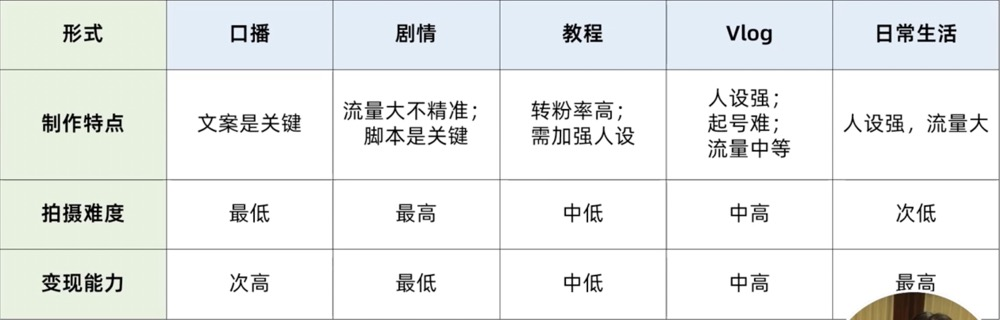
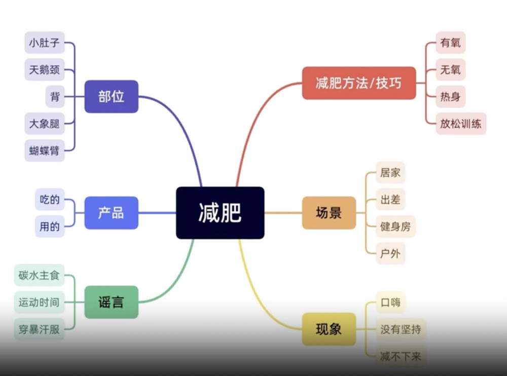
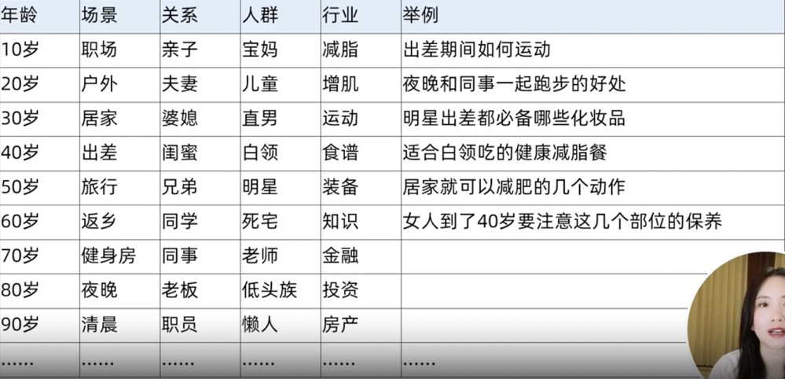
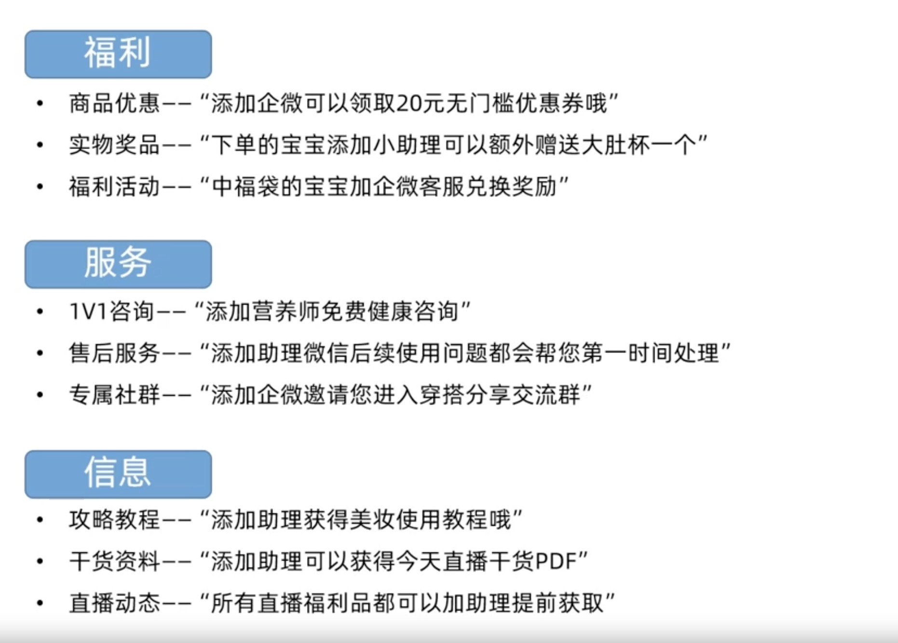

# 视频号基础

::: tip 第三方分析工具
友望`www.youwant.cn` 
百准`www.baizhun.cn` 
新视`https://xs.newrank.cn/home` 
视灯`www.shidengdata.com`
:::

## 违规词

::: tip
1.可引导关注视频号，微信号，企微等，不能给外站（抖音，淘宝）引流 
 
2.避免出现内容极限词 
（1）最 
例如：我最喜欢的一套，今天这场直播以最低价给到大家 
（2）一 
例如：本场直播产品销售仅此一天，抢到就是赚到，我敢说这款产品只有在我直播间出现，独一无二 
（3）与级/极相关的 
例如：顶级工艺，顶级做工，把细节做到了极致 
（4）首/家/国 
例如：独家配方，全国销量冠军，国家级产品，国家免检，国家级 
 
3.与品牌相关 
例如：大牌，王牌，奢侈，优秀，资深，领袖等 
 
4.与虚假相关 
例如：万能，祖传，特效，正品，100%含有xxx 
 
5.与权威相关 
例如：老字号，中国驰名商标，特供，质量免检，专家推荐 
 
6.与欺诈相关 
例如：恭喜获奖，点击领奖，全名免单 
 
7.涉嫌诱导消费者 
例如：秒杀，抢爆，不会再便宜了，错过就没有机会了 
 
8.与时间有关的 
（1）限时必须有具体时间，活动必须有明确时间 
（2）严禁使用随时结束，涨价，马上降价，恢复原价 
 
9.与医疗相关 
例如：全面调整人体内分泌平衡，增强或提高免疫力，助眠，失眠，滋阴补阳，壮阳，消炎，可促进新陈代谢，减少红血丝，产生优化细胞结构，修复受损肌肤，治愈（治愈系除外），抗炎，活血，解毒，抗敏，脱敏，减肥，清热解毒，清热祛湿，治疗，除菌，杀菌，抗菌，灭菌，防菌，消毒，排毒，防敏，柔敏，舒敏，缓敏，脱敏，褪敏，改善敏感肌肤，改善过敏现象，降低肌肤敏感度，镇定，镇静，理气，行气，活血，生肌肉，补血，安神，养脑，益气，通脉，胃胀蠕动，利尿，驱寒解毒，调节内分泌，延缓更年期，补肾，祛风，生发，防癌，抗癌，祛疤，降血压，防治高血压，治疗，改善内分泌，平衡荷尔蒙，防止卵巢及子宫的功能紊乱，去除体内毒素，吸附铅汞，除湿，润燥，治疗腋臭，治疗体臭，治疗阴臭，美容治疗，消除斑点，斑立净，无斑，治疗斑秃，逐层减退多种色斑，妊娠纹，毛发新生，毛发再生，生黑发，止脱，生发止脱，脂溢性脱发，病变性脱发，毛囊激活，酒糟鼻，伤口愈合清除毒素，缓解痉挛抽搐，减轻或缓解疾病症状，处方，药方，经××例临床观察具有明显效果，丘疹，脓疱，手癣，甲癣，体癣，头癣，股癣，脚癣，脚气，鹅掌癣，花斑癣，牛皮癣，传染性湿疹 
 
10.与化妆品虚假宣传有关 
例如：特效，高效，全效，强效，速效，速白，一洗白，XX天见效，XX周期见效，超强，激活，全方位，全面，安全，无毒，溶脂，吸脂，燃烧脂肪，瘦身，瘦脸，瘦腿，减肥，延年益寿，提高（保护）记忆力
:::

## 推流机制

`社交+兴趣+位置`  

::: tip 
社交---基于微信好友会不会互动，从而推荐给更多好友 
兴趣---基于你视频的主题，从大数据中匹配对这类主题感兴趣的用户 
位置---流量会给所在地多倾斜推荐一点点 
:::

::: tip 视频号权重数据 
第一层---点赞，转发 
第二层---完播率 
第三层---评论和增粉 
:::

## 对标账号分析框架

| 账号 | 账号A | 账号B |  账号C | 账号D | 账号E | 账号F | 账号G | 账号H | 账号I | 账号J| 
| ---- | ---- |---- |---- |---- |---- |---- |---- |---- |---- |---- |
| 账号名| | | | | | | | | | |
| 简介| | | | | | | | | | |
| 人设| | | | | | | | | | |
| 内容| | | | | | | | | | |
| 选题| | | | | | | | | | |
| 主题标签| | | | | | | | | | |
| 爆款标题| | | | | | | | | | |
| 封面| | | | | | | | | | |
| 视频风格| | | | | | | | | | |
| 发布频次| | | | | | | | | | |
| 引流方式| | | | | | | | | | |
| 粉丝量| | | | | | | | | | |
| 获赞与收藏| | | | | | | | | | |
| 变现方式| | | | | | | | | | |

## 账号内容形式对比

## 选题

::: tip 爆款选题法则-踩中群体共性
1.引起共鸣和认同---经历，观点 
2.引起欲望---食欲，爱欲 
3.实用价值---有用的信息/知识等 
4.娱乐搞笑---有趣的剧情，夸张的表现 
5.引起好奇---什么事情，为什么，什么时候 
6.共情走心---扎心的，动人的 
7.满足幻想---别人家的孩子/男朋友/老婆/宠物，爱情幻想，生活幻想，工作幻想 
8.感官刺激---视觉，听觉 
9.引起思考---生活感悟，人生哲理，工作启发等 
10.探索未知---新奇的事物，景色，人物，生活方式 
11.引起共鸣强烈冲突/反差---角色身份，观点认知的冲突，剧情反转等
:::

### 选题方法

::: tip
1.知识点延展 
 
 
2.排列组合法 
 
 
3.模仿对标账号---模仿不等于抄袭，账号初期，优先选择受众大的爆款选题，优先选择短内容，30秒以内的，能快速起量，建立信心，关注爆款视频的用户评论内容 
 
4.蹭热点选题---有三个纬度，蹭热门人物，蹭热门事件，蹭热门段子 
:::

## 十一个爆款标题模版

::: tip
1.疑问型---做视频号能赚钱吗？ 
2.独家型---首次揭秘视频号变现的5种方法 
3.紧迫性---你一定要知道的视频号快速变现的4个技巧 
4.速成型---3天教你成为视频号高手 
5.专业型---99%的人都在... 
6.数字型---3招教你搞定视频号拍摄 
7.必学型---做视频号必备的4大技巧5大工具 
8.办法型---视频号怎么做才能上热门 
9.一定型---一定不能/要 
10.痛点型---为什么你精心制作的视频没人看 
11.传授型---5个动作，教你30天暴瘦10斤 
:::

## 如何写出爆款短视频文案

`说用户喜欢的，决定了数据量多大，解决用户痛点，决定了关系的紧密`

::: tip 爆款短视频内容常见节奏
1.15秒的段子---3s要达内容高潮点，要把亮点前置，埋点前置 
 
2.30秒的段子---6s要达内容高潮点，18s或24s的时候出现反转 
 
3.60秒的段子---12s要达内容高潮点，40s反转一次，50s反转第二次 
 
:::

::: tip 爆款短视频脚本模板
1.搞笑剧情类 
`搞笑段子 = 熟悉场景 + 意外转折1 + 反转2` 
 
2.鸡汤励志类 
`心灵鸡汤 = 金句亮点 + 激昂斗志` 
 
3.单品种草类 
`单品种草 = 目标人群 + 痛点 + 亮点1 + 亮点2 + 亮点3` 
`单品种草 = 超赞单品 + 使用场景 + 非适用产品 + 总结` 
 
4.教育教学类 
`教程教学 = 提出问题 + 解决方案 + 展示总结` 
 
5.合集安利类 
`合集安利 = 使用场景 + 产品1 + 产品2 + 产品3` 
 
6.好书推荐类 
`好书推荐 = 时事热点/话题 引出书籍 + 书中佳句 + 总结` 
`好书推荐 = 提问 + 书籍介绍 + 佳句共鸣` 
 
7.知识分享类 
`知识分享 = 引出问题/事例 + 解决方法一二三 + 总结` 
`知识分享 = 提出话题 + 直接叙述` 
 
8.情感类 
`情感类 = 事例 + 情感语录/情感剖析` 
`情感类 = 电台情感文章朗读 + 情感共鸣` 
 
:::

## 公域引流到私域的方法

## 私域用户分层

::: tip
S---已经付费成单 
A---买了引流产品，很高意向转高客单价 
B---主动询问了产品价格，说考虑的 
C---听了价格说考虑或者无回复的 
D---没有聊到产品就结束了的 
:::

